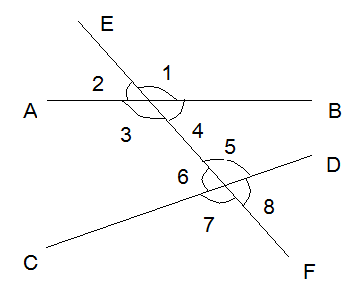

  

# 分隔

 

中考数学复习资料

2、算术平方根

正数a的正的平方根叫做a的算术平方根，记作“$$\sqrt{a}$$”。

$$a（a \geq 0） \sqrt{a} \geq 0 $$

$$\sqrt{a^{2}} = \left| a \right| =$$ ；注意$$\sqrt{a}$$的双重非负性：

\-$$a$$（$$a$$ \<0） $$a \geq$$0

（2）求差比较：设a、b是实数，

$$
a - b > 0 \Leftrightarrow a > b,
$$

$$
a - b = 0 \Leftrightarrow a = b,
$$

$$
a - b < 0 \Leftrightarrow a < b
$$

（3）求商比较法：设a、b是两正实数，$$\frac{a}{b} > 1 \Leftrightarrow a >
b;\frac{a}{b} = 1 \Leftrightarrow a = b;\frac{a}{b} < 1 \Leftrightarrow a < b;$$

（4）绝对值比较法：设a、b是两负实数，则$$\left| a \right| > \left| b \right|
\Leftrightarrow a < b$$。

（5）平方法：设a、b是两负实数，则$$a^{2} > b^{2} \Leftrightarrow a < b$$。

### 表格

| 等腰三角形的性质与判定 |                                                                                                                   |                                                                                                                                                   |
|------------------------|-------------------------------------------------------------------------------------------------------------------|---------------------------------------------------------------------------------------------------------------------------------------------------|
|                        | 等腰三角形性质                                                                                                    | 等腰三角形判定                                                                                                                                    |
| 中线                   | 1、等腰三角形底边上的中线垂直底边，平分顶角； 2、等腰三角形两腰上的中线相等，并且它们的交点与底边两端点距离相等。 | 1、两边上中线相等的三角形是等腰三角形； 2、如果一个三角形的一边中线垂直这条边（平分这个边的对角），那么这个三角形是等腰三角形                     |
| 角平分线               | 1、等腰三角形顶角平分线垂直平分底边； 2、等腰三角形两底角平分线相等，并且它们的交点到底边两端点的距离相等。       | 1、如果三角形的顶角平分线垂直于这个角的对边（平分对边），那么这个三角形是等腰三角形； 2、三角形中两个角的平分线相等，那么这个三角形是等腰三角形。 |
| 高线                   | 1、等腰三角形底边上的高平分顶角、平分底边； 2、等腰三角形两腰上的高相等，并且它们的交点和底边两端点距离相等。     | 1、如果一个三角形一边上的高平分这条边（平分这条边的对角），那么这个三角形是等腰三角形； 2、有两条高相等的三角形是等腰三角形。                     |
| 角                     | 等边对等角                                                                                                        | 等角对等边                                                                                                                                        |
| 边                     | 底的一半\<腰长\<周长的一半                                                                                        | 两边相等的三角形是等腰三角形                                                                                                                      |

3、一些特殊角的三角函数值

| 三角函数 | 0°     | 30°                  | 45°                  | 60°                  | 90°    |
| -------- | ------ | -------------------- | -------------------- | -------------------- | ------ |
| sinα     | 0      | $\frac{1}{2}$        | $\frac{\sqrt{2}}{2}$ | $\frac{\sqrt{3}}{2}$ | 1      |
| cosα     | 1      | $\frac{\sqrt{3}}{2}$ | $\frac{\sqrt{2}}{2}$ | $\frac{1}{2}$        | 0      |
| tanα     | 0      | $\frac{\sqrt{3}}{3}$ | 1                    | $\sqrt{3}$           | 不存在 |
| cotα     | 不存在 | $\sqrt{3}$           | 1                    | $\frac{\sqrt{3}}{3}$ | 0      |

4、各锐角三角函数之间的关系

（1）互余关系

sinA=cos(90°—A)，cosA=sin(90°—A)

tanA=cot(90°—A)，cotA=tan(90°—A)

