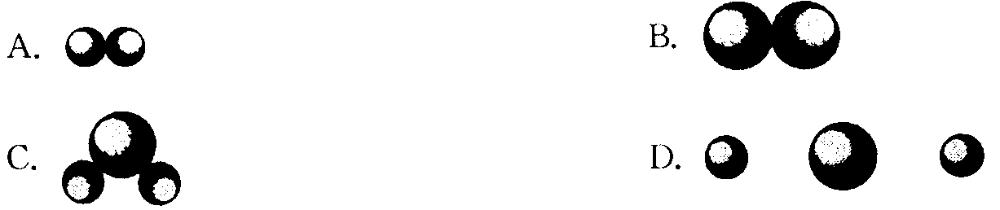
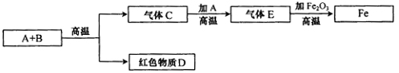

# 	初中化学

## **一、基本概念**

**1.化学变化：**生成了其他物质的变化

**2.物理变化：**没有生成其他物质的变化

**3.物理性质：**不需要发生化学变化就表现出来的性质

(如:颜色、状态、密度、气味、熔点、沸点、硬度、水溶性等)

**4.化学性质**：物质在化学变化中表现出来的性质

**(**如:可燃性、助燃性、氧化性、还原性、酸碱性、稳定性等)

**5.纯净**物：由一种物质组成

**6.混合物**：由两种或两种以上纯净物组成,各物质都保持原来的性质

**7.元素：**具有相同核电荷数(即质子数)的一类原子的总称

**8.原子**：是在化学变化中的最小粒子，在化学变化中不可再分

**9.分子**：是保持物质化学性质的最小粒子，在化学变化中可以再分

**10.单质**：由同种元素组成的纯净物

**11.化合物**：由不同种元素组成的纯净物

**12.氧化**物：由两种元素组成的化合物中,其中有一种元素是氧元素

**13.化学式**：用元素符号来表示物质组成的式子

**14.相对原子质量**：以一种碳原子的质量的1/12作为标准,其他原子的质量跟它比较所得的值

某原子的相对原子质量= 某原子的质量÷（一种碳原子的质量的1/12）

相对原子质量 ≈ 质子数 + 中子数 (因为原子的质量主要集中在原子核)

**15.相对分子质量**：化学式中各原子的相对原子质量的总和

**16.离子**：带有电荷的原子或原子团

**17.原子的结构**：原子核和核外电子

原子、离子的关系：原子得电子或失电子后能带上电荷,这种带电的原子叫做离子

**注**：在离子里，核电荷数 = 质子数 ≠ 核外电子数

**18.四种化学反应基本类型**：（见文末具体总结）

①化合反应： 由两种或两种以上物质生成一种物质的反应。

如：A + B = AB

②分解反应：由一种物质生成两种或两种以上其他物质的反应。

如：AB = A + B

③置换反应：由一种单质和一种化合物起反应，生成另一种单质和另一种化合物的反应。

如：A + BC = AC + B

④复分解反应：由两种化合物相互交换成分，生成另外两种化合物的反应。

如：AB + CD = AD + CB

**19.还原反应：**在反应中，含氧化合物的氧被夺去的反应(不属于化学的基本反应类型)。

氧化反应：物质跟氧发生的化学反应(不属于化学的基本反应类型) 。

缓慢氧化：进行得很慢的,甚至不容易察觉的氧化反应。

自燃：由缓慢氧化而引起的自发燃烧。

**20.催化剂**：在化学变化里能改变其他物质的化学反应速率,而本身的质量和化学性在化学变化前后都没有变化的物质（注：$2H_2O_2
=== 2H_2O + O_2 ↑$ 此反应$MnO_2$是催化剂）

**21.质量守恒定律**：参加化学反应的各物质的质量总和，等于反应后生成物质的质量总和。

（反应的前后，原子的数目、种类、质量都不变；元素的种类也不变）

**22.溶液**：一种或几种物质分散到另一种物质里，形成均一的、稳定的混合物

溶液的组成：溶剂和溶质。（溶质可以是固体、液体或气体；固、气溶于液体时，固、气是溶质，液体是溶剂；两种液体互相溶解时，量多的一种是溶剂，量少的是溶质；当溶液中有水存在时，不论水的量有多少，我们习惯上都把水当成溶剂，其他为溶质。）

**23.固体溶解度：**在一定温度下，某固态物质在溶剂里达到饱和状态时所溶解的质量，就叫做这种物质在这种溶剂里的溶解度

**24.酸：**电离时生成的阳离子全部都是氢离子的化合物

如：$HCl==H^+ + Cl^－$

$HNO3==H^+ + NO_3^－$

$H_2SO_4==2H^+ + SO_4^{2－}$

**碱：**电离时生成的阴离子全部都是氢氧根离子的化合物

如：$KOH==K^+ + OH^－$

$NaOH==Na^+ + OH^－$

$Ba(OH)_2==Ba_2^+ + 2OH^－$

**盐：**电离时生成金属离子和酸根离子的化合物

如：$KNO3==K^+ + NO_3^－$

$Na_2SO_4==2Na^+ + SO_4^{2－}$

$BaCl2==Ba2^+ + 2Cl^－$

**25.酸性氧化物**（不一定属于非金属氧化物）**：**凡能跟碱起反应，生成盐和水的氧化物。

碱性氧化物（属于金属氧化物）：凡能跟酸起反应，生成盐和水的氧化物。

**26.结晶水合物**：含有结晶水的物质（如：$Na_2CO_3·10H_2O$、$CuSO_4·5H_2O$）$FeSO_4·7H_2O$

**27.潮解**：某物质能吸收空气里的水分而变潮的现象。

风化：结晶水合物在常温下放在干燥的空气里，能逐渐失去结晶水而成为粉末的现象。

**28.燃烧**：可燃物跟氧气发生的一种发光发热的剧烈的氧化反应。

燃烧的条件：①可燃物；②氧气(或空气)；③可燃物的温度要达到着火点。

## **二、基本知识、理论**

**1.空气的成分**

氮气占78%, 氧气占21%, 稀有气体占0.94%, 二氧化碳占0.03%,其他气体与杂质占0.03% 。

**2.主要的空气污染物**

NO2 、CO、SO2、H2S、NO等物质 。

**3.其他常见气体的化学式**

NH3（氨气）、CO（一氧化碳）、CO2（二氧化碳）、CH4（甲烷）、
SO2（二氧化硫）、SO3（三氧化硫）、NO（一氧化氮）、
NO2（二氧化氮）、H2S（硫化氢）、HCl（氯化氢）。

**4.常见的酸根或离子**

SO42－(硫酸根)、NO3－(硝酸根)、CO32－(碳酸根)、ClO3－(氯酸根)、
MnO4－(高锰酸根)、MnO42－(锰酸根)、PO43－(磷酸根)、Cl－(氯离子)、
HCO3－(碳酸氢根)、HSO4－(硫酸氢根)、HPO42－(磷酸氢根)、
H2PO4－(磷酸二氢根)、OH－(氢氧根)、HS－(硫氢根)、S2－(硫离子)、
NH4+(铵根或铵离子)、K+(钾离子)、Ca2+(钙离子)、Na+(钠离子)、
Mg2+(镁离子)、Al3+(铝离子)、Zn2+(锌离子)、Fe2+(亚铁离子)、
Fe3+(铁离子)、Cu2+(铜离子)、Ag+(银离子)、Ba2+(钡离子)

各元素或原子团的化合价与上面离子的电荷数相对应：

一价钾钠氢和银，二价钙镁钡和锌；

一二铜汞二三铁，三价铝来四价硅。（氧－2，氯化物中的氯为 －1，氟－1，溴为－1）

（单质中，元素的化合价为0 ；在化合物里，各元素的化合价的代数和为0）

**5.化学式和化合价**

**（1）化学式的意义**

①宏观意义

a.表示一种物质；

b.表示该物质的元素组成；

②微观意义

a.表示该物质的一个分子；

b.表示该物质的分子构成；

③量的意义

a.表示物质的一个分子中各原子个数比；

b.表示组成物质的各元素质量比。

**（2）单质化学式的读写**

①直接用元素符号表示的：

a.金属单质。如：钾K 铜Cu 银Ag 等；

b.固态非金属。如：碳C 硫S 磷P 等

c.稀有气体。如：氦(气)He 氖(气)Ne 氩(气)Ar等

②多原子构成分子的单质：其分子由几个同种原子构成的就在元素符号右下角写几。

如：每个氧气分子是由2个氧原子构成，则氧气的化学式为O2

双原子分子单质化学式：O2（氧气）、N2（氮气） 、H2（氢气）
F2（氟气）、Cl2（氯气）、Br2（液态溴）

多原子分子单质化学式：臭氧O3等

**（3）化合物化学式的读写：先读的后写，后写的先读**

①两种元素组成的化合物：读成“某化某”，如：MgO（氧化镁）、NaCl（氯化钠）

②酸根与金属元素组成的化合物：读成“某酸某”，如：KMnO4（高锰酸钾）、K2MnO4（锰酸钾）
MgSO4（硫酸镁）、CaCO3（碳酸钙）

**（4）根据化学式判断元素化合价，根据元素化合价写出化合物的化学式：**

①判断元素化合价的依据是：化合物中正负化合价代数和为零。

②根据元素化合价写化学式的步骤：

a.按元素化合价正左负右写出元素符号并标出化合价；

b.看元素化合价是否有约数，并约成最简比；

c.交叉对调把已约成最简比的化合价写在元素符号的右下角。

**6.核外电子排布**：1－20号元素（要记住元素的名称及原子结构示意图）

排布规律

①每层最多排2n^2个电子（*n*表示层数）

②最外层电子数不超过8个（最外层为第一层不超过2个）

③先排满内层再排外层

注：元素的化学性质取决于最外层电子数

金属元素 原子的最外层电子数\< 4，易失电子，化学性质活泼。

非金属元素 原子的最外层电子数≥ 4，易得电子，化学性质活泼。

稀有气体元素 原子的最外层有8个电子（He有2个），结构稳定，性质稳定。

**7.书写化学方程式的原则**

①以客观事实为依据； ②遵循质量守恒定律

书写化学方程式的步骤：“写”、“配”、“注”“等”。

**8.酸碱度的表示方法——pH**

说明：（1）pH=7，溶液呈中性；pH \<7，溶液呈酸性；pH \>7，溶液呈碱性。

（2）pH越接近0，酸性越强；pH越接近14，碱性越强；pH越接近7，溶液的酸、碱性就越弱，越接近中性。

**9.金属活动性顺序表：**

（钾、钙、钠、镁、铝、锌、铁、锡、铅、氢、铜、汞、银、铂、金）

说明：（1）越左金属活动性就越强，左边的金属可以从右边金属的盐溶液中置换出该金属出来；

（2）排在氢左边的金属，可以从酸中置换出氢气；排在氢右边的则不能。

## **三、物质俗名及其对应的化学式和化学名**

⑴金刚石、石墨：C

⑵水银、汞：Hg

(3)生石灰、氧化钙：CaO

(4)干冰（固体二氧化碳）：CO2

(5)盐酸、氢氯酸：HCl

(6)亚硫酸：H2SO3

(7)氢硫酸：H2S

(8)熟石灰、消石灰：Ca(OH)2

(9)苛性钠、火碱、烧碱：NaOH

(10)纯碱：Na2CO3 碳酸钠晶体、纯碱晶体：Na2CO3·10H2O

(11)碳酸氢钠、酸式碳酸钠：NaHCO3 (也叫小苏打）

(12)胆矾、蓝矾、硫酸铜晶体：CuSO4·5H2O

(13)铜绿、孔雀石：Cu2(OH)2CO3（分解生成三种氧化物的物质）

(14)甲醇：CH3OH 有毒、失明、死亡

(15)酒精、乙醇：C2H5OH

(16)醋酸、乙酸（冰醋酸）CH3COOH（CH3COO－ 醋酸根离子） 具有酸的通性

(17)氨气：NH3 （碱性气体）

(18)氨水、一水合氨：NH3·H2O（为常见的碱，具有碱的通性，是一种不含金属离子的碱）

(19)亚硝酸钠：NaNO2 （工业用盐、有毒）

## **四、常见物质的颜色的状态**

1.白色固体：MgO、P2O5、CaO、
NaOH、Ca(OH)2、KClO3、KCl、Na2CO3、NaCl、无水CuSO4；铁、镁为银白色（汞为银白色液态）

2.黑色固体：石墨、炭粉、铁粉、CuO、MnO2、Fe3O4、KMnO4为紫黑色 。

3.红色固体：Cu、Fe2O3 、HgO、红磷▲硫：淡黄色▲ Cu2(OH)2CO3为绿色

4.溶液的颜色：凡含Cu2+的溶液呈蓝色；凡含Fe2+的溶液呈浅绿色；凡含Fe3+的溶液呈棕黄色，其余溶液一般为无色。（高锰酸钾溶液为紫红色）

5.沉淀(即不溶于水的盐和碱）：

①盐：白色↓：CaCO3、BaCO3（溶于酸） AgCl、BaSO4(不溶于稀HNO3) 等

②碱：蓝色↓：Cu(OH)2 红褐色↓：Fe(OH)3 白色↓：Mg(OH)2。

6.（1）具有刺激性气体的气体：NH3、SO2、HCl（皆为无色）

（2）无色无味的气体：O2、H2、N2、CO2、CH4、CO（剧毒）

▲注意：具有刺激性气味的液体：盐酸、硝酸、醋酸。酒精为有特殊气体的液体。

7.有毒的，气体：CO 液体：CH3OH；固体：NaNO2 CuSO4(可作杀菌剂,与熟石灰混合配成天蓝色的粘稠状物质——**波尔多液**)

## **五、物质的溶解性**

**1.盐的溶解性**

含有钾、钠、硝酸根、铵根的物质都溶于水；

含Cl的化合物只有AgCl不溶于水，其他都溶于水；

含SO42－ 的化合物只有BaSO4 不溶于水，其他都溶于水。

含CO32－ 的物质只有K2CO3、Na2CO3、(NH4)2CO3溶于水，其他都不溶于水

**2.碱的溶解性**

溶于水的碱有：氢氧化钡、氢氧化钾、氢氧化钙、氢氧化钠和氨水，其他碱不溶于水。

难溶性碱中Fe(OH)3是红褐色沉淀，Cu(OH)2是蓝色沉淀，其他难溶性碱为白色。（包括Fe(OH)2）注意：沉淀物中AgCl和BaSO4
不溶于稀硝酸，其他沉淀物能溶于酸。如：Mg(OH)2 CaCO3 BaCO3 Ag2CO3 等

**3.大部分酸及酸性氧化物能溶于水，**（酸性氧化物＋水→酸）大部分碱性氧化物不溶于水，能溶的有：氧化钡、氧化钾、氧化钙、氧化钠（碱性氧化物＋水→碱）

## **六、化学之最**

1.地壳中含量最多的金属元素是铝。

2.地壳中含量最多的非金属元素是氧。

3.空气中含量最多的物质是氮气

4.天然存在最硬的物质是金刚石。

5.最简单的有机物是甲烷。

6.金属活动顺序表中活动性最强的金属是钾。

7.相对分子质量最小的氧化物是水。 最简单的有机化合物CH4

8.相同条件下密度最小的气体是氢气。

9.导电性最强的金属是银。

10.相对原子质量最小的原子是氢。

11.熔点最小的金属是汞。

12.人体中含量最多的元素是氧。

13.组成化合物种类最多的元素是碳。

14.日常生活中应用最广泛的金属是铁。

15.最早利用天然气的是中国。

16中国最大煤炭基地在：山西省。

17最早运用湿法炼铜的是中国（西汉发现[刘安《淮南万毕术》“曾青得铁则化为铜”
]、宋朝应用）。

18最早发现电子的是英国的汤姆生。

19最早得出空气是由N2和O2组成的是法国的拉瓦锡。

## **七、解题技巧和说明**

**（一） 推断题解题技巧**

**看其颜色，观其状态，察其变化，初代验之，验而得之。**

1. 常见物质的颜色：多数气体为无色，多数固体化合物为白色，多数溶液为无色。

2. 一些特殊物质的颜色：

黑色：MnO2、CuO、Fe3O4、C、FeS（硫化亚铁）

蓝色：CuSO4•5H2O、Cu(OH)2. CuCO3.含Cu2+ 溶液、 液态固态O2（淡蓝色）

红色：Cu（亮红色）、Fe2O3（红棕色）、红磷（暗红色）

黄色：硫磺（单质S）、含Fe3+ 的溶液（棕黄色）

绿色：FeSO4•7H2O、含Fe2+ 的溶液（浅绿色）、碱式碳酸铜[Cu2(OH)2CO3]

无色气体：N2、CO2、CO、O2、H2、CH4

有色气体：Cl2（黄绿色）、NO2（红棕色）

有刺激性气味的气体：NH3(此气体可使湿润pH试纸变蓝色)、SO2

有臭鸡蛋气味：H2S

3. 常见一些变化的判断：

① 白色沉淀且不溶于稀硝酸或酸的物质有：BaSO4、AgCl（就这两种物质）

② 蓝色沉淀：Cu(OH)2、CuCO3

③ 红褐色沉淀：Fe(OH)3

Fe(OH)2为白色絮状沉淀，但在空气中很快变成灰绿色沉淀，再变成Fe(OH)3红褐色沉淀；

④沉淀能溶于酸并且有气体（CO2）放出的：不溶的碳酸盐；

⑤沉淀能溶于酸但没气体放出的：不溶的碱。

4. 酸和对应的酸性氧化物的联系：

① 酸性氧化物和酸都可跟碱反应生成盐和水：

CO2 + 2NaOH == Na2CO3 + H2O（H2CO3 + 2NaOH == Na2CO3 + 2H2O）

SO2 + 2KOH == K2SO3 + H2O

H2SO3 + 2KOH == K2SO3 + 2H2O

SO3 + 2NaOH == Na2SO4 + H2O

H2SO4 + 2NaOH == Na2SO4 + 2H2O

② 酸性氧化物跟水反应生成对应的酸：（各元素的化合价不变）

CO2 + H2O == H2CO3 SO2 + H2O == H2SO3

SO3 + H2O == H2SO4 N2O5 + H2O == 2HNO3

(说明这些酸性氧化物气体都能使湿润pH试纸变红色)

5. 碱和对应的碱性氧化物的联系：

① 碱性氧化物和碱都可跟酸反应生成盐和水：

CuO + 2HCl == CuCl2 + H2O

Cu(OH)2 + 2HCl == CuCl2 + 2H2O

CaO + 2HCl == CaCl2 + H2O

Ca(OH)2 + 2HCl == CaCl2 + 2H2O

②碱性氧化物跟水反应生成对应的碱：（生成的碱一定是可溶于水，否则不能发生此反应）

K2O + H2O == 2KOH Na2O +H2O == 2NaOH

BaO + H2O == Ba(OH)2 CaO + H2O == Ca(OH)2

③不溶性碱加热会分解出对应的氧化物和水：

Mg(OH)2 == MgO + H2O Cu(OH)2 == CuO + H2O

2Fe(OH)3 == Fe2O3 + 3H2O 2Al(OH)3 == Al2O3 + 3H2O

**(二) 解实验题**

**看清题目要求是什么，要做的是什么，这样做的目的是什么。**

**1.实验用到的气体要求是比较纯净，除去常见杂质具体方法：**

①
除水蒸气可用：浓流酸、CaCl2固体、碱石灰、无水CuSO4(并且可以检验杂质中有无水蒸气，有则颜色由白色→蓝色)、生石灰等;

② 除CO2可用：澄清石灰水（可检验出杂质中有无CO2）、NaOH溶液、KOH溶液、碱石灰等;

③ 除HCl气体可用：AgNO3溶液（可检验出杂质中有无HCl）、石灰水、NaOH溶液、KOH溶液;

除气体杂质的原则：用某物质吸收杂质或跟杂质反应，但不能吸收或跟有效成份反应，或者生成新的杂质。

**2.实验注意的地方：**

①防爆炸：点燃可燃性气体（如H2、CO、CH4）或用CO、H2还原CuO、Fe2O3之前，要检验气体纯度。

②防暴沸：稀释浓硫酸时，将浓硫酸倒入水中，不能把水倒入浓硫酸中。

③防中毒：进行有关有毒气体（如：CO、SO2、NO2）的性质实验时，在通风厨中进行；并要注意尾气的处理：CO点燃烧掉；
SO2、NO2用碱液吸收。

④防倒吸：加热法制取并用排水法收集气体，要注意熄灯顺序。

**3.常见意外事故的处理：**

①酸流到桌上，用NaHCO3冲洗；碱流到桌上，用稀醋酸冲洗。

② 沾到皮肤或衣物上：

Ⅰ.酸先用水冲洗，再用3\~5% NaHCO3冲洗；

Ⅱ.碱用水冲洗，再涂上硼酸；

Ⅲ.浓硫酸应先用抹布擦去，再做第Ⅰ步。

**4.实验室制取三大气体中常见的要除的杂质：**

(1)制O2要除的杂质：水蒸气（H2O）

(2)用盐酸和锌粒制H2要除的杂质：水蒸气（H2O）、氯化氢气体（HCl，盐酸酸雾）（用稀硫酸没此杂质）

(3)制CO2要除的杂质：水蒸气（H2O）、氯化氢气体（HCl）

除水蒸气的试剂：浓流酸、CaCl2固体、碱石灰（主要成份是NaOH和CaO）、生石灰、无水CuSO4(并且可以检验杂质中有无水蒸气，有则颜色由白色→蓝色)等;

除HCl气体的试剂：AgNO3溶液（并可检验出杂质中有无HCl）、澄清石灰水、NaOH溶液（或固体）、KOH溶液（或固体）;[生石灰、碱石灰也可以跟HCl气体反应]

**5.常用实验方法来验证混合气体里含有某种气体**

(1)有CO的验证方法：（先验证混合气体中是否有CO2，有则先除掉）

将混合气体通入灼热的CuO，再将经过灼热的CuO的混合气体通入澄清石灰水。现象：黑色CuO变成红色，且澄清石灰水要变浑浊。

(2)有H2的验证方法：（先验证混合气体中是否有水份，有则先除掉）

将混合气体通入灼热的CuO，再将经过灼热的CuO的混合气体通入盛有无水CuSO4中。现象：黑色CuO变成红色，且无水CuSO4变蓝色。

(3)有CO2的验证方法：将混合气体通入澄清石灰水。现象：澄清石灰水变浑浊。

**6.设计实验**

(1)试设计一个实验证明蜡烛中含有碳氢两种元素。

实验步骤-实验现象-结论

①将蜡烛点燃，在火焰上方罩一个干燥洁净的烧杯，烧杯内壁有小水珠生成，证明蜡烛有氢元素。

②在蜡烛火焰上方罩一个蘸有澄清石灰水的烧杯，澄清石灰水变浑浊，证明蜡烛有碳元素。

（2）试设计一个实验来证明CO2具有不支持燃烧和密度比空气大的性质。

实验步骤-实验现象-结论-图

把两支蜡烛放到具有阶梯的架上，把此架放在烧杯里，点燃蜡烛，再沿烧杯壁倾倒CO2
阶梯下层的蜡烛先灭，上层的后灭。 证明CO2具有不支持燃烧和密度比空气大的性质。

**7.解题：**

计算题的类型有

a．有关质量分数（元素和溶质）的计算

b．根据化学方程式进行计算

c．由a和b两种类型混合在一起计算

（1）溶液中溶质质量分数的计算

溶质质量分数 =溶质的质量/溶液的质量 × 100%

（2）化合物（纯净物）中某元素质量分数的计算

某元素质量分数=某元素的原子质量和/化合物的质量 × 100%

（3）混合物中某化合物的质量分数计算

化合物的质量分数= 某化合物的质量/混合物的质量× 100%

（4）混合物中某元素质量分数的计算

某元素质量分数=某元素的质量和/混合物的质量 × 100%

或：某元素质量分数= 化合物的质量分数 × 该元素在化合物中的质量分数

（5）解题技巧

a.审题：看清题目的要求，已知什么，求什么，有化学方程式的先写出化学方程式。找出解此题的有关公式。

b.根据化学方程式计算的解题步骤：

①设未知量

②书写出正确的化学方程式

③写出有关物质的相对分子质量、已知量、未知量

④列出比例式，求解

⑤答。

## **八、初中化学中的“三”**

1.构成物质的三种微粒是分子、原子、离子。

2.还原氧化铜常用的三种还原剂氢气、一氧化碳、碳。

3.氢气作为燃料有三大优点：资源丰富、发热量高、燃烧后的产物是水不污染环境。

4.构成原子一般有三种微粒：质子、中子、电子。

5.黑色金属只有三种：铁、锰、铬。

6.构成物质的元素可分为三类即(1)金属元素、(2)非金属元素、(3)稀有气体元素。

7.铁的氧化物有三种，其化学式为(1)FeO、(2)Fe2O3、(3) Fe3O4。

8.溶液的特征有三个(1)均一性；(2)稳定性；(3)混合物。

9.化学方程式有三个意义：

(1)表示什么物质参加反应，结果生成什么物质；

(2)表示反应物、生成物各物质间的分子或原子的微粒数比；

(3)表示各反应物、生成物之间的质量比。化学方程式有两个原则：以客观事实为依据；遵循质量守恒定律。

10.生铁一般分为三种：白口铁、灰口铁、球墨铸铁。

11.碳素钢可分为三种：高碳钢、中碳钢、低碳钢。

12.常用于炼铁的铁矿石有三种：(1)赤铁矿(主要成分为Fe2O3)；(2)磁铁矿(Fe3O4)；(3)菱铁矿(FeCO3)。

13.炼钢的主要设备有三种：转炉、电炉、平炉。

14.常与温度有关的三个反应条件是点燃、加热、高温。

15.饱和溶液变不饱和溶液有两种方法：（1）升温、（2）加溶剂；不饱和溶液变饱和溶液有三种方法：降温、加溶质、恒温蒸发溶剂。
（注意：溶解度随温度而变小的物质如：氢氧化钙溶液由饱和溶液变不饱和溶液：降温、加溶剂；不饱和溶液变饱和溶液有三种方法：升温、加溶质、恒温蒸发溶剂）。

16.收集气体一般有三种方法：排水法、向上排空法、向下排空法。

17.水污染的三个主要原因：(1)工业生产中的废渣、废气、废水；(2)生活污水的任意排放；(3)农业生产中施用的农药、化肥随雨水流入河中。

18.应记住的三种黑色氧化物是：氧化铜、二氧化锰、四氧化三铁。

19.氢气和碳单质有三个相似的化学性质：常温下的稳定性、可燃性、还原性。

20.教材中出现的三次淡蓝色：

(1)液态氧气是淡蓝色；

(2)硫在空气中燃烧有微弱的淡蓝色火焰；

(3)氢气在空气中燃烧有淡蓝色火焰。

21.与铜元素有关的三种蓝色：(1)硫酸铜晶体；(2)氢氧化铜沉淀；(3)硫酸铜溶液。

22.过滤操作中有“三靠”：

(1)漏斗下端紧靠烧杯内壁；

(2)玻璃棒的末端轻靠在滤纸三层处；

(3)盛待过滤液的烧杯边缘紧靠在玻璃捧引流。

23.三大气体污染物：SO2、CO、NO2

24.酒精灯的火焰分为三部分：外焰、内焰、焰心，其中外焰温度最高。

25.取用药品有“三不”原则：

(1)不用手接触药品；(2)不把鼻子凑到容器口闻气体的气味；(3)不尝药品的味道。　　

26.古代三大化学工艺：造纸、制火药、烧瓷器

27.可以直接加热的三种仪器：试管、坩埚、蒸发皿（另外还有燃烧匙）

29.质量守恒解释的原子三不变：种类不改变、数目不增减、质量不变化

30.与空气混合点燃可能爆炸的三种气体：H2、CO、CH4
（实际为任何可燃性气体和粉尘）。

31.浓硫酸三特性：吸水、脱水、强氧化

32.使用酒精灯的三禁止：对燃、往燃灯中加酒精、嘴吹灭

33.溶液配制的三步骤：计算、称量（量取）、溶解

34.生物细胞中含量最多的前三种元素：O、C、H

35.原子中的三等式：核电荷数=质子数=核外电子数＝原子序数

36.构成物质的三种粒子：分子、原子、离子

37.工业三废：废水、废渣、废气

38.水污染的三个主要原因：

(1)工业生产中的废渣、废气、废水；

(2)生活污水的任意排放；

(3)农业生产中施用的农药、化肥随雨水流入河中。

39.通常使用的灭火器有三种：泡沫灭火器；干粉灭火器；液态二氧化碳灭火器。

40.固体物质的溶解度随温度变化的情况可分为三类：

(1)大部分固体物质溶解度随温度的升高而增大；

(2)少数物质溶解度受温度的影响很小；

(3)极少数物质溶解度随温度的升高而减小。

41.CO2可以灭火的原因有三个：不能燃烧、不能支持燃烧、密度比空气大。

## **九、化学中的“一定”与“不一定”**

1.化学变化中一定有物理变化，物理变化中不一定有化学变化。

2.金属常温下不一定都是固体（如Hg是液态的），非金属不一定都是气体或固体（如Br2是液态的）注意：金属、非金属是指单质，不能与物质组成元素混淆

3.原子团一定是带电荷的离子，但原子团不一定是酸根（如NH4+、OH－）；

酸根也不一定是原子团（如Cl－叫氢氯酸根）

4.缓慢氧化不一定会引起自燃。燃烧一定是化学变化。爆炸不一定是化学变化。（例如高压锅爆炸是物理变化。）

5.原子核中不一定都会有中子（如H原子就无中子）。

6.原子不一定比分子小（不能说“分子大，原子小”）

分子和原子的根本区别是：在化学反应中分子可分原子不可分。

7.同种元素组成的物质不一定是单质，也可能是几种单质的混合物。

8.最外层电子数为8的粒子不一定是稀有气体元素的原子，也可能是阳离子或阴离子。

9.稳定结构的原子最外层电子数不一定是8。（第一层为最外层2个电子）

10.具有相同核电荷数的粒子不一定是同一种元素。

（因为粒子包括原子、分子、离子，而元素不包括多原子所构成的分子或原子团）只有具有相同核电荷数的单核粒子（一个原子一个核）一定属于同种元素。

11.溶液中不一定：

（1）浓溶液不一定是饱和溶液；稀溶液不一定是不饱和溶液。（对不同溶质而言）

（2）同一种物质的饱和溶液不一定比不饱和溶液浓。（因为温度没确定，如同温度则一定）

（3）析出晶体后的溶液一定是某物质的饱和溶液。饱和溶液降温后不一定有晶体析出。

（4）一定温度下，任何物质的溶解度数值一定大于其饱和溶液的溶质质量分数数值，即*S*一定大于*C*。

13.有单质和化合物参加或生成的反应，不一定就是置换反应。但一定有元素化合价的改变。

14.分解反应和化合反应中不一定有元素化合价的改变；置换反应中一定有元素化合价的改变；复分解反应中一定没有元素化合价的改变。（注意：氧化还原反应，一定有元素化合价的变化）

15.单质一定不会发生分解反应。

16.同种元素在同一化合物中不一定显示一种化合价。如NH4NO3
（前面的N为－3价，后面的N为+5价）

17.盐的组成中不一定有金属元素，如NH4+是阳离子，具有金属离子的性质，但不是金属离子。

18.阳离子不一定是金属离子。如H+、NH4+。

19.在化合物（氧化物、酸、碱、盐）的组成中，一定含有氧元素的是氧化物和碱；不一定（可能）含氧元素的是酸和盐；一定含有氢元素的是酸和碱；不一定含氢元素的是盐和氧化物；盐和碱组成中不一定含金属元素，（如NH4NO3、NH3·H2O）；酸组成可能含金属元素（如：HMnO4
叫高锰酸），但所有物质组成中都一定含非金属元素。

20.盐溶液不一定呈中性。如Na2CO3溶液显碱性。

21.酸式盐的溶液不一定显酸性（即pH不一定小于7），如NaHCO3溶液显碱性。但硫酸氢钠溶液显酸性（NaHSO4
=Na++H+ +SO42－)，所以能电离出氢离子的物质不一定是酸。

22.
酸溶液一定为酸性溶液，但酸性溶液不一定是酸溶液，如：H2SO4、NaHSO4溶液都显酸性，而
NaHSO4属盐。（酸溶液就是酸的水溶液，酸性溶液就是指含H+的溶液）

23.碱溶液一定为碱性溶液，但碱性溶液不一定是碱溶液。如：NaOH、Na2CO3、NaHCO3溶液都显碱性，而Na2CO3、NaHCO3为盐。碱溶液就是碱的水溶液，碱性溶液就是指含OH－的溶液）

24.碱性氧化物一定是金属氧化物，金属氧化物不一定是碱性氧化物。

（如Mn2O7是金属氧化物，但它是酸氧化物，其对应的酸是高锰酸，即HMnO4）；记住：碱性氧化物中只K2O、Na2O、BaO、CaO能溶于水与水反应生成碱。

25.酸性氧化物不一定是非金属氧化物（如Mn2O7），非金属氧化物也不一定是酸性氧化物（如H2O、CO、NO）。

★常见的酸性氧化物：CO2、SO2、SO3、P2O5、SiO2
等，酸性氧化物大多数能溶于水并与水反应生成对应的酸，记住二氧化硅（SiO2）不溶于水
。

26.生成盐和水的反应不一定是中和反应。

27.所有化学反应并不一定都属基本反应类型，不属基本反应的有：

①CO与金属氧化物的反应；②酸性氧化物与碱的反应；③有机物的燃烧。

28.凡是单质铁参加的置换反应（铁与酸、盐的反应），反应后铁一定显+2价（即生成亚铁盐）。

29.凡金属与酸发生的置换反应，反应后溶液的质量一定增加。

凡金属与盐溶液反应，判断反应前后溶液的质量变化，只要看参加反应金属的相对原子质量大小与生成的金属的相对原子质量的大小。“大换小增重，小换大减重”

30.凡是同质量同价态的金属与酸反应，相对原子质量越大的产生氢气的质量就越少。

31.凡常温下能与水反应的金属（如K、Ca、Na），就一定不能与盐溶液发生置换反应；但它们与酸反应是最为激烈的。

如Na加入到CuSO4溶液中，发生的反应是：

2Na+2H2O =2NaOH+H2 ↑；2NaOH+CuSO4 =Cu(OH)2 ↓+Na2SO4 。

31.凡是排空气法（无论向上还是向下），都一定要将导气管伸到集气瓶底部。

32.制备气体的发生装置，在装药品前一定要检查气密性。

点燃或加热可燃性气体之前一定要检验纯度.

33.书写化学式时，正价元素不一定都写在左边。如NH3 、CH4

某物质放入水中，充分溶解后，所得溶液的溶质质量分数不一定等于5%。

可能等于5%，如NaCl、KNO3 等；也可能大于5%，如K2O、Na2O、BaO、SO3
等；也可能小于5%，如结晶水合物以及Ca(OH)2、CaO 等。

## **十、化学实验总结**

三种气体的实验室制法以及它们的区别。

**气体** 氧气（O2） 氢气（H2） 二氧化碳（CO2）

1.**药品** 高锰酸钾（KMnO4）或双氧水（H2O2）和二氧化锰（MnO2）[固（+固）]或[固+液]

锌粒（Zn）和盐酸（HCl）或稀硫酸（H2SO4）[固+液] 

石灰石（大理石）（CaCO3）和稀盐酸（HCl）[固+液]

**2.反应原理** 2KMnO4 == K2MnO4+MnO2+O2↑

或2H2O2==== 2H2O+O2↑ Zn+H2SO4=ZnSO4+H2↑

Zn+2HCl=ZnCl2+H2↑ CaCO3+2HCl=CaCl2+H2O+CO2↑

**3.检验**
用带火星的木条,伸进集气瓶,若木条复燃,是氧气，否则不是氧气；点燃木条，伸入瓶内，木条上的火焰熄灭，瓶口火焰呈淡蓝色，则该气体是氢气；通入澄清的石灰水，看是否变浑浊，若浑浊则是CO2。

**4.收集方法**

氧气（O2）①排水法(不易溶于水) ②瓶口向上排空气法(密度比空气大)

氢气（H2）①排水法(难溶于水) ②瓶口向下排空气法(密度比空气小)

二氧化碳（CO2）①瓶口向上排空气法 (密度比空气大) （不能用排水法收集）

**5.验满**(**验纯**)

氧气（O2）用带火星的木条,平放在集气瓶口,若木条复燃,氧气已满,否则没满。

氢气（H2）
\<1\>用拇指堵住集满氢气的试管口；\<2\>靠近火焰,移开拇指点火若“噗”的一声，氢气已纯；若有尖锐的爆鸣声，则氢气不纯。

二氧化碳（CO2）用燃着的木条,平放在集气瓶口,若火焰熄灭,则已满；否则没满。

**6.放置** 正放 倒放

**7.注意事项**

(1)制备氧气（O2）

①检查装置的气密性

(当用第一种药品制取时以下要注意)

②试管口要略向下倾斜(防止凝结在试管口的小水珠倒流入试管底部使试管破裂)

③加热时应先使试管均匀受热，再集中在药品部位加热。

④排水法收集完氧气后,先撤导管后撤酒精灯(防止水槽中的水倒流,使试管破裂)

(2)制备氢气（H2）

①检查装置的气密性

②长颈漏斗的管口要插入液面下；

③点燃氢气前，一定要检验氢气的纯度（空气中，氢气的体积达到总体积的4%\~74.2%点燃会爆炸。）

(3)制备二氧化碳（CO2）

①检查装置的气密性

②长颈漏斗的管口要插入液面下；

③不能用排水法收集

**8.常见气体的性质**

（1）氧气**O2** (通常状况下) 化学性质及用途

（O2） 无色无味的气体,不易溶于水,密度比空气略大

①C + O2==CO2（发出白光，放出热量）

a. 供呼吸；b. 炼钢；c. 气焊。

（注：O2具有助燃性，但不具有可燃性，不能燃烧。）

②S + O2 ==SO2 （空气中—淡蓝色火

焰；氧气中—紫蓝色火焰）

③4P + 5O2 == 2P2O5 （产生白烟，生成白色固体P2O5）

④3Fe + 2O2 == Fe3O4 （剧烈燃烧，火星四射，放出大量的热，生成黑色固体）

⑤蜡烛在氧气中燃烧，发出白光，放出热量

（2）氢气**（H2）**

无色无味的气体，难溶于水，密度比空气小，是最轻的气体。

① 可燃性：

2H2 + O2 ==== 2H2O

H2 + Cl2 ==== 2HCl

a.填充气、飞舰（密度比空气小）

b.合成氨、制盐酸

c.气焊、气割（可燃性）4.提炼金属（还原性）

② 还原性：

H2 + CuO === Cu + H2O

3H2 + WO3 === W + 3H2O

3H2 + Fe2O3 == 2Fe + 3H2O

**（3）**二氧化碳**（CO2）**

无色无味的气体，密度大于空气，能溶于水，固体的CO2叫“干冰”。

①CO2 + H2O ==H2CO3（酸性）

（H2CO3 === H2O + CO2↑）（不稳定）

a.用于灭火（应用其不可燃烧，也不支持燃烧的性质）

b.制饮料、化肥和纯碱

CO2 + Ca(OH)2 ==CaCO3↓+H2O（鉴别CO2）

CO2 +2NaOH==Na2CO3 + H2O

②氧化性：CO2 + C == 2CO

CaCO3 == CaO + CO2↑（工业制CO2）

（4）一氧化碳（CO）

无色无味气体，密度比空气略小，难溶于水，有毒气体。

①可燃性：2CO + O2 == 2CO2

（火焰呈蓝色，放出大量的热，可作气体燃料）

a. 作燃料

b. 冶炼金属

②还原性：

CO + CuO === Cu + CO2

3CO + WO3 === W + 3CO2

3CO + Fe2O3 == 2Fe + 3CO2

（跟血液中血红蛋白结合，破坏血液输氧的能力）

## **十一、基本化学反应**

**（一）化合反应**

**1.**定义：多变一（２）基本形式：Ａ＋Ｂ＝ＡＢ

2C+O2===2CO　2CO+O2===2CO2　CO2+C===2CO　　CO2+H2O==H2CO3　　

2.镁在空气中燃烧：

$2Mg + O_2 \overset{点燃}{=} 2MgO$

现象：（1）发出耀眼的白光（2）放出热量（3）生成白色粉末

3.铁在氧气中燃烧：$3Fe + 2O_2 \overset{点燃}{=} Fe_3O_4$

现象：（1）剧烈燃烧，火星四射（2）放出热量（3）生成一种黑色固体

注意：瓶底要放少量水或细沙，防止生成的固体物质溅落下来，炸裂瓶底。

4.铜在空气中受热：$2Cu + O_2 \overset{△}{=} 2CuO$ 

现象：铜丝变黑。

5.铝在空气中燃烧：$4Al + 3O2 \overset{点燃}{=} 2Al_2O_3$

现象：发出耀眼的白光，放热，有白色固体生成。

6.氢气中空气中燃烧：$2H_2 + O2 \overset{点燃}{=} 2H_2O$

现象：（1）产生淡蓝色火焰（2）放出热量（3）烧杯内壁出现水雾。

7.红（白）磷在空气中燃烧：$4P + 5O_2 \overset{点燃}{=} 2P_2O_5$

现象：（1）发出白光（2）放出热量（3）生成大量白烟。

8.硫粉在空气中燃烧： $S + O_2 \overset{点燃}{=} SO_2$ 

现象：

A.在纯的氧气中

发出明亮的蓝紫火焰，放出热量，生成一种有刺激性气味的气体。

B.在空气中燃烧

（1）发出淡蓝色火焰（2）放出热量（3）生成一种有刺激性气味的气体。

9.碳在氧气中充分燃烧：$C + O_2 \overset{点燃}{=} CO_2$

现象：（1）发出白光（2）放出热量（3）澄清石灰水变浑浊

10.碳在氧气中不充分燃烧： $2C+ O_2 \overset{点燃}{=} 2CO$

11.二氧化碳通过灼热碳层： $C + CO_2 \overset{高温}{=} 2CO$（是吸热的反应）

**（二）分解反应**

1.定义：一变多

基本形式：ＡＢ＝Ａ＋Ｂ　　

2.水在直流电的作用下分解：$2H_2O \overset{通电}{=} 2H_2↑+ O_2 ↑$

现象：（1）电极上有气泡产生。H2：O2＝2：1

正极产生的气体能使带火星的木条复燃。

负极产生的气体能在空气中燃烧，产生淡蓝色火焰

3.加热碱式碳酸铜：$Cu_2(OH)_2CO_3 \overset{△}{=} 2CuO + H_2O + CO_2↑$

现象：绿色粉末变成黑色，试管内壁有水珠生成，澄清石灰水变浑浊。

4.加热氯酸钾（有少量的二氧化锰）：$2KClO_3 \overset{△}{=}  2KCl + 3O_2 ↑$

5.加热高锰酸钾：$2KMnO_4 \overset{△}{=} K_2MnO_4 + MnO_2 + O_2↑$

6.实验室用双氧水制氧气：$2H_2O_2 \overset{MnO2}{=} 2H_2O+ O_2↑$

现象：有气泡产生，带火星的木条复燃。

7.加热氧化汞：$2HgO \overset{△}{=} 2Hg + O_2↑$

8.锻烧石灰石：$CaCO_3 \overset{高温}{=} CaO+CO_2↑$（二氧化碳工业制法）

9.碳酸不稳定而分解：$H_2CO_3 = H2O + CO_2↑$

现象：石蕊试液由红色变成紫色。

10.硫酸铜晶体受热分解：$CuSO_4•5H_2O \overset{△}{=} CuSO_4 + 5H_2O$

**(三)置换反应**

1.定义：一换一

基本形式：Ａ＋ＢＣ＝ＡＣ＋Ｂ

酸与金属反应：

$Zn+H_2SO_4=ZnSO_4+H_2↑$　

$Fe+H_2SO_4 ==FeSO_4+H_2↑$　

$Mg+2HCl==MgCl_2+H_2↑$

盐与金属反应：

$2Al+3CuSO_4=Al_2(SO_4)_3+3Cu$ 

$CuSO_4+Zn==ZnSO_4+Cu$

2．金属单质 + 酸—— 盐 + 氢气 （置换反应）

（1）锌和稀硫酸反应：$Zn + H2SO_4 = ZnSO_4 + H_2↑$

（2）镁和稀硫酸反应：$Mg + H_2SO_4 = MgSO_4 + H_2↑$

（3）铝和稀硫酸反应：$2Al + 3H_2SO_4 = Al_2(SO4)_3 + 3H_2↑$

（4）锌和稀盐酸反应：$Zn + 2HCl = ZnCl_2 + H_2↑$

（5）镁和稀盐酸反应：$Mg+ 2HCl = MgCl_2 + H_2↑$

（6）铝和稀盐酸反应：$2Al + 6HCl = 2AlCl_3 + 3H_2↑$

（1）－（6）的现象：有气泡产生。

（7）铁和稀盐酸反应：$Fe + 2HCl = FeCl_2 + H_2↑$

（8）铁和稀硫酸反应：$Fe + H_2SO_4 = FeSO_4 + H_2↑$

（7）－（8）的现象：有气泡产生，溶液由无色变成浅绿色。)

3.金属单质 + 盐（溶液）——另一种金属 + 另一种盐

（1）铁与硫酸铜反应：$Fe+CuSO_4=Cu+FeSO_4$

现象：铁条表面覆盖一层红色的物质，溶液由蓝色变成浅绿色。

(古代湿法制铜及“曾青得铁则化铜”指的是此反应)

（2）锌片放入硫酸铜溶液中：$CuSO_4+Zn=ZnSO_4+Cu$

现象：锌片表面覆盖一层红色的物质，溶液由蓝色变成无色。

（3）铜片放入硝酸银溶液中：$2AgNO_3+Cu=Cu(NO_3)_2+2Ag$

现象：铜片表面覆盖一层银白色的物质，溶液由无色变成蓝色。

4.金属氧化物＋木炭或氢气→金属＋二氧化碳或水

（1）焦炭还原氧化铁：$3C + 2Fe_2O_3 \overset{高温}{=} 4Fe + 3CO_2↑$

（2）木炭还原氧化铜：$C+ 2CuO \overset{高温}{=} 2Cu + CO_2↑$

现象：黑色粉未变成红色，澄清石灰水变浑浊。

（3）氢气还原氧化铜：$H_2 + CuO \overset{△}{=} Cu + H_2O$

现象：黑色粉末变成红色，试管内壁有水珠生成

（4）镁和氧化铜反应：$Mg+CuO \overset{△}{=} Cu+MgO$

（5）氢气与氧化铁反应：$Fe_2O_3+3H_2 \overset{△}{=} 2Fe+3H_2O$

（6）水蒸气通过灼热碳层：$H_2O + C \overset{高温}{=} H_2 + CO$

**（四）复分解反应**

1.定义：相互交换（正价与正价交换）

基本形式：ＡＢ＋ＣＤ＝ＡＤ＋ＣＢ

实例

（1）酸与碱反应：

$Ca(OH)_2+2HCl=CaCl_2+2H_2O$ 

$NaOH+HCl=NaCl+H_2O$ 

$2NaOH+H_2SO_4=Na_2SO_4+2H_2O$

（2）酸与盐反应：$Na_2CO_3+2HCl=2NaCl+H_2O+CO_2↑$

（3）碱（可溶）与盐（可溶）反应：$Ca(OH)_2+Na_2CO_3=CaCO_3↓+2NaOH$

（4）盐（可溶）与盐（可溶）反应：

$CaCl_2+Na_2CO_3=CaCO_3↓+2NaCl$ 

$Na_2SO_4+BaCl_2=BaSO_4↓+2NaCl$

复分解反应的条件：满足下列任意一个条件（１）有水生成　　（２）有气体生成　（３）有沉淀生成

2.碱性氧化物＋酸→盐＋H2O

$Fe_2O_3+6HCl=2FeCl_3+3H_2O$ 

$Fe_2O_3+3H_2SO_4=Fe_2(SO_4)_3+3H_2O$

$CuO+H_2SO_4=CuSO_4+H_2O$

$ZnO+2HNO_3==Zn(NO_3)_3+H_2O$

3.碱＋酸→盐＋H2O

$Cu(OH)_2+2HCl=CuCl_2+2H_2O$

$Cu(OH)_2+H_2SO_4=CuSO_4+2H_2O$

$NaOH+HCl=NaCl+H_2O$ 

$2NaOH+H_2SO_4=Na_2SO_4+2H_2O$

$NaOH+HNO_3=NaNO_3+H_2O$ 

$Mg(OH)_2+2HNO_3=Mg(NO_3)_2+2H_2O$

$Ba(OH)_2+H_2SO_4=BaSO_4↓+2H_2O$

4.酸＋盐→新盐＋新酸

$CaCO_3+2HCl=CaCl2+H_2O+CO_2↑ $

$Na2CO3+2HCl=2NaCl+H_2O+CO_2↑$

$HCl+AgNO_3=AgCl↓+HNO_3 $

$H_2SO_4+BaCl_2=BaSO_4↓+2HCl$

$Ba(NO_3)_2+H_2SO_4=BaSO_4↓+2HNO_3 $

$NaHCO3+HCl=NaCl+H_2O+CO2↑$

5.盐1＋盐2→新盐1＋新盐2

$KCl+AgNO_3=AgCl↓+KNO_3 $

$NaCl+AgNO_3=AgCl↓+NaNO_3$

$Na_2SO_4+BaCl_2=BaSO_4↓+2NaCl $

$BaCl_2+2AgNO_3=2AgCl↓+Ba(NO_3)_2$

6.盐＋碱→新盐＋新碱

$CuSO_4+2NaOH=Cu(OH)_2↓+Na_2SO_4 $

$FeCl_3+3NaOH=Fe(OH)_3↓+3NaCl$

$Ca(OH)_2+Na_2CO_3=CaCO_3↓+2NaOH $

$NaOH+NH_4Cl=NaCl+NH_3↑+H_2O$

**（五）其他反应**

1.一氧化碳在氧气中燃烧：$2CO + O_2 \overset{点燃}{=} 2CO_2$

现象：发出蓝色的火焰，放热，澄清石灰水变浑浊。

2.二氧化碳和水反应（二氧化碳通入紫色石蕊试液）：

$CO_2 + H_2O = H_2CO_3$ 现象：石蕊试液由紫色变成红色。

注意： 酸性氧化物＋水→酸

如：$SO_2 + H_2O = H_2SO_3% 

$SO_3 + H_2O = H_2SO_4$

3.生石灰溶于水：$CaO + H_2O = Ca(OH)_2$（此反应放出热量）

注意： 碱性氧化物＋水→碱

氧化钠溶于水：$Na_2O + H_2O ＝2NaOH$

氧化钾溶于水：$K_2O + H_2O＝2KOH$

氧化钡溶于水：$BaO + H_2O = Ba(OH)_2

4.钠在氯气中燃烧：$2Na + Cl_2 \overset{点燃}{=} 2NaCl$

5.无水硫酸铜作干燥剂：$CuSO4 + 5H_2O = CuSO_4•5H_2O$

6.二氧化碳通入澄清石灰水：

$CO_2 +Ca(OH)_2 =CaCO_3↓+ H_2O$ 现象：澄清石灰水变浑浊。

（用澄清石灰水可以检验$CO_2$，也可以用$CO_2$检验石灰水）

7.氢氧化钙和二氧化硫反应：$SO_2 +Ca(OH)_2 =CaSO_3+ H_2O$

8.氢氧化钙和三氧化硫反应：$SO_3 +Ca(OH)_2 ==CaSO_4+ H_2O$

9.氢氧化钠和二氧化碳反应（除去二氧化碳）：$2NaOH + CO_2 = Na_2CO_3 + H_2O$

10.氢氧化钠和二氧化硫反应（除去二氧化硫）：$2NaOH + SO_2 = Na_2SO_3 + H_2O$

11.氢氧化钠和三氧化硫反应（除去三氧化硫）：$2NaOH + SO_3 = Na_2SO_4 + H_2O$

注意：6－11都是：酸性氧化物 +碱 ——盐 + 水

12.甲烷在空气中燃烧：$CH_4 + 2O_2 \overset{点燃}{=} CO_2 + 2H_2O$

现象：发出明亮的蓝色火焰，烧杯内壁有水珠，澄清石灰水变浑浊。

13.酒精在空气中燃烧：$C_2H_5OH + 3O_2 \overset{点燃}{=} 2CO_2 + 3H_2O$

现象：发出蓝色火焰，烧杯内壁有水珠，澄清石灰水变浑浊。

14.一氧化碳还原氧化铜：$CO+CuO \overset{加热}{=} Cu + CO_2$

现象：黑色粉未变成红色，澄清石灰水变浑浊。

15.一氧化碳还原氧化铁：$3CO+Fe_2O_3 \overset{高温}{=} 2Fe + 3CO_2$

现象：红色粉未变成黑色，澄清石灰水变浑浊。（冶炼铁的主要反应原理）

16.一氧化碳还原氧化亚铁：$FeO+CO\overset{高温}{=} Fe+CO_2$

17.一氧化碳还原四氧化三铁：$Fe_3O_4+4CO \overset{高温}{=} 3Fe+4CO_2$

18.光合作用：$6CO_2 + 6H_2O \overset{光照}{=} C_6H_{12}O_6+6O_2$

19.葡萄糖的氧化：$C_6H_{12}O_6+6O_2 \overset{点燃}{=} 6CO_2 + 6H+2O$

## **初中化学规律总结**

**1.金属活动性顺序**

金属活动性顺序由强至弱： K Ca Na Mg Al Zn Fe Sn Pb (H) Cu Hg Ag Pt Au

**（按顺序背诵）** 钾钙钠镁铝 锌铁锡铅（氢） 铜汞银铂金

①金属位置越靠前的活动性越强，越易失去电子变为离子，反应速率越快

②排在**氢前**面的金属能置换酸里的氢，排在氢后的金属不能置换酸里的氢，跟酸不反应；

③排在前面的金属，能把排在后面的金属从它们的盐溶液里置换出来。排在后面的金属跟排在前面的金属的盐溶液不反应。

④混合盐溶液与一种金属发生置换反应的顺序是“先远”“后近”。

注意：＊单质铁在置换反应中总是变为**＋2价的亚铁。**

**2.金属＋酸→盐＋H2↑中**

①等质量金属跟足量酸反应，放出氢气由多至少的顺序：Al＞Mg＞Fe＞Zn

②等质量的不同酸跟足量的金属反应，酸的相对分子质量越小放出氢气越多。

③等质量的同种酸跟足量的不同金属反应，放出的氢气一样多。

**3.干冰不是冰是固态二氧化碳；水银不是银是汞；铅笔不是铅是石墨；纯碱不是碱是盐（碳酸钠）；塑钢不是钢是塑料。**

**4.物质的检验**

1.  酸（$H^+$）检验。

方法1
将紫色石蕊试液滴入盛有少量待测液的试管中，振荡，如果石蕊试液变红，则证明$H^+$存在。

方法2
用干燥清洁的玻璃棒蘸取未知液滴在蓝色石蕊试纸上，如果蓝色试纸变红，则证明$H^+$的存在。

方法3
用干燥清洁的玻璃棒蘸取未知液滴在pH试纸上，然后把试纸显示的颜色跟标准比色卡对照，便可知道溶液的pH，如果pH小于7，则证明$H^+$的存在。

1.  碱（$OH^－$）的检验。

方法1将紫色石蕊试液滴入盛有少量待测液的试管中，振荡，如果石蕊试液变蓝，则证明$OH^－$的存在。

方法2用干燥清洁的玻璃棒蘸取未知液滴在红色石蕊试纸上，如果红色石蕊试纸变蓝，则证明$OH^－$的存在。

方法3将无色的酚酞试液滴入盛有少量待测液的试管中，振荡，如果酚酞试液变红，则证明$OH^－$的存在。

方法4用干燥清洁的玻璃棒蘸取未知液滴在pH试纸上，然后把试纸显示的颜色跟标准比色卡对照，便可知道溶液的pH，如果pH大于7，则证明$OH^－$的存在。

**(3)** $CO_3^{2－}$ 或$HCO_3^－$的检验。

将少量的盐酸或硝酸倒入盛有少量待测物的试管中，如果有无色气体放出，将此气体通入盛有少量澄清石灰水的试管中，如果石灰水变浑，则证明原待测物中$CO_3^{2－}$ 或$HCO_3^－$的存在。

**（4）**铵盐（$NH_4^+$）

用浓NaOH溶液（微热）产生使**湿润的红色石蕊试纸变蓝**的气体。

**5.金属＋盐溶液→新金属＋新盐**

①金属的相对原子质量＞新金属的相对原子质量时，反应后溶液的质量变重，金属变轻。

②金属的相对原子质量＜新金属的相对原子质量时，反应后溶液的质量变轻，金属变重。

③在**金属＋酸→盐＋H2↑**反应后，溶液质量变重，金属变轻。

**6.物质燃烧时的影响因素**

①氧气的浓度不同，生成物也不同。如：碳在氧气充足时生成二氧化碳，不充足时生成一氧化碳。

②氧气的浓度不同，现象也不同。如：硫在空气中燃烧是淡蓝色火焰，在纯氧中是蓝色火焰。

③氧气的浓度不同，反应程度也不同。如：铁能在纯氧中燃烧，在空气中不燃烧。

④物质的接触面积不同，燃烧程度也不同。如：煤球的燃烧与蜂窝煤的燃烧。

**7.影响物质溶解的因素**

①搅拌或振荡。搅拌或振荡可以加快物质溶解的速度。

②升温。温度升高可以加快物质溶解的速度。

③溶剂。选用的溶剂不同物质的溶解性也不同。

**8.元素周期表的规律**

①同一周期中的元素电子层数相同，从左至右核电荷数、质子数、核外电子数依次递增。

②同一族中的元素核外电子数相同、元素的化学性质相似，从上至下核电荷数、质子数、电子层数依次递增。

**9.原子结构知识中的八种决定关系**

①质子数决定原子核所带的电荷数（核电荷数）：因为原子中质子数＝核电荷数。

②质子数决定元素的种类

③质子数、中子数决定原子的相对原子质量：因为原子中质子数＋中子数＝原子的相对原子质量。

④电子能量的高低决定电子运动区域距离原子核的远近

因为离核越近的电子能量越低，越远的能量越高。

⑤原子最外层的电子数决定元素的类别

因为原子最外层的电子数＜4为金属，＞或＝4为非金属，＝8（第一层为最外层时＝2）为稀有气体元素。

⑥原子最外层的电子数决定元素的化学性质

因为原子最外层的电子数＜4为失电子，＞或＝4为得电子，＝8（第一层为最外层时＝2）为稳定。

⑦原子最外层的电子数决定元素的化合价

原子失电子后元素显正价，得电子后元素显负价，化合价数值＝得失电子数

⑧原子最外层的电子数决定离子所带的电荷数

原子失电子后为阳离子，得电子后为阴离子，电荷数＝得失电子数

**10.初中化学实验中的“先”与“后”**

（1）使用托盘天平：使用托盘天平时，首先要调节平衡。调节平衡时，先把游码移到零刻度，然后转动平衡螺母到达平衡。  

（2）加热：使用试管或烧瓶给药品加热时，先预热，然后集中加热。  

（3）制取气体：制取气体时，必须先检查装置的气密性，然后装药品。 
（4）固体和液体的混合：固体液体相互混合或反应时，要先加入固体，然后加入液体。 
（5）试验可燃性气体：在试验氢气等的可燃性时，要先检验氢气等气体的纯度，然后试验其可燃性等性质。

（6）氧化还原反应：用还原性的气体（如$H_2$、CO）还原氧化铜等固体物质时，一般需要加热。实验时，要先通一会儿气体，然后再加热。实验完毕，继续通氢气，先移去酒精灯直到试管冷却，然后再移去导气管。 
（7）稀释浓硫酸：稀释浓硫酸时，先往烧杯里加入蒸馏水，然后沿烧杯壁慢慢注入浓硫酸，并用玻璃棒不断搅拌，冷却后装瓶。 
（8）分离混合物：用重结晶的方法分离食盐和硝酸钾的混合物，当食盐占相当多量时，可以先加热蒸发饱和溶液，析出食盐晶体，过滤，然后再冷却母液析出硝酸钾晶体；当硝酸钾占相当多量时，可以先冷却热饱和溶液，析出硝酸钾晶体，过滤，然后再蒸发母液，析出食盐晶体。 
（9）中和滴定：在做中和滴定的实验时，待测溶液一般选用碱溶液，应先向待测溶液中加入酚酞试剂，使之显红色，然后逐滴加入酸溶液，搅拌，直至红色恰好退去。 
（10）除去混合气体中的二氧化碳和水蒸气：除去混合气体中的二氧化碳和水蒸气时，应把混合气体先通过盛有浓氢氧化钠溶液的洗气瓶，然后接着通过盛有浓硫酸的洗气瓶。 
（11）检验混合气体中是否混有二氧化碳和水蒸气：在检验混合气体中是否混有二氧化碳和水蒸气时，应把混合气体先通过盛有无水硫酸铜的干燥管，然后再通过盛有石灰水的洗气瓶。 
（12）金属和盐溶液的置换反应：混合溶液与一种金属发生置换反应的顺序是“先远”“后近”；金属混合物与一种盐溶液发生置换反应的顺序也是“先远”“后近”。

**11.反应中的一些规律**

（1）跟盐酸反应产生能澄清石灰水变浑浊的气体的一定是$CO_3^{2－}$（也可能为$HCO^{3－}$离子，但一般不予以考虑）◆ 凡碳酸盐与酸都能反应产生$CO^2$气体。

（2）跟碱反应能产生使湿润红色石蕊试纸变蓝的气体（$NH_3$）的，一定为$NH^{4+}$（即为铵盐）。

​		* 溶于水显碱性的气体只有$NH_3$（$NH_3+H_2O=NH_3·H_2O$）

（3）可溶性的碳酸盐加热不能分解，只有不溶性碳酸盐受热才能分解。$CaCO_3=CaO+CO_2↑$

酸式碳酸盐也不稳定，受热易分解：$2NaHCO_3=Na_2CO_3+H_2O+CO_2↑$

**12.实验中的规律**

①凡用固体加热制取气体的都选用高锰酸钾制$O_2$装置（固固加热型）；

凡用固体与液体反应且不需加热制气体的都选用双氧水制$O_2$装置（固液不加热型）。

②凡是给试管固体加热，都要先预热，试管口都应略向下倾斜。

③凡是生成的气体难溶于水（不与水反应）的，都可用排水法收集。凡是生成的气体密度比空气大的，都可用向上排空气法收集。凡是生成的气体密度比空气小的，都可用向下排空气法收集。

④凡是制气体实验时，先要检查装置的气密性，导管应露出橡皮塞1－2ml，铁夹应夹在距管口1/3处。

⑤凡是用长颈漏斗制气体实验时，长颈漏斗的末端管口应插入液面下。

⑥凡是点燃可燃性气体时，一定先要检验它的纯度。

⑦凡是使用有毒气体做实验时，最后一定要处理尾气。

⑧凡是使用还原性气体还原金属氧化物时，一定是“一通、二点、三灭、四停”

**13.实验基本操作中的数据**

（1）向酒精灯里添加酒精要使用漏斗，但酒精量不得超过灯身容积的*2/3*。

（2）用试管给液体加热时，还应注意液体体积不宜超过试管容积的*1/3*。加热时试管宜倾斜，约与台面成*45°*角。

（3）用试管盛装固体加热时，铁夹应夹在距管口的*1/3*处。

（4）托盘天平只能用于粗略的称量，能称准到0.1g。

（5）用蒸发皿盛装液体时，其液体量不能超过其容积的*1/3*。

（6）如果不慎将酸溶液沾到皮肤或衣物上，立即用较多的水冲洗(如果是浓硫酸，必须迅速用抹布擦拭，然后用水冲洗)，再用溶质质量分数为*3\~5%*的碳酸氢钠溶液来冲洗。

（7）在实验时取用药品，如果没有说明用量，一般应该按最少量取用：液体取*1\~2*毫升，固体只需盖满试管底部。

（8）使用试管夹时，应该从试管的底部往上套，固定在离试管口的*1/3*处。

## **初中化学基本概念和原理**

**【知识点精析】**

1. 物质的变化及性质

（1）物理变化：没有新物质生成的变化。

① 宏观上没有新物质生成，微观上没有新分子生成。

② 常指物质状态的变化、形状的改变、位置的移动等。

例如：水的三态变化、汽油挥发、干冰的升华、木材做成桌椅、玻璃碎了等等。

（2）化学变化：有新物质生成的变化，也叫化学反应。

① 宏观上有新物质生成，微观上有新分子生成。

②化学变化常常伴随一些反应现象，例如：发光、发热、产生气体、改变颜色、生成沉淀等。有时可通过反应现象来判断是否发生了化学变化或者产物是什么物质。

（3）物理性质：物质不需要发生化学变化就能表现出来的性质。

① 物理性质也并不是只有物质发生物理变化时才表现出来的性质；例如：木材具有密度的性质，并不要求其改变形状时才表现出来。

② 由感官感知的物理性质主要有：颜色、状态、气味等。

③ 需要借助仪器测定的物理性质有：熔点、沸点、密度、硬度、溶解性、导电性等。

（4）化学性质：物质只有在化学变化中才能表现出来的性质。

例如：物质的金属性、非金属性、氧化性、还原性、酸碱性、热稳定性等。

2. 物质的组成

原子团：在许多化学反应里，作为一个整体参加反应，好像一个原子一样的原子集团。

离子：带电荷的原子或原子团。

元素：具有相同核电荷数（即质子数）的一类原子的总称。

3. 物质的分类

（1）混合物和纯净物

混合物：组成中有两种或多种物质。常见的混合物有：空气、海水、自来水、土壤、煤、石油、天然气、爆鸣气及各种溶液。

纯净物：组成中只有一种物质。

① 宏观上看有一种成分，微观上看只有一种分子；

② 纯净物具有固定的组成和特有的化学性质，能用化学式表示；

③ 纯净物可以是一种元素组成的（单质），也可以是多种元素组成的（化合物）。

（2）单质和化合物

单质：只由一种元素组成的纯净物。可分为金属单质、非金属单质及稀有气体。

化合物：由两种或两种以上的元素组成的纯净物。

（3）氧化物、酸、碱和盐

氧化物：由两种元素组成的，其中有一种元素为氧元素的化合物。

氧化物可分为金属氧化物和非金属氧化物；还可分为酸性氧化物、碱性氧化物和两性氧化物；

酸：在溶液中电离出的阳离子全部为氢离子的化合物。酸可分为强酸和弱酸；一元酸与多元酸；含氧酸与无氧酸等。

碱：在溶液中电离出的阳离子全部是氢氧根离子的化合物。碱可分为可溶性和难溶性碱。

盐：电离时电离出金属阳离子和酸根阴离子的化合物。 盐可分为正盐、酸式盐和碱式盐。

4. 化学用语

（1）相对原子质量和相对分子质量、分子—原子运动论、核外电子的排布规律

（2）元素符号的意义

① 某一种元素。

② 这种元素的一个原子。

③ 若物质是由原子直接构成的，则组成该物质的元素也可表示这种单质，例如：、S、P等。

（3）化合价：元素的原子相互化合的数目决定这种元素的化合价。

化合价与原子最外层电子数密切相关；在化合物里，元素正负化合价代数和为零；单质中元素的化合价规定为零价。

（4）化学式：用元素符号来表示物质组成的式子。

（5）化学方程式：用化学式来表示化学反应的式子。注意书写原则、步骤、配平、反应条件、箭头的正确使用。

（6）化学反应类型

（7）质量守恒定律

5. 溶液

（1）定义：一种或几种物质分散到另一种物质里，形成的均一、稳定的混合物。

（2）溶液的组成：溶质、溶剂。在溶液中，溶液的质量＝溶质的质量＋溶剂的质量

（3）特征：溶液是均一性、稳定性。

（4）饱和溶液与不饱和溶液及其相互转化

一般规律：饱和溶液不饱和溶液

（5） 溶解度、影响固体溶解度大小的因素、溶解度曲线的应用

溶解度：在一定温度下，某固态物质在溶剂里达到饱和状态时所溶解的质量，叫做这种物质在这种溶剂里的溶解度。

影响固体溶解度大小的因素：

①溶质、溶剂本身的性质。同一温度下溶质、溶剂不同，溶解度不同。

②温度。大多数固态物质的溶解度随温度的升高而增大；少数物质（如氯化钠）的溶解度受温度的影响很小；也有极少数物质（如熟石灰）的溶解度随温度的升高而减小。

影响气体溶解度的因素：

① 温度：温度越高，气体溶解度越小；

②压强：压强越大，气体溶解度越大。

**【解题方法指导】**

**[例1]** 下列化学方程式所表示的反应，符合事实的是（ ）

A. $Na_2O+H_2O＝2NaOH$ 

B. $KOH + NaNO_3= NaOH + KNO_3$

C. $2Ag + H_2SO_4（稀）=Ag2_SO_4 + H_2↑$ 

D. $2Fe+6HCl=2FeCl_3+3H_2↑$

**解析：**A正确，活泼金属对应的氧化物（如：K2O、CaO、BaO、$Na_2O$等）能直接跟水化合生成对应的碱。

B有错，KOH属于碱，NaNO3属于盐，二者之间的反应属复分解反应，该反应的条件是：

①两种反应物都可溶；

②生成物中应有难电离的物质：如水、气体和沉淀。显然，该反应生成物的条件不符合②。

C错，银在金属活动顺序中，排在“氢”的后面，不能跟酸发生置换反应，放出氢气。

D错，单质铁跟酸溶液发生置换反应时，生成的含铁化合物中的铁表现+2价，该反应应生成$FeCl_2$，而不是$FeCl_3$。

**答案：**A

**说明：**

**1.**判断一个化学方程式是否正确，一般应从以下几个方面进行：

（1）是否符合客观事实（如：① 金属活动顺序 ② 复分解反应发生的条件 ③
有关物质的化学性质等）。

（2）检查反应物、生成物的化学式是否正确。

（3）检查所注反应条件是否正确。

（4）检查所注生成物的状态是否正确。

（5）检查是否遵守质量守恒定律（即是否配平）。

2.书写电离方程式一般可按下列方法：

（1）左边写出电离物质的化学式，观察其原子或原子团的正负化合价。

（2）将正价部分和负价部分的原子或原子团分开写在右边。

（3）将原化学式中各原子或原子团右下角的数字分别改写成其表示符号前的系数，并去掉原有的括号。

（4）将原化学式中的正负化合价改写成对应符号的电荷并标在符号的右上角。

（5）检查电离前后的各元素的原子个数是否相等？检查阴阳离子所带正负电荷的代数和是否为零？无误后，将左右两边用“”连接。

**[例2]** 下列反应中，前者一定包括后者的是（ ）

A. 复分解反应，分解反应 

B. 复分解反应，中和反应

C. 氧化反应，化合反应 

D. 置换反应，还原反应

**解析：**解答本题的关键是明确化学反应的分类，理解各反应类型的含义。

四种基本类型（指分解、化合、置换、复分解）是从反应物和生成物的组成形式来划分的；氧化反应与还原反应是从氧的得失来划分的；而吸热反应与放热反应是根据反应前后热量的变化来划分的。同一个反应可能有一种、两种或三种分类法（如：$2H_2+O_2 \overset{点燃}{=} 2H_2O$，是化合反应，又属氧化反应，也属于放热反应）。显然，选项A中的两种反应无包容关系；B中的中和反应是复分解反应的一种；C中两种反应是交叉关系，但有很多化合反应不属于氧化反应；在D中，有许多还原反应不是置换反应。

**答案：**B

[例3] 表中1～5组的物质分类正确的是（ ）

|    | 1      | 2    | 3      | 4          | 5      |
|----|--------|------|--------|------------|--------|
| 酸 | 硝酸   | 硫酸 | 盐酸   | 酸式硫酸钠 | 氢硫酸 |
| 碱 | 烧碱   | 纯碱 | 苛性钠 | 碱式碳酸铜 | 消石灰 |
| 盐 | 大理石 | 胆矾 | 纯碱   | 蓝矾       | 石灰石 |

A. ①③④ B. ②③⑤ C. ④⑤ D. ①③⑤

**解析：**本题是对物质俗称和物质分类知识的综合考查，在搞清各物质主要成份的基础上，根据酸、碱、盐的概念和它们的组成特点对上述物质进行分类，选出合适的一组答案。

在本题中，硝酸（$HNO_3$）、硫酸（$H_2SO_4$）、盐酸（HCl）、氢硫酸（$H_2S$）都是由若干个氢原子和酸根组成，它们属于酸类化合物。

烧碱（NaOH）、苛性钠（NaOH）、消石灰[$Ca(OH)_2$]是由金属原子和若干个氢氧根组成，它们属于碱类化合物。

纯碱（$Na_2CO_3$）、大理石、石灰石（$CaCO_3$），胆矾、蓝矾（$CuSO_4•H_2O$），它们由金属原子和酸根组成，属于正盐；酸式硫酸钠（$NaHSO_4$）属于酸式盐；碱式碳酸铜[$Cu_2(OH)_2CO_3$]属于碱式盐。它们都属于盐类化合物。

**答案：**D

**【考点突破】**

**【考点指要】**

分析近几年的中考试题，涉及化学基本概念和原理的内容约占试题数目的1/4，约占试卷分值的1/5。考查的题型包括选择、填空等。

复习基本概念和基本原理的重点应放在深刻理解其实质及应用上。例如物质的组成、变化、性质、结构和分类，化学反应基本类型、溶液的有关概念、质量守恒定理和化学用语等，可以根据其特点采取不同的复习方法。物质的组成、变化、性质、可采取分类法，分子与原子、原子与元素，则可采取类比法，列表分析它们区别和联系。对纯净物和混合物、化合反应和分解反应等，则可采取辩证的方法。有些易混淆的概念，可以运用综合练习的习题复习法。

**【典型例题分析】**

[例1] （05年福州市中考模拟题）下列关于溶液、溶解度的说法中，错误的是（ ）

A. 不饱和溶液转化为饱和溶液，溶液中溶质的质量分数可能保持不变

B. 温度降低时，原饱和溶液可能不析出晶体

C. 温度一定时，硝酸钾的溶解度及硝酸钾的饱和溶液中溶质的质量分数各有一定值

D. 某溶液析出晶体后，溶液中溶质的质量分数一定减小

**解析：**真正理解溶液的各种概念和转化过程。

**答案：**D

[例2]（06年天津中考题）为了探究水电解的微观过程，某同学做了一些如下图所示的分子、原子的模型，若用“

”表示氢原子，用“

”表示氧原子，其中能保持氢气化学性质的粒子模型是（ ）

**解析：**准确理解分子的含义。

**答案：**A

[例3] （北京海淀）下列说法中，错误的是（ ）

A. 质子数相同的粒子，可能分别是同一种元素的原子和离子，也可能分别是同一种元素的两种离子

B. 只含有一种元素的物质一定不是化合物，可能是混合物

C. 由不同元素组成的物质一定是化合物

D. 任何离子中所带的质子总数与电子总数一定不相等

**解析：**对元素中各种粒子的相互关系应准确掌握。

**答案：**C

## **初中化学元素的单质及化合物（一）**

**【知识掌握】**

**【知识点精析】**

1. 空气和水的比较

|                   | 空气                                                         | 水                                                           |      |
| ----------------- | ------------------------------------------------------------ | ------------------------------------------------------------ | ---- |
| 物质类别          | 混合物                                                       | 纯净物                                                       |      |
| 物质组成          | N2占78%，O2占21%，稀有气体占0.94%，CO2占0.03%，H2O占0.03%等 （体积分数） | 宏观：氢、氧元素组成 微观：水分子构成，每个水分子是由两个氢原子和一个O原子构成的 |      |
| 组 成 测 定 实 验 | 实验过程：红磷在空气里燃烧 方程式：4P+O22P2O5 现象：黄白色黄、热、白烟，水面约上升1/5 结论：（1）O2占空气体积的1/5 （2）红磷燃烧产物是P2O5 （3）氮气不能燃烧也不支持燃烧 | 实验过程：电解水 方程式：2H2O2H2↑+O2↑ 现象：接正极的试管中放出气体使带火星木条复燃，接负极的试管中放出气体可燃烧，发出淡蓝色火焰，正、负极气体体积比为1：2 结论：（1）水由H、O元素组成，一个水分子由2个H原子一个O原子构成；（2）化学反应中分子可再分，原子不可再分。 |      |
| 污染源            | 矿物燃料燃烧，工厂废气排放                                   | 工业三废和生活污水及农业生产中施加农药、化肥的水的排放       |      |
| 污染物            | 粉尘、气体（SO2、CO、NO2）                                   | 工业“三废”，化肥、农药、生活污水                             |      |
| 防治 保护         | 认识保护环境的重要性，消除、减少污染源。                     | 加强对水质的检测； 工业“三废”要经过处理后再排放； 农业上要合理使用化肥和农药等。 |      |

2. 氧气、氢气、二氧化碳的比较

|           | 氧气(O2)                                                           | 氢气(H2)                                                                         | 二氧化碳(CO2)                                                                                                 |                                                                 |                                                            |
|-----------|--------------------------------------------------------------------|----------------------------------------------------------------------------------|---------------------------------------------------------------------------------------------------------------|-----------------------------------------------------------------|------------------------------------------------------------|
| 物理 性质 | 通常状况下： 无色、无味气体；比空气重； 难溶于水；熔、沸点很低。   | 通常状况下： 无色、无味的气体；比空气轻； 难溶于水；熔、沸点很低。               | 通常状况下： 无色、无味的气体；比空气重；能溶于水；加压、冷却易变成无色液体和雪状固体——干冰。干冰可直接气化。 |                                                                 |                                                            |
| 化学 性质 | 化学性质活泼，能跟非金属、金属等多种物质发生氧化反应，具有氧化性。 | 常温下化学性质稳定，在点燃或加热条件下可跟许多物质发生反应，具有可燃性和还原性。 | 一般情况下：不支持燃烧，不能燃烧，且不助呼吸；跟水反应；跟碱液反应。                                          |                                                                 |                                                            |
| 制 法     | 工业 制法                                                          | 分离液态空气法。 （物理变化）                                                    | 电解水；分离水煤气；天然气等在催化剂作用下受热分解。                                                          | 高温煅烧石灰石。                                                |                                                            |
|           | 实 验 室 制 法                                                     | 原 理                                                                            | 2KMnO4∆K2MnO4+MnO2+O2↑ 2KClO3MnO22KCl+3O2↑                                                                    | 活泼金属和稀酸反应： Zn+2HCl=ZnCl2+H2↑ Zn+H2SO4（稀）=ZnSO4+H2↑ | 大理石（或石灰石）和稀盐酸反应。 CaCO3+2HCl=CaCl2+CO2↑+H2O |
|           |                                                                    | 装 置                                                                            | 固体＋固体气体                                                                                                | 块状固体＋液体→气体 启普发生器                                  | 块状固体＋液体→气体 启普发生器                             |
|           |                                                                    | 收集                                                                             | 排水法或向上排空气法                                                                                          | 排水法或向下排空气法                                            | 向上排空气法                                               |
|           |                                                                    | 检验                                                                             | 使带火星的木条复燃                                                                                            | 点燃，火焰呈淡蓝色，不纯时有爆鸣声。                            | 使澄清石灰水变浑浊                                         |
| 用途      | 供给呼吸；气割气焊；炼钢；液氧炸药等。                             | 充灌探空气球；作高能燃料；生产盐酸；冶炼金属等。                                 | 灭火剂；致冷剂；人工降雨；化工原料等。                                                                        |                                                                 |                                                            |

3. 一氧化碳、二氧化碳的比较

表3 CO与CO2比较

| 名 称    | 二氧化碳CO2                                                                                                          | 一氧化碳CO                                                                              |
|----------|----------------------------------------------------------------------------------------------------------------------|-----------------------------------------------------------------------------------------|
| 俗 名    | 碳酸气，固态时叫干冰                                                                                                 | 煤 气                                                                                   |
| 物理性质 | 无色、无味气体，比空气重，溶于水，凝固点为                                                                           | 无色、无味气体，有剧毒，比空气轻，难溶于水                                              |
| 化学性质 | 燃烧也不支持燃烧。 ② 与水作用：H2O+CO2=H2CO3 ③ 与碱作用：CO2+Ca(OH)2=CaCO3↓+H2O ④氧化性：C+CO2高温2CO 是酸性氧化物。 | ① 可燃性：2CO+O2点燃2CO2 ② 还原性：3CO+Fe2O3高温2Fe+3CO2 CO+CuO∆Cu+CO2 是不成盐氧化物。 |
| 制 法    | ① 工业制法：煅烧石灰石 CaCO3高温CaO+CO2 ② 实验室制法 CaCO3+2HCl=CaCl2+CO2↑+H2O                                       | ① 工业制法：碳不充分燃烧 +O2点燃2CO ② 水煤气法： C+H2O高温CO+H2                         |
| 用 途    | 作灭火剂，致冷剂，用于人工降雨，作化工原料                                                                           | 作还原剂，冶炼金属、作气体燃料                                                          |

4. 氢气、碳、一氧化碳的比较

表4 氢气、碳、一氧化碳的化学性质比较

|        | H2             | C                                                            | CO                                                           |                                                              |
| ------ | -------------- | ------------------------------------------------------------ | ------------------------------------------------------------ | ------------------------------------------------------------ |
| 可燃性 | 化学反应方程式 | 2H2+O2点燃2H2O                                               | \+O2点燃2CO C+O2点燃CO2                                      | 2CO+O2点燃2CO2                                               |
|        | 反应现象       | 淡蓝色火焰，放热，火焰上所罩干冷烧杯壁上有水雾生成           | 无焰，发出白光，生成能使澄清的石灰水变浑浊的气体             | 蓝色火焰，放热，生成能使澄清的石灰水变浑浊的气体             |
| 还原性 | 化学反应方程式 | CuO+H2∆Cu+H2O                                                | 2CuO+C高温2Cu+CO2                                            | CuO+CO∆Cu+CO2                                                |
|        | 反应现象       | [./media/image21.png](./media/image21.png) 黑色粉末变为红色，试管壁上有水珠生成 | [./media/image22.png](./media/image22.png) 黑色粉末变为红色，生成能使澄清的石灰水变浑浊的气体 | [./media/image23.png](./media/image23.png) 黑色粉末变为红色，生成能使澄清的石灰水变浑浊的气体 |

5. 有机化合物

表5 甲烷、酒精、醋酸的性质和用途

| 俗 名    | 沼 气                                    | 酒 精                                                                                          | 醋 酸                                                                    |
|----------|------------------------------------------|------------------------------------------------------------------------------------------------|--------------------------------------------------------------------------|
| 学 名    | 甲 烷                                    | 乙 醇                                                                                          | 乙 酸                                                                    |
| 化 学 式 | CH4                                      | C2H5OH                                                                                         | CH3COOH                                                                  |
| 物理性质 | ① 无色无味气体② 密度比空气小③ 极难溶于水 | ① 无色透明液体② 有特殊气味③ 易挥发④ 易溶于水和多种有机化合物                                   | ① 无色透明液体② 有强烈刺激性气味③ 易溶于水和酒精④ 易结冰（冰醋酸）       |
| 化学性质 | 可燃性CH4+2O2CO2+2H2O                    | 可燃性C2H5OH +3O22CO2+3H2O                                                                     | 酸性，能使紫色蕊变红色                                                   |
| 用 途    | ① 用作燃料 ② 发电                        | ① 作燃料；② 医用酒精作消毒剂；③ 重要的化工原料，用来制醋酸、饮料、染料、香精等；④ 作有机溶剂。 | ① 食醋中含有乙酸；② 有机溶剂；③ 重要的化工原料，可生产合成纤维、染料等。 |
| 制 法    | 秸杆、杂质等有机物甲烷                   | 含淀粉的原料酒精                                                                               | 酒精醋酸                                                                 |

煤和石油的主要成分、形成、性质和主要用途

|              | 煤                                                                               | 石油                                                         |
|--------------|----------------------------------------------------------------------------------|--------------------------------------------------------------|
| 形成         | 古代植物遗体经过一系列复杂变化而形成的                                           | 古代动植物遗体在地壳中经过复杂变化而形成的                   |
| 元素组成分类 | 主要成分是碳，还含有少量的氢、氮、硫和氧等元素以及无机矿物质，是一种复杂的混合物 | 主要成分是碳和氢，还含有少量的硫、氧和氮等元素，是一种混合物 |
| 性质         | 煤                                                                               | 石油                                                         |
| 用途         | 重要的能源及化工原料                                                             | 重要的能源及化工原料                                         |

6. 铁的化学性质

|                              | 发生的现象                                                      | 结论                                        |                                                        |                             |
|------------------------------|-----------------------------------------------------------------|---------------------------------------------|--------------------------------------------------------|-----------------------------|
| 铁与非金属单质（氧气）的反应 | （1）常温下，干燥的空气中，铁器表面无变化。                     | （1）常温下干燥的空气中铁较稳定。           |                                                        |                             |
|                              | （2）常温下，潮湿空气中，铁表面出现红棕色物质。                 | （2）常温下铁在潮湿空气中与氧气反应而生锈。 |                                                        |                             |
|                              | （3）细铁丝在氧气中燃烧，火星四射，生成黑色固体，放出大量的热。 | （3）3Fe＋2O2Fe3O4                          |                                                        |                             |
| 铁与化合物的反应             | 酸                                                              | 稀HCl                                       | 铁钉上出现气泡，试管中液体的颜色由无色逐渐变为浅绿色。 | Fe＋2HCl＝FeCl2＋H2↑        |
|                              |                                                                 | 稀H2SO4                                     |                                                        | Fe＋H2SO4（稀）＝FeSO4＋H2↑ |
|                              | 盐                                                              | CuSO4 溶液                                  | 铁上出现红色物质，溶液颜色变淡。                       | Fe＋CuSO4＝FeSO4＋Cu        |

**【解题方法指导】**

**[例1]**
某混合气体可能含有水蒸气、CO、CO2.HCl和H2中的一种或几种，将混合气体通过浓硫酸后，气体体积没有变化；②
再通过澄清石灰水后，没有发现浑浊现象，但气体体积缩小一半；③
点燃导出的尾气，将燃烧后产生的气体通过无水硫酸铜不变色，却使澄清石灰水变浑浊。由此推断该混合气体中肯定存在__________，肯定不存在_____________，可能含有_______________。

**解析：** ①
混合气体通过浓硫酸后，气体体积没有变，说明混合气体中一定不含水蒸气；

②
的现象能证明混合气体中一定含有HCl，可能含有CO2，（因为HCl能被石灰水吸收生成CaCl2而不产生浑浊现象，当混合气体中含有HCl和CO2时，通入石灰水中也不会出现浑浊，原因是HCl能跟CaCO3反应生成可溶性的CaCl2）

③
的现象说明混合气体中一定不含有H2，一定含有CO（因为H2点燃后生成的水能使无水硫酸铜变蓝色，CO点燃后生成的CO2能使澄清石灰水变浑浊）

综上所述，该混合气体中一定含有HCl和CO，一定不含有H2O和H2，可能含有CO2。

**答案：**肯定含有HCl和CO，肯定没有H2O和H2，可能含有CO2。

**说明：**本题属于物质推断题，所考查的知识主要是H2O、CO、CO2.HCl和H2的化学性质。解答时，应在熟悉各物质性质的基础上紧扣题目所列出的三项实验操作和实验发生的现象，逐步推断，找出答案。

**[例2]**
在通常情况下，氯气（Cl2）是黄绿色气体，溴（Br2）是深红棕色液体，碘（I2）是紫黑色固体。实验证明，氯、溴、碘三种元素中，其单质的活泼性是Cl2\>Br2\>I2。氯气可以把溴或碘从它们的化合物中置换出来，溴亦可以把碘从它们的化合物中置换出来。碘单质具有遇淀粉变蓝色的特性。

依下所示关系推断指定物质（写化学式）：

B是__________， C是__________， E是_________， F是___________。

**解析：**G能使淀粉溶液变蓝，说明G是碘单质，而碘是由深红棕色的液体D（溴单质）从E的钾盐溶液里置换出来的，故E是KI，F是KBr。依此类推，B是NaBr，C是NaCl，A是Cl2。

**答案：**NaBr；NaCl；KI；KBr

**说明：**本题是一道关于物质推断的信息题，题目信息给出了几种单质的颜色和状态，给出一个新的规律，即三种非金属单质的活泼性顺序和规律。根据已学过的金属活动性规律可以推知：活动性强的单质可以把活动性弱的元素的单质从它们的化合物中置换出来。

**【考点突破】**

**【考点指要】**

元素及其化合物知识是历年来中考化学中的重要内容，很多化学知识点及技能的考查都是以单质或化合物的内容为载体来体现的。一般考试题型包括选择、填空、简答、实验等，约占试卷分值的40％。在这部分知识的复习中应以空气、水，氧气、氢气，二氧化碳、碳、一氧化碳，铁，酸碱盐的性质及相互反应规律为重点；以实验为依据，理论为指导，并注意准确书写化学用语。

**【典型例题分析】**

**[例1]**（苏州中考题）有一包混合物，其中可能是含有碳酸氢铵、碳酸钙、炭粉、氧化铜、氧化铁中的一种或几种。现作如下实验，第一步：取样品，高温灼热后产生一种无色无味的气体，将该气体通入澄清的石灰水中，石灰水变浑浊；第二步：把足量稀盐酸滴入固体残留物后，残留物全部溶解，同时产生一种具有还原性的气体。试回答：

① 混合物中一定不含有的物质是 ；② 混合物中一定含有的物质是
；在实验中肯定发生的反应化学方程式是 。③ 混合物中可能含有的物质是
；为证明它是否存在，应采用的方法是
。若确实有该物质存在，那么在第二步实验中，还可发生的化学反应有（用化学方程式表示）
。

**解析：**由第一步实验产生无色无味的气体可推知，混合物中肯定不存在碳酸氢铵。能使澄清的石灰水变浑浊的气体是二氧化碳，它可能来自于碳酸钙分解，也可能来自炭粉与氧化铜或炭粉与氧化铁反应后的产物，所以此时不能判断碳酸钙的存在，根据第二步实验加稀盐酸后残留物全部溶解，且有还原性气体产生，可知一定存在单质铁而无单质铜，因为碳与氧化铜反应的产物铜不溶于盐酸，进而推知原混合物中一定存在氧化铁和炭，而无氧化铜。

**答案：**① NH4HCO3和CuO

② C和Fe2O3

\+2Fe2O34Fe+3CO2↑

CO2＋Ca(OH)2＝CaCO3↓＋H2O

Fe＋2HCl＝FeCl2＋H2↑

③
碳酸钙（CaCO3）。若证明存在碳酸钙，可取少量样品，加入适量的稀盐酸，若产生能使澄清石灰水变浑浊的气体，则证明存在碳酸钙，否则不含有碳酸钙。

CaO+2HCl=CaCl2+H2O

**[例2]**（03年天津中考模拟题）下图是碳及其氧化物的性质及制法的综合性实验习题，按要求回答问题：

（1）A处反应的方程式为__________。

（2）B处现象为__________化学方程式为__________。

（3）C处现象为___________化学方程式_____________。

（4）D处黑色粉末a为（填名称）____________，反应的化学方程式为____________。

（5）E处黑色粉末b为（填化学式）____________，反应的化学方程式为____________。

（6）F处的作用是________________，G处作用是____________。

**解析：**A处反应会生成CO2气体，显然B、C、D是测定CO2性质的装置，E、G是测定CO性质的实验装置，而F是吸收过量的CO2的装置。

**答案：**

（1）CaCO3+2HCl=CaCl2+CO2↑+H2O

（2）紫色石蕊试液变红，CO2+H2O＝H2CO3

（3）澄清石灰水变浑浊，CO2＋Ca(OH)2＝CaCO3↓＋H2O

（4）木炭粉，CO2＋C2CO

（5）CuO，CuO＋COCu+CO2↑

（6）F处吸收CO2气体，验证CO的反应产物；G处点燃剩余CO，防止造成空气污染。

**说明：**这是一类综合性基础习题，要求熟练掌握C、CO、CO2的性质，并熟练书写相应的化学反应方程式。

**[例3]**
（06年天津中考题）A、B是初中学过的两种黑色物质，它们按下图所示进行实验，请根据图中物质间的相互转化关系，回答有关问题。

写出下列物质的化学式：

A B C D E

**答案：**C；CuO；CO2；Cu；CO

**说明：**熟悉各种物质之间的相互转化关系，根据物质的颜色、特征及反应条件推断物质。

## **初中化学元素的单质及化合物（二）**

**【知识掌握】**

**【知识点精析】**

1. 酸、碱、盐的性质

| 名称          | 浓盐酸                                         | 浓硫酸                                 | 浓硝酸                                         |
|---------------|------------------------------------------------|----------------------------------------|------------------------------------------------|
| 化学式        | HCl                                            | H2SO4                                  | HNO3                                           |
| 色态味        | 无色透明、有刺激性气味液体（工业盐酸略带黄色） | 无色透明、粘稠、油状液体，无刺激气味   | 无色透明，有刺激性气味液体                     |
| 溶解性        | 易溶                                           | 易溶于水，强烈放热                     | 易溶                                           |
| 沸点、 挥发性 | 沸点低，易挥发（白雾）敞口放置质量、浓度均减小 | 高沸点，不易挥发                       | 沸点低，易挥发（白雾）敞口放置质量、浓度均减小 |
| 吸水性        | 无                                             | 用作干燥剂，敞口放置质量增加、浓度减小 | 无                                             |
| 脱水性        | 无                                             | 能使纸张、木材碳化                     | 无                                             |
| 稳定性        | 稳定性酸，受热或见光难分解                     | 稳定性酸，受热或见光难分解             | 见光或受热易分解                               |
| 强氧化性      | 与氢前金属反应，放出氢气                       | 能与许多金属发生反应，但不生成氢气     |                                                |

稀盐酸、硫酸、硝酸化学性质比较

| 名称             | 稀盐酸HCl                                                              | 稀硫酸H2SO4                                                                              | 稀硝酸HNO3                      |
|------------------|------------------------------------------------------------------------|------------------------------------------------------------------------------------------|---------------------------------|
| 相对分子质量     | 36.5                                                                   | 98                                                                                       | 63                              |
| 电离方程式       | HCl＝H＋＋Cl－                                                         | H2SO4＝2H＋+SO42－                                                                       | HNO3＝H＋+NO3－                 |
| 与指示剂作用     | 紫色石蕊试液→变红，无色酚酞试液→不变色                                 |                                                                                          |                                 |
| 与金属反应       | Zn+2HCl＝ZnCl2+H2↑                                                     | Zn+H2SO4（稀）＝ZnSO4+H2↑                                                                | 能发生反应，但不生成H2，生成H2O |
| 与金属氧化物反应 | Fe2O3+6HCl=2FeCl3+3H2O                                                 | Fe2O3+3H2SO4＝Fe2(SO4)3+3H2O                                                             | ZnO+2HNO3=Zn(NO3)2+H2O          |
| 与碱反应         | Cu(OH)2+2HCl=CuCl2+2H2O                                                | Cu(OH)2+ H2SO4=CuSO4+H2O                                                                 | Mg(OH)2+2HNO3=Mg(NO3)2+H2O      |
| 与盐反应         | HCl+ AgNO3= AgCl↓+ HNO3                                                | BaCl2+ H2SO4=BaSO4↓+2HCl                                                                 | Na2CO3+2HNO3=2NaNO3+H2O＋CO2↑   |
| 常用鉴别方法     | AgNO3溶液和稀HNO3，生成不溶于稀HNO3的白色沉淀 ； 能与碳酸盐反应生成CO2 | BaCl2或Ba(NO3)2或Ba(OH)2溶液和稀HNO3，生成不溶于稀HNO3的白色沉淀； 能与碳酸盐反应生成CO2 | 能与碳酸盐反应生成CO2           |
| 用途             | 化工产品，除锈，制药                                                   | 化工产品，化肥、农药、炸药、染料、除锈、精炼石油                                         | 化工产品，化肥、染料、火药、    |

酸的通性：

① 使紫色石蕊变红，无色酚酞不变色。

② 活泼金属＋酸→盐＋H2↑。（属于置换反应）

③ 金属氧化物＋酸→盐＋水。（属于复分解反应）

④ 金属氢氧化物（碱）＋酸→盐＋水。（属于复分解反应）

⑤ 盐＋酸→新盐＋新酸。（属于复分解反应）

两种常见的碱的性质。

| 名称         | 氢氧化钠                                         | 氢氧化钙                                                                                   |                                                                                           |
|--------------|--------------------------------------------------|--------------------------------------------------------------------------------------------|-------------------------------------------------------------------------------------------|
| 俗称         | 火碱、烧碱、苛性钠                               | 熟石灰、消石灰（溶液为石灰水）                                                             |                                                                                           |
| 化学式       | NaOH                                             | Ca(OH)2                                                                                    |                                                                                           |
| 相对分子质量 | 40                                               | 74                                                                                         |                                                                                           |
| 电离方程式   | NaOH=Na++OH－                                    | Ca(OH)2=Ca2++2OH－                                                                         |                                                                                           |
| 物理 性质    | 色态                                             | 白色固体                                                                                   | 白色粉末状固体                                                                            |
|              | 吸湿性                                           | 有强吸湿性，在空气中吸收水分，潮解                                                         | 无吸湿性（CaO有吸湿性）                                                                   |
|              | 溶解性                                           | 极易溶于水，强烈放热                                                                       | 微溶于水，溶解度随温度升高而减小                                                          |
|              | 腐蚀性                                           | 有强腐蚀性                                                                                 | 有强腐蚀性                                                                                |
| 化学 性质    | 使指示剂变色                                     | ① 使紫色石蕊试液变蓝 ② 使无色酚酞试液变红 ③ 使湿润的红色石蕊试纸变蓝                       | ① 使紫色石蕊试液变蓝 ② 使无色酚酞试液变红 ③ 使湿润的红色石蕊试纸变蓝                      |
|              | 跟酸性氧化物反应                                 | 2NaOH＋CO2＝Na2CO3＋H2O 2NaOH＋SO2＝Na2SO3＋H2O                                            | Ca(OH)2＋CO2＝CaCO3↓＋H2O Ca(OH)2＋SO2＝CaSO3↓＋H2O                                       |
|              | 跟酸发生中和反应                                 | NaOH＋HCl＝NaCl＋H2O 2NaOH＋H2SO4＝Na2SO4＋2H2O 3NaOH＋H3PO4＝Na3PO4＋3H2O                 | Ca(OH)2＋2HCl＝CaCl2＋H2O Ca(OH)2＋H2SO4＝CaSO4＋2H2O 3 Ca(OH)2＋2H3PO4＝Ca3(PO4)2↓＋6H2O |
|              | 跟某些盐反应                                     | 2NaOH＋CuSO4＝Na2SO4＋Cu(OH)2↓(蓝色) 3NaOH＋FeCl3＝3NaCl＋Fe(OH)3↓(红褐色)                 | Ca(OH)2＋Na2CO3＝CaCO3↓+2NaOH Ca(OH)2＋MgCl2＝CaCl2＋Mg(OH)2↓(白色)                       |
| 用途         | 化工原料，用于肥皂、石油、造纸、纺织、印染等工业 | 建筑业，制三合土，抹墙，农业上改良酸性土壤，配制波尔多液、石硫合剂，工业上制取NaOH、漂白粉 |                                                                                           |
| 制取         | Ca(OH)2＋Na2CO3＝CaCO3↓＋2NaOH                   | CaO＋H2O＝Ca(OH)2                                                                          |                                                                                           |

碱的通性

（1）与指示剂作用，碱溶液使紫色石蕊试液变蓝，使无色酚酞试液变红（仅限于可溶性碱）。

（2）碱＋酸性氧化物→盐＋水（该反应不属于复分解反应）

（3）碱＋酸→盐＋水（中和反应，属于复分解反应）

（4）碱＋盐→新碱＋新盐（要求两种反应物均可溶，生产物中有沉淀或气体才能发生，属于复分解反应）

三种常见的盐

|            | 氯化钠（NaCl）                                         | 碳酸钠（Na2CO3）                                               | 硫酸铜（CuSO4）                                                                             |
|------------|--------------------------------------------------------|----------------------------------------------------------------|---------------------------------------------------------------------------------------------|
| 结晶水合物 | ——                                                     | Na2CO3•10H2O                                                   | CuSO4•5H2O                                                                                  |
| 俗称       | 食盐                                                   | 纯碱                                                           | 结晶水合物俗称胆矾、蓝矾                                                                    |
| 分布       | 海水、盐湖、盐井、盐矿                                 | 盐湖或碱性土壤里，天然碱（俗称口碱）                           | ——                                                                                          |
| 物理 性质  | 白色固体，易溶于水，粗盐中因含MgCl2、CaCl2而易潮解     | 白色固体，易溶于水（水溶液显碱性），其结晶水合物易失去水而风化 | CuSO4为白色固体，易溶，水溶液为蓝色，CuSO4•5H2O为蓝色晶体，易溶，加热失去结晶水，由蓝变白。 |
| 用途       | 化工原料，可制取钠、氯气、NaOH和纯碱，调味、腌渍食品等 | 化工产品，用于洗涤剂、造纸、纺织及制玻璃等工业                 | 精炼铜、电镀、配制农药波尔多液                                                              |

2. 金属和非金属单质、氧化物、酸、碱、盐之间的相互转化

3. 常见物质的溶解性

常见酸中除硅酸（H2SiO3）外均可溶；

常见碱中除NaOH、KOH、Ba(OH)2、NH3·H2O可溶，Ca(OH)2微溶外其余均为难溶碱。其中Cu(OH)2为蓝色沉淀，Fe(OH)3为红褐色沉淀，其余均为白色沉淀；

常见的盐的溶解性规律是：钾、钠、铵、硝溶；盐酸银不溶；硫酸钡不溶硫酸钙、硫酸银微溶；碳酸钾、钠、铵能溶；碳酸镁微溶。

4. 金属活动顺序表的应用

金属活动顺序表：

K Ca Na Mg Al Zn Fe Sn Pb（H） Cu Hg Ag Pt Au

———————————————————————————————→

金属活动性由强到弱

金属活动顺序表的应用主要是在置换反应中的应用。

（1）金属 + 酸 →盐 + 氢气

（2）金属 + 盐 →另一种盐 + 另一种金属

5. 复分解反应发生的条件：

生成物起码具备下列三个条件之一：① 有沉淀析出；② 有气体放出；③ 有水生成。

**【解题方法指导】**

[例1]
有一氧化碳、硝酸钡、二氧化硅、木炭、氢氧化钾、硫酸钠、盐酸、碳酸钾和氧化铁九种物质（其中酸、碱、盐都是溶液）。将它们分成三组，每组都有三种物质。其中：

（1）第三组内只有单质和氧化物。且其中一种物质能与生石灰反应生成盐，另外二种物质都能与第一组内的A物质反应。

（2）第一组内A、B、D三种物质间均不能发生反应，而B物质能与第二组内的二种物质反应。

（3）第二组内不与第一组内B反应的物质，能与第一组内的A、D二种物质反应。

试写出各组物质中，每种物质的化学式：

第一组：A. \______\_ B. \________\_ D. \_________；

第二组：_________，__________，___________；

第三组：_________，__________，___________。

**解析：**

（1）写出九种物质的化学式：CO、Ba(NO3)2、SiO2、C、KOH、Na2SO4、HCl、K2CO3、Fe2O3

（2）结合题意分析推断：

①
第三组内只有单质和氧化物，即是C、CO、SiO2、Fe2O3中的三种。其中能与生石灰反应的是SiO2，是单质的只有C，所以C和SiO2一定在第三组中。

②
由于C只能跟Fe2O3反应，所以第一组中的A一定是Fe2O3，第三组中的物质是C、SiO2和CO。

③ 第一组内A、B、D之间不反应，说明HCl必在第二组内（因为Fe2O3能与HCl反应）。

即：第一组：A. Fe2O3， B. \____\_*\_*\___，C. \___________；

第二组：HCl，________，_________；

第三组：C，CO，SiO2

这样，没有确定的物质还有Ba(NO3)2，KOH，Na2SO4，K2CO3四种。B、D及第二组内的另二种物质各是上述四种物质中的一种。

④
由于B能与第二组内的二种物质反应，而在没确定的四种物质中，只有Ba(NO3)2能跟HCl、KOH、Na2SO4、K2CO3中的Na2SO4、K2CO3反应，因此B是Ba(NO3)2；Na2SO4、.K2CO3应在第二组，KOH应是第一组中的D。

**答案：**第一组：Fe2O3 Ba(NO3)2 KOH

第二组：HCl K2CO3 Na2SO4

第三组：C CO SiO2

**说明：**本题是一道有关单质、氧化物及酸、碱、盐之间相互反应的综合题。解题的关键是审题。在充分理解题意的基础上，结合有关知识进行解答。

[例2]
某厂排出的废液中含Zn(NO3)2和AgNO3，为了从中回收金属银和硝酸锌，设计了以下实验步骤：

（1）写出X、Y的化学式：X_______，Y________；

（2）写出固体A的成分的化学式：
；写出滤液B中溶质的化学式：______；写出滤液C中溶质的化学式：_________。

**解析：**由滤液B蒸发、结晶得硝酸锌固体可知，B中所含溶质为Zn(NO3)2；滤液C与Ba(NO3)2反应生成Zn(NO3)2及难溶物，可知C中所含溶质为ZnSO4；向含Zn(NO3)2和AgNO3的废液中加入X后再加入Y可提纯出Ag，同时得到ZnSO4，可推知X为Zn，Y为稀硫酸。

**答案：**（1）Zn，H2SO4 （2）Zn和Ag，Zn(NO3)2，ZnSO4

**【考点突破】**

**【考点指要】**

元素及其化合物知识是历年来中考化学中的重要内容，很多化学知识点及技能的考查都是以单质或化合物的内容为载体来体现的。一般考试题型包括选择、填空、简答、实验等，约占试卷分值的40％。酸碱盐等物质的性质及相互反应规律又是此部分内容的重点，复习中必须明确各物质的概念、分类，掌握典型代表物的性质并由此在同类物质间进行推广；对典型题的解法要分类总结，做到举一反三。

**【典型例题分析】**

[例1] 下列物质中，能与盐酸反应，其生成物之一又能与石灰石反应的是（ ）

A. KOH B. AgNO. CuSO4 D. Fe

**解析：**题目所给选项中A、B、D均可与盐酸反应，反应方程式为

KOH+HCl=KCl+H2O， AgNO3+HCl=AgCl↓+HNO3， Fe+2HCl=FeCl2+H2↑

各产物中只有HNO3可与石灰石反应：2HNO3+CaCO3= Ca(NO3)2+CO2↑+H2O，所以选 B。

**答案：**B

**说明：**熟悉反应规律并结合具体物质准确书写出化学反应方程式是解好此类题目的关键。

[例2]
某NaNO3溶液中混有少量NaCl，Na2SO4和Na2CO3杂质，为除去这些杂质，仅提供3种药品：AgNO3溶液、BaCl2
溶液和稀HCl。请设计合理的顺序将杂质逐一除去，并填写下面实验报告。（简要回答）

| 实验步骤 | 实验现象 | 化学方程式 |
|----------|----------|------------|
| （1）    |          |            |
| （2）    |          |            |
| （3）    |          |            |

**答案：**

| 实验步骤            | 实验现象       | 化学方程式                  |
|---------------------|----------------|-----------------------------|
| 加入适量的稀盐酸    | 有气泡产生     | Na2CO3+2HCl=2NaCl+H2O＋CO2↑ |
| 加入适量BaCl2溶液   | 有白色沉淀生成 | BaCl2+Na2SO4＝BaSO4↓+2NaCl  |
| 加入适量的AgNO3溶液 | 有白色沉淀生成 | NaCl+ AgNO3= AgCl↓+ NaNO3   |

**说明：**这是一道综合性，思维性较强的去杂质题。解这类题时，要遵守不能引入新杂质的原则，若在去杂过程中，一旦引入，要在后续步骤中除去。按照题目的要求设计合理的操作顺序，杂质逐一除去，如果忽略了题目的要求就可能出错。

**[例3]**
在分开盛放的A、B两溶液中，共含有Na＋、Cu2＋、Ba2＋、Mg2＋、OH－、NO3－、SO42－七种离子两溶液中所含离子各不相同，已知A溶液里含三种阳离子和两种阴离子，其余在B溶液里，则B溶液里所含离子应该是
。

**解析**
解此题关键是以哪些离子在溶液中不能共存为考虑出发点。因为Cu2＋、Mg2＋，不能与OH－共存，Ba2＋和SO42－不能共存，而Na＋、NO3－与其他离子都能共存，所以A溶液里含有Na＋、Cu2＋、Mg2＋、NO3－、SO42－，B溶液里含有Ba2＋、OH－。

**答案：**B溶液里所含离子应该是Ba2＋和OH－。

**说明：**离子能共存于同一溶液中相互之间必须不能发生任何反应，可从复分解反应的发生条件来考虑。

## **初中化学总复习——化学实验综合**

**【知识点精析】**

1. 常见物质的名称、化学式、俗称及主要物理性质

| 名称       | 化学式       | 俗称                   | 主要物理性质                                           |
|------------|--------------|------------------------|--------------------------------------------------------|
| 硫         | S            | 硫磺                   | 黄色固体，不溶于水；易溶于有机溶剂。                   |
| 二氧化碳   | CO2          | 固体俗称干冰           | 无色气体、能溶于水、密度比空气大，固体干冰易升华。     |
| 一氧化碳   | CO           | 煤气                   | 无色、无味气体、难溶于水，密度比空气略小，有毒性。     |
| 甲烷       | CH4          | 沼气、坑气             | 无色、无味气体，极难溶于水，密度小于空气。             |
| 乙醇       | C2H5OH       | 酒精                   | 无色透明，具有特殊气味的易挥发的液体，可与水任意互溶。 |
| 乙酸       | CH3COOH      | 醋酸、冰醋酸           | 无色有刺激性酸味的液体，易溶于水，固体称冰醋酸。       |
| 氧化钙     | CaO          | 生石灰                 | 白色固体，易吸水，有腐蚀性。                           |
| 氧化铁     | Fe2O3        | 铁锈、赤铁矿           | 红色固体，不溶于水。                                   |
| 四氧化三铁 | Fe3O4        | 磁铁矿                 | 黑色固体，不溶于水。                                   |
| 氢氧化钠   | NaOH         | 火碱、烧碱、苛性钠     | 白色固体，极易溶于水，易潮解，有强腐蚀性。             |
| 氢氧化钙   | Ca(OH)2      | 熟石灰、消石灰、石灰水 | 白色粉末状固体，微溶于水，有腐蚀性。                   |
| 碳酸钠     | Na2CO3       | 纯碱、口碱、苏打       | 白色粉末状固体，易溶于水且吸湿结块。                   |
| 碳酸钠晶体 | Na2CO3·10H2O |                        | 无色晶体，易失水风化。                                 |
| 碳酸氢钠   | NaHCO3       | 小苏打                 | 白色晶体，易溶于水，但溶解度比Na2CO3小。               |
| 氯化钠     | NaCl         | 食盐                   |                                                        |
| 碳酸钙     | CaCO3        | 石灰石、大理石         | 白色固体，不溶于水。                                   |
| 硫酸铜     | CuSO4        |                        | 白色粉末状固体，溶于水，其水溶液为蓝色。               |
| 硫酸铜晶体 | CuSO4·5H2O   | 蓝矾、胆矾             | 蓝色晶体。                                             |
| 高锰酸钾   | KMnO4        | 灰锰氧                 | 紫色有光泽晶体，溶于水，其水溶液为紫色。               |
| 碱式碳酸铜 | Cu2(OH)2CO3  | 铜绿                   | 绿色粉末状固体，不溶于水。                             |
| 氯化银     | AgCl         |                        | 新制得为白色凝乳状沉淀，不溶于稀硝酸。                 |
| 硫酸钡     | BaSO4        | 天然产称重晶石         | 白色固体，不溶于水，不溶于稀硝酸。                     |
| 氢氧化铁   | Fe(OH)3      |                        | 新制得为红褐色沉淀。                                   |
| 氢氧化铜   | Cu(OH)2      |                        | 新制得为蓝色沉淀。                                     |

2. 几种常见药品的存放

| 药品         | 性质                                 | 保存方法               |
|--------------|--------------------------------------|------------------------|
| 白磷         | 着火点低，易自燃，不跟水反应         | 放入冷水中             |
| 浓硫酸       | 易吸收空气中的水分（吸水性）         | 放入玻璃瓶内，瓶塞要严 |
| 浓盐酸       | 易挥发                               | 放入玻璃瓶内，瓶塞要严 |
| 浓硝酸       | 易挥发                               | 放入玻璃瓶内，瓶塞要严 |
| 氧化钙       | 易吸水，易与空气中二氧化碳反应而变质 | 密封于干燥试剂瓶中     |
| 固体氢氧化钠 | 易潮解，易与空气中二氧化碳反应而变质 | 密封于干燥试剂瓶中     |

**碱溶液的玻璃瓶应用橡胶塞密封。**

3. 物质的检验

（1）常见气体的检验

| 物质     | 检验的方法、步骤                                                         | 现象                                                     | 化学反应原理                             | 备注           |
|----------|--------------------------------------------------------------------------|----------------------------------------------------------|------------------------------------------|----------------|
| 氧气     | 带火星的木条伸入瓶中                                                     | 木条复燃                                                 | C＋O2CO2                                 |                |
| 氢气     | ⑴点燃 ⑵ 火焰上方罩一冷而干燥的烧杯。                                     | ⑴ 产生淡蓝色火焰。 ⑵ 烧杯壁上有水雾或水珠生成。          | 2H2＋O22H2O                              | 不纯时有爆鸣声 |
| 二氧化碳 | ⑴ 燃着的木条伸入集气瓶 ⑵ 加入澄清石灰水                                  | ⑴ 木条熄灭； ⑵ 石灰水变浑浊。                            | Ca(OH)2+CO2=CaCO3↓+H2O                   |                |
| 一氧化碳 | ⑴ 点燃； ⑵ 火焰上方罩一干燥烧杯； ⑶ 烧杯中注入澄清石灰水。               | ⑴ 产生蓝色火焰； ⑵ 烧杯壁无水珠； ⑶ 石灰水变浑浊。       | 2CO＋O2CO2 Ca(OH)2+CO2=CaCO3↓+H2O        | 不纯时有爆鸣声 |
| 甲烷     | ⑴ 点燃； ⑵ 火焰上方罩一干燥烧杯； ⑶ 烧杯中注入澄清石灰水。               | ⑴ 产生明亮的蓝色火焰； ⑵ 烧杯壁有水珠； ⑶ 石灰水变浑浊。 | CH4＋2O2CO2＋2H2O Ca(OH)2+CO2=CaCO3↓+H2O | 不纯时有爆鸣声 |
| 氯化氢   | ⑴ 有刺激性气味 ⑵ 用润湿的蓝色石蕊试纸 ⑶ 在空气中有白雾 ⑷ 通入AgNO3溶液中 | ⑴使蓝色石蕊试纸变红。 ⑵ AgNO3溶液产生白色沉淀。          | HCl=H＋+Cl－ AgNO3＋HCl＝AgCl↓＋HNO3     |                |
| 氨气     | ⑴ 有特殊刺激性气味； ⑵ 利用湿润的红色石蕊试纸。                          | ⑴ 有氨臭味； ⑵ 湿润石蕊试纸由红色变蓝色。                | NH3·H2O△ NH3↑+H2O NH3·H2O= NH4++OH－     |                |
| 氮气     | ⑴ 燃着木条伸入集气瓶； ⑵ 加入澄清石灰水                                  | ⑴ 木条熄灭； ⑵ 石灰水依然澄清。                          |                                          |                |

（2）几种重要物质的检验

| 物质                        | 所用试剂                  | 检验的方法、步骤                                                                           | 现象                                                    | 化学反应实例                                                               |
|-----------------------------|---------------------------|--------------------------------------------------------------------------------------------|---------------------------------------------------------|----------------------------------------------------------------------------|
| 酸（H+）                    | ⑴ 紫色石蕊试液            | 取少量酸于试管并加入几滴石蕊试液。                                                         | 石蕊试剂由紫色变为红色。                                |                                                                            |
|                             | ⑵ 无色酚酞试液            | 取少量酸于试管并加入几滴酚酞试液。                                                         | 无色酚酞试液不变色。                                    |                                                                            |
|                             | ⑶ pH试纸                  | 蘸取少量酸滴在pH试纸上。                                                                   | pH\<7                                                   |                                                                            |
| 碱(OH－)                    | ⑴ 紫色石蕊试液            | 取少量碱液于试管中并加入几滴石蕊试液。                                                     | 石蕊试剂由紫色变为蓝色。                                |                                                                            |
|                             | ⑵ 无色酚酞试液            | 取少量碱液于试管中并加入几滴酚酞试液。                                                     | 无色酚酞试液由无色变为红色。                            |                                                                            |
|                             | ⑶ pH试纸                  | 蘸取少量碱液滴在pH试纸上。                                                                 | pH\>7                                                   |                                                                            |
| 盐酸及可溶性氯化物 （Cl－） | AgNO3试剂和稀HNO3         | ⑴ 取少量待测液于试管中 ⑵ 滴入几滴AgNO3试剂并滴加稀HNO3                                     | 产生不溶于稀HNO3的白色凝乳状沉淀。                      | HCl+AgNO3=AgCl↓+HNO3 NaCl+AgNO3=AgCl↓+NaNO3                                |
| 硫酸及可溶性硫酸盐 (SO42－) | BaCl2试剂和稀HNO3         | ⑴ 取少量待测液于试管中 ⑵ 滴入几滴BaCl2试剂并滴加稀HNO3                                     | 生成不溶于稀HNO3的白色沉淀。                            | H2SO4+BaCl2=BaSO4↓+2HCl Na2SO4+BaCl2=BaSO4↓+2NaCl                          |
| 碳酸盐 (CO32－)             | HCl或稀HNO3，澄清石灰水   | ⑴ 取少量待测固体或溶液于试管； ⑵ 加入几滴稀HCl或稀HNO3； ⑶ 将生成的气体通入澄清石灰水。    | 冒出气泡，气体能使澄清石灰水变浑浊。                    | CaCO3+HCl=CaCl2+CO2↑+2H2O Na2CO3+2HCl=NaCl+CO2↑+H2O Ca(OH)2+CO2=CaCO3↓+H2O |
| 铵盐 (NH4+)                 | ⑴ 碱或碱液 ⑵ 红色石蕊试纸 | ⑴ 取少量待测固体或溶液于试管； ⑵ 加入碱或碱液共热； ⑶ 将产生的气体接触湿润的红色石蕊试纸。 | ⑴ 有刺激性气体生成； ⑵ 该气体使湿润的红色石蕊试纸变蓝。 | NH4NO3+NaOH△NaNO3+NH3↑+H2O NH3▪H2O=NH4++OH－                               |

4. 常见气体的实验室制取和物质性质的实验

（1）气体的发生装置

（2）气体的收集装置

① 排水集气法

② 向上排空气集气法

③ 向下排空气集气法（集气瓶口向下）。

（3）气体验纯与验满方法

（4）实验室制取氧气、氢气和二氧化碳使用的药品及反应原理

| 气体 | 药品                       | 反应原理                                                     |
| ---- | -------------------------- | ------------------------------------------------------------ |
| O2   | 氯酸钾、二氧化锰或高锰酸钾 | $2KClO_3 \xlongequal[△]{MnO_2} 2KCl+3O_2↑$   $2KMnO_4 \overset{△}{=} K_2MnO_4+MnO_2+O_2↑$ |
| H2   | 锌粒、稀硫酸               | Zn+H2SO4（稀）===ZnSO4+H2↑                                   |
| CO2  | 大理石或石灰石、稀盐酸     | CaCO3+2HCl===CaCl2+H2O+CO2↑                                  |

5. 常见气体杂质的除法

| 气体杂质 | 方法或试剂                                        |
|----------|---------------------------------------------------|
| H2       | 通过灼热的氧化铜，然后再除去产生的水蒸气。        |
| CO       | 通过灼热的氧化铜，然后再除去产生的CO2             |
| O2       | 通过炽热的铜网。原理：2Cu+O2△CuO                  |
| CO2      | 通过澄清石灰水或NaOH溶液。（后者吸收效果更好）    |
| H2O(g)   | 通过无水硫酸铜或浓硫酸。（后者在除水时常用）      |
| HCl      | 通过AgNO3溶液或NaOH等碱性溶液中（后者吸收效果好） |

6. 常见物质的分离和提纯

（1）过滤法

（2）蒸发法

（3）结晶法

（4）沉淀法

（5）气化法

（6）转化法

（7）溶解法

（8）吸收法

7. 课本上的重点实验

（1） 空气中氧气含量的测定

（2） 燃烧的条件

（3） 分子的运动

（4） 水的组成

（5） 验证质量守恒定律

8. 要掌握化学实验基本操作，认识基本的化学仪器、了解其用途及使用时注意事项

**【解题方法指导】**

[例1] 下列几项操作中，正确的是（ ）

A.
用氢气还原氧化铜时，通入氢气立即给氧化铜加热，实验结束时，撤掉氢气后停止加热。

B. 点燃氢气前一定要检验氢气的纯度。

C. 制取氧气实验结束时，先移去酒精灯，再把导管从水槽中取出。

D. 皮肤上沾上浓硫酸，立即用水冲洗。

**解析：**A的操作错误，用氢气还原氧化铜时，应先通入氢气，过一会儿再给氧化铜加热，目的是赶走试管里的空气，避免引起爆炸。当实验结束时，应先停止加热，继续通入氢气，使铜在氢气流中冷却下来，再停止通入氢气，目的在于防止铜在高温下重新被空气中的氧所氧化。

B的操作正确。因为氢气为可燃性气体。实验测定，空气里如果混入氢气的体积达到总体积的4%～74.2%这个范围，点燃时就会爆炸。因此，我们在使用氢气时，要特别注意安全。点燃氢气前，一定要检验氢气的纯度。

C的操作错误。实验室制取氧气结束时，如果先移去酒精灯，再把导管从水槽中取出，会使水槽中的水倒吸回试管，使试管炸裂。因此，应先把导管从水槽里拿出来，然后再撤酒精灯。

D的操作错误。浓硫酸溶于水会放出大量的热，因此皮肤上沾上浓硫酸，当接触水时会放热，进一步腐蚀皮肤。正确的操作是先用布试去，再用大量的水冲洗。

**答案：**B

[例2]
除去下列物质中的杂质（不要求回收杂质），把适当的试剂，操作方法的序号写在相应的括号中：

A. 加适量盐酸，过滤

B. 加适量水，过滤，蒸发

C. 加适量水，过滤

D. 加热（或高温灼烧）

E. 加热，加适量水，过滤

F. 加适量盐酸，蒸发

① 碳酸钙中混有少量的碳酸钠（ ）

② 氯化钾粉末中混有少量的碳酸钾（ ）

③ 氧化钙中混有少量的碳酸钙（ ）

④ 氢氧化钠粉末中混有少量碳酸钙（ ）

⑤ 炭粉中混有少量的氧化铜（ ）

**解析：**①
碳酸钙难溶于水，而碳酸钠能溶于水，根据二者溶解性不同，即采取加适量水、过滤的方法进行除杂和分离。

②
本组两种物质均能溶于水，因此不能用上法分离，可设计将碳酸钾转化为氯化钾的方法，采用加适量盐酸、蒸发的方法除去所含有的杂质。转化的方程式如下：

K2CO3+2HCl＝2KCl+CO2↑+H2O

③
本题欲除去碳酸钙，往往有人用溶解过滤法分离，这是不妥当的。因为氧化钙不易溶于水，而且溶于水的部分又会转化成氢氧化钙，这样无法达到除杂的目的。很显然可以利用高温煅烧的方法使碳酸钙转化为氧化钙。其反应方程式为：CaCO3
CaO + CO2↑

④
本题可利用二者的溶解性不同来进行分离，但是仅仅采取溶于水，过滤的方法是不够的，还必须经过蒸发得到氢氧化钠固体。

⑤
本组若采用高温加热使碳还原氧化铜的方法，虽然能除去氧化铜，但是生成的铜仍混在炭粉里，实际上是除了一种杂质又带入了另一种杂质，这种做法是错误的。可利用氧化铜能与盐酸反应转化为能溶于水的氯化铜，而炭粉既不溶于水也不溶于盐酸的性质采用加适量盐酸，过滤的方法除去杂质。其反应方程式为：CuO+2HCl=CuCl2+H2O

**答案：**C、F、D、B、A

**启示：**从上述几组除杂题可以看出，除杂的方法可采取物理方法（即①）也可采取化学方法进行转化，使加入的试剂跟杂质反应与原物质不反应，使杂质转化为气体、沉淀或原有的物质，达到除杂的目的，但注意一定不能带入新的杂质。

**【考点突破】**

**【考点指要】**

化学实验在中考试卷的比例约占总分的25%，且内容逐年有所增加，重点知识的重现率很高，覆盖率达到40%以上。我们在化学实验的复习中，不但要掌握常用仪器的使用，化学实验的基本操作、气体的制取、几种有关物质性质的实验装置和物质的检验等基本要求，更要注意提高实验操作、设计和分析解决化学实验问题的能力。对每个实验要在深刻理解其原理的基础上，弄清操作原理要点、观察方法、思考重点，以及化学实验现象的描述（说理要科学，表达要准确）。

**【典型例题分析】**

[例1] 下列实验设计方案中可行的是（ ）

A. 用过滤的方法分离NaCl与NaNO3的混合物

B. 向某无色未知溶液中加入BaCl2溶液和稀硝酸产生白色沉淀，证明存在SO42－

C. 将H2.O2混合气体通过盛有灼热氧化铜的试管，以除去氢气

D. 用盐酸除去混在铜粉中的少量镁粉和铝粉

**解析：**A中NaCl与NaNO3均易溶于水，不能通过过滤分离；B中由可能存在Ag＋；C加热条件下H2与O2会反应且可能引起爆炸；D因镁粉和铝粉可溶于盐酸并与之反应而除去。

**答案：**D

**说明：**实验方案设计的综合问题，要求掌握各自的方法和要点。

[例2]
向盛有镁、氧化铜和氢氧化钠固体混合物的烧杯中，加入一定量的稀硫酸，充分反应后过滤，再向滤液中滴入几滴酚酞试液，酚酞试液变成红色，则滤液中含有的溶质的化学式为_____。

**解析：**酚酞试液变成红色说明NaOH溶液剩余，同时有NaOH与H2SO4反应生成的Na2SO4。

**答案：**NaOH、Na2SO4

**说明：**可忽略反应过程，直接从反应本质来分析问题。

[例3] 根据下列给出的实验装置图，回答：

A B C D

（1）实验室常用无水醋酸钠和碱石灰混合加热制取甲烷，可选用的发生装置是 。

在做甲烷燃烧实验时，点燃前必须要 ，否则会发生危险。

（2）若用装置C制取CO2，并把CO2通入澄清石灰水中，较长时间一直未观察到石灰水变浑浊，其原因是生成的CO2中混有
气体。

（3）D是用CO还原CuO的实验装置图。实验时，① 中的现象是 ；② 中的现象是 。

尾气应该 ，以防止和控制尾气中的 对空气的污染。

**答案：**（1）B；检验甲烷的纯度 （2）氯化氢

（3）黑色的CuO逐渐变为红色；澄清的石灰水变浑浊；用气球收集或点燃；一氧化碳

**说明：**关于气体制备的知识迁移题应明确所制备气体的特性，反应物的特点等。

**初中总复习——化学计算综合**

**【知识掌握】**

**【知识点精析】**

1. 有关化学式的计算：

基本公式：

（1）相对分子质量=（化学式中各原子的相对原子质量×化学式中该元素原子个数）之和

（2）化合物中某元素质量分数=

（3）元素质量=物质质量×该元素的质量分数

2. 有关溶液的计算

溶液质量=溶质质量+溶剂质量

溶液质量=溶液体积×密度

溶质的质量分数

饱和溶液溶质的质量分数

稀释公式：浓溶液质量×稀释前浓度=稀溶液质量×稀释后浓度

浓溶液质量×大浓度+稀溶液质量×小浓度=混合溶液×中浓度

**注意：**溶液质量守恒而体积不守恒，当溶液稀释时，

3. 有关化学方程式的计算

设各物质的相对分子质量为M，质量为m。

则有：

4. 有关化学方程式和溶液的综合计算

反应后所得溶液的质量=原溶液的质量＋新溶解的物质的质量－反应生成的气体或沉淀的质量。

**【解题方法指导】**

[例1]
由Na2S、Na2SO3.Na2SO4组成的混合物中，测得含氧元素为22%，则其中含硫元素约为（
）。

A. 32% B. 46% C. 78% D. 无法确定

**解析：**本题的考查重点是对化学式的认识、分析和联想。该三种物质组成的混合物中含有三种元素即Na、S、O，由题干所给出的三个化学式可以看出已知元素氧与未知元素硫之间没有直接的联系，但钠元素和硫元素之间有固定的质量比。即Na:S=（23×2）:32=46:32。由于混合物中含氧为：22%，所以，钠和硫的质量分数为1－22%＝78％，其中硫的质量分数应为：。

**答案：**A

**说明：**本题的考查重点是对化学式的认识、分析和联想。

[例2]
将等质量的镁、铝、锌、铁四种金属分别与质量相等、溶质的质量分数相同的盐酸反应，其中只有镁和盐酸恰好完全反应。依此，可推断出：

（1）金属______必有剩余；

（2）金属______产生氢气的质量最小；

（3）金属______和金属______产生氢气的质量相等。

**解析：**

分析四种金属与盐酸反应的质量关系

Mg + 2HCl = MgCl2 + H2↑

2Al + 6HCl = 2AlCl3 + 3H2↑

Zn + 2HCl = ZnCl2 + H2↑

Fe + 2HCl = ZnCl2 + H2↑

根据反应方程式计算可知，若产生氢气需要镁，铝，锌，铁，即与质量相等、溶质的质量分数相同的盐酸（如：溶质质量为的盐酸溶液）反应时所需质量m（Al）\<m（Mg）\<m（Fe）\<m（Zn）。当镁和盐酸恰好完全反应时，m（Mg）=，则此时铝剩余，锌、铁不足量，所以产生氢气质量最少的是锌，产生氢气质量相等的是镁和铝。

**答案：** （1）铝；（2）锌；（3）镁、铝

**说明：**金属与酸的反应关键要看好谁是“足量”或“过量”的。

（1）等质量的Na、Mg、Al、Zn、Fe五种常见金属与足量酸反应生成H2
能力强弱：Al\>Mg\>Na\>Fe\>Zn。

（2）同种酸，天平平衡，一定没剩余的是酸，一定剩余的是放氢气能力强的金属，可能剩余的是能力弱的金属；天平不平，一定向放氢气能力弱的金属一边偏。不同种酸，向相对分子质量和大的一侧偏（H2SO4\~98，2HCl\~73）。

**【考点突破】**

**【考点指要】**

化学计算是综合考查学生学习能力的一种题型，中考一般考查化学式的计算、溶质的质量分数的计算、溶液的稀释、化学方程式与溶质质量分数的综合计算等有关内容，在各类题型中均有所体现，约占总分值的1/5。化学计算是学习的难点，复习时可在基本概念和原理、元素化合物等各部分知识的复习中，加上该知识中的有关计算因素，使难点得到分散。

**【典型例题分析】**

[例1]（05南京期末考题） 锌粒和80
毫升密度为/cm3的稀硫酸恰好完全反应。将反应所得到的溶液蒸发多少克水，才能刚好形成时的饱和溶液？（时硫酸锌的溶解度是）

**解析：**

设生成的硫酸锌的质量为x，参加反应的硫酸溶质的质量为y。

Zn + H2SO4 = ZnSO4 +H2↑

65 98 161

y x

∴x=, y=

硫酸溶液的质量＝80 mL×/cm3＝,其中水的质量＝－=

设形成时的饱和溶液需蒸发溶剂的质量为m

，m=

**答：**形成时的饱和溶液需蒸发溶剂。

**说明：**本题为化学方程式与溶解度的综合计算题，需明确反应后的溶液中溶质、溶剂的量，根据溶解度计算公式对号入座。

[例2]（04吉林中考模拟题）向试管中装入含5%二氧化硅（化学式为SiO2，SiO2不与盐酸反应，也不溶于水）的碳酸钙后，连同试管称量，总质量为。再向试管中加入盐酸，恰好完全反应并形成溶液（生成的气体全部逸出），再称量，总质量为。求：反应后溶液中溶质的质量分数。

**解析：**

△m=+－=

设碳酸钙的质量为x，反应生成的氯化钙质量为y。

CaCO3＋2HCl＝CaCl2＋H2O＋CO2↑

100 111 44

x y

∴x=，y=

∴反应后生成的氯化钙溶液的质量＝+－=

∴反应后生成的氯化钙溶液的溶质质量分数＝＝18.5％

**说明：**有关化学方程式和溶液的综合计算的基本关系式为：

反应后所得溶液的质量=原溶液的质量＋新溶解的物质的质量－反应生成的气体或沉淀的质量。

[例3]
（03年天津中考模拟题）将一定质量的CaCO3高温煅烧一段时间后冷却，测得固体剩余物中钙元素的质量分数为50%。求此时被分解的CaCO3占原有CaCO3的质量分数。（精确到0.1%）

**解析：**45.5%

CaCO3中Ca％＝40/100×100％＝40％

CaO中Ca％＝40/56×100％＝71.4％

∵ 40％\<50%\<71.4％

∴ CaCO3未全部分解。

设原有CaCO3质量为m，则其中m（Ca）=

∴ 分解后所得的m（固体混合物）=/50%=

∴ △m=m－=

设分解的CaCO3质量为x。

CaCO3＝CaO + CO2↑

1.  44

x

∴ x=

∴ 被分解的CaCO3占原有CaCO3的质量分数=/m×100％＝45％

**说明：**无数据计算题可根据化学反应方程式中隐含的数量关系进行求设。