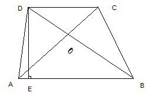
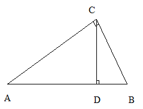
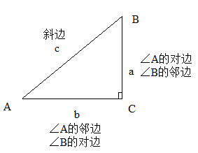
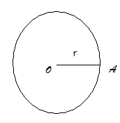
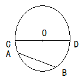
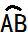
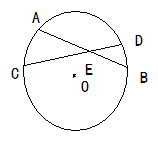
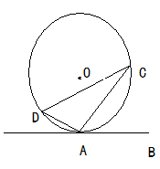
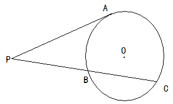

# 初中数学

# 实数

## 分类

1. 有理数
2. 无理数：无限不循环
   1. 开方开不尽的数，如$\sqrt 2$
   2. 有特定意义的数，比如π
   3. 无限不循环小数

## 倒数，相反数和绝对值

### 倒数

如果a和b互为倒数，则ab=1。

1和-1倒数是它本身

0没有倒数。

## 平方根，算术平方根，立方根

整数和0的算数平方根都只有1个，0的算术平方根是0

一个正数有一个正的立方根；一个负数有一个负的立方根；零的立方根是零。

注意：$$\sqrt[3]{- a} = -
\sqrt[3]{a}$$，这说明三次根号内的负号可以移到根号外面。

## 科学计数法

a*10^n, 1≤a<10

# 代数式

用运算符号把数或表示数的字母连接而成的式子叫做代数式。单独的一个数或一个字母也是代数式。

## 单项式

只含有数字与字母的积的代数式叫做单项式。

注意：单项式是由系数、字母、字母的指数构成的，其中系数不能用带分数表示，如$$-
4\frac{1}{3}a^{2}b$$，这种表示就是错误的，应写成$$-
\frac{13}{3}a^{2}b$$。一个单项式中，所有字母的指数的和叫做这个单项式的次数。如$$-
5a^{3}b^{2}c$$是6次单项式。

## 多项式

几个单项式的和叫做多项式。其中每个单项式叫做这个多项式的项。多项式中不含字母的项叫做常数项。多项式中次数最高的项的次数，叫做这个多项式的次数。

单项式和多项式统称整式。

用数值代替代数式中的字母，按照代数式指明的运算，计算出结果，叫做代数式的值。

注意：

* 求代数式的值，一般是先将代数式化简，然后再将字母的取值代入。

* 求代数式的值，有时求不出其字母的值，需要利用技巧，“整体”代入。

## 整式运算法则

整式的加减法：（1）去括号；（2）合并同类项。

整式的乘法：$$a^{m} a^{n} = a^{m + n}(m,n)$$

$$(a^{m})^{n} = a^{\text{mn}}(m,n)$$

$$(ab)^{n} = a^{n}b^{n}(n)$$

$$(a + b)(a - b) = a^{2} - b^{2}$$

$$(a + b)^{2} = a^{2} + 2ab + b^{2}$$

$$(a - b)^{2} = a^{2} - 2ab + b^{2}$$

整式的除法：$$a^{m} \div a^{n} = a^{m - n}(m,n,a \neq 0)$$

注意：

（1）单项式乘单项式的结果仍然是单项式。

（2）单项式与多项式相乘，结果是一个多项式，其项数与因式中多项式的项数相同。

（3）计算时要注意符号问题，多项式的每一项都包括它前面的符号，同时还要注意单项式的符号。

（4）多项式与多项式相乘的展开式中，有同类项的要合并同类项。

（5）公式中的字母可以表示数，也可以表示单项式或多项式。

（6）$$a^{0} = 1(a \neq 0);a^{- p} = \frac{1}{a^{p}}(a \neq 0,p)$$

（7）多项式除以单项式，先把这个多项式的每一项除以这个单项式，再把所得的商相加，单项式除以多项式是不能这么计算的。

## 因式分解

把一个多项式化成几个整式的积的形式，叫做把这个多项式因式分解，也叫做把这个多项式分解因式。

### 常用方法

（1）提公因式法：$$ab + ac = a(b + c)$$

（2）运用公式法：$$a^{2} - b^{2} = (a + b)(a - b)$$

$$a^{2} + 2ab + b^{2} = (a + b)^{2}$$

$$a^{2} - 2ab + b^{2} = (a - b)^{2}$$

（3）分组分解法：$$ac + ad + bc + bd = a(c + d) + b(c + d) = (a + b)(c + d)$$

（4）十字相乘法：$$a^{2} + (p + q)a + pq = (a + p)(a + q)$$

3、因式分解的一般步骤：

（1）如果多项式的各项有公因式，那么先提取公因式。

（2）在各项提出公因式以后或各项没有公因式的情况下，观察多项式的项数：2项式可以尝试运用公式法分解因式；3项式可以尝试运用公式法、十字相乘法分解因式；4项式及4项式以上的可以尝试分组分解法分解因式

（3）分解因式必须分解到每一个因式都不能再分解为止。

## 分式

1、分式的概念

一般地，用A、B表示两个整式，A÷B就可以表示成$$\frac{A}{B}$$的形式，如果B中含有字母，式子$$\frac{A}{B}$$就叫做分式。其中，A叫做分式的分子，B叫做分式的分母。分式和整式通称为有理式。

整式与分式的区别在于：  
如果代数式的分母中没有字母,就是整式；如果代数式的分母中含有字母,就是分式.  
特别注意,如果代数式的分母中只含有π,而没有字母,因为π是常数,所以不是分式.

2、分式的性质

（1）分式的基本性质：

分式的分子和分母都乘以（或除以）同一个不等于零的整式，分式的值不变。

（2）分式的变号法则：

分式的分子、分母与分式本身的符号，改变其中任何两个，分式的值不变。

3、分式的运算法则

$$
\frac{a}{b} \times \frac{c}{d} = \frac{\text{ac}}{\text{bd}};\frac{a}{b} \div \frac{c}{d} = \frac{a}{b} \times \frac{d}{c} = \frac{\text{ad}}{\text{bc}};
$$

$$
(\frac{a}{b})^{n} = \frac{a^{n}}{b^{n}}(n);
$$

$$
\frac{a}{c} \pm \frac{b}{c} = \frac{a \pm b}{c};
$$

$$
\frac{a}{b} \pm \frac{c}{d} = \frac{\text{ad} \pm \text{bc}}{\text{bd}}
$$

## 二次根式

1、二次根式

式子$$\sqrt{a}(a \geq
0)$$叫做二次根式，二次根式必须满足：含有二次根号“”；被开方数a必须是非负数。

2、最简二次根式

若二次根式满足：被开方数的因数是整数，因式是整式；被开方数中不含能开得尽方的因数或因式，这样的二次根式叫做最简二次根式。

化二次根式为最简二次根式的方法和步骤：

（1）如果被开方数是分数（包括小数）或分式，先利用商的算数平方根的性质把它写成分式的形式，然后利用分母有理化进行化简。

（2）如果被开方数是整数或整式，先将他们分解因数或因式，然后把能开得尽方的因数或因式开出来。

3、同类二次根式

几个二次根式化成最简二次根式以后，如果被开方数相同，这几个二次根式叫做同类二次根式。

4、二次根式的性质

（1）$$(\sqrt{a})^{2} = a(a \geq 0)$$

$$a(a \geq 0)$$

（2）$$\sqrt{a^{2}} = \left| a \right| =$$

$$- a(a < 0)$$

（3）$$\sqrt{\text{ab}} = \sqrt{a} \sqrt{b}(a \geq 0,b \geq 0)$$

（4）$$\sqrt{\frac{a}{b}} = \frac{\sqrt{a}}{\sqrt{b}}(a \geq 0,b \geq 0)$$

5、二次根式混合运算

二次根式的混合运算与实数中的运算顺序一样，先乘方，再乘除，最后加减，有括号的先算括号里的（或先去括号）。

# 方程

### 一、一元一次方程的概念

1、方程

含有未知数的等式叫做方程。

2、方程的解

能使方程两边相等的未知数的值叫做方程的解。

3、等式的性质

（1）等式的两边都加上（或减去）同一个数或同一个整式，所得结果仍是等式。

（2）等式的两边都乘以（或除以）同一个数（除数不能是零），所得结果仍是等式。

4、一元一次方程

只含有一个未知数，并且未知数的最高次数是1的整式方程叫做一元一次方程，其中方程ax+b = 0(x是未知数, a ≠ 0)叫做一元一次方程的标准形式，a是未知数x的系数，b是常数项。

### 二、一元二次方程

1、一元二次方程

含有一个未知数，并且未知数的最高次数是2的整式方程叫做一元二次方程。

2、一元二次方程的一般形式

$$ax^{2} + bx + c = 0(a \neq
0)$$，它的特征是：等式左边是一个关于未知数x的二次多项式，等式右边是零，其中$$ax^{2}$$叫做二次项，a叫做二次项系数；bx叫做一次项，b叫做一次项系数；c叫做常数项。

### 三、一元二次方程的解法

1、直接开平方法

利用平方根的定义直接开平方求一元二次方程的解的方法叫做直接开平方法。直接开平方法适用于解形如$(x+a)^{2} = b$的一元二次方程。根据平方根的定义可知，$$x + a$$是b的平方根，当$$b
\geq 0$$时，$$x + a = \pm \sqrt{b}$$，$$x = - a \pm
\sqrt{b}$$，当b\<0时，方程没有实数根。

2、配方法

配方法是一种重要的数学方法，它不仅在解一元二次方程上有所应用，而且在数学的其他领域也有着广泛的应用。配方法的理论根据是完全平方公式$$a^{2}
\pm 2ab + b^{2} = (a + b)^{2}$$，把公式中的a看做未知数x，并用x代替，则有$$x^{2}
\pm 2bx + b^{2} = (x \pm b)^{2}$$。

3、公式法

公式法是用求根公式解一元二次方程的解的方法，它是解一元二次方程的一般方法。

一元二次方程$$ax^{2} + bx + c = 0(a \neq 0)$$的求根公式：

$$
x = \frac{- b \pm \sqrt{b^{2} - 4ac}}{2a}(b^{2} - 4ac \geq 0)
$$

4、因式分解法

因式分解法就是利用因式分解的手段，求出方程的解的方法，这种方法简单易行，是解一元二次方程最常用的方法。

### 四、一元二次方程根的判别式

根的判别式

一元二次方程$$ax^{2} + bx + c = 0(a \neq 0)$$中，$$b^{2} -
4ac$$叫做一元二次方程$$ax^{2} + bx + c = 0(a \neq
0)$$的根的判别式，通常用“$$\Delta$$”来表示，即$$\Delta = b^{2} - 4ac$$

$\Delta$：

* \>0：2个不等实数根
* =0: 1个根
* <0：实数范围无解

### 五、一元二次方程根与系数的关系

如果方程$$ax^{2} + bx + c = 0(a \neq
0)$$的两个实数根是$$x_{1},x_{2}$$，那么$$x_{1} + x_{2} = -
\frac{b}{a}$$，$$x_{1}x_{2} =
\frac{c}{a}$$。也就是说，对于任何一个有实数根的一元二次方程，两根之和等于方程的一次项系数除以二次项系数所得的商的相反数；两根之积等于常数项除以二次项系数所得的商。

### 六、分式方程

1、分式方程

分母里含有未知数的方程叫做分式方程。

2、分式方程的一般方法

解分式方程的思想是将“分式方程”转化为“整式方程”。它的一般解法是：

（1）去分母，方程两边都乘以最简公分母

（2）解所得的整式方程

（3）验根：将所得的根代入最简公分母，若等于零，就是增根，应该舍去；若不等于零，就是原方程的根。

3、分式方程的特殊解法

换元法：

换元法是中学数学中的一个重要的数学思想，其应用非常广泛，当分式方程具有某种特殊形式，一般的去分母不易解决时，可考虑用换元法。

### 七、二元一次方程组

1、二元一次方程

含有两个未知数，并且未知项的最高次数是1的整式方程叫做二元一次方程，它的一般形式是ax+by+c=0（a、b≠0）

2、二元一次方程的解

使二元一次方程左右两边的值相等的一对未知数的值，叫做二元一次方程的一个解。

3、二元一次方程组

两个（或两个以上）二元一次方程合在一起，就组成了一个二元一次方程组。

4二元一次方程组的解

使二元一次方程组的两个方程左右两边的值都相等的两个未知数的值，叫做二元一次方程组的解。

5、二元一次方正组的解法

（1）代入法（2）加减法

6、三元一次方程

把含有三个未知数，并且含有未知数的项的次数都是1的整式方程。

7、三元一次方程组

由三个（或三个以上）一次方程组成，并且含有三个未知数的方程组，叫做三元一次方程组。

## 不等式（组）

### 一、不等式的概念 

1、不等式

用不等号表示不等关系的式子，叫做不等式。

2、不等式的解集

对于一个含有未知数的不等式，任何一个适合这个不等式的未知数的值，都叫做这个不等式的解。

对于一个含有未知数的不等式，它的所有解的集合叫做这个不等式的解的集合，简称这个不等式的解集。

求不等式的解集的过程，叫做解不等式。

3、用数轴表示不等式的方法

### 二、不等式基本性质

1、不等式两边都加上（或减去）同一个数或同一个整式，不等号的方向不变。

2、不等式两边都乘以（或除以）同一个正数，不等号的方向不变。

3、不等式两边都乘以（或除以）同一个负数，不等号的方向改变。

### 三、一元一次不等式

1、一元一次不等式的概念

一般地，不等式中只含有一个未知数，未知数的次数是1，且不等式的两边都是整式，这样的不等式叫做一元一次不等式。

2、一元一次不等式的解法

解一元一次不等式的一般步骤：

（1）去分母（2）去括号（3）移项（4）合并同类项（5）将x项的系数化为1

### 四、一元一次不等式组

1、一元一次不等式组的概念

几个一元一次不等式合在一起，就组成了一个一元一次不等式组。

几个一元一次不等式的解集的公共部分，叫做它们所组成的一元一次不等式组的解集。

求不等式组的解集的过程，叫做解不等式组。

当任何数x都不能使不等式同时成立，我们就说这个不等式组无解或其解为空集。

2、一元一次不等式组的解法

（1）分别求出不等式组中各个不等式的解集

（2）利用数轴求出这些不等式的解集的公共部分，即这个不等式组的解集。

## 第六章 一次函数与反比例函数

### 一、平面直角坐标系 

1、平面直角坐标系

在平面内画两条互相垂直且有公共原点的数轴，就组成了平面直角坐标系。

其中，水平的数轴叫做x轴或横轴，取向右为正方向；铅直的数轴叫做y轴或纵轴，取向上为正方向；两轴的交点O（即公共的原点）叫做直角坐标系的原点；建立了直角坐标系的平面，叫做坐标平面。

为了便于描述坐标平面内点的位置，把坐标平面被x轴和y轴分割而成的四个部分，分别叫做第一象限、第二象限、第三象限、第四象限。

注意：x轴和y轴上的点，不属于任何象限。

2、点的坐标的概念

点的坐标用（a，b）表示，其顺序是横坐标在前，纵坐标在后，中间有“，”分开，横、纵坐标的位置不能颠倒。平面内点的坐标是有序实数对，当$$a
\neq b$$时，（a，b）和（b，a）是两个不同点的坐标。

### 二、不同位置的点的坐标的特征 

1、各象限内点的坐标的特征

点P(x,y)在第一象限$$\Leftrightarrow x > 0,y > 0$$

点P(x,y)在第二象限$$\Leftrightarrow x < 0,y > 0$$

点P(x,y)在第三象限$$\Leftrightarrow x < 0,y < 0$$

点P(x,y)在第四象限$$\Leftrightarrow x > 0,y < 0$$

2、坐标轴上的点的特征

点P(x,y)在x轴上$$\Leftrightarrow y = 0$$，x为任意实数

点P(x,y)在y轴上$$\Leftrightarrow x = 0$$，y为任意实数

点P(x,y)既在x轴上，又在y轴上$$\Leftrightarrow$$x，y同时为零，即点P坐标为（0，0）

3、两条坐标轴夹角平分线上点的坐标的特征

点P(x,y)在第一、三象限夹角平分线上$$\Leftrightarrow$$x与y相等

点P(x,y)在第二、四象限夹角平分线上$$\Leftrightarrow$$x与y互为相反数

4、和坐标轴平行的直线上点的坐标的特征

位于平行于x轴的直线上的各点的纵坐标相同。

位于平行于y轴的直线上的各点的横坐标相同。

5、关于x轴、y轴或远点对称的点的坐标的特征

点P与点p’关于x轴对称$$\Leftrightarrow$$横坐标相等，纵坐标互为相反数

点P与点p’关于y轴对称$$\Leftrightarrow$$纵坐标相等，横坐标互为相反数

点P与点p’关于原点对称$$\Leftrightarrow$$横、纵坐标均互为相反数

6、点到坐标轴及原点的距离

点P(x,y)到坐标轴及原点的距离：

（1）点P(x,y)到x轴的距离等于$$\left| y \right|$$

（2）点P(x,y)到y轴的距离等于$$\left| x \right|$$

（3）点P(x,y)到原点的距离等于$$\sqrt{x^{2} + y^{2}}$$

### 三、函数及其相关概念

1、变量与常量

在某一变化过程中，可以取不同数值的量叫做变量，数值保持不变的量叫做常量。

一般地，在某一变化过程中有两个变量x与y，如果对于x的每一个值，y都有唯一确定的值与它对应，那么就说x是自变量，y是x的函数。

2、函数解析式

用来表示函数关系的数学式子叫做函数解析式或函数关系式。

使函数有意义的自变量的取值的全体，叫做自变量的取值范围。

3、函数的三种表示法及其优缺点

（1）解析法

两个变量间的函数关系，有时可以用一个含有这两个变量及数字运算符号的等式表示，这种表示法叫做解析法。

（2）列表法

把自变量x的一系列值和函数y的对应值列成一个表来表示函数关系，这种表示法叫做列表法。

（3）图像法

用图像表示函数关系的方法叫做图像法。

4、由函数解析式画其图像的一般步骤

（1）列表：列表给出自变量与函数的一些对应值

（2）描点：以表中每对对应值为坐标，在坐标平面内描出相应的点

（3）连线：按照自变量由小到大的顺序，把所描各点用平滑的曲线连接起来。

## 第六章 一次函数与反比例函数

### 一、平面直角坐标系 

1、平面直角坐标系

在平面内画两条互相垂直且有公共原点的数轴，就组成了平面直角坐标系。

其中，水平的数轴叫做x轴或横轴，取向右为正方向；铅直的数轴叫做y轴或纵轴，取向上为正方向；两轴的交点O（即公共的原点）叫做直角坐标系的原点；建立了直角坐标系的平面，叫做坐标平面。

为了便于描述坐标平面内点的位置，把坐标平面被x轴和y轴分割而成的四个部分，分别叫做第一象限、第二象限、第三象限、第四象限。

注意：x轴和y轴上的点，不属于任何象限。

2、点的坐标的概念

点的坐标用（a，b）表示，其顺序是横坐标在前，纵坐标在后，中间有“，”分开，横、纵坐标的位置不能颠倒。平面内点的坐标是有序实数对，当$$a
\neq b$$时，（a，b）和（b，a）是两个不同点的坐标。

### 二、不同位置的点的坐标的特征 

1、各象限内点的坐标的特征

点P(x,y)在第一象限$$\Leftrightarrow x > 0,y > 0$$

点P(x,y)在第二象限$$\Leftrightarrow x < 0,y > 0$$

点P(x,y)在第三象限$$\Leftrightarrow x < 0,y < 0$$

点P(x,y)在第四象限$$\Leftrightarrow x > 0,y < 0$$

2、坐标轴上的点的特征

点P(x,y)在x轴上$$\Leftrightarrow y = 0$$，x为任意实数

点P(x,y)在y轴上$$\Leftrightarrow x = 0$$，y为任意实数

点P(x,y)既在x轴上，又在y轴上$$\Leftrightarrow$$x，y同时为零，即点P坐标为（0，0）

3、两条坐标轴夹角平分线上点的坐标的特征

点P(x,y)在第一、三象限夹角平分线上$$\Leftrightarrow$$x与y相等

点P(x,y)在第二、四象限夹角平分线上$$\Leftrightarrow$$x与y互为相反数

4、和坐标轴平行的直线上点的坐标的特征

位于平行于x轴的直线上的各点的纵坐标相同。

位于平行于y轴的直线上的各点的横坐标相同。

5、关于x轴、y轴或远点对称的点的坐标的特征

点P与点p’关于x轴对称$$\Leftrightarrow$$横坐标相等，纵坐标互为相反数

点P与点p’关于y轴对称$$\Leftrightarrow$$纵坐标相等，横坐标互为相反数

点P与点p’关于原点对称$$\Leftrightarrow$$横、纵坐标均互为相反数

6、点到坐标轴及原点的距离

点P(x,y)到坐标轴及原点的距离：

（1）点P(x,y)到x轴的距离等于$$\left| y \right|$$

（2）点P(x,y)到y轴的距离等于$$\left| x \right|$$

（3）点P(x,y)到原点的距离等于$$\sqrt{x^{2} + y^{2}}$$

### 三、函数及其相关概念

1、变量与常量

在某一变化过程中，可以取不同数值的量叫做变量，数值保持不变的量叫做常量。

一般地，在某一变化过程中有两个变量x与y，如果对于x的每一个值，y都有唯一确定的值与它对应，那么就说x是自变量，y是x的函数。

2、函数解析式

用来表示函数关系的数学式子叫做函数解析式或函数关系式。

使函数有意义的自变量的取值的全体，叫做自变量的取值范围。

3、函数的三种表示法及其优缺点

（1）解析法

两个变量间的函数关系，有时可以用一个含有这两个变量及数字运算符号的等式表示，这种表示法叫做解析法。

（2）列表法

把自变量x的一系列值和函数y的对应值列成一个表来表示函数关系，这种表示法叫做列表法。

（3）图像法

用图像表示函数关系的方法叫做图像法。

4、由函数解析式画其图像的一般步骤

（1）列表：列表给出自变量与函数的一些对应值

（2）描点：以表中每对对应值为坐标，在坐标平面内描出相应的点

（3）连线：按照自变量由小到大的顺序，把所描各点用平滑的曲线连接起来。

### 四、正比例函数和一次函数 

1、正比例函数和一次函数的概念

一般地，如果$$y = kx + b$$（k，b是常数，k$$\neq$$0），那么y叫做x的一次函数。

特别地，当一次函数$$y = kx + b$$中的b为0时，$$y =
kx$$（k为常数，k$$\neq$$0）。这时，y叫做x的正比例函数。

2、一次函数的图像

所有一次函数的图像都是一条直线

3、一次函数、正比例函数图像的主要特征：一次函数$$y = kx +
b$$的图像是经过点（0，b）的直线；正比例函数$$y =
kx$$的图像是经过原点（0，0）的直线。

| **k的符号**                                                  | **b的符号** | **函数图像** | **图像特征**                               |
| ------------------------------------------------------------ | ----------- | ------------ | ------------------------------------------ |
| k\>0                                                         | b\>0        |              | 图像经过一、二、三象限，y随x的增大而增大。 |
|                                                              | b\<0        |              | 图像经过一、三、四象限，y随x的增大而增大。 |
| k\<0                                                         | b\>0        |              | 图像经过一、二、四象限，y随x的增大而减小   |
|                                                              | b\<0        |              | 图像经过二、三、四象限，y随x的增大而减小。 |
| 注：当b=0时，一次函数变为正比例函数，正比例函数是一次函数的特例。 |             |              |                                            |

4、正比例函数的性质

一般地，正比例函数$$y = kx$$有下列性质：

（1）当k\>0时，图像经过第一、三象限，y随x的增大而增大；

（2）当k\<0时，图像经过第二、四象限，y随x的增大而减小。

5、一次函数的性质

一般地，一次函数$$y = kx + b$$有下列性质：

（1）当k\>0时，y随x的增大而增大

（2）当k\<0时，y随x的增大而减小

6、正比例函数和一次函数解析式的确定

确定一个正比例函数，就是要确定正比例函数定义式$$y =
kx$$（k$$\neq$$0）中的常数k。确定一个一次函数，需要确定一次函数定义式$$y = kx +
b$$（k$$\neq$$0）中的常数k和b。解这类问题的一般方法是待定系数法。

### 五、反比例函数 

1、反比例函数的概念

一般地，函数$$y =
\frac{k}{x}$$（k是常数，k$$\neq$$0）叫做反比例函数。反比例函数的解析式也可以写成$$y
= kx^{-
1}$$的形式。自变量x的取值范围是x$$\neq$$0的一切实数，函数的取值范围也是一切非零实数。

2、反比例函数的图像

反比例函数的图像是双曲线，它有两个分支，这两个分支分别位于第一、三象限，或第二、四象限，它们关于原点对称。由于反比例函数中自变量x$$\neq$$0，函数y$$\neq$$0，所以，它的图像与x轴、y轴都没有交点，即双曲线的两个分支无限接近坐标轴，但永远达不到坐标轴。

3、反比例函数的性质

①x的取值范围是x$$\neq$$0， y的取值范围是y$$\neq$$0； ②当k\>0时，函数图像的两个分支分别 在第一、三象限。在每个象限内，y 随x 的增大而减小。

①x的取值范围是x$$\neq$$0， y的取值范围是y$$\neq$$0； ②当k\<0时，函数图像的两个分支分别 在第二、四象限。在每个象限内，y 随x 的增大而增大。

4、反比例函数解析式的确定

确定解析式的方法仍是待定系数法。由于在反比例函数$$y =
\frac{k}{x}$$中，只有一个待定系数，因此只需要一对对应值或图像上的一个点的坐标，即可求出k的值，从而确定其解析式。

5、反比例函数中反比例系数的几何意义

如下图，过反比例函数$$y = \frac{k}{x}(k \neq
0)$$图像上任一点P作x轴、y轴的垂线PM，PN，则所得的矩形PMON的面积S=PM*PN=$$\left|
y \right| \left| x \right| = \left| \text{xy} \right|$$。

$$\because y = \frac{k}{x},\therefore xy = k,S = \left| k \right|$$。

## 第七章 二次函数

### 一、二次函数的概念和图像 

1、二次函数的概念

一般地，如果$$y = ax^{2} + bx + c(a,b,c,a \neq 0)$$，那么y叫做x 的二次函数。

$$y = ax^{2} + bx + c(a,b,c,a \neq 0)$$叫做二次函数的一般式。

2、二次函数的图像

二次函数的图像是一条关于$$x = - \frac{b}{2a}$$对称的曲线，这条曲线叫抛物线。

抛物线的主要特征：

①有开口方向；②有对称轴；③有顶点。

3、二次函数图像的画法

五点法：

（1）先根据函数解析式，求出顶点坐标，在平面直角坐标系中描出顶点M，并用虚线画出对称轴

（2）求抛物线$$y = ax^{2} + bx + c$$与坐标轴的交点：

当抛物线与x轴有两个交点时，描出这两个交点A,B及抛物线与y轴的交点C，再找到点C的对称点D。将这五个点按从左到右的顺序连接起来，并向上或向下延伸，就得到二次函数的图像。

当抛物线与x轴只有一个交点或无交点时，描出抛物线与y轴的交点C及对称点D。由C、M、D三点可粗略地画出二次函数的草图。如果需要画出比较精确的图像，可再描出一对对称点A、B，然后顺次连接五点，画出二次函数的图像。

### 二、二次函数的解析式 

二次函数的解析式有三种形式：

（1）一般式：$$y = ax^{2} + bx + c(a,b,c是常数,a \neq 0)$$

（2）顶点式：$$y = a(x - h)^{2} + k(a,h,k是常数,a \neq 0)$$

（3）当抛物线$$y = ax^{2} + bx + c$$与x轴有交点时，即对应二次好方程$$ax^{2} + bx + c = 0$$有实根$$x_{1}$$和$$x_{2}$$存在时，根据二次三项式的分解因式 $ax^{2} + bx+c = a(x - x_{1})(x - x_{2})$ ，二次函数$$y = ax^{2} + bx +
c$$可转化为两根式$$y = a(x - x_{1})(x - x_{2})$$。如果没有交点，则不能这样表示。

### 三、二次函数的最值 

如果自变量的取值范围是全体实数，那么函数在顶点处取得最大值（或最小值），即当$$x
= - \frac{b}{2a}$$时，$$y_{} = \frac{4ac - b^{2}}{4a}$$。

如果自变量的取值范围是$$x_{1} \leq x \leq x_{2}$$，那么，首先要看$$-
\frac{b}{2a}$$是否在自变量取值范围$$x_{1} \leq x \leq
x_{2}$$内，若在此范围内，则当x=$$- \frac{b}{2a}$$时，$$y_{} = \frac{4ac -
b^{2}}{4a}$$；若不在此范围内，则需要考虑函数在$$x_{1} \leq x \leq
x_{2}$$范围内的增减性，如果在此范围内，y随x的增大而增大，则当$$x =
x_{2}$$时，$$y_{} = ax_{2}^{2} + bx_{2} + c$$，当$$x = x_{1}$$时，$$y_{} =
ax_{1}^{2} + bx_{1} + c$$；如果在此范围内，y随x的增大而减小，则当$$x =
x_{1}$$时，$$y_{} = ax_{1}^{2} + bx_{1} + c$$，当$$x = x_{2}$$时，$$y_{} =
ax_{2}^{2} + bx_{2} + c$$。

### 四、二次函数的性质 

1、二次函数的性质
$$
y = ax^{2} + bx + c(a,b,c,a \neq 0)
$$

| 图像 | a\>0                                                         | a\<0                                                         |
| ---- | ------------------------------------------------------------ | ------------------------------------------------------------ |
| 性质 | （1）抛物线开口向上，并向上无限延伸； （2）对称轴是x=$$- \frac{b}{2a}$$，顶点坐标是（$$- \frac{b}{2a}$$，$$\frac{4ac - b^{2}}{4a}$$）； （3）在对称轴的左侧，即当x\<$$- \frac{b}{2a}$$时，y随x的增大而减小；在对称轴的右侧，即当x\>$$- \frac{b}{2a}$$时，y随x的增大而增大，简记左减右增； （4）抛物线有最低点，当x=$$- \frac{b}{2a}$$时，y有最小值，$$y_{} = \frac{4ac - b^{2}}{4a}$$ | （1）抛物线开口向下，并向下无限延伸； （2）对称轴是x=$$- \frac{b}{2a}$$，顶点坐标是（$$- \frac{b}{2a}$$，$$\frac{4ac - b^{2}}{4a}$$）； （3）在对称轴的左侧，即当x\<$$- \frac{b}{2a}$$时，y随x的增大而增大；在对称轴的右侧，即当x\>$$- \frac{b}{2a}$$时，y随x的增大而减小，简记左增右减； （4）抛物线有最高点，当x=$$- \frac{b}{2a}$$时，y有最大值，$$y_{} = \frac{4ac - b^{2}}{4a}$$ |

2、二次函数$$y = ax^{2} + bx + c(a,b,c,a \neq 0)$$中，$$abc$$的含义：

$$a$$表示开口方向：$$a$$ \>0时，抛物线开口向上

$$a$$ \<0时，抛物线开口向下

$$b$$与对称轴有关：对称轴为x=$$- \frac{b}{2a}$$

$$c$$表示抛物线与y轴的交点坐标：（0，$$c$$）

3、二次函数与一元二次方程的关系

一元二次方程的解是其对应的二次函数的图像与x轴的交点坐标。

因此一元二次方程中的$$\Delta = b^{2} -
4ac$$，在二次函数中表示图像与x轴是否有交点。

当$$\Delta$$\>0时，图像与x轴有两个交点；

当$$\Delta$$=0时，图像与x轴有一个交点；

当$$\Delta$$\<0时，图像与x轴没有交点。

**补充：**

1、两点间距离公式（当遇到没有思路的题时，可用此方法拓展思路，以寻求解题方法）

y

如图：点A坐标为（x1，y1）点B坐标为（x2，y2）

则AB间的距离，即线段AB的长度为$$\sqrt{\left( x_{1} - x_{2} \right)^{2} + \left(
y_{1} - y_{2} \right)^{2}}$$ 

2、函数平移规律（中考试题中，只占3分，但掌握这个知识点，对提高答题速度有很大帮助，可以大大节省做题的时间）

**左加右减、上加下减**

## 第八章 图形的初步认识

### 一、直线、射线和线段

1、几何图形

从实物中抽象出来的各种图形，包括立体图形和平面图形。

立体图形：有些几何图形的各个部分不都在同一平面内，它们是立体图形。

平面图形：有些几何图形的各个部分都在同一平面内，它们是平面图形。

2、点、线、面、体

（1）几何图形的组成

点：线和线相交的地方是点，它是几何图形中最基本的图形。

线：面和面相交的地方是线，分为直线和曲线。

面：包围着体的是面，分为平面和曲面。

体：几何体也简称体。

（2）点动成线，线动成面，面动成体。

3、直线的概念

一根拉得很紧的线，就给我们以直线的形象，直线是直的，并且是向两方无限延伸的。

4、射线的概念

直线上一点和它一旁的部分叫做射线。这个点叫做射线的端点。

5、线段的概念

直线上两个点和它们之间的部分叫做线段。这两个点叫做线段的端点。

6、点、直线、射线和线段的表示

在几何里，我们常用字母表示图形。

一个点可以用一个大写字母表示。

一条直线可以用一个小写字母表示。

一条射线可以用端点和射线上另一点来表示。

一条线段可用它的端点的两个大写字母来表示。

**注意：**

（1）表示点、直线、射线、线段时，都要在字母前面注明点、直线、射线、线段。

（2）直线和射线无长度，线段有长度。

（3）直线无端点，射线有一个端点，线段有两个端点。

（4）点和直线的位置关系有线面两种：

①点在直线上，或者说直线经过这个点。

②点在直线外，或者说直线不经过这个点。

7、直线的性质

（1）直线公理：经过两个点有一条直线，并且只有一条直线。它可以简单地说成：过两点有且只有一条直线。

（2）过一点的直线有无数条。

（3）直线是是向两方面无限延伸的，无端点，不可度量，不能比较大小。

（4）直线上有无穷多个点。

（5）两条不同的直线至多有一个公共点。

8、线段的性质

（1）线段公理：所有连接两点的线中，线段最短。也可简单说成：两点之间线段最短。

（2）连接两点的线段的长度，叫做这两点的距离。

（3）线段的中点到两端点的距离相等。

（4）线段的大小关系和它们的长度的大小关系是一致的。

9、线段垂直平分线的性质定理及逆定理

垂直于一条线段并且平分这条线段的直线是这条线段的垂直平分线。

线段垂直平分线的性质定理：线段垂直平分线上的点和这条线段两个端点的距离相等。

逆定理：和一条线段两个端点距离相等的点，在这条线段的垂直平分线上。

### 二、角 

1、角的相关概念

有公共端点的两条射线组成的图形叫做角，这个公共端点叫做角的顶点，这两条射线叫做角的边。

当角的两边在一条直线上时，组成的角叫做平角。

平角的一半叫做直角；小于直角的角叫做锐角；大于直角且小于平角的角叫做钝角。

如果两个角的和是一个直角，那么这两个角叫做互为余角，其中一个角叫做另一个角的余角。

如果两个角的和是一个平角，那么这两个角叫做互为补角，其中一个角叫做另一个角的补角。

2、角的表示

角可以用大写英文字母、阿拉伯数字或小写的希腊字母表示，具体的有一下四种表示方法：

①用数字表示单独的角，如∠1，∠2，∠3等。

②用小写的希腊字母表示单独的一个角，如∠α，∠β，∠γ，∠θ等。

③用一个大写英文字母表示一个独立（在一个顶点处只有一个角）的角，如∠B，∠C等。

④用三个大写英文字母表示任一个角，如∠BAD，∠BAE，∠CAE等。

注意：用三个大写英文字母表示角时，一定要把顶点字母写在中间，边上的字母写在两侧。

3、角的度量

角的度量有如下规定：把一个平角180等分，每一份就是1度的角，单位是度，用“°”表示，1度记作“1°”，n度记作“n°”。

把1°的角60等分，每一份叫做1分的角，1分记作“1’”。

把1’ 的角60等分，每一份叫做1秒的角，1秒记作“1””。

4、角的性质

（1）角的大小与边的长短无关，只与构成角的两条射线的幅度大小有关。

（2）角的大小可以度量，可以比较

（3）角可以参与运算。

5、角的平分线及其性质

一条射线把一个角分成两个相等的角，这条射线叫做这个角的平分线。

角的平分线有下面的性质定理：

（1）角平分线上的点到这个角的两边的距离相等。

（2）到一个角的两边距离相等的点在这个角的平分线上。

### 三、相交线 

1、相交线中的角

两条直线相交，可以得到四个角，我们把两条直线相交所构成的四个角中，有公共顶点但没有公共边的两个角叫做对顶角。我们把两条直线相交所构成的四个角中，有公共顶点且有一条公共边的两个角叫做临补角。

临补角互补，对顶角相等。

直线AB，CD与EF相交（或者说两条直线AB，CD被第三条直线EF所截），构成八个角。其中∠1与∠5这两个角分别在AB，CD的上方，并且在EF的同侧，像这样位置相同的一对角叫做同位角；∠3与∠5这两个角都在AB，CD之间，并且在EF的异侧，像这样位置的两个角叫做内错角；∠3与∠6在直线AB，CD之间，并侧在EF的同侧，像这样位置的两个角叫做同旁内角。

2、垂线

两条直线相交所成的四个角中，有一个角是直角时，就说这两条直线互相垂直。其中一条直线叫做另一条直线的垂线，它们的交点叫做垂足。

直线AB，CD互相垂直，记作“AB⊥CD”（或“CD⊥AB”)，读作“AB垂直于CD”（或“CD垂直于AB”）。

垂线的性质：

性质1：过一点有且只有一条直线与已知直线垂直。

性质2：直线外一点与直线上各点连接的所有线段中，垂线段最短。简称：垂线段最短。

### 四、平行线

1、平行线的概念

在同一个平面内，不相交的两条直线叫做平行线。平行用符号“∥”表示，如“AB∥CD”，读作“AB平行于CD”。

同一平面内，两条直线的位置关系只有两种：相交或平行。

**注意：**

（1）平行线是无限延伸的，无论怎样延伸也不相交。

（2）当遇到线段、射线平行时，指的是线段、射线所在的直线平行。

2、平行线公理及其推论

平行公理：经过直线外一点，有且只有一条直线与这条直线平行。

推论：如果两条直线都和第三条直线平行，那么这两条直线也互相平行。

3、平行线的判定

平行线的判定公理：两条直线被第三条直线所截，如果同位角相等，那么两直线平行。简称：同位角相等，两直线平行。

平行线的两条判定定理：

（1）两条直线被第三条直线所截，如果内错角相等，那么两直线平行。简称：内错角相等，两直线平行。

（2）两条直线被第三条直线所截，如果同旁内角互补，那么两直线平行。简称：同旁内角互补，两直线平行。

补充平行线的判定方法：

（1）平行于同一条直线的两直线平行。

（2）垂直于同一条直线的两直线平行。

（3）平行线的定义。

4、平行线的性质

（1）两直线平行，同位角相等。

（2）两直线平行，内错角相等。

（3）两直线平行，同旁内角互补。

### 五、命题、定理、证明 

1、命题的概念

判断一件事情的语句，叫做命题。

理解：命题的定义包括两层含义：

（1）命题必须是个完整的句子；

（2）这个句子必须对某件事情做出判断。

2、命题的分类（按正确、错误与否分）

真命题（正确的命题）

否命题

假命题（错误的命题）

所谓正确的命题就是：如果题设成立，那么结论一定成立的命题。

所谓错误的命题就是：如果题设成立，不能证明结论总是成立的命题。

3、公理

人们在长期实践中总结出来的得到人们公认的真命题，叫做公理。

4、定理

用推理的方法判断为正确的命题叫做定理。

5、证明

判断一个命题的正确性的推理过程叫做证明。

6、证明的一般步骤

（1）根据题意，画出图形。

（2）根据题设、结论、结合图形，写出已知、求证。

（3）经过分析，找出由已知推出求证的途径，写出证明过程。

### 六、投影与视图 

1、投影

投影的定义：用光线照射物体，在地面上或墙壁上得到的影子，叫做物体的投影。

平行投影：由平行光线（如太阳光线）形成的投影称为平行投影。

中心投影：由同一点发出的光线所形成的投影称为中心投影。

2、视图

当我们从某一角度观察一个实物时，所看到的图像叫做物体的一个视图。物体的三视图特指主视图、俯视图、左视图。

主视图：在正面内得到的由前向后观察物体的视图，叫做主视图。

俯视图：在水平面内得到的由上向下观察物体的视图，叫做俯视图。

左视图：在侧面内得到的由左向右观察物体的视图，叫做左视图，有时也叫做侧视图。

## 第九章 三角形

### 一、三角形 

1、三角形的概念

由不在同意直线上的三条线段首尾顺次相接所组成的图形叫做三角形。组成三角形的线段叫做三角形的边；相邻两边的公共端点叫做三角形的顶点；相邻两边所组成的角叫做三角形的内角，简称三角形的角。

2、三角形中的主要线段

（1）三角形的一个角的平分线与这个角的对边相交，这个角的顶点和交点间的线段叫做三角形的角平分线。

（2）在三角形中，连接一个顶点和它对边的中点的线段叫做三角形的中线。

（3）从三角形一个顶点向它的对边做垂线，顶点和垂足之间的线段叫做三角形的高线（简称三角形的高）。

3、三角形的稳定性

三角形的形状是固定的，三角形的这个性质叫做三角形的稳定性。三角形的这个性质在生产生活中应用很广，需要稳定的东西一般都制成三角形的形状。

4、三角形的特性与表示

三角形有下面三个特性：

（1）三角形有三条线段

（2）三条线段不在同一直线上 三角形是封闭图形

（3）首尾顺次相接

三角形用符号“$$\Delta$$”表示，顶点是A、B、C的三角形记作“$$\Delta$$ABC”，读作“三角形ABC”。

5、三角形的分类

三角形按边的关系分类如下：

不等边三角形

三角形 底和腰不相等的等腰三角形

等腰三角形

等边三角形

三角形按角的关系分类如下：

直角三角形（有一个角为直角的三角形）

三角形 锐角三角形（三个角都是锐角的三角形）

斜三角形

钝角三角形（有一个角为钝角的三角形）

把边和角联系在一起，我们又有一种特殊的三角形：等腰直角三角形。它是两条直角边相等的直角三角形。

6、三角形的三边关系定理及推论

（1）三角形三边关系定理：三角形的两边之和大于第三边。

推论：三角形的两边之差小于第三边。

（2）三角形三边关系定理及推论的作用：

①判断三条已知线段能否组成三角形

②当已知两边时，可确定第三边的范围。

③证明线段不等关系。

7、三角形的内角和定理及推论

三角形的内角和定理：三角形三个内角和等于180°。

推论：

①直角三角形的两个锐角互余。

②三角形的一个外角等于和它不相邻的来两个内角的和。

③三角形的一个外角大于任何一个和它不相邻的内角。

**注：**在同一个三角形中：等角对等边；等边对等角；大角对大边；大边对大角。

8、三角形的面积

三角形的面积=$$\frac{1}{2}$$×底×高

### 二、全等三角形 

1、全等三角形的概念

能够完全重合的两个图形叫做全等形。

能够完全重合的两个三角形叫做全等三角形。两个三角形全等时，互相重合的顶点叫做对应顶点，互相重合的边叫做对应边，互相重合的角叫做对应角。夹边就是三角形中相邻两角的公共边，夹角就是三角形中有公共端点的两边所成的角。

2、全等三角形的表示和性质

全等用符号“≌”表示，读作“全等于”。如△ABC≌△DEF，读作“三角形ABC全等于三角形DEF”。

注：记两个全等三角形时，通常把表示对应顶点的字母写在对应的位置上。

3、三角形全等的判定

三角形全等的判定定理：

（1）边角边定理：有两边和它们的夹角对应相等的两个三角形全等（可简写成“边角边”或“SAS”）

（2）角边角定理：有两角和它们的夹边对应相等的两个三角形全等（可简写成“角边角”或“ASA”）

（3）边边边定理：有三边对应相等的两个三角形全等（可简写成“边边边”或“SSS”）。

直角三角形全等的判定：

对于特殊的直角三角形，判定它们全等时，还有HL定理（斜边、直角边定理）：有斜边和一条直角边对应相等的两个直角三角形全等（可简写成“斜边、直角边”或“HL”）

4、全等变换

只改变图形的位置，二不改变其形状大小的图形变换叫做全等变换。

全等变换包括一下三种：

（1）平移变换：把图形沿某条直线平行移动的变换叫做平移变换。

（2）对称变换：将图形沿某直线翻折180°，这种变换叫做对称变换。

（3）旋转变换：将图形绕某点旋转一定的角度到另一个位置，这种变换叫做旋转变换。

### 三、等腰三角形 

1、等腰三角形的性质

（1）等腰三角形的性质定理及推论：

定理：等腰三角形的两个底角相等（简称：等边对等角）

推论1：等腰三角形顶角平分线平分底边并且垂直于底边。即等腰三角形的顶角平分线、底边上的中线、底边上的高重合。

推论2：等边三角形的各个角都相等，并且每个角都等于60°。

（2）等腰三角形的其他性质：

①等腰直角三角形的两个底角相等且等于45°

②等腰三角形的底角只能为锐角，不能为钝角（或直角），但顶角可为钝角（或直角）。

③等腰三角形的三边关系：设腰长为a，底边长为b，则$$\frac{b}{2}$$\<a

④等腰三角形的三角关系：设顶角为顶角为∠A，底角为∠B、∠C，则∠A=180°—2∠B，∠B=∠C=$\frac{180-\angle A}{2}$

2、等腰三角形的判定

等腰三角形的判定定理及推论：

定理：如果一个三角形有两个角相等，那么这两个角所对的边也相等（简称：等角对等边）。这个判定定理常用于证明同一个三角形中的边相等。

推论1：三个角都相等的三角形是等边三角形

推论2：有一个角是60°的等腰三角形是等边三角形。

推论3：在直角三角形中，如果一个锐角等于30°，那么它所对的直角边等于斜边的一半。

| 等腰三角形的性质与判定 |                                                                                                                   |                                                                                                                                                   |
|------------------------|-------------------------------------------------------------------------------------------------------------------|---------------------------------------------------------------------------------------------------------------------------------------------------|
|                        | 等腰三角形性质                                                                                                    | 等腰三角形判定                                                                                                                                    |
| 中线                   | 1、等腰三角形底边上的中线垂直底边，平分顶角； 2、等腰三角形两腰上的中线相等，并且它们的交点与底边两端点距离相等。 | 1、两边上中线相等的三角形是等腰三角形； 2、如果一个三角形的一边中线垂直这条边（平分这个边的对角），那么这个三角形是等腰三角形                     |
| 角平分线               | 1、等腰三角形顶角平分线垂直平分底边； 2、等腰三角形两底角平分线相等，并且它们的交点到底边两端点的距离相等。       | 1、如果三角形的顶角平分线垂直于这个角的对边（平分对边），那么这个三角形是等腰三角形； 2、三角形中两个角的平分线相等，那么这个三角形是等腰三角形。 |
| 高线                   | 1、等腰三角形底边上的高平分顶角、平分底边； 2、等腰三角形两腰上的高相等，并且它们的交点和底边两端点距离相等。     | 1、如果一个三角形一边上的高平分这条边（平分这条边的对角），那么这个三角形是等腰三角形； 2、有两条高相等的三角形是等腰三角形。                     |
| 角                     | 等边对等角                                                                                                        | 等角对等边                                                                                                                                        |
| 边                     | 底的一半\<腰长\<周长的一半                                                                                        | 两边相等的三角形是等腰三角形                                                                                                                      |

4、三角形中的中位线

连接三角形两边中点的线段叫做三角形的中位线。

（1）三角形共有三条中位线，并且它们又重新构成一个新的三角形。

（2）要会区别三角形中线与中位线。

三角形中位线定理：三角形的中位线平行于第三边，并且等于它的一半。

三角形中位线定理的作用：

位置关系：可以证明两条直线平行。

数量关系：可以证明线段的倍分关系。

常用结论：任一个三角形都有三条中位线，由此有：

结论1：三条中位线组成一个三角形，其周长为原三角形周长的一半。

结论2：三条中位线将原三角形分割成四个全等的三角形。

结论3：三条中位线将原三角形划分出三个面积相等的平行四边形。

结论4：三角形一条中线和与它相交的中位线互相平分。

结论5：三角形中任意两条中位线的夹角与这夹角所对的三角形的顶角相等。

## 第十章 四边形

### 一、四边形的相关概念 

1、四边形

在同一平面内，由不在同一直线上的四条线段首尾顺次相接的图形叫做四边形。

2、凸四边形

把四边形的任一边向两方延长，如果其他个边都在延长所得直线的同一旁，这样的四边形叫做凸四边形。

3、对角线

在四边形中，连接不相邻两个顶点的线段叫做四边形的对角线。

4、四边形的不稳定性

三角形的三边如果确定后，它的形状、大小就确定了，这是三角形的稳定性。但是四边形的四边确定后，它的形状不能确定，这就是四边形所具有的不稳定性，它在生产、生活方面有着广泛的应用。

5、四边形的内角和定理及外角和定理

四边形的内角和定理：四边形的内角和等于360°。

四边形的外角和定理：四边形的外角和等于360°。

推论：多边形的内角和定理：n边形的内角和等于$$(n - 2)$$ 180°；

多边形的外角和定理：任意多边形的外角和等于360°。

6、多边形的对角线条数的计算公式

设多边形的边数为n，则多边形的对角线条数为$$\frac{n(n - 3)}{2}$$。

### 二、平行四边形 

1、平行四边形的概念

两组对边分别平行的四边形叫做平行四边形。

平行四边形用符号“*□*ABCD”表示，如平行四边形ABCD记作“*□*ABCD”，读作“平行四边形ABCD”。

2、平行四边形的性质

（1）平行四边形的邻角互补，对角相等。

（2）平行四边形的对边平行且相等。

推论：夹在两条平行线间的平行线段相等。

（3）平行四边形的对角线互相平分。

（4）若一直线过平行四边形两对角线的交点，则这条直线被一组对边截下的线段以对角线的交点为中点，并且这两条直线二等分此平行四边形的面积。

3、平行四边形的判定

（1）定义：两组对边分别平行的四边形是平行四边形

（2）定理1：两组对角分别相等的四边形是平行四边形

（3）定理2：两组对边分别相等的四边形是平行四边形

（4）定理3：对角线互相平分的四边形是平行四边形

（5）定理4：一组对边平行且相等的四边形是平行四边形

4、两条平行线的距离

两条平行线中，一条直线上的任意一点到另一条直线的距离，叫做这两条平行线的距离。

平行线间的距离处处相等。

5、平行四边形的面积

S平行四边形=底边长×高=ah

### 三、矩形

1、矩形的概念

有一个角是直角的平行四边形叫做矩形。

2、矩形的性质

（1）具有平行四边形的一切性质

（2）矩形的四个角都是直角

（3）矩形的对角线相等

（4）矩形是轴对称图形

3、矩形的判定

（1）定义：有一个角是直角的平行四边形是矩形

（2）定理1：有三个角是直角的四边形是矩形

（3）定理2：对角线相等的平行四边形是矩形

4、矩形的面积

S矩形=长×宽=ab

### 四、菱形 

1、菱形的概念

有一组邻边相等的平行四边形叫做菱形

2、菱形的性质

（1）具有平行四边形的一切性质

（2）菱形的四条边相等

（3）菱形的对角线互相垂直，并且每一条对角线平分一组对角

（4）菱形是轴对称图形

3、菱形的判定

（1）定义：有一组邻边相等的平行四边形是菱形

（2）定理1：四边都相等的四边形是菱形

（3）定理2：对角线互相垂直的平行四边形是菱形

4、菱形的面积

S菱形=底边长×高=两条对角线乘积的一半

### 五、正方形 

1、正方形的概念

有一组邻边相等并且有一个角是直角的平行四边形叫做正方形。

2、正方形的性质

（1）具有平行四边形、矩形、菱形的一切性质

（2）正方形的四个角都是直角，四条边都相等

（3）正方形的两条对角线相等，并且互相垂直平分，每一条对角线平分一组对角

（4）正方形是轴对称图形，有4条对称轴

（5）正方形的一条对角线把正方形分成两个全等的等腰直角三角形，两条对角线把正方形分成四个全等的小等腰直角三角形

（6）正方形的一条对角线上的一点到另一条对角线的两端点的距离相等。

3、正方形的判定

（1）判定一个四边形是正方形的主要依据是定义，途径有两种：

先证它是矩形，再证有一组邻边相等。

先证它是菱形，再证有一个角是直角。

（2）判定一个四边形为正方形的一般顺序如下：

先证明它是平行四边形；

再证明它是菱形（或矩形）；

最后证明它是矩形（或菱形）

4、正方形的面积

设正方形边长为a，对角线长为b

S正方形=$$a^{2} = \frac{b^{2}}{2}$$

### 六、梯形 

1、梯形的相关概念

一组对边平行而另一组对边不平行的四边形叫做梯形。

梯形中平行的两边叫做梯形的底，通常把较短的底叫做上底，较长的底叫做下底。

梯形中不平行的两边叫做梯形的腰。

梯形的两底的距离叫做梯形的高。

两腰相等的梯形叫做等腰梯形。

一腰垂直于底的梯形叫做直角梯形。

一般地，梯形的分类如下：

一般梯形

梯形 直角梯形

特殊梯形

等腰梯形

2、梯形的判定

（1）定义：一组对边平行而另一组对边不平行的四边形是梯形。

（2）一组对边平行且不相等的四边形是梯形。

3、等腰梯形的性质

（1）等腰梯形的两腰相等，两底平行。

（3）等腰梯形的对角线相等。

（4）等腰梯形是轴对称图形，它只有一条对称轴，即两底的垂直平分线。

4、等腰梯形的判定

（1）定义：两腰相等的梯形是等腰梯形

（2）定理：在同一底上的两个角相等的梯形是等腰梯形

（3）对角线相等的梯形是等腰梯形。

5、梯形的面积

（1）如图，$$S_{\text{ABCD}} = \frac{1}{2}(CD + AB) \text{DE}$$

（2）梯形中有关图形的面积：

①$$S_{\Delta\text{ABD}} = S_{\Delta\text{BAC}}$$；

②$$S_{\Delta\text{AOD}} = S_{\Delta\text{BOC}}$$；

③$$S_{\Delta\text{ADC}} = S_{\Delta\text{BCD}}$$

6、梯形中位线定理

梯形中位线平行于两底，并且等于两底和的一半。

## 第十一章 解直角三角形

### 一、直角三角形的性质

1、直角三角形的两个锐角互余

可表示如下：∠C=90°$$\Rightarrow$$∠A+∠B=90°

2、在直角三角形中，30°角所对的直角边等于斜边的一半。

∠A=30°

可表示如下： $$\Rightarrow$$BC=$$\frac{1}{2}$$AB

∠C=90°

3、直角三角形斜边上的中线等于斜边的一半

∠ACB=90°

可表示如下： $$\Rightarrow$$CD=$$\frac{1}{2}$$AB=BD=AD

D为AB的中点

4、勾股定理

直角三角形两直角边a，b的平方和等于斜边c的平方，即$$a^{2} + b^{2} = c^{2}$$

5、摄影定理

在直角三角形中，斜边上的高线是两直角边在斜边上的摄影的比例中项，每条直角边是它们在斜边上的摄影和斜边的比例中项

∠ACB=90° $$CD^{2} = AD \text{BD}$$

$$\Rightarrow$$ $$AC^{2} = AD \text{AB}$$

CD⊥AB $$BC^{2} = BD \text{AB}$$

6、常用关系式

由三角形面积公式可得：

AB·CD=AC·BC

### 二、直角三角形的判定

1、有一个角是直角的三角形是直角三角形。

2、如果三角形一边上的中线等于这边的一半，那么这个三角形是直角三角形。

3、勾股定理的逆定理

如果三角形的三边长a，b，c有关系$$a^{2} + b^{2} =
c^{2}$$，那么这个三角形是直角三角形。

### 三、锐角三角函数的概念

1、如图，在△ABC中，∠C=90°

①锐角A的对边与斜边的比叫做∠A的正弦，记为sinA，即$$\sin A = \frac{\angle A}{} =
\frac{a}{c}$$

②锐角A的邻边与斜边的比叫做∠A的余弦，记为cosA，即$$\cos A = \frac{\angle A}{} =
\frac{b}{c}$$

③锐角A的对边与邻边的比叫做∠A的正切，记为tanA，即$$\tan A = \frac{\angle
A}{\angle A} = \frac{a}{b}$$

④锐角A的邻边与对边的比叫做∠A的余切，记为cotA，即$$\mathrm{\cot}A = \frac{\angle
A}{\angle A} = \frac{b}{a}$$

2、锐角三角函数的概念

锐角A的正弦、余弦、正切、余切都叫做∠A的锐角三角函数

3、一些特殊角的三角函数值

| 三角函数 | 0°     | 30°                  | 45°                  | 60°                  | 90°    |
| -------- | ------ | -------------------- | -------------------- | -------------------- | ------ |
| sinα     | 0      | $\frac{1}{2}$        | $\frac{\sqrt{2}}{2}$ | $\frac{\sqrt{3}}{2}$ | 1      |
| cosα     | 1      | $\frac{\sqrt{3}}{2}$ | $\frac{\sqrt{2}}{2}$ | $\frac{1}{2}$        | 0      |
| tanα     | 0      | $\frac{\sqrt{3}}{3}$ | 1                    | $\sqrt{3}$           | 不存在 |
| cotα     | 不存在 | $\sqrt{3}$           | 1                    | $\frac{\sqrt{3}}{3}$ | 0      |

4、各锐角三角函数之间的关系

（1）互余关系

sinA=cos(90°—A)，cosA=sin(90°—A)

tanA=cot(90°—A)，cotA=tan(90°—A)

（2）平方关系

$sin^2A+cos^2A=1$

（3）倒数关系

tanA*tan(90°—A)=1

（4）弦切关系

$$tanA=\frac{\sin A}{\cos A}$$

5、锐角三角函数的增减性

当角度在0°\~90°之间变化时，

（1）正弦值随着角度的增大（或减小）而增大（或减小）

（2）余弦值随着角度的增大（或减小）而减小（或增大）

（3）正切值随着角度的增大（或减小）而增大（或减小）

（4）余切值随着角度的增大（或减小）而减小（或增大）

### 四、解直角三角形 

1、解直角三角形的概念

在直角三角形中，除直角外，一共有五个元素，即三条边和两个锐角，由直角三角形中除直角外的已知元素求出所有未知元素的过程叫做解直角三角形。

2、解直角三角形的理论依据

在Rt△ABC中，∠C=90°，∠A，∠B，∠C所对的边分别为a，b，c

（1）三边之间的关系：$$a^{2} + b^{2} = c^{2}$$（勾股定理）

（2）锐角之间的关系：∠A+∠B=90°

（3）边角之间的关系：

$$
\sin A = \frac{a}{c},\cos A = \frac{b}{c},\tan A = \frac{a}{b},\cot A = \frac{b}{a};\sin B = \frac{b}{c},\cos B = \frac{a}{c},\tan B = \frac{b}{a},\cot B = \frac{a}{b}
$$

## 第十二章 圆

### 一、圆的相关概念

1、圆的定义

在一个个平面内，线段OA绕它固定的一个端点O旋转一周，另一个端点A随之旋转所形成的图形叫做圆，固定的端点O叫做圆心，线段OA叫做半径。

2、圆的几何表示

以点O为圆心的圆记作“⊙O”，读作“圆O”

### 二、弦、弧等与圆有关的定义 

（1）弦

连接圆上任意两点的线段叫做弦。（如图中的AB）

（2）直径

经过圆心的弦叫做直径。（如途中的CD）

直径等于半径的2倍。

（3）半圆

圆的任意一条直径的两个端点分圆成两条弧，每一条弧都叫做半圆。

（4）弧、优弧、劣弧

圆上任意两点间的部分叫做圆弧，简称弧。

弧用符号“⌒”表示，以A，B为端点的弧记作“

”，读作“圆弧AB”或“弧AB”。

大于半圆的弧叫做优弧（多用三个字母表示）；小于半圆的弧叫做劣弧（多用两个字母表示）

### 三、垂径定理及其推论 

垂径定理：垂直于弦的直径平分这条弦，并且平分弦所对的弧。

推论1：（1）平分弦（不是直径）的直径垂直于弦，并且平分弦所对的两条弧。

（2）弦的垂直平分线经过圆心，并且平分弦所对的两条弧。

（3）平分弦所对的一条弧的直径垂直平分弦，并且平分弦所对的另一条弧。

推论2：圆的两条平行弦所夹的弧相等。

垂径定理及其推论可概括为：

过圆心

垂直于弦

直径 平分弦 知二推三

平分弦所对的优弧

平分弦所对的劣弧

### 四、圆的对称性 

1、圆的轴对称性

圆是轴对称图形，经过圆心的每一条直线都是它的对称轴。

2、圆的中心对称性

圆是以圆心为对称中心的中心对称图形。

### 五、弧、弦、弦心距、圆心角之间的关系定理 

1、圆心角

顶点在圆心的角叫做圆心角。

2、弦心距

从圆心到弦的距离叫做弦心距。

3、弧、弦、弦心距、圆心角之间的关系定理

在同圆或等圆中，相等的圆心角所对的弧相等，所对的弦相等，所对的弦的弦心距相等。

推论：在同圆或等圆中，如果两个圆的圆心角、两条弧、两条弦或两条弦的弦心距中有一组量相等，那么它们所对应的其余各组量都分别相等。

### 六、圆周角定理及其推论

1、圆周角

顶点在圆上，并且两边都和圆相交的角叫做圆周角。

2、圆周角定理

一条弧所对的圆周角等于它所对的圆心角的一半。

推论1：同弧或等弧所对的圆周角相等；同圆或等圆中，相等的圆周角所对的弧也相等。

推论2：半圆（或直径）所对的圆周角是直角；90°的圆周角所对的弦是直径。

推论3：如果三角形一边上的中线等于这边的一半，那么这个三角形是直角三角形。

### 七、点和圆的位置关系 

设⊙O的半径是r，点P到圆心O的距离为d，则有：

d\<r$$\Leftrightarrow$$点P在⊙O内；

d=r$$\Leftrightarrow$$点P在⊙O上；

d\>r$$\Leftrightarrow$$点P在⊙O外。

### 八、过三点的圆 

1、过三点的圆

不在同一直线上的三个点确定一个圆。

2、三角形的外接圆

经过三角形的三个顶点的圆叫做三角形的外接圆。

3、三角形的外心

三角形的外接圆的圆心是三角形三条边的垂直平分线的交点，它叫做这个三角形的外心。

4、圆内接四边形性质（四点共圆的判定条件）

圆内接四边形对角互补。

### 九、反证法 

先假设命题中的结论不成立，然后由此经过推理，引出矛盾，判定所做的假设不正确，从而得到原命题成立，这种证明方法叫做反证法。

### 十、直线与圆的位置关系 

直线和圆有三种位置关系，具体如下：

（1）相交：直线和圆有两个公共点时，叫做直线和圆相交，这时直线叫做圆的割线，公共点叫做交点；

（2）相切：直线和圆有唯一公共点时，叫做直线和圆相切，这时直线叫做圆的切线，

（3）相离：直线和圆没有公共点时，叫做直线和圆相离。

如果⊙O的半径为r，圆心O到直线l的距离为d,那么：

直线l与⊙O相交$$\Leftrightarrow$$d\<r；

直线l与⊙O相切$$\Leftrightarrow$$d=r；

直线l与⊙O相离$$\Leftrightarrow$$d\>r；

### 十一、切线的判定和性质

1、切线的判定定理

经过半径的外端并且垂直于这条半径的直线是圆的切线。

2、切线的性质定理

圆的切线垂直于经过切点的半径。

### 十二、切线长定理 

1、切线长

在经过圆外一点的圆的切线上，这点和切点之间的线段的长叫做这点到圆的切线长。

2、切线长定理

从圆外一点引圆的两条切线，它们的切线长相等，圆心和这一点的连线平分两条切线的夹角。

### 十三、三角形的内切圆

1、三角形的内切圆

与三角形的各边都相切的圆叫做三角形的内切圆。

2、三角形的内心

三角形的内切圆的圆心是三角形的三条内角平分线的交点，它叫做三角形的内心。

### 十四、圆和圆的位置关系 

1、圆和圆的位置关系

如果两个圆没有公共点，那么就说这两个圆相离，相离分为外离和内含两种。

如果两个圆只有一个公共点，那么就说这两个圆相切，相切分为外切和内切两种。

如果两个圆有两个公共点，那么就说这两个圆相交。

2、圆心距

两圆圆心的距离叫做两圆的圆心距。

3、圆和圆位置关系的性质与判定

设两圆的半径分别为R和r，圆心距为d，那么

两圆外离$$\Leftrightarrow$$d\>R+r

两圆外切$$\Leftrightarrow$$d=R+r

两圆相交$$\Leftrightarrow$$R-r\<d\<R+r（R≥r）

两圆内切$$\Leftrightarrow$$d=R-r（R\>r）

两圆内含$$\Leftrightarrow$$d\<R-r（R\>r）

4、两圆相切、相交的重要性质

如果两圆相切，那么切点一定在连心线上，它们是轴对称图形，对称轴是两圆的连心线；相交的两个圆的连心线垂直平分两圆的公共弦。

### 十五、正多边形和圆 

1、正多边形的定义

各边相等，各角也相等的多边形叫做正多边形。

2、正多边形和圆的关系

只要把一个圆分成相等的一些弧，就可以做出这个圆的内接正多边形，这个圆就是这个正多边形的外接圆。

### 十六、与正多边形有关的概念

1、正多边形的中心

正多边形的外接圆的圆心叫做这个正多边形的中心。

2、正多边形的半径

正多边形的外接圆的半径叫做这个正多边形的半径。

3、正多边形的边心距

正多边形的中心到正多边形一边的距离叫做这个正多边形的边心距。

4、中心角

正多边形的每一边所对的外接圆的圆心角叫做这个正多边形的中心角。

### 十七、正多边形的对称性

1、正多边形的轴对称性

正多边形都是轴对称图形。一个正n边形共有n条对称轴，每条对称轴都通过正n边形的中心。

2、正多边形的中心对称性

边数为偶数的正多边形是中心对称图形，它的对称中心是正多边形的中心。

3、正多边形的画法

先用量角器或尺规等分圆，再做正多边形。

### 十八、弧长和扇形面积 

1、弧长公式

n°的圆心角所对的弧长l的计算公式为$$l = \frac{\text{nπr}}{180}$$

2、扇形面积公式

$$
S_{} = \frac{n}{360}\pi R^{2} = \frac{1}{2}\text{lR}
$$

其中n是扇形的圆心角度数，R是扇形的半径，l是扇形的弧长。

3、圆锥的侧面积

$$
S = \frac{1}{2}l 2\pi r = \pi rl
$$

其中l是圆锥的母线长，r是圆锥的地面半径。

**补充**：（此处为大纲要求外的知识，但对开发学生智力，改善学生数学思维模式有很大帮助）

1、相交弦定理

⊙O中，弦AB与弦CD相交与点E，则AE*BE=CE*DE

2、弦切角定理

弦切角：圆的切线与经过切点的弦所夹的角，叫做弦切角。

弦切角定理：弦切角等于弦与切线夹的弧所对的圆周角。

即：∠BAC=∠ADC

3、切割线定理

PA为⊙O切线，PBC为⊙O割线，

则$$PA^{2} = PB *{PC}$$

## 第十三章 图形的变换

### 一、平移

1、定义

把一个图形整体沿某一方向移动，会得到一个新的图形，新图形与原图形的形状和大小完全相同，图形的这种移动叫做平移变换，简称平移。

2、性质

（1）平移不改变图形的大小和形状，但图形上的每个点都沿同一方向进行了移动

（2）连接各组对应点的线段平行（或在同一直线上）且相等。

**考点二、轴对称**    **（3~5****分）**

​    1、定义

把一个图形沿着某条直线折叠，如果它能够与另一个图形重合，那么就说这两个图形关于这条直线成轴对称，该直线叫做对称轴。

2、性质

（1）关于某条直线对称的两个图形是全等形。

（2）如果两个图形关于某直线对称，那么对称轴是对应点连线的垂直平分线。

（3）两个图形关于某直线对称，如果它们的对应线段或延长线相交，那么交点在对称轴上。

3、判定

如果两个图形的对应点连线被同一条直线垂直平分，那么这两个图形关于这条直线对称。

4、轴对称图形

把一个图形沿着某条直线折叠，如果直线两旁的部分能够互相重合，那么这个图形叫做轴对称图形，这条直线就是它的对称轴。

**考点三、旋转**    **（3~8****分）**

​    1、定义

把一个图形绕某一点O转动一个角度的图形变换叫做旋转，其中O叫做旋转中心，转动的角叫做旋转角。

2、性质

（1）对应点到旋转中心的距离相等。

（2）对应点与旋转中心所连线段的夹角等于旋转角。

**考点四、中心对称**    **（3****分）**

​    1、定义

把一个图形绕着某一个点旋转180°，如果旋转后的图形能够和原来的图形互相重合，那么这个图形叫做中心对称图形，这个点就是它的对称中心。

2、性质

（1）关于中心对称的两个图形是全等形。

（2）关于中心对称的两个图形，对称点连线都经过对称中心，并且被对称中心平分。

（3）关于中心对称的两个图形，对应线段平行（或在同一直线上）且相等。

3、判定

如果两个图形的对应点连线都经过某一点，并且被这一点平分，那么这两个图形关于这一点对称。

4、中心对称图形

把一个图形绕某一个点旋转180°，如果旋转后的图形能够和原来的图形互相重合，那么这个图形叫做中心对称图形，这个店就是它的对称中心。

考点五、坐标系中对称点的特征    （3分）

​    1、关于原点对称的点的特征

两个点关于原点对称时，它们的坐标的符号相反，即点P（x，y）关于原点的对称点为P’（-x，-y）

2、关于x轴对称的点的特征

两个点关于x轴对称时，它们的坐标中，x相等，y的符号相反，即点P（x，y）关于x轴的对称点为P’（x，-y）

3、关于y轴对称的点的特征

两个点关于y轴对称时，它们的坐标中，y相等，x的符号相反，即点P（x，y）关于y轴的对称点为P’（-x，y）

