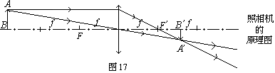
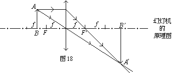
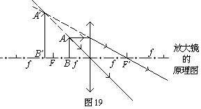
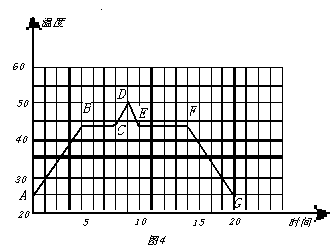

# **初中物理知识点**

在初中阶段只要记得欧姆定律，电功率，电功，电热的计算公式就行了，其他的都是可以去推的。初中的课本中（人教版）原始公式只给出了4个,即I=U/R P=W/t P=UI Q=I^2 Rt其中电热的公式是独立的,其他三个公式是所有式子的基础,重点看前三个式子自身变形。

## **第一章 声现象知识归纳**

1 . 声音的发生：由物体的振动而产生。振动停止，发声也停止。

2．声音的传播：声音靠介质传播。真空不能传声。通常我们听到的声音是靠空气传来的。

3．声速：在空气中传播速度是：340米/秒。声音在固体传播比液体快，而在液体传播又比空气体快。

4．利用回声可测距离：S=1/2vt

5．乐音的三个特征：音调、响度、音色。(1)音调:是指声音的高低，它与发声体的频率有关系。(2)响度:是指声音的大小，跟发声体的振幅、声源与听者的距离有关系。

6．减弱噪声的途径：(1)在声源处减弱；(2)在传播过程中减弱；(3)在人耳处减弱。

7．可听声：频率在20Hz～20000Hz之间的声波：超声波：频率高于20000Hz的声波；次声波：频率低于20Hz的声波。

8．
超声波特点：方向性好、穿透能力强、声能较集中。具体应用有：声呐、B超、超声波速度测定器、超声波清洗器、超声波焊接器等。

9．次声波的特点：可以传播很远，很容易绕过障碍物，而且无孔不入。一定强度的次声波对人体会造成危害，甚至毁坏机械建筑等。它主要产生于自然界中的火山爆发、海啸地震等，另外人类制造的火箭发射、飞机飞行、火车汽车的奔驰、核爆炸等也能产生次声波。

## **第二章 光现象知识归纳**

1.光源：自身能够发光的物体叫光源。

2.太阳光是由红、橙、黄、绿、蓝、靛、紫组成的。

3．光的三原色是：红、绿、蓝；颜料的三原色是：红、黄、蓝。

4．不可见光包括有：红外线和紫外线。特点：红外线能使被照射的物体发热，具有热效应（如太阳的热就是以红外线传送到地球上的）；紫外线最显著的性质是能使荧光物质发光，另外还可以灭菌。

1.光的直线传播：光在均匀介质中是沿直线传播。

2．光在真空中传播速度最大，是3×10^8米/秒，而在空气中传播速度也认为是3×10^8米/秒。

3．我们能看到不发光的物体是因为这些物体反射的光射入了我们的眼睛。

4．光的反射定律：反射光线与入射光线、法线在同一平面上，反射光线与入射光线分居法线两侧，反射角等于入射角。（注：光路是可逆的）

5．漫反射和镜面反射一样遵循光的反射定律。

6．平面镜成像特点：(1) 平面镜成的是虚像；(2)像与物体大小相等；（3）像与物体到镜面的距离相等；(4)像与物体的连线与镜面垂直。另外，平面镜里成的像与物体左右倒置。

7．平面镜应用：(1)成像；(2)改变光路。

8．平面镜在生活中使用不当会造成光污染。

球面镜包括凸面镜（凸镜）和凹面镜（凹镜），它们都能成像。具体应用有：车辆的后视镜、商场中的反光镜是凸面镜；手电筒的反光罩、太阳灶、医术戴在眼睛上的反光镜是凹面镜。

光的折射：光从一种介质斜射入另一种介质时，传播方向一般发生变化的现象。

光的折射规律：光从空气斜射入水或其他介质，折射光线与入射光线、法线在同一平面上；折射光线和入射光线分居法线两侧，折射角小于入射角；入射角增大时，折射角也随着增大；当光线垂直射向介质表面时，传播方向不改变。（折射光路也是可逆的）

## **第三章 透镜知识归纳**

1、凸透镜：中间厚边缘薄的透镜，它对光线有会聚作用，所以也叫会聚透镜。

**2、凸透镜成像的应用:**

>   照相机：原理；成倒立、缩小的实像，u\>2f

幻灯机：原理、成倒立、放大的实像，f\<u\<2f

放大镜：原理、成放大、正立的虚像，u\<f

3、关于实像与虚像的区别：

物点发出的光线经反射或折射后能够会聚到一点，这一点就是物点的实像。实像是实际光线会聚而成，不仅可以用眼睛直接观察，也可以在屏幕上显映出来。

如果物点发出的光线经反射或折射后发散，发散光线的反向延长相交于一点，看起来光线好像从这一点发出，而实际上不存在这样一个发光点，这点就是物点的虚像。虚像只能用眼睛观察，不能用屏幕显映。

跟物体相比较，实像是倒立的，虚像是正立的。

4、凸透镜成像的规律及应用：

*u*——物距、*v*——像距、*f*——焦距。

| 物体位置 | 像的位置       | 像的大小   | 像的性质 | 应用举例 |                 |
|----------|----------------|------------|----------|----------|-----------------|
| u\>2f    | f\< **v** \<2f | 像、物异侧 | 缩小     | 倒立实像 | 照像机          |
| u=2f     | **v** =2f      | 像、物异侧 | 等大     | 倒立实像 | **测焦距**      |
| f\<u\<2f | **v** \>2f     | 像、物异侧 | 放大     | 倒立实像 | 幻灯机、 投影仪 |

5、凸透镜成像的作图：

(1)物体在二倍焦距以外(u\>2f)，成倒立、缩小的实像(像距：f\<v\<2f)，如照相机；

(2)物体在焦距和二倍焦距之间(f\<u\<2f),成倒立、放大的实像(像距：v\>2f)。如幻灯机。

(3)物体在焦距之内（u\<f）,成正立、放大的虚像。

6、凸透镜成像的动态情景：

①当物体从二倍焦距以外的地方逐渐向凸透镜移近过程中，像逐渐变大，像距*v*也逐渐变大。但是，只要物体未到达二倍焦距点时，像的大小比物体要小；像的位置总在镜的另一侧一倍焦距至二倍焦距之间。

②当物体到达二倍焦距之内逐渐向一倍焦距点移动过程中，像变大，像距*v*也变大。像的大小总比物体要大，像的位置总在镜的另一侧二倍焦距以外。

③可见，二倍焦距点是凸透镜成缩小实像与放大实像的分界点。即物体在二倍焦距以外时所成实像小于物体；物体在二倍焦距以内时所成实像要大于物体。

④当物体在一倍焦距以内时，只能在与物体同侧的地方得到正立放大的虚像。因此，焦点*F*是凸透镜成实像与虚像的分界点。

7．作光路图注意事项：

　(1).要借助工具作图；(2)是实际光线画实线，不是实际光线画虚线；(3)光线要带箭头，光线与光线之间要连接好，不要断开；(4)作光的反射或折射光路图时，应先在入射点作出法线(虚线)，然后根据反射角与入射角或折射角与入射角的关系作出光线；(5)光发生折射时，处于空气中的那个角较大；(6)平行主光轴的光线经凹透镜发散后的光线的反向延长线一定相交在虚焦点上；(7)平面镜成像时，反射光线的反向延长线一定经过镜后的像；(8)画透镜时，一定要在透镜内画上斜线作阴影表示实心。

8、与光的反射、折射现象相联系的光学器件及应用：

9、的眼睛像一架神奇的照相机，晶状体相当于照相机的镜头透镜），视网膜相当于照相机内的胶片。

10．近视眼看不清远处的景物，需要配戴凹透镜；远视眼看不清近处的景物，需要配戴凸透镜。

11．望远镜能使远处的物体在近处成像，其中伽利略望远镜目镜是凹透镜，物镜是凸透镜；开普勒望远镜目镜物镜都是凸透镜（物镜焦距长，目镜焦距短）。

12．显微镜的目镜物镜也都是凸透镜（物镜焦距短，目镜焦距长）。

## **第四章 物态变化知识归纳**

1.温度：是指物体的冷热程度。测量的工具是温度计,温度计是根据液体的热胀冷缩的原理制成的。

2.摄氏温度(℃):单位是摄氏度。1摄氏度的规定：把冰水混合物温度规定为0度，把一标准大气压下沸水的温度规定为100度，在0度和100度之间分成100等分，每一等分为1℃。

３．常见的温度计有(1)实验室用温度计；(2)体温计；(3)寒暑表。

体温计：测量范围是35℃至42℃，每一小格是0.1℃。

4.温度计使用：(1)使用前应观察它的量程和最小刻度值；(2)使用时温度计玻璃泡要全部浸入被测液体中，不要碰到容器底或容器壁；(3)待温度计示数稳定后再读数；(4)读数时玻璃泡要继续留在被测液体中，视线与温度计中液柱的上表面相平。

5.固体、液体、气体是物质存在的三种状态。

6.熔化：物质从固态变成液态的过程叫熔化。要吸热。

7.凝固：物质从液态变成固态的过程叫凝固。要放热.

8.熔点和凝固点：晶体熔化时保持不变的温度叫熔点；晶体凝固时保持不变的温度叫凝固点。晶体的熔点和凝固点相同。

9.晶体和非晶体的重要区别：晶体都有一定的熔化温度（即熔点），而非晶体没有熔点。

10. 熔化和凝固曲线图：

11.（晶体熔化和凝固曲线图） (非晶体熔化曲线图）

12.上图中AD是晶体熔化曲线图，晶体在AB段处于固态，在BC段是熔化过程，吸热，但温度不变，处于固液共存状态，CD段处于液态；而DG是晶体凝固曲线图，DE段于液态，EF段落是凝固过程，放热，温度不变，处于固液共存状态，FG处于固态。

13.汽化：物质从液态变为气态的过程叫汽化，汽化的方式有蒸发和沸腾。都要吸热。

14.蒸发：是在任何温度下，且只在液体表面发生的，缓慢的汽化现象。

15.沸腾：是在一定温度(沸点)下，在液体内部和表面同时发生的剧烈的汽化现象。液体沸腾时要吸热，但温度保持不变，这个温度叫沸点。

16.影响液体蒸发快慢的因素：(1)液体温度；(2)液体表面积；(3)液面上方空气流动快慢。

17.液化：物质从气态变成液态的过程叫液化，液化要放热。使气体液化的方法有：降低温度和压缩体积。（液化现象如：“白气”、雾、等）

18.升华和凝华：物质从固态直接变成气态叫升华，要吸热；而物质从气态直接变成固态叫凝华，要放热。

19.水循环：自然界中的水不停地运动、变化着，构成了一个巨大的水循环系统。水的循环伴随着能量的转移。

## **第五章 电流和电路知识归纳**

1.电源：能提供持续电流（或电压）的装置。

2.电源是把其他形式的能转化为电能。如干电池是把化学能转化为电能。发电机则由机械能转化为电能。

3.有持续电流的条件：必须有电源和电路闭合。

4.导体：容易导电的物体叫导体。如：金属，人体，大地，酸、碱、盐的水溶液等。

5.绝缘体：不容易导电的物体叫绝缘体。如：橡胶，玻璃，陶瓷，塑料，油，纯水等。

6.电路组成：由电源、导线、开关和用电器组成。

7.电路有三种状态：(1)通路：接通的电路叫通路；(2)断路：断开的电路叫开路；(3)短路：直接把导线接在电源两极上的电路叫短路。

8.电路图：用符号表示电路连接的图叫电路图。

9.串联：把电路元件逐个顺次连接起来的电路，叫串联。（电路中任意一处断开，电路中都没有电流通过）

10.并联：把电路元件并列地连接起来的电路，叫并联。（并联电路中各个支路是互不影响的）

11．电流的大小用电流强度(简称电流)表示。

12．电流I的单位是：国际单位是：安培(A)；常用单位是：毫安(mA)、微安(µA)。1安培=10^3毫安=10^6微安。

13．测量电流的仪表是：电流表，它的使用规则是：①电流表要串联在电路中；②接线柱的接法要正确，使电流从“+”接线柱入，从“-”接线柱出；③被测电流不要超过电流表的量程；④绝对不允许不经过用电器而把电流表连到电源的两极上。

14．实验室中常用的电流表有两个量程：①0～0.6安，每小格表示的电流值是0.02安；②0～3安，每小格表示的电流值是0.1安。

## **第六章 电压和电阻**

1．电压(U):电压是使电路中形成电流的原因，电源是提供电压的装置。

2．电压U的单位是：国际单位是：伏特(V)；常用单位是：千伏(KV)、毫伏(mV)、微伏(µV)。1千伏=103伏=106毫伏=109微伏。

3．测量电压的仪表是：电压表，它的使用规则是：①电压表要并联在电路中；②接线柱的接法要正确，使电流从“+”接线柱入，从“-”接线柱出；③被测电压不要超过电压表的量程；

4．实验室中常用的电压表有两个量程：①0～3伏，每小格表示的电压值是0.1伏；②0～15伏，每小格表示的电压值是0.5伏。

5．熟记的电压值：

①1节干电池的电压1.5伏；②1节铅蓄电池电压是2伏；③家庭照明电压为220伏；④对人体安全的电压是：不高于36伏；⑤工业电压380伏。

6．电阻(R)：表示导体对电流的阻碍作用。(导体如果对电流的阻碍作用越大，那么电阻就越大，而通过导体的电流就越小)。

7．电阻(R)的单位：国际单位：欧姆(Ω)；常用的单位有：兆欧(MΩ)、千欧(KΩ)。

1兆欧=10^3千欧；1千欧=10^3欧。

8．决定电阻大小的因素：导体的电阻是导体本身的一种性质，它的大小决定于导体的材料、长度、横截面积和温度。（电阻与加在导体两端的电压和通过的电流无关）

9．变阻器：(滑动变阻器和电阻箱)

(1)滑动变阻器：

① 原理：改变接入电路中电阻线的长度来改变电阻的。

② 作用：通过改变接入电路中的电阻来改变电路中的电流和电压。

③铭牌：如一个滑动变阻器标有“50Ω2A”表示的意义是：最大阻值是50Ω，允许通过的最大电流是2A。

④正确使用：A．应串联在电路中使用；B．接线要“一上一下”；C．通电前应把阻值调至最大的地方。

(2)电阻箱：是能够表示出电阻值的变阻器。

10．家庭电路由：进户线→电能表→总开关→保险盒→用电器。

11．两根进户线是火线和零线，它们之间的电压是220伏，可用测电笔来判别。如果测电笔中氖管发光，则所测的是火线，不发光的是零线。

12．所有家用电器和插座都是并联的。而开关则要与它所控制的用电器串联。

13．保险丝：是用电阻率大，熔点低的铅锑合金制成。它的作用是当电路中有过大的电流时，保险产生较多的热量，使它的温度达到熔点，从而熔断，自动切断电路，起到保险的作用。

14．引起电路中电流过大的原因有两个：一是电路发生短路；二是用电器总功率过大。

15．安全用电的原则是：①不接触低压带电体；②不靠近高压带电体。

在安装电路时，要把电能表接在干路上，保险丝应接在火线上（一根足够）；控制开关应串联在干路

## **第七章 欧姆定律知识归纳**

1．欧姆定律：导体中的电流，与导体两端的电压成 正比，与导体的电阻成反比。

2．公式：（I=U/R）式 中单位：I→安(A)；U→伏(V)；R→欧(Ω)。1安=1伏/欧。

3．公式的理解：①公式中的I、U和R必须是在同一段电路中；②I、U和R中已知任意的两个量就可求另一个量；③计算时单位要统一。

4．欧姆定律的应用：

① 同一个电阻，阻值不变，与电流和电压无关,但加在这个电阻两端的电压增大时，通过的电流也增大。（R=U/I）

②当电压不变时，电阻越大，则通过的电流就越小。（I=U/R）

③当电流一定时，电阻越大，则电阻两端的电压就越大。（U=IR）

5．电阻的串联有以下几个特点：（指R1，R2串联）

① 电流：I=I1=I2（串联电路中各处的电流相等）

② 电压：U=U1+U2（总电压等于各处电压之和）

③ 电阻：R=R1+R2（总电阻等于各电阻之和）如果n个阻值相同的电阻串联，则有R总=nR

④分压作用

⑤ 比例关系：电流：I1∶I2=1∶1

6．电阻的并联有以下几个特点：（指R1，R2并联）

① 电流：I=I1+I2（干路电流等于各支路电流之和）

② 电压：U=U1=U2（干路电压等于各支路电压）

③电阻：（总电阻的倒数等于各并联电阻的倒数和）如果n个阻值相同的电阻并联，则有1/R总=
1/R1+1/R2

④ 分流作用：I1：I2=1/R1：1/R2

⑤ 比例关系：电压：U1∶U2=1∶1

## **第八章 电功和电热知识归纳**

1．电功（W）：电流所做的功叫电功

2．电功的单位：国际单位：焦耳。常用单位有：度（千瓦时），1度=1千瓦时=3.6×10^6焦耳。

3．测量电功的工具：电能表（电度表）

4．电功计算公式：W=UIt（式中单位W→焦(J)；U→伏(V)；I→安(A)；t→秒）。

5．利用W=UIt计算电功时注意：①式中的W.U.I和t是在同一段电路；②计算时单位要统一；③已知任意的三个量都可以求出第四个量。

6.计算电功还可用以下公式：W=I2Rt ；W=Pt；W=UQ（Q是电量）；

7.电功率（P）：电流在单位时间内做的功。单位有：瓦特(国际)；常用单位有：千瓦

8.计算电功率公式：（式中单位P→瓦(w)；W→焦；t→秒；U→伏（V）；I→安（A）

9．利用计算时单位要统一，①如果W用焦、t用秒，则P的单位是瓦；②如果W用千瓦时、t用小时，则P的单位是千瓦。

10．计算电功率还可用右公式：$P=I^2R$和$P=U^2/R$

11．额定电压（$U_0$）：用电器正常工作的电压。

12．额定功率（$P_0$）：用电器在额定电压下的功率。

13．实际电压（U）：实际加在用电器两端的电压。

14．实际功率（P）：用电器在实际电压下的功率。

当$U > U_0$时，则$P > P_0$ ；灯很亮，易烧坏。

当$U < U_0$时，则$P < P_0$ ；灯很暗，

当$U = U_0$时，则$P = P_0$ ；正常发光。

（同一个电阻或灯炮，接在不同的电压下使用，则有；如：当实际电压是额定电压的一半时，则实际功率就是额定功率的1/4。例“220V100W”是表示额定电压是220伏，额定功率是100瓦的灯泡如果接在110伏的电路中，则实际功率是25瓦。）

15．焦耳定律：电流通过导体产生的热量，与电流的平方成正比，与导体的电阻成正比，与通电时间成正比。

16．焦耳定律公式：$Q=I^2Rt$ ，（式中单位Q→焦；I→安(A)；R→欧(Ω)；t→秒。）

17．当电流通过导体做的功(电功)全部用来产生热量(电热)，则有W=Q，可用电功公式来计算Q。（如电热器，电阻就是这样的。）

## **第九章 电转换磁知识归纳**

1．磁性：物体吸引铁、镍、钴等物质的性质。

2．磁体：具有磁性的物体叫磁体。它有指向性：指南北。

3．磁极：磁体上磁性最强的部分叫磁极。

① 任何磁体都有两个磁极，一个是北极（N极）；另一个是南极（S极）

② 磁极间的作用：同名磁极互相排斥，异名磁极互相吸引。

4．磁化：使原来没有磁性的物体带上磁性的过程。

5．磁体周围存在着磁场，磁极间的相互作用就是通过磁场发生的。

6．磁场的基本性质：对入其中的磁体产生磁力的作用。

7．磁场的方向：在磁场中的某一点，小磁针静止时北极所指的方向就是该点的磁场方向。

8．磁感线：描述磁场的强弱和方向而假想的曲线。磁体周围的磁感线是从它北极出来，回到南极。（磁感线是不存在的，用虚线表示，且不相交）

9．磁场中某点的磁场方向、磁感线方向、小磁针静止时北极指的方向相同。

10．地磁的北极在地理位置的南极附近；而地磁的南极则在地理位置的北极附近。(地磁的南北极与地理的南北极并不重合，它们的交角称磁偏角，这是我国学者：沈括最早记述这一现象。）

11．奥斯特实验证明：通电导线周围存在磁场。

12．安培定则：用右手握螺线管，让四指弯向螺线管中电流方向，则大拇指所指的那端就是螺线管的北极（N极）。

13．安培定则的易记易用：入线见，手正握；入线不见，手反握。大拇指指的一端是北极(N极)。

14．通电螺线管的性质：①通过电流越大，磁性越强；②线圈匝数越多，磁性越强；③插入软铁芯，磁性大大增强；④通电螺线管的极性可用电流方向来改变。

15．电磁铁：内部带有铁芯的螺线管就构成电磁铁。

16．电磁铁的特点：①磁性的有无可由电流的通断来控制；②磁性的强弱可由改变电流大小和线圈的匝数来调节；③磁极可由电流方向来改变。

17．电磁继电器：实质上是一个利用电磁铁来控制的开关。它的作用可实现远距离操作，利用低电压、弱电流来控制高电压、强电流。还可实现自动控制。

18．电磁感应：闭合电路的一部分导体在磁场中做切割磁感线运动时，导体中就产生电流，这种现象叫电磁感应，产生的电流叫感应电流。

19.产生感生电流的条件：①电路必须闭合；②只是电路的一部分导体在磁场中；③这部分导体做切割磁感线运动。

20.感应电流的方向：跟导体运动方向和磁感线方向有关。

21.电磁感应现象中是机械能转化为电能。

22.发电机的原理是根据电磁感应现象制成的。交流发电机主要由定子和转子。

23.高压输电的原理：保持输出功率不变，提高输电电压，同时减小电流，从而减小电能的损失。

24.磁场对电流的作用：通电导线在磁场中要受到磁
力的作用。是由电能转化为机械能。应用是制成电动机。

25.通电导体在磁场中受力方向：跟电流方向和磁感 线方向有关。

26.直流电动机原理：是利用通电线圈在磁场里受力 转动的原理制成的。

27．交流电：周期性改变电流方向的电流。

28．直流电：电流方向不改变的电流。

## **第十章 电磁波与现代通信知识归纳**

1．信息：各种事物发出的有意义的消息。

人类历史上，信息和信息传播活动经历了五次巨大的变革是：①语言的诞生；②文字的诞生；③印刷术的诞生；④电磁波的应用；⑤计算机技术的应用。（要求会正确排序）

2．早期的信息传播工具：烽火台，驿马，电报机，电话等。

3．人类储存信息的工具有：①牛骨﹑竹简、木牍，②书，③磁盘﹑光盘。

4．所有的波都在传播周期性的运动形态。例如：水和橡皮绳传播的是凸凹相间的运动形态，而弹簧和声波传播的是疏密相间的运动形态。

5．机械波是振动形式在介质中的传播，它不仅传播了振动的形式，更主要是传播了振动的能量。当信息加载到波上后，就可以传播出去。

6．有关描述波的性质的物理量：①振幅A：波源偏离平衡位置的最大距离，单位是m.②周期T：波源振动一次所需要的时间，单位是s.③频率f：波源每秒类振动的次数，单位是Hz.④波长λ：波在一个周期类传播的距离，单位是m.

7．波的传播速度v与波长、频率的关系是：v=fλ

8．电磁波是在空间传播的周期性变化的电磁场，由于电磁场本身具有物质性，因此电磁波传播时不需要介质。

9．电磁波谱（按波长由小到大或频率由高到低排列）：γ射线、X射线、紫外线、可见光（红橙黄绿蓝靛紫）、红外线﹑微波﹑无线电波。（要了解它们各自应用）。

10．人类应用电磁波传播信息的历史经历了以下变化：①传播的信息形式从文字→声音→图像；②传播的信息量由小到大；③传播的距离由近到远④传播的速度由慢到快。

11．现代“信息高速公路”的两大支柱是：卫星通信和光纤通信，其中光纤通信优点是：容量大、不受外界电磁场干扰、不怕潮湿、不怕腐蚀，互联网是信息高速公路的主干线，互联网用途有：①发送电子邮件；②召开视频会议；③网上发布新闻；④进行远程登陆，实现资源共享等。

12． 电视广播、移动通信是利用微波传递信号的。

## **第十一章 多彩的物质世界**

1．分子动理论的内容是：（1）物质由分子组成的，分子间有空隙；（2）一切物体的分子都永不停息地做无规则运动；（3）分子间存在相互作用的引力和斥力。

2．扩散：不同物质相互接触，彼此进入对方现象。

3．固体、液体压缩时分子间表现为斥力大于引力。

固体很难拉长是分子间表现为引力大于斥力。

4.分子是原子组成的，原子是由原子核和核外电子组成的，原子核是由质子和中子组成的。

5.汤姆逊发现电子（1897年）；卢瑟福发现质子（1919年）；查德威克发现中子（1932年）；盖尔曼提出夸克设想（1961年）。

6.加速器是探索微小粒子的有力武器。

7.银河系是由群星和弥漫物质集会而成的一个庞大天体系统，太阳只是其中一颗普通恒星。

8.宇宙是一个有层次的天体结构系统，大多数科学家都认定：宇宙诞生于距今150亿年的一次大爆炸，这种爆炸是整体的，涉及宇宙全部物质及时间、空间，爆炸导致宇宙空间处处膨胀，温度则相应下降。

9.AU(一个天文单位)是指地球到太阳的距离。

10.(光年)是指光在真空中行进一年所经过的距离。

11．质量(m)：物体中含有物质的多少叫质量。质量国际单位是:千克。其他有：吨，克，毫克，$1吨=10^3千克=10^6克=10^9毫克$（进率是千进）

12．物体的质量不随形状,状态,位置和温度而改变。

13．质量测量工具：实验室常用天平测质量。常用的天平有托盘天平和物理天平。

14．天平的正确使用：(1)把天平放在水平台上，把游码放在标尺左端的零刻线处；(2)调节平衡螺母，使指针指在分度盘的中线处，这时天平平衡；(3)把物体放在左盘里，用镊子向右盘加减砝码并调节游码在标尺上的位置，直到横梁恢复平衡；(4)这时物体的质量等于右盘中砝码总质量加上游码所对的刻度值。

15．使用天平应注意：(1)不能超过最大称量；(2)加减砝码要用镊子，且动作要轻；(3)不要把潮湿的物体和化学药品直接放在托盘上。

16.密度：某种物质单位体积的质量叫做这种物质的密度。用ρ表示密度，m表示质量，V表示体积，密度单位是千克/米^3，(还有：克/厘米^3)，1克/厘米^3=1000千克/米^3；质量m的单位是：千克；体积V的单位是米^3。

17．密度是物质的一种特性，不同种类的物质密度一般不同。

18．水的密度ρ=1.0×10^3千克/米^3

19．密度知识的应用：
(1)鉴别物质：用天平测出质量m和用量筒测出体积V就可据公式：求出物质密度。再查密度表。
(2)求质量：m=ρV。 

(3)求体积：

20．物质的物理属性包括：状态、硬度、密度、比热、透光性、导热性、导电性、磁性、弹性等。

## **第十二章运动力和知识归纳**

1．长度的测量是最基本的测量，最常用的工具是刻度尺。

2．长度的主单位是米，用符号：m表示，我们走两步的距离约是
1米，课桌的高度约0.75米。

3．长度的单位还有千米、分米、厘米、毫米、微米，它们关系是：

1千米=1000米；1分米=0.1米=10^-1米

1厘米=0.01米；1毫米=0.001米=10^-3米

1米=10^6微米；1微米=10^-6米。

4．刻度尺的正确使用：

(1).使用前要注意观察它的零刻线、量程和最小刻度值；
(2).用刻度尺测量时，尺要沿着所测长度，不利用磨损的零刻线；(3).读数时视线要与尺面垂直，在精确测量时，要估读到最小刻度值的下一位；

(4).测量结果由数字和单位组成。

5．误差：测量值与真实值之间的差异，叫误差。

误差是不可避免的，它只能尽量减少，而不能消除，常用减少误差的方法是：多次测量求平均值。

6．特殊测量方法：

(1)累积法：把尺寸很小的物体累积起来，聚成可以用刻度尺来测量的数量后，再测量出它的总长度，然后除以这些小物体的个数，就可以得出小物体的长度。如测量细铜丝的直径，测量一张纸的厚度.(2)平移法：方法如图:(a)测硬币直径；
(b)测乒乓球直径；

(3)替代法：有些物体长度不方便用刻度尺直接测量的，就可用其他物体代替测量。如(a)怎样用短刻度尺测量教学楼的高度，请说出两种方法？

(b)怎样测量学校到你家的距离?(c)怎样测地图上一曲线的长度？（请把这三题答案写出来）

(4)估测法:用目视方式估计物体大约长度的方法。

7.机械运动：物体位置的变化叫机械运动。

8.参照物：在研究物体运动还是静止时被选作标准的物体(或者说被假定不动的物体)叫参照物.

9.运动和静止的相对性：同一个物体是运动还是静止，取决于所选的参照物。

10.匀速直线运动：快慢不变、经过的路线是直线的运动。这是最简单的机械运动。

11.速度：用来表示物体运动快慢的物理量。

12.速体在单位时间内通过的路程。公式：*s=vt*.

速度的单位是：米/秒；千米/小时。1米/秒=3.6千米/小时

13.变速运动：物体运动速度是变化的运动。

14.平均速度：在变速运动中，用总路程除以所用的时间可得物体在这段路程中的快慢程度，这就是平均速度。用公式：;日常所说的速度多数情况下是指平均速度。

15.根据速度可求路程和时间：

16.人类发明的计时工具有：日晷→沙漏→摆钟→石英钟→原子钟。

17．什么是力：力是物体对物体的作用。

18．物体间力的作用是相互的。(一个物体对别的物体施力时，也同时受到后者对它的力)。

19．力的作用效果：力可以改变物体的运动状态，还可以改变物体的形状。（物体形状或体积的改变，叫做形变。）

20．力的单位是：牛顿(简称：牛)，符合是N。1牛顿大约是你拿起两个鸡蛋所用的力。

21．实验室测力的工具是：弹簧测力计。

22．弹簧测力计的原理：在弹性限度内，弹簧的伸长与受到的拉力成正比。

23．弹簧测力计的用法：(1)要检查指针是否指在零刻度，如果不是，则要调零；(2)认清最小刻度和测量范围；(3)轻拉秤钩几次，看每次松手后，指针是否回到零刻度，(4)测量时弹簧测力计内弹簧的轴线与所测力的方向一致；⑸观察读数时，视线必须与刻度盘垂直。（6）测量力时不能超过弹簧测力计的量程。

24．力的三要素是：力的大小、方向、作用点，叫做力的三要素，它们都能影响力的作用效果。

25．力的示意图就是用一根带箭头的线段来表示力。具体的画法是：

(1)用线段的起点表示力的作用点；

(2)延力的方向画一条带箭头的线段，箭头的方向表示力的方向；

(3)若在同一个图中有几个力，则力越大，线段应越长。有时也可以在力的示意图标出力的大小，

26．重力：地面附近物体由于地球吸引而受到的力叫 重力。重力的方向总是竖直向下的。

27.重力的计算公式：G=mg，（式中g是重力与质量的比值：g=9.8牛顿/千克，在粗略计算时也可取g=10牛顿/千克）；重力跟质量成正比。

28．重垂线是根据重力的方向总是竖直向下的原理制成。

29．重心：重力在物体上的作用点叫重心。

30．摩擦力：两个互相接触的物体，当它们要发生或
已经发生相对运动时，就会在接触面是产生一种阻碍相对运动的力，这种力就叫摩擦力。

31．滑动摩擦力的大小跟接触面的粗糙程度和压力大小
有关系。压力越大、接触面越粗糙，滑动摩擦力越大。

32．增大有益摩擦的方法：增大压力和使接触面粗糙些。

减小有害摩擦的方法：(1)使接触面光滑和减小压力；(2)用滚动代替滑动；(3)加润滑油；(4)利用气垫。（5）让物体之间脱离接触（如磁悬浮列车）。

33． 物体在不受力或受到平衡力作用下都会保持静止状态或匀速直线运动状态

34．牛顿第一定律：一切物体在没有受到外力作用的时候，总保持静止状态或匀速直线运动状态。(牛顿第一定律是在经验事实的基础上，通过进一步的推理而概括出来的，因而不能用实验来证明这一定律)。

35．惯性：物体保持运动状态不变的性质叫惯性。牛顿第一定律也叫做惯性定律。

36．物体平衡状态：物体受到几个力作用时，如果保持静止状态或匀速直线运动状态，我们就说这几个力平衡。当物体在两个力的作用下处于平衡状态时，就叫做二力平衡。

37．二力平衡的条件：作用在同一物体上的两个力，如果大小相等、方向相反、并且在同一直线上，则这两个力二力平衡时合力为零。

## **第十三章力和机械**

1．什么是力：力是物体对物体的作用。

2．物体间力的作用是相互的。 (一个物体对别的物体施力时，也同时受到后者对它的力)。

3．力的作用效果：力可以改变物体的运动状态，还可以改变物体的形状。（物体形状或体积的改变，叫做形变。）

4．力的单位是：牛顿(简称：牛)，符合是N。1牛顿大约是你拿起两个鸡蛋所用的力。

5．实验室测力的工具是：弹簧测力计。

6．弹簧测力计的原理：在弹性限度内，弹簧的伸长与受到的拉力成正比。

7．弹簧测力计的用法：(1)要检查指针是否指在零刻度，如果不是，则要调零；(2)认清最小刻度和测量范围；(3)轻拉秤钩几次，看每次松手后，指针是否回到零刻度，(4)测量时弹簧测力计内弹簧的轴线与所测力的方向一致；⑸观察读数时，视线必须与刻度盘垂直。（6）测量力时不能超过弹簧测力计的量程。

8．力的三要素是：力的大小、方向、作用点，叫做力的三要素，它们都能影响力的作用效果。

9．力的示意图就是用一根带箭头的线段来表示力。具体的画法是：

(1)用线段的起点表示力的作用点；

(2)延力的方向画一条带箭头的线段，箭头的方向表示力的方向；

(3)若在同一个图中有几个力，则力越大，线段应越长。有时也可以在力的示意图标出力的大小，

10．重力：地面附近物体由于地球吸引而受到的力叫 重力。重力的方向总是竖直向下的。

11.重力的计算公式：G=mg，（式中g是重力与质量的比值：g=9.8牛顿/千克，在粗略计算时也可取g=10牛顿/千克）；重力跟质量成正比。

12．重垂线是根据重力的方向总是竖直向下的原理制成。

13．重心：重力在物体上的作用点叫重心。

14．摩擦力：两个互相接触的物体，当它们要发生或
已经发生相对运动时，就会在接触面是产生一种阻碍相对运动的力，这种力就叫摩擦力。

15．滑动摩擦力的大小跟接触面的粗糙程度和压力大小
有关系。压力越大、接触面越粗糙，滑动摩擦力越大。

16．增大有益摩擦的方法：增大压力和使接触面粗糙些。

减小有害摩擦的方法：(1)使接触面光滑和减小压
力；(2)用滚动代替滑动；(3)加润滑油；(4)利用气垫。（5）让物体之间脱离接触（如磁悬浮列车）。

17．杠杆：一根在力的作用下能绕着固定点转动的硬 棒就叫杠杆。

18．什么是支点、动力、阻力、动力臂、阻力臂？

(1)支点：杠杆绕着转动的点(o)

(2)动力：使杠杆转动的力($F_1$)

(3)阻力：阻碍杠杆转动的力($F_2$)

(4)动力臂：从支点到动力的作用线的距离（$L_1$）。

(5)阻力臂：从支点到阻力作用线的距离（$L_2$）

19．杠杆平衡的条件:动力×动力臂=阻力×阻力臂.或写作：$F_1L_1=F_2L_2$ 或写成。这个平衡条件也就是阿基米德发现的杠杆原理。

20．三种杠杆：

(1)省力杠杆：L1\>L2,平衡时F1\<F2。特点是省力，但费距离。（如剪铁剪刀，铡刀，起子）

(2)费力杠杆：L1\<L2,平衡时F1\>F2。特点是费力，但省距离。（如钓鱼杠，理发剪刀等）

(3)等臂杠杆：L1=L2,平衡时F1=F2。特点是既不省力，也不费力。（如：天平）

21．定滑轮特点：不省力，但能改变动力的方向。（实 质是个等臂杠杆）

22．动滑轮特点：省一半力，但不能改变动力方向,要费距离.(实质是动力臂为阻力臂二倍的杠杆)

23．滑轮组：使用滑轮组时,滑轮组用几段绳子吊着物体,提起物体所用的力就是物重的几分之一。

## **第十四章 压强和浮力知识归纳**

1．压力：垂直作用在物体表面上的力叫压力。

2．压强：物体单位面积上受到的压力叫压强。

3．压强公式：P=F/S，式中p单位是：帕斯卡，简称：帕，1帕=1牛/米2，压力F单位是：牛；受力面积S单位是：米^2

4．增大压强方法 :(1)S不变，F↑;(2)F不变，S↓ (3)同时把F↑，S↓。而减小压强方法则相反。

5．液体压强产生的原因：是由于液体受到重力。

6．液体压强特点：(1)液体对容器底和壁都有压强，(2)液体内部向各个方向都有压强；(3)液体的压强随深度增加而增大，在同一深度，液体向各个方向的压强相等；(4)不同液体的压强还跟密度有关系。

7．液体压强计算公式：p=ρgh，（ρ是液体密度，单位是千克/米3；g=9.8牛/千克；h是深度，指液体自由液面到液体内部某点的竖直距离，单位是米。）

8．根据液体压强公式：p=ρgh可得，液体的压强与液体的密度和深度有关，而与液体的体积和质量无关。

9． 证明大气压强存在的实验是马德堡半球实验。

10．大气压强产生的原因：空气受到重力作用而产生的，大气压强随高度的增大而减小。

11．测定大气压强值的实验是：托里拆利实验。

12．测定大气压的仪器是：气压计，常见气压计有水银气压计和无液气压计（金属盒气压计）。

13．标准大气压：把等于760毫米水银柱的大气压。1标准大气压=760毫米汞柱=1.013×10^5帕=10.34米水柱。

14．沸点与气压关系：一切液体的沸点，都是气压减小时降低，气压增大时升高。

15.流体压强大小与流速关系：在流体中流速越大地方，压强越小；流速越小的地方，压强越大。

16．浮力：一切浸入液体的物体，都受到液体对它竖直向上的力，这个力叫浮力。浮力方向总是竖直向上的。（物体在空气中也受到浮力）

17．物体沉浮条件：（开始是浸没在液体中）

方法一：（比浮力与物体重力大小）

(1)F浮 \< G ，下沉；(2)F浮 \> G ，上浮 (3)F浮 = G ， 悬浮或漂浮

方法二：（比物体与液体的密度大小）

(1) F浮 \< G， 下沉；(2) F浮 \> G ， 上浮 (3) F浮 = G，悬浮。（不会漂浮）

18．浮力产生的原因：浸在液体中的物体受到液体对它的向上和向下的压力差。

19．阿基米德原理：浸入液体里的物体受到向上的浮力，浮力大小等于它排开的液体受到的重力。（浸没在气体里的物体受到的浮力大小等于它排开气体受到的重力）

20．阿基米德原理公式：

21．计算浮力方法有：

(1)称量法：F浮= G — F ，(G是物体受到重力，F 是物体浸入液体中弹簧秤的读数)

(2)压力差法：F浮=F向上-F向下

(3)阿基米德原理：

(4)平衡法：F浮=G物 (适合漂浮、悬浮)

22．浮力利用

(1)轮船：用密度大于水的材料做成空心，使它能排开更多的水。这就是制成轮船的道理。

(2)潜水艇：通过改变自身的重力来实现沉浮。

(3)气球和飞艇：充入密度小于空气的气体。

## **第十五章功和机械能**

1．功的两个必要因素：一是作用在物体上的力；二 是物体在力的方向上通过的距离。

2．功的计算：功(W)等于力(F)跟物体在力的方向上
通过的距离(s)的乘积。（功=力×距离）

3.功的公式：W=Fs；单位：W→焦；F→牛顿；s→米。(1焦=1牛·米).

4．功的原理：使用机械时，人们所做的功，都等于不用机械而直接用手所做的功，也就是说使用任何机械都不省功。

5．斜面：FL=Gh
斜面长是斜面高的几倍，推力就是物重的几分之一。（螺丝、盘山公路也是斜面）

6．机械效率：有用功跟总功的比值叫机械效率。

计算公式：P有/W=η

7．功率(P)：单位时间(t)里完成的功(W)，叫功率。

计算公式：。单位：P→瓦特；W→焦；t→秒。（1瓦=1焦/秒。1千瓦=1000瓦）

8．一个物体能够做功，这个物体就具有能（能量）。

9．动能：物体由于运动而具有的能叫动能。

10．运动物体的速度越大，质量越大，动能就越大。

11．势能分为重力势能和弹性势能。

12．重力势能：物体由于被举高而具有的能。

13．物体质量越大，被举得越高，重力势能就越大。

14．弹性势能：物体由于发生弹性形变而具的能。

15．物体的弹性形变越大，它的弹性势能就越大。

16．机械能：动能和势能的统称。（机械能=动能+势能）单位是：焦耳

17. 动能和势能之间可以互相转化的。

方式有：动能 重力势能；动能 弹性势能。

18．自然界中可供人类大量利用的机械能有风能和水能。

## **第十六章热和能知识归纳**

1．内能：物体内部所有分子做无规则运动的动能
和分子势能的总和叫内能。（内能也称热能）

2．物体的内能与温度有关：物体的温度越高，分子运动速度越快，内能就越大。

3．热运动：物体内部大量分子的无规则运动。

4．改变物体的内能两种方法：做功和热传递，这两种方法对改变物体的内能是等效的。

5．物体对外做功，物体的内能减小；

外界对物体做功，物体的内能增大。

6．物体吸收热量，当温度升高时，物体内能增大；

物体放出热量，当温度降低时，物体内能减小。

7．所有能量的单位都是：焦耳。

8．热量（Q）：在热传递过程中，传递能量的多少叫热量。（物体含有多少热量的说法是错误的）

9．比热（c）：单位质量的某种物质温度升高（或降低）1℃，吸收（或放出）的热量叫做这种物质的比热。

10．比热是物质的一种属性，它不随物质的体积、质量、形状、位置、温度的改变而改变，只要物质相同，比热就相同。

11．比热的单位是：焦耳/(千克·℃)，读作：焦耳每千克摄氏度。

12．水的比热是：C=4.2×10^3焦耳/(千克·℃)，它表示的物理意义是：每千克的水当温度升高（或降低）1℃时，吸收（或放出）的热量是4.2×10^3焦耳。

13．热量的计算：

① Q吸=cm(t-t0)=cm△t升 （Q吸是吸收热量，单位是焦耳；c
是物体比热，单位是：焦/(千克·℃)；m是质量；t0是初始温度；t 是后来的温度。

② Q放 =cm(t0-t)=cm△t降

14．热值（q ）：1千克某种燃料完全燃烧放出的热量，叫热值。单位是：焦耳/千克。

15．燃料燃烧放出热量计算：Q放 =qm；（Q放是热量，单位是：焦耳；q是热值，单位是：焦/千克；m 是质量，单位是：千克。

16．利用内能可以加热，也可以做功。

17．内燃机可分为汽油机和柴油机，它们一个工作循环由吸气、压缩、做功和排气四个冲程。一个工作循环中对外做功1次，活塞往复2次，曲轴转2周。

18．热机的效率：用来做有用功的那部分能量和燃料完全燃烧放出的能量之比，叫热机的效率。的热机的效率是热机性能的一个重要指标

19．在热机的各种损失中，废气带走的能量最多，设法利用废气的能量，是提高燃料利用率的重要措施。

## **第十七章 能源与可持续发展知识归纳**

1. 人类开发利用能源的历史：火→化石能源→电能→核能。

2．能源的种类很多，从不同角度可以分为：一次能源和二次能源；可再生能源和不可再生能源；常规能源（传统能源）和新能源；清洁能源和非清洁能源等。

3．核能获取的途径有两条：重核的裂变和轻核的聚变（聚变也叫热核反应）。原子弹和目前人类制造的核电站是利用重核的裂变释放能量的，而氢弹则是利用轻核的聚变释放能量的。

4．核电站主要组成包括：核反应堆、热交换器、汽轮机和发电机等。

5．太阳能是由不断发生的核聚变产生的，地球上除核能、地热能和潮汐能以外的所有的能量，几乎都来自太阳。人类利用太阳能的三种方式是：①光热转换（太阳能热水器）；②光电转换（太阳能电池）；③光化转换（绿色植物）。

6．能量的转化和守恒定律：能量既不会凭空消灭，也不会凭空产生，它只会从一种形式转化为另一种形式，或者从一个物体转移到另一个物体，而在转化或转移的过程中，其总量保持不变。

7．能量的转移和转化具有方向性。

8．能量转换装置的效率= 转换的能量/输入的总能量×100％

## 公式总结

速度：s=vt

重力与质量：G=mg

密度：m=ρv

压强：F=pS	p:压强（Pa）,N/m^2；S是受力面积

液体压强：p=ρgh

机械功：W=Fs  W:动力做的功 F：动力 s物体在力的方向上通过的距离m

功率公式：W=Pt P:功率 W：功 t：时间s

电流定义式：Q=It I:电流 Q:电荷量 t:时间

欧姆定律：U=IR I:电流 U:电压 R:电阻

