# 初中数学

## 第一章 实数

### 一、实数的概念及分类

1、实数的分类

正有理数

有理数 零 有限小数和无限循环小数

实数 负有理数

正无理数

无理数 无限不循环小数

负无理数

2、无理数

在理解无理数时，要抓住“无限不循环”这一时之，归纳起来有四类：

（1）开方开不尽的数，如 $\sqrt{7}$,$\sqrt[3]{2}$ 等；

（2）有特定意义的数，如圆周率π，或化简后含有π的数，如$$\frac{\pi}{3}$$+8等；

（3）有特定结构的数，如0.1010010001…等；

（4）某些三角函数，如sin60o等

### 二、实数的倒数、相反数和绝对值

1、相反数

实数与它的相反数时一对数（只有符号不同的两个数叫做互为相反数，零的相反数是零），从数轴上看，互为相反数的两个数所对应的点关于原点对称，如果a与b互为相反数，则有a+b=0，a=—b，反之亦成立。

2、绝对值

一个数的绝对值就是表示这个数的点与原点的距离，\|a\|≥0。零的绝对值时它本身，也可看成它的相反数，若\|a\|=a，则a≥0；若\|a\|=-a，则a≤0。正数大于零，负数小于零，正数大于一切负数，两个负数，绝对值大的反而小。

3、倒数

如果a与b互为倒数，则有ab=1，反之亦成立。倒数等于本身的数是1和-1。零没有倒数。

### 三、平方根、算数平方根和立方根

1、平方根

如果一个数的平方等于a，那么这个数就叫做a的平方根（或二次方跟）。

一个数有两个平方根，他们互为相反数；零的平方根是零；负数没有平方根。

正数a的平方根记做“$$\pm \sqrt{a}$$”。

2、算术平方根

正数a的正的平方根叫做a的算术平方根，记作“$$\sqrt{a}$$”。

正数和零的算术平方根都只有一个，零的算术平方根是零。

$$a$$（$$a \geq$$0） $$\sqrt{a} \geq 0$$

$$\sqrt{a^{2}} = \left| a \right| =$$ ；注意$$\sqrt{a}$$的双重非负性：

\-$$a$$（$$a$$ \<0） $$a \geq$$0

3、立方根

如果一个数的立方等于a，那么这个数就叫做a 的立方根（或a 的三次方根）。

一个正数有一个正的立方根；一个负数有一个负的立方根；零的立方根是零。

注意：$$\sqrt[3]{- a} = -
\sqrt[3]{a}$$，这说明三次根号内的负号可以移到根号外面。

### 四、科学记数法和近似数

1、有效数字

一个近似数四舍五入到哪一位，就说它精确到哪一位，这时，从左边第一个不是零的数字起到右边精确的数位止的所有数字，都叫做这个数的有效数字。

2、科学记数法

把一个数写做$$\pm a \times 10^{n}$$的形式，其中$$1 \leq a <
10$$，n是整数，这种记数法叫做科学记数法。

## 五、实数大小的比较

1、数轴

规定了原点、正方向和单位长度的直线叫做数轴（画数轴时，要注意上述规定的三要素缺一不可）。

解题时要真正掌握数形结合的思想，理解实数与数轴的点是一一对应的，并能灵活运用。

2、实数大小比较的几种常用方法

（1）数轴比较：在数轴上表示的两个数，右边的数总比左边的数大。

（2）求差比较：设a、b是实数，

$$
a - b > 0 \Leftrightarrow a > b,
$$

$$
a - b = 0 \Leftrightarrow a = b,
$$

$$
a - b < 0 \Leftrightarrow a < b
$$

（3）求商比较法：设a、b是两正实数，$$\frac{a}{b} > 1 \Leftrightarrow a >
b;\frac{a}{b} = 1 \Leftrightarrow a = b;\frac{a}{b} < 1 \Leftrightarrow a < b;$$

（4）绝对值比较法：设a、b是两负实数，则$$\left| a \right| > \left| b \right|
\Leftrightarrow a < b$$。

（5）平方法：设a、b是两负实数，则$$a^{2} > b^{2} \Leftrightarrow a < b$$。

### 六、实数的运算 （做题的基础，分值相当大)

1、加法交换律 $$a + b = b + a$$

2、加法结合律 $$(a + b) + c = a + (b + c)$$

3、乘法交换律 $$ab = ba$$

4、乘法结合律 $$(ab)c = a(bc)$$

5、乘法对加法的分配律 $$a(b + c) = ab + ac$$

6、实数的运算顺序

先算乘方，再算乘除，最后算加减，如果有括号，就先算括号里面的。

## 第二章 代数式

### 一、整式的有关概念

1、代数式

用运算符号把数或表示数的字母连接而成的式子叫做代数式。单独的一个数或一个字母也是代数式。

2、单项式

只含有数字与字母的积的代数式叫做单项式。

注意：单项式是由系数、字母、字母的指数构成的，其中系数不能用带分数表示，如$$-
4\frac{1}{3}a^{2}b$$，这种表示就是错误的，应写成$$-
\frac{13}{3}a^{2}b$$。一个单项式中，所有字母的指数的和叫做这个单项式的次数。如$$-
5a^{3}b^{2}c$$是6次单项式。

### 二、多项式

1、多项式

几个单项式的和叫做多项式。其中每个单项式叫做这个多项式的项。多项式中不含字母的项叫做常数项。多项式中次数最高的项的次数，叫做这个多项式的次数。

单项式和多项式统称整式。

用数值代替代数式中的字母，按照代数式指明的运算，计算出结果，叫做代数式的值。

注意：（1）求代数式的值，一般是先将代数式化简，然后再将字母的取值代入。

（2）求代数式的值，有时求不出其字母的值，需要利用技巧，“整体”代入。

2、同类项

所有字母相同，并且相同字母的指数也分别相同的项叫做同类项。几个常数项也是同类项。

3、去括号法则

（1）括号前是“+”，把括号和它前面的“+”号一起去掉，括号里各项都不变号。

（2）括号前是“﹣”，把括号和它前面的“﹣”号一起去掉，括号里各项都变号。

4、整式的运算法则

整式的加减法：（1）去括号；（2）合并同类项。

整式的乘法：$$a^{m} a^{n} = a^{m + n}(m,n)$$

$$(a^{m})^{n} = a^{\text{mn}}(m,n)$$

$$(ab)^{n} = a^{n}b^{n}(n)$$

$$(a + b)(a - b) = a^{2} - b^{2}$$

$$(a + b)^{2} = a^{2} + 2ab + b^{2}$$

$$(a - b)^{2} = a^{2} - 2ab + b^{2}$$

整式的除法：$$a^{m} \div a^{n} = a^{m - n}(m,n,a \neq 0)$$

注意：（1）单项式乘单项式的结果仍然是单项式。

（2）单项式与多项式相乘，结果是一个多项式，其项数与因式中多项式的项数相同。

（3）计算时要注意符号问题，多项式的每一项都包括它前面的符号，同时还要注意单项式的符号。

（4）多项式与多项式相乘的展开式中，有同类项的要合并同类项。

（5）公式中的字母可以表示数，也可以表示单项式或多项式。

（6）$$a^{0} = 1(a \neq 0);a^{- p} = \frac{1}{a^{p}}(a \neq 0,p)$$

（7）多项式除以单项式，先把这个多项式的每一项除以这个单项式，再把所得的商相加，单项式除以多项式是不能这么计算的。

### 三、因式分解

1、因式分解

把一个多项式化成几个整式的积的形式，叫做把这个多项式因式分解，也叫做把这个多项式分解因式。

2、因式分解的常用方法

（1）提公因式法：$$ab + ac = a(b + c)$$

（2）运用公式法：$$a^{2} - b^{2} = (a + b)(a - b)$$

$$a^{2} + 2ab + b^{2} = (a + b)^{2}$$

$$a^{2} - 2ab + b^{2} = (a - b)^{2}$$

（3）分组分解法：$$ac + ad + bc + bd = a(c + d) + b(c + d) = (a + b)(c + d)$$

（4）十字相乘法：$$a^{2} + (p + q)a + pq = (a + p)(a + q)$$

3、因式分解的一般步骤：

（1）如果多项式的各项有公因式，那么先提取公因式。

（2）在各项提出公因式以后或各项没有公因式的情况下，观察多项式的项数：2项式可以尝试运用公式法分解因式；3项式可以尝试运用公式法、十字相乘法分解因式；4项式及4项式以上的可以尝试分组分解法分解因式

（3）分解因式必须分解到每一个因式都不能再分解为止。

### 四、分式

1、分式的概念

一般地，用A、B表示两个整式，A÷B就可以表示成$$\frac{A}{B}$$的形式，如果B中含有字母，式子$$\frac{A}{B}$$就叫做分式。其中，A叫做分式的分子，B叫做分式的分母。分式和整式通称为有理式。

整式与分式的区别在于：  
如果代数式的分母中没有字母,就是整式；如果代数式的分母中含有字母,就是分式.  
特别注意,如果代数式的分母中只含有π,而没有字母,因为π是常数,所以不是分式.

2、分式的性质

（1）分式的基本性质：

分式的分子和分母都乘以（或除以）同一个不等于零的整式，分式的值不变。

（2）分式的变号法则：

分式的分子、分母与分式本身的符号，改变其中任何两个，分式的值不变。

3、分式的运算法则

$$
\frac{a}{b} \times \frac{c}{d} = \frac{\text{ac}}{\text{bd}};\frac{a}{b} \div \frac{c}{d} = \frac{a}{b} \times \frac{d}{c} = \frac{\text{ad}}{\text{bc}};
$$

$$
(\frac{a}{b})^{n} = \frac{a^{n}}{b^{n}}(n);
$$

$$
\frac{a}{c} \pm \frac{b}{c} = \frac{a \pm b}{c};
$$

$$
\frac{a}{b} \pm \frac{c}{d} = \frac{\text{ad} \pm \text{bc}}{\text{bd}}
$$

### 五、二次根式 （初中数学基础，分值很大）

1、二次根式

式子$$\sqrt{a}(a \geq
0)$$叫做二次根式，二次根式必须满足：含有二次根号“”；被开方数a必须是非负数。

2、最简二次根式

若二次根式满足：被开方数的因数是整数，因式是整式；被开方数中不含能开得尽方的因数或因式，这样的二次根式叫做最简二次根式。

化二次根式为最简二次根式的方法和步骤：

（1）如果被开方数是分数（包括小数）或分式，先利用商的算数平方根的性质把它写成分式的形式，然后利用分母有理化进行化简。

（2）如果被开方数是整数或整式，先将他们分解因数或因式，然后把能开得尽方的因数或因式开出来。

3、同类二次根式

几个二次根式化成最简二次根式以后，如果被开方数相同，这几个二次根式叫做同类二次根式。

4、二次根式的性质

（1）$$(\sqrt{a})^{2} = a(a \geq 0)$$

$$a(a \geq 0)$$

（2）$$\sqrt{a^{2}} = \left| a \right| =$$

$$- a(a < 0)$$

（3）$$\sqrt{\text{ab}} = \sqrt{a} \sqrt{b}(a \geq 0,b \geq 0)$$

（4）$$\sqrt{\frac{a}{b}} = \frac{\sqrt{a}}{\sqrt{b}}(a \geq 0,b \geq 0)$$

5、二次根式混合运算

二次根式的混合运算与实数中的运算顺序一样，先乘方，再乘除，最后加减，有括号的先算括号里的（或先去括号）。

## 第三章 方程（组）

### 一、一元一次方程的概念

1、方程

含有未知数的等式叫做方程。

2、方程的解

能使方程两边相等的未知数的值叫做方程的解。

3、等式的性质

（1）等式的两边都加上（或减去）同一个数或同一个整式，所得结果仍是等式。

（2）等式的两边都乘以（或除以）同一个数（除数不能是零），所得结果仍是等式。

4、一元一次方程

只含有一个未知数，并且未知数的最高次数是1的整式方程叫做一元一次方程，其中方程$$ax
+ b = 0(x,a \neq 0)$$叫做一元一次方程的标准形式，a是未知数x的系数，b是常数项。

### 二、一元二次方程

1、一元二次方程

含有一个未知数，并且未知数的最高次数是2的整式方程叫做一元二次方程。

2、一元二次方程的一般形式

$$ax^{2} + bx + c = 0(a \neq
0)$$，它的特征是：等式左边十一个关于未知数x的二次多项式，等式右边是零，其中$$ax^{2}$$叫做二次项，a叫做二次项系数；bx叫做一次项，b叫做一次项系数；c叫做常数项。

### 三、一元二次方程的解法

1、直接开平方法

利用平方根的定义直接开平方求一元二次方程的解的方法叫做直接开平方法。直接开平方法适用于解形如$$(x
+ a)^{2} = b$$的一元二次方程。根据平方根的定义可知，$$x + a$$是b的平方根，当$$b
\geq 0$$时，$$x + a = \pm \sqrt{b}$$，$$x = - a \pm
\sqrt{b}$$，当b\<0时，方程没有实数根。

2、配方法

配方法是一种重要的数学方法，它不仅在解一元二次方程上有所应用，而且在数学的其他领域也有着广泛的应用。配方法的理论根据是完全平方公式$$a^{2}
\pm 2ab + b^{2} = (a + b)^{2}$$，把公式中的a看做未知数x，并用x代替，则有$$x^{2}
\pm 2bx + b^{2} = (x \pm b)^{2}$$。

3、公式法

公式法是用求根公式解一元二次方程的解的方法，它是解一元二次方程的一般方法。

一元二次方程$$ax^{2} + bx + c = 0(a \neq 0)$$的求根公式：

$$
x = \frac{- b \pm \sqrt{b^{2} - 4ac}}{2a}(b^{2} - 4ac \geq 0)
$$

4、因式分解法

因式分解法就是利用因式分解的手段，求出方程的解的方法，这种方法简单易行，是解一元二次方程最常用的方法。

### 四、一元二次方程根的判别式

根的判别式

一元二次方程$$ax^{2} + bx + c = 0(a \neq 0)$$中，$$b^{2} -
4ac$$叫做一元二次方程$$ax^{2} + bx + c = 0(a \neq
0)$$的根的判别式，通常用“$$\Delta$$”来表示，即$$\Delta = b^{2} - 4ac$$

### 五、一元二次方程根与系数的关系

如果方程$$ax^{2} + bx + c = 0(a \neq
0)$$的两个实数根是$$x_{1},x_{2}$$，那么$$x_{1} + x_{2} = -
\frac{b}{a}$$，$$x_{1}x_{2} =
\frac{c}{a}$$。也就是说，对于任何一个有实数根的一元二次方程，两根之和等于方程的一次项系数除以二次项系数所得的商的相反数；两根之积等于常数项除以二次项系数所得的商。

### 六、分式方程

1、分式方程

分母里含有未知数的方程叫做分式方程。

2、分式方程的一般方法

解分式方程的思想是将“分式方程”转化为“整式方程”。它的一般解法是：

（1）去分母，方程两边都乘以最简公分母

（2）解所得的整式方程

（3）验根：将所得的根代入最简公分母，若等于零，就是增根，应该舍去；若不等于零，就是原方程的根。

3、分式方程的特殊解法

换元法：

换元法是中学数学中的一个重要的数学思想，其应用非常广泛，当分式方程具有某种特殊形式，一般的去分母不易解决时，可考虑用换元法。

### 七、二元一次方程组

1、二元一次方程

含有两个未知数，并且未知项的最高次数是1的整式方程叫做二元一次方程，它的一般形式是（

2、二元一次方程的解

使二元一次方程左右两边的值相等的一对未知数的值，叫做二元一次方程的一个解。

3、二元一次方程组

两个（或两个以上）二元一次方程合在一起，就组成了一个二元一次方程组。

4二元一次方程组的解

使二元一次方程组的两个方程左右两边的值都相等的两个未知数的值，叫做二元一次方程组的解。

5、二元一次方正组的解法

（1）代入法（2）加减法

6、三元一次方程

把含有三个未知数，并且含有未知数的项的次数都是1的整式方程。

7、三元一次方程组

由三个（或三个以上）一次方程组成，并且含有三个未知数的方程组，叫做三元一次方程组。

## 第四章 不等式（组）

### 一、不等式的概念 

1、不等式

用不等号表示不等关系的式子，叫做不等式。

2、不等式的解集

对于一个含有未知数的不等式，任何一个适合这个不等式的未知数的值，都叫做这个不等式的解。

对于一个含有未知数的不等式，它的所有解的集合叫做这个不等式的解的集合，简称这个不等式的解集。

求不等式的解集的过程，叫做解不等式。

3、用数轴表示不等式的方法

### 二、不等式基本性质

1、不等式两边都加上（或减去）同一个数或同一个整式，不等号的方向不变。

2、不等式两边都乘以（或除以）同一个正数，不等号的方向不变。

3、不等式两边都乘以（或除以）同一个负数，不等号的方向改变。

### 三、一元一次不等式

1、一元一次不等式的概念

一般地，不等式中只含有一个未知数，未知数的次数是1，且不等式的两边都是整式，这样的不等式叫做一元一次不等式。

2、一元一次不等式的解法

解一元一次不等式的一般步骤：

（1）去分母（2）去括号（3）移项（4）合并同类项（5）将x项的系数化为1

### 四、一元一次不等式组

1、一元一次不等式组的概念

几个一元一次不等式合在一起，就组成了一个一元一次不等式组。

几个一元一次不等式的解集的公共部分，叫做它们所组成的一元一次不等式组的解集。

求不等式组的解集的过程，叫做解不等式组。

当任何数x都不能使不等式同时成立，我们就说这个不等式组无解或其解为空集。

2、一元一次不等式组的解法

（1）分别求出不等式组中各个不等式的解集

（2）利用数轴求出这些不等式的解集的公共部分，即这个不等式组的解集。

## 第五章 统计初步与概率初步

### 一、平均数

1、平均数的概念

（1）平均数：一般地，如果有n个数$$x_{1},x_{2},\cdots,x_{n},$$那么，$$\overline{x}
= \frac{1}{n}(x_{1} + x_{2} + \cdots +
x_{n})$$叫做这n个数的平均数，$$\overline{x}$$读作“x拔”。

（2）加权平均数：如果n个数中，$$x_{1}$$出现$$f_{1}$$次，$$x_{2}$$出现$$f_{2}$$次，…，$$x_{k}$$出现$$f_{k}$$次（这里$$f_{1}
+ f_{2} + \cdots f_{k} =
n$$），那么，根据平均数的定义，这n个数的平均数可以表示为$$\overline{x} =
\frac{x_{1}f_{1} + x_{2}f_{2} + \cdots
x_{k}f_{k}}{n}$$，这样求得的平均数$$\overline{x}$$叫做加权平均数，其中$$f_{1},f_{2},\cdots,f_{k}$$叫做权。

2、平均数的计算方法

（1）定义法

当所给数据$$x_{1},x_{2},\cdots,x_{n},$$比较分散时，一般选用定义公式：$$\overline{x}
= \frac{1}{n}(x_{1} + x_{2} + \cdots + x_{n})$$

（2）加权平均数法：

当所给数据重复出现时，一般选用加权平均数公式：$$\overline{x} = \frac{x_{1}f_{1}
+ x_{2}f_{2} + \cdots x_{k}f_{k}}{n}$$，其中$$f_{1} + f_{2} + \cdots f_{k} =
n$$。

（3）新数据法：

当所给数据都在某一常数a的上下波动时，一般选用简化公式：$$\overline{x} =
\overline{x'} + a$$。

其中，常数a通常取接近这组数据平均数的较“整”的数，$$x'_{1} = x_{1} -
a$$，$$x'_{2} = x_{2} - a$$，…，$$x'_{n} = x_{n} - a$$。$$\overline{x'} =
\frac{1}{n}(x'_{1} + x'_{2} + \cdots +
x'_{n})$$是新数据的平均数（通常把$$x_{1},x_{2},\cdots,x_{n},$$叫做原数据，$$x'_{1},x'_{2},\cdots,x'_{n},$$叫做新数据）。

### 二、统计学中的几个基本概念

1、总体

所有考察对象的全体叫做总体。

2、个体

总体中每一个考察对象叫做个体。

3、样本

从总体中所抽取的一部分个体叫做总体的一个样本。

4、样本容量

样本中个体的数目叫做样本容量。

5、样本平均数

样本中所有个体的平均数叫做样本平均数。

6、总体平均数

总体中所有个体的平均数叫做总体平均数，在统计中，通常用样本平均数估计总体平均数。

### 三、众数、中位数

1、众数

在一组数据中，出现次数最多的数据叫做这组数据的众数。

2、中位数

将一组数据按大小依次排列，把处在最中间位置的一个数据（或最中间两个数据的平均数）叫做这组数据的中位数。

### 四、方差 

1、方差的概念

在一组数据$$x_{1},x_{2},\cdots,x_{n},$$中，各数据与它们的平均数$$\overline{x}$$的差的平方的平均数，叫做这组数据的方差。通常用“$$s^{2}$$”表示，即

$$s^{2} = \frac{1}{n}\lbrack(x_{1} - \overline{x})^{2} + (x_{2} -
\overline{x})^{2} + \cdots + (x_{n} - \overline{x})^{2}\rbrack$$

2、方差的计算

（1）基本公式：

$$
s^{2} = \frac{1}{n}\lbrack(x_{1} - \overline{x})^{2} + (x_{2} - \overline{x})^{2} + \cdots + (x_{n} - \overline{x})^{2}\rbrack
$$

（2）简化计算公式（Ⅰ）：

$$
s^{2} = \frac{1}{n}\lbrack(x_{1}^{2} + x_{2}^{2} + \cdots + x_{n}^{2}) - n{\overline{x}}^{2}\rbrack
$$

也可写成$$s^{2} = \frac{1}{n}\lbrack(x_{1}^{2} + x_{2}^{2} + \cdots +
x_{n}^{2})\rbrack - {\overline{x}}^{2}$$

此公式的记忆方法是：方差等于原数据平方的平均数减去平均数的平方。

（3）简化计算公式（Ⅱ）：

$$
s^{2} = \frac{1}{n}\lbrack(x'_{1}^{2} + x'_{2}^{2} + \cdots + x'_{n}^{2}) - n{\overline{x'}}^{2}\rbrack
$$

当一组数据中的数据较大时，可以依照简化平均数的计算方法，将每个数据同时减去一个与它们的平均数接近的常数a，得到一组新数据$$x'_{1}
= x_{1} - a$$，$$x'_{2} = x_{2} - a$$，…，$$x'_{n} = x_{n} - a$$，那么，$$s^{2}
= \frac{1}{n}\lbrack(x'_{1}^{2} + x'_{2}^{2} + \cdots + x'_{n}^{2})\rbrack -
{\overline{x'}}^{2}$$

此公式的记忆方法是：方差等于新数据平方的平均数减去新数据平均数的平方。

（4）新数据法：

原数据$$x_{1},x_{2},\cdots,x_{n},$$的方差与新数据$$x'_{1} = x_{1} -
a$$，$$x'_{2} = x_{2} - a$$，…，$$x'_{n} = x_{n} -
a$$的方差相等，也就是说，根据方差的基本公式，求得$$x'_{1},x'_{2},\cdots,x'_{n},$$的方差就等于原数据的方差。

3、标准差

方差的算数平方根叫做这组数据的标准差，用“s”表示，即

$$
s = \sqrt{s^{2}} = \sqrt{\frac{1}{n}\lbrack(x_{1} - \overline{x})^{2} + (x_{2} - \overline{x})^{2} + \cdots + (x_{n} - \overline{x})^{2}\rbrack}
$$

### 五、频率分布

1、频率分布的意义

在许多问题中，只知道平均数和方差还不够，还需要知道样本中数据在各个小范围所占的比例的大小，这就需要研究如何对一组数据进行整理，以便得到它的频率分布。

2、研究频率分布的一般步骤及有关概念

（1）研究样本的频率分布的一般步骤是：

①计算极差（最大值与最小值的差）

②决定组距与组数

③决定分点

④列频率分布表

⑤画频率分布直方图

（2）频率分布的有关概念

①极差：最大值与最小值的差

②频数：落在各个小组内的数据的个数

③频率：每一小组的频数与数据总数（样本容量n）的比值叫做这一小组的频率。

### 六、确定事件和随机事件

1、确定事件

必然发生的事件：在一定的条件下重复进行试验时，在每次试验中必然会发生的事件。

不可能发生的事件：有的事件在每次试验中都不会发生，这样的事件叫做不可能的事件。

2、随机事件：

在一定条件下，可能发生也可能不放声的事件，称为随机事件。

### 七、随机事件发生的可能性

一般地，随机事件发生的可能性是有大小的，不同的随机事件发生的可能性的大小有可能不同。

对随机事件发生的可能性的大小，我们利用反复试验所获取一定的经验数据可以预测它们发生机会的大小。要评判一些游戏规则对参与游戏者是否公平，就是看它们发生的可能性是否一样。所谓判断事件可能性是否相同，就是要看各事件发生的可能性的大小是否一样，用数据来说明问题。

### 八、概率的意义与表示方法

1、概率的意义

一般地，在大量重复试验中，如果事件A发生的频率$$\frac{n}{m}$$会稳定在某个常数p附近，那么这个常数p就叫做事件A的概率。

2、事件和概率的表示方法

一般地，事件用英文大写字母A，B，C，…，表示事件A的概率p，可记为P（A）=P

### 九、确定事件和随机事件的概率之间的关系 

1、确定事件概率

（1）当A是必然发生的事件时，P（A）=1

（2）当A是不可能发生的事件时，P（A）=0

2、确定事件和随机事件的概率之间的关系

事件发生的可能性越来越小

0 1概率的值

不可能发生 必然发生

事件发生的可能性越来越大

### 十、古典概型 

1、古典概型的定义

某个试验若具有：①在一次试验中，可能出现的结构有有限多个；②在一次试验中，各种结果发生的可能性相等。我们把具有这两个特点的试验称为古典概型。

2、古典概型的概率的求法

一般地，如果在一次试验中，有n种可能的结果，并且它们发生的可能性都相等，事件A包含其中的m中结果，那么事件A发生的概率为P（A）=$$\frac{m}{n}$$

### 十一、列表法求概率 

1、列表法

用列出表格的方法来分析和求解某些事件的概率的方法叫做列表法。

2、列表法的应用场合

当一次试验要设计两个因素，
并且可能出现的结果数目较多时，为不重不漏地列出所有可能的结果，通常采用列表法。

### 十二、树状图法求概率 

1、树状图法

就是通过列树状图列出某事件的所有可能的结果，求出其概率的方法叫做树状图法。

2、运用树状图法求概率的条件

当一次试验要设计三个或更多的因素时，用列表法就不方便了，为了不重不漏地列出所有可能的结果，通常采用树状图法求概率。

### 十三、利用频率估计概率

1、利用频率估计概率

在同样条件下，做大量的重复试验，利用一个随机事件发生的频率逐渐稳定到某个常数，可以估计这个事件发生的概率。

2、在统计学中，常用较为简单的试验方法代替实际操作中复杂的试验来完成概率估计，这样的试验称为模拟实验。

3、随机数

在随机事件中，需要用大量重复试验产生一串随机的数据来开展统计工作。把这些随机产生的数据称为随机数。

## 第六章 一次函数与反比例函数

### 一、平面直角坐标系 

1、平面直角坐标系

在平面内画两条互相垂直且有公共原点的数轴，就组成了平面直角坐标系。

其中，水平的数轴叫做x轴或横轴，取向右为正方向；铅直的数轴叫做y轴或纵轴，取向上为正方向；两轴的交点O（即公共的原点）叫做直角坐标系的原点；建立了直角坐标系的平面，叫做坐标平面。

为了便于描述坐标平面内点的位置，把坐标平面被x轴和y轴分割而成的四个部分，分别叫做第一象限、第二象限、第三象限、第四象限。

注意：x轴和y轴上的点，不属于任何象限。

2、点的坐标的概念

点的坐标用（a，b）表示，其顺序是横坐标在前，纵坐标在后，中间有“，”分开，横、纵坐标的位置不能颠倒。平面内点的坐标是有序实数对，当$$a
\neq b$$时，（a，b）和（b，a）是两个不同点的坐标。

### 二、不同位置的点的坐标的特征 

1、各象限内点的坐标的特征

点P(x,y)在第一象限$$\Leftrightarrow x > 0,y > 0$$

点P(x,y)在第二象限$$\Leftrightarrow x < 0,y > 0$$

点P(x,y)在第三象限$$\Leftrightarrow x < 0,y < 0$$

点P(x,y)在第四象限$$\Leftrightarrow x > 0,y < 0$$

2、坐标轴上的点的特征

点P(x,y)在x轴上$$\Leftrightarrow y = 0$$，x为任意实数

点P(x,y)在y轴上$$\Leftrightarrow x = 0$$，y为任意实数

点P(x,y)既在x轴上，又在y轴上$$\Leftrightarrow$$x，y同时为零，即点P坐标为（0，0）

3、两条坐标轴夹角平分线上点的坐标的特征

点P(x,y)在第一、三象限夹角平分线上$$\Leftrightarrow$$x与y相等

点P(x,y)在第二、四象限夹角平分线上$$\Leftrightarrow$$x与y互为相反数

4、和坐标轴平行的直线上点的坐标的特征

位于平行于x轴的直线上的各点的纵坐标相同。

位于平行于y轴的直线上的各点的横坐标相同。

5、关于x轴、y轴或远点对称的点的坐标的特征

点P与点p’关于x轴对称$$\Leftrightarrow$$横坐标相等，纵坐标互为相反数

点P与点p’关于y轴对称$$\Leftrightarrow$$纵坐标相等，横坐标互为相反数

点P与点p’关于原点对称$$\Leftrightarrow$$横、纵坐标均互为相反数

6、点到坐标轴及原点的距离

点P(x,y)到坐标轴及原点的距离：

（1）点P(x,y)到x轴的距离等于$$\left| y \right|$$

（2）点P(x,y)到y轴的距离等于$$\left| x \right|$$

（3）点P(x,y)到原点的距离等于$$\sqrt{x^{2} + y^{2}}$$

### 三、函数及其相关概念

1、变量与常量

在某一变化过程中，可以取不同数值的量叫做变量，数值保持不变的量叫做常量。

一般地，在某一变化过程中有两个变量x与y，如果对于x的每一个值，y都有唯一确定的值与它对应，那么就说x是自变量，y是x的函数。

2、函数解析式

用来表示函数关系的数学式子叫做函数解析式或函数关系式。

使函数有意义的自变量的取值的全体，叫做自变量的取值范围。

3、函数的三种表示法及其优缺点

（1）解析法

两个变量间的函数关系，有时可以用一个含有这两个变量及数字运算符号的等式表示，这种表示法叫做解析法。

（2）列表法

把自变量x的一系列值和函数y的对应值列成一个表来表示函数关系，这种表示法叫做列表法。

（3）图像法

用图像表示函数关系的方法叫做图像法。

4、由函数解析式画其图像的一般步骤

（1）列表：列表给出自变量与函数的一些对应值

（2）描点：以表中每对对应值为坐标，在坐标平面内描出相应的点

（3）连线：按照自变量由小到大的顺序，把所描各点用平滑的曲线连接起来。

### 四、正比例函数和一次函数 

1、正比例函数和一次函数的概念

一般地，如果$$y = kx + b$$（k，b是常数，k$$\neq$$0），那么y叫做x的一次函数。

特别地，当一次函数$$y = kx + b$$中的b为0时，$$y =
kx$$（k为常数，k$$\neq$$0）。这时，y叫做x的正比例函数。

2、一次函数的图像

所有一次函数的图像都是一条直线

3、一次函数、正比例函数图像的主要特征：一次函数$$y = kx +
b$$的图像是经过点（0，b）的直线；正比例函数$$y =
kx$$的图像是经过原点（0，0）的直线。

| **k的符号**                                                       | **b的符号** | **函数图像** | **图像特征**                               |
|-------------------------------------------------------------------|-------------|--------------|--------------------------------------------|
| k\>0                                                              | b\>0        |              | 图像经过一、二、三象限，y随x的增大而增大。 |
|                                                                   | b\<0        |              | 图像经过一、三、四象限，y随x的增大而增大。 |
| k\<0                                                              | b\>0        |              | 图像经过一、二、四象限，y随x的增大而减小   |
|                                                                   | b\<0        |              | 图像经过二、三、四象限，y随x的增大而减小。 |
| 注：当b=0时，一次函数变为正比例函数，正比例函数是一次函数的特例。 |             |              |                                            |

4、正比例函数的性质

一般地，正比例函数$$y = kx$$有下列性质：

（1）当k\>0时，图像经过第一、三象限，y随x的增大而增大；

（2）当k\<0时，图像经过第二、四象限，y随x的增大而减小。

5、一次函数的性质

一般地，一次函数$$y = kx + b$$有下列性质：

（1）当k\>0时，y随x的增大而增大

（2）当k\<0时，y随x的增大而减小

6、正比例函数和一次函数解析式的确定

确定一个正比例函数，就是要确定正比例函数定义式$$y =
kx$$（k$$\neq$$0）中的常数k。确定一个一次函数，需要确定一次函数定义式$$y = kx +
b$$（k$$\neq$$0）中的常数k和b。解这类问题的一般方法是待定系数法。

### 五、反比例函数 

1、反比例函数的概念

一般地，函数$$y =
\frac{k}{x}$$（k是常数，k$$\neq$$0）叫做反比例函数。反比例函数的解析式也可以写成$$y
= kx^{-
1}$$的形式。自变量x的取值范围是x$$\neq$$0的一切实数，函数的取值范围也是一切非零实数。

2、反比例函数的图像

反比例函数的图像是双曲线，它有两个分支，这两个分支分别位于第一、三象限，或第二、四象限，它们关于原点对称。由于反比例函数中自变量x$$\neq$$0，函数y$$\neq$$0，所以，它的图像与x轴、y轴都没有交点，即双曲线的两个分支无限接近坐标轴，但永远达不到坐标轴。

3、反比例函数的性质

| 反比例函数 | y = \\frac{k}{x}(k \\neq 0)                                                                                                               |                                                                                                                                           |
|------------|-------------------------------------------------------------------------------------------------------------------------------------------|-------------------------------------------------------------------------------------------------------------------------------------------|
| k的符号    | k\>0                                                                                                                                      | k\<0                                                                                                                                      |
| 图像       |                                                                                                                                           |                                                                                                                                           |
| 性质       | ①x的取值范围是x$$\neq$$0， y的取值范围是y$$\neq$$0； ②当k\>0时，函数图像的两个分支分别 在第一、三象限。在每个象限内，y 随x 的增大而减小。 | ①x的取值范围是x$$\neq$$0， y的取值范围是y$$\neq$$0； ②当k\<0时，函数图像的两个分支分别 在第二、四象限。在每个象限内，y 随x 的增大而增大。 |

4、反比例函数解析式的确定

确定及诶是的方法仍是待定系数法。由于在反比例函数$$y =
\frac{k}{x}$$中，只有一个待定系数，因此只需要一对对应值或图像上的一个点的坐标，即可求出k的值，从而确定其解析式。

5、反比例函数中反比例系数的几何意义

如下图，过反比例函数$$y = \frac{k}{x}(k \neq
0)$$图像上任一点P作x轴、y轴的垂线PM，PN，则所得的矩形PMON的面积S=PM$$$$PN=$$\left|
y \right| \left| x \right| = \left| \text{xy} \right|$$。

$$\because y = \frac{k}{x},\therefore xy = k,S = \left| k \right|$$。

## 第七章 二次函数

### 一、二次函数的概念和图像 

1、二次函数的概念

一般地，如果$$y = ax^{2} + bx + c(a,b,c,a \neq 0)$$，那么y叫做x 的二次函数。

$$y = ax^{2} + bx + c(a,b,c,a \neq 0)$$叫做二次函数的一般式。

2、二次函数的图像

二次函数的图像是一条关于$$x = - \frac{b}{2a}$$对称的曲线，这条曲线叫抛物线。

抛物线的主要特征：

①有开口方向；②有对称轴；③有顶点。

3、二次函数图像的画法

五点法：

（1）先根据函数解析式，求出顶点坐标，在平面直角坐标系中描出顶点M，并用虚线画出对称轴

（2）求抛物线$$y = ax^{2} + bx + c$$与坐标轴的交点：

当抛物线与x轴有两个交点时，描出这两个交点A,B及抛物线与y轴的交点C，再找到点C的对称点D。将这五个点按从左到右的顺序连接起来，并向上或向下延伸，就得到二次函数的图像。

当抛物线与x轴只有一个交点或无交点时，描出抛物线与y轴的交点C及对称点D。由C、M、D三点可粗略地画出二次函数的草图。如果需要画出比较精确的图像，可再描出一对对称点A、B，然后顺次连接五点，画出二次函数的图像。

### 二、二次函数的解析式 

二次函数的解析式有三种形式：

（1）一般式：$$y = ax^{2} + bx + c(a,b,c,a \neq 0)$$

（2）顶点式：$$y = a(x - h)^{2} + k(a,h,k,a \neq 0)$$

（3）当抛物线$$y = ax^{2} + bx + c$$与x轴有交点时，即对应二次好方程$$ax^{2} + bx
+ c = 0$$有实根$$x_{1}$$和$$x_{2}$$存在时，根据二次三项式的分解因式$$ax^{2} + bx
+ c = a(x - x_{1})(x - x_{2})$$，二次函数$$y = ax^{2} + bx +
c$$可转化为两根式$$y = a(x - x_{1})(x - x_{2})$$。如果没有交点，则不能这样表示。

### 三、二次函数的最值 

如果自变量的取值范围是全体实数，那么函数在顶点处取得最大值（或最小值），即当$$x
= - \frac{b}{2a}$$时，$$y_{} = \frac{4ac - b^{2}}{4a}$$。

如果自变量的取值范围是$$x_{1} \leq x \leq x_{2}$$，那么，首先要看$$-
\frac{b}{2a}$$是否在自变量取值范围$$x_{1} \leq x \leq
x_{2}$$内，若在此范围内，则当x=$$- \frac{b}{2a}$$时，$$y_{} = \frac{4ac -
b^{2}}{4a}$$；若不在此范围内，则需要考虑函数在$$x_{1} \leq x \leq
x_{2}$$范围内的增减性，如果在此范围内，y随x的增大而增大，则当$$x =
x_{2}$$时，$$y_{} = ax_{2}^{2} + bx_{2} + c$$，当$$x = x_{1}$$时，$$y_{} =
ax_{1}^{2} + bx_{1} + c$$；如果在此范围内，y随x的增大而减小，则当$$x =
x_{1}$$时，$$y_{} = ax_{1}^{2} + bx_{1} + c$$，当$$x = x_{2}$$时，$$y_{} =
ax_{2}^{2} + bx_{2} + c$$。

### 四、二次函数的性质 

1、二次函数的性质

| 函数 | 二次函数 |
|------|----------|

$$
y = ax^{2} + bx + c(a,b,c,a \neq 0)
$$

| 图像 | a\>0                                                                                                                                                                                                                                                                                                                                                                                  | a\<0                                                                                                                                                                                                                                                                                                                                                                                  |
|------|---------------------------------------------------------------------------------------------------------------------------------------------------------------------------------------------------------------------------------------------------------------------------------------------------------------------------------------------------------------------------------------|---------------------------------------------------------------------------------------------------------------------------------------------------------------------------------------------------------------------------------------------------------------------------------------------------------------------------------------------------------------------------------------|
|      | y 0 x                                                                                                                                                                                                                                                                                                                                                                                 | y 0 x                                                                                                                                                                                                                                                                                                                                                                                 |
| 性质 | （1）抛物线开口向上，并向上无限延伸； （2）对称轴是x=$$- \frac{b}{2a}$$，顶点坐标是（$$- \frac{b}{2a}$$，$$\frac{4ac - b^{2}}{4a}$$）； （3）在对称轴的左侧，即当x\<$$- \frac{b}{2a}$$时，y随x的增大而减小；在对称轴的右侧，即当x\>$$- \frac{b}{2a}$$时，y随x的增大而增大，简记左减右增； （4）抛物线有最低点，当x=$$- \frac{b}{2a}$$时，y有最小值，$$y_{} = \frac{4ac - b^{2}}{4a}$$ | （1）抛物线开口向下，并向下无限延伸； （2）对称轴是x=$$- \frac{b}{2a}$$，顶点坐标是（$$- \frac{b}{2a}$$，$$\frac{4ac - b^{2}}{4a}$$）； （3）在对称轴的左侧，即当x\<$$- \frac{b}{2a}$$时，y随x的增大而增大；在对称轴的右侧，即当x\>$$- \frac{b}{2a}$$时，y随x的增大而减小，简记左增右减； （4）抛物线有最高点，当x=$$- \frac{b}{2a}$$时，y有最大值，$$y_{} = \frac{4ac - b^{2}}{4a}$$ |

2、二次函数$$y = ax^{2} + bx + c(a,b,c,a \neq 0)$$中，$$abc$$的含义：

$$a$$表示开口方向：$$a$$ \>0时，抛物线开口向上

$$a$$ \<0时，抛物线开口向下

$$b$$与对称轴有关：对称轴为x=$$- \frac{b}{2a}$$

$$c$$表示抛物线与y轴的交点坐标：（0，$$c$$）

3、二次函数与一元二次方程的关系

一元二次方程的解是其对应的二次函数的图像与x轴的交点坐标。

因此一元二次方程中的$$\Delta = b^{2} -
4ac$$，在二次函数中表示图像与x轴是否有交点。

当$$\Delta$$\>0时，图像与x轴有两个交点；

当$$\Delta$$=0时，图像与x轴有一个交点；

当$$\Delta$$\<0时，图像与x轴没有交点。

**补充：**

1、两点间距离公式（当遇到没有思路的题时，可用此方法拓展思路，以寻求解题方法）

y

如图：点A坐标为（x1，y1）点B坐标为（x2，y2）

则AB间的距离，即线段AB的长度为$$\sqrt{\left( x_{1} - x_{2} \right)^{2} + \left(
y_{1} - y_{2} \right)^{2}}$$ A

0 x

B

2、函数平移规律（中考试题中，只占3分，但掌握这个知识点，对提高答题速度有很大帮助，可以大大节省做题的时间）

**左加右减、上加下减**

## 第八章 图形的初步认识

### 一、直线、射线和线段

1、几何图形

从实物中抽象出来的各种图形，包括立体图形和平面图形。

立体图形：有些几何图形的各个部分不都在同一平面内，它们是立体图形。

平面图形：有些几何图形的各个部分都在同一平面内，它们是平面图形。

2、点、线、面、体

（1）几何图形的组成

点：线和线相交的地方是点，它是几何图形中最基本的图形。

线：面和面相交的地方是线，分为直线和曲线。

面：包围着体的是面，分为平面和曲面。

体：几何体也简称体。

（2）点动成线，线动成面，面动成体。

3、直线的概念

一根拉得很紧的线，就给我们以直线的形象，直线是直的，并且是向两方无限延伸的。

4、射线的概念

直线上一点和它一旁的部分叫做射线。这个点叫做射线的端点。

5、线段的概念

直线上两个点和它们之间的部分叫做线段。这两个点叫做线段的端点。

6、点、直线、射线和线段的表示

在几何里，我们常用字母表示图形。

一个点可以用一个大写字母表示。

一条直线可以用一个小写字母表示。

一条射线可以用端点和射线上另一点来表示。

一条线段可用它的端点的两个大写字母来表示。

**注意：**

（1）表示点、直线、射线、线段时，都要在字母前面注明点、直线、射线、线段。

（2）直线和射线无长度，线段有长度。

（3）直线无端点，射线有一个端点，线段有两个端点。

（4）点和直线的位置关系有线面两种：

①点在直线上，或者说直线经过这个点。

②点在直线外，或者说直线不经过这个点。

7、直线的性质

（1）直线公理：经过两个点有一条直线，并且只有一条直线。它可以简单地说成：过两点有且只有一条直线。

（2）过一点的直线有无数条。

（3）直线是是向两方面无限延伸的，无端点，不可度量，不能比较大小。

（4）直线上有无穷多个点。

（5）两条不同的直线至多有一个公共点。

8、线段的性质

（1）线段公理：所有连接两点的线中，线段最短。也可简单说成：两点之间线段最短。

（2）连接两点的线段的长度，叫做这两点的距离。

（3）线段的中点到两端点的距离相等。

（4）线段的大小关系和它们的长度的大小关系是一致的。

9、线段垂直平分线的性质定理及逆定理

垂直于一条线段并且平分这条线段的直线是这条线段的垂直平分线。

线段垂直平分线的性质定理：线段垂直平分线上的点和这条线段两个端点的距离相等。

逆定理：和一条线段两个端点距离相等的点，在这条线段的垂直平分线上。

### 二、角 

1、角的相关概念

有公共端点的两条射线组成的图形叫做角，这个公共端点叫做角的顶点，这两条射线叫做角的边。

当角的两边在一条直线上时，组成的角叫做平角。

平角的一半叫做直角；小于直角的角叫做锐角；大于直角且小于平角的角叫做钝角。

如果两个角的和是一个直角，那么这两个角叫做互为余角，其中一个角叫做另一个角的余角。

如果两个角的和是一个平角，那么这两个角叫做互为补角，其中一个角叫做另一个角的补角。

2、角的表示

角可以用大写英文字母、阿拉伯数字或小写的希腊字母表示，具体的有一下四种表示方法：

①用数字表示单独的角，如∠1，∠2，∠3等。

②用小写的希腊字母表示单独的一个角，如∠α，∠β，∠γ，∠θ等。

③用一个大写英文字母表示一个独立（在一个顶点处只有一个角）的角，如∠B，∠C等。

④用三个大写英文字母表示任一个角，如∠BAD，∠BAE，∠CAE等。

注意：用三个大写英文字母表示角时，一定要把顶点字母写在中间，边上的字母写在两侧。

3、角的度量

角的度量有如下规定：把一个平角180等分，每一份就是1度的角，单位是度，用“°”表示，1度记作“1°”，n度记作“n°”。

把1°的角60等分，每一份叫做1分的角，1分记作“1’”。

把1’ 的角60等分，每一份叫做1秒的角，1秒记作“1””。

1°==

4、角的性质

（1）角的大小与边的长短无关，只与构成角的两条射线的幅度大小有关。

（2）角的大小可以度量，可以比较

（3）角可以参与运算。

5、角的平分线及其性质

一条射线把一个角分成两个相等的角，这条射线叫做这个角的平分线。

角的平分线有下面的性质定理：

（1）角平分线上的点到这个角的两边的距离相等。

（2）到一个角的两边距离相等的点在这个角的平分线上。

### 三、相交线 

1、相交线中的角

两条直线相交，可以得到四个角，我们把两条直线相交所构成的四个角中，有公共顶点但没有公共边的两个角叫做对顶角。我们把两条直线相交所构成的四个角中，有公共顶点且有一条公共边的两个角叫做临补角。

临补角互补，对顶角相等。

直线AB，CD与EF相交（或者说两条直线AB，CD被第三条直线EF所截），构成八个角。其中∠1与∠5这两个角分别在AB，CD的上方，并且在EF的同侧，像这样位置相同的一对角叫做同位角；∠3与∠5这两个角都在AB，CD之间，并且在EF的异侧，像这样位置的两个角叫做内错角；∠3与∠6在直线AB，CD之间，并侧在EF的同侧，像这样位置的两个角叫做同旁内角。

2、垂线

两条直线相交所成的四个角中，有一个角是直角时，就说这两条直线互相垂直。其中一条直线叫做另一条直线的垂线，它们的交点叫做垂足。

直线AB，CD互相垂直，记作“AB⊥CD”（或“CD⊥AB”)，读作“AB垂直于CD”（或“CD垂直于AB”）。

垂线的性质：

性质1：过一点有且只有一条直线与已知直线垂直。

性质2：直线外一点与直线上各点连接的所有线段中，垂线段最短。简称：垂线段最短。

### 四、平行线

1、平行线的概念

在同一个平面内，不相交的两条直线叫做平行线。平行用符号“∥”表示，如“AB∥CD”，读作“AB平行于CD”。

同一平面内，两条直线的位置关系只有两种：相交或平行。

**注意：**

（1）平行线是无限延伸的，无论怎样延伸也不相交。

（2）当遇到线段、射线平行时，指的是线段、射线所在的直线平行。

2、平行线公理及其推论

平行公理：经过直线外一点，有且只有一条直线与这条直线平行。

推论：如果两条直线都和第三条直线平行，那么这两条直线也互相平行。

3、平行线的判定

平行线的判定公理：两条直线被第三条直线所截，如果同位角相等，那么两直线平行。简称：同位角相等，两直线平行。

平行线的两条判定定理：

（1）两条直线被第三条直线所截，如果内错角相等，那么两直线平行。简称：内错角相等，两直线平行。

（2）两条直线被第三条直线所截，如果同旁内角互补，那么两直线平行。简称：同旁内角互补，两直线平行。

补充平行线的判定方法：

（1）平行于同一条直线的两直线平行。

（2）垂直于同一条直线的两直线平行。

（3）平行线的定义。

4、平行线的性质

（1）两直线平行，同位角相等。

（2）两直线平行，内错角相等。

（3）两直线平行，同旁内角互补。

### 五、命题、定理、证明 

1、命题的概念

判断一件事情的语句，叫做命题。

理解：命题的定义包括两层含义：

（1）命题必须是个完整的句子；

（2）这个句子必须对某件事情做出判断。

2、命题的分类（按正确、错误与否分）

真命题（正确的命题）

命题

假命题（错误的命题）

所谓正确的命题就是：如果题设成立，那么结论一定成立的命题。

所谓错误的命题就是：如果题设成立，不能证明结论总是成立的命题。

3、公理

人们在长期实践中总结出来的得到人们公认的真命题，叫做公理。

4、定理

用推理的方法判断为正确的命题叫做定理。

5、证明

判断一个命题的正确性的推理过程叫做证明。

6、证明的一般步骤

（1）根据题意，画出图形。

（2）根据题设、结论、结合图形，写出已知、求证。

（3）经过分析，找出由已知推出求证的途径，写出证明过程。

### 六、投影与视图 

1、投影

投影的定义：用光线照射物体，在地面上或墙壁上得到的影子，叫做物体的投影。

平行投影：由平行光线（如太阳光线）形成的投影称为平行投影。

中心投影：由同一点发出的光线所形成的投影称为中心投影。

2、视图

当我们从某一角度观察一个实物时，所看到的图像叫做物体的一个视图。物体的三视图特指主视图、俯视图、左视图。

主视图：在正面内得到的由前向后观察物体的视图，叫做主视图。

俯视图：在水平面内得到的由上向下观察物体的视图，叫做俯视图。

左视图：在侧面内得到的由左向右观察物体的视图，叫做左视图，有时也叫做侧视图。

## 第九章 三角形

### 一、三角形 

1、三角形的概念

由不在同意直线上的三条线段首尾顺次相接所组成的图形叫做三角形。组成三角形的线段叫做三角形的边；相邻两边的公共端点叫做三角形的顶点；相邻两边所组成的角叫做三角形的内角，简称三角形的角。

2、三角形中的主要线段

（1）三角形的一个角的平分线与这个角的对边相交，这个角的顶点和交点间的线段叫做三角形的角平分线。

（2）在三角形中，连接一个顶点和它对边的中点的线段叫做三角形的中线。

（3）从三角形一个顶点向它的对边做垂线，顶点和垂足之间的线段叫做三角形的高线（简称三角形的高）。

3、三角形的稳定性

三角形的形状是固定的，三角形的这个性质叫做三角形的稳定性。三角形的这个性质在生产生活中应用很广，需要稳定的东西一般都制成三角形的形状。

4、三角形的特性与表示

三角形有下面三个特性：

（1）三角形有三条线段

（2）三条线段不在同一直线上 三角形是封闭图形

（3）首尾顺次相接

三角形用符号“$$\Delta$$”表示，顶点是A、B、C的三角形记作“$$\Delta$$ABC”，读作“三角形ABC”。

5、三角形的分类

三角形按边的关系分类如下：

不等边三角形

三角形 底和腰不相等的等腰三角形

等腰三角形

等边三角形

三角形按角的关系分类如下：

直角三角形（有一个角为直角的三角形）

三角形 锐角三角形（三个角都是锐角的三角形）

斜三角形

钝角三角形（有一个角为钝角的三角形）

把边和角联系在一起，我们又有一种特殊的三角形：等腰直角三角形。它是两条直角边相等的直角三角形。

6、三角形的三边关系定理及推论

（1）三角形三边关系定理：三角形的两边之和大于第三边。

推论：三角形的两边之差小于第三边。

（2）三角形三边关系定理及推论的作用：

①判断三条已知线段能否组成三角形

②当已知两边时，可确定第三边的范围。

③证明线段不等关系。

7、三角形的内角和定理及推论

三角形的内角和定理：三角形三个内角和等于180°。

推论：

①直角三角形的两个锐角互余。

②三角形的一个外角等于和它不相邻的来两个内角的和。

③三角形的一个外角大于任何一个和它不相邻的内角。

**注：**在同一个三角形中：等角对等边；等边对等角；大角对大边；大边对大角。

8、三角形的面积

三角形的面积=$$\frac{1}{2}$$×底×高

### 二、全等三角形 

1、全等三角形的概念

能够完全重合的两个图形叫做全等形。

能够完全重合的两个三角形叫做全等三角形。两个三角形全等时，互相重合的顶点叫做对应顶点，互相重合的边叫做对应边，互相重合的角叫做对应角。夹边就是三角形中相邻两角的公共边，夹角就是三角形中有公共端点的两边所成的角。

2、全等三角形的表示和性质

全等用符号“≌”表示，读作“全等于”。如△ABC≌△DEF，读作“三角形ABC全等于三角形DEF”。

注：记两个全等三角形时，通常把表示对应顶点的字母写在对应的位置上。

3、三角形全等的判定

三角形全等的判定定理：

（1）边角边定理：有两边和它们的夹角对应相等的两个三角形全等（可简写成“边角边”或“SAS”）

（2）角边角定理：有两角和它们的夹边对应相等的两个三角形全等（可简写成“角边角”或“ASA”）

（3）边边边定理：有三边对应相等的两个三角形全等（可简写成“边边边”或“SSS”）。

直角三角形全等的判定：

对于特殊的直角三角形，判定它们全等时，还有HL定理（斜边、直角边定理）：有斜边和一条直角边对应相等的两个直角三角形全等（可简写成“斜边、直角边”或“HL”）

4、全等变换

只改变图形的位置，二不改变其形状大小的图形变换叫做全等变换。

全等变换包括一下三种：

（1）平移变换：把图形沿某条直线平行移动的变换叫做平移变换。

（2）对称变换：将图形沿某直线翻折180°，这种变换叫做对称变换。

（3）旋转变换：将图形绕某点旋转一定的角度到另一个位置，这种变换叫做旋转变换。

### 三、等腰三角形 

1、等腰三角形的性质

（1）等腰三角形的性质定理及推论：

定理：等腰三角形的两个底角相等（简称：等边对等角）

推论1：等腰三角形顶角平分线平分底边并且垂直于底边。即等腰三角形的顶角平分线、底边上的中线、底边上的高重合。

推论2：等边三角形的各个角都相等，并且每个角都等于60°。

（2）等腰三角形的其他性质：

①等腰直角三角形的两个底角相等且等于45°

②等腰三角形的底角只能为锐角，不能为钝角（或直角），但顶角可为钝角（或直角）。

③等腰三角形的三边关系：设腰长为a，底边长为b，则$$\frac{b}{2}$$\<a

④等腰三角形的三角关系：设顶角为顶角为∠A，底角为∠B、∠C，则∠A=180°—2∠B，∠B=∠C=$$\frac{180
- \angle A}{2}$$

2、等腰三角形的判定

等腰三角形的判定定理及推论：

定理：如果一个三角形有两个角相等，那么这两个角所对的边也相等（简称：等角对等边）。这个判定定理常用于证明同一个三角形中的边相等。

推论1：三个角都相等的三角形是等边三角形

推论2：有一个角是60°的等腰三角形是等边三角形。

推论3：在直角三角形中，如果一个锐角等于30°，那么它所对的直角边等于斜边的一半。

| 等腰三角形的性质与判定 |                                                                                                                   |                                                                                                                                                   |
|------------------------|-------------------------------------------------------------------------------------------------------------------|---------------------------------------------------------------------------------------------------------------------------------------------------|
|                        | 等腰三角形性质                                                                                                    | 等腰三角形判定                                                                                                                                    |
| 中线                   | 1、等腰三角形底边上的中线垂直底边，平分顶角； 2、等腰三角形两腰上的中线相等，并且它们的交点与底边两端点距离相等。 | 1、两边上中线相等的三角形是等腰三角形； 2、如果一个三角形的一边中线垂直这条边（平分这个边的对角），那么这个三角形是等腰三角形                     |
| 角平分线               | 1、等腰三角形顶角平分线垂直平分底边； 2、等腰三角形两底角平分线相等，并且它们的交点到底边两端点的距离相等。       | 1、如果三角形的顶角平分线垂直于这个角的对边（平分对边），那么这个三角形是等腰三角形； 2、三角形中两个角的平分线相等，那么这个三角形是等腰三角形。 |
| 高线                   | 1、等腰三角形底边上的高平分顶角、平分底边； 2、等腰三角形两腰上的高相等，并且它们的交点和底边两端点距离相等。     | 1、如果一个三角形一边上的高平分这条边（平分这条边的对角），那么这个三角形是等腰三角形； 2、有两条高相等的三角形是等腰三角形。                     |
| 角                     | 等边对等角                                                                                                        | 等角对等边                                                                                                                                        |
| 边                     | 底的一半\<腰长\<周长的一半                                                                                        | 两边相等的三角形是等腰三角形                                                                                                                      |

4、三角形中的中位线

连接三角形两边中点的线段叫做三角形的中位线。

（1）三角形共有三条中位线，并且它们又重新构成一个新的三角形。

（2）要会区别三角形中线与中位线。

三角形中位线定理：三角形的中位线平行于第三边，并且等于它的一半。

三角形中位线定理的作用：

位置关系：可以证明两条直线平行。

数量关系：可以证明线段的倍分关系。

常用结论：任一个三角形都有三条中位线，由此有：

结论1：三条中位线组成一个三角形，其周长为原三角形周长的一半。

结论2：三条中位线将原三角形分割成四个全等的三角形。

结论3：三条中位线将原三角形划分出三个面积相等的平行四边形。

结论4：三角形一条中线和与它相交的中位线互相平分。

结论5：三角形中任意两条中位线的夹角与这夹角所对的三角形的顶角相等。

## 第十章 四边形

### 一、四边形的相关概念 

1、四边形

在同一平面内，由不在同一直线上的四条线段首尾顺次相接的图形叫做四边形。

2、凸四边形

把四边形的任一边向两方延长，如果其他个边都在延长所得直线的同一旁，这样的四边形叫做凸四边形。

3、对角线

在四边形中，连接不相邻两个顶点的线段叫做四边形的对角线。

4、四边形的不稳定性

三角形的三边如果确定后，它的形状、大小就确定了，这是三角形的稳定性。但是四边形的四边确定后，它的形状不能确定，这就是四边形所具有的不稳定性，它在生产、生活方面有着广泛的应用。

5、四边形的内角和定理及外角和定理

四边形的内角和定理：四边形的内角和等于360°。

四边形的外角和定理：四边形的外角和等于360°。

推论：多边形的内角和定理：n边形的内角和等于$$(n - 2)$$ 180°；

多边形的外角和定理：任意多边形的外角和等于360°。

6、多边形的对角线条数的计算公式

设多边形的边数为n，则多边形的对角线条数为$$\frac{n(n - 3)}{2}$$。

### 二、平行四边形 

1、平行四边形的概念

两组对边分别平行的四边形叫做平行四边形。

平行四边形用符号“*□*ABCD”表示，如平行四边形ABCD记作“*□*ABCD”，读作“平行四边形ABCD”。

2、平行四边形的性质

（1）平行四边形的邻角互补，对角相等。

（2）平行四边形的对边平行且相等。

推论：夹在两条平行线间的平行线段相等。

（3）平行四边形的对角线互相平分。

（4）若一直线过平行四边形两对角线的交点，则这条直线被一组对边截下的线段以对角线的交点为中点，并且这两条直线二等分此平行四边形的面积。

3、平行四边形的判定

（1）定义：两组对边分别平行的四边形是平行四边形

（2）定理1：两组对角分别相等的四边形是平行四边形

（3）定理2：两组对边分别相等的四边形是平行四边形

（4）定理3：对角线互相平分的四边形是平行四边形

（5）定理4：一组对边平行且相等的四边形是平行四边形

4、两条平行线的距离

两条平行线中，一条直线上的任意一点到另一条直线的距离，叫做这两条平行线的距离。

平行线间的距离处处相等。

5、平行四边形的面积

S平行四边形=底边长×高=ah

### 三、矩形

1、矩形的概念

有一个角是直角的平行四边形叫做矩形。

2、矩形的性质

（1）具有平行四边形的一切性质

（2）矩形的四个角都是直角

（3）矩形的对角线相等

（4）矩形是轴对称图形

3、矩形的判定

（1）定义：有一个角是直角的平行四边形是矩形

（2）定理1：有三个角是直角的四边形是矩形

（3）定理2：对角线相等的平行四边形是矩形

4、矩形的面积

S矩形=长×宽=ab

### 四、菱形 

1、菱形的概念

有一组邻边相等的平行四边形叫做菱形

2、菱形的性质

（1）具有平行四边形的一切性质

（2）菱形的四条边相等

（3）菱形的对角线互相垂直，并且每一条对角线平分一组对角

（4）菱形是轴对称图形

3、菱形的判定

（1）定义：有一组邻边相等的平行四边形是菱形

（2）定理1：四边都相等的四边形是菱形

（3）定理2：对角线互相垂直的平行四边形是菱形

4、菱形的面积

S菱形=底边长×高=两条对角线乘积的一半

### 五、正方形 

1、正方形的概念

有一组邻边相等并且有一个角是直角的平行四边形叫做正方形。

2、正方形的性质

（1）具有平行四边形、矩形、菱形的一切性质

（2）正方形的四个角都是直角，四条边都相等

（3）正方形的两条对角线相等，并且互相垂直平分，每一条对角线平分一组对角

（4）正方形是轴对称图形，有4条对称轴

（5）正方形的一条对角线把正方形分成两个全等的等腰直角三角形，两条对角线把正方形分成四个全等的小等腰直角三角形

（6）正方形的一条对角线上的一点到另一条对角线的两端点的距离相等。

3、正方形的判定

（1）判定一个四边形是正方形的主要依据是定义，途径有两种：

先证它是矩形，再证有一组邻边相等。

先证它是菱形，再证有一个角是直角。

（2）判定一个四边形为正方形的一般顺序如下：

先证明它是平行四边形；

再证明它是菱形（或矩形）；

最后证明它是矩形（或菱形）

4、正方形的面积

设正方形边长为a，对角线长为b

S正方形=$$a^{2} = \frac{b^{2}}{2}$$

### 六、梯形 

1、梯形的相关概念

一组对边平行而另一组对边不平行的四边形叫做梯形。

梯形中平行的两边叫做梯形的底，通常把较短的底叫做上底，较长的底叫做下底。

梯形中不平行的两边叫做梯形的腰。

梯形的两底的距离叫做梯形的高。

两腰相等的梯形叫做等腰梯形。

一腰垂直于底的梯形叫做直角梯形。

一般地，梯形的分类如下：

一般梯形

梯形 直角梯形

特殊梯形

等腰梯形

2、梯形的判定

（1）定义：一组对边平行而另一组对边不平行的四边形是梯形。

（2）一组对边平行且不相等的四边形是梯形。

3、等腰梯形的性质

（1）等腰梯形的两腰相等，两底平行。

（3）等腰梯形的对角线相等。

（4）等腰梯形是轴对称图形，它只有一条对称轴，即两底的垂直平分线。

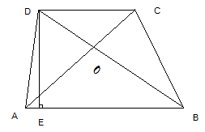

4、等腰梯形的判定

（1）定义：两腰相等的梯形是等腰梯形

（2）定理：在同一底上的两个角相等的梯形是等腰梯形

（3）对角线相等的梯形是等腰梯形。

5、梯形的面积

（1）如图，$$S_{\text{ABCD}} = \frac{1}{2}(CD + AB) \text{DE}$$

（2）梯形中有关图形的面积：

①$$S_{\Delta\text{ABD}} = S_{\Delta\text{BAC}}$$；

②$$S_{\Delta\text{AOD}} = S_{\Delta\text{BOC}}$$；

③$$S_{\Delta\text{ADC}} = S_{\Delta\text{BCD}}$$

6、梯形中位线定理

梯形中位线平行于两底，并且等于两底和的一半。

## 第十一章 解直角三角形

### 一、直角三角形的性质

1、直角三角形的两个锐角互余

可表示如下：∠C=90°$$\Rightarrow$$∠A+∠B=90°

2、在直角三角形中，30°角所对的直角边等于斜边的一半。

∠A=30°

可表示如下： $$\Rightarrow$$BC=$$\frac{1}{2}$$AB

∠C=90°

3、直角三角形斜边上的中线等于斜边的一半

∠ACB=90°

可表示如下： $$\Rightarrow$$CD=$$\frac{1}{2}$$AB=BD=AD

D为AB的中点

4、勾股定理

直角三角形两直角边a，b的平方和等于斜边c的平方，即$$a^{2} + b^{2} = c^{2}$$

5、摄影定理

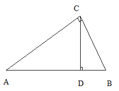

在直角三角形中，斜边上的高线是两直角边在斜边上的摄影的比例中项，每条直角边是它们在斜边上的摄影和斜边的比例中项

∠ACB=90° $$CD^{2} = AD \text{BD}$$

$$\Rightarrow$$ $$AC^{2} = AD \text{AB}$$

CD⊥AB $$BC^{2} = BD \text{AB}$$

6、常用关系式

由三角形面积公式可得：

AB$$$$CD=AC$$$$BC

### 二、直角三角形的判定

1、有一个角是直角的三角形是直角三角形。

2、如果三角形一边上的中线等于这边的一半，那么这个三角形是直角三角形。

3、勾股定理的逆定理

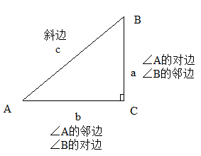

如果三角形的三边长a，b，c有关系$$a^{2} + b^{2} =
c^{2}$$，那么这个三角形是直角三角形。

### 三、锐角三角函数的概念

1、如图，在△ABC中，∠C=90°

①锐角A的对边与斜边的比叫做∠A的正弦，记为sinA，即$$\sin A = \frac{\angle A}{} =
\frac{a}{c}$$

②锐角A的邻边与斜边的比叫做∠A的余弦，记为cosA，即$$\cos A = \frac{\angle A}{} =
\frac{b}{c}$$

③锐角A的对边与邻边的比叫做∠A的正切，记为tanA，即$$\tan A = \frac{\angle
A}{\angle A} = \frac{a}{b}$$

④锐角A的邻边与对边的比叫做∠A的余切，记为cotA，即$$\mathrm{\cot}A = \frac{\angle
A}{\angle A} = \frac{b}{a}$$

2、锐角三角函数的概念

锐角A的正弦、余弦、正切、余切都叫做∠A的锐角三角函数

3、一些特殊角的三角函数值

| 三角函数 | 0°     | 30°                  | 45°                  | 60°                  | 90°    |
|----------|--------|----------------------|----------------------|----------------------|--------|
| sinα     | 0      | \\frac{1}{2}         | \\frac{\\sqrt{2}}{2} | \\frac{\\sqrt{3}}{2} | 1      |
| cosα     | 1      | \\frac{\\sqrt{3}}{2} | \\frac{\\sqrt{2}}{2} | \\frac{1}{2}         | 0      |
| tanα     | 0      | \\frac{\\sqrt{3}}{3} | 1                    | \\sqrt{3}            | 不存在 |
| cotα     | 不存在 | \\sqrt{3}            | 1                    | \\frac{\\sqrt{3}}{3} | 0      |

4、各锐角三角函数之间的关系

（1）互余关系

sinA=cos(90°—A)，cosA=sin(90°—A)

tanA=cot(90°—A)，cotA=tan(90°—A)

（2）平方关系

$$
\operatorname{}A + \operatorname{}A = 1
$$

（3）倒数关系

tanA$$$$tan(90°—A)=1

（4）弦切关系

tanA=$$\frac{\sin A}{\cos A}$$

5、锐角三角函数的增减性

当角度在0°\~90°之间变化时，

（1）正弦值随着角度的增大（或减小）而增大（或减小）

（2）余弦值随着角度的增大（或减小）而减小（或增大）

（3）正切值随着角度的增大（或减小）而增大（或减小）

（4）余切值随着角度的增大（或减小）而减小（或增大）

### 四、解直角三角形 

1、解直角三角形的概念

在直角三角形中，除直角外，一共有五个元素，即三条边和两个锐角，由直角三角形中除直角外的已知元素求出所有未知元素的过程叫做解直角三角形。

2、解直角三角形的理论依据

在Rt△ABC中，∠C=90°，∠A，∠B，∠C所对的边分别为a，b，c

（1）三边之间的关系：$$a^{2} + b^{2} = c^{2}$$（勾股定理）

（2）锐角之间的关系：∠A+∠B=90°

（3）边角之间的关系：

$$
\sin A = \frac{a}{c},\cos A = \frac{b}{c},\tan A = \frac{a}{b},\cot A = \frac{b}{a};\sin B = \frac{b}{c},\cos B = \frac{a}{c},\tan B = \frac{b}{a},\cot B = \frac{a}{b}
$$

## 第十二章 圆

### 一、圆的相关概念

1、圆的定义

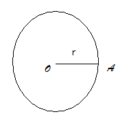

在一个个平面内，线段OA绕它固定的一个端点O旋转一周，另一个端点A随之旋转所形成的图形叫做圆，固定的端点O叫做圆心，线段OA叫做半径。

2、圆的几何表示

以点O为圆心的圆记作“⊙O”，读作“圆O”

### 二、弦、弧等与圆有关的定义 

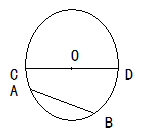

（1）弦

连接圆上任意两点的线段叫做弦。（如图中的AB）

（2）直径

经过圆心的弦叫做直径。（如途中的CD）

直径等于半径的2倍。

（3）半圆

圆的任意一条直径的两个端点分圆成两条弧，每一条弧都叫做半圆。

（4）弧、优弧、劣弧

圆上任意两点间的部分叫做圆弧，简称弧。

弧用符号“⌒”表示，以A，B为端点的弧记作“

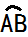

”，读作“圆弧AB”或“弧AB”。

大于半圆的弧叫做优弧（多用三个字母表示）；小于半圆的弧叫做劣弧（多用两个字母表示）

### 三、垂径定理及其推论 

垂径定理：垂直于弦的直径平分这条弦，并且平分弦所对的弧。

推论1：（1）平分弦（不是直径）的直径垂直于弦，并且平分弦所对的两条弧。

（2）弦的垂直平分线经过圆心，并且平分弦所对的两条弧。

（3）平分弦所对的一条弧的直径垂直平分弦，并且平分弦所对的另一条弧。

推论2：圆的两条平行弦所夹的弧相等。

垂径定理及其推论可概括为：

过圆心

垂直于弦

直径 平分弦 知二推三

平分弦所对的优弧

平分弦所对的劣弧

### 四、圆的对称性 

1、圆的轴对称性

圆是轴对称图形，经过圆心的每一条直线都是它的对称轴。

2、圆的中心对称性

圆是以圆心为对称中心的中心对称图形。

### 五、弧、弦、弦心距、圆心角之间的关系定理 

1、圆心角

顶点在圆心的角叫做圆心角。

2、弦心距

从圆心到弦的距离叫做弦心距。

3、弧、弦、弦心距、圆心角之间的关系定理

在同圆或等圆中，相等的圆心角所对的弧相等，所对的弦想等，所对的弦的弦心距相等。

推论：在同圆或等圆中，如果两个圆的圆心角、两条弧、两条弦或两条弦的弦心距中有一组量相等，那么它们所对应的其余各组量都分别相等。

### 六、圆周角定理及其推论

1、圆周角

顶点在圆上，并且两边都和圆相交的角叫做圆周角。

2、圆周角定理

一条弧所对的圆周角等于它所对的圆心角的一半。

推论1：同弧或等弧所对的圆周角相等；同圆或等圆中，相等的圆周角所对的弧也相等。

推论2：半圆（或直径）所对的圆周角是直角；90°的圆周角所对的弦是直径。

推论3：如果三角形一边上的中线等于这边的一半，那么这个三角形是直角三角形。

### 七、点和圆的位置关系 

设⊙O的半径是r，点P到圆心O的距离为d，则有：

d\<r$$\Leftrightarrow$$点P在⊙O内；

d=r$$\Leftrightarrow$$点P在⊙O上；

d\>r$$\Leftrightarrow$$点P在⊙O外。

### 八、过三点的圆 

1、过三点的圆

不在同一直线上的三个点确定一个圆。

2、三角形的外接圆

经过三角形的三个顶点的圆叫做三角形的外接圆。

3、三角形的外心

三角形的外接圆的圆心是三角形三条边的垂直平分线的交点，它叫做这个三角形的外心。

4、圆内接四边形性质（四点共圆的判定条件）

圆内接四边形对角互补。

### 九、反证法 

先假设命题中的结论不成立，然后由此经过推理，引出矛盾，判定所做的假设不正确，从而得到原命题成立，这种证明方法叫做反证法。

### 十、直线与圆的位置关系 

直线和圆有三种位置关系，具体如下：

（1）相交：直线和圆有两个公共点时，叫做直线和圆相交，这时直线叫做圆的割线，公共点叫做交点；

（2）相切：直线和圆有唯一公共点时，叫做直线和圆相切，这时直线叫做圆的切线，

（3）相离：直线和圆没有公共点时，叫做直线和圆相离。

如果⊙O的半径为r，圆心O到直线l的距离为d,那么：

直线l与⊙O相交$$\Leftrightarrow$$d\<r；

直线l与⊙O相切$$\Leftrightarrow$$d=r；

直线l与⊙O相离$$\Leftrightarrow$$d\>r；

### 十一、切线的判定和性质

1、切线的判定定理

经过半径的外端并且垂直于这条半径的直线是圆的切线。

2、切线的性质定理

圆的切线垂直于经过切点的半径。

### 十二、切线长定理 

1、切线长

在经过圆外一点的圆的切线上，这点和切点之间的线段的长叫做这点到圆的切线长。

2、切线长定理

从圆外一点引圆的两条切线，它们的切线长相等，圆心和这一点的连线平分两条切线的夹角。

### 十三、三角形的内切圆

1、三角形的内切圆

与三角形的各边都相切的圆叫做三角形的内切圆。

2、三角形的内心

三角形的内切圆的圆心是三角形的三条内角平分线的交点，它叫做三角形的内心。

### 十四、圆和圆的位置关系 

1、圆和圆的位置关系

如果两个圆没有公共点，那么就说这两个圆相离，相离分为外离和内含两种。

如果两个圆只有一个公共点，那么就说这两个圆相切，相切分为外切和内切两种。

如果两个圆有两个公共点，那么就说这两个圆相交。

2、圆心距

两圆圆心的距离叫做两圆的圆心距。

3、圆和圆位置关系的性质与判定

设两圆的半径分别为R和r，圆心距为d，那么

两圆外离$$\Leftrightarrow$$d\>R+r

两圆外切$$\Leftrightarrow$$d=R+r

两圆相交$$\Leftrightarrow$$R-r\<d\<R+r（R≥r）

两圆内切$$\Leftrightarrow$$d=R-r（R\>r）

两圆内含$$\Leftrightarrow$$d\<R-r（R\>r）

4、两圆相切、相交的重要性质

如果两圆相切，那么切点一定在连心线上，它们是轴对称图形，对称轴是两圆的连心线；相交的两个圆的连心线垂直平分两圆的公共弦。

### 十五、正多边形和圆 

1、正多边形的定义

各边相等，各角也相等的多边形叫做正多边形。

2、正多边形和圆的关系

只要把一个圆分成相等的一些弧，就可以做出这个圆的内接正多边形，这个圆就是这个正多边形的外接圆。

### 十六、与正多边形有关的概念

1、正多边形的中心

正多边形的外接圆的圆心叫做这个正多边形的中心。

2、正多边形的半径

正多边形的外接圆的半径叫做这个正多边形的半径。

3、正多边形的边心距

正多边形的中心到正多边形一边的距离叫做这个正多边形的边心距。

4、中心角

正多边形的每一边所对的外接圆的圆心角叫做这个正多边形的中心角。

### 十七、正多边形的对称性

1、正多边形的轴对称性

正多边形都是轴对称图形。一个正n边形共有n条对称轴，每条对称轴都通过正n边形的中心。

2、正多边形的中心对称性

边数为偶数的正多边形是中心对称图形，它的对称中心是正多边形的中心。

3、正多边形的画法

先用量角器或尺规等分圆，再做正多边形。

### 十八、弧长和扇形面积 

1、弧长公式

n°的圆心角所对的弧长l的计算公式为$$l = \frac{\text{nπr}}{180}$$

2、扇形面积公式

$$
S_{} = \frac{n}{360}\pi R^{2} = \frac{1}{2}\text{lR}
$$

其中n是扇形的圆心角度数，R是扇形的半径，l是扇形的弧长。

3、圆锥的侧面积

$$
S = \frac{1}{2}l 2\pi r = \pi rl
$$

其中l是圆锥的母线长，r是圆锥的地面半径。

**补充**：（此处为大纲要求外的知识，但对开发学生智力，改善学生数学思维模式有很大帮助）

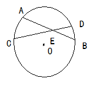

1、相交弦定理

⊙O中，弦AB与弦CD相交与点E，则AE$$$$BE=CE$$$$DE

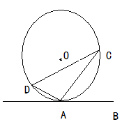

2、弦切角定理

弦切角：圆的切线与经过切点的弦所夹的角，叫做弦切角。

弦切角定理：弦切角等于弦与切线夹的弧所对的圆周角。

即：∠BAC=∠ADC

3、切割线定理

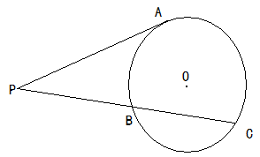

PA为⊙O切线，PBC为⊙O割线，

则$$PA^{2} = PB \text{PC}$$

## 第十三章 图形的变换

### 一、平移

1、定义

把一个图形整体沿某一方向移动，会得到一个新的图形，新图形与原图形的形状和大小完全相同，图形的这种移动叫做平移变换，简称平移。

2、性质

（1）平移不改变图形的大小和形状，但图形上的每个点都沿同一方向进行了移动

（2）连接各组对应点的线段平行（或在同一直线上）且相等。

**考点二、轴对称**    **（3~5****分）**

​    1、定义

把一个图形沿着某条直线折叠，如果它能够与另一个图形重合，那么就说这两个图形关于这条直线成轴对称，该直线叫做对称轴。

2、性质

（1）关于某条直线对称的两个图形是全等形。

（2）如果两个图形关于某直线对称，那么对称轴是对应点连线的垂直平分线。

（3）两个图形关于某直线对称，如果它们的对应线段或延长线相交，那么交点在对称轴上。

3、判定

如果两个图形的对应点连线被同一条直线垂直平分，那么这两个图形关于这条直线对称。

4、轴对称图形

把一个图形沿着某条直线折叠，如果直线两旁的部分能够互相重合，那么这个图形叫做轴对称图形，这条直线就是它的对称轴。

**考点三、旋转**    **（3~8****分）**

​    1、定义

把一个图形绕某一点O转动一个角度的图形变换叫做旋转，其中O叫做旋转中心，转动的角叫做旋转角。

2、性质

（1）对应点到旋转中心的距离相等。

（2）对应点与旋转中心所连线段的夹角等于旋转角。

**考点四、中心对称**    **（3****分）**

​    1、定义

把一个图形绕着某一个点旋转180°，如果旋转后的图形能够和原来的图形互相重合，那么这个图形叫做中心对称图形，这个点就是它的对称中心。

2、性质

（1）关于中心对称的两个图形是全等形。

（2）关于中心对称的两个图形，对称点连线都经过对称中心，并且被对称中心平分。

（3）关于中心对称的两个图形，对应线段平行（或在同一直线上）且相等。

3、判定

如果两个图形的对应点连线都经过某一点，并且被这一点平分，那么这两个图形关于这一点对称。

4、中心对称图形

把一个图形绕某一个点旋转180°，如果旋转后的图形能够和原来的图形互相重合，那么这个图形叫做中心对称图形，这个店就是它的对称中心。

考点五、坐标系中对称点的特征    （3分）

​    1、关于原点对称的点的特征

两个点关于原点对称时，它们的坐标的符号相反，即点P（x，y）关于原点的对称点为P’（-x，-y）

2、关于x轴对称的点的特征

两个点关于x轴对称时，它们的坐标中，x相等，y的符号相反，即点P（x，y）关于x轴的对称点为P’（x，-y）

3、关于y轴对称的点的特征

两个点关于y轴对称时，它们的坐标中，y相等，x的符号相反，即点P（x，y）关于y轴的对称点为P’（-x，y）

**初中数学总复习知识点**

1.数的分类及概念：整数和分数统称有理数（有限小数和无限循环小数），像√3，π，0.101001∙∙∙叫无理数；有理数和无理数统称实数。实数按正负也可分为：正整数、正分数、0、负整数、负分数，正无理数、负无理数。

2.自然数（0和正整数）；奇数2n-1、偶数2n、质数、合数。科学记数法：（1≤a＜10,n是整数）,有效数字。

3．（1）倒数积为1；（2）相反数和为0,商为-1；（3）绝对值是距离，非负数。

4．数轴：①定义（“三要素”）；②点与实数的一一对应关系。     (2)性质：若干个非负数的和为0，则每个非负数均为0。

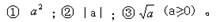5非负数：正实数与零的统称。（表为：x≥0）(1)常见的非负数有:

6．去绝对值法则：正数的绝对值是它本身，“+（    ）”；零的绝对值是零,“0”； 负数的绝对值是它的相反数，“-（    ）”。

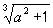7．实数的运算：加、减、乘、除、乘方、开方；运算法则，定律，顺序要熟悉。

8.代数式，单项式，多项式。整式，分式。有理式，无理式。根式。

\9. 同类项。合并同类项（系数相加，字母及字母的指数不变）。

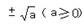10. 算术平方根：      （正数a的正的平方根）；   平方根：

\11. （1）最简二次根式：①被开方数的因数是整数，因式是整式;②被开方数中不含有开得尽方的因数或因式；

（2）同类二次根式：化为最简二次根式以后，被开方数相同的二次根式；（3）分母有理化：化去分母中的根号。

12.因式分解方法：把一个多项式化成几个整式的积的形式A.提公因式法;B.公式法;C.十字相乘法;D.分组分解法。

13.指数：n个a连乘的式子记为    。（其中a称底数，n称指数，   称作幂。）

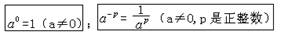正数的任何次幂为正数；负数的奇次幂为负数，负数的偶次幂为正数。

\14. 幂的运算性质：①am an=am+n;  ②am÷an=am-n;  ③(am)n=amn;④( ab )n =anbn ; ⑤

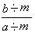

15.分式的基本性质    =     =      （m≠0）；符号法则：

 

16.乘法公式：（a+b）（a-b）=a2-b2; (a+ b)2= a2+2ab+b2;   a2-b2=（a+b）（a-b）; a2+2ab+b2 = (a+ b)2

17．算术根的性质：①     ＝   ;②                   ; ③               (a≥0,b≥0); ④             (a≥0,b＞0)

 

18.统计初步：通常用样本的特征去估计总体所具有的特征。（1）.总体，个体，样本，样本容量（样本中个体的数目）。

（2）众数：一组数据中，出现次数最多的数据。   平均数：平均数是刻划数据的集中趋势（集中位置）的特征数。

中位数：将一组数据按大小依次排列，处在最中间位置的一个数（或最中间位置的两个数据的平均数）

①                         ;     ②

 

③若          ，           ，… ，        ,            ; 则

（3）极差：样本中最大值与最小值的差。它是刻划样本中数据波动范围的大小。

方差：方差是刻划数据的波动大小的程度。                                      

标准差：

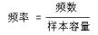（4）调查：普查：具有破坏性、特大工作量的往往不适合普查；抽样调查：抽样时要主要样本的代表性和广泛性。

（5）频数、频率、频数分布表及频数分布直方图：

19.概率:用来预测事件发生的可能性大小的数学量

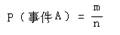（1）P（必然事件）=1；P（不可能事件）=0；0〈P（不确定事件A）〈1。

（2）树形图或列表分析求等可能性事件的概率:                       ；

（3）游戏公平性是指双方获胜的概率的大小是否相等(“牌，球”游戏中放回与不放回的概率是不同的)。

\20. （1）两点之间，线段最短(两点之间线段的长度，叫做这两点之间的距离)；

（2）点到直线之间，垂线段最短（点到直线的垂线段的长度叫做点到直线之间的距离）；

（3）两平行线之间的垂线段处处相等（这条垂线段的长度叫做两平行线之间的距离）；

(4)同平行于一条直线的两条直线平行（传递性）；(5)同垂直于一条直线的两条直线平行。

21.性质：在垂直平分线上的点到该线段两端点的距离相等；判定：到线段两端点距离相等的点在这线段的垂直平分线上。

22.性质定理：角平分线上的点到该角两边的距离相等；判定定理：到角的两边距离相等的点在该角的角平分线上。

23.同角或等角的余角（或补角）相等。

24.性质：两直线平行，同位角(内错角)相等，同旁内角互补；判定：同位角(内错角)相等（同旁内角互补），两直线平行。

25.三角形分锐角三角形、直角三角形、钝角三角形或等腰三角形、不等边三角形。

①三角形三个内角的和等于180度；任意一个外角等于和它不相邻的两个内角的和；②第三边大于两边之和，小于两边之差；

③重心：三条中线的交点；   垂心：三条高线的交点；外心：三边中垂线的交点； 内心：三角平分线线的交点。

④直角三角形斜边上的中线等于斜边的一半；  一边上的中线等于该边一半的三角形是直角三角形。

⑤勾股定理：直角三角形两直角边的平方和等于斜边的平方；逆定理也成立。

⑥300角所对的边等于斜边的一半；Rt△中，等于斜边的一半的边所对的角是300。

26.全等三角形：①全等三角形的对应边，角相等。②条件：SSS、AAS、ASA、SAS、HL。

27.等腰三角形：在一个三角形中 ①等边对等角；②等角对等边；③三线合一；    ④有一个600角的三角形是等边三角形。

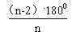28.三角形的中位线平行于第三边并且等于第三边的一半；梯形的中位线平行于两底并且等于两底和的一半

29.n边形的内角和为（n-2）.1800，外角和为3600，正n边形的每个内角等于             。

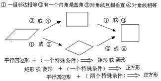30.平行四边形的性质：①两组对边分别平行且相等；

②两组对角分别相等；③两条对角线互相平分。

判定：①两组对边分别平行；②两组对边分别相等；

③一组对边平行且相等；④两组对角分别相等；

⑤两条对角线互相平分。

31特殊的平行四边形：矩形、菱形与正方形。

\32. 梯形：一组对边平行而另一组对边不平行的四边形。

梯形可分①直角梯形②等腰梯形。

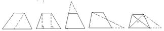等腰梯形同一底上的两个内角相等；   

等腰梯形的对角线相等。

33.梯形常用辅助线：

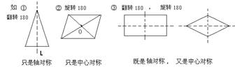34.平面图形的密铺（镶嵌）：同一顶点的角之和为3600。

35.轴对称：翻转1800能重合；  

   中心对称（图形）：旋转180度能重合。

36.命题（题设和结论）、定义、公理、定理； 

原命题，逆命题； 真命题，假命题；反证法。

\37. ①轴对称变换：对应点所连的线段被对称轴垂直平分；对应线段,对应角相等。

②图形的平移：对应线段,对应点所连线段平行（或在同一直线上）且相等；对应角相等；平移方向和距离是它的两要素。

③图形的旋转：每一个点都绕旋转中心沿相同方向转动了相同的角度，任意一对对应点与旋转中心的连线所成的角都是旋转角，对应点到旋转中心的距离相等。旋转的方向、角度、旋转中心是它的三要素。

④位似图形：它们具有相似图形的性质外还有图形的位置关系（每组对应点所在的直线都经过同一个点—位似中心）；对应点到位似中心的距离比就是位似比，对应线段的比等于位似比，位似比也有顺序；已知图形的位似图形有两个，在位似中心的两侧各有一个。位似中心，位似比是它的两要素。

38.相似图形：形状相同，大小不一定相同（放大或缩小）。

（1）判定①平行；②两角相等；③两边对应成比例，夹角相等；④三边对应成比例。

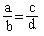（2）对应线段比等于相似比；对应高之比等于相似比；对应周长比等于相似比；面积比等于相似比的平方。

（3）比例的基本性质：若        , 则ad=bc；（d称为第四比例项）

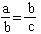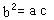

比例中项：若          ， 则         。（b称为a、c的比例中项；c称为第三比例项）

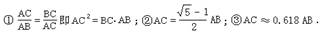(4)黄金分割：线段AB被点C黄金分割（AC<BC），点C叫做

线段AB的黄金分割点，AC与AB的比叫做黄金比：

（5）相似基本图形：平行，不平行；变换对应关系作出正确的分类。

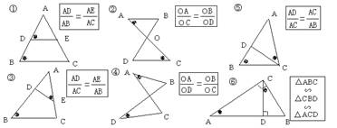39. 三角函数：

在Rt△ABC中，设k法转化为比的问题是常用方法。

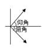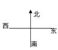(4).俯、仰角：2．方位角：   3．坡度：

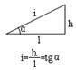

 

 

|      | 30°  | 45°  | 60°  |
| ---- | ---- | ---- | ---- |
| sinα |      |      |      |
| cosα |      |      |      |
| tgα  |      |      |      |

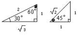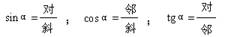（1）．定义：

 

（2）特殊角的三角函数值：

记忆碎片 sin300=     , tan300=       .

（3）三角函数关系：sin(90°-α)=cosα;    tanα=sinα/cosα;     sin2α+cos2α=1

\40. 方程基本概念：方程、方程的解（根）、方程组的解、解方程组

（1）．一元一次方程：最简方程ax=b(a≠0)；解法。  （2）二元一次方程的解有无数多对。

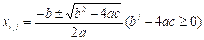（3）二元一次方程组：①代入消元法；②加减消元法。

（4）一元二次方程一般形式：                        的求根公式

常用方法①因式分解法；  ②公式法；  ③开平方法；  ④配方法。

根的判别式：；               

当△>0时，方程有两个不相等的实数根；当△=0时，方程有两个相等的实数根；当△<0，方程没有实数根。

（5）分式方程：                                   ；分式方程有增根，必须要检验。应用题也不例外。

（6）列方程（组）解应用题: 

①审题；②设元（未知数）；③用含未知数的代数式表示相关的量；④寻找相等关系列方程(组)；⑤解方程及检验；⑥答案。

41.（1）不等号：＞、＜、≥、≤、≠。           （2）一元一次不等式：ax＞b、ax＜b、ax≥b、ax≤b、ax≠b(a≠0)。

（3）不等式的性质：⑴a>b←→a+c>b+c ⑵a>b←→ac>bc(c>0) ⑶a>b←→ac<bc(c<0) 

（4）一元一次不等式组：                    ⑷（传递性）a>b,b>c→a>c  ⑸a>b,c>d→a+c>b+d.（用文字怎么叙述？）

（5）一元一次不等式的解、解一元一次不等式。（乘除负数要变方向，但要注意乘除正数不要要变方向）

（6）一元一次不等式组的解、解一元一次不等式组（在数轴上表示解集）

42.平面直角坐标系：在平面内，两条互相垂直且有公共原点的数轴组成平面直角坐标系；

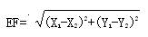（1）坐标平面内的点与一个有序实数对之间是一一对应的。

（2）两点间的距离：    AB=︳Xa-Xb ︳；    CD=︳Yc-Yd ︳；                       。

（3）X轴上Y=0；Y轴上X=0；一、三象限角平分线，Y=X；二、四象限角平分线，Y=-X。

（4）P(a,  b)关于X轴对称P’(a,  -b)；  关于Y轴对称P’’(a,   -b)；   关于原点对称P’’’(-a,  -b).

43.函数定义：                                                                                        

44.表示法：⑴解析法;⑵列表法;⑶图象法。      描点法：⑴列表;⑵描点;⑶连线。

45.自变量取值范围：①分母≠0；②被开方数≥0；③几何图形成立；④实际有意义

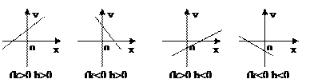46.正比例函数⑴y=kx(k≠0)

  ⑵图象：直线（过原点）

⑶性质：①k>0，…②k<0，…

47.一次函数⑴定义：y=kx+b(k≠0)

⑵图象：直线过点（0,b）（-b/k,0）

⑶性质：①k>0,…②k<0,…

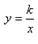

48.反比例函数⑴定义：        (k≠0)。⑵图象：双曲线（两个分支支）

⑶性质：①k>0时，图象位于…，y随x…;②k<0时，图象位于…，y随x…; ③两支曲线无限接近永远不能到达坐标轴。

49.二次函数解析式：   特殊型：

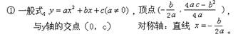（1）

 

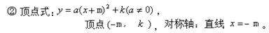                                      

与x轴的交点y=0，开平方法，

 

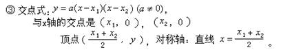

 

 

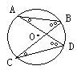

（2）图象：抛物线（“五点一线”要记住）

（3）性质：a>0时，在对称轴左侧…，右侧…；当x=     ,y有   值，是     ;

a<0时，在对称轴左侧…，右侧…；当x=     ,y有   值，是     。

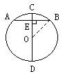(4)平移原则：把解析式化为顶点式，“左+右-；上+下-”。

（5）①a～开口方向，大小；②b～对称轴与a左同右异；③c～与y轴的交点上正下负；

④b2-4ab～与x轴的交点个数；⑤ma+nb～对称轴与常数比；⑥a+b-c～点看(1, a+b-c)。

50.（1）圆有关概念：弦、弦心距、半径、直径、圆心；弧、优弧、劣弧、半圆；

等弧、等圆、同圆、同心圆；圆心角、圆周角；点与圆，直线与圆、圆与圆的位置关系。

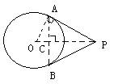（2）不在同一直线上的三点确定一个圆。圆的两条平行弦所夹的弧相等。

（3）垂径定理及其推论：垂直于弦的直径平分这条弦并且平分弦所对的两条弧

①平分弦（不是直径）的直径垂直于弦，并且平分弦所对的两条弧

②弦的垂直平分线经过圆心，并且平分弦所对的两条弧 

③平分弦所对的一条弧的直径，垂直平分弦，并且平分弦所对的另一条弧

（4）在同圆或等圆中，如果两个圆心角、两个圆周角、两条弧、两条弦或两弦的

弦心距中有一组量相等,那么它们所对应的其余各组量都相等（注意一弦对两弧）

（5）一条弧所对的圆周角等于它所对的圆心角的一半；同弧或等弧所对的圆周角相等。

（6）半圆（或直径）所对的圆周角是直角；90°的圆周角所对的弦是直径

（7）切线的判定定理 经过半径的外端并且垂直于这条半径的直线是圆的切线

（8）切线的性质定理 圆的切线垂直于经过切点的半径.         

 推论1 经过圆心且垂直于切线的直线必经过切点;  推论2 经过切点且垂直于切线的直线必经过圆心

（9）圆的内接四边形的对角互补，并且任何一个外角都等于它的内对角

（10）切线长定理 从圆外一点引圆的两条切线，它们的切线长相等圆心和这一点的连线平分两条切线的夹角

（11）相交两圆的连心线垂直平分公共弦；相切两圆的连心线必过切点；

51.(1)视点，视线，视角，盲区；投射线，投影，投影面．(投影类的题目常与全等、相似、三角函数结合进行相关的计算。)

(2) 中心投影：远光线（太阳光线）；平行投影：近光线（路灯光线）。

（3）三视图：主视图，俯视图，左视图。           看不见的轮廓线要画成虚线，线段要保持原长或标明比例尺。

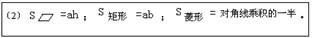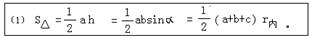52.

 

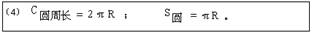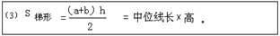

 

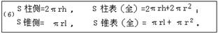

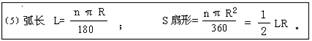

 

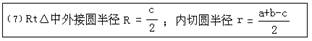

 

 

53.面积问题：①同底（或同高），面积比等于高（或底）之比；②相似图形的面积比等于相似比的平方。

54.尺规作图：线段要截，角用弧作，角平分线、垂直平分线须熟记，外接圆、内切圆也不忘。

 

**中考数学常用公式及性质**

## 1．  乘法与因式分解

①(*a*＋*b*)(*a*－*b*)＝*a*2－*b*2；②(*a*±*b*)2＝*a*2±2*ab*＋*b*2；③­(*a*＋*b*)(*a*2－*ab*＋*b*2)＝*a*3＋*b*3；

④(*a*－*b*)(*a*2＋*ab*＋*b*2)＝*a*3－*b*3；*a*2＋*b*2＝(*a*＋*b*)2－2*ab*；(*a*－*b*)2＝(*a*＋*b*)2－4*ab*。

## 2．  幂的运算性质

①­*am*×*an*＝*am*+*n*；②*am*÷*an*＝*am*-*n*；③(*am*)*n*＝*amn*；④(*ab*)*n*＝*anbn*；⑤(­)*n*＝­；

⑥*a*-*n*＝，特别：(­­)-*n*＝(­­)*n*；­⑦­*a*0＝1(*a*≠0)。

## 3．  二次根式

①­(­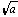­)2＝*a*­(*a*≥0)；②­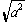­＝丨*a*丨；③­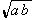­＝­­×­­；④­­＝­­(*a*＞0，*b*≥0)­。

## 4．  三角不等式

|a|-|b|≤|a±b|≤|a|+|b|（定理）；

加强条件：||a|-|b||≤|a±b|≤|a|+|b|也成立，这个不等式也可称为向量的三角不等式（其中a，b分别为向量a和向量b） 

|a+b|≤|a|+|b|；|a-b|≤|a|+|b|；|a|≤b<=>-b≤a≤b ；

|a-b|≥|a|-|b|； -|a|≤a≤|a|； 

## 5．  某些数列前n项之和

1+2+3+4+5+6+7+8+9+…+n=n(n+1)/2；1+3+5+7+9+11+13+15+…+(2n-1)=n2 ；

2+4+6+8+10+12+14+…+(2n)=n(n+1)； 12+22+32+42+52+62+72+82+…+n2=n(n+1)(2n+1)/6； 

13+23+33+43+53+63+…n3=n2(n+1)2/4； 1*2+2*3+3*4+4*5+5*6+6*7+…+n(n+1)=n(n+1)(n+2)/3； 

## 6．  一元二次方程

对于方程：*ax*2＋*bx*＋*c*＝0：

①**求根公式**是*x*＝­­，其中­△＝*b*2－4*ac*叫做根­的判别式。

当△＞0时，方程有两个不相等的实数根；

当△＝0时，方程有两个相等的实数根；

当­△＜0时，方程没有实数根．注意：当△≥0时，方程有实数根。

②若方程有两个实数根*x*1和*x*2，则二次三项式*ax*2＋*bx*＋*c*可分解为*a*(*x*－*x*1)(*x*－*x*2)。

③以*a*和*b*为根的一­元二次方程是­*x*2－(*a*＋*b*)*x*＋*ab*＝0。

## 7．  一次函数

**一次函数***y*＝*kx*＋*b*(*k*≠0)的图象是一条直线(*b*是直线与*y*轴的交点的纵坐标，称为截距)。

①当*k*＞0时，*y*­随*x*的增大而增大(直线从左向右上升)；

②当*k*＜0时，*y*随*x*的增大而减小(直线从左向右下降)；

③特别地：当*b*＝0时，*y*＝*kx*­(*k*≠0)又叫做正比例函数(*y*与*x*成正比例)，图象必过原点。

## 8．  反比例函数

**反比例函数***y*＝­­(*k*≠0)的图象叫做双曲线。

①当*k*＞0时，双曲线在一、三象限(在每一象限内，从左向右降)；

②当*k*＜0时，双曲线在二、四象限(在每一象限内，从左向右上升)。

## 9．      二次函数

**（****1****）****.****定义：**一般地，如果是常数，，那么叫做的二次函数。

**（****2****）****.****抛物线的三要素：**开口方向、对称轴、顶点。

​    ①的符号决定抛物线的开口方向：当时，开口向上；当时，开口向下；

相等，抛物线的开口大小、形状相同。

​    ②平行于轴（或重合）的直线记作.特别地，轴记作直线。

**（****3****）****.****几种特殊的二次函数的图像特征如下：**

| 函数解析式                         | 开口方向                                                     | 对称轴                                                       | 顶点坐标 |
| ---------------------------------- | ------------------------------------------------------------ | ------------------------------------------------------------ | -------- |
|  | 当时   开口向上   当时   开口向下 | （轴） | （0,0）  |
|  | （轴） | (0, )                      |          |
|  |                            | (,0)                       |          |
|  |                            | (,) |          |
|  |                            | ()                         |          |

**（****4****）****.****求抛物线的顶点、对称轴的方法**

   ①公式法：，∴顶点是，对称轴是直线。

   ②配方法：运用配方的方法，将抛物线的解析式化为的形式，得到顶点为(,)，对称轴是直线。

 ③运用抛物线的对称性：由于抛物线是以对称轴为轴的轴对称图形，对称轴与抛物线的交点是顶点。

​      若已知抛物线上两点（及*y*值相同），则对称轴方程可以表示为：

**（5****）.****抛物线****中，****的作用**

   ①决定开口方向及开口大小，这与中的完全一样。

   ②和共同决定抛物线对称轴的位置.由于抛物线的对称轴是直线。

，故：①时，对称轴为轴；②（即、同号）时，对称轴在轴左侧；③（即、异号）时，对称轴在轴右侧。

   ③的大小决定抛物线与轴交点的位置。

​      当时，，∴抛物线与轴有且只有一个交点（0，）：

​      ①，抛物线经过原点; ②,与轴交于正半轴；③,与轴交于负半轴.

​      以上三点中，当结论和条件互换时，仍成立.如抛物线的对称轴在轴右侧，则 。

**（6****）.****用待定系数法求二次函数的解析式**

   ①一般式：.已知图像上三点或三对、的值，通常选择一般式.

   ②顶点式：.已知图像的顶点或对称轴，通常选择顶点式。

   ③交点式：已知图像与轴的交点坐标、，通常选用交点式：。

**（****7****）****.****直线与抛物线的交点**

   ①轴与抛物线得交点为(0, )。

   ②抛物线与轴的交点。

  二次函数的图像与轴的两个交点的横坐标、，是对应一元二次方程

的两个实数根.抛物线与轴的交点情况可以由对应的一元二次方程的根的判别式判定：

​      a有两个交点()抛物线与轴相交；

​      b有一个交点（顶点在轴上）()抛物线与轴相切；

​      c没有交点()抛物线与轴相离。

​    ③平行于轴的直线与抛物线的交点

​     同②一样可能有0个交点、1个交点、2个交点.当有2个交点时，两交点的纵坐标相等，设纵坐标为，则横坐标是的两个实数根。

    ④一次函数的图像与二次函数的图像的交点，由方程组  的解的数目来确定：

a方程组有两组不同的解时与有两个交点；

b方程组只有一组解时与只有一个交点；

c方程组无解时与没有交点。

​    ⑤抛物线与轴两交点之间的距离：若抛物线与轴两交点为，则 

## 10．            统计初步

**（****1****）概念**：①所要考察的对象的全体叫做**总体**，其中每一个考察对象叫做**个体．**从总体中抽取的一部份个体叫做总体的一个**样本**，样本中个体的数目叫做**样本容量．****②**在一组数据中，出现次数最多的数(有时不止一个)，叫做这组数据的**众数**．③将一组数据按大小顺序排列，把处在最中间的一个数(或两个数的平均数)叫做这组数据的**中位数．**

**（****2****）公式：**设有*n*个数­*x*1，*x*2，…，*xn*­，那么：

①平均数为：******；**

②极差：用一组数据的最大值减去最小值所得的差来反映这组数据的变化范围，用这种方法得到的差称为极差，即：极差=最大值-最小值；

③方差：数据、……, 的方差为，

则=

④标准差：方差的算术平方根。

数据、……, 的标准差，

则=

一组数据的方差越大，这组数据的波动越大，越不稳定。

## 11．            频率与概率

**（****1****）频率**

频率=，各小组的频数之和等于总数，各小组的频率之和等于1，频率分布直方图中各个小长方形的面积为各组频率。

**（****2****）概率**

①如果用P表示一个事件A发生的概率，则0≤P（A）≤1；

P（必然事件）=1；P（不可能事件）=0；

②在具体情境中了解概率的意义，运用列举法（包括列表、画树状图）计算简单事件发生的概率。

③大量的重复实验时频率可视为事件发生概率的估计值；

## 12．  锐角三角形

①设∠*A*是△ABC的任一锐角，则∠*A*的正弦：sin*A*＝­，∠*A*的余弦：cos*A*＝­，∠*A*的正切：tan*A*＝­．并且sin2*A*＋cos2*A*＝1。

0＜sin*A*＜1，­0＜cos*A*＜1，­tan*A*＞0．∠*A*越大，∠*A*的正弦和正切值越大，余弦值反而越小。

②**余角公式**：sin(90º－*A*)＝cos*A*，­cos(90º－*A*)＝sin*A*。

③**特殊角的三角函数值：**sin30º＝cos60º＝­­，sin45º＝cos45º＝­­，sin60º＝cos30º＝­­， 

tan30º＝，tan45º＝1，tan60º­＝。

④**斜坡的坡度：**­*i*＝­­＝­­．设坡角为α，则*i*＝tanα＝­­。

## 13．  正（余）弦定理

**（****1****）正弦定理**  a/sinA=b/sinB=c/sinC=2R；注：其中 R 表示三角形的外接圆半径。

​     正弦定理的变形公式：(1) a=2RsinA, b=2RsinB, c=2RsinC；(2) sinA : sinB : sinC = a : b : c

**（****2****）余弦定理**  b2=a2+c2-2accosB；a2=b2+c2-2bccosA；c2=a2+b2-2abcosC； 

注：∠C所对的边为c，∠B所对的边为b，∠A所对的边为a

## 14．  三角函数公式

**（1）**    **两角和公式** 

sin(A+B)=sinAcosB+cosAsinB sin(A-B)=sinAcosB-sinBcosA 

cos(A+B)=cosAcosB-sinAsinB cos(A-B)=cosAcosB+sinAsinB 

tan(A+B)=(tanA+tanB)/(1-tanAtanB) tan(A-B)=(tanA-tanB)/(1+tanAtanB) 

ctg(A+B)=(ctgActgB-1)/(ctgB+ctgA) ctg(A-B)=(ctgActgB+1)/(ctgB-ctgA) 

**（2）**    **倍角公式**

tan2A=2tanA/(1-tan2A) ctg2A=(ctg2A-1)/2ctga 

cos2a=cos2a-sin2a=2cos2a-1=1-2sin2a 

**（3）**    **半角公式** 

sin(A/2)=√((1-cosA)/2) sin(A/2)=-√((1-cosA)/2) 

cos(A/2)=√((1+cosA)/2) cos(A/2)=-√((1+cosA)/2) 

tan(A/2)=√((1-cosA)/((1+cosA)) tan(A/2)=-√((1-cosA)/((1+cosA))

ctg(A/2)=√((1+cosA)/((1-cosA)) ctg(A/2)=-√((1+cosA)/((1-cosA)) 

**（4）**    **和差化积** 

sinA+sinB=2sin((A+B)/2)cos((A-B)/2 cosA+cosB=2cos((A+B)/2)sin((A-B)/2) 

tanA+tanB=sin(A+B)/cosAcosB tanA-tanB=sin(A-B)/cosAcosB 

ctgA+ctgBsin(A+B)/sinAsinB -ctgA+ctgBsin(A+B)/sinAsinB 

**（5）**    **积化和差**

2sinAcosB=sin(A+B)+sin(A-B) 2cosAsinB=sin(A+B)-sin(A-B) 

2cosAcosB=cos(A+B)-sin(A-B) -2sinAsinB=cos(A+B)-cos(A-B) 

## 15．  平面直角坐标系中的有关知识

**（****1****）对称性：**若直角坐标系内一点P（*a**，**b*），则P关于*x*轴对称的点为P1（*a**，－**b*），P关于*y*轴对称的点为P2（*－**a**，**b*），关于原点对称的点为P3（*－**a**，－**b*）。

**（****2****）坐标平移：**若直角坐标系内一点P（*a**，**b*）向左平移*h*个单位，坐标变为P（*a**－**h**，**b*），向右平移*h*个单位，坐标变为P（*a*＋*h**，**b*）；向上平移*h*个单位，坐标变为P（*a**，**b*＋*h*），向下平移*h*个单位，坐标变为P（*a**，**b*－*h*）.如：点A（2，－1）向上平移2个单位，再向右平移5个单位，则坐标变为A（7，1）。

## 16．  多边形内角和公式

**多边形内角和公式：***n*边形的内角和等于(*n*－2)180º（*n*≥3，*n*是正整数），外角和等于360º

## 17．  平行线段成比例定理

**（****1****）平行线分线段成比例定理：**三条平行线截两条直线，所得的对应线段成比例。

如图：*a*∥*b*∥*c*，直线*l*1与*l*2分别与直线*a**、**b**、**c*相交与点*A**、**B**、**C*和*D**、**E**、**F*，

则有。

**（****2****）推论：**平行于三角形一边的直线截其他两边（或两边的延长线），所得的对应线段成比例。如图：△*ABC*中，*DE*∥*BC*，*DE*与*AB**、**AC*相交与点*D**、**E*，则有：

  

|      |                                  |                                  |      |
| ---- | -------------------------------- | -------------------------------- | ---- |
|      |  |                                  |      |
|      |                                  |  |      |

 

 

 

 

 

 

## 18．  直角三角形中的射影定理

**直角三角形中的射影定理：**如图：Rt△*ABC*中，∠*ACB*＝90o，*CD*⊥*AB*于*D*，

则有：（1）（2）（3）

## 19．  圆的有关性质

（1）**垂径定理**：如果一条直线具备以下五个性质中的­任意两个性质：①经过圆心；②垂直弦；③平分弦；④平分弦所对的劣弧；­⑤平分弦所对的优弧，那么这条直线就具有另外三个性质．注：具备①，③时，弦不能是直径。

（2）两条**平行弦**所夹的弧相等。

（3）**圆心角**的度­数等于它所对的弧的度数。

（4）一条弧所对的**圆周角**等于它所对的**圆心角**的一半。

（5）圆周­角等于它所对的**弧的度数**的一半。

（6）**同弧或等****­****弧**所对的圆周角相等。

（7）在同圆或等圆中，相等的圆周角所对的**弧**相等。

（8）90º的圆周角­所对的弦是**直径**，反之，直径所对的圆周角是90º，直径是最长的弦。、

（9）**圆内接四边形**的对角互补。

## 20．  三角形的内心与外心

（1）三角形的内切圆的圆心叫做三角形的**内心**．三角形的内心就是三内角角平分线的交点。

（2）三­角形的外接圆的圆心叫做三角形的**外心**．三角形的外心就是三边中垂线的交点．

常见结论：①Rt△ABC的三条边分别为：*a**、**b**、**c*（*c*为斜边），则它的内切圆的半径­**；

②△ABC的周长为，面积为S，其内切圆的半径为r，则

## 21．  弦切角定理及其推论

**（****1****）弦切角：**顶点在圆上，并且一边和圆相交，另一边和圆相切的角叫做弦切角。如图：∠*PAC*为弦切角。

**（****2****）弦切角定理：**弦切角度数等于它所夹的弧的度数的一半。

如果*AC*是⊙*O*的弦，*PA*是⊙*O*的切线，*A*为切点，则

推论：弦切角等于所夹弧所对的圆周角（作用证明角相等）

如果*AC*是⊙*O*的弦，*PA*是⊙*O*的切线，*A*为切点，则

## 22．  相交弦定理、割线定理和切割线定理

**（****1****）相交弦定理：**圆内的两条弦相交，被交点分成的两条线段长的积相等。 

如图①，即：*PA·PB = PC·PD*

**（****2****）割线定理：**从圆外一点引圆的两条割线，这点到每条割线与圆交点的两条线段长的积相等。如图②，即：*PA·PB = PC·PD*

**（****3****）切割线定理：**从圆外一点引圆的切线和割线，切线长是这点到割线与圆交点的两条线段长的比例中项。如图③，即：*PC2 = PA·PB*

  

|      |                                    |                                    |      |      |      |
| ---- | ---------------------------------- | ---------------------------------- | ---- | ---- | ---- |
|      |                                    |  |      |      |      |
|      |  |                                    |      |      |      |
|      |                                    |  |      |      |      |
|      |                                    |                                    |      |      |      |
|      |                                    |                                    |      |      |      |

 

 

 

 

 

​                          ①                                          ②                     ③

## 23．  面积公式

 

①*S***正****△**＝­­×(边长)2．  

­  ②*S***平行四边形**＝底×高．

③*S***菱形**＝底×高＝­­×(对角线的积)，

④­

⑤*S***圆**＝π*R*2．   

⑥*l***圆周长**＝2π*R*．

⑦弧长*L*＝­­．

­  ⑧ 

⑨*S***圆柱侧**＝底面周长×高＝2π*rh*，

*S***全面积**＝*S*侧＋*S*底＝2π*rh*＋2π*r*2

⑩*S***圆锥侧**＝­­×底面周长×母线＝π*rb*， 

*S***全面积**＝*S*侧＋*S*底＝π*rb*＋π*r*2

第十四章     图形的相似

**考点一、比例线段**    **（3****分）**

​    1、比例线段的相关概念

如果选用同一长度单位量得两条线段a，b的长度分别为m，n，那么就说这两条线段的比是，或写成a：b=m：n

在两条线段的比a：b中，a叫做比的前项，b叫做比的后项。

在四条线段中，如果其中两条线段的比等于另外两条线段的比，那么这四条线段叫做成比例线段，简称比例线段

若四条a，b，c，d满足或a：b=c：d，那么a，b，c，d叫做组成比例的项，线段a，d叫做比例外项，线段b，c叫做比例内项，线段的d叫做a，b，c的第四比例项。

如果作为比例内项的是两条相同的线段，即或a：b=b：c，那么线段b叫做线段a，c的比例中项。

2、比例的性质

（1）基本性质

①a：b=c：dad=bc

②a：b=b：c

（2）更比性质（交换比例的内项或外项）

              （交换内项）

    （交换外项）

​             （同时交换内项和外项）

（3）反比性质（交换比的前项、后项）：

（4）合比性质：

（5）等比性质：

3、黄金分割

把线段AB分成两条线段AC，BC（AC>BC），并且使AC是AB和BC的比例中项，叫做把线段AB黄金分割，点C叫做线段AB的黄金分割点，其中AC=AB0.618AB

**考点二、平行线分线段成比例定理**    **（3~5****分）**

三条平行线截两条直线，所得的对应线段成比例。

推论：

（1）平行于三角形一边的直线截其他两边（或两边的延长线），所得的对应线段成比例。

逆定理：如果一条直线截三角形的两边（或两边的延长线）所得的对应线段成比例，那么这条直线平行于三角形的第三边。

（2）平行于三角形一边且和其他两边相交的直线截得的三角形的三边与原三角形的三边对应成比例。

**考点三、相似三角形**    **（3~8****分）**

​    1、相似三角形的概念

对应角相等，对应边成比例的三角形叫做相似三角形。相似用符号“∽”来表示，读作“相似于”。相似三角形对应边的比叫做相似比（或相似系数）。

2、相似三角形的基本定理

平行于三角形一边的直线和其他两边（或两边的延长线）相交，所构成的三角形与原三角形相似。

用数学语言表述如下：

∵DE∥BC，∴△ADE∽△ABC

相似三角形的等价关系：

（1）反身性：对于任一△ABC，都有△ABC∽△ABC；

（2）对称性：若△ABC∽△A’B’C’，则△A’B’C’∽△ABC

（3）传递性：若△ABC∽△A’B’C’，并且△A’B’C’∽△A’’B’’C’’，则△ABC∽△A’’B’’C’’。

3、三角形相似的判定

（1）三角形相似的判定方法

①定义法：对应角相等，对应边成比例的两个三角形相似

②平行法：平行于三角形一边的直线和其他两边（或两边的延长线）相交，所构成的三角形与原三角形相似

③判定定理1：如果一个三角形的两个角与另一个三角形的两个角对应相等，那么这两个三角形相似，可简述为两角对应相等，两三角形相似。

④判定定理2：如果一个三角形的两条边和另一个三角形的两条边对应相等，并且夹角相等，那么这两个三角形相似，可简述为两边对应成比例且夹角相等，两三角形相似。

⑤判定定理3：如果一个三角形的三条边与另一个三角形的三条边对应成比例，那么这两个三角形相似，可简述为三边对应成比例，两三角形相似

（2）直角三角形相似的判定方法

①以上各种判定方法均适用

②定理：如果一个直角三角形的斜边和一条直角边与另一个直角三角形的斜边和一条直角边对应成比例，那么这两个直角三角形相似

③垂直法：直角三角形被斜边上的高分成的两个直角三角形与原三角形相似。

4、相似三角形的性质

（1）相似三角形的对应角相等，对应边成比例

（2）相似三角形对应高的比、对应中线的比与对应角平分线的比都等于相似比

（3）相似三角形周长的比等于相似比

（4）相似三角形面积的比等于相似比的平方。

5、相似多边形

（1）如果两个边数相同的多边形的对应角相等，对应边成比例，那么这两个多边形叫做相似多边形。相似多边形对应边的比叫做相似比（或相似系数）

（2）相似多边形的性质

①相似多边形的对应角相等，对应边成比例

②相似多边形周长的比、对应对角线的比都等于相似比

③相似多边形中的对应三角形相似，相似比等于相似多边形的相似比

④相似多边形面积的比等于相似比的平方

6、位似图形

如果两个图形不仅是相似图形，而且每组对应点所在直线都经过同一个点，那么这样的两个图形叫做位似图形，这个点叫做位似中心，此时的相似比叫做位似比。

性质：每一组对应点和位似中心在同一直线上，它们到位似中心的距离之比都等于位似比。

由一个图形得到它的位似图形的变换叫做位似变换。利用位似变换可以把一个图形放大或缩小。