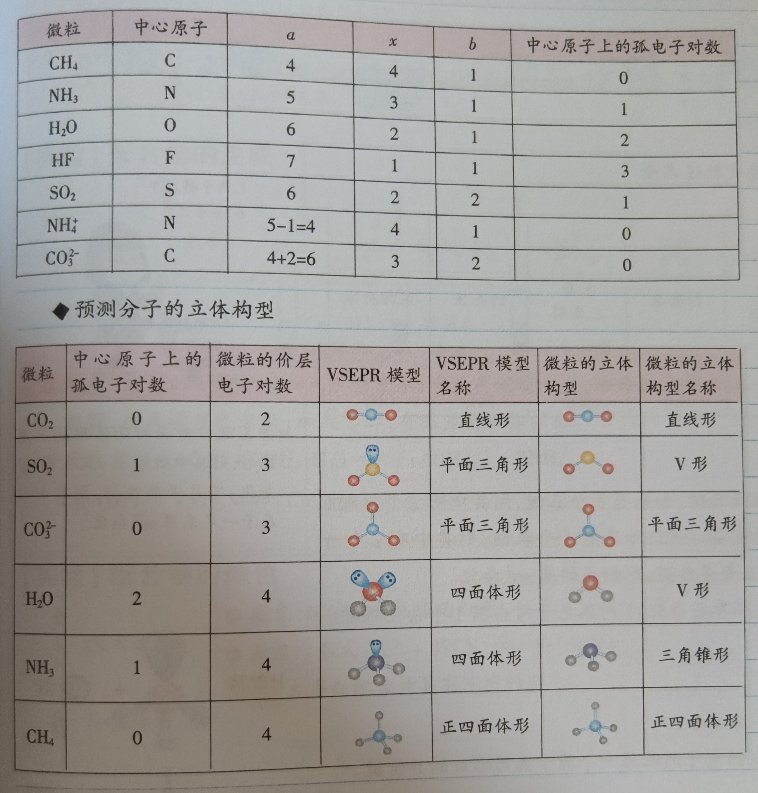

# 高中化学

# 状态和缩写

量纲法：适合选择题带入所给条件单位，快速判断正误

气体 gas g

固体 solid s

液体 liquid l

水溶液 aqua/aqueous aq

游离态：单质

化合态：化合物

换反应物，变价少时，消耗变多

> 元素的最多：
>
> * 哪一列最多：IIIB族，第3列
> * 形成化合物最多的哪一列：IVA族，第14列
>   * C：有机物的核心元素
>   * Si：无机物的核心元素（大部分矿物含有Si）
>
> 金属和非金属的分布：
>
> * 过渡元素全是金属
> * 主族每一族都有非金属（×）第二主族没有
> * 0族完全由非金属构成（×）第8周期会出现金属
> * 元素周期表左侧全是金属（×）H在第一列
>
> 常温常压下对应单质的物态：
>
> * 带气：气态
> * 氵/水：液态：溴，汞
> * 带石：固态非金属
> * 钅：固态金属，包括金
>
> 元素用途举例：
>
> * 过渡金属：合金，催化剂
> * 非金属：农药
> * 金属，非金属交界：Si：半导体，Al：化学反应两性

> 原子表达方式，质量数
>
> $^b_a\overline a_x^y$ 
>
> a：质子数
>
> b：质量数=质子数+中子数
>
> x：原子个数
>
> y：电荷
>
> —：化合价

## 常见元素的化合价

1. 金属元素

   主族金属：唯一正价

   +1：Li Na K

   +2：Mg Ca Ba 

   +3： Al

2. 过渡金属：多种正价

   Fe：+2 +3 +6(高铁酸根$FeO_4^{2-}$)

   Cu：+1 +2 (+1不稳定，少见)

   Mn：0 +2 +4 +6(锰酸根) +7(高锰酸根)

   ​		  Mn $Mn^{2+}$ $MnO_2$ $MnO_4^{2-}$ $MnO_4^{-}$

   ​          黑色 淡粉色 黑色     绿色       紫色

   Zn： +2

   Sn：+2(不稳定，容易到+4) +4

   Pb：+2 +4(不稳定)

   Hg：+1 +2

   Ag： +1

   Pt： +4

   Au： +3

3. 非金属

   B：+3

   C：-4 -3 -2 -1 0 +1 +2 +3 +4

   Si：+4 (硅烷$SiH_4$ 硅酸$H_2SiO_3$ 二氧化硅)

   N：-3 0 +2 +4 +5

   P：-3 0 +3 +5

   S：-2 0 +4 +6 

   F：0 -1 (抢电子最强元素)

   Cl：-1 0 +1 +3 +5 +7 (+4 $ClO_2$极不稳定)

   Br，I和Cl类似

4. 特别强调

   H：0 +1 得电子能力最差的非金属。例外：NaH 金属氢化物，氢-1价；$BH_3$，氢-1价

   O：-1 -2 得电子能力最强的非金属之一，仅次于F。$H_2O_2\ Na_2O_2$

   

## 元素化合物转化小结

### 相互联系，相互转化

活泼性强：从左往右化合到底

* 作反应物（向右）活泼
* 作产物（向左）稳定

活泼性居中：左右各走一步，氧化物稳定

活泼性差：从右往左分解到底

* 作反应物（右）不活泼
* 作产物（左）易分解

### 可以跨越

主要产物相同；单质需要处理电子

### 成盐规律

酸性氧化物+碱性氧化物 化合→盐

酸+碱氧→盐+水

酸氧+碱→盐+水

酸+碱→盐+水

# 从实验学化学

## 化学实验基本方法

| 意外事故                     | 措施                                                         |
| ---------------------------- | ------------------------------------------------------------ |
| 酒精灯碰倒着火               | 用沙子或湿抹布盖灭                                           |
| 浓碱沾到皮肤上               | 先用大量水冲洗，再涂上硼酸                                   |
| 浓硫酸（其他浓酸）沾到皮肤上 | 先用大量水（清水）冲洗，然后涂上3%~5%的$NaHCO_3$溶液         |
| 大量的酸（碱）洒在桌面上     | 加适量的$NaHCO_3(CH_3COOH)$溶液中和，然后用水冲洗，并用抹布擦净 |
| 温度计水银球碰破             | 用硫粉覆盖                                                   |
| 烫伤或烧伤                   | 先用冷水冲洗，再涂烧（烫）伤膏                               |
| 试剂溅到眼睛里               | 直接用大量清水冲洗，边洗边眨眼                               |
| 严重受伤                     | 120                                                          |
| 严重火灾                     | 119                                                          |

药品取用“三不”原则：

1. 不能用手直接接触
2. 不能把鼻孔凑到容器口闻药品气味 
3. 不能品尝任何药品

药品节约原则：按实验规定用量取用；如果没有明确说明，一般去少量，液体1~2mL，固体盖满试管底部。

处理原则：实验中剩余药品不能放回原瓶；不能随意丢弃；不能拿出实验室；要放在指定容器内。

三废处理办法：

* 废气：不能直接排入空气，要净化处理
* 废液：不能直接倒入下水道，要倒入指定容器
* 废渣：不能随意丢弃，要进行分类处理

六防：

| 内容   | 引起事故的操作                                           | 措施                                             |
| ------ | -------------------------------------------------------- | ------------------------------------------------ |
| 防爆炸 | 点燃可燃性气体，如CO, $H_2$等                            | 先检验气体纯度                                   |
|        | 用CO,$H_2$还原$Fe_2O_3$,CuO等                            | 先通CO或$H_2$，通气一段时间后再对装置加热        |
| 防暴沸 | 加热液体                                                 | 在待加热液体中加入碎瓷片或沸石                   |
|        | 浓硫酸稀释                                               | 将浓硫酸沿容器壁慢慢加入水中，同时用玻璃棒搅拌   |
| 防失火 | 可燃性物质遇到明火                                       | 远离火源                                         |
| 防中毒 | 制取有毒气体；误食重金属盐类等                           | 在通风橱中制取有毒气体；立即用大量鲜牛奶或生蛋清 |
| 防污染 | 制取对环境有害的物质                                     | 处理后再排放                                     |
| 防倒吸 | 利用加热法制取并用排水法收集气体或吸收溶解度较大的气体等 | 注意熄灭酒精灯的顺序，必要时要加装防倒吸装置     |

### 过滤

适用范围：分力液体和固体混合物

注意事项：“一贴，二低，三靠”

* 一贴：滤纸紧贴漏斗内壁
* 二低：
  * 滤纸边缘低于漏斗口边缘
  * 液面低于滤纸边缘
* 三靠
  * 烧杯嘴靠在玻璃棒中部
  * 玻璃棒下端轻靠三层滤纸一侧
  * 漏斗的下端管口紧靠烧杯内壁

### 蒸发

适用范围：利用加热方式分力溶液中的溶质和溶剂

注意事项：

* 玻璃棒作用：搅拌。防止局部温度过高，造成液滴飞溅
* 蒸发皿可以直接加热，盛液量不超过容积的2/3
* 蒸发皿中出现较多固体时，停止加热利用余热蒸干

两种结晶方式：

* 蒸发结晶：通过减少溶剂使溶液达到饱和而析出晶体。如从NaCl溶液中获得NaCl晶体。
* 冷却结晶：通过降温使溶质的溶解度降低从而析出晶体。比如出去$KNO_3$晶体中的NaCl晶体。

### 蒸馏

适用范围：分力相互溶解的沸点相差较大的液体混合物

仪器装置：温度计，蒸馏烧瓶，石棉网，冷凝管

注意事项：

* 烧瓶中放入少量碎瓷片，防止液体暴沸
* 温度计水银球应与支管口下缘位于同一水平线上
* 冷却水从下口进，上口出
* 先给冷凝管通水，再加热发生装置；实验结束时先撤酒精灯，再停水
* 溶液不可蒸干

### 萃取

定义：利用溶质在互不相溶的溶剂里的溶解度不同，用一种溶剂把溶质从它与另一种溶剂所组成的溶液中提取出来的方法。

操作步骤：装液——震荡——静置——分离

要求：萃取剂与水互不相容；萃取剂和溶质不发生反应；溶质在萃取剂中的溶解度要远大于其在水中的溶解度

注意事项：

* 将要萃取的溶液和萃取剂依次从上口倒入分液漏斗，量不能超过漏斗容积2/3，塞好塞子进行震荡
* 震荡时用右手捏住漏斗上口的颈部，并用食指压紧塞子，用左手握住旋塞，同时用手指控制活塞，将漏斗倒转过来用力震荡

## 化学计量在实验中的应用

## 物质的量的单位——摩尔

## 物质的量

定义：表示含有一定数目离子的集合体的物理量

符号：n，单位：mol（摩尔）

摩尔是物质的量的单位，简称摩。

数值规定：1mol粒子所含的粒子数与12g $^{12}C$中所含碳原子数相同。

注意：

* 摩尔是微观粒子单位，只能表示微观粒子，比如院子，分子，粒子，质子，种子，电子或他们的特定组合
* 度量微观粒子时，一定要指明微利的种类
* 使用mol时，后边一般加化学式。比如1molS

物质的量：

* 只能描述微观粒子

  纳米：介观。介于宏观和微观

  1埃=$1×10^{-10}m$，是原子下限，微观粒子上限

* 只能用于描述准确的对象

任何溶液都是是电中性，正负电荷总数相等

#### 阿伏伽德罗常数

概念：1mol粒子的粒子数。符号为$N_A$，单位：$mol^{-1}$

精确值：0.012kg中$^{12}C$中所含原子个数

近似值：$N_A≈6.02×10^{23}mol^{-1}$

关系式：物质的量与微粒数N的关系：$n=\frac{N}{N_A}$

### 摩尔质量

概念：单位物质的量的物质具有的质量。符号M，单位：$g·mol^{-1}$

数值：以$g·mol^{-1}$为单位时，数值与该粒子的相对原子质量或相对分子质量相等

关系：物质的量，质量，摩尔质量的关系：n=m/M

### 气体摩尔体积

影响物质体积大小的因素：微粒的大小、多少、微粒间的距离。比如气体，液体，固体。

标况下非气体：水，三氧化硫，乙醇，HF，苯，$CCl_4$

两个影响因素：温度，压强

计算：体积→质量→摩尔质量

> 溶液c(B) 物质的量浓度
>
> $c(B)=\frac{nB}V$：mol/L
>
> *S: g。*溶解度*，符号S，在一定温度下，某固态物质在100g溶剂中达到饱和状态时所*溶解*的溶质的质量，叫做这种物质在这种溶剂中的*溶解度。 

#### 气体摩尔体积

定义：单位物质的量的气体所占的体积。符号$V_m$，单位$L·mol^{-1}$

影响因素：气体温度和压强

特例：标准状况下（0°C/273K，101kPa/1atm/1个标准大气压），1mol任何气体所占体积都约为22.4L，即$V_m≈22.4L·mol^{-1}$

$\frac{V_1}{V_2}=\frac{n_1}{n_2}$

$V=V_m×n$

### 阿伏伽德罗定律和推论

定律：同温同压相同体积的任何气体都含有相同的分子数

适用范围；任何气体

### 阿伏伽德罗常数问题的思考方法

（未整理）

注意物质的组成：稀有气体为单原子分子；$Na_2O_2$中阴阳离子个数比不是1:1，而是1:2

### 物质的量浓度

定义：单位体积溶液中所含溶质B的物质的量。符号$c_B$，单位：$mol·L^{-1}$

公式：$n_B=c_B·V$

说明：对于1$mol·L^{-1}NaCl$溶液，其$c(Na^+)$，$c(Cl^-)$均为$1mol·L^{-1}$；取出任意体积，浓度不变。但取出溶液中所含溶质的物质的量会因体积不同而不同

### 容量瓶

用途：配置一定物质的量浓度的溶液

选择容量瓶原则：

* 相匹配：选择与所配溶液体积相同规格的容量瓶
* 大而近：无所配溶液体积规格的容量瓶，则选择规格略大于溶液体积的容量瓶

配置步骤：

1. 计算：计算所需溶质的质量
2. 称量：用托盘天平称量所需溶质的质量
3. 溶解、冷却：将称量准确的溶质固体放入烧杯，加入适当蒸馏水溶解。可用玻璃棒搅拌加速溶解，同时将溶液冷却至室温
4. 转移：将冷却至室温的溶液全部转移到容量瓶中。转移时应用玻璃棒引流
5. 洗涤：用少量蒸馏水洗涤烧杯内壁和玻璃棒2~3次，洗涤液也要注入容量瓶中。轻轻晃动容量瓶，使溶液混合均匀。
6. 定容：将蒸馏水注入容量瓶，液面离容量瓶颈刻度线下1~2cm时，改用胶头滴管加蒸馏水至凹液面与刻度线相切

7. 摇匀、装瓶：盖好瓶塞，反复上下颠倒，摇匀，装瓶。

配置过程注意问题：

* 如果是浓溶液配置稀溶液，应该用量筒取所需浓溶液的体积。c(浓)·V(浓)=c(稀)·V(稀)
* 称量NaOH固体时应放入小烧杯中称量
* 转移时一定要将溶液冷却至室温，并且用玻璃棒引流
* 当加水定容超过了刻度线，不能用胶头滴管吸出多余的水，要重新配置

### 物质量浓度的计算

基本计算依据：$c=\frac{n}{V}$， $n=\frac{m}{M}=\frac{N}{N_A}=\frac{V}{V_m}$

物质的量浓度与溶质质量分数（ω）的关系：$c=\frac{1000×ρ×ω}{M}$

溶液稀释或浓缩：原则：前后溶质的质量或物质的量不变。关系式：m(浓)ω(浓)=m(稀)ω(稀)或c(浓)·V(浓)=c(稀)·V(稀)

溶液混合的计算：原则：前后溶质的质量或物质的量不变。关系式 ：$m_1ω_1+m_2ω_2=m(混)ω(混)$或$c_1V_1+c_2V_2=c(混)V(混)$

# 气体物理性质的描述

## 理想气体状态方程

pV=nRT

压强×体积=物质的量×常数×温度

R=8.314时，单位必须为$Pa·m^3·mol^{-1}·K^{-1}$

> 知三求一
>
> 两个变量固定，看另外两者关系

## 道尔顿分压定律

> 同温同容：任何气体$\frac{n_1}{n_2}=\frac{p_1}{p_2}$ 物质的量之比=压强之比
>
> 
>
> 道尔顿**分压**定律：$P(B)=P_总·\frac{n(B)}{n_总}$，p(B)与c(B)正相关

## ”分体积“和气体体积分数

混合气体各组分均充满容器，无分体积。

> 混合气体各组分数体积分数=物质的量占比分数

## 气体相对密度

pV=nRT

→$pV=\frac m M RT$

$pM=\frac m V RT$

$pM=ρRT$

> 气体1与气体2比较：
>
> $\frac{p_1M_1}{p_2M_2}=\frac{ρ_1RT_1}{ρ_2RT_2}$
>
> 同温同压：
>
> $\frac{M_1}{M_2}=\frac{ρ_1}{ρ_2}$，气体的分子量/摩尔质量与密度成正比

> 例：某气体对氢气的相对密度是14，推测该气体是什么？
>
> > $\frac{ρ_气}{ρ_{H_2}}=\frac{M_气}{M_{H_2}}=14$
> >
> > $M_气=14×2=28$
> >
> > 可能是$N_2,CO,C_2H_4$，也可能是这些气体的混合气体

## 混合气体平均相对分子量和平均密度

气体1与气体2 ：

$\overline M=\frac{m_总}{n_总}$

$\overline M=M_1·\frac{n_1}{n_1+n_2}+M_2\frac{n_2}{n_1+n_2}$

> 练习：空气中氮气与氧气是4:1，$\overline M=28×\frac 4 5+32×\frac 1 5=28.8$

$\overline ρ=\frac{m_总}{V_总}$

$\overline ρ=ρ_1·\frac{n_1}{n_1+n_2}+ρ_2\frac{n_2}{n_1+n_2}$

同温同压，平均相对分子量与平均密度成正比

# 化学物质及其变化

> 酸指电离时产生的阳离子全部都是氢离子的化合物；碱指电离时产生的阴离子全部都是氢氧根离子的化合物；*盐*指电离时生成金属阳离子（或铵根离子）和酸根离子的化合物。可以简记为：氢头酸、氢氧根结尾碱、金属开头酸根结尾的是*盐*。
>
> 碱性氧化物肯定是金属氧化物。反之不成立

> 与胶体性质无关的是：硫酸铜用于游泳池水消毒（是重金属盐使蛋白质变性）

> 酸类电解质只有在水溶液中电离，而碱和盐类在水溶液，熔融状态下均可电离

## 物质的分类

#### 交叉分类法：

* 以物质所含阳离子不同进行划分

* 以物质所含酸根例子不同进行划分

#### 树状分类法：对同类事物按照某种标准再进行分类

* 纯净物
  * 单质（石墨）
  * 化合物：有机无机化合物、电解质/非电解质
* 混合物

| 强电解质            | 弱电解质                   | 非电解质             |
| ------------------- | -------------------------- | -------------------- |
| 溶于水电离/熔融电离 | 溶于水电离 熔融不电离 | 溶于水或熔融均不电离 |
| 强酸                | 弱酸                       | 非金属氧化物         |
| 强碱                | 弱碱                       | 多数有机物           |
| 盐                  | 水                         |                      |
| 金属氧化物          |                            |                      |

> NaCl晶体：不能导电  是非电解质
>
> 稀盐酸：能导电  不是电解质  **是混合物不是化合物**

### 分散系及其分类

分散系：把一种（或多种）物质分散在另一种（或多种）物质中得到的体系。

分散质：被分散的物质

分散剂：容纳分散质的物质

#### 分散系的分类

* 按分散质或分散剂所处状态

| 分散质 | 分散剂 | 实例                   |
| ------ | ------ | ---------------------- |
| 气     | 气     | 空气                   |
| 液     | 气     | 云、雾                 |
| 固     | 气     | 烟、灰尘               |
| 气     | 液     | 泡沫                   |
| 液     | 液     | 牛奶、酒精的水溶液     |
| 固     | 液     | 糖水、油漆             |
| 气     | 固     | 泡沫、塑料             |
| 液     | 固     | 珍珠（包藏水的碳酸钙） |
| 固     | 固     | 有色玻璃、合金         |

* 按分散质例子大小区分分散系

| 分散系                   | 分散质粒径大小 | 稳定性             | 能否通过滤纸 | 能否通过半透膜 |
| ------------------------ | -------------- | ------------------ | ------------ | -------------- |
| 溶液                     | 0~1nm          | 非常稳定           | √            | √              |
| 胶体（**一定是电中性**） | 1nm~100nm      | 较稳定，干扰易聚沉 | √            | ×              |
| 浊液                     | >100nm         | 不稳定，静置沉淀   | ×            | ×              |

#### 渗析和过滤

滤纸：大孔滤网，过滤

半透膜：小孔滤网，渗析

### 胶体

#### 丁达尔效应

丁达尔效应：一束光通过胶体时，在垂直于光线的方向上看到一条光亮的通路的现象。（比如森林中的丁达尔效应）

原理：胶体粒子对光的散射作用

应用：鉴别胶体和溶液

#### 胶体的介稳性

胶体的介稳性：胶体的稳定性处于溶液和浊液之间，相对稳定

原因：

* 同种胶粒的电性相同，胶粒间的排斥作用使其不容易聚成大颗粒而形成沉淀
* 胶粒小，质量轻，布朗运动剧烈，能客服重力引起的沉降作用

#### 胶体的电泳

含义：在电场的作用下，胶体粒子在分散剂中作定向移动的现象。

实验：通电后，阴极附近红褐色加深

原因：胶粒带电荷。如$Fe(OH)_3$胶粒带正电荷

电泳下一步：→聚沉

> 布朗运动：微粒无规则热运动，这些小的微粒处于液体或气体中时，由于液体分子的热运动，微粒受到来自各个方向液体分子的碰撞，当受到不平衡的冲撞时而运动，由于这种不平衡的冲撞，微粒的运动不断地改变方向而使微粒出现不规则的运动。
>
> 溶液，胶体有布朗运动
>
> 浊液有布朗运动，但是难观察

#### 胶体的性质

* 胶体具有丁达尔效应，溶液，浊液没有。
* 分散系不同，粒子大小不同。胶体能透过滤纸，浊液不能

> 胶体一定是电中性
>
> 胶体分散质→胶体颗粒，一般带电：
>
> * 胶粒是离子
> * 胶粒是电中性分子
>   * 胶粒表面积大，吸附某种电荷离子：利于胶体稳定
>
> 不带电：胶粒是分子，胶体中无离子（如淀粉溶液）
>
> 一般：金属，氧化物，氢氧化物胶粒吸附阳离子；非金属氧化物，金属硫化物胶粒吸附阴离子

胶体的聚沉：打破胶粒的均匀分散

* 剧烈振荡
* 加热
* 电泳
* 不同电荷的胶粒混合
* 加盐，增大阳离子浓度

> 胶体的制备：$Fe(OH)_3$胶体：
>
> 向沸水中滴加$FeCl_3$饱和溶液：
>
> $FeCl_3+3H_2O\xlongequal{△}Fe(OH)_3+3HCl↑$ 浅棕红色澄清透明溶液
>
> 对比：向氢氧化钠溶液中滴加氯化铁溶液
>
> $FeCl_3+3NaOH=Fe(OH)_3↓+3NaCl$ 红褐色沉淀
>
> 拓展：向氢氧化钠溶液中滴加氯化铁溶液
>
> 1. 产生大量红褐色沉淀
> 2. 过滤沉淀后，得到浅黄色澄清溶液，明显丁达尔效应
> 3. 半透膜渗析，得到无色透明溶液，分析发现溶液中有$Fe^{3+},OH^-,Fe(OH)_3$

| 胶体分类：类型 | 分散剂状态 | 实例                   |
| -------------- | ---------- | ---------------------- |
| 固溶胶         | 固态       | 有色玻璃，烟水晶       |
| 液溶胶         | 液态       | 淀粉溶液，氢氧化铁胶体 |
| 气溶胶         | 气态       | 烟，云，雾             |

胶体应用：

* 农业生产——土壤保肥
* 医疗卫生——血液透析，血清纸上电泳，利用电泳分离各种氨基酸和蛋白质
* 日常生活——制豆腐原理和豆浆，牛奶，粥，明矾净水
* 自然地理——江河入海口处形成三角洲
* 工业生产——制有色玻璃（固溶胶），冶金工业利用电泳原理选矿，原油脱水等

## 离子反应

### 电解质

电解质：水溶液或熔融状态下能导电的化合物

非电解质：水溶液或熔融状态下都不能导电的化合物

常见的电解质：酸碱盐、活泼金属氧化物，特殊氧化物$H_2O$

常见的非电解质：大多数有机物、部分气态氢化物、非金属氧化物

带电荷微粒

* 自由电子导电：金属或石墨

* 自由离子导电：电解质，溶于水或熔融

  

#### 注意事项

* 不是电解质的物质不一定是非电解质

  电解质和非电解质前提是化合物。单质和混合物既不是电解质，又不是非电解质

* 电解质是指在熔融状态和溶液中能直接给出离子的物质。**必须自身电离**

  像$SO_2$、$NH_3$等溶于水后能电离出离子的物质是$H_2SO_3$、$NH_3·H_2O$。$H_2SO_3$、$NH_3·H_2O$是电解质，$SO_2$、$NH_3$不是电解质。

* 能导电的物质不一定是电解质

  * 比如Fe，Cu
  * 稀盐酸能导电，但不能说稀盐酸是电解质，应该说HCl是电解质。稀盐酸是混合物

* 不能导电的物质不一定是电解质

  $BaSO_4$、$CaCO_3$等难溶于水的盐，水溶液导电能力很弱，但溶于水的部分完全电离，所以属于电解质。

* 电解质不一定同时具备以下两个条件

  在水溶液里能导电；在熔融状态下能导电。具备其中一个条件即可。如HCl在熔融时不到点，水溶液中能导电

电解质四要素：

* 化合物
* 溶于水或熔融
* 自身电离
* 自由离子导电

#### 强电解质和弱电解质

| 项目                     | 强电解质                                                     | 弱电解质                                                  |
| ------------------------ | ------------------------------------------------------------ | --------------------------------------------------------- |
| 物质类别                 | 化合物                                                       | 化合物                                                    |
| 电离程度                 | 完全电离                                                     | 部分电离                                                  |
| 溶液中存在的溶质微粒种类 | 只有电离出的阴阳离子                                         | 有阴阳离子，又有电解质分子                                |
| 电离方程式               | 用 = 连接                                                    | 用$\rightleftharpoons$连接                                |
| 实例                     | 强酸：$NH_3$,$H_2SO_4$,$HCl$等；强碱：$NaOH$,$KOH$；绝大多数盐等 | 弱酸：$HClO$,$H_2CO_3$,$CH_3COOH$等；弱碱：一水合氨等；水 |

强电解质：转化率/电离度α=100%

弱电解质：转化率/电离度α<100%

= 转化率=100%

$\rightleftharpoons$ 转化率<100%，可逆反应

* 反应物，产物共存
* 可相互转化

导致电离的因素：

* 溶于水。水是一种极性溶质，既可以溶解溶质，也可能使溶质由电中性的分子变成离子
* 熔融。升温达到熔点，物质由固态变成液态。离子类化合物熔融的同时变成阴阳离子；分子类单质和化合物熔融时还是电中性分子

熔融与高温没有必然关系

* 分子类：低温熔融，不电离。多是非金属
* 离子类：高温熔融，电离。多是金属+非金属

溶解和电离没有必然关系

* 难溶易电离：$CaCO_3$，强电解质，少量溶解，高温熔融
* 易溶难电离：$Pb(CH_3COO)_2$ ，醋酸铅
* 易溶不电离：$CH_3CH_2OH$，乙醇，蔗糖（某些有机物）

强弱电解质和导电能力I没有必然关系

* 其他条件一定，导电能力与电荷浓度成正比
  * 导电能力/电导率 I
    * 离子浓度
    * 电荷量 正比
  * 阴阳离子各自浓度*电荷量，叠加在一起算

离子浓度=起始浓度*转化率α

#### 影响电解质溶液导电性强弱的因素

主要因素：自由离子浓度越大，导电性越强

次要因素：离子所带电荷越多，导电性越强

## 电离

概念：电解质产生自由移动离子的过程

条件：水溶液中或熔融状态下

电离方程式：用化学式和离子符号表示电离过程的式子。

离子：$H_2SO_4=2H^++SO_4^-$

方程式写法：

* 多元弱酸电离：必须分步写
* 强电解质、多元弱碱电离：一步写

一元碱：只能电离出一个氢氧根离子

一元酸：只能电力出一个氢离子

### 电离角度理解酸碱盐

生成阳离子全部是$H^+$：酸

生成阴离子全都是$OH^-$:碱

生成金属阳离子（或$NH_4^+$)和酸根离子：盐

## 离子反应及其发生条件

定义：电解质在溶于水或熔融状态下，本质是离子间的反应

本质：反应物的某些量子浓度的减小

离子反应发生的条件：

* 复分解反应

  生成难溶性物质（比如沉淀）、生成挥发性物质（如放出$SO_2$,$CO_2$,$NH_3$）、生成难电离的物质或离子（如水、弱酸、弱碱、$HCO_3^-$,$HSO_3^-$等）

* 氧化还原反应

  强氧化性离子和强还原性离子因发生氧化还原反应而使离子浓度发生变化

#### 离子反应的发生

全气体/固体反应物的反应一定不是离子反应

$Na^+$,$SO_4^{2-}$,$K^+$,$Cl^-$之间不发生化学反应，能共存；$Ba^{2+}$和$SO_4^{2-}$能发生化学反应生成不溶物，不能共存。

$Ba^{2+}+SO_4^{2-}=BaSO_4↓$

## 离子共存问题

* 弱酸阴离子或$OH^-$→弱酸或水

  $H^++OH^-=H_2O$

  $CO_3^{2-}+2H^-=H_2O+CO_2↑$

* 弱碱阳离子或$H^+$→弱碱或水

  $NH_4^++OH^-=NH_3·H_2O$

  $Fe^{3+}+3OH^-=Fe(OH)_3↓$

* 阳离子+阴离子→难溶性盐

  $Ba^{2+}+SO_4{2-}=BaSO_4↓$

  $Ca^{2+}+CO_3^{2-}=CaCO_3↓$

* 弱酸酸式根离子与$H^+$,$OH^-$都不能大量共存

  $HCO_3^-+H^+=H_2O+CO_2↑$

  $HCO_3^-+OH^-=CO_3^{2-}+H_2O$

* 氧化性离子+还原性离子→氧化还原反应

  * $ClO^-$,$NO_3^-(H^+)$与$S^{2-}$,$I^-$,$Fe^{2+}$不能大量共存
  * $S^{2-}$,$I^-$,$Fe^{3+}$不能大量共存

### 常见的附加隐含条件

* 溶液颜色：溶液无色透明时，溶液中肯定没有有颜色的离子。
* 溶液酸碱性：强碱溶液中肯定不存在与$OH^-$反应的离子；强酸溶液中肯定不存在与$H^+$反应的离子

## 离子方程式

概念：用实际参加反应的离子符号表示离子间反应的式子。

意义：表示同一类化学反应

书写步骤：

1. 写出化学反应方程式
2. 把易溶于水且易电离的物质的化学式拆写成离子形式，难溶的物质以及气体等仍用化学式表示（按真实反应的离子反应实质书写）
3. 删除方程式两边不参加反应的离子
4. 检查离子方程式两遍个元素原子个数，电荷总数是否相等

说明：

* 若处于浑浊状态要写成化学式，澄清状态写成离子形式
* 多远弱酸酸式根不可拆开，如$HCO_3^-$,$HSO_3^-$等

离子反应发生的条件：生成沉淀、放出气体或生成水。

## 判断离子方程式书写是否正确

1. 一看是否符合反应的客观事实

2. 二看物质是否符合拆写原则

3. 三看是否符合质量守恒

4. 四看能否符合电荷守恒

5. 五看是否漏掉离子反应

6. 六看是否符合阴、阳离子配比

   

# 氧化还原反应

## 氧化还原反应

氧化还原反应：元素化合价有变化的化学反应

氧化反应：所含元素化合价升高的反应

还原反应：所含元素化合价降低的反应

本质：反应过程中有电子转移（得失或偏移，-4~+7，得到$e^-$，化合价降低；失去$e^-$，化合价升高）

> 氧化还原反应配平基本步骤
>
> 1. 得失电子守恒：确定变价元素，升降价守恒
> 2. 原子守恒
>
> 配平：
>
> 1. 找变价，计算绝对值（有右下标要乘），约分
> 2. 十字交叉，交换氧化剂，还原剂变价系数
> 3. 配平变价元素（根据左边只配**变价**元素）
> 4. 观察配平其他元素/配平电荷

反应类型推断：

* 置换反应：一定是氧化还原反应

* 分解反应和化合反应：有单质才有氧化还原反应

* 复分解反应：一般不是氧化还原反应

## 氧化还原反应的原则

1. 基本原则

   得失电子守恒：升降价守恒

   原子守恒

2. 就近原则：反应物和产物有多种价态时，价态一样的直接用，同种元素能不变的就不变，能少变的就少变

3. 同种元素价态互不交错

### 氧化还原反应与苏中基本反应类型的关系

置换反应一定属于氧化还原反应

复分解反应一定不属于氧化还原反应

有单质参加的化合反应一定是氧化还原反应

有单质生成的分解反应一定属于氧化还原反应

### 氧化还原反应的相关概念

#### 概念（$Fe+CuSO_4=Cu+FeSO_4$为例）

| 概念     | 定义或实质                               | 实例                                            |
| -------- | ---------------------------------------- | ----------------------------------------------- |
| 氧化剂   | 得到电子（或共用电子对偏向）的物质       | $CuSO_4$                                        |
| 还原剂   | 失去电子（或共用电子对偏离）的物质       | Fe                                              |
| 氧化反应 | 失去电子（或共用电子对偏离）的反应       | $Fe \xrightarrow{-2e^-}Fe^{2+}$                 |
| 还原反应 | 得到电子（或共用电子对偏向）的反应       | $Cu^{2+} \xrightarrow{+2e^-}Cu$                 |
| 氧化性   | 物质得到电子（或共用电子对偏向）的性质   | $CuSO_4$中$Cu^{2+}$得到电子，即$CuSO_4$有氧化性 |
| 还原性   | 物质失去电子（或共用电子对偏离）的性质   | Fe失去电子，即Fe具有还原性                      |
| 还原产物 | 得到电子（或共用电子对偏向）后生成的物质 | Cu                                              |
| 氧化产物 | 失去电子（或共用电子对偏离）后生成的物质 | $FeSO_4$                                        |

|        | 主动                               | 被动                           |
| ------ | ---------------------------------- | ------------------------------ |
| 氧化剂 | 得电子，化合价降低，体现了氧化性。 | 被还原，发生还原反应，还原产物 |
| 还原剂 | 失电子，化合价升高，体现了还原性。 | 被氧化，发生氧化反应，氧化产物 |

### 常见的氧化剂、还原剂

氧化剂：

1. 活泼的非金属单质：$O_2$,$Cl_2$,$Br_2$,$I_2$
2. 高价金属阳离子：$Fe^{3+}$,$Cu^{2+}$,$Ag^+$
3. 高价或较高价化合物：$MnO_2$,$KMnO_4$,$K_2Cr_2O_7$,浓硫酸，$KClO_3$
4. 其他：$H_2O_2$,$Na_2O_2$

还原剂：

1. 活泼或较活泼金属：K,Ca,Na,Mg,Al,Zn
2. 某些非金属单质：C,$H_2$
3. 低价金属阳离子：$Cu^+$,$Fe^{2+}$
4. 非金属阴离子：$S^{2-}$,$I^-$,$Br^-$,$Cl^-$
5. 较低价化合物：CO,$SO_2$,$H_2S$,$NH_3$

### 氧化还原反应转移电子数的表示方法

1. 双线桥：表示反应前后电子得失的数目或元素化合价的变化。反应前元素指向反应后相同元素。得失电子数目相等（氧化剂→还原产物，还原剂→氧化产物；标出得失多少电子）

   $得/失m×ne^-$表示，m=1或n=1时，省略

2. 单线桥：表示反应物之间电子转移的方向和数目

   箭头表示还原剂转移给氧化剂，失电子元素指向得电子元素，只标明电子转移数目，不标得到/失去（还原剂→氧化剂；标出得失电子数，不写得失）

### 物质氧化性和还原性强弱的比较

#### 依据金属活动性顺序

还原性逐渐减弱：K Ca Na Mg Al Zn Fe Sn Pb (H) Cu Hg Ag Pt Au

氧化性逐渐增强：$K^+ Ca^{2+} Na^+ Mg^{2+} Al^{3+} Zn^{2+} Fe^{3+} Sn^{2+} Pb^{2+} (H^+) Cu^{2+} Hg^{2+} Ag^+$

#### 依据非金属活动顺序

氧化性逐渐减弱：$F_2 Cl_2 Br_2 I_2 S$

还原性逐渐增强：$F^- Cl^- Br^- I^- S^{2-}$

#### 依据氧化还原方程式

氧化剂（强氧化性）+还原剂（强还原性）=还原产物（弱还原性）+氧化产物（弱氧化性）

氧化性：氧化剂>氧化产物，氧化剂>还原剂

还原性：还原剂>还原产物，还原剂>氧化剂

#### 依据氧化还原程度大小

被氧化程度越大（化合价变化大），氧化剂的氧化性越强

氧化性：$Cl_2>S$

还原性：$HI>HBr>HCl$

#### 根据反应条件及反应的剧烈程度

氧化性：$KMnO_4>MnO_2$

### 氧化还原反应的基本规律

#### 守恒

质量守恒（元素原子个数守恒）：反应前后元素原子个数不变

得失电子守恒：反应过程中元素失去电子数等于得到电子数

化合价守恒：化合价升高总数等于化合价降低总数

#### 价态律

元素处于

* 最低价态：只有还原性
* 中间价态：有氧化性，还原性
* 最高价态：只有氧化性

金属元素没有负化合价，只有还原性。

非金属元素有正/负化合价(F除外)，具有氧化性和还原性

处于最高价态的元素具有氧化性，但不一定是强氧化性，如$K^+,Na^+$等；

处于最低价态的元素具有还原性，但不一定是强还原性，如$F^-,O^{2-}$等。

#### 转化率

氧化还原反应中，以元素相邻价态之间的转化最容易；同种元素不同价态之间发生反应，元素化合价只靠近不交叉；同种元素相邻价态之间不发生氧化还原反应。

#### 强弱率

越容易失去电子的物质，失去之后越难得电子；越容易得电子的物质，得到之后越难失去电子。

浓度相差不大的溶液中，氧化剂首先与溶液中还原性最强的还原剂反应；还原剂受限于溶液中氧化性最强的氧化剂反应。

例如$I>Fe^{2+}$,所以溶液中通入$Cl_2$时，首先发生$2I^-+Cl_2=I_2+2Cl^-$，再发生反应：$2Fe^{2+}+Cl_2=2Fe^{3+}+2Cl^-$

# 金属及其化合物

## 金属的化学性质

### 金属的存在

存在形态：绝大部分金属元素以化合态存在。极少数化学性质不活泼的金属以游离态存在，如Au等。

#### 金属在自然界的含量

| 物质 | 存在含量，% |
| ---- | ----------- |
| 氧   | 48.6        |
| 硅   | 26.3        |
| 铝   | 7.73        |
| 铁   | 4.75        |
| 钙   | 3.45        |
| 钠   | 2.74        |
| 钾   | 2.47        |
| 镁   | 2           |
| 其他 | 1.96        |

### 金属的共性

#### 物理性质

共性：常温下都是固体，有金属光泽，大多数金属是电和热的良导体，有延展性，密度较大，熔点较高。

特性：绝大多数金属都是银白色，但铜是紫红色，金是黄色；常温下，汞是液体。

#### 化学性质（活泼性影响化学性质）

原子结构特点：最外层电子数较少，一般都少于4个

性质特点：反应中易失电子，表现较强还原性，只有正化合价。

一般转化规律：金属单质→氧化物→水化物→盐

### 金属与氧气反应

#### 实验：钠的取用

钠是银白色固体，具有金属光泽，质软，硬度小。常温下，能与氧气反应，是活泼金属。一般**浸没在煤油中密封保存**（石蜡也可以，四氯化碳不行，密度比水大）。

取用：黄豆大小，滤纸吸尽煤油，开阔水槽中实验

现象：新切开钠，是银白色金属光泽，很快变暗，生成白色粉末

反应：$4Na+O_2=2Na_2O$

活泼金属着火：只能用砂土覆盖

 >将一小块金属钠暴露在空气中，观察到现象：
 >
 >1）金属逐渐变暗，过一段时间逐渐变潮湿
 >
 >​		$Na+O_2=2Na_2O$
 >
 >​		$Na_2O+H_2O=2NaOH$
 >
 >2）再过段时间转为白色块状固体
 >
 >​		$2NaOH+CO_2=Na_2CO_3+H_2O$
 >
 >​		$Na_2CO_3+10H_2O=Na_2CO_3·10H_2O$
 >
 >​		=$2NaOH+CO_2=Na_2CO_3+9H_2O=Na_2CO_3·10H_2O$
 >
 >3）再过段时间变成白色粉末
 >
 >​		$Na_2CO_3·10H_2O=Na_2CO_3+10H_2O$

#### 实验：钠与氧气反应

操作，现象：把一小块金属钠放在坩埚里，加热：先融化成光亮小球，后剧烈燃烧，产生黄色火焰，生成淡黄色固体

反应：$2Na+O_2 \xlongequal{△}Na_2O_2$

结论：钠的熔点低，加热与氧气反应生成淡黄色固体

#### 实验：铝与氧气反应

反应：$4Al+3O_2\xlongequal{△}=2Al_2O_3$

现象：失去金属光泽，生成一层致密的白色薄膜

### 金属与酸和水的反应

#### 金属与水

$2Na+2H_2O=2NaOH+H_2↑$ 现象：浮、游、熔、响

$3Fe+4H_2O \xlongequal {△}Fe_3O_4+4H_2$

#### 金属和酸

$2Na+H_2SO_4=Na_2SO_4+H_2↑$

$2Al+3H_2SO_4=Al_2(SO_4)_3 + 3H_2↑$

$Fe+H_2SO_4=FeSO_4+H_2↑$

$Fe+2HCl=FeCl_2+H_2↑$

#### 实验：钠和水反应

|      | 现象               | 原因                           |
| ---- | ------------------ | ------------------------------ |
| 浮   | 浮在水面           | 密度比水小                     |
| 熔   | 熔成光亮小球       | 熔点低，反应放热               |
| 游   | 钠球四处游动       | 与水反应产生气体，钠球受力不均 |
| 响   | 发出“嘶嘶”的响声   | 与水反应剧烈                   |
| 红   | 滴有酚酞的溶液变红 | 与水生成碱性物质NaOH           |

#### Na与盐溶液反应：

* 总是先与水反应生成氢氧化钠

* 盐与氢氧化钠再考虑反应

  

Na投入$CuSO_4$：

现象：

* 只有蓝色絮状，无红色固体，只发生反应①

① $2Na+2H_2O=2Na^+2OH^-+H_2↑$

​     $Cu^{2+}+2OH^-=CU(OH)_2↓$ 蓝色絮状

② $2Na+Cu^{2+}=Cu+2Na^+$，Cu红色固体

> ### Na盐的性质
>
> 溶解性：
>
> $Na_2CO_3>NaHCO_3$ 
>
> $Ca(HCO_3)_2>CaCO_3$ 
>
> > 正盐可溶的，正盐溶解度大于酸式盐；正盐不溶的，酸式盐溶解度大于正盐 
> >
> > 例如 碳酸钠可溶，则碳酸钠溶解度大于碳酸氢钠；碳酸钙不溶，碳酸氢钙溶解度大
>
> 
>
> 正盐：阳离子和酸根
>
> 酸式盐：阳离子和酸根中间是氢离子
>
> 碱式盐：阳离子和酸根中间是氢氧根离子
>
> 
>
> #### 正盐和酸式盐的转化
>
> $Na_2CO_3+CO_2+H_2O=2NaHCO_3$
>
> $2NaHCO_3\xlongequal{△}Na_2CO_3+CO_2↑+H_2O$
>
> 
>
> $Na_2CO_3+HCl=NaHCO_3+NaCl$
>
> 
>
> $NaHCO_3$是两性物质：既可以与酸反应，也可以与碱反应
>
> $HCO_3^-+OH^-=H_2O+CO_3^{2-}$
>
> $HCO_3^-+H^+=H_2CO_3$
>
> >过氧化钠是强氧化剂，能与水反应生成碱和氧气，是淡黄色固体，能与二氧化碳反应生成盐和氧气
>
> 

#### 铁与水反应

红热的铁粉与水蒸气反应放出气体

### 金属与盐的反应

#### 活泼金属相对不活泼金属盐溶液反应

$Fe+CuSO_4=FeSO_4+Cu$

$Cu+2AgNO_3=Cu(NO_3)_2+2Ag$

#### 钠与盐溶液反应

钠与硫酸铜溶液：

$2Na+H_2O=2NaOH+H_2↑$

$CuSo_4+2NaOH=Cu(OH)_2↓+Na_2SO_4$

总反应式：$2Na+CuSo_4+H_2O=Cu(OH)_2↓+Na_2SO_4+H_2↑$

现象：浮、游、熔、响，同时产生蓝色沉淀

### 铝与氢氧化钠溶液反应

#### 铝与酸碱的反应

与酸：

$2Al+6HCl=2AlCl_3+3H_2↑$

$2Al+6H^+=2Al^{3+}+3H_2↑$

> $Al(OH)_3+3H^+→3H_2O+Al^{3+}$
>
> $H_3AlO_3(容易失一分子水)→HAlO_2(偏铝酸),$
>
> $+OH^-→H_2O+AlO_2^-(偏铝酸根)$

与碱：

$2Al+2NaOH+2H_2O=2NaAlO_2+3H_2↑$

$2Al+2Na^-+2H_2O=2AlO_2^-+3H_2↑$

> 既能跟稀硫酸，又能跟氢氧化钠溶液反应的是：
>
> 两性：铝、氧化铝，氢氧化铝；多元弱酸的酸式酸根$HCO_3^-,HSO_3^-$(比如碳酸氢钠)

> 除去氧化铜中少量氧化铝，可选用试剂：**NaOH溶液**
>
> > 氧化铜只溶于酸，氧化铝既溶于酸又溶于碱

#### 铝与盐酸、氢氧化钠反应的计算

等物质量的铝与足量盐酸，足量氢氧化钠溶液反应生成氢气体积：1:1

等物质量的盐酸与氢氧化钠溶液与足量的铝反应生成氢气体积：盐酸：氢氧化钠溶液=1:3

### 物质的量在化学方程式计算中的应用

化学方程式可以明确表示出化学反应中粒子之间的数目关系

根据化学方程式计算的一般步骤：

1. 设：设未知数
2. 写：写出化学方程式
3. 标：相应物质下面标出相关量
4. 列：列出比例式
5. 解：解含未知数的比例式

## 几种重要的金属化合物

### 常见金属颜色反应颜色

| 金属 | 焰色 |
| ---- | ---- |
| Li   | 紫红 |
| Na   | 黄   |
| K    | 浅紫 |
| Rb   | 紫   |
| Ca   | 砖红 |
| Sr   | 洋红 |
| Ba   | 黄绿 |
| Cu   | 绿   |

### 钠的化合物

#### 氧化钠和过氧化钠组成和物理性质

|          | 氧化钠   | 过氧化钠   |
| -------- | -------- | ---------- |
| 化学式   | $Na_2O$  | $Na_2 O_2$ |
| 氧的价态 | -2       | -1         |
| 颜色状态 | 白色粉末 | 浅黄色粉末 |

#### 氧化钠具有碱性氧化物的通性

与水化合成碱：$Na_2O+H_2O=2NaOH$

与酸性氧化物化合成盐：$Na_2O+CO_2=Na_2CO_3$

与酸发生复分解反应：$Na_2O+2HCl=2NaCl+H_2O$

氧化钠投入盐溶液：总是先与水生成氢氧化钠，然后氢氧化钠和盐反应

#### 过氧化钠的化学性质

与水反应生成氧气：$2Na_2O_2+2H_2O=4NaOH+O_2↑$

> 反应实质：
>
> $2Na_2O_2+2H_2O=2NaOH+H_2O_2$
> $H_2O_2$不稳定,分解生成$H_2O$和$O_2$
> $2H_2O_2 == 2 H_2O + O2↑$

与二氧化碳反应生成氧气：$2Na_2O_2+2CO_2=2Na_2CO_3+O_2$

> 过氧化钠与盐溶液：
>
> 1)与水反应生成氢氧化钠-强碱性
>
> 2）生成氧气-强氧化性

漂白性：氧化性漂白、永久性漂白

石蕊试液 $\xrightarrow{Na_2O_2}$现象：有气泡，溶液先变蓝，后褪色

酚酞试液 $\xrightarrow{Na_2O_2}$现象：有气泡，溶液先变红，后褪色

### 碳酸钠和碳酸氢钠

#### 物理性质

| 名称     | 碳酸钠（纯碱，苏打）     | 碳酸氢钠（小苏打）                             |
| -------- | ------------------------ | ---------------------------------------------- |
| 化学式   | $Na_2CO_3$               | $NaHCO_3$                                      |
| 颜色状态 | 白色粉末                 | 白色细小晶体                                   |
| 溶解性   | 易溶于水，水溶液是碱性   | 易溶于水，水溶液是碱性。碱性、溶解度比碳酸钠小 |
| 用途     | 玻璃、肥皂、纺织、造纸等 | 制糕点、药剂                                   |

碳酸铵和碳酸氢钠是盐

#### 化学性质

热稳定性

* 碳酸钠很稳定，受热不分解
* $2NaHCO_3 \xlongequal{△}Na_2CO_3+CO_2↑+ H_2O$

与二氧化碳反应

* 碳酸钠溶液：$Na_2CO_3+CO_2+H_2O=2NaHCO_3$
* 碳酸氢钠溶液：不反应

与盐酸

* $Na_2CO_3+HCl(少量)=NaCl+NaHCO_3$

  $Na_2CO_3+HCl(过量)=2NaCl+CO_2↑+H_2O$

* $NaHCO_3+HCl=NaCl+CO_2↑+H_2O$

碳酸氢钠与盐酸反应速率快，可用来鉴别。

与NaOH溶液

* 碳酸钠：不反应
* $NaHCO_3+NaOH=Na_2CO_3+H_2O$

与可溶性钙盐或钡盐溶液

* $CO_3^{2-}+Ca^{2+}=CaCO_3↓，CO_3^{2-}+Ba^{2+}=BaCO_3↓$

* 碳酸氢钠：不反应

  

### 铝的重要化合物

#### 铝

铝：活泼性居中的两性金属，轻金属，韧性和延展性较强，导电性，导热性强。密度小，硬度高，耐腐蚀性强。

$Al^{3+},AlO_2^-$可能引起阿兹海默症。

#### 铝与氧气反应

$4Al+3O_2=2Al_2O_3$ 铝在空气中钝化，表面生成致密氧化膜。

> 铝，铁在冷的浓硝酸/浓硫酸中也可钝化。

> 铝热反应：
>
> $8Al+3Fe_3O_4\xlongequal{△}4Al_2O_3+9Fe(l)$
>
> A. 铝热 铝和氧反应生成三氧化二铝放热
>
> B. 铝热试剂 铝粉和不活泼金属氧化物粉末

铝箔在酒精喷灯上灼烧，融化成一个银亮小球，不掉落。小球外部有氧化铝膜包住。氧化铝熔点比铝高。

#### 铝和水

$2Al+6H_2O→2Al(OH_3)↓+3H_2↑$ 氢氧化铝包住铝，致密氧化膜阻止了反应进一步进行

#### 铝和酸溶液

$2Al+6H^+=Al^{3+}+3H_2↑$ 

氯离子可能与氢氧根离子生成氢氧化铝。氢离子足够多时，氢氧化铝与氢离子生成水和氯离子

#### 氧化铝

> 同分异构现象
>
> * 杂乱：氧化膜
> * 整齐：刚玉，硬度高，耐磨，耐腐蚀，耐高温
>
> 掺杂Cr：红宝石。掺杂其他物质：蓝宝石

物理性质：难溶于水，熔点高，坚固

用途：炼铝的原料，良好的耐火材料

两性氧化物

* 与比碳酸强的酸反应：$Al_2O_3+6H^+=2Al^{3+}+3H_2O$
* 与比氨水强的碱反应：$Al_2O_3+2OH^-=2AlO_2^-+H_2O$

> $Al_2O_3+2OH^-=AlO_2^-+H_2O$
>
> $Al_2O_3+H_2O→2HAlO_2$
>
> $Al_2O_3+2HaOH→2NaAlO_2+H_2O$
>
> 
>
> $Al_2O_3+Na_2O\xlongequal{△}2NaAlO_2$
>
> $Al_2O_3+3SO_3\xlongequal{△}Al_2(SO_4)_3$

#### 氢氧化铝

物理性质：不溶于水的白色胶状物质

实验室制备：$Al^{3+}+3NH_3·H_2O=Al(OH)_3↓+3NH_4^+$

两性氢氧化物

* 与比碳酸强的酸反应：$Al_2(OH)_3+3H^+=Al^{3+}+3H_2O$
* 与比氨水强的碱反应：$Al_2(OH)_3+OH^-=AlO_2^-+2H_2O$

热不稳定性：$2Al(OH)_3 \xlongequal{△}=Al_2O_3+3H_2O$

用途：氢氧化铝胶体有吸附性，可做吸附剂；胃酸中和剂

> 氢氧化铝只溶于强酸，强碱，不溶于弱酸，弱碱

#### 铝盐

铝盐溶液与强碱溶液反应：量不同，产物不同

$Al^{3+}+3OH^-(少)=Al(OH)_3↓$（强弱碱均可）

$Al^{3+}+4OH^-(过)=AlO_2^-+2H_2O$（强碱）

偏铝酸盐与强酸反应：量不同，产物不同

$AlO_2^-+H^+(少)+H_2O=Al(OH)_3↓$

$AlO_2^-+4H^+(过)=Al^{3+}+2H_2O$

> $2Al+2OH^-+2H_2O=2AlO_2^-+\frac3 2H_2↑$
>
> 足够多的氢氧根离子，融掉氢氧化铝
>
> 本质铝置换氢离子（水）

> 铝离子溶液，要得到最大量氢氧化铝沉淀，加过量硝酸，不和氢氧化铝反应

#### 十二水合硫酸铝钾：明矾

（硫酸铝钾：复盐（多种阳离子或多种酸根））

化学式：$KAl(SO_4)_2·12H_2O$

电离：$KAl(SO_4)_2=K^++Al^{3+}+2SO_4^{2-}$

用途：水解生成氢氧化铝胶体，可做净水剂

$Al^{3+}+3H_2O=Al(OH)_3(胶体)+3H^+$

#### 铝盐与强碱

##### 强碱溶液滴入铝盐（$Al^{3+}$溶液中至过量：

现象先有白色沉淀，然后沉淀逐渐溶解

反应：$Al^{3+}+3OH^-=Al(OH)_3↓$

$Al(OH)_3+OH^-=AlO_2^-+2H_2O$

##### 铝盐($Al^{3+}$ )滴入强碱溶液至过量

现象：无明显现象，然后产生大量白色沉淀

反应：$Al^{3+}+4OH^-=AlO_2^-+2H_2O$

$Al^{3+}+3AlO_2^-+6H_2O=4Al(OH)_3↓$

#### $AlO_2^-$与强酸

偏铝酸根：无两性

##### 在$AlO_2^-$溶液中滴入强酸至过量

现象：先生存白色沉淀，然后沉淀逐渐溶解

反应：$AlO_2^-+H^++H_2O=Al(OH)_3↓$ （强弱酸均可）

$Al(OH)_3+3H^+=Al^{3+}+3H_2O$ （强酸）

> 偏铝酸根离子+过量稀醋酸（HAc)，生成最大量氢氧化铝沉淀

##### 在强酸溶液中滴入$AlO_2^-$至过量

现象：反映一段时间后产生白色沉淀

反应：$4H^++AlO_2^-=Al^{3+}+2H_2O$

$Al^{3+}+3AlO_2^-+6H_2O=4Al(OH)_3↓$

### 铁的重要化合物

#### Fe

Fe活泼性：居中，比Al差。过渡金属代表：有多个正价，化合物种类复杂，不同价性质差异大。

一般转化规律：

$Fe\xrightarrow{O_2}Fe_2O_3\xrightarrow{H_2O}Fe(OH)_3\xrightarrow{H^+}Fe^{3+}$

$Fe\xrightarrow{O_2}Fe_3O_4$（真实是盐：$Fe(FeO_2)_2$,铁酸亚铁）

 $Fe\xrightarrow{点燃}FeO\xleftarrow{-H_2O}Fe(OH)_2\xrightarrow{H^+}Fe^{2+}$

$Fe\xrightarrow[S]{△}FeS$（硫化亚铁）

相关物质颜色：

Fe：块状银白，粉末黑色（Ag，Pt）

$Fe_2O_3$：红褐色：铁锈/赤铁矿

$Fe_3O_4$：黑色：磁铁矿

$FeO$：黑色

$FeS$：黑色（硫化亚铁）

$FeS_2$：黄色，黄铁矿（二硫化亚铁）

$Fe(OH)_2↓$：白色絮状。$+O_2$：复杂中间物，灰绿色。$+O_2$：最后：$Fe(OH)_3↓$ 红褐色絮状

$FeSO_4$：固体无色

$FeSO_4·7H_2O$：浅绿色，绿矾

$Fe^{2+}(aq)$：浅绿色

$Fe^{3+}$：无色，3价盐溶液都是黄色

* +$Cl^-$：黄色
* $+H_2O$：黄色
* $\xrightarrow[H^+]{H_2O}$：浅绿色
* $\xrightarrow{SCN^-（硫氰根）}$：血红色
* +苯酚→紫色
* $\xrightarrow{Fe^{2+},CN^-}$：蓝色↓

物理性质：从生铁→熟铁→钢→铁，含C量下降，硬度变软，韧性下降

$4Fe+3O_2=2Fe_2O_3$ 钝化

Fe和C在潮湿环境 ：电化学（吸氧腐蚀）→蓬松层状铁锈

$3Fe(粉)+2O_2\xlongequal{点燃}Fe_3O_4$ 现象：剧烈燃烧火星四射。产物：快速，不充分氧化，常生成四氧化三铁

$3Fe+4H_2O(g)\xlongequal{△}Fe_3O_4+4H_2$ （氢氧化亚铁脱水然后氧化成四氧化三铁）

> Fe与酸溶液反应
>
> Fe+非强氧化性酸（$HCl,稀H_2SO_4$)→$Fe^{2+}+H_2$
>
> Fe+强氧化性酸$(浓H_2SO_4,HNO_3)$→$Fe^{3+}$+还原产物
>
> 
>
> $Fe+2HCl=FeCl_2+H_2↑$
>
> $Fe+4HNO_3（稀）\xlongequal{△}Fe(NO_3)_3+NO_2↑+2H_2O$
>
> 
>
> Fe与盐溶液的反应，Fe体现还原性
>
> $Fe+2Fe^{3+}=3Fe^{2+}$
>
> $Fe+Cu^{2+}=Fe^{2+}+Cu$
>
> $2Fe^{3+}+Cu=2Fe^{2+}+Cu^{2+}$ （铜版印刷）
>
> > 把金属加入盐溶液一定发生置换反应：错
> >
> > 有生成物变0价的才是置换反应

#### 亚铁离子强还原性

* 氯水：$2Fe^{2+}+Cl_2=2Fe^{3+}+2Cl^-$。

  现象：溶液由浅绿色变为黄色

* 硫酸酸化的高锰酸钾溶液

  $5Fe^{2+}+MnO_4^-+8H^+=5Fe^{3+}+Mn^{2+}+4H_2O$

  现象：紫色高锰酸钾溶液褪色

  应用：检验$Fe^{3+}$中是否含有$Fe^{2+}$的唯一办法

* 常温下易被氧化

  $12Fe^{2+}+3O_2+6H_2O=8Fe^{3+}+4Fe(OH)_3↓$

  保存：亚铁盐溶液必须密封保存，最好现用现配

#### 铁离子的强氧化性

* 与铁粉反应：$2FeCl_3+Fe=3FeCl_2$

  现象：溶液由黄色变为浅绿色

* 与铜反应：$2FeCl_3+Cu=2FeCl_2+CuCl_2$

  应用：腐蚀铜电路板

#### 铁盐的净水作用

向混有少量泥沙的浑水中加入少量$Fe2(SO_4)_3$，浑水澄清

$Fe^{3+}+3H_2O=Fe(OH)_3(胶体)+3H^+$

#### $Fe^{3+},Fe^{2+}$检验

$Fe^{3+}黄色,Fe^{2+}浅绿色$

| 离子      | 试剂           | 主要现象                                                 |
| --------- | -------------- | -------------------------------------------------------- |
| $Fe^{3+}$ | $NaOH$         | 生成红褐色沉淀                                           |
| $Fe^{3+}$ | KSCN溶液       | 溶液呈红色                                               |
| $Fe^{2+}$ | $NaOH$溶液     | 生成白色沉淀，沉淀在空气中迅速变成灰绿色，最后变成红褐色 |
| $Fe^{2+}$ | KSCN溶液，氯水 | 无明显现象，加氯水后呈红色                               |

> $Fe^{2+}$+氢氧根离子生成氢氧化亚铁沉淀：还原性
>
> 
>
> $Fe^{2+}+2OH^-=Fe(OH)_2↓(Fe^{2+}浅绿色，生成白色絮状→灰绿→红褐色絮状)$
>
> $Fe(OH)_2+O_2+2H_2O=4Fe(OH)_3$
>
> 
>
> $2Fe^{2+}+H_2O_2=Fe^{3+}+2OH^-（→Fe(OH)_3+Fe^{3+}）$，
>
> $6Fe^{2+}+3H_2O_2=2Fe(OH)_3↓+4Fe^{3+}$
>
> 

> #### $Fe^{3+}$+氢氧根离子生成氢氧化铁沉淀：氧化性
>
> $Fe^{3+}+3OH^-=Fe(OH)_3↓$

$2Fe^{3+}+Fe=3Fe^{2+}$

$2Fe^{3+}+Cu=Cu^{2+}+2Fe^{2+}$

鉴定（加硫氰化钾KSCN）：$Fe^{3+}+3SCN^-(硫氰根离子)\rightleftharpoons Fe(SCN)_3(硫氰化铁，血红)$

$Fe^{2+}\xrightarrow{SCN^-}无色（说明没有3价铁离子）\xrightarrow{浅色氧化剂}血红$

#### 氧化物

和水不反应

| 化学式                              | FeO                      | $Fe_2O_3$                                                    | $Fe_3O_4$                             |
| ----------------------------------- | ------------------------ | ------------------------------------------------------------ | ------------------------------------- |
| 铁的化合价                          | +2                       | +3                                                           | +2(1/3),+3(2/3)                       |
| 名称                                | 氧化亚铁                 | 氧化铁（铁红）                                               | 四氧化三铁（磁性氧化铁）              |
| 状态颜色                            | 黑色粉末                 | 红棕色粉末                                                   | 黑色晶体                              |
| 与酸反应                            | $FeO+2H^+=Fe^{2+}+H_2O$  | $Fe_2O_3+6H^+=2Fe^{3+}+3H_2O$ $Fe_2O_3+3C\xlongequal{高温}2Fe+3CO$ 工业炼铁 | $Fe_3O_4+8H^+=Fe^{2+}+2Fe^{3+}+4H_2O$ |
| 氧化性：高温下被$CO,H_2,C,Al$等还原 |                          |                                                              |                                       |
| 还原性                              | 被热空气氧化为四氧化三铁 | 一般不被氧化                                                 | 不被氧化                              |
| 用途                                | ——                       | 炼铁、铝热剂、油漆、涂料                                     | 炼铁                                  |

$FeO\xlongequal{HNO_3}Fe^{3+}+H_2O+NO$

> 氧化亚铁溶于非强氧化性酸得到2价铁离子，溶于强氧化性酸得到3价铁离子

#### $Fe_3O_4(Fe(FeO_2)_2，1个+2,2个+3)$

$Fe_3O_4+8H^+=Fe^{2+}+2Fe{3+}+4H_2O$

$Fe_3O_4\xrightarrow{HNO_3(稀)}3Fe^{3+}+H_2O+NO$

#### 氢氧化物

|          | $Fe(OH)_2$                                                   | $Fe(OH)_3$                                                   |
| -------- | ------------------------------------------------------------ | ------------------------------------------------------------ |
| 颜色状态 | 白色固体                                                     | 红褐色固体                                                   |
| 水溶性   | 难溶                                                         | 难溶                                                         |
| 与酸反应 | $Fe(OH)_2+2HCl=FeCl_2+2H_2O$                                 | $Fe(OH)_3+3HCl=FeCl_3+3H_2O$                                 |
| 稳定性   | 不稳定，空气中易被氧化 $4Fe(OH)_2+O_2+2H_2O=4Fe(OH)_3$  | 比氢氧化亚铁稳定，受热分解 $2Fe(OH)_3 \xlongequal{△}Fe_2O_3+3H_2O$ |
| 制备     | 将含有氢氧化钠的滴管插入到含亚铁离子的溶液中，防止被空气中的氧气氧化 $Fe^{2+}+2OH^-=Fe(OH)_2↓$ | $Fe^{3+}+3OH^-=Fe(OH)_3↓$                                    |
| 转化     | $4Fe(OH)_2+O_2+2H_2O=4Fe(OH)_3$                              |                                                              |

#### $Fe(OH)_3$

$2Fe(OH)_3\xlongequal{△/长时间放置}Fe_2O_3+3H_2O$

$Fe(OH)_3+3H^+=Fe^{3+}+3H_2O$

#### $Fe(OH)_2$

$Fe(OH)_2\xlongequal{△/长时间放置}FeO+H_2O$

$Fe(OH)_2+2H^+=Fe^{2+}+2H_2O$ （非强氧化性酸）

$Fe(OH)_2\xlongequal{稀HNO_3}Fe^{3+}+H_2O+NO$

$Fe(OH)_2\xlongequal[H_2O]{氧化剂}Fe(OH)_3$

## 金属材料

### 金属材料

合金：两种或两种以上的金属（或金属和非金属）熔合而成的具有金属特性的物质

特性：

* 硬度：一般比各成分金属的大
* 熔点：一般比各成分金属的低
* 化学性质：有差异

铜合金

* 青铜：硬而脆，强度大，制造青铜器等
* 黄铜：耐腐蚀、耐磨，可塑性强，硬度较小，制造钢构件等
* 白铜：银白色，制酒具等

铁合金

* 生铁：炼钢生铁、铸造生铁、球墨铸铁
* 钢
  * 碳素钢：低碳钢、中碳钢、高碳钢
  * 合金钢

### 正确选用金属材料

#### 分类

按组成：纯金属、合金

按性能

* 黑色金属材料：铁、锰、铬及其合金。
* 有色金属材料：除黑色金属材料以外的金属和合金

正确选用金属材料：

* 主要用途
* 外观
* 物理性质
* 化学性质
* 价格
* 加工难度
* 日常维护
* 对环境影响

# 非金属及其化合物

## 硅

硅：以熔点很高的氧化物和硅酸盐形式存在

### 二氧化硅

形态：结晶型和无定型，统称硅石

化学性质

* 与碱性氧化物化合成盐：$SiO_2+CaO \xlongequal{高温}=CaSiO_3$

* 与强碱反应生成盐：$SiO_2+NaOH=Na_2SiO_3+H_2O$

* 特殊反应：与氢氟酸发生复分解反应：$SiO_2+4HF=SiF_4↑+2H_2O$

* 与盐反应（制玻璃原理）：

  $SiO_2+CaCO_3 \xlongequal{高温}CaSiO_3+CO_2↑$

  $SiO_2+Na_2CO_3 \xlongequal{高温}Na_2SiO_3+CO_2↑$

* 弱氧化性：$SiO_2+2C \xlongequal{高温}Si+2CO↑$

用途：沙子是基本的建筑材料。纯净的二氧化硅是现代光学和光纤制品的基本原料。石英，玛瑙制饰物和工艺品

### 硅酸

物理性质：难溶于水的白色固体

弱酸性：比碳酸弱

制备：可溶性硅酸与与酸性比其强的酸反应

$Na_2SiO_3+2HCl=H_2SiO_3↓+2NaCl$

$Na_2SiO_3+CO_2+H_2O=Na_2CO_3+H_2SiO_3↓$

#### 硅胶

制备：硅酸凝胶 干燥+脱水 → 硅酸干凝胶

特性：多孔，吸附水分能力强

用途：干燥剂；催化剂载体

### 硅酸盐

组成：由硅、氧和金属组成的化合物

#### 硅酸钠

俗名：硅酸钠的水溶液俗称水玻璃、泡花碱

物理性质：硅酸钠能溶于水，水溶液是碱性

化学性质：

* 水溶液是碱性，能使酚酞试液变红

* 硅酸酸性很弱，比$H2CO_3$还弱

  $SiO_3^{2-}+CO_2(少量)+H_2O=H_2SiO_3↓+CO_3^{2-}$

  $SiO_3^{2-}+2CO_2(过量)+2H_2O=H_2SiO_3↓+2HCO_3^-$

用途：制备硅胶和木材防火剂

常见的硅酸盐产品：玻璃、水泥、陶瓷

### 单质硅

分类：晶体硅和无定形硅

晶体硅物理性质：

* 有金属光泽的灰黑色固体
* 熔沸点高，硬度大，有脆性
* 导电性：介于导体和绝缘体之间，良好的半导体材料

晶体硅用途：

* 半导体芯片和晶体管
* 光电池

## 富集在海水中的元素——氯

### 氯气的性质

物理性质：黄绿色，有刺激性气味的气体，能溶于水形成氯水，易液化形成液氯，有毒

氯水：混合物水溶液，液氯：氯气加压或降温变成液态，纯净物

### 化合物转化的一般规律

-1←0→+1→+3→+5→+7:

$HCl←Cl_2→HClO→HClO_2→HClO_3→HClO_4$

+1：次氯酸

+3：亚氯酸

+5：氯酸

+7：高氯酸

NaClO：次氯酸钠，84消毒液

$Ca(ClO)_2$：漂白粉的有效成分

氯元素：氧化剂，还原剂合适时，没有高低价转化困难环节

### 化学性质

氯气与还原剂反应——还原性由强→弱：金属→非金属

##### 与大多数金属反应

$2Na+Cl_2 \xlongequal{点燃}=2NaCl$ 

现象：剧烈燃烧，产生白烟

$2Fe+3Cl_2 \xlongequal{点燃}=2FeCl_3$

现象：产生棕褐色的烟，水溶液呈黄色（剧烈燃烧，火星四射，棕黑色烟。反应后需要加水吸收棕黑色烟：黄色氯化铁溶液。）

$Cu+Cl_2 \xlongequal{点燃}CuCl_2$

现象：剧烈燃烧，产生棕黄色的烟，水溶液呈蓝色

加水吸收氯化铜：

* 浓：绿色
* 稀：蓝色

##### 与大多数非金属反应

> 金属活动性顺序是水溶液环境下测的

与氢气反应：$H_2+Cl_2 \xlongequal{点燃}2HCl$

现象：瓶口有白雾生成；安静的燃烧，产生苍白色火焰

黑暗处：氯气与氢气在集气瓶中混匀，盖玻璃片。强光照射，爆炸，炸飞玻璃片

$H_2+Cl_2\xlongequal{光}2HCl$

将氢气用导管通入氯气集气瓶中点燃，安静燃烧，苍白色火焰。一段时间后集气瓶上方出现白雾

与非金属P反应：氯气量不一样生成物不一样

$2P+3Cl_2=2PCl_3$ 白雾

$2P+5Cl_2=2PCl_5$  白烟

> 氯气强氧化性小结：
>
> ①氯气氧化性很强，与金属反应：一定得到最高价氧化产物——性质决定，与量无关；与非金属反应：量不同，氧化产物价态不同
>
> ②燃烧反应定义扩展——本质：氧化还原反应，燃料：还原剂，助燃：氧化剂。发光发热剧烈燃烧都可以叫做燃烧反应

##### 氯气和碱的反应

制漂白液：$Cl_2+2NaOH=NaCl+NaClO+H_2O$ 有效成分：NaClO

$NaClO+CO_2+H_2O=NaHCO_3+HClO$

制漂白粉：$2Cl_2+2Ca(OH)_2=CaCl_2+Ca(ClO)_2+2H_2O$ 有效成分：$Ca(ClO)_2$

$Ca(ClO)_2+CO_2+H_2O=CaCO_3+2HClO$

$3Cl_2+6KOH\xlongequal{△}5KCl+KClO_3+3H_2O$

##### 氯气与水反应：歧化反应

$Cl_2+H_2O=HCl+HClO$ 可逆反应

离子方程式：$Cl_2+H_2O=H^++Cl^-+HClO$

### HCl性质

氢离子：酸性→成盐（碱+酸=盐）；弱氧化性

酸性：

* 溶液：$NH_3+H^+\rightleftharpoons NH_4^+$

* 气体：$HCl+NH_3=NH_4Cl$

> 实验：两个玻璃棒，分别蘸浓盐酸，浓氨水，靠近，不接触，产生烟：易挥发性；酸性

氯离子：+Ag→AgCl↓；还原性

实验室制取氯气：

$MnO_2+4HCl(浓）\xlongequal{△}Cl_2↑+MnCl_2+2H_2O$

必须浓浓盐酸，稀盐酸无现象：浓盐酸还原性比稀盐酸强。应用：浓盐酸必须极大过量，保证浓度

> 刚好1份二氧化锰，4份浓盐酸，不能得到份氯气，浓度不够不反应了

产物氯气中有HCl杂质，除杂：$Cl_2(HCl)$通过饱和食盐水

* 主要：抑制氯气溶解，降低损失
* 不影响HCl溶于水

同离子效应：若某物质在水中溶解度不太大，则加入大量某种离子（该物质溶于水产生的某种离子），可抑制其溶解

### 次氯酸

强氧化性：可用作自来水的杀菌消毒剂

漂白性：将有色物质化成无色物质

弱酸性：$HCl>H_2CO_3>HClO>HCO_3^-$

，$ClO^-+H_2O+CO_2=HClO+HCO_3^-$

强酸制弱酸：碳酸+次氯酸根制取次氯酸。次氯酸+碳酸根不能制取碳酸氢根

HClO只有稀溶液，分解现象：气泡；pH↓

不稳定性：光照或受热容易分解，阴凉避光密闭保存：$2HClO \xlongequal{光照}2HCl+O_2↑$

> 易分解的物质一般都：阴凉避光密闭保存

实验室制法：$MnO_2+4HCl(浓) \xlongequal{△}=MnCl_2+Cl_2↑+2H_2O$

$HClO\rightleftharpoons H^++ClO^-$ 弱电解质，水溶液中部分溶解成氢离子和次氯酸根

产生氧气→产生O自由基→超强氧化性

能够产生氧气的基本都能体现强氧化性：

* 比如双氧水消毒，涂在伤口有气泡，产生了氧气，杀死微生物
* 臭氧不稳定分解产生O自由基

> 凡是漂白消毒的化学式，写到放出氧气就可以了 

消毒：使蛋白质变性（有毒（效率高，人碰到有害）；消毒（效率低）。例子：强氧化性，强酸性，强碱性，重金属离子，剧烈搅拌，△，辐射；醇、酚、醛等有机物）

漂白：强氧化性破坏有机色素的结构

* 只能漂白有机色素，包括指示剂（无机色素不算）
* 化学变化（对比：活性炭吸附有色颗粒褪色→物理变化）
* 不可逆褪色

> 含氯物质消毒，漂白，必须通过HClO实现

通过氯气消毒本质上也是转化成次氯酸，产生氧气消毒

$Cl_2+H_2O→HClO→O_2$

$NaClO+H_2O+CO_2→HClO→O_2$

次氯酸可直接漂白消毒，其他含氯物质必须有水才能漂白消毒

### 新制氯水

主要反应： $Cl_2+H_2O \rightleftharpoons HCl+HClO$

$HClO \rightleftharpoons H^+ +ClO^-$

$H_2O \rightleftharpoons H^+ +OH^-$

氯水成分：三分子$H_2O,Cl_2(大量),HClO$；四离子$H^+,Cl^-,ClO^-,OH^-$

氯水：黄绿色水溶液（氯分子颜色）

性质：

* 氧化性：$Cl_2$能氧化$Fe^{2+},Br^-,I^-,S^{2-}$等
* 沉淀反应：溶液中有$Cl^-$，加入硝酸银溶液产生白色沉淀
* 不稳定性：溶液中存在$HClO$，强光照射氯水有气泡产生
* 漂白性：溶液中的HClO能使湿润的有色布条、品红或变红的石蕊试液褪色
* 酸性：溶液中存在$H^+$，使紫色石蕊试液变红，加活泼金属、碳酸盐产生气泡

> 强氧化性：$Cl_2,HClO
>
> 酸性：$H^+$

#### 久置氯水

$2HClO\xlongequal{光}2H^++2Cl^-+O_2↑$

放的时间足够长，变成稀盐酸溶液，无色，氢离子体现弱氧化性，酸性变强

### 氯离子检验

试剂：$AgNO_3$溶液，稀硝酸

原理：$Ag^+ +Cl^-=AgCl↓$

现象：产生不溶于稀硝酸的白色沉淀

方法：现在被检液中加稀硝酸酸化，再滴入硝酸银溶液

### 84消毒液和漂白粉，漂白精

84消毒液：NaClO(aq)（比较稳定，不易分解）

→HClO→HCl+$\frac 1 2 O_2↑$

> $ClO^-+CO_2+H_2O=HClO+HCO_3^-$
>
> 次氯酸根与碳酸反应，只能产生碳酸氢根的产物，不可能产生碳酸根产物。
>
> $ClO^-+HCO_3^-=HClO+CO_3^{2-}$ **×，绝对不能反应**
>
> 次氯酸根少，碳酸多，抢走一个氢离子得到碳酸氢根
>
> 次氯酸根多，碳酸少，次氯酸根剩了，不能抢碳酸氢根的电子（性质决定） 

二氧化碳帮助转化，实现“缓慢释放”

漂白粉，漂白精

有效成分：$Ca(ClO)_2$

* 比例较大：精：制取的时候混有$CaCl_2$杂质，也是粉末
* 比例较小：粉

$Ca^{2+}+2ClO^-+H_2O+CO_2=CaCO_3↓+2HClO$(钙离子帮忙抢走第二个氢离子)

## 硫和氮的氧化物

### 单质硫

存在：

* 游离态：火山喷口及地壳的岩层中
* 化合态：
  * 硫化物：黄铁矿($FeS_2$), 黄铜矿($CuFeS_2$)
  * 硫酸盐：石膏（$CaSO_4·2H_2O$），芒硝（$Na_2SO_4·10H_2O$）
  * 化石燃料：煤、石油、天然气

物理性质：黄色晶体，脆，易研成粉末，有特殊臭味，分子量32，熔点119℃，沸点为444.6℃，相对密度（水=1）2.0，不溶于水，微溶于乙醇、醚，易溶于二硫化碳（$CS_2$）

溶解性：不溶于水，微溶于酒精，易溶于二硫化碳

化学性质：

* 还原性：可燃性 $S+O_2 \xlongequal{点燃}=SO_2$。空气中燃烧产生淡蓝色火焰，纯氧中产生明亮的蓝紫色火焰
* 氧化性：$Fe+S \xlongequal{△}FeS 2Cu+S=Cu_2S$

### S元素化合物转化的一般规律

$H_2S(-2)←S→SO_2→SO_3$

$SO_2→H_2SO_3→H_2SO_4$

$SO_3→H_2SO_4$

> 气体$SO_2→SO_3$特别困难，溶液中特别容易

（$Na_2S,NaHS$，S都是-2价）

还原性：

$S+O_2\xlongequal{△/点燃}SO_2$

氧化性：S氧化性比氧气差得多

$S+H_2\xlongequal{△}H_2S$

$Na+S\xlongequal{△}Na_2S$ 只有硫化钠，没有过硫化钠

$Fe+S\xlongequal{△}FeS$ Fe:+2 

$H_2S$的性质

无色气体，有刺激性臭鸡蛋气味。熔点：-85.5℃，沸点-60.4℃，溶于水、乙醇。溶于水（溶解比例为1:2.6），成为氢硫酸。

弱酸性：$H_2S<H_2SO_3（弱酸）<H_2SO_4$

> 多元弱酸电离分步写
>
> $H_2S\rightleftharpoons H^++HS^-$
>
> $HS^-\rightleftharpoons H^++S^{2-}$

#### 还原性较强 $S^{2-}$

$H_2S+SO_2=S↓(淡蓝色/乳白色)+2H_2O$

$H_2S(aq)$长时间空气中放置，变**浑浊**，pH升高变中性。

非金属单质的置换：活泼置换不活泼

$2H_2S+O_2=2S↓+2H_2O$

向硫化钠溶液中滴加$Fe^{3+}(aq)$，生成黑色↓

$3S^{2-}+2Fe^{3+}=S↓（乳白）+2FeS↓（黑色）$

氧化剂（铁离子）：还原剂=**2:1**

#### 与金属离子形成沉淀

$2Fe^{3+}+3S^{2-}=2FeS↓+S↓$

$Fe^{2+}+S^{2-}=FeS↓$

$Cu^{2+}+S^{2-}=CuS↓（黑色）$

$2Ag^+S^{2-}=Ag_2S↓$

$Hg^{2+}+S^{2-}=HgS↓$

$Zn^{2+}+S^{2-}=ZnS↓$

除$Na^+,K^+$外，其他常见金属离子易与$S^{2-}$沉淀

### 二氧化硫

物理性质：无色，有刺激性，有毒气味，熔沸点较高，易液化，密度比空气大，易溶于水，水溶液是酸性，滴入紫色石蕊试剂变红

化学性质：

* 酸性氧化物的通性

  * 与水反应：$SO_2+H_2O\rightleftharpoons H_2SO_3$

  * 与碱反应：

    $SO_2(少量)+2NaOH=Na_2SO_3+H_2O$

    $SO_2(过量)+NaOH=NaHSO_3$

    $SO_2+Ca(OH)_2=CaSO_3↓+H_2O$

  * 与碱性氧化物反应：$CaO+SO_2=CaSO_3$

  * 与盐反应：$SO_2+Na_2CO_3=Na_2SO_3+CO_2$

* 还原性

  * 与氧气反应：$2SO_2+O_2 \xlongequal{催化剂} 2SO_3$ ,  三氧化硫加热是逆反应
  * 与溴水反应：$SO_2+Br_2+2H_2O=H_2SO_4+2HBr$
  * 与二氧化碳相似，但二氧化碳没有还原性

* 氧化性：$SO_2+2H_2S=3S↓+2H_2O$

* 漂白性：与某些有色物质化合生成不稳定的无色物质

  * 特点：暂时性漂白
  * 应用：用品红溶液检验二氧化硫；工业上漂白纸浆、毛、丝等

> 类似：二氧化碳与水反应，亚硫酸易分解类似碳酸，弱酸性比碳酸强很多
>
> **不同**：二氧化硫/亚硫酸易被氧化
>
> ​			二氧化碳/碳酸不被氧化
>
> 溶于水反应相似，溶于水的二元弱酸的易分解和酸性相似，还原性有差别。

#### 还原性

气态难被氧化：

$2SO_2+O_2\rightleftarrows[高温高压，催化剂：五氧化二钒（催化氧化）]2SO_3(g)$

溶液中$SO_2,H_2SO_3,SO_3^{2-}$，易被完全氧化

$2H_2SO_3(aq)+O_2=2H_2SO_4$

$2SO_3^{2-}+O_2=2SO_4^{2-}$

$SO_2+Cl_2+2H_2O=H_2SO_4+2HCl$ （先溶于水，形成溶液然后反应）

$SO_2+Br_2+2H_2O=H_2SO_4+2HBr$

> 二氧化硫能否用浓硫酸干燥？
>
> 能，两者不反应

#### 漂白性

本质：亚硫酸与某些有机色素（指示剂除外），反应生成不稳定无色物质，若加热或长时间放置，分解变回色素与亚硫酸

> $SO_2,Cl_2$漂白对比：
>
> 相同：都必须有水；都是化学变化
>
> 不同：$SO_2$不能漂白试剂，但可逆；氯气可漂白试剂，不可逆

### 三氧化硫

物理性质：标准状况下，无色，易挥发的晶体，易溶于水。密度大于水，熔点16.83℃，沸点44.8℃。溶于水，并跟水反应生成硫酸和放热，因此又称硫酸酐（含氧酸脱水生成的物质都可以叫酸酐）

化学性质：

* 与水反应：$SO_3+H_2O=H_2SO_4$
* 与CaO反应：$SO_3+CaO=CaSO_4$
* 与$Ca(OH)_2反应：SO_3+Ca(OH)_2=CaSO_4↓+H_2O$

## N

氨气，铵盐，硝酸都是重要的化工原料，也是实验室里必备的重要试剂。在工业上可用于制化肥，农药，炸药，染料，盐类等。

化合物转化一般规律：$NH_3←N→NO→NO_2→HNO_3$

氧化性较强，歧化

氮气很稳定，生成氮气和一氧化氮较难，氨气生成氮气较容易，一氧化氮转化氮气困难

氮气：无色无味的气体，难液化，难溶于水和乙醇

### 化学性质

稳定性：

>氮气很稳定（氮原子很活泼）
>
>1. 做惰性气体/保护气体
>2. 不能被植物利用

> 固氮：氮气→
>
> * $NH_4,NH_3$
> * $HNO_3,KNO_3$

还原性：

$N_2+O_2\xlongequal{闪电}2NO$ （自然界：雷雨；汽车发动机尾气）

> 一氧化氮：光化学污染
>
> →硝酸：酸雨

氧化性：

$N_2+3H_2\xlongequal[催化剂]{高温高压}2NH_3$ 可逆反应，转化率8%

哈伯循环法：工业合成氨。现代农业的开端

活泼金属在氮气中燃烧

$3Mg+N_2\xlongequal{点燃}MG_3N_2$

$3Ca+N_2\xlongequal{点燃}Ca_3N_2$

### 二氧化氮和一氧化氮

#### 一氧化氮

物理性质：无色，不溶于水的有毒气体

生成：$N_2+O_2 \xlongequal{放电}2NO$

化学性质：$2NO+O_2=2NO_2$  无色变成红棕色

$4N+2O_2+2H_2O=4HNO_3$

$NO+H_2O$不反应

> $4NO_2+2H_2O+O_2=4HNO_3$
>
> $NO_2与N_2O_4$的转化：
>
> $2NO_2\rightleftharpoons N_2O_4$ 红棕色→无色

#### 二氧化氮

物理性质：红棕色，有刺激性气味的有毒气体，密度比空气大，能溶于水。常部分分子两两结合成四氧化二氮$N_2O_4$

化学性质：$3NO_2+H_2O=2HNO_3+NO$  

​					$4NO_2+O_2+2H_2O=4HNO_3$

### 二氧化硫和二氧化氮对大气的污染

污染物来源

* 二氧化硫：煤、石油燃烧
* 二氧化氮：汽车尾气

危害：大气污染；危害人的呼吸道；酸雨

防治和利用（未整理）

## 氨 硝酸 硫酸

### 氮的存在及固定

氮的存在

* 游离态：空气中含有氮气
* 化合态：动植物体内含有的蛋白质、亚硝酸盐等

氮的固定：把空气中游离态的氮转化为化合物的过程

途径

* 人工：$N_2+3H_2 \xlongequal{高温高压}2NH_3$ ，催化剂：逆反应
* 雷电：$N_2+O_2 \xlongequal{放电}2NO$
* 生物：豆科植物根瘤菌吸收氮气生成化合物

### 氨

物理性质：无色，有刺激性气味的气体，密度比空气小，极易溶于水（体积比：1：700），熔沸点较高，易液化

化学性质

* 与水反应：$NH_3+H_2O \rightleftarrows NH_3·H_2O$ 溶液能使酚酞试液变红，石蕊试液变蓝
* 与氯化氢反应：$NH_3+HCl=NH_4Cl$ 现象：有大量白烟生成
* 催化氧化：$4NH_3+5O_2 \xlongequal[△]{催化剂}=4NO+6H_2O$

氨气用途：

* 制造氮肥、硝酸、铵盐、纯碱及有机合成工业的原料
* 易液化，作制冷剂

### 氨水

氨：无色气体，有强烈刺激气味，极易溶于水，易液化，液氮可作制冷剂。

成分：混合物，溶液中存在的微粒有三种分子：$NH_3·H_2O,NH_3，H_2O$，三种离子：$NH_4^-,H^+,OH^-$

性质：

* 弱碱性： $NH_3·H_2O \rightleftarrows NH_4^+ +OH^-$
* 不稳定性（受热易分解）：$NH_3·H_2O \xlongequal{△}NH_3↑+H_2O$

与水反应：

$NH_3(g)\rightleftharpoons NH_3(aq)$

$NH_3(aq)+H_2O\rightleftharpoons NH_3·H_2O$

$NH_3·H_2O\rightleftharpoons NH_4^++OH^-$

与酸反应：

溶液：$NH_3(aq)+HCl(aq)=NH_4Cl$

​			$NH_3(aq)+H^+=NH_4^+(aq)$

气态：$HCl(g)+NH_3(g)=NH_4Cl(s)$

还原性：

$4NH_3+3O_2\xlongequal{点燃}2N_2+6H_2O$ 主要反应（氨气，铵根常见氧化产物是氮气）

$4NH_3+5O_2\xlongequal{催化剂}4NO+6H_2O$ 少见（氮气固氮→氨气+催化剂→NO→硝酸）

> $2NH_3(g)+3Cl_2=N_2+6HCl$
>
> $6HCl+6NH_3=6NH_4Cl(s)$
>
> 总反应：$8NH_3(g)+3Cl_2=N_2(g)+6NH_4Cl(s)$ 产生白烟，可用于氨气氯气相互检测是否泄漏

### 铵盐

概念：由铵根离子$NH_4^+$和酸根离子构成的化合物，如$NH_4NO_3$

物理性质：都是易溶于水的无色晶体

化学性质：

* 热分解反应：$NH_4Cl \xlongequal{△}NH_3↑+HCl↑$

  $NH_4HCO_3 \xlongequal{△}NH_3↑+H_2O+CO_2↑$

* 和碱反应：$NH_4NO_3+NaOH \xlongequals{△}NH_3↑+H_2O+NaNO_3$

铵盐的检验方法

固体：

* 取少量样品放入研钵中，加入固态碱进行研磨。如果问到有氨的刺激性气体，说明有
* 取少量样品与碱混合与试管中，加热将湿润的红色石蕊试液靠近管口，若试液变蓝，说明有；可将蘸有浓盐酸的玻璃棒靠近管口，有白烟产生，则有

液体：取少量液体注入试管，再加入浓的碱液，微热，然后用湿润的红色石蕊试液或蘸浓盐酸的玻璃棒检验

### 氨气的实验室制法

$Ca(OH)_2+2HH_4Cl \xlongequal{△}CaCl_2+2NH_3↑+2H_2O$

验满方法

* 将湿润的红色石蕊试纸靠近试管口，试纸变蓝则满
* 将蘸有浓盐酸的玻璃棒置于试管口，有白眼生成则满

注意事项：

* 制取时不能用$(NH_4)_2CO_3,NH_4HCO_3$，它们加热过程中会产生二氧化碳；不能用$NH_4NO_3$，加热会爆炸
* 使用碱的时候不能用$NaOH,KOH$，因为它们能腐蚀玻璃仪器或吸水成块，不利于反应进行
* 氨气呈碱性，所以要用碱性干燥剂（如碱石灰），不能用酸性干燥剂，也不能用$CaCl_2$干燥

### 硫酸

物理性质：醇硫酸是无色油状液体，质量分数98.3%的浓硫酸沸点是338°C，硫酸是难挥发的强酸，易溶于水，能以任意比例的水、乙醇混溶。浓硫酸稀释放出大量热。浓硫酸质量分数98%。

无水酸在10℃，98%硫酸在3℃时凝固。

化学性质：

* 强酸性：$H_2SO_4=2H^++SO_4^{2-}$
* 吸水性：吸收自由水或结晶水。常见的酸性干燥剂
* 脱水性：将有机物中的氢氧化物按照水的比例脱去，生成黑色的炭
* 强氧化性
  * 与金属单质反应：$Cu+2H_2SO_4(浓) \xlongequal{△}CuSO_4+SO_2↑+2H_2O$
  * 与非金属单质反应：$C+2H_2SO_4(浓) \xlongequal{△}CO_2↑+2SO_2↑+2H_2O$

用途：化肥、酸洗、农药、炸药、医药、蓄电池、干燥剂

$Na_2S+H_2SO_4\xlongequal{△}H_2S↑+Na_2SO_4$

硫化钠比较多，硫酸比较少，生成硫酸氢钠

$Na_aS(aq)+SO_2+H_2O→H_2S+SO_2→...$

>  稀硫酸和浓硫酸的区别（稀溶液和浓溶液往往性质差异较大）：
>
> * 生产生活中常见稀溶液：书本中没说稀浓一律都是**稀**
>
> 
>
> * 稀硫酸：氢离子，硫酸根离子（硫酸根离子极稳定，稀硫酸中+6 S不变价，不体现氧化性，比如和$Ba^{2+}$生成硫酸钡沉淀）
> * **浓硫酸：**
>   * **大量硫酸分子：吸水，脱水，强氧化**
>   * 少量氢离子，硫酸氢根离子，硫酸根离子
>
> 
>
> > $H_2SO_4$酸性：强
> >
> > 浓硫酸酸性：弱（对比稀硫酸，电离出的氢离子很少）
>

#### 强氧化性

钝化：铝，铁在冷浓硫酸中钝化（应用：铝/铁罐车运送浓硫酸）

与金属反应：

$Cu+2H_2SO_4(浓)\xlongequal{△}CuSO_4+SO_2↑+2H_2O$

与非金属反应：

$C+2H_2SO_4(浓)\xlongequal{△}CO_2↑+2SO_2↑+2H_2O$

吸水性与脱水性：

吸水：吸收水分子，物理

脱水：2H+1O，化学

### 硝酸

物理性质：纯硝酸为无色有刺激性气味的液体，沸点低，易挥发，在空气中呈白雾状（硝酸小液滴）。见光易分解产生二氧化氮，溶于硝酸使之变黄。能发生使安白纸变黄的特殊显色反应，有强腐蚀性。

浓硝酸一般为黄色，是由于$HNO_3$分解产生的$NO_2$溶于硝酸中的缘故

强碱性：$HNO_3=H^++NO_3^-$

易分解性——保存

$4HNO_3\xlongequal{光}4NO_2+O_2+2H_2O$

见光易分解，保存：避光，阴凉，密封保存。浓硝酸分解比稀硝酸更快更明显

#### 强氧化性

#### 与金属单质反应

* 除金、铂以外的其他金属都能和硝酸反应

* 常温下，浓硝酸可以使铝和铁发生钝化

* 铜和硝酸的反应，浓度不同，生成的气体不同

  $Cu+4HNO_3(浓)=Cu(NO_3)_2+2NO_2↑+2H_2O$

  $3Cu+8HNO_3(稀)=3Cu(NO_3)_2+2NO↑+4H_2O$

* 与分金属单质反应

  $C+4HNO_3(浓) \xlongequal{△}CO_2↑+4NO_2↑+2H_2O$

稀硝酸的反应

$3Cu+8HNO_3\xlongequal{△} 3Cu(NO_3)_2+2NO↑+4H_2O$ 氧化剂：还原剂=2：3

$3C+4HNO_3\xlongequal{△}3CO_2↑+4NO↑+2H_2O$

浓硝酸的反应

金属钝化与金属发生反应

$Cu+4HNO_3(浓)\xlongequal{△} Cu(NO_3)_2+2H_2O+2NO_2 ↑$

非金属C

$C+4HNO_3(浓)\xlongequal{△} CO_2↑ +4NO_2↑+2H_2O$

硝酸强氧化性小结：

1. 氧化产物均为最高价
2. 还原产物：稀硝酸：一氧化氮；浓硝酸：二氧化氮

> 衍生题：过量铜与浓硝酸反应：产物应有一氧化氮和二氧化氮

3. 不要轻易写活泼金属与硝酸反应

不稳定性：$4HNO_3(浓) \xlongequal{光或△}4NO_2↑+O_2↑+2H_2O$

用途：炸药、染料、塑料的原料，化学实验室的必备试剂

# 物质结构 元素周期律

## 元素周期表

### 元素周期表

原子序数：按照元素在元素周期表中的顺序给元素的编号

数量关系：原子序数=核外电子数=质子数=原子核外电子数

#### 结构

* 周期。依据：同一周期原子的电子层数相同

| 第几周期 | 长/短周期 | 元素种数   | 电子层数 |
| -------- | --------- | ---------- | -------- |
| 1        | 短        | 2          | 1        |
| 2        | 短        | 8          | 2        |
| 3        | 短        | 8          | 3        |
| 4        | 长        | 18         | 4        |
| 5        | 长        | 18         | 5        |
| 6        | 长        | 32         | 6        |
| 7        | 长        | 26（暂时） | 7        |

7周期到118，理论32种元素

* 族。依据：同一族原子的最外层电子数相同。

  分类：

|          | 定义                                    | 族序数    |
| -------- | --------------------------------------- | --------- |
| 主族     | 短周期和长周期元素共同构成的族，用A表示 | IA,IIA... |
| 副族     | 完全由长周期元素构成的族，用B表示       | IB,IIB... |
| 第VIII族 | 第8,9,10列元素                          | VIII      |
| 0族      | 稀有气体元素                            | 0         |

族序数和元素周期表中纵行的对应关系

（未整理）

### 元素的性质与原子结构

#### 碱金属元素

相似性：原子在外层都有1个电子，易失去电子，还原性强

* 单质都是银白色固体（铯除外），质地柔软，延展性良好

* 单质密度都比较小，熔点低，导热性和导电性好

* 单质都能喝氧气、氯气、硫等非金属单质反应

* 单质都能和水反应

  $2M+2H_2O=2MOH+H_2↑$

* 金属氧化物($M_2O$)都是碱性氧化物，具有碱性氧化物的通性

  $M_2O+H_2O=2MOH M_2O+CO_2=M_2CO_3$

* 氢氧化物($M_2O$)都是可溶性的强碱

* 碳酸盐和碳酸氢盐的热稳定性：$M_2CO_3>MHCO_3,MHCO_3$受热易分解

  $2MHCO_3 \xlongequal{△}M_2CO_3+CO_2+H_2O$

* 溶解性，碳酸盐>碳酸氢盐，Li除外

逆变性：

* 随着核电荷数增加，电子层数增多，原子半径增大， 失电子能力增强，元素金属性增强

* 单质的熔沸点随着原子序数增大而降低

* 单质密度随着原子序数增大有增大的趋势

* 单质与氧气反应越来越剧烈、产物越来越复杂

  $4Li+O_2 \xlongequal{△}2Li2O$

  $2Na+O_2 \xlongequal{△}Na_2O_2$

  $K+O_2 \xlongequal{△}KO_2$

* 氢氧化物的碱性随着原子序数的增大而增强

特殊性：

* 钠、钾等常浸入没有中保存，但锂的密度比煤油小，不能用煤油保存，常用石蜡封存
* 钾和钠着火，不能用水、泡沫灭火器灭火，要用细沙盖灭
* 药品从试剂瓶中取出后，一般不允许返回原瓶，但剩余的钾，钠应立即放回原瓶
* 较活泼金属能把不活泼金属从他们的盐溶液中置换出来，但碱金属不能，而是首先与水反应

钾和氧气：剧烈燃烧，产生淡紫色火焰。比钠与氧气反应更剧烈，钾比钠更活泼

钾和水反应：浮在水面，融化成光亮小球，四处游动，发出轻微的爆炸声，可能燃烧。比钠与水反应更剧烈

#### 卤族元素（用X代表Cl,Br,I）

位于VIIA类，最外层有7个电子，易得到一个电子形成相对稳定结构

相似性：最外层有7个电子，易得到一个电子，强氧化性

递变性：随着核电荷数增加，电子层数增多，得电子能力减弱，非金属性减弱

|                  | $F_2$    | $Cl_2$ | $Br_2$   | $I_2$  |
| ---------------- | -------- | ------ | -------- | ------ |
| 颜色             | 淡黄绿色 | 黄绿色 | 深红棕色 | 紫黑色 |
| 状态             | 气体     | 气体   | 液体     | 固体   |
| 熔沸点：逐渐升高 |          |        |          |        |
| 密度：逐渐增大   |          |        |          |        |

##### 卤素单质与氢气反应

| 反应                         | 条件和说明                                                   |
| ---------------------------- | ------------------------------------------------------------ |
| $H_2+F_2=2HF$                | 在暗处能剧烈化合并发生爆炸，生成的氟化氢很稳定               |
| $H_2+Cl_2=2HCl$              | 光照或点燃发生反应，生产的氯化氢较稳定                       |
| $H_2+Br_2\xlongequal{△}2HBr$ | 加热到一定温度才能反应，生成的溴化氢不如氯化氢稳定           |
| $H_2+I_2 \xlongequal {△}2HI$ | 不断加热才能缓慢反应；碘化氢不稳定，一定条件下同时分解为氢气和$I_2$；可逆反应 |

##### 实验：卤素单质间的置换反应

| 操作                                                         | 现象                                     | 反应                                             |
| ------------------------------------------------------------ | ---------------------------------------- | ------------------------------------------------ |
| 将少量氯水分别加入盛有NaBr溶液和KI溶液的试管中，用例震荡后加入少量四氯化碳，震荡、静置 | 溶液分层，上层无色，下层为橙红色或深紫色 | $2NaBr+Cl_2=2NaCl+Br_2$ $2KI+Cl_2=2KCl+I_2$ |
| 将少量溴水加入盛有KI溶液的试管，用力震荡后加入少量四氯化碳，震荡，静置 | 溶液分层，上层无色，下层深紫色           | $2KI+Br_2=2KBr+I_2$                              |

结论：氧化性$Cl_2>Br_2>I_2$

### 核素和同位素

元素：具有相同核电荷数（质子数）的同一类原子的总称

质量数：原子核内质子和种子的相对原子质量相加的数值

#### 原子符号和各微粒间的数量关系

$^A_ZX$  X：元素符号。A：质量数。Z：质子数或核电荷数

质量关系：质量数A=质子数Z+中子数N

电量关系：质子所带正电荷数=核外电子所带负电荷数

#### 核素和同位素

核素：一定数目质子和种子的原子

同位素：质子数相同，中子数不同的原子互称同位素

氢的三种核素

| 名称       | 原子符号   | 质子数 | 中子数 |
| ---------- | ---------- | ------ | ------ |
| 氕或普通氢 | H或$_1^1H$ | 1      | 0      |
| 氘或重氢   | D或$_1^2H$ | 1      | 1      |
| 氚         | T或$_1^3H$ | 1      | 2      |

天然同位素的特点：相互之间保持一定比率

同位素的应用：$_1^2H,_1^3H$可制造氢弹，$_6^{14}C$测定一些文物的年代

### 主族元素性质的递变规律

| 说明               | 性质       | 同周期（从左向右）                     | 同主族（从上地下）                                          |
| ------------------ | ---------- | -------------------------------------- | ----------------------------------------------------------- |
|                    | 原子半径   | 逐渐减小                               | 逐渐增大                                                    |
|                    | 电子层结构 | 电子层数相同，最外层电子数递增         | 电子层数递增，最外层电子数相同                              |
|                    | 主要化合物 | 最高正价：+1→+7 非金属负价：-4→-1 | 最高正价=主族序数（F, O除外） 非金属负价=-(8-主族序数) |
|                    | 失电子能力 | 逐渐减小                               | 逐渐增大                                                    |
|                    | 得电子能力 | 逐渐增大                               | 逐渐减小                                                    |
| 最高价氧化物水化物 | 酸性       | 逐渐增强                               | 逐渐减弱                                                    |
| 最高价氧化物水化物 | 碱性       | 逐渐减弱                               | 逐渐增强                                                    |
| 气态氢化物         | 形成难易   | 由难到易                               | 由易到难                                                    |
| 气态氢化物         | 稳定性     | 逐渐增强                               | 逐渐减弱                                                    |
| 元素               | 金属性     | 逐渐减弱                               | 逐渐增强                                                    |
| 元素               | 非金属性   | 逐渐增强                               | 逐渐减弱                                                    |

## 元素周期律

### 原子核核外电子的排布

电子层用n表示，第一层到第七层：K-Q

核外电子排布规律：

* 能量规律：核外电子总是尽可能先排布在能量较低的垫子层上，然后由里向外依次排布在能量逐渐升高的电子层上
* 数量规律：每层最多容纳$2n^2$个电子；最外层电子数不超过8个，次外层不超过18个，倒数第三层不超过32个

### 元素周期律

内容：元素性质随着原子序数的递增呈现周期性的变化

实质：元素原子核外电子排布的周期变化的必然结果

规律：元素的原子半径、主要化合价、金属性和非金属性周期变化

### 元素金属性、非金属性的比较

（未整理）

### 微粒半径的比较

原子半径：

* 电子层数相同时，原子序数递增，半径逐渐减小
* 同主族，电子层数递增，半径逐渐增大

离子半径：

* 同种元素：阴离子>原子>阳离子， 低价阳离子>高价阳离子
* 电子层结构相同的离子，核电荷数越大，半径约小
* 同主族带相同电荷的离子，电子层数越多，半径越大
* 所带电荷、电子层数均不同的离子可选一种离子参照物比较

## 化学键

### 电子式

定义：元素符号周围用·或×表示原子最外层电子的式子

书写：

| 微粒种类      | 电子式的表示方法                            | 注意事项                                           | 距离（略） |
| ------------- | ------------------------------------------- | -------------------------------------------------- | ---------- |
| 原子          | 元素符号周围标明价电子，每个方向不能超过2个 | 价电子少于4时以单电子分布，多余4时部分以电子对分布 |            |
| 阳离子 单原子 | 离子符号                                    | 右上角标明正电荷数                                 |            |
| 阳离子 多原子 | 元素符号紧邻铺开，周围标清电子分布          | 用[]，右上角标明正电荷数                           |            |
| 阴离子 单原子 | 元素符号周围合理分布价电子及所得电子        | 用[]，右上角标明负电荷数                           |            |
| 阴离子 多原子 | 元素符号紧邻铺开，合理分布价电子及所得电子  | 相同原子不能合并，用[]，右上角标明负电荷数         |            |

### 离子键

#### 离子键

定义：带相反电荷间的相互作用

相互作用：静电作用（包括静电引力和静电斥力）

形成条件：活泼金属元素和活泼非金属元素之间形成离子键

#### 离子化合物

定义：离子键构成的化合物

种类：活泼金属和活泼非金属形成的化合物（$AlCl_3$除外）及铵盐。包括大多数盐、强碱、活泼金属的氧化物

#### 离子化合物电子式的书写

方法：

* 电荷多的离子放中间，无论正负，电荷少的离子放两边
* 每个离子单独书写，且符合实际的相邻关系

### 共价键

#### 共价键

定义：原子间通过共用电子对形成的相互作用

形成条件：非金属元素之间形成共价键，成键原子有未成对电子

分类

|                  | 非极性键                                         | 极性键                                           |
| ---------------- | ------------------------------------------------ | ------------------------------------------------ |
| 定义             | 同种元素的原子形成的共价键，共用电子对不发生偏移 | 不同种元素的原子形成的共价键，共用电子对发生偏移 |
| 原子吸引电子能力 | 相同                                             | 不同                                             |
| 公用电子对       | 不偏向任何一方                                   | 偏向吸引电子能力强的电子                         |
| 原子电性         | 电中性                                           | 显电性                                           |
| 判断依据         | 同种非金属元素组成                               | 不同种非金属元素组成                             |
| 实例             | H-H                                              | H-Cl                                             |

#### 共价化合物

定义：只含共价键的化合物

种类：非金属元素形成的化合物（铵盐除外）及($AlCl_3$)。包括气态氢化物，酸，非金属氧化物

#### 电子式表示共价化合物

#### 结构式表示共价化合物

结构式：用原子间的一条短线-表示一对共用电子的式子

书写：成键多的放中间，少的两边，满足各自的成键数目

### 化学键

概念：使离子相结合或原子相结合的作用力

化学反应的本质：旧化学键断裂，新化学键形成的过程

# 化学反应与能量

> **结构决定吸热放热**
>
> 自然界：结构稳定，能量低；结构活泼，能量高
>
> 化学结构：化学键稳定，能量低；化学键不稳定，能量高

## 化学能与热能

### 化学反键与化学反应中能量变化的关系

关系：形成化学键释放能量（放热），破坏化学键吸收能量（吸热）

放热反应：反应物能量和>生成物能量和

吸热反应：反应物能量和<生成物能量和

化学反应经历：反应物断键吸热→产物成键放热

### 化学能与热能转化

#### 质量、能量守恒定律

质量守恒定律：物质可以发生转化，但是总质量保持不变

能量守恒定律：一种形式能量可以转化为另一种形式，但总能量保持不变

化学反应总是伴随着能量改变：

* 能量守恒：同一种化学键热量（键能）吸热放热相等
* 不同键，键能一定不同

键能：断开1mol某化学键吸收能量或形成1mol某化学键放出能量

反应热：断键，成键的差值

内能：分子本身具有的能量

化学能↓（本身的能量），键能↑（变化的能量），越稳定

#### 常见的放热和吸热反应

放热反应

* 可燃物燃烧
* 活泼金属与酸或水
* 活泼金属氧化物与酸或水
* 酸和碱的中和
* 铝热（如铝和氧化铁在高温下的反应）
* 绝大多数化合反应（如三氧化硫和水生成硫酸）

> 浓硫酸加水稀释，剧烈放热：加水断键吸热
>
> $H_2SO_4=2H^++SO_4^{2-}$ 断键吸热
>
> $H^++H_2O\rightleftarrows H_3O^+$ 成键放热
>
> $SO_4^{2-}+xH_2O→SO_4^{2-}·xH_2O$ 放热少

> 醋酸(aq)加水稀释，微弱放热
>
> $CH_3COOH(aq)\rightleftarrows CH_3COO^-+H^+$ 本身只有很少一部分电离
>
> 加水稀释促进醋酸电离：
>
> $CH_3COOH(aq)→ CH_3COO^-+H^+$ 断键吸热
>
> $H^++H_2O\rightleftarrows H_3O^+$ 成键放热
>
> 断键吸热多，成键放热少→旧键稳定，新键数量少

吸热反应

* 绝大多数分解反应（如$CaCO_3 \xlongequal{高温}CaO+CO_2↑$）

* 氨和碱的反应（如$2NH_4Cl+Ba(OH)_2·8H_2O=BaCl_2+2NH_3↑+10H_2O$）

* 碳单质与二氧化碳反应，碳单质与水反应

  $C+CO_2 \xlongequal{高温}2CO$

  $C+H_2O \xlongequal{高温}CO+H_2$

* 含弱电解质离子的盐的水解反应（如$NH_4Cl+H_2O \rightleftarrows NH_3·H_2O+HCl$）

* $H_2$，CO，C的还原反应

### 中和热

常温常压：$H^+,OH^-$形成1mol水放出的热量

## 化学能与电能

### 化学能转化为电能

#### 火力发电

#### 原电池

定义：利用氧化还原反应将化学能转化为电能的装置

能量转化过程：化学能：化学电池+氧化还原反应→电能

构成条件：

* 活泼性不同的两个电极，一般活泼金属作负极
* 有电解质溶液或熔融的电解质
* 必须形成闭合回路，即两极、一液连成闭合回路

工作原理

原电池反应：$Zn+H_2SO_4=ZnSO_4+H_2↑$

电子流向：负极→正极

电流流向：正极→负极

离子流向：阳离子→正极；阴离子→负极

### 化学电源

#### 干电池：一次性电池，如锌锰电池

#### 充电电池

#### 燃料电池

## 化学反应的速率和限度

### 化学反应速率

表示方法：单位时间内反应物浓度的减少量或生成物浓度的增加量，取正值

公式：$v(A)=\frac{△c(A)}{△t}=\frac{△n(A)}{V×△t}$

单位：$mol·L^{-1}·s^{-1}$或$mol·L^{-1}·min^{-1}$

> 做题使用三段式表达：起始，转化，结束

### 具体组分表示的反应速率与系数成正比

具体组分：$\frac{V(A)}{V(B)}=\frac a b$

相对快慢（各组分速率/系数 ）：$v=\frac{V(A)}{a}=\frac{V(B)}{b}$

### 影响化学反应速率的因素

内因：反应物本身的性质：活泼性。**内因是主因**

外因：其他条件相同时，

| 外因     | 反应速率 影响：                                              |
| -------- | ------------------------------------------------------------ |
| 浓度     | 浓度越大反应越快（只影响正反应速率，产物浓度只影响逆反应速率） 浓度无明显变化：纯净物，稀溶液水浓度，固体 |
| 压强     | 气体反应，压强越大反应越快                                   |
| 温度     | 温度越高越快（与反应类型，反应方向无关）                     |
| 催化剂   | 正催化剂加快，负催化剂减慢                                   |
| 接触面积 | 物质颗粒越小，接触面积越大，反应越快                         |
| 其他     | 光、超声波、极光、放射线、电磁波、溶剂的性质等               |

#### 稀有气体或其他不参加反应的气体对反应速率的影响

* 恒温恒容：充入的稀有气体或其他不参加反应的气体虽然改变了容器的压强，但没改变反应气体的分压，即没有改变反应物的浓度，故不改变反应速率
* 很稳恒压：充入的稀有气体会使反应容器容积扩大，虽然未减小压强，但却减小了反应气体的分压，即降低了反应物的浓度，故反应率降低

### 化学反应的限度

#### 可逆反应

概念：同一条件下，既能向正方形进行，又能向反方向进行的反应

特点：一定条件下，可逆反应有限度，反应物不可能全部转化为生成物

#### 化学平衡状态

化学平衡：一定条件下的可逆反应进行到一定程度时，正反应速率与逆反应速率相等，反应物和生成物浓度不再改变，达到一种表面静止的状态

特征：

* 可逆反应
* 动态平衡，反应没有停止
* 同一物质正逆反应速率相等
* 各组分的浓度、百分比含量等不再变化
* 条件改变，平衡移动

某组分浓度在一定时间不变和其他组分没关系

#### 判断化学平衡状态的依据

* 本质标志：正反应速率与逆反应速率相等
* 外在标志：混合体系中某些量先变化，后不再变化
* 限度标志：化学平衡是可逆反应所能达到的最大限度
  * 反应物转化率最大，反应物百分比含量最小
  * 生成物的产率最大，生成物百分比含量最大

左右系数不同时：

* 同温同压：压强不能作为平衡标志
* 同温同容：体积不能作为平衡标志

左右系数相同时，压强，体积都不能作为平衡标志

### 化学反应条件的控制

目的：

* 促进有利的化学反应：加快速率，提高反应物的转化率即原料的利用率
* 抑制有害的化学反应：减缓速率，减少甚至消除有害物质的产生，控制副反应的发生

提高燃料燃烧效率的措施：

* 使燃料与氧气充分接触，提高能量转化率
* 充分利用燃烧放出的热能，提高热能的利用率

# 有机化合物

有机物：绝大多数含碳化合物。组成元素除碳外，通常还有H O N S 卤素，磷等元素，少数含碳化合物结构跟无机化合物相似，划分为无机物（如CO，$CO_2$，碳酸盐等）。

仅含C H的碳氢化合物，也叫烃（听），衍生物质叫烃类衍生物

## 最简单的有机化合物——甲烷

### 甲烷

结构决定，1个C和4个H形成共价化合物，正四面体

存在/分布：天然气、沼气 、油田气和煤矿坑道气的主要成分是甲烷

用途：高效、低耗、污染少的清洁能源，是重要的化工原料

物理性质：无色无味，密度比空气小，难溶于水的气体，易燃易爆，无毒

化学性质：通常不与强散、强碱和强氧化剂反应，不能使溴水或酸性高锰酸钾溶液褪色

氧化反应：$CH_4+2O_2 \xrightarrow{点燃}CO_2+2H_2O$ 现象：产生淡蓝色火焰

取代反应：$CH_4+Cl_2 \xrightarrow{光照}CH_3Cl+HCl$

> 取代反应实验：甲烷和氯气在试管中倒扣进饱和食盐水。
>
> （氯气在水中溶解会生成HCl和次氯酸，饱和食盐水阻止反应）
>
> 黑暗中无反应现象。
>
> 光照条件下的现象：
>
> * 黄绿色气体褪色
> * 液面在试管中明显上升
> * 试管内上方白雾出现（倒扣=底部）
> * 试管壁出现油状液滴
> * 长时间反应，溶液底部出现油滴
>
> $+Cl_2$可以一直反应，生成HCl和（每一步都是可逆反应）：
>
> * $→CH_3Cl$：一氯甲烷，无色，难溶于水
> * $→CH_2Cl_2$：二氯甲烷，无色油状液体，难溶于水，密度比水大
> * $→CHCl_3$：三氯甲烷，俗名氯仿，同上
> * $→CCl_4$：四氯甲烷/四氯化碳，同上
>
> 无论反应物什么比例，都有7种混合物：2种反应物，5种产物。**产物HCl最多**
>
> 如果问哪个有机产物最多，那一定是读错题了
>
> 
>
> 反应效果上可叫做卤代反应（烷烃卤代必须在无水条件下进行，有水无法进行取代反应，比如：甲烷通入卤水，反应很难发生）
>
> 
>
> > 因为反应混乱，所以有机反应每一步都打箭头：→
>
> 
>
> 烃分子中的氢原子被卤素原子取代后的化合物称为卤代烃，简称卤烃。*卤代烃*的通式为：(Ar)R-X，X可看作是*卤代烃*的官能团，包括F、Cl、Br、I。

液化气：3-5个C的烃类

煤气，不同情况说法不同：

* $CH_4$
* 气态烃混合物
* 煤气中毒：CO中毒

### 取代反应

概念：有机分子里的某些原子或原子团被其他原子或原子团替代的反应（是有机物特有反应=有机物单键断裂，单键形成）

通式：A-B+C-D→A-D+C-B

#### 甲烷和卤素单质的取代反应

反应条件：光照（室温下暗处不发生反应，日光直射发生爆炸）

反应物：卤素单质必须是纯净蒸汽状态，如甲烷不能和溴水发生取代反应

反应特点：

* 逐步取代，即甲烷分子中的氢原子被氯原子逐步取代
* 各步反应同时进行，得到的产物是含多种成分的混合物

产物特点：（未整理）

### 烷烃（听）

烃：仅含碳和氢两种元素的有机化合物，又称为碳氢化合物

结构；原子都是以**碳碳单键**结合成链状，其余的价键全部与氢原子结合，达到饱和，是一种饱和烃。通式：$C_nH_{2n+2}(n≥1)$

#### 烷烃的物理性质

溶解性：都不溶于水而易溶于有机溶剂，液态烷烃本身就是有机溶剂

熔点和沸点：

* 随碳原子数的增加，熔沸点逐渐升高。$C_1-C_4$的烷烃/烃是气体，$C_5-C_{16}$为液体，$C_{17}$及以上的烷烃为固体。
* 次要因素：支链数↑，熔沸点↓

> 本质：分子量越大，熔沸点越高
>
> $C_2H_6,C_2H_4,C_2H_2$：C个数一样，熔沸点不一样
>
> 应是一般$>C_4为液态$，$>C_{17}$可能为固态，次要因素影响，$C_5$分子式为十字时，为气态C

密度：随碳原子数的增多，相对密度逐渐增大。液态烷烃的密度均小于水$1g·cm^{-3}$

#### 烷烃的化学性质

氧化反应

* 可燃性：$C_nH_{2n+2}+\frac{3n+1}{2}O_2 \xrightarrow{点燃}nCO_2+(n+1)H_2O$
* 酸性高锰酸钾溶液：不褪色

取代/卤代反应

* 通式：$C_nH_{2n+2}+X_2 \xrightarrow{光照}C_nH_{2n+1}X+HX(X=Cl、Br、I)$
* 溴水或溴的$CCl_4$溶液：不褪色

稳定性：与强酸、强碱、强氧化剂不反应

#### 烷烃命名：习惯命名法：C数+有机物种类

（1）C数：甲乙丙丁戊己庚（gēng）辛壬（rén）癸（guǐ），十一，十二……

（2）烷

* 4C：没分叉：正丁烷；1分叉：异丁烷
* 5C：没分叉：正戊烷；1分叉：异戊烷；2分叉：新戊烷

甲烷：$CH_4$

乙烷：$C_2H_6$

丙烷：$C_3H_8$

丁烷：$C_4H_{10}$

乙烯：$C_2H_4$

乙炔：$C_2H_2$

### 同系物和同分异构体

#### 同系物

概念：分子结构相似（特殊结构的种类和个数都要完全一样，比如双键个数一样），组成上相差n个$CH_2$原子团的有机化合物互成为同系物（C原子只能以最普通的全单键的形式有差异）

结构：化学键类型相同，官能团相同。如烷烃同系物的结构特点都是链状结构，碳原子之间以碳碳单键连接

组成：相差一定数目的$CH_2$，具有相同的通式

性质：化学性质相似，物理性质不同

#### 同分异构体

现象：化合物具有相同的分子式，不同结构的现象

同分异构体：分子式相同，结构不同的化合物

常见的烷烃同分异构体：正丁烷，异丁烷

## 来自石油和煤的两种基本化工原料

烯烃：碳原子互相形成双键

> 3个分子量是28的物质：氮气，乙烯，一氧化碳

### 乙烯

分子式：$C_2H_4$

物理性质：无色，稍有气味，难溶于水的气体，密度比空气略小

#### 化学反应：

氧化反应

* $CH_2=CH_2+3O_2 \xrightarrow{点燃}2CO_2+2H_2O$ 现象：火焰明亮并伴有黑烟（乙烯共价键全断）
* 使酸性高锰酸钾溶液：褪色。乙烯+高锰酸钾+氢离子，乙烯共价键全断裂→2$CO_2+2H_2O$

加成反应：

* 与溴水（/$Br_2的CCl_4$溶液，无水），使褪色：$CH_2=CH_2+Br_2 \rightarrow CH_2BrCH_2Br$（二溴乙烷)
  * 有/无水均可反应
  * 反应可控性好：副反应少；定量好；反应快速
* 与$H_2$： $CH_2=CH_2+H_2 \xrightarrow[△]{催化剂} CH_3CH_3$（乙烷）
* 与水： $CH_2=CH_2+H_2O \xrightarrow[加热、加压]{催化剂}CH_3CH_2OH$
* 与HCl： $nCH_2=CH_2 \xrightarrow{催化剂}[CH_2-CH_2]n$

* 与HBr：$HCH_2=CH_2+Br→CH_3CH_2Br$（溴乙烷）

#### 鉴别甲烷和乙烯

* 点燃法：空气中点燃，火焰明亮有黑烟的是乙烯，产生淡蓝色火焰的是甲烷
* 通入酸性高锰酸钾溶液：褪色的是乙烯
* 通入溴水：褪色的是乙烯

#### 加成反应

概念：有机物分子中的双键（或三键）两端的碳原子与其他原子或原子团直接结合生成新的化合物的反应（消耗双键/三键，数量↓）

化学键变化：不饱和键中的不稳定者断裂，不饱和碳原子直接和其他原子或原子团结合

#### 乙烯的用途

基本的化工原料

植物生长调节剂，可以催熟水果

### 苯

#### 组成和结构

$C_6H_6$

苯分子是平面正六边形结构，所有的碳碳键完全相同（介于单双建之间，6个C，H完全相同）

苯不能使溴的四氯化碳溶液、溴水或酸性高锰酸钾溶液褪色

#### 物理性质

无色、有特殊气味、有毒液体，不溶于水，熔沸点较低，密度比水小

#### 化学性质

> 羟基：-O-H，原子团/基团，比氢氧根活泼，没有8电子稳定。硝酸是羟基+硝基
>
> 氢氧根是离子

取代反应

* 卤代反应：$C_6H_6+Br_2 \xrightarrow{Fe^{3+}}C_6H_5Br+HBr$
  * 反应条件：是直接加铁粉，溴水直接把铁粉氧化为三价铁
  * 只发生一卤代（Br只取代一个H）
  * 产物：溴苯，无色油状液体，难溶于水，密度大于水

硝化反应：$C_6H_6+HNO_3 \xrightarrow[50℃-60℃]{浓H_2SO_4}C_6H_5NO_2+H_2O$（高于80℃，和浓硫酸反应了）

* 只发生一硝代
* 硝基苯：无色油状液体，有苦杏仁味，难溶于水，密度比水大

加成反应（一次全加成）：$C_6H_6+3H_2\xrightarrow[△]{催化剂}C_6H_{12}$（环己烷）

氧化反应

* $2C_6H_6+15O_2 \rightarrow 12CO_2+6H_2O$ 现象：火焰明亮，带有浓烟
* 不能使酸性高锰酸钾溶液褪色

#### 说明

含有一个苯环结构的化合物，如甲烷、邻二甲苯等，都可以发生上述取代反应和加成反应

分子中含有一个或多个苯环的一类碳氢化合物属于芳香烃，苯是最简单的芳香烃

## 生活中两种常见的有机物

有机物：含C元素的化合物，$CO,CO_2,H_2CO_3$，碳酸盐，碳酸氢钠，氰化物除外

### 乙醇

物理性质：无色，有特殊香味的液体，易溶于有机物，可与水任意比例互溶，密度比水小，易挥发

乙醇：难电离，是非电解质。但是电离是微弱酸性。水是弱电解质，酸性：水>醇

#### 化学性质

置换反应：$112CH_3CH_2OH+2Na \rightarrow 2CH_3CH_2HNa+H_2↑$（缓慢产生气泡）

氧化反应：

* 强氧化剂：$CH_3CH_2OH \xrightarrow[或K_2Cr_2O_7(H^+)]{KMnO_4(H^+)}CH_3COOH$
* Cu催化：$2CH_3CH_2OH+O_2 \xrightarrow[△]{Cu}2CH_3CHO+2H_2O$（红亮铜丝，在空气中灼烧变黑，变黑成为CuO，插入乙醇，铜丝变红，闻到刺激性气味。乙醛：液体，易挥发，有刺激性气味）
* 燃烧：$C_2H_5OH+3O_2 \xrightarrow{点燃}2CO_2+3H_2O$ 现象：产生淡蓝色火焰

### 乙酸

物理性质：俗名醋酸，无色，强烈刺激性气味液体，易溶于水和乙醇，易挥发

沸点117.9℃，熔点16.6℃，低于熔点时结成类似冰的晶体，所以纯乙酸又称为冰醋酸

#### 化学性质

弱酸性

* 酸的通性：$CH_3COOH \rightleftarrows CH_3COO^- +H^+$， 使紫色石蕊试液变红
* 与活泼金属反应：$2CH_3COOH+2Na \rightarrow 2CH_3COONa+H_2↑$
* 与碱性氧化物反应：$2CH_3COOH+Na_2O \rightarrow 2CH_3COONa+H_2O$
* 与碱反应：$CH_3COOH+NaOH→CH_3COONa+H_2O$
* 与弱酸盐反应：$2CH_3COOH+Na_2CO_3→2CH_3COONa+H_2O+CO_2↑$

##### 醋化反应

概念：有机酸和醇作用，生成醋和水的反应

本质：取代反应

断键原理：酸脱羟（抢）基，醇脱氢

浓硫酸作用：催化剂和吸水剂

### 酯化反应

乙酸+乙醇（官能团各出一半，酸脱羟基，醇脱氢）$\xrightarrow[△]{浓硫酸}（可逆，和其他有机反应不一样）$乙酸乙酯+水

乙酸乙酯：无色油状液体，有芳香气味，微溶于水，易溶于有机物

效果：酯化

原理：取代反应

条件：浓硫酸帮助脱水

实验：一试管斜立加热，导管引入另一竖直试管，液面附近，但不深入液体

* 导管不能深入液体，只能接近液体：防倒吸 

现象：沸腾，收集试管表面有淡黄色油层

操作：仪器

* 混合反应物：浓硫酸加入大量乙醇
* 长玻璃导管：导气，冷凝，回流
* 收集装置：
  * $Na_2CO_3$：收集乙酸；抑制乙酸乙酯溶解

## 基本营养物质

### 糖类、油脂、蛋白质的组成和分类

|        | 元素组成      | 代表物           | 代表物分子                 |
| ------ | ------------- | ---------------- | -------------------------- |
| 单糖   | C H O         | 葡萄糖，果糖     | $C_6H_{12}O_6$             |
| 双糖   | C H O         | 蔗糖、麦芽糖     | $C_{12}H_{22}O_{11}$       |
| 多糖   | C H O         | 淀粉、纤维素     | $(C_6H_{10}O_5)_n$         |
| 油     | C H O         | 植物油           | 不饱和高级脂肪酸甘油酯为主 |
| 脂肪   | C H O         | 动物脂肪         | 饱和高级脂肪酸甘油酯为主   |
| 蛋白质 | C H O N S P等 | 酶、肌肉、毛发等 | 氨基酸连接成的高分子       |

葡萄糖和果糖互为同分异构体，蔗糖和麦芽糖也互为同分异构体

淀粉、纤维素和蛋白质都是天然高分子化合物，单糖，双糖和油脂不是有机高分子化合物

油脂和高分子化合物都是混合物

蔗糖（葡+果）、麦芽糖（2葡萄糖）

双糖+$H_2O$，水解→2单糖

2单糖-$H_2O$，脱水→双糖

$(C_6H_{10}O_5)_n+nH_2O，水解→nC_6H_{12}O_6$

$nC_6H_{12}O_6-nH_2O，脱水→(C_6H_{10}O_5)_n$

分子量：

* 小分子：常见简单分子
* 大分子：油脂
* 带角标n

多糖：比如淀粉，是混合物，n不同

淀粉和纤维素：不是同分异构体，只异构

#### 油脂

常见的油和脂：

* 油：高级不饱和脂肪酸甘油酯，植物油，液态
* 脂肪：高级饱和脂肪酸甘油酯，动物油，固态

高级：C数较多

不饱和：除了官能团（母体）其他部分有C C多键

脂肪：（老）直链；（新）无苯环

> 醛类：醛
>
> 羰基：酮
>
> 葡萄糖学名：多羟基醛
>
> 果糖学名：多羟基酮

#### 氨基酸和蛋白质

常见氨基酸及其特征：

* 甘氨酸：H2N—CH2—COOH
* 丙氨酸：CH3CH(NH2)COOH

氨基酸脱水形成蛋白质

2个氨基酸脱水→二肽

多个氨基酸脱水→多肽

n个氨基酸脱水→蛋白质：高分子化合物

### 糖类、油脂、蛋白质的性质

#### 糖类和蛋白质的特征反应

葡萄糖：

* 碱性，加热，与银氨溶液反应生成光亮的银镜，银镜反应（银离子被还原成银单质）（有醛基-CHO的都能发生这个反应）→葡萄糖是还原性糖；果糖本身没有醛基，但是在碱性溶液中煮一段时间后产生醛基，生物中也叫还原性糖

* 碱性，加热，与新制$Cu(OH)_2$悬浊液反应生成砖红色沉淀

淀粉：常温下，遇碘变蓝

蛋白质：

* 硝酸可使蛋白质变黄，叫做蛋白质的颜色反应
* 蛋白质烧焦时产生特殊气味，用来鉴别

#### 水解反应

##### 糖类

单糖不能发生水解反应

1分子双糖水解成2分子单糖

1分子多糖水解成多分子单糖

##### 油脂

酸性水解：

碱性水解：油脂+碱性水解=皂化反应

##### 蛋白质

蛋白质水解→氨基酸

### 生产、生活中的作用

#### 糖类的主要作用

| 分类   | 主要存在                 | 主要作用                           |
| ------ | ------------------------ | ---------------------------------- |
| 葡萄糖 | 水果、蔬菜、动物血液中   | 重要化工原料、食品加工、医疗输液等 |
| 果糖   | 水果、蔬菜中             | 食品加工                           |
| 蔗糖   | 甘蔗、甜菜中             | 制糖                               |
| 麦芽糖 | 麦芽中                   | 甜味剂                             |
| 淀粉   | 植物的种子、块茎、谷物中 | 食用、制葡萄糖和酒精灯             |
| 纤维素 | 植物的叶、茎、果皮中     | 加强肠胃蠕动；造纸等               |

#### 油脂的主要作用

* 提供人体所需能量
* 保持体温和保护内脏器官
* 增加食物滋味，保证机体正常生理功能
* 增强人体队脂溶性维生素的吸收
* 制取肥皂、丙三醇等

#### 蛋白质的主要作用

食用：人体必需的营养物质

工业用途：纺织业、皮革业、化工业

酶：催化剂

# 化学与自然资源的开发利用

## 开发利用金属矿物和海水资源

### 金属矿物的开发利用

金属冶炼：将金属从化合物中还原出来用于生产制造的过程

#### 冶炼依据：活动性不同，冶炼方法不同

钾-铝：电解法

锌-铜：热还原

Hg，Ag：热分解

Pt，Au：其他方法

#### 热分解（易分解，难化合）：

$2HgO \xlongequal{△}2Hg+O_2↑$

$2Ag_2O \xlongequal{△}4Ag+O_2↑$

#### 热还原：

$Fe_2O_3+3CO \xlongequal{高温}2Fe+3CO_2$

（$FeS,FeS_2空气中煅烧→Fe_2O_3+SO_2$）

$2CuO+C \xlongequal{高温}2Cu+CO_2↑$

$WO_3+3H_2 \xlongequal{高温}W+3H_2$

$Cr_2O_3+2Al \xlongequal{高温}2Cr+Al_2O_3$

### 电解法：

$2NaCl(熔融) \xlongequal{通电}2Na+Cl_2↑$

$MgCl_2(熔融) \xlongequal{通电}Mg+Cl_2↑$

$2Al_2O_3(熔融) \xlongequal[冰晶石]{通电}4Al+3O_2↑$（加冰晶石：不是催化，是降低熔点）(分层的时候，氧化铝在上面，铝在下面)

($AlCl_3$是共价化合物，熔点低，熔融不电离→无法点解)

Hg+S=HgS 黑色

$Ag+S=Ag_2S$ 黑色

$Ag^++OH^-→AgOH↓（白色）-H_2O→Ag_2O↓（黑色），加热→Ag$

> 铝热反应：镁条剧烈燃烧，放出一定热量，使氧化铁粉末和铝粉在较高温度下发生剧烈反应，放出大量的热，同时纸漏斗被少穿，有熔融物落入沙中，待熔融物冷却后，除去外层熔渣，可看到，落下的是铁珠
>
> $Fe_2O_3+2Al\xlongequal{高温}Al_2O_3+2Fe$
>
> 铝和氧化铁、其他较不活泼金属氧化物也能发生铝热反应：铝热剂

### 海水水资源的开发利用

海水总计含有80多种元素，按含量计，H O，加上Cl Na K Mg Ca S C F B Br Sr等11中元素超过总量的99%，其他为微量元素

#### 海水制盐

方法：海水引到盐滩上，利用日光和风力使水分蒸发，得到食盐

食盐用途：

* 氯碱工业：$2NaCl+2H_2O \xlongequal{通电}2NaOH+H_2↑+Cl_2↑$
* 制钠和氯气：$2NaCl(熔融) \xlongequal{通电}2Na+Cl_2↑$

海带提碘

海带中碘元素的检验，现象：滤液中加入稀硫酸和双氧水后，溶液由无色变为褐色，再加入淀粉溶液后，溶液又变为蓝色。原因：$H_2O_2$氧化$I^-→I_2，I_2$使淀粉变蓝（含KI。海带要干燥→灼烧→加水，萃取为溶液）

## 常见的几种物质分离方法

蒸馏法：适用分离互溶，沸点相差大的物质，分别得到纯净物，比如：酒精和水，海水淡化

> 温度计：
>
> * 蒸馏，分馏（物理）液泡在试管口（混合物，沸点变化→缓慢升温，低沸点组分变化→液泡表面气液平衡→准确沸点
>
> * 测反应温度（化学）液泡浸入溶液
>
> ①弃去开始馏分，读熟稳定时收集
>
> ②升温，在稳定读数使收集馏分
>
> 酒精与水有问题：
>
> 直接蒸馏一段时间后，形成恒沸物
>
> 先加入足量生石灰→蒸馏（破坏氢键）（水+氧化钙→氢氧化钙，离子类）

减压蒸馏：适用于不能加热（温度不能太高），分离溶质和溶剂，如碘的苯溶液

> 饱和蒸气压，气压↑，沸点↑

结晶法：

* 蒸发结晶：适用于可溶物与溶剂的分离（该物质熔沸点较高）。如氯化钠与水分离
* 冷却热饱和溶液结晶：适用于分离各组分均溶于水，但溶解度随温度变化差别较大的固体混合物，如$NaCl,KNO_3$的分离，析出硝酸钾（析出NaCl：热饱和溶液蒸发溶剂）（重结晶：析出硝酸钾晶体中的NaCl杂质，反复溶液→晶体→溶液）

过滤法：适用于一种可溶，一种不可溶的固态混合物，如硝酸钾与硫酸钡

减压过滤法：快速分离固体溶液沉淀颗粒小，过滤慢，需快速干燥（仪器：布氏漏斗：陶瓷→防穿滤；过滤瓶（厚）。不能抽滤：有结晶水固体易在空气中变质）

分液法：适用于不互溶的液态混合物，如苯和水

萃取法：利用溶质在两种互不相容的溶剂中溶解度不同，分离混合物，如用四氯化碳溶液萃取碘水中的碘

洗气法：利用各气体与吸收剂不同作用来分离气态混合物，如$CO_2,CO$分离

升华法：适用于分离其中一组分有升华特征的固体物质混合物。如碘与NaCl固体分离

## 资源综合利用 环境保护

煤是由有机物和少量无机物组成的混合物，主要含C元素，还含有少量H O N S等元素

* 煤的气化：把煤转化为可燃性气体，速成水煤气

  原理：制水煤气的反应：$C+H_2O(g) \xlongequal{高温}=CO+H_2$)

* 煤的液化

  * 直接液化：煤+氢气→液体燃料
  * 间接液化：煤+水→$CO+H_2 \xrightarrow{催化剂}甲醇$
  
* 干馏：将煤隔绝空气加强热使煤分解，也叫焦化，是化学过程

煤干馏的主要物质：有苯环的物质：芳香类物质

天然气：主要成分为甲烷，作为化工原料它主要用于合成氨和生产甲醇

石油：多种烃组成的混合物，各组分之间沸点差距大

* 分馏：利用沸点不同
* 裂化和裂解：裂化：提高轻质油的产量；裂解：获得短链不饱和烃，特别是乙烯

# 原子结构与性质

## 能层与能级

能层：按照电子能量的差异，将核外电子分成不同的能层

电子离核越远，能量越高

能级：同一能层中能量不同的电子，分成不同的能级

| 能层 | 能级 |
| ---- | ---- |
| K    | 1s   |
| L    | 2s   |
|      | 2p   |
| M    | 3s   |
|      | 3p   |
|      | 3d   |
| N    | 4s   |
|      | 4p   |
|      | 4d   |
|      | 4f   |

 

### 构造原理

构造原理：多电子原子的核外电子排布总是按照能量最低原理，由低能级逐步填充到高能级。绝大多数元素的原子核外电子的排布遵循如下排布顺序，这种排布顺序被称为构造原理。

一行代表一个能层，1项代表1个能级

1s

2s

3s 2p

4s 3p

5s 4p 3d

6s 5p 4d

### 原子状态和原子光谱

#### 基态原子与激发态原子

基态原子：处于最低能量的原子

激发态原子：当基态原子的电子吸收能量后，电子会跃迁到较高能级，变成激发态原子

#### 原子光谱与光谱分析

原子光谱：不同元素的原子发生跃迁时会吸收或释放不同的光，可以用光谱仪摄取各种元素的电子的吸收光谱或发射光谱，总称原子光谱

光谱成因与分类

* 基态原子→激发态原子，吸收能量，形成吸收光谱
* 激发态原子→基态原子，释放能量，形成发射光谱

光谱分析：利用原子光谱上的特征谱线来鉴定元素

### 多电子原子核外电子排布规律

能量最低原理：原子核外电子排布规律遵循构造原理，按轨道能量由低到高排列，使整个原子的能量处于最低状态

泡利原理：每个原子轨道上最多只能容纳2个电子，而且自旋状态相反，用“↑↓”表示。“↑↑”错误。

洪特规则：当电子排布在同一能级的不同轨道时，基态原子中的电子总是有限单独占据一个轨道，而且自旋状态相同

洪特规则特例：

* 能量相同的原子轨道在全满($p^6,d^{10},f^{14}$)、半满($p^3,d^5,f^7$)和全空($p^0,d^0,f^0$)时，原子体系能量低，原子电子排布最稳定（本质：三维对称结构带来额外稳定性）
* 电子排布要满足洪特规则，遇到24号，29号等特殊情况的元素，要考虑半满和全满等因素，使整个原子体系能量低

> 洪特规则：
>
> 主族元素：能极差大，顺序排列
>
> 过渡元素：等级差小，排列复杂

### 核外电子排布式、排布图

#### 排布式

含义：用数字在能级符号右上角表名该能级上排布的电子数的式子

表示：铝原子为例：Al：${1s^22s^22p^63s^23p^1}$， 1：能层，1s：能级， 上标2：能级上的电子数

简化的电子排布式：Na的简化电子排布式：$[Ne]：{3s^1}$，Ne：上周期稀有气体元素符号（=全满代替）

价电子排布式：

* 主族元素的价电子=最外层电子数。如K的价电子排布式为：$4s^1$
* 过渡元素的价电子包括最外层、次外层或倒数第三层的电子，如Cr的价电子排布式：$3d^54s^1$

#### 电子排布图

表示：每个放宽代表1个原子轨道，每个箭头代表1个电子，同一个轨道中2个电子自旋方向相反

如Na的电子排布图为

| 1s   | 2s   | 2p   | 2p   | 2p   | 3s   |
| ---- | ---- | ---- | ---- | ---- | ---- |
| ↑    | ↑↓   | ↑↓   | ↑↓   | ↑↓   | ↑    |

1个方框代表1个轨道，没有电子的轨道成为空轨道。书写电子排布图时，空轨道不能省略

### 电子云

概念：处于一定空间运动状态的电子在原子核外空间的概率密度分布的形象化描述

小黑点：电子在原子核外出现的概率密度的形象描述。小黑点越密，标明电子在此出现的概率越大

## 原子轨道

定义：量子力学把电子在原子核外的一个空间运动状态称为一个原子轨道

电子云轮廓图的形状

* s电子的电子云轮廓是球形的，能层序数越大，原子轨道的半径越大
* p电子的电子云轮廓图是哑铃状的，每个p能级有3个轨道，互相垂直，分别以$p_x,p_y,p_z$为符号。p原子轨道的平均半径也随能层序数的增大而增大

能量关系：

* 相同能层上原子轨道能量的高低：$n_s<n_p<n_d<n_f$
* 形状相同的原子轨道能量的高低：1s<2s<3s<4s...
* 同一能层内形状相同而伸展方向不同的原子轨道的能量相等，如$np_x,np_y,np_z$轨道的能量相等

## 原子结构和元素周期表

> 现代元素周期表依据：
>
> * 质子数递增
>
>   质子数=原子序数=核电荷数=核外电子数（原子）
>
> * 电子层数分周期（换行）
>
>   周期数=电子层数

> 短周期：1-3
>
> 长周期：4+
>
> 周期书写规范：第一周期，小写或只写数字是错的
>
> 周期：元素数量
>
> * 1： 2
> * 2： 8
> * 3： 8
>
> 长周期：
>
> * 4： 18
> * 5： 18
> * 6： 18+14
> * 7： 32

> 镧系（15个）锕系（15个）：稀土。作为合金，催化剂

> 1,2,13-17列：主族元素。IA-VIIA族
>
> 3-7，11，12列：副族元素。IIIB-VIIB族，IB族，IIB族
>
> 8-10列：VIII族
>
> 18列：0族元素
>
> 
>
> VIII族与副族元素统称过渡元素

> 周期表中位置的推断：
>
> * 上下比较：同列元素
>   * 左边：上周期元素个数
>   * 右边：下周期元素个数
> * 左右比较：IIA族和IIIA族
>
> | 第几周期/差异 | 列数差 | 族序数差 | 原子序数差 |
> | ------------- | ------ | -------- | ---------- |
> | 1（无）       |        |          |            |
> | 2             | 11     | 1        | 1          |
> | 3             | 11     | 1        | 1          |
> | 4             | 11     | 1        | 11         |
> | 5             | 11     | 1        | 11         |
> | 6             | 11     | 1        | 25         |
> | 7             | 11     | 1        | 25         |
>
> > 由原子序数推测在周期表中的位置
> >
> > 26：第四周期，VIII族
> >
> > 50：第五周期，IVA族
> >
> > 100：第七周期：IIIB族

> **同位素和核素：原子**
>
> **化合物不是同位素**
>
> **元素种类由质子数决定，只和质子数有关**
>
> > 常见原子中，只有$^1_1H$没有中子
>
> 同位素：同位：质子数相同；中子数不同。氕氘氚互为同位素，可与氧化合成水，重水，超重水（$H_2O,D_2O,T_2O$）。化学性质相似，物理性质不同
>
> 核素：质子数相同，中子数相同为同种核素

### 核外电子排布和元素周期表的关系

* 能层数=周期序数

* 主族元素原子的价电子数=该元素的主族序数

  | 族数       | IA     | IIA    | IIIA       | IVA        | VA         | VIA        | VIIA       |
  | ---------- | ------ | ------ | ---------- | ---------- | ---------- | ---------- | ---------- |
  | 价电子排布 | $ns^1$ | $ns^2$ | $ns^2np^1$ | $ns^2np^2$ | $ns^2np^3$ | $ns^2np^4$ | $ns^2np^5$ |

* 副族元素（镧系，锕系外）

| 族数       | IB                | IIB               | IIIB~VIIB              | VIII                    |
| ---------- | ----------------- | ----------------- | ---------------------- | ----------------------- |
| 价电子排布 | $(n-1)d^{10}ns^1$ | $(n-d)d^{10}ns^2$ | $(n-1)d^{1-5}ns^{1-2}$ | $(n-1)d^{6-10}ns^{0-2}$ |

#### 周期表中元素的分区

* s区：价电子排布：$ns^{1-2}$，价电子总数=主族序数
* d区：价电子排布：$(n-1)d^{1-10}ns^{1-2}$，d轨道参与化学键的形成
* ds区：价电子排布：$(n-1)d^{10}ns^{1-2}$，价电子总数=所在的序列数
* p区：价电子排布：$ns^2np^{1-6}$，价电子总数=主族序数
* f区：价电子排布：$(n-2)f^{0-14}(n-1)d^{0-2}ns^2$，由于最外层电子数基本相同，(n-1)d的电子数也基本相同，因此镧系和锕系元素的化学性质相似

## 原子半径

> 位置→**原子半径→得失电子能力**→单质，化合物

影响原子半径大小的因素

* 电子的能层数：电子的能层越多，电子之间的负电排斥将使原子的半径增大
* 核电荷数：核电荷数越大，原子核对电子的引力越大，将使原子的半径缩小

原子半径的变化规律：随原子序数的递增，原子半径呈周期性变化

### 原子半径和离子半径比较

$F=k\frac{Q^+Q^-}{R^2}（库伦力公式，静电作用力）$

电子层数影响>核电荷数影响

原子半径比较（主到次）：

* 同一主族：从上到下电子层数增加，半径增加；
* 同一周期从左到右核电荷数增加，半径减小；
* 最外层电子数增加，半径增加

离子：

* 相同电子层结构：电子层数相同，核电荷数增加，离子半径减小
* 不同电子层结构：比电子层数

原子和对应离子半径比较：阳离子<原子<阴离子

## 原子半径和元素得失电子能力的关系

R↓→F↑，失e↓，得e↑

R↑→F↓，失e↑，得e↓

> 描述元素：
>
> 失电子能力：金属性（≠金属）
>
> 得电子能力：非金属性
>
> 金属元素不能得电子，没有非金属性
>
> 
>
> **描述元素用：金属性，非金属性**
>
> **描述具体物质用：还原性，氧化性**

周期表右上→左下，金属性↑，非金属性↓

金属：金属性↑，单质还原性↑

非金属：非金属性↑，一般单质氧化性↑

> 非金属性：F>O>Cl>N>Br>I
>
> 氧化性：$F_2>O_2>Cl_2>Br_2>I_2(N_2惰性)$ 

金属性↑，金属氧化物的水化物碱性↑

非金属性↑

* 最高价氧化物的水化物酸性↑（含氧酸） 

* 气态氢化物稳定性（热分解）↑（非金属氢化物，非含氧酸）（$H_2O，HF$液态) 

非金属性最强的非金属元素（稀有气体方法不一样）：F

金属性最强的金属元素：Cs（非放射性）

氧化性最强的非金属单质：$F_2$

还原性最强的金属单质：Cs（非放射性）

酸性最高的最高价含氧酸：$HClO_4$ 高氯酸

碱性最强的碱：CsOH（非放射性）

最稳定的气态氢化物：HF

> R(C)<R(Si)
>
> 非金属性：C>Si
>
> 单质氧化性：C>Si
>
> 最高价含氧酸酸性：$H_2CO_3>H_2SiO_3$
>
> 气态氢化物稳定性：$CH_4>SiH_4$

> R(Na)>R(Mg)
>
> 金属性：Na>Mg
>
> 单质还原性：Na>Mg
>
> 氧化物的水化物碱性：NaOH>$Mg(OH)_2$

## 元素周期律的应用

### 卤素的相似性和递变性

F		7

Cl	17

Br	35

I	   53

R↑：非金属性↓，金属性↑

单质：氧化性↓

$HXO_4(X=Cl,Br,I)$：酸性↓

HX：热稳定性↓

### 碱金属的相似性和递变性

Li	    3

Na	11

K	  19

Pb	31

Cs	55

最外层e→价态→化合物

R↑：金属性↑，没有非金属性

单质：还原性↑

氧化物的水化物：碱性↑

## 电离能

电离能：气态电中性基态原子或气态基态离子失去一个电子所需要的最低能量，用I表示

第一电离能：气态电中性基态原子失去1个电子转化为气态基态正离子所需要的最低能量，用$I_1$表示

意义：衡量原子或离子失去电子的能力。元素第一电离能越小，越容易失电子，金属活动性越强

变化规律

* 同一原子的各级电离能逐渐增大：$I_1<I_2<I_3...$
* 同一主族从上到下，元素的第一电离能$I_1$逐渐减小
* 同一周期从左到右，元素第一电离能$I_1$有增大的趋势

根据各级电离能可以判断元素价态。若$I_{(n+1}>>I_n$，说明该元素容易失去n个电子，所以其最高正价为+n

## 电负性

键合电子：原子钟用于形成化学键的电子

电负性：描述不同元素的原子队键合电子吸引力的大小

电负性的意义：电负性越大的原子，对键合电子的吸引力越大；越小，吸引力越小

电负性大小的标准：以氟的电负性4.0作为相对标准

电负性的变化规律：

* 随原子序数的递增，原子电负性呈现周期性变化

* 同周期，从左到右，原子电负性逐渐增大

  同主族，从上到下，原子电负性逐渐减小

### 电负性的应用

* 判断元素的属性

* 判断元素的活泼性

  * 非金属元素的电负性越大，非金属元素越活泼
  * 金属元素的电负性越小，金属元素越活泼

* 判断化合物中元素化合价的正负

  化合物中电负性大的显负价，电负性小的显正价

* 判断化学键的类型

* 元素的“对角线”规则

  周期表中某些主族元素与其右下方的主族元素的某些性质相似

# 分子结构与性质

## 化学键

化学键是纯净物分子内或晶体内相邻两个或多个原子（或离子）间强烈的相互作用力的统称。使离子相结合或原子相结合的作用力通称为化学键。离子键、共价键、金属键各自有不同的成因，离子键是通过原子间电子转移，形成正负离子，由静电作用形成的。

目的：把原子联系在一起

效果：2/8电子稳定

实质：电磁作用力：静电作用力/库仑力

基本公式：$F=k\frac{Q^+·Q^-}{R^2}$

## 离子键

离子键：阴阳离子间的强烈的相互作用力，形成离子化合物

特点：不饱和性，无方向性

注意：

* 离子键只关注阴阳离子靠近，形成作用力，不关注离子来源 
* 只说吸引力算错

> 离子键形成的过程一定伴随氧化还原反应/电子的得失 **×**

形成特点：

* 2/8电子稳定与形成离子有关，与形成离子键无关
* 离子键数目与2/8电子稳定无关

相互作用力很强：

* 阴阳离子电荷↑，F↑

* 离子半径↑，F↓ 
* 金属越活泼，形成化合物越稳定 

### 离子化合物

定义：有离子键的化合物

金属与非金属元素易形成离子键

例外：

* $NH_4^+$ 可看作金属离子，与$K^+$相似
* $AlCl_3$ 纯净物不是离子化合物，之间是共价键的形式，是共价化合物。但在水里会电离

$Al_2O_3$ 是离子化合物

## 共价键

本质：**原子**之间形成共用电子对（原子核对共用电子对的吸引）

特征：具有饱和性和方向性

作用力很强：键长↓（越短），F↑

> 得电子能力最差的非金属元素：H
>
> 比H更差的金属元素：Cu

每形成一个共价键/共用电子对，相当于为每个原子增加一个最外层电子

形成共价键数

* 目标：2/8电子稳定
* 条件：自身提供一个最外层电子，才可以形成一个共价键

σ键和π键的成键方式

* σ键成键方式“头碰头”（电子云轴对称）（重叠大）：形成共价键，共用电子对/电子云重叠。重叠越大，键长越短，共价键越稳定
  * s-s σ键：$H_2$为例，两原子均提供s原子轨道形成的共价键
  * s-p σ键：HCl为例，分子中的共价键是氢原子提供的未成对电子1上的原子轨道和氯原子提供的未成对电子3p的原子轨道重叠形成的
  * p-p σ键：$Cl_2$为例，共价键是由2个氯原子各提供1个未成对电子3p的原子轨道重叠形成的
* p-p π键成键方式“肩并肩”（电子云镜像对称）

> 两个原子间成键：
>
> 1. 可能形成
>
> * ​	σ键：重叠大，更稳定
>   * π键：重叠小，不稳定，更易反应
>
> 2. 优先形成σ键，有且仅有1个
> 3. 再形成π键，1-2个

σ键和π键类型的判断：通过物质的结构式，可以快速有效判断键的种类和数目：共价单键全为σ键，双键中有一个σ键和一个π键，三键中有一个σ键和两个π键

σ键可以自由旋转，π键不能。一般σ键强度大，不易断裂，π键强度小，易断裂

### 共价键的分类

共价键有单键，双键，三键。离子键没这个说法

| 分类依据           | 类型                       | 成键特点               |
| ------------------ | -------------------------- | ---------------------- |
| 原子轨道的重叠方式 | σ键                        | 电子云“头碰头”重叠     |
|                    | π键                        | 电子云“肩并肩”重叠     |
| 电子对是否偏离     | 极性键（不同非金属元素）   | 共用电子对发生偏离     |
|                    | 非极性键（相同非金属元素） | 共用电子对不发生偏离   |
| 共用电子对的数目   | 单键                       | 原子间有一个共用电子对 |
|                    | 双键                       | 原子间有两个共用电子对 |
|                    | 三键                       | 原子间有三个共用电子对 |

非金属单质：

* 0族元素单质：单原子分子→无共价键
* 其他：共价键（非极性共价键）

共价化合物（非金属+非金属元素）：**完全由共价键组成的化合物**

如：NaOH：Na和OH之间是离子键，O H之间是共价键，属于离子化合物

### 不符合八隅律的结构

#### 多电子情况——从价态判断结构

1. 含氧酸
2. 卤化物

#### 缺电子的情况——配位键（配位键是特殊的共价键，一个原子出电子，一个原子出空位）

1. $NH_4^+$

2. $Al(OH)_4^-$

   $Al(OH)_3(s)\xrightarrow{OH^-}[Al(OH)_4]^-(aq)\xrightarrow[-2H_2O]{△}AlO_2^-(s)$

   四羟基合铝离子

3. $AlCl_3$

   气态时，易二聚成$Al_2Cl_6$

配位键小结：特殊共价键：；→八隅律

* 缺电子，$H^+$，主族金属离子，过渡金属
* 多电子：非金属原子

> 例：$Cu^{2+}$无色：
>
> $Cu^{2+}+4H_2O \rightleftharpoons [Cu(H_2O)_4]^{2+}$ 蓝色
>
> $Cu^{2+}+4Cl^- \rightleftharpoons [CuCl_4]^{2-}$ 黄色
>
> 氯化铜水溶液颜色：浓度小：跟水配位，蓝色，浓度大：跟氯离子配位，黄色	

### 电子式

> 用电子式表示简单的阳离子和阴离子：离子带电荷，原子不写电荷
>
> 例子：$×Mg×\xrightarrow{-2e^-}Mg^{2+}$
>
> 判断电子式是否正确：
>
> * 2/8电子稳定
> * 切开共用电子对，看是否符合元素真实的最外层电子数
>
> 特殊：
>
> * 含氧酸根（HClO除外）不符合2/8电子稳定，情况特殊

#### 其他表示形式

路易斯电子式：只有共用电子对可换成短横线

**结构式**：

* 共用电子对换成短横线
* 未成键电子不表示
* 部分或全部省略共价键

化学键和结构的关系

* 离子键和2/8电子稳定结构：先形成2/8电子离子，再形成离子键
* 离子键数和最外层电子数无关

共价键和2/8电子稳定结构

* 一个共价键为相邻两原子各增加一个最外层电子
* 共价键数=2/8电子-最外层电子数

离子键和共价键混合的情况

#### 共价键的键参数

键能：气态基态原子形成1mol化学键释放的最低能量

意义：键能可作为衡量化学键牢固程度的键参数，键能越大，分子越稳定

键长：形成共价键的两个原子之间的核间距

键能与键长的关系：一般来说，键长越短，键能越大，分子越稳定

键角：在原子数超过2个的分子中，两个相邻共价键之间的夹角

意义：键角决定分子的立体结构、分子的极性和共价键的方向性

### 化学键拓展

#### 金属键：金属阳离子与周围自由电子的相互作用力

特点：

* 无方向性
* 无饱和性
* 可变形性：延展性，韧性

作用力波动较大：

* 阳离子正电荷↑，F↑
* 距离：阳离子半径↑，F↓

> 例：第一主族Li Na K Rb Cs 熔沸点↓，金属键↓

#### 化学键对化合建的解释

离子的化合价：本身和离子键没有关系，离子自己决定的

共价键的化合价：

#### 金属单质和合金

单质：金属键

合金：混合物/化合物说法不确定

金属：相似相溶（Al溶于汞形成金属溶液：铝汞齐（ji 4）。铝在空气钝化，铝汞齐在空气剧烈燃烧，快速长氧化铝白毛，原因是表面积变大，是反应速率变快了）

## 等电子原理

等电子体：原子数相同、价电子总数相同的粒子互称为等电子体

等电子原理：等电子体具有相似的化学键特征，它们的结构相似，许多性质相似

应用：等电子体的化学键特征相似，空间构性相似，可用来预测分子的空间构型和性质

## 分子结构分析

$H_3PO_3$ 结构不太适合八隅律和价态分析

 

### 成键电子bp和孤对电子lp

| 举例   | bp   | lp   |
| ------ | ---- | ---- |
| $CH_4$ | 4    | 0    |
| $NH_3$ | 3    | 1    |
| $H_2O$ | 2    | 2    |
| HCl    | 1    | 3    |

## 价层电子对互斥理论

价层电子对：分子中的中心原子上的电子对，包括σ键电子对和中心原子上的孤电子对

应用：预测分子的立体结构

价电子对互斥理论：

* bp（与σ键有关）与lp互斥；只有bp，bp之间互斥
* π键电子与互斥无关

步骤：

* 由分子式确定σ键电子对数

* 由公式确定中心原子上的孤电子对数

  中心原子上的孤电子对数=(a-xb)/2。a：中心原子的价电子数，对于主族元素来说，价电子数等于原子最外层电子数；x为与中心原子结合的原子数；b为与中心原子结合的原子最多能接受的电子数，氢为1，其他原子等于“8-该原子的价电子数”

  对于阳离子（阴离子）来说，a为中心原子的价电子数减去（加上）离子的电荷数，x和b的计算方法不变

​    

4键：四面体：键夹角：109°28′

5键：三角双锥：平面三角：120°；上垂直90°；上下180°

6键：八面体：夹角：90°

> 例子：全单键
>
>   
>
> 对比：换成Cl有偏移
>
> 

> 有双键，有π键：
>
> 

### 排斥力大小比较

lp-lp>bl-bp>bp-bp：孤对之间>孤对-成键>成键之间

> 例：比较$CH_4，NH_3$键夹角大小
>
> $CH_4$：109°28′
>
> $NH_3$：成键之间距离被压缩，比109°28′小

## 杂化轨道理论

杂化轨道：在外界条件的影响下，原子内部能量相近的原子轨道，重新组合为一组新轨道，称为杂化轨道

杂化目的：杂化轨道的电子云一头大，一头小，成键时利用大的一头，可以使电子云重叠程度更大，从而形成稳定的化学键。即杂化轨道增强了成键能力。

用途：解释分子的空间构型

杂化轨道类型

* $sp^3$杂化：由1个s轨道和3个p轨道杂化形成的
* $sp^2$杂化：由1个s轨道和2个p轨道杂化形成的
* sp杂化：由1个s轨道和1个p轨道杂化形成的

杂化轨道的应用：

* 看中心原子有没有形成双键或三键，如果有1个散件，则其中有2个π键，用去了2个p轨道，形成的是sp杂化；如果有1个双键，则其中有1个π键，形成的是$sp^2$杂化；如果全部是单键，则形成$sp^3$杂化

## 配合物理论

### 配位键

概念：由1个原子单方面提供孤电子对跟另一个原子共用形成的共价键

本质：一类特殊的共价键

成键条件：必须有中心体和配体

* 中心体：能够接受孤电子对的原子或离子（含空轨道）
* 配体：能够提供孤电子对的原子、分子或离子

表示方法：用→表示，箭头由配体指向中心体

特征：

* 方向性：成键原子必须沿着另一成键原子“空轨道”的方向来提供孤电子对。
* 饱和性：“空轨道”占满了，就不能再成键了

### 配合物

定义：由金属离子（或原子）与某些分子或离子以配位键结合形成的化合物

大多数配合物具有不同的颜色

## 键的极性和分子的极性

### 键的极性

|                                                        | 非极性键                 | 极性键                                                       |
| ------------------------------------------------------ | ------------------------ | ------------------------------------------------------------ |
| 共用电子对位置                                         | 共用电子对处于两原子中间 | 共用电子对偏向吸引电子能力较强（电负性强）的一方             |
| 成键原子的电性                                         | 成键原子不带电荷         | 共用电子对偏向的成键原子带负电荷（$δ^-$),共用电子对偏离的成键原子带正电荷（$δ+$） |
| 成键原子的特点                                         | 同种元素的两个原子       | 不同种元素的两个原子                                         |
| 相同点：都属于共价键                                   |                          |                                                              |
| 注意点：键的极性以及强弱程度也受邻近基因或外界环境影响 |                          |                                                              |

### 分子的极性

极性分子：分子中正电中心与负电中心补充和，使分子的一部分呈正电性，另一部分呈负电性的分子。如$HCl, NH_3$

非极性分子：分子中正电中心与负电中心重合的分子，如$O_2,CO_2$

> $CO_2$完全是极性键组成的非极性分子
>
> 臭氧完全是非极性键组成的极性分子

> 比较分子极性大小：不是比较孤对电子数，是力的合成
>
> $Ar<CH_3Cl<NH_3<H_2O$

### 判断极性分子和非极性分子的方法

* 同种元素形成的双原子分子一定是非极性分子
* 非同种元素形成的双原子分子一定是极性分子
* 多原子分子的极性主要取决于分子的控件构型，若为中心对称结构，则是非极性分子，若为不对称结构，则为极性分子。
* 中心原子的最外层电子数若全部参与成键，无孤电子对则为非极性分子，反之为极性分子
* 对于$AB_2$型分子，若中心原子A的化合价的绝对值等于该元素所在主族序数，则为非极性分子。反之则为极性分子

键的极性和分子的极性的关系

* 极性分子中不一定只含极性键，可能含非极性键，比如$H_2O_2$
* 非极性分子中不一定只含非极性键，可能含极性键，比如$CO_2$
* 离子化合物中不一定，可能有一种键，或者两种都有

## 物质的溶解性——相似相溶原理

极性分子(如$HCl,NH_3$等)易溶于极性溶剂(如水)

非极性分子(如$Br_2,I_2$等)易溶于非极性溶剂（如苯，二硫化碳，四氯化碳等）

含有相同官能团的物质互溶，如水分子中含有羟基（-OH），能溶解同样含有羟基的醇、酚、羧酸

离子相当于极性很大的微粒

> 有机溶剂不易在水里溶解
>
> 例外：乙醇，特殊结构引起

定量：分子极性大小相近，易互溶

## 手性分子

手性分子：具有完全相同的组成和原子排列的一对分子，如同左手与右手一样互为镜像，在三维空间里却不能重叠，互称手性异构体，有手性异构体的分子成为手性分子

手性异构体形成条件：

* 有4个不同的原子或原子团在同一个碳原子上

手性异构体的性质不同

手性的应用

* 生产手性药物：一种手性分子具有药物性，另一种手性分子具有毒副作用

* 生产手性催化剂：手性催化剂只催化或主要催化一种手性分子的合成

  

## 无机含氧酸的酸性

羟（读音：抢）

### 酸的元数=酸中羟基上的氢原子数，不一定等于酸中的氢原子数

### 对于同一种元素的含氧酸，该元素的化合价越高，酸性越强

$HNO_3>HNO_2,H_2SO_4>H_2SO_3,HClO_4>HClO_3>HClO_2>HClO$

### 含氧酸分子结构中含非羟基氧原子数越多，该含氧酸的酸性越强

通式：$(HO)mRO_n$，n越大，酸性越强

特例：碳酸$H_2CO_3,(HO)_2CO$，n=1，但碳酸是弱酸性

## 次级键

次级键：比强化学键(共价键、离子键和金属键)弱的库仑力。包括：

* 范德华作用力（即分子间作用力）：比化学键弱
* 氢键

### 范德华力

概念：分子间普遍存在的一种相互作用力，比化学键弱得多

特征：没有方向性、饱和性

存在：存在于分子和分子（或稀有气体原子）之间

影响因素：

* 分子极性越大，范德华力越大
* 相对分子质量越大，范德华力越大

分子间作用力的组成（色散力影响最大） ：

* 取向力：极性分子之间
* 诱导力：极性分子诱导非极性分子
* 色散力（分子内部微观粒子热运动）：极性、非极性都有这个状态（分子量↑，色散力↑，分子间作用力↑）

对物质性质的影响：组成和结构相似的分子，相对分子质量越大，熔沸点越高

分子间作用力↑（物理性质）

* 熔沸点↑ 

* 硬度↑

  

熔沸点低，硬度小，一般是分子类物质

> 电负性：得电子能力

### 氢键

概念：由形成共价键的氢原子与另一个分子中电负性很强的原子之间形成的作用力

表示方法：X—H···Y(X—H为共价键，H···Y为氢键)

形成条件：

* 分子中心必须有氢原子
* 氢原子两边有电负性大、半径小、具有孤电子对的F、O、N原子

特征

* 方向性：孤电子对的伸展方向
* 饱和性：氢原子与孤电子相对应

电负性极强的原子：F，O，N

作用力：化学键>氢键>范德华力

分类：分子间氢键和分子内氢键

存在：

* $H_2O,HF,NH_3$，含氧酸、含氧酸的酸式盐醇、酸、酚等
* 醛、酮等有机物，虽有H，O存在，但是与H原子直接连接的是电负性较小的C故分子之间不能形成氢键

物质性质的影响

* 分子间形成氢键时，可使化合物的熔沸点显著升高。在极性溶剂中，若溶质分子和溶剂分子间能形成氢键，则可使溶解度增大（小分子（1、2个C）醇，醛，酸可与水任意比例混溶）
* 分子内氢键的形成，使分子具有环状闭合的结构。一般会是物质的熔沸点下降，在极性溶剂中的溶解度降低

> HF标况下是液体

# 晶体结构与性质

### 晶体与非晶体

比较：

* 本质差异

  |        | 自范性                         | 微观结构                         |
  | ------ | ------------------------------ | -------------------------------- |
  | 晶体   | 有（能自发呈现多面体外形）     | 原子在三维空间里呈周期性有序排列 |
  | 非晶体 | 没有（不能自发呈现多面体外形） | 原子排列相对无序                 |

* 晶体具有各向异性，非晶体没有

* 晶体具有固定的熔沸点，非晶体不固定

* 晶体与非晶体的X-射线衍射实验，可用于鉴别晶体和非晶体

得到晶体的途径

* 熔融态物质凝固
* 气态物质冷却不经液态直接凝固（凝华）
* 溶质从溶液中析出

晶体与非晶体的鉴别

* 最有效和可靠的办法：X-射线衍射实验
* 根据物理性质鉴别：晶体有固定的熔沸点，表现各向异性

四种晶体类型：

* 离子晶体
* 金属晶体
* 原子晶体
* 分子晶体

### 晶胞

晶胞：晶体的内部微粒（原子、离子或分子）实在空间按一定规律作周期重复排列的，晶胞是晶体中最小的重复结构单元

晶胞和晶体的关系：晶胞都是从晶体结构截取下来的基本单元。整块晶体可以看做是数量巨大的晶胞“无隙并置”而成的。

#### 均摊法判断晶胞中微粒个数

原则：晶胞任意位置上的一个粒子如果被n个晶胞所共有，那么每个晶胞分摊该粒子的1/n

（方法和晶体密度：未整理）

### 分子晶体

含义：只含分子的晶体。相互作用力：分子间作用力

物理性质：

* 熔沸点低，易挥发或升华，硬度小
* 在固体和熔融状态都不能导电
* 溶解性遵循“相似相溶”原理

典型的分子晶体

* 所有非金属氧化物
* 部分非金属单质
* 部分非金属氧化物
* 几乎所有的酸
* 大多数有机物

典型分子晶体的结构

* 二氧化碳晶体（干冰）的晶胞
  * 晶胞类型：立方面心结构，8个定点和6个面中心各有1个$CO_2$分子
  * 配位数：与$CO_2$等距且距离最近的$CO_2$分子有12个
  * 晶胞实际所含$CO_2$分子数：$8×\frac 1 8+6×\frac 1 2=4$
  * 中心原子的杂化方式：sp杂化
* 冰
  * 冰中水分子间的主要作用力是氢键（氢键不是化学键，有方向性），也存在范德华力
  * 在冰的晶体结构，每个O原子周围都有4个H原子，2个H原子距O原子较近，以共价键结合；另外2个H原子距O原子较远，以氢键相连。所以在冰晶体中，O的配位数为4.每个水分子与4个紧邻的水分子结合，形成正四面体构型
  * 由于氢键的影响，冰中水分子的间距较大，结构比较松散，因此液态水变成固态水（冰、雪、霜）时，密度变小

### 原子晶体

定义：相邻原子间以共价键结合而成控件立体网状结构的晶体。原子晶体的粒子间作用力：共价键

典型原子晶体结构：金刚石（或晶体硅），二氧化硅，基本结构：正四面体，立体网状结构，都是$sp^3$杂化

典型的原子晶体

* 某些非金属单质：金刚石，晶体硅，晶体硼
* 某些非金属化合物：碳化硅，氮化硼，氮化铝，氮化硅等
* 某些氧化物：二氧化硅

物理性质：

* 熔点和沸点高、硬度大、一般不到点、难溶于一些常见的溶剂

* 熔沸点的比较：原子半径约小，键长越短，键能越大，熔沸点越高

  原子半径：Si>C，键长：Si-Si>C-Si>C-C

  熔沸点：金刚石>碳化硅>晶体硅

### 非金属单质是原子晶体还是分子浸提的判断方法

1. 依据组成晶体的粒子和粒子间的作用判断

   原子晶体的粒子时原子，质点间的作用是共价键；分子晶体的粒子时分子，质点间的作用是分子间作用力

2. 记住常见的、典型的原子晶体

3. 依据晶体的熔沸点判断

   原子晶体熔沸点高，常在1000℃以上；分子浸提熔沸点较低，常在几百摄氏度以下至很低的温度

4. 依据导电性判断

   分子晶体为绝缘体，但部分分子晶体溶于水后能导电；原子晶体多数为绝缘体，但晶体硅是半导体

5. 依据硬度和机械性能判断

   原子晶体密度大，分子晶体硬度小且较脆

   

### 金属键

定义：金属阳离子与自由电子之间的强烈的相互作用。

成键微粒：金属阳离子和自由电子

金属键的本质——电子气理论：金属原子脱落下来的价电子形成遍布整块晶体的“电子气”，被所有原子共用，从而把所有的金属原子维系在一起，金属晶体是一种“巨分子”

应用电子气理论解释金属的物理性质：

* 导电性：金属晶体中，充满着带负电的电子气，这些电子气的运动时没有一定方向的，但在外加电场的作用下，电子就会发生定向移动，从而形成电流，所以金属容易导电
* 导热性：金属容易导热，是由于电子气中的自由电子在热的作用下雨金属原子频频碰撞，从而把能量从温度高的部分传到温度低的部分
* 延展性：当金属受到外力，晶体中各层就会发生相对滑动，但不会改变原来的排列方式。在金属原子间的电子气可以起到类似于轴承中滚珠的润滑剂作用，所以金属都有良好的延展性

### 金属晶体的原子堆积模型

（未整理）

### 离子晶体

定义：阴阳离子通过离子键结合而成的晶体

物理性质：硬度较大，难于压缩，熔沸点较高

晶格能：气态离子形成1摩尔离子晶体释放的能量，通常取正值

应用：晶格能越大，离子晶体越稳定，熔沸点越高，硬度越大

#### 典型离子晶体

* NaCl型

  在NaCl晶体中不存在单个的NaCl分子。每个$Na^+$周围同时吸引6个$Cl^-$，每个$Cl^-$周围也同时吸引6个$Na^+$。

  在NaCl晶体的最小结构单元（一个晶胞）中，含$Na^+$：4个，含$Cl^-$：4个，它们个数比为1:1

* CsCl型

  CsCl晶体中，$Cs^+,Cl^-$互相吸引8个。在一个晶胞中，含$Cs^+,Cl^-$分别为1个，个数比为1:1

* $CaF_2$型

  在$CaF_2$晶体中，$Ca^{2+},F^-$的电荷比为2:1，个数比为1:2，$Ca^{2+}$配位数为8，$F^-$的配位数为4

### 晶体熔沸点的比较

不同晶型的物质熔沸点高低顺序一般是：原子晶体>离子晶体>金属晶体>分子晶体。同一类型的物质，晶体内部结构微粒间的作用越强，熔沸点越高

原子晶体要比较共价键的强弱，一般地说，原子半径越小，形成的共价键的键长越短，键能越大，其晶体熔沸点越高。如熔点：金刚石>碳化硅>晶体硅

离子晶体要比较离子键的强弱。阴阳离子的电荷数越多，离子半径越小，则离子键的作用就越强，其离子晶体的熔沸点就越高。

分子晶体熔沸点高低的比较规律

* 组成和结构相似的物质，相对分子质量越大，范德华力越大，熔沸点越高，如$O_2>N_2,HI>HBr>HCl$
* 相对分子质量相等或相近，极性分子的范德华力大，熔沸点高，如$CO>N_2$
* 含有氢键的物质，熔沸点较高，如$H_2O>H_2Te>H_2Se>H_2S$
* 在烷烃的同分异构体中，一般来说，支链数越多，熔沸点越低。如沸点：正戊烷>异戊烷>新戊烷；芳香烃及其衍生物苯环上的同分异构体一般按照"邻位>间位>对位"的顺序
* 金属晶体中金属离子半径约小，离子电荷数越多，其金属阳离子与自由电子间的作用越强，金属熔沸点越高

# 金属反应与能量

### 焓变 反应热

反应热：化学反应都伴随着能量的变化，通常表现为热量的变化。化学反应中吸收或释放的能量叫反应热

焓：与内能有关的物理量，符号H

焓变：化学反应中的能量变化，符号：△H，单位$kJ·mol^{-1}$

焓变与能量的关系：△H=生成物的总能量-反应物的总能量

焓变与键能的关系：△H=反应物的键能和-生成物的键能和

### 放热反应和吸热反应

放热反应：放出热量的化学反应，反应物的总能量大于生成物的总能量

吸热反应：吸收热量的化学反应，反应物的总能量小于生成物的总能量

### 热化学方程式

定义：表示参加反应的物质的量和反应物热关系的化学方程式

意义：$mA(s)+nB(g)=pC(g)+qD(l) △H=-akJ/mol$，表示m mol固体A与n mol气体B完全反映生成p mol气体C和q mol液体D，放出akJ的热量

书写热化学方程式的注意事项

* △H只能卸载标有反应物和生成物状态的化学方程式的右边，并用空格隔开
* 书写热化学方程式时应注明△H的测定条件。绝大多数△H实在25℃，101kPa下测定的，可不注明温度和压强
* 热化学方程式中各物质化学式前面的化学计量数进表示该物质的物质的量，并不表示物质的分子或原子数，因此化学计量数可以是整数或分数
* 注意反应物和产物的聚集状态不同，反应热数值以及符号都可能不同，因此，必须注明物质的聚集状态(s，l，g)才能完整地体现出热化学方程式的意义。热化学方程式中不用↑或↓
* 由于△H与反应完成物质的量有关，所以方程式中化学式前面的化学计量数必须与△H相对应。如果化学计量数加倍，则△H也要加倍。当反应逆向进行时，其反应热与正反应的反应热数值相等，符号相反

### 中和反应反应热的测定

原理：通过测定酸碱中和反应前后溶液温度的变化，计算反应过程中所放出的热量，并由此求得中和反应的反应热

装置：

* 温度计：测量反应前后温度的变化
* 环形玻璃棒搅拌：使溶液混合均匀
* 泡沫塑料板：隔热，防止热量损失
* 泡沫塑料：隔热，防止热量损失

### 燃烧热

定义：在101kPa时，1mol纯物质完全燃烧生成稳定的氧化物时所放出的热量。单位：$kJ·mol^{-1}$

根据燃烧热计算反应放出的热量：Q=可燃物的物质的量×燃烧热

表示燃烧热的热化学方程式的书写：可燃物的化学计量数为1

### 盖斯定律

定义：如果一个反应可以分几步进行，则各分布反应的反应热之和与该反应一步完成时的反应热是相同的

说明：

* 热化学方程式同乘一个数时，反应热数值也必须乘上该数
* 热化学方程式相加减时，同种物质之间可相加减，反应热也随之相加减
* 将一个热化学方程式左右颠倒时，△H的正负号必须随之改变

# 化学反应速率和化学平衡

### 化学反应速率

> 反应速率：
>
> 内因：反应物活泼性
>
> 外因：
>
> * 温度
> * 浓度
> * 压强（是分压，总压和速率没有必然关系）
> * 固体表面积：固体，稀溶液的水浓度几乎不变
> * 催化剂

表示方法：单位时间内反应物浓度的减少或生成物浓度的增加表示

计算公式：$v(A)=\frac{△c(A)}{△t}=\frac{△n(A)}{V×△t}$

单位：$mol·L^{-1}s^{-1}或$$mol·L^{-1}·min^{-1}$

常用关系是：反应速率之比=化学计量数之比=物质的量变化之比=物质的量浓度变化之比

### 有效碰撞理论

有效碰撞：能够发生化学反应的反应物分子间的碰撞

无效碰撞：不能发生化学反应的反应物分子间的碰撞

活化分子：能够发生有效碰撞的分子

活化能：活化分子高处普通分子的能量（即活化分子发生化学反应时所要克服的最低能量）

### 浓度对化学反应速率的影响

浓度越大反应速率越快，浓度越小反应速率越慢

对于可逆反应，增大反应物浓度，正反应速率瞬间增大，逆反应速率不变，随后，由于反应物浓度减小，生成物浓度增大， 正反应速率减慢，逆反应速率增大

### 压强对化学反应速率的影响

压强越大，气体反应的反应速率越快

说明：

* 若参加反应的物质是固体或液体，由于压强的变化对它们的浓度几乎无影响，可认为反应速率不变
* 压强对反应速率影响的前提是由气体参与反应。其实质是加压（体积缩小）使物质的浓度增大。若增加后体积不变，则浓度不变，反应速率也不变（如体积一定时填充与反应无关的气体）

惰性气体队反应速率的影响：

* 恒容：充入惰性气体$\xrightarrow{引起}$总压增大$\xrightarrow{导致}$物质浓度不变（活化分子浓度不变），反应速率不变
* 恒容：充入惰性气体$\xrightarrow{引起}$体积增大$\xrightarrow{导致}$物质浓度减小（活化分子浓度减小），反应速率减慢

> $P(B)=P(总)·\frac{n(B)}{n(总)}$
>
> 比如：$ρ(O_2)=ρ^0·\frac 1 5$
>
> 总压与速率无关，与分压有关
>
> 默认总压：
>
> * ↑：压缩体积→分压↑，V↑
> * ↓：扩大体积→分压↓，V↓
>
> pV=nRT，P(B)·V(总)=n(B)RT
>
> 
>
> 压强对速率影响的例子：
>
> $N_2(g)+3H_2(g)\rightleftharpoons2NH_3(g)$
>
> 压缩体积：
>
> * 总体积变小，各组分浓度↑，$V_正↑，c(NH_3)↑，V_逆$↑
> * 总压↑，$V_正↑，V_逆↑$
> * $P(N_2)↑，ρ(H_2)↑，V_正↑，P(NH_3)↑，V_逆↑$
>
> 恒温恒容：加入$N_2，c(N_2)↑，c(H_2)不变，V_正↑$；$c(NH_3)不变，V_逆不变$
>
> ​	$P(H_2)↑，P(H_2)不变，V_正↑，P(NH_3)不变，V_逆不变$
>
> 同温同容，充入氨气，$c(N_2)、c(H_2)不变，V_正不变，c(NH_3)↑，V_逆↑$
>
> 同温同容，冲入惰性气体Ar：$c(N_2)、c(H_2)不变，V_正不变，c(NH_3)不变，V_逆不变$

### 温度对化学反应速率的影响

在其他条件不变的情况下，升高温度可以加快反应速率

### 催化剂及其他因素对化学反应速率的影响

加入催化剂可以改变（加快或减慢）化学反应速率

加入催化剂可以降低反应的活化能，但是不能改变反应热

其他因素：光、电磁波、超声波、反应物颗粒的大小、溶剂的性质等，也影响化学反应速率

### 可逆反应

概念：在相同条件下，同时向正、反两个方向进行的反应

表示：用$\rightleftharpoons$连接反应物和生成物

特点：

* 双向性：正逆反应同时进行
* 同条性：反应条件完全相同
* 共存性：反应不可能进行到底，即反应体系中反应物和生成物共存，各组分的浓度都大于0

### 化学平衡状态

概念：在一定条件下的可逆反应进行到一定程度，正反应速率和逆反应速率相等，反应混合物中各组分的浓度不再变化的状态

在一定条件下进行的可逆反应，若开始只有反应物，没有生成物，v(正)最大，v(逆)为0。随着反应物不断减少，生成物不断增多，v(正)越来越小，v(逆)越来越大，反应进行到某一时刻时，v(正)=v(逆)，此时，化学反应进行到最大程度，反应物和生成物浓度不再发生变化，该反应处于化学平衡状态，简称化学平衡

### 化学平衡状态的判断

（未整理）

### 化学平衡移动

定义：可以反应中旧化学平衡的破坏，新化学平衡的建立的过程

原因：平衡移动的根本原因是v(正)≠v(逆)，平衡移动的结果是v(正)=v(逆)，改变某一个条件后，首先是分析v(正)和v(逆)的大小关系，然后判断平衡移动方向

* 若v(正)>v(逆)，平衡移动向正反应方向移动
* 若v(正)<v(逆)，平衡移动向逆反应方向移动
* 若v(正)=v(逆)，平衡不移动

### 浓度对化学平衡的影响

在其他条件不变的情况下，增大反应物的浓度或减小生成物的浓度，都可以使化学平衡向正反应方向移动。增大生成物的浓度或减小反应物的浓度，都可以使化学平衡向逆反应方向移动

### 温度对化学平衡的影响

在其他条件不变时，温度升高，平衡向吸热反应方向移动；温度降低，平衡向放热反应方向移动

### 压强对化学平衡的影响

对反应前后气体总体积发生变化的反应，在其他条件不变时，增大压强会使平衡向气体体积缩小的方向移动，减小压强会使平衡向气体体积增大的方向移动

### 催化剂对化学平衡的影响

|          | v(正) | v(逆) | 结果        | 平衡移动方向 | 说明                     |
| -------- | ----- | ----- | ----------- | ------------ | ------------------------ |
| 正催化剂 | 增大  | 增大  | v(正)=v(逆) | 不移动       | 可缩短达到平衡时所需时间 |
| 负催化剂 | 减小  | 减小  | v(正)=v(逆) | 不移动       | 可延长达到平衡时所需时间 |

### 化学平衡常数

定义：在一定温度下，当一个可逆反应达到化学平衡时，生成物浓度幂之积与反应物浓度幂之积的比值是一个常数

表示方法：对于可逆反应$mA(g)+nB(g)\rightleftharpoons pC(g)+qD(g)$，

$K=\frac{c^p(C)·c^q(D)}{C^m(A)·C^n(B)}$

* 表达式中的浓度必须是平衡时的浓度
* 一个可逆反应，某正反应和逆反应的平衡常数的乘积为1，即K(正)·K(逆)=1

意义：化学平衡常数表示反应进行的程度。K越大，正向反应的程度越大，反应物的转化率越大；繁殖转化率越小

化学平衡常数的数量关系

* 正逆反应平衡常数互为倒数
* 化学计量数变成n倍，平衡常数变为n次方倍
* 反应3=反应1+反应2，则$K_3=K_1·K_2$
* 反应3=反应1-反应2，则$K_3=K_1/K_2$

### 化学反应进行的方向

自发过程：在一定条件下，不用借助外力可自发进行的过程

自发反应：在给定的一组条件下，可以自发地进行到显著程度的反应

### 化学平衡的计算&图像题的分析方法

（未整理）

# 水溶液中的离子平衡

## 弱电解质的电离

### 强电解质和弱电解质

|                | 强电解质                                                     | 弱电解质                                                     |
| -------------- | ------------------------------------------------------------ | ------------------------------------------------------------ |
| 概念           | 在水溶液里能全部电离的电解质                                 | 在水溶液里仅部分电离的电解质                                 |
| 化合物类型     | 典型离子键的化合物，某些共价化合物，通常绝大多数盐、强酸、强碱等 | 某些共价化合物，通常是弱酸、弱碱、水                         |
| 电离与存在形式 | 完全电离，不可逆，不存在电离平衡，电解质以自由移动的阴阳离子或水合离子存在 | 部分电离，可逆，存在电离平衡，电解质绝大多数以分子少数以阴阳离子或水合离子存在 |
| 电离方程式距离 | $Na_2CO_3=2Na^++CO_3^{2-}$ $Ba(OH)_2=Ba^{2+}+2OH^-$ $H_2SO_4=2H^++SO_4^{2-}$ | $NH_3·H_2O \rightleftharpoons NH_4^++OH^-$ $H_2CO_3 \rightleftharpoons HCO_3^-+H^+$ $HCO_3^- \rightleftharpoons H^++CO_3^{2-}$ (多元酸要分步电离) |

强弱电解质的本质区别：是否完全电离

强电解质溶液的导电能力不一定比弱电解质溶液强

强电解质溶液中无溶质分子，但是存在溶剂分子，如水

### 弱电解质的电离平衡

在一定条件（如温度，浓度）下，当弱电解质分子电离成离子的速率和离子重新结合成分子的速率相等时，电离过程就达到了平衡状态。

影响因素：

* 内因：弱电解质本身的性质
* 外因：
  * 温度
  * 浓度
  * 同离子效应

### 电离平衡常数

在一定条件下达到电离平衡时，弱电解质形成的各种离子浓度的乘积与溶液中未电离的分子浓度之比是一个常数，简称电离平衡常数

表示方法：

* 弱酸的电离常数为$K_a$；弱碱的电离常数为$K_b$

  $HN(弱酸) \rightleftharpoons H^+ +N^- \qquad K_a=\frac{c(H^+)·c(N^-)}{c(HN)}$

* 多元弱酸的电离是分步进行的，每步各有电离常数，通常用$K_{a1},K_{a2},K_{a3}$等分别表示，且$K_{a1}>>K_{a2}>>K_{a3}$，例如：

  $H_2CO_3 \rightleftharpoons H^++HCO_3^- \qquad K_{a1}=\frac{c(H^+)·c(HCO_3^-)}{c(H_2CO_3)}=4.4×10^{-7}$ 

  $HCO_3^- \rightleftharpoons H^++CO_3^{2-} \qquad K_{a2}=\frac{c(H^+)·c(CO_3^{2-})}{c(HCO_3^-)}=4.7×10^{-11}(K_{a1}>> K_{a2})$

影响因素：只与弱电解质本身及温度有关

意义：衡量弱电解质的电离程度

* 电离常数越大，弱电解质电离程度越大
* 相同温度和浓度的弱酸（碱），电离常数越大，酸（碱）性越强

## 水的电离和溶液的酸碱性

### 水的电离和溶液的pH

水的电离反应：$H_2O+H_2O \rightleftharpoons H_3O^++OH^-，简写为H_2O \rightleftharpoons H^++OH^-$

影响水电离的因素

* 抑制：加入酸或碱
* 促进
  * 升温
  * 加入活泼金属
  * 加入能与水反应的盐

#### 水的离子积常数

定义：在一定温度下，水电离产生的$c(H^+), c(OH^-)$的乘积是一个常数，称为水的离子积常数，简称水的离子积

表示：用$K_w$表示，$K_w=c(H^+)×c(OH^-)$

影响因素：只与温度有关，温度越高，$K_w$越大，25℃时，$K_w=1×10^{-14}$

酸和碱溶液中$K_w$的表示方法

* 酸溶液中，$H^+$是酸电离出的，$OH^-$是水电离出的，$K_w=c(H^+)_酸×c(OH^-)_水$
* 碱溶液中，$H^+$是水电离出的，$OH^-$是碱电离出的，$K_w=c(H^+)_水×c(OH^-)_碱$

#### 盐类物质对水的电离平衡的影响

（未整理）

### 溶液的酸碱性与$c(H^+),c(OH^-)$的关系

判断溶液酸碱性的依据

|          | 判断溶液酸碱性的依据 | 溶液c...(常温下)                     |
| -------- | -------------------- | ------------------------------------ |
| 中性溶液 | $c(H^+)=c(OH^-)$     | $c(H^+)=c(OH^-)=1×10^{-7}mol·L^{-1}$ |
| 酸性溶液 | $c(H^+)>c(OH^-)$     | $c(H^+)>1×10^{-7}mol·L^{-1}$         |
| 碱性溶液 | $c(H^+)<c(OH^-)$     | $c(H^+)<1×10^{-7}mol·L^{-1}$         |

$c(H^+)$越大，溶液酸性越强；越小，溶液酸性越弱

### 溶液的pH

定义式：$pH=-lg c(H^+)$，溶液pH的范围一般是0-14

若已知$c(H^+)=m×10^{-n}mol·L^{-1}$，则$pH=n -lgm$；若已知pH=a，则$c(H^+)=10^{-a}mol·L^{-1}$

pH越小，酸性越大；越大，碱性越强

### 溶液pH的测定

（未整理）

### 溶液pH的计算规律

总体原则：

* 若溶液为酸性，先求$c(H^+)$，再求pH
* 若溶液为碱性，先求$c(OH^-)$，再由$c(H^+)=K_w/c(OH^-)求c(H^+)$，最后求pH

（计算过程：未整理）

### 酸碱中和滴定

（未整理）

## 盐类的水解

### 盐的水解反应

定义：在溶液中盐电离出来的离子跟水电离出来的$H^+$或$OH^-$结合生成弱电解质的反应

实质：

* 弱酸阴离子结合水中的$H^+$，剩余$OH^-$，溶液呈碱性

  $CH_3COO^-+H_2O \leftrightharpoons CH_3COOH+OH^-$

  $HCO_3^-+H_2O \leftrightharpoons H_2CO_3+OH^-$

* 弱碱阳离子结合水中的$OH^-$，剩余$H^+$，溶液呈酸性

  $Al^{3+}+3H_2O \leftrightharpoons Al(OH)_3+3H^+$

  $NH_4^++H_2O \leftrightharpoons NH_3·H_2O+H^+$

### 盐水解方程式的书写

（未整理）

电离和水解的辨别

* 盐类水解是盐和水反应生成弱电解质的过程
* 电离是电解质生成阴离子、阳离子的过程

### 酸式盐溶液酸碱性的判断

水溶液呈酸性的酸式盐

* 强酸的酸式盐：$HSO_4^-$只电离不水解
* 弱酸的酸式盐：$HSO_3^-,H_2OP_4^-$，电离程度>水解程度

水溶液呈碱性的酸式盐

* 典型代表：$HCO_3^-,HPO_4^{2-},HS^-$，水解程度>电离程度

### 影响盐类水解的因素

内因：盐本身的性质

* 碱越弱，其阳离子的水解程度就越大
* 酸越弱，其酸根离子的水解程度就越大

外因：

* 温度：水解过程是吸热的。温度升高，促进盐的水解，水解程度增大

* 浓度：盐浓度越小，水解程度越大；浓度越大，水解程度越小。虽然水解程度小，但发生水解的离子的物质的量增多

  盐的浓度大，水解程度小，但其溶液的酸性（或碱性）比稀溶液的酸性（或碱性）强

* 外加物质：依据平衡移动原理分析

  * 向盐溶液中加入$OH^-$，弱酸根离子的水解程度减小，弱碱阳离子的水解程度增大
  * 向盐溶液中加入$H^+$，弱酸根离子的水解程度增大，弱碱阳离子的水解程度减小

### 盐类水解的应用&盐溶液蒸干产物的判断&溶液中离子浓度大小的比较

（未整理）

在判断能水解的盐溶液中粒子浓度大小时，首先要明确盐的电离是强烈的，水解是微弱的，其次要明确多元弱酸盐的水解是分步进行的，主要是第一步水解，最后不要忘记水的电离

### 溶液中的三大守恒定律

电荷守恒：在电解质溶液中，不管离子有多少种，溶液永远为电中性。

物料守恒：在电解质溶液中，不管发生电离还是水解，离子存在形式发生了变化，但原子总是守恒的

质子守恒：在水溶液中，$n(H^+)_水=n(OH^-)_水$或$n(H^+)_水=n(OH^-)_水$恒成立。

## 难溶电解质的溶解平衡

### 沉淀溶解平衡

概念：在一定温度下，当沉淀的溶解速率和生成速率相等时，得到难溶强电解质的饱和溶液，即建立了沉淀溶解平衡

影响沉淀溶解平衡的外因：

* 浓度：加水稀释，平衡向溶解方向移动，但$K_{sp}$不变
* 温度：大多数难溶电解质的溶解是吸热的，故升高温度，沉淀溶解平衡向吸热的方向移动，同时$K_{sp}$变化
* 等离子效应：向沉淀溶解平衡体系中，加入与难溶电解质电离出的离子相同的离子，平衡向沉淀方向移动，$K_{sp}$不变
* 向沉淀溶解平衡体系中加入与体系中某些离子反应生成更难溶物质或气体的离子，平衡向溶解方向移动，$K_{sp}$不变

### 溶度积常数

概念：在一定温度下，当达到沉淀溶解平衡时，离子浓度的幂乘积为已常数，称为溶度积常数，符号为$K_{sp}$

表达式：$A_mB_n(s) \leftrightharpoons mA^{n^+}(aq)+nB^{m^-}(aq)$

$K_{sp}=[c(A^{n+})]^m · [c(B^{m^-})]^n$

影响因素：只与难溶电解质本身及温度有关

溶度积与离子积的关系

* $Q_c>K_{sp}$，溶液过饱和，有沉淀析出
* $Q_c=K_{sp}$，溶液饱和，达到沉淀溶解平衡状态
* $Q_c<K_{sp}$，溶液未饱和，仍可溶解该难溶电解质

### 沉淀的生成&沉淀的溶解

（未整理）

### 沉淀的转化

实质：沉淀溶解平衡的移动

规律

* 一般来说，溶解度大的沉淀转化为溶解度小的沉淀
* 沉淀的溶解度差别越大，越容易转化

# 电化学基础&有机化学基础

（未整理）

# 原电池

**自发反应：在对应条件下能发生（常温常压，电解，点燃都算）**

常见：Zn-Cu酸性电池

Cu-Ag+NaCl，Zn-Ag+Nacl反应本质是Cu，Zn和氧气反应

原电池形成条件：

1. 物理要素：闭合电路
   * 外电路：自由电子，正负电极，导线
   * 内电路：自由离子，电解质（溶液/熔融）
2. 化学要素：**自发**的**氧化还原反应**（无需氧化剂，还原剂接触）

**原电池：负氧正还**

原电池作用：

* 应用：化学能→电能，效率极高（90%）（极小：便携；极大：发点）
* 化学：加速氧化还原反应

## 原电池中带电微粒的定向移动

### 方向

具体微粒：

* 电子（只有外电路）：负极→正极
* 离子（内电路）
  * 阳离子：负→正
  * 阴离子：正→负

抽象：

* 电流/正电荷
  * 外电路：正→负
  * 内线路：负→正
* 负电荷

### 电极

带电微粒移动方向：负氧正还（判断电极）

> 电池充电的时候,为电解池,阴离子向阳极移动,阳离子向阴极移动.
> 电池放电的时候,为原电池,阴离子向负极移动,阳离子向正极移动.

电极质量减少：被氧化，作负极

电极质量增加，析出固体：

* 金属单质：被还原，作正极
* ~~非金属单质：被氧化，作正极；被还原，作负极~~

产生气体（非金属单质产生）：

* 被还原，作正极（比如还原氢气）：
* 被氧化，作负极（比如：还原氯气）

吸收气体（非金属单质反应）：

* 被还原：正（$O_2\xrightarrow{+e^-}O^{2-}\xrightarrow{+H_2O}2OH^-$）
* 被氧化：负（$H_2\xrightarrow{-e^-}H^+$）

### 电极材料判断：活泼金属一定作负极？

> 例子：
>
> $H_2-O_2$燃料电池（正负极是Pt，Pt催化氢气，氧气生成水）
>
> Al-Mg​：
>
> * HCl溶液：Mg负
> * NaOH溶液：只有Al和NaOH反应，Al负
>
> Fe-Cu：
>
> * HCl溶液：Fe负
> * 浓硝酸：Fe被钝化，Cu负

1. 原电池电极：
   1. 物理：导电
   2. 化学：可能作还原剂
2. 氧化还原反应：能自发才考虑活泼性差异
3. 关注电解质溶液：NaOH，浓硝酸，浓硫酸（Al，Fe在浓硝酸，浓硫酸中钝化）

> 练习：A，B金属电极插在稀硫酸里，下列事实能说明A，B活泼性的是
>
> 电流从A流向B：× ，没确定是外电路还是内电路
>
> 电子从A移动到B：√  A>B
>
> A电极质量减小：√ A>B
>
> B电极冒出气泡：√ A>B
>
> $H^+$向A定向移动：√ A作正极，B>A

总结：

1. 电极是否参加反应：自发的氧化还原反应有没有电极的参与
2. 判断两电极是否均反应
3. 比较活泼性：负>正（关注电解质溶液）

### 大小

同一时间内：负氧失电子数、正还得电子数相等，得失电子守恒

## 电极反应方程式

本质：氧化还原反应

电极现象：根据实际现象决定是否写↑/↓

Zn-Cu酸性电池（例：HCl）

总：$Zn+2H^+=H_2↑+Zn^{2+}$

负：$Zn-2e^-=Zn^{2+}$

正：$2H^++2e^-=H_2↑$

现象：负极Zn棒变细（长时间），正极出现气泡

Zn-Cu，$CuSO_4$

总：$Zn+Cu^{2+}=Cu+Zn^{2+}$

负：$Zn-2e^-=Zn^{2+}$

正：$Cu^{2+}+2e^-=Cu$（没有现象不写↓）

$Pb-PbO_2，H_2SO_4$，铅蓄电池

$Pb，PbO_2(+4)，PbSO_4(+2)$是难溶固体

Pb有还原性，$PbO_2$有较强氧化性

环境：氢离子，硫酸根，水（正极氧离子反应3种情况：与水/氢离子结合成氢氧根离子，然后与氢离子结合成水；氧离子直接与2个氢离子结合成水）

$Pb\xrightarrow{失e^-}PbSO_4$

$PbO_2\xrightarrow{得e^-}PbSO_4$

负：$Pb-2e^+SO_4^{2-}=PbSO_4$

正：$PbO_2+2e^-+SO_4^{2-}+4H^+=PbSO_4+2H_2O$

伏打电池

Zn-Ag，NaCl，$O_2(ag)（溶解氧）$

总：$2Zn+O_2=2ZnO$

负：$2Zn-4e^-=2Zn^{2+}$（总反应式2Zn，这里也要一样）

正：$O_2+4e^-+2H_2O=4OH^-$

离子移动，反应特殊：$2Zn^{2+}$→正 + $4OH^-$→负=$Zn(OH)_2↓$-$H_2O$=2ZnO

$H_2-O_2$燃料电池：酸性，中性，碱性

负：$2H_2-4e^-=4H^+$（正负电子守恒）

正：$O_2+4e^-=2O^{2-}$

酸性：$H^+,H_2O$

* 负：$2H_2-4e^-=4H^+$
* 正：$O_2+4e^-+4H^+=2H_2O$

中：水

* 负：$2H_2-4e^-=4H^+$
* 正：$O_2+4e^-+2H_2O=4OH^-$

碱性：$OH^-,H_2O$

* 负：$2H_2-4e^-+2H_2O=4OH^-$
* 正：$O_2+4e^-+2H_2O=4OH^-$

甲烷燃料电池

负：$CH_4-8e^-=CO_2$

正：$2O_2+8e^-=4O^{2-}$

酸性：

* 负：$CH_4-8e^-+2H_2O=CO_2+8H^+$
* 正：$2O_2+8e^-+8H^+=4H_2O$

中性：

* 负：$CH_4-8e^-+2H_2O=CO_2+8H^+$
* 正：$2O_2+8e^-+4H_2O=8OH^-$

碱性：

* 负：$CH_4-8e^-+10OH^-=CO_3^{2-}+7H_2O$（二氧化碳碱性条件反应为碳酸根离子）
* 正：$2O_2+8e^-+4H_2O=8OH^-$

甲醇燃料电池

$CH_4O+O_2→CO_2+H_2O$

负：$2CH_4O-12e^-+16OH^-=2CO_3^{2-}+12H_2O$

正：$3O_2+12e^-+6H_2O=12OH^-$

## 双电层模型

双电层：普遍存在：溶液中，固体表面，氧化还原都有这个问题，导致反应物接触差，V↓

原电池：

* 负极：还原剂给电子
* 正极：把电子传递给氧化剂

使还原剂电子与氧化剂接触好，V↑

### 应用

> 原电池为什么可以加速反应？
>
> 事实：纯Zn条伸入稀盐酸，无明显现象。滴入3-4滴$CuSO_4$溶液，快速冒气泡
>
> 纯锌+硫酸铜，CU附着在Zn表面，Zn-Cu原电池

> 
>
> 为什么用盐桥？能否对调电解质溶液？
>
> 1. 盐桥：尽量消除双电层影响：
>
> * ​	电子转移顺畅
>   * $Cu^{2+}$尽量反应完
>
> 2. 盐桥是原电池优化，不影响化学性质，加速反应
>
> 3. 盐桥内电解质溶液无特殊要求
>
>    
>
> 电解质溶液不能对调；氧化剂不能放正极

干电池的使用：接近无电的干电池，挤压电池使变形/稍微加温→电压↑，一段时间后无电

## 特殊的原电池

### Zn-Fe酸性电池

Zn，Fe都和酸有自发反应趋势，都互相通过导线送电子，Zn→Fe的电流，互相抵消，电流变小

1. 同一电池多个氧化还原反应，更活泼的优先反应
2. 设计电池：化学能→电能，应只有一个氧化还原反应
3. Zn变相保护了Fe，活泼金属腐蚀，保护了不活泼金属被氧化（腐蚀：被氧化，保护：被还原）

### Zn-Zn酸性~~电池~~

电流抵消，无读数

改造：两Zn棒直接紧靠插入酸溶液，相当于1个Zn棒插入酸

## 铁的生锈

共存：

* Fe被氧化生成氧化铁
* 原电池反应（Fe-C，潮湿环境）：铁锈氧化铁，蓬松层状

负：$2Fe-4e^-=2Fe^{2+}$（电化学装置中，$Fe→Fe^{2+}$）

正：$O_2+4e^-+2H_2O=4OH^-$

蓬松层状原因：

$Fe^{2+}+2OH^-=Fe(OH)_2↓$ 白色絮状沉淀

$Fe(OH)_2+O_2→Fe(OH)_3-H_2O→Fe_2O_3$

## 应用

### 化学能→电能：一次能源和二次能源

极大：发点效率高

极小：便携

一次能源：从自然界直接获取的

二次能源：转化再次利用

### 金属的腐蚀和保护

#### 金属腐蚀

$Fe+O_2→Fe_2O_3$

* 在干燥空气中生成致密的氧化铁：钝化，V↓→腐蚀/氧化
* 在潮湿环境中生锈：V↑→原电池加速

#### 金属保护：破坏原电池

物理：刷油漆，干燥，镀层

化学：

* 不锈钢（不算破坏原电池）
* 连接Zn（不能太活泼，比如Na直接和水反应）：牺牲（被氧化）保护（被还原）→牺牲负极保护正极：牺牲阳极保护阴极法

# 以下为选修五

# 有机物的命名与结构

## 有机物分类

烃和烃类衍生物

脂肪烃：链烃，脂环

芳香烃：含苯环或类似结构的物质

（2个苯环：萘；3个苯环：蒽，可统称为稠环）

## 官能团或特殊结构

### 常见结构

烷烃：单键：链烃，环烷烃

烯炔

炔烃

苯

苯的同系物

卤代烃

醇；醚

酚

醛

酮

酸

酯

### 羧酸衍生物官能团

羰基→及其衍生物

## 系统命名法

烷烃命名：

