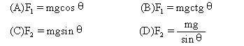

**完整的知识网络构建，让复习备考变得轻松简单！**

**（注意：全篇带★需要牢记！）**

**高**

**中**

**物**

**理**

**重**

**要**

**知**

**识**

**点**

**总**

**结**

**（史上最全）**

**高中物理知识点总结**

**（注意：全篇带★需要牢记！）**

**一、力 物体的平衡**

1.力是物体对物体的作用，是物体发生形变和改变物体的运动状态（即产生加速度）的原因.
力是矢量。  
2.重力 （1）重力是由于地球对物体的吸引而产生的.  
［注意］重力是由于地球的吸引而产生，但不能说重力就是地球的吸引力，重力是万有引力的一个分力.

但在地球表面附近，可以认为重力近似等于万有引力

（2）重力的大小:地球表面G=mg，离地面高h处G/=mg/，其中g/=[R/（R+h）]2g  
（3）重力的方向:竖直向下（不一定指向地心）。  
（4）重心:物体的各部分所受重力合力的作用点，物体的重心不一定在物体上.  
3.弹力 （1）产生原因:由于发生弹性形变的物体有恢复形变的趋势而产生的.

（2）产生条件:①直接接触;②有弹性形变.

（3）弹力的方向:与物体形变的方向相反，弹力的受力物体是引起形变的物体，施力物体是发生形变的物体.在点面接触的情况下，垂直于面;

在两个曲面接触（相当于点接触）的情况下，垂直于过接触点的公切面.

①绳的拉力方向总是沿着绳且指向绳收缩的方向，且一根轻绳上的张力大小处处相等.  
②轻杆既可产生压力，又可产生拉力，且方向不一定沿杆.  
（4）弹力的大小:一般情况下应根据物体的运动状态，利用平衡条件或牛顿定律来求解.弹簧弹力可由胡克定律来求解.  
**★胡克定律**:在弹性限度内，弹簧弹力的大小和弹簧的形变量成正比，即**F=kx**.k为弹簧的劲度系数，它只与弹簧本身因素有关，单位是N/m.  
4.摩擦力  
（1）产生的条件:①相互接触的物体间存在压力;③接触面不光滑;③接触的物体之间有相对运动（滑动摩擦力）或相对运动的趋势（静摩擦力），这三点缺一不可.  
（2）摩擦力的方向:沿接触面切线方向，与物体相对运动或相对运动趋势的方向相反，与物体运动的方向可以相同也可以相反.  
（3）判断静摩擦力方向的方法:  
①**假设法**:首先假设两物体接触面光滑，这时若两物体不发生相对运动，则说明它们原来没有相对运动趋势，也没有静摩擦力;若两物体发生相对运动，则说明它们原来有相对运动趋势，并且原来相对运动趋势的方向跟假设接触面光滑时相对运动的方向相同.然后根据静摩擦力的方向跟物体相对运动趋势的方向相反确定静摩擦力方向.  
②**平衡法**:根据二力平衡条件可以判断静摩擦力的方向.  
（4）大小:先判明是何种摩擦力，然后再根据各自的规律去分析求解.

①滑动摩擦力大小:利用公式f=μF N 进行计算，其中FN
是物体的正压力，不一定等于物体的重力，甚至可能和重力无关.或者根据物体的运动状态，利用平衡条件或牛顿定律来求解.

②静摩擦力大小:静摩擦力大小可在0与f max
之间变化，一般应根据物体的运动状态由平衡条件或牛顿定律来求解.  
5.物体的受力分析  
（1）确定所研究的物体，分析周围物体对它产生的作用，不要分析该物体施于其他物体上的力，也不要把作用在其他物体上的力错误地认为通过“力的传递”作用在研究对象上.  
（2）按“性质力”的顺序分析.即按重力、弹力、摩擦力、其他力顺序分析，不要把“效果力”与“性质力”混淆重复分析.  
（3）如果有一个力的方向难以确定，可用假设法分析.先假设此力不存在，想像所研究的物体会发生怎样的运动，然后审查这个力应在什么方向，对象才能满足给定的运动状态.

>   6.力的合成与分解  
>   （1）合力与分力:如果一个力作用在物体上，它产生的效果跟几个力共同作用产生的效果相同，这个力就叫做那几个力的合力，而那几个力就叫做这个力的分力.（2）力合成与分解的根本方法:平行四边形定则.  
>   （3）力的合成:求几个已知力的合力，叫做力的合成.  
>   共点的两个力（F 1 和F 2 ）合力大小F的取值范围为:\|F 1 -F 2 \|≤F≤F 1 +F 2 .  
>   （4）力的分解:求一个已知力的分力，叫做力的分解（力的分解与力的合成互为逆运算）.  
>   在实际问题中，通常将已知力按力产生的实际作用效果分解;为方便某些问题的研究，在很多问题中都采用正交分解法.  
>   7.共点力的平衡  
>   （1）共点力:作用在物体的同一点，或作用线相交于一点的几个力.  
>   （2）平衡状态:物体保持匀速直线运动或静止叫平衡状态，是加速度等于零的状态.  
>   （3）**★**共点力作用下的物体的平衡条件:物体所受的合外力为零，即∑F=0，若采用正交分解法求解平衡问题，则平衡条件应为:∑Fx
>   =0，∑Fy =0.  
>   （4）解决平衡问题的常用方法:隔离法、整体法、图解法、三角形相似法、正交分解法等等.

>   **二、直线运动**  
>   1.机械运动:一个物体相对于另一个物体的位置的改变叫做机械运动，简称运动，它包括平动，转动和振动等运动形式.为了研究物体的运动需要选定参照物（即假定为不动的物体），对同一个物体的运动，所选择的参照物不同，对它的运动的描述就会不同，通常以地球为参照物来研究物体的运动.  
>   2.质点:用来代替物体的只有质量没有形状和大小的点，它是一个理想化的物理模型.仅凭物体的大小不能做视为质点的依据。  
>   3.位移和路程:位移描述物体位置的变化，是从物体运动的初位置指向末位置的有向线段，是矢量.路程是物体运动轨迹的长度，是标量.  
>   路程和位移是完全不同的概念，仅就大小而言，一般情况下位移的大小小于路程，只有在单方向的直线运动中，位移的大小才等于路程.  
>   4.速度和速率  
>   （1）速度:描述物体运动快慢的物理量.是矢量.  
>   ①平均速度:质点在某段时间内的位移与发生这段位移所用时间的比值叫做这段时间（或位移）的平均速度v，即v=s/t，平均速度是对变速运动的粗略描述.  
>   ②瞬时速度:运动物体在某一时刻（或某一位置）的速度，方向沿轨迹上质点所在点的切线方向指向前进的一侧.瞬时速度是对变速运动的精确描述.  
>   （2）速率：①速率只有大小，没有方向，是标量.

>   ②平均速率:质点在某段时间内通过的路程和所用时间的比值叫做这段时间内的平均速率.在一般变速运动中平均速度的大小不一定等于平均速率，只有在单方向的直线运动，二者才相等.  
>   5.加速度  
>   （1）加速度是描述速度变化快慢的物理量，它是矢量.加速度又叫速度变化率.  
>   （2）定义:在匀变速直线运动中，速度的变化Δv跟发生这个变化所用时间Δt的比值，叫做匀变速直线运动的加速度，用a表示.

>     
>   （3）方向:与速度变化Δv的方向一致.但不一定与v的方向一致.  
>   ［注意］加速度与速度无关.只要速度在变化，无论速度大小，都有加速度;只要速度不变化（匀速），无论速度多大，加速度总是零;只要速度变化快，无论速度是大、是小或是零，物体加速度就大.  
>   6.匀速直线运动
>   （1）定义:在任意相等的时间内位移相等的直线运动叫做匀速直线运动.  
>   （2）特点:a=0，v=恒量. （3）位移公式:S=vt.  
>   7.匀变速直线运动
>   （1）定义:在任意相等的时间内速度的变化相等的直线运动叫匀变速直线运动.  
>   （2）特点:a=恒量 （3）**★**公式： 速度公式：V=V0+at 位移公式：s=v0t+at2

>   速度位移公式：vt2-v02=2as 平均速度V=  
>   以上各式**均为矢量式**，应用时应规定正方向，然后把矢量化为代数量求解，通常选初速度方向为正方向，凡是跟正方向一致的取“+”值，跟正方向相反的取“-”值.

>   8.重要结论  
>   （1）匀变速直线运动的质点，在任意两个连续相等的时间T内的位移差值是恒量，即

>   ΔS=Sn+l –Sn=aT2 =恒量  
>   （2）匀变速直线运动的质点，在某段时间内的中间时刻的瞬时速度，等于这段时间内的平均速度，即：

9.自由落体运动  
（1）条件:初速度为零，只受重力作用.
（2）性质:是一种初速为零的匀加速直线运动，a=g.  
（3）公式:

  
10.运动图像  
（1）位移图像（s-t图像）:①图像上一点切线的斜率表示该时刻所对应速度；  
②图像是直线表示物体做匀速直线运动，图像是曲线则表示物体做变速运动；  
③图像与横轴交叉，表示物体从参考点的一边运动到另一边.  
（2）速度图像（v-t图像）:①在速度图像中，可以读出物体在任何时刻的速度；  
②在速度图像中，物体在一段时间内的位移大小等于物体的速度图像与这段时间轴所围面积的值.  
③在速度图像中，物体在任意时刻的加速度就是速度图像上所对应的点的切线的斜率.  
④图线与横轴交叉，表示物体运动的速度反向.  
⑤图线是直线表示物体做匀变速直线运动或匀速直线运动;图线是曲线表示物体做变加速运动.

**三、牛顿运动定律**  
**★**1**.牛顿第一定律**:一切物体总保持匀速直线运动状态或静止状态，直到有外力迫使它改变这种运动状态为止.  
（1）运动是物体的一种属性，物体的运动不需要力来维持.  
（2）定律说明了任何物体都有惯性.  
（3）不受力的物体是不存在的.牛顿第一定律不能用实验直接验证.但是建立在大量实验现象的基础之上，通过思维的逻辑推理而发现的.它告诉了人们研究物理问题的另一种新方法:通过观察大量的实验现象，利用人的逻辑思维，从大量现象中寻找事物的规律.  
（4）牛顿第一定律是牛顿第二定律的基础，不能简单地认为它是牛顿第二定律不受外力时的特例，牛顿第一定律定性地给出了力与运动的关系，牛顿第二定律定量地给出力与运动的关系.  
2.惯性:物体保持匀速直线运动状态或静止状态的性质.  
（1）惯性是物体的固有属性，即一切物体都有惯性，与物体的受力情况及运动状态无关.因此说，人们只能“利用”惯性而不能“克服”惯性.（2）质量是物体惯性大小的量度.  
**★★★★**3.**牛顿第二定律**:物体的加速度跟所受的外力的合力成正比，跟物体的质量成反比，加速度的方向跟合外力的方向相同，表达式F
合 =ma  
（1）牛顿第二定律定量揭示了力与运动的关系，即知道了力，可根据牛顿第二定律，分析出物体的运动规律;反过来，知道了运动，可根据牛顿第二定律研究其受力情况，为设计运动，控制运动提供了理论基础.  
（2）对牛顿第二定律的数学表达式F 合 =ma，F 合
是力，ma是力的作用效果，特别要注意不能把ma看作是力.  
（3）牛顿第二定律揭示的是力的瞬间效果.即作用在物体上的力与它的效果是瞬时对应关系，力变加速度就变，力撤除加速度就为零，注意力的瞬间效果是加速度而不是速度.  
（4）牛顿第二定律F 合 =ma，F合是矢量，ma也是矢量，且ma与F 合 的方向总是一致的.F
合 可以进行合成与分解，ma也可以进行合成与分解.  
4.
**★牛顿第三定律**:两个物体之间的作用力与反作用力总是大小相等，方向相反，作用在同一直线上.  
（1）牛顿第三运动定律指出了两物体之间的作用是相互的，因而力总是成对出现的，它们总是同时产生，同时消失.（2）作用力和反作用力总是同种性质的力.  
（3）作用力和反作用力分别作用在两个不同的物体上，各产生其效果，不可叠加.  
5.牛顿运动定律的适用范围:宏观低速的物体和在惯性系中.

>   6.超重和失重  
>   （1）超重:物体有向上的加速度称物体处于超重.处于超重的物体对支持面的压力F N
>   （或对悬挂物的拉力）大于物体的重力mg，即F N
>   =mg+ma.（2）失重:物体有向下的加速度称物体处于失重.处于失重的物体对支持面的压力FN（或对悬挂物的拉力）小于物体的重力mg.即FN=mg-ma.当a=g时F
>   N =0，物体处于完全失重.（3）对超重和失重的理解应当注意的问题  
>   ①不管物体处于失重状态还是超重状态，物体本身的重力并没有改变，只是物体对支持物的压力（或对悬挂物的拉力）不等于物体本身的重力.②超重或失重现象与物体的速度无关，只决定于加速度的方向.“加速上升”和“减速下降”都是超重;“加速下降”和“减速上升”都是失重.  
>   ③在完全失重的状态下，平常一切由重力产生的物理现象都会完全消失，如单摆停摆、天平失效、浸在水中的物体不再受浮力、液体柱不再产生压强等.

>   6、处理连接题问题----通常是用整体法求加速度，用隔离法求力。

>   **四、曲线运动 万有引力**  
>   1.曲线运动  
>   （1）物体作曲线运动的条件:运动质点所受的合外力（或加速度）的方向跟它的速度方向不在同一直线
>   （2）曲线运动的特点:质点在某一点的速度方向，就是通过该点的曲线的切线方向.质点的速度方向时刻在改变，所以曲线运动一定是变速运动.  
>   （3）曲线运动的轨迹:做曲线运动的物体，其轨迹向合外力所指一方弯曲，若已知物体的运动轨迹，可判断出物体所受合外力的大致方向，如平抛运动的轨迹向下弯曲，圆周运动的轨迹总向圆心弯曲等.  
>   2.运动的合成与分解  
>   （1）合运动与分运动的关系:①等时性;②独立性;③等效性.  
>   （2）运动的合成与分解的法则:平行四边形定则.  
>   （3）分解原则:根据运动的实际效果分解，物体的实际运动为合运动.  
>   3. **★★★平抛运动**  
>   （1）特点:①具有水平方向的初速度;②只受重力作用，是加速度为重力加速度g的匀变速曲线运动.  
>   （2）运动规律:平抛运动可以分解为水平方向的匀速直线运动和竖直方向的自由落体运动.  
>   ①建立直角坐标系（一般以抛出点为坐标原点O，以初速度vo方向为x轴正方向，竖直向下为y轴正方向）;  
>   ②由两个分运动规律来处理（如右图）.

 

4.圆周运动  
（1）描述圆周运动的物理量  
①线速度:描述质点做圆周运动的快慢，大小v=s/t（s是t时间内通过弧长），方向为质点在圆弧某点的线速度方向沿圆弧该点的切线方向  
②角速度:描述质点绕圆心转动的快慢，大小ω=φ/t（单位rad/s），φ是连接质点和圆心的半径在t时间内转过的角度.其方向在中学阶段不研究.  
③周期T，频率f ---------做圆周运动的物体运动一周所用的时间叫做周期.  
做圆周运动的物体单位时间内沿圆周绕圆心转过的圈数叫做频率.   

  
⑥向心力:总是指向圆心，产生向心加速度，向心力只改变线速度的方向，不改变速度的大小.大小

［注意］向心力是根据力的效果命名的.在分析做圆周运动的质点受力情况时，千万不可在物体受力之外再添加一个向心力.  
（2）匀速圆周运动:线速度的大小恒定，角速度、周期和频率都是恒定不变的，向心加速度和向心力的大小也都是恒定不变的，是速度大小不变而速度方向时刻在变的变速曲线运动.  
（3）变速圆周运动:速度大小方向都发生变化，不仅存在着向心加速度（改变速度的方向），而且还存在着切向加速度（方向沿着轨道的切线方向，用来改变速度的大小）.一般而言，合加速度方向不指向圆心，合力不一定等于向心力.合外力在指向圆心方向的分力充当向心力，产生向心加速度;合外力在切线方向的分力产生切向加速度.
①如右上图情景中，小球恰能过最高点的条件是v≥v临
v临由重力提供向心力得v临②如右下图情景中，小球恰能过最高点的条件是v≥0。

>   5**★.万有引力定律**  
>   （1）万有引力定律：宇宙间的一切物体都是互相吸引的.两个物体间的引力的大小，跟它们的质量的乘积成正比，跟它们的距离的平方成反比.  
>   公式:

>      
>   （2）**★★★**应用万有引力定律分析天体的运动  
>   ①基本方法:把天体的运动看成是匀速圆周运动，其所需向心力由万有引力提供.即
>   F引=F向得：  
>   

>     
>   应用时可根据实际情况选用适当的公式进行分析或计算.②天体质量M、密度ρ的估算: 

>     
>   （3）三种宇宙速度  
>   ①第一宇宙速度:v 1
>   =7.9km/s，它是卫星的最小发射速度，也是地球卫星的最大环绕速度.  
>   ②第二宇宙速度（脱离速度）:v 2
>   =11.2km/s，使物体挣脱地球引力束缚的最小发射速度.  
>   ③第三宇宙速度（逃逸速度）:v 3
>   =16.7km/s，使物体挣脱太阳引力束缚的最小发射速度.  
>   （4）地球同步卫星  
>   所谓地球同步卫星，是相对于地面静止的，这种卫星位于赤道上方某一高度的稳定轨道上，且绕地球运动的周期等于地球的自转周期，即T=24h=86400s，离地面高度 

>    
>   同步卫星的轨道一定在赤道平面内，并且只有一条.所有同步卫星都在这条轨道上，以大小相同的线速度，角速度和周期运行着.  
>   （5）卫星的超重和失重  
>   “超重”是卫星进入轨道的加速上升过程和回收时的减速下降过程，此情景与“升降机”中物体超重相同.“失重”是卫星进入轨道后正常运转时，卫星上的物体完全“失重”（因为重力提供向心力），此时，在卫星上的仪器，凡是制造原理与重力有关的均不能正常使用.  
>   **五、动量**  
>   1.动量和冲量  
>   （1）动量:运动物体的质量和速度的乘积叫做动量，即p=mv.是矢量，方向与v的方向相同.两个动量相同必须是大小相等，方向一致.  
>   （2）冲量:力和力的作用时间的乘积叫做该力的冲量，即I=Ft.冲量也是矢量，它的方向由力的方向决定.  
>   2. **★★动量定理**:物体所受合外力的冲量等于它的动量的变化.表达式:Ft=p′-p 或
>   Ft=mv′-mv  
>   （1）上述公式是一矢量式，运用它分析问题时要特别注意冲量、动量及动量变化量的方向.  
>   （2）公式中的F是研究对象所受的包括重力在内的所有外力的合力.  
>   （3）动量定理的研究对象可以是单个物体，也可以是物体系统.对物体系统，只需分析系统受的外力，不必考虑系统内力.系统内力的作用不改变整个系统的总动量.  
>   （4）动量定理不仅适用于恒定的力，也适用于随时间变化的力.对于变力，动量定理中的力F应当理解为变力在作用时间内的平均值.  
>   **★★★
>   3.动量守恒定律:**一个系统不受外力或者所受外力之和为零，这个系统的总动量保持不变.  
>   表达式:m 1 v 1 +m 2 v 2 =m 1 v 1 ′+m 2 v 2 ′  
>   （1）动量守恒定律成立的条件  
>   ①系统不受外力或系统所受外力的合力为零.  
>   ②系统所受的外力的合力虽不为零，但系统外力比内力小得多，如碰撞问题中的摩擦力，爆炸过程中的重力等外力比起相互作用的内力来小得多，可以忽略不计.  
>   ③系统所受外力的合力虽不为零，但在某个方向上的分量为零，则在该方向上系统的总动量的分量保持不变.  
>   （2）动量守恒的速度具有“四性”:①矢量性;②瞬时性;③相对性;④普适性.  
>   4.爆炸与碰撞  
>   （1）爆炸、碰撞类问题的共同特点是物体间的相互作用突然发生，作用时间很短，作用力很大，且远大于系统受的外力，故可用动量守恒定律来处理.  
>   （2）在爆炸过程中，有其他形式的能转化为动能，系统的动能爆炸后会增加，在碰撞过程中，系统的总动能不可能增加，一般有所减少而转化为内能.  
>   （3）由于爆炸、碰撞类问题作用时间很短，作用过程中物体的位移很小，一般可忽略不计，可以把作用过程作为一个理想化过程简化处理.即作用后还从作用前瞬间的位置以新的动量开始运动.  
>   5.反冲现象:反冲现象是指在系统内力作用下，系统内一部分物体向某方向发生动量变化时，系统内其余部分物体向相反的方向发生动量变化的现象.喷气式飞机、火箭等都是利用反冲运动的实例.显然，在反冲现象里，系统的动量是守恒的.

**六、机械能**  
1.功  
（1）功的定义:力和作用在力的方向上通过的位移的乘积.是描述力对空间积累效应的物理量，是过程量.  
定义式:W=F·s·cosθ，其中F是力，s是力的作用点位移（对地），θ是力与位移间的夹角.  
（2）功的大小的计算方法:  
①恒力的功可根据W=F·S·cosθ进行计算，本公式只适用于恒力做功.②根据W=P·t，计算一段时间内平均做功.
③利用动能定理计算力的功，特别是变力所做的功.④根据功是能量转化的量度反过来可求功.  
（3）摩擦力、空气阻力做功的计算:功的大小等于力和路程的乘积.  
发生相对运动的两物体的这一对相互摩擦力做的总功:W=fd（d是两物体间的相对路程），且W=Q（摩擦生热）

2.功率  
（1）功率的概念:功率是表示力做功快慢的物理量，是标量.求功率时一定要分清是求哪个力的功率，还要分清是求平均功率还是瞬时功率.  
（2）功率的计算 ①平均功率:P=W/t（定义式）
表示时间t内的平均功率，不管是恒力做功，还是变力做功，都适用.
②瞬时功率:P=F·v·cosα P和v分别表示t时刻的功率和速度，α为两者间的夹角.  
（3）额定功率与实际功率 ： 额定功率:发动机正常工作时的最大功率.
实际功率:发动机实际输出的功率，它可以小于额定功率，但不能长时间超过额定功率.  
（4）交通工具的启动问题通常说的机车的功率或发动机的功率实际是指其牵引力的功率.  
①以恒定功率P启动:机车的运动过程是先作加速度减小的加速运动，后以最大速度v m=P/f
作匀速直线运动， .  
②以恒定牵引力F启动:机车先作匀加速运动，当功率增大到额定功率时速度为v1=P/F，而后开始作加速度减小的加速运动，最后以最大速度vm=P/f作匀速直线运动。

>   3.动能:物体由于运动而具有的能量叫做动能.表达式:Ek=mv2/2
>   （1）动能是描述物体运动状态的物理量.（2）动能和动量的区别和联系  
>   ①动能是标量，动量是矢量，动量改变，动能不一定改变;动能改变，动量一定改变.  
>   ②两者的物理意义不同:动能和功相联系，动能的变化用功来量度;动量和冲量相联系，动量的变化用冲量来量度.③两者之间的大小关系为EK=P2/2m  
>   4. **★★★★动能定理**:外力对物体所做的总功等于物体动能的变化.表达式

>   （1）动能定理的表达式是在物体受恒力作用且做直线运动的情况下得出的.但它也适用于变力及物体作曲线运动的情况.
>   （2）功和动能都是标量，不能利用矢量法则分解，故动能定理无分量式.  
>   （3）应用动能定理只考虑初、末状态，没有守恒条件的限制，也不受力的性质和物理过程的变化的影响.所以，凡涉及力和位移，而不涉及力的作用时间的动力学问题，都可以用动能定理分析和解答，而且一般都比用牛顿运动定律和机械能守恒定律简捷.  
>   （4）当物体的运动是由几个物理过程所组成，又不需要研究过程的中间状态时，可以把这几个物理过程看作一个整体进行研究，从而避开每个运动过程的具体细节，具有过程简明、方法巧妙、运算量小等优点.  
>   5.重力势能  
>   （1）定义:地球上的物体具有跟它的高度有关的能量，叫做重力势能，.  
>   ①重力势能是地球和物体组成的系统共有的，而不是物体单独具有的.②重力势能的大小和零势能面的选取有关.③重力势能是标量，但有“+”、“-”之分.  
>   （2）重力做功的特点:重力做功只决定于初、末位置间的高度差，与物体的运动路径无关.WG
>   =mgh.  
>   （3）做功跟重力势能改变的关系:重力做功等于重力势能增量的负值.即WG =- .  
>   6.弹性势能:物体由于发生弹性形变而具有的能量.  
>   **★★★ 7.机械能守恒定律**  
>   （1）动能和势能（重力势能、弹性势能）统称为机械能，E=E k +E p .  
>   （2）机械能守恒定律的内容:在只有重力（和弹簧弹力）做功的情形下，物体动能和重力势能（及弹性势能）发生相互转化，但机械能的总量保持不变.
>   （3）机械能守恒定律的表达式

>     
>   （4）系统机械能守恒的三种表示方式:  
>   ①系统初态的总机械能E 1 等于末态的总机械能E 2 ，即E1 =E2  
>     ②系统减少的总重力势能ΔE P减 等于系统增加的总动能ΔE K增 ，即ΔE P减 =ΔE K增  
>     ③若系统只有A、B两物体，则A物体减少的机械能等于B物体增加的机械能，即ΔE A减
>   =ΔE B增  
>    
>   ［注意］解题时究竟选取哪一种表达形式，应根据题意灵活选取;需注意的是:选用①式时，必须规定零势能参考面，而选用②式和③式时，可以不规定零势能参考面，但必须分清能量的减少量和增加量.  
>     （5）判断机械能是否守恒的方法  
>    
>   ①用做功来判断:分析物体或物体受力情况（包括内力和外力），明确各力做功的情况，若对物体或系统只有重力或弹簧弹力做功，没有其他力做功或其他力做功的代数和为零，则机械能守恒.  
>    
>   ②用能量转化来判定:若物体系中只有动能和势能的相互转化而无机械能与其他形式的能的转化，则物体系统机械能守恒.  
>    
>   ③对一些绳子突然绷紧，物体间非弹性碰撞等问题，除非题目特别说明，机械能必定不守恒，完全非弹性碰撞过程机械能也不守恒.  
>   **  8.功能关系**  
>     （1）当只有*重力（或弹簧弹力）做功*时，物体的机械能守恒.  
>     （2）重力对物体做的功等于物体重力势能的减少:W G =E p1 -E p2 .  
>     （3）合外力对物体所做的功等于物体动能的变化:W 合 =E k2 -E k1 （动能定理）  
>     （4）除了重力（或弹簧弹力）之外的力对物体所做的功等于物体机械能的变化:W F
>   =E 2 -E 1  
>     9.能量和动量的综合运用  
>    
>   动量与能量的综合问题，是高中力学最重要的综合问题，也是难度较大的问题.分析这类问题时，应首先建立清晰的物理图景，抽象出物理模型，选择物理规律，建立方程进行求解.这一部分的主要模型是碰撞.而碰撞过程，一般都遵从动量守恒定律，但机械能不一定守恒，对弹性碰撞就守恒，非弹性碰撞就不守恒，总的能量是守恒的，对于碰撞过程的能量要分析物体间的转移和转换.从而建立碰撞过程的能量关系方程.根据动量守恒定律和能量关系分别建立方程，两者联立进行求解，是这一部分常用的解决物理问题的方法.  
>     **七、机械振动和机械波**  
>     1.简谐运动  
>    
>   （1）定义:物体在跟偏离平衡位置的位移大小成正比，并且总是指向平衡位置的回复力的作用下的振动，叫做简谐运动.  
>    
>   （2）简谐运动的特征:回复力*F=-kx*，加速度*a=-kx/m*，方向与位移方向相反，总指向平衡位置.  
>    
>   简谐运动是一种**变加速**运动，在平衡位置时，速度*最大*，加速度为*零*;在最大位移处，速度为*零*，加速度*最大*.  
>     （3）描述简谐运动的物理量  
>     ①位移x:由平衡位置指向振动质点所在位置的有向线段，是矢量，其最大值等于振幅.  
>     ②振幅A:振动物体离开平衡位置的最大距离，是标量，表示振动的强弱.  
>     ③周期T和频率f:表示振动快慢的物理量，二者互为倒数关系，即T=1/f.  
>     （4）简谐运动的图像  
>     ①意义:表示振动物体位移随时间变化的规律，注意振动图像不是质点的运动轨迹.  
>     ②特点:简谐运动的图像是正弦（或余弦）曲线.  
>    
>   ③应用:可直观地读取振幅A、周期T以及各时刻的位移x，判定回复力、加速度方向，判定某段时间内位移、回复力、加速度、速度、动能、势能的变化情况.  
>    
>   2.弹簧振子:**周期和频率只取决于弹簧的劲度系数和振子的质量，与其放置的环境和放置的方式无任何关系**.如某一弹簧振子做简谐运动时的周期为T，不管把它放在地球上、月球上还是卫星中;是水平放置、倾斜放置还是竖直放置;振幅是大还是小，它的周期就都是T.  
>    
>   3.单摆:摆线的质量不计且不可伸长，摆球的直径比摆线的长度小得多，摆球可视为质点.单摆是一种理想化模型.
>   （1）单摆的振动可看作简谐运动的条件是:最大摆角α\<5°.  
>     （2）单摆的回复力是重力沿圆弧切线方向并且指向平衡位置的分力.  
>     （3）作简谐运动的单摆的周期公式为:T=2**π** 

>   ①在振幅很小的条件下，单摆的振动周期 跟振幅无关.  
>     ②单摆的振动周期跟摆球的质量无关，只与摆长L和当地的重力加速度g有关.  
>    
>   ③摆长L是指悬点到摆球重心间的距离，在某些变形单摆中，摆长L应理解为等效摆长，重力加速度应理解为等效重力加速度（一般情况下，等效重力加速度g'等于摆球静止在平衡位置时摆线的张力与摆球质量的比值）.  
>     4.受迫振动  
>     （1）受迫振动:振动系统在周期性驱动力作用下的振动叫受迫振动.  
>    
>   （2）受迫振动的特点:受迫振动稳定时，系统振动的频率等于驱动力的频率，跟系统的固有频率无关.  
>    
>   （3）共振:当驱动力的频率等于振动系统的固有频率时，振动物体的振幅最大，这种现象叫做共振.  
>     共振的条件:驱动力的频率等于振动系统的固有频率.  
>    .5.机械波:机械振动在介质中的传播形成机械波.

>   （1）机械波产生的条件:①波源;②介质

>   （2）机械波的分类
>   ①横波:质点振动方向与波的传播方向垂直的波叫横波.横波有凸部（波峰）和凹部（波谷）.  
>     ②纵波:质点振动方向与波的传播方向在同一直线上的波叫纵波.纵波有密部和疏部.  
>     ［注意］气体、液体、固体都能传播纵波，但气体、液体不能传播横波.

>   （3）机械波的特点  
>    
>   ①机械波传播的是振动形式和能量.*质点只在各自的平衡位置附近振动，并不随波迁移*.  
>    
>   ②介质中各质点的振动周期和频率都与波源的振动周期和频率相同.③离波源近的质点带动离波源远的
>   质点依次振动.  
>     6.波长、波速和频率及其关系  
>    
>   （1）波长:两个**相邻**的且在振动过程中对平衡位置的位移**总是相等**的质点间的距离叫波长.振动在一个周期里在介质中传播的距离等于一个波长.

>   （2）波速:波的传播速率.机械波的传播速率由介质决定，与波源无关.

>   （3）频率:波的频率始终等于波源的振动频率，与介质无关.

>   （4）三者关系:**v=λf**  
>     7.
>   **★**波动图像:表示波的传播方向上，介质中的各个质点在同一时刻相对平衡位置的位移.当波源作简谐运动时，它在介质中形成简谐波，其波动图像为正弦或余弦曲线.  
>     （1）由波的图像可获取的信息  
>     ①从图像可以直接读出振幅（注意单位）.②从图像可以直接读出波长（注意单位）.  
>     ③可求任一点在该时刻相对平衡位置的位移（包括大小和方向）  
>    
>   ④在波速方向已知（或已知波源方位）时可确定各质点在该时刻的振动方向.⑤可以确定各质点振动的加速度方向（加速度总是指向平衡位置）

>   （2）波动图像与振动图像的比较：

|                          | 振动图象                           | 波动图象                       |
|--------------------------|------------------------------------|--------------------------------|
| 研究对象                 | 一个振动质点                       | 沿波传播方向所有的质点         |
| 研究内容                 | 一个质点的位移随时间变化规律       | 某时刻所有质点的空间分布规律   |
| 图象                     |                                    |                                |
| 物理意义                 | 表示一质点在各时刻的位移           | 表示某时刻各质点的位移         |
| 图象变化                 | 随时间推移图象延续，但已有形状不变 | 随时间推移，图象沿传播方向平移 |
| 一个完整曲线占横坐标距离 | 表示一个周期                       | 表示一个波长                   |

8.波动问题多解性  
 
波的传播过程中时间上的周期性、空间上的周期性以及传播方向上的双向性是导致“波动问题多解性”的主要原因.若题目假设一定的条件，可使无限系列解转化为有限或惟一解

9.波的衍射  
 
波在传播过程中偏离直线传播，绕过障碍物的现象.衍射现象总是存在的，只有明显与不明显的差异.波发生明显衍射现象的条件是:障碍物（或小孔）的尺寸比波的波长小或能够与波长差不多.  
  10.波的叠加  
 
几列波相遇时，每列波能够保持各自的状态继续传播而不互相干扰，只是在重叠的区域里，任一质点的总位移等于各列波分别引起的位移的矢量和.两列波相遇前、相遇过程中、相遇后，各自的运动状态不发生任何变化，这是波的独立性原理.  
  11.波的干涉:  
 
频率相同的两列波叠加，某些区域的振动加强，某些区域的振动减弱，并且振动加强和振动减弱的区域相互间隔的现象，叫波的干涉.产生干涉现象的条件:两列波的频率相同，振动情况稳定.  
 
［注意］①干涉时，振动加强区域或振动减弱区域的空间位置是不变的，加强区域中心质点的振幅等于两列波的振幅之和，减弱区域中心质点的振幅等于两列波的振幅之差.  
 
②两列波在空间相遇发生干涉，两列波的波峰相遇点为加强点，波峰和波谷的相遇点是减弱的点，加强的点只是振幅大了，并非任一时刻的位移都大;减弱的点只是振幅小了，也并非任一时刻的位移都最小.
如图若S1、S2为振动方向同步的相干波源，当PS1-PS2=nλ时，振动加强；当PS1-PS2=（2n+1）λ/2时，振动减弱。  
 

12.声波  
  （1）空气中的声波是纵波，传播速度为340m/s.
（2）能够引起人耳感觉的声波频率范围是:20～20000Hz.  
  （3）超声波:频率高于20000Hz的声波.
①超声波的重要性质有:波长短，不容易发生衍射，基本上能直线传播，因此可以使能量定向集中传播;穿透能力强.  
 
②对超声波的利用:用声纳探测潜艇、鱼群，探察金属内部的缺陷;利用超声波碎石治疗胆结石、肾结石等;利用“B超”探察人体内病变.  
 
13.多普勒效应:由于波源和观察者之间有相对运动使观察者感到频率发生变化的现象.其特点是:当波源与观察者有相对运动，两者相互接近时，观察者接收到的频率增大;两者相互远离时，观察者接收到的频率减小.  
**  八、分子动理论、热和功、气体**  
  1.分子动理论  
  （1）物质是由大量分子组成的 分子直径的数量级一般是10 -10 m.  
  （2）分子永不停息地做无规则热运动.  
 
①扩散现象:不同的物质互相接触时，可以彼此进入对方中去.温度越高，扩散越快.②布朗运动:在显微镜下看到的悬浮在液体（或气体）中微小颗粒的无规则运动，是液体分子对微小颗粒撞击作用的不平衡造成的，是液体分子永不停息地无规则运动的宏观反映.颗粒越小，布朗运动越明显;温度越高，布朗运动越明显.  
  （3）分子间存在着相互作用力  
 
分子间同时存在着引力和斥力，引力和斥力都随分子间距离增大而减小，但斥力的变化比引力的变化快，实际表现出来的是引力和斥力的合力.  
  2.物体的内能  
 
（1）分子动能:做热运动的分子具有动能，在热现象的研究中，单个分子的动能是无研究意义的，重要的是分子热运动的平均动能.温度是物体分子热运动的平均动能的标志.  
 
（2）分子势能:分子间具有由它们的相对位置决定的势能，叫做分子势能.分子势能随着物体的体积变化而变化.分子间的作用表现为引力时，分子势能随着分子间的距离增大而增大.分子间的作用表现为斥力时，分子势能随着分子间距离增大而减小.对实际气体来说，体积增大，分子势能增加;体积缩小，分子势能减小.  
 
（3）物体的内能:物体里所有的分子的动能和势能的总和叫做物体的内能.任何物体都有内能，物体的内能跟物体的温度和体积有关.  
 
（4）物体的内能和机械能有着本质的区别.物体具有内能的同时可以具有机械能，也可以不具有机械能.  
  3.改变内能的两种方式  
  （1）做功:其本质是其他形式的能和内能之间的相互转化.
（2）热传递:其本质是物体间内能的转移.  
  （3）做功和热传递在改变物体的内能上是等效的，但有本质的区别.  
  4**. ★能量转化和守恒定律**  
  5**★**.**热力学第一定律**  
 
（1）内容:物体内能的增量（ΔU）等于外界对物体做的功（W）和物体吸收的热量（Q）的总和.  
  （2）表达式:W+Q=ΔU  
 
（3）符号法则:外界对物体做功，W取正值，物体对外界做功，W取负值;物体吸收热量，Q取正值，物体放出热量，Q取负值;物体内能增加，ΔU取正值，物体内能减少，ΔU取负值.  
  6.热力学第二定律（1）热传导的方向性  
 
热传递的过程是有方向性的，热量会自发地从高温物体传给低温物体，而不会自发地从低温物体传给高温物体.（2）热力学第二定律的两种常见表述  
  ①不可能使热量由低温物体传递到高温物体，而不引起其他变化.  
 
②不可能从单一热源吸收热量并把它全部用来做功，而不引起其他变化.（3）永动机不可能制成  
 
①第一类永动机不可能制成:不消耗任何能量，却可以源源不断地对外做功，这种机器被称为第一类永动机，这种永动机是不可能制造成的，它违背了能量守恒定律.  
 
②第二类永动机不可能制成:没有冷凝器，只有单一热源，并从这个单一热源吸收的热量，可以全部用来做功，而不引起其他变化的热机叫做第二类永动机.第二类永动机不可能制成，它虽然不违背能量守恒定律，但违背了热力学第二定律.  
  7.气体的状态参量  
 
（1）温度:宏观上表示物体的冷热程度，微观上是分子平均动能的标志.两种温标的换算关系:T=（t+273）K.  
  绝对零度为-273.15℃，它是低温的极限，只能接近不能达到.  
 
（2）气体的体积:气体的体积不是气体分子自身体积的总和，而是指大量气体分子所能达到的整个空间的体积.封闭在容器内的气体，其体积等于容器的容积.  
 
（3）气体的压强:气体作用在器壁单位面积上的压力.数值上等于单位时间内器壁单位面积上受到气体分子的总冲量.  
 ①产生原因:大量气体分子无规则运动碰撞器壁，形成对器壁各处均匀的持续的压力.  
 ②决定因素:一定气体的压强大小，微观上决定于分子的运动速率和分子密度;宏观上决定于气体的温度和体积.  
  （4）对于一定质量的理想气体，PV/T=恒量

  8.气体分子运动的特点  
 
（1）气体分子间有很大的空隙.气体分子之间的距离大约是分子直径的10倍.（2）气体分子之间的作用力十分微弱.在处理某些问题时，可以把气体分子看作没有相互作用的质点.（3）气体分子运动的速率很大，常温下大多数气体分子的速率都达到数百米每秒.离这个数值越远，分子数越少，表现出“中间多，两头少”的统计分布规律.  
  **九、电场**  
  1.两种电荷 -----（1）自然界中存在两种电荷:正电荷与负电荷. （2）电荷守恒定律:

  2. **★库仑定律**  
 
（1）内容:在真空中两个点电荷间的作用力跟它们的电荷量的乘积成正比，跟它们之间的距离的平方成反比，作用力的方向在它们的连线上.

（2）公式:

（3）适用条件:真空中的点电荷.  
 
点电荷是一种理想化的模型.如果带电体本身的线度比相互作用的带电体之间的距离小得多，以致带电体的体积和形状对相互作用力的影响可以忽略不计时，这种带电体就可以看成点电荷，但点电荷自身不一定很小，所带电荷量也不一定很少.  
  3.电场强度、电场线  
 
（1）电场:带电体周围存在的一种物质，是电荷间相互作用的媒体.电场是客观存在的，电场具有力的特性和能的特性.  
 
（2）电场强度:放入电场中某一点的电荷受到的电场力跟它的电荷量的比值，叫做这一点的电场强度.定义式:

**E=F/q** 方向:正电荷在该点受力方向.  
 
（3）电场线:在电场中画出一系列的从正电荷出发到负电荷终止的曲线，使曲线上每一点的切线方向都跟该点的场强方向一致，这些曲线叫做电场线.电场线的性质:①电场线是起始于正电荷（或无穷远处），终止于负电荷（或无穷远处）;②电场线的疏密反映电场的强弱;③电场线不相交;④电场线不是真实存在的;⑤电场线不一定是电荷运动轨迹.  
 
（4）匀强电场:在电场中，如果各点的场强的大小和方向都相同，这样的电场叫匀强电场.匀强电场中的电场线是间距相等且互相平行的直线.  
 
（5）电场强度的叠加:电场强度是矢量，当空间的电场是由几个点电荷共同激发的时候，空间某点的电场强度等于每个点电荷单独存在时所激发的电场在该点的场强的矢量和.  
  4.电势差U:电荷在电场中由一点A移动到另一点B时，电场力所做的功W AB
与电荷量q的比值WAB/q叫做AB两点间的电势差.公式:U AB =W AB /q 电势差有正负:U AB
=-U BA ，一般常取绝对值，写成U.  
  5.电势φ:电场中某点的电势等于该点相对零电势点的电势差.  
 
（1）电势是个相对的量，某点的电势与零电势点的选取有关（通常取离电场无穷远处或大地的电势为零电势）.因此电势有正、负，电势的正负表示该点电势比零电势点高还是低.  
  （2）沿着电场线的方向，电势越来越低.  
 
6.电势能:电荷在电场中某点的电势能在数值上等于把电荷从这点移到电势能为零处（电势为零处）电场力所做的功
ε=qU  
  7.等势面:电场中电势相等的点构成的面叫做等势面.  
  （1）等势面上各点电势相等，在等势面上移动电荷电场力不做功.  
 
（2）等势面一定跟电场线垂直，而且电场线总是由电势较高的等势面指向电势较低的等势面.  
 
（3）画等势面（线）时，一般相邻两等势面（或线）间的电势差相等.这样，在等势面（线）密处场强大，等势面（线）疏处场强小.  
  8.电场中的功能关系  
  （1）电场力做功与路径无关，只与初、末位置有关.  
  计算方法有:由公式W=qEcosθ计算（此公式只适合于匀强电场中），或由动能定理计算.  
  （2）只有电场力做功，电势能和电荷的动能之和保持不变.  
  （3）只有电场力和重力做功，电势能、重力势能、动能三者之和保持不变.  
 
9.静电屏蔽:处于电场中的空腔导体或金属网罩，其空腔部分的场强处处为零，即能把外电场遮住，使内部不受外电场的影响，这就是静电屏蔽.  
  10. **★★★★**带电粒子在电场中的运动  
  （1）带电粒子在电场中加速  
 
带电粒子在电场中加速，若不计粒子的重力，则电场力对带电粒子做功等于带电粒子动能的增量.   
 

  
  （2）带电粒子在电场中的偏转  
 
带电粒子以垂直匀强电场的场强方向进入电场后，做类平抛运动.垂直于场强方向做匀速直线运动:Vx
=V0 ，

L=V0 t.平行于场强方向做初速为零的匀加速直线运动:

  （3）是否考虑带电粒子的重力要根据具体情况而定.一般说来:  
①基本粒子:如电子、质子、α粒子、离子等除有说明或明确的暗示以外，一般都不考虑重力（但不能忽略质量）.  
②带电颗粒:如液滴、油滴、尘埃、小球等，除有说明或明确的暗示以外，一般都不能忽略重力.  
  （4）带电粒子在匀强电场与重力场的复合场中运动  
 
由于带电粒子在匀强电场中所受电场力与重力都是恒力，因此可以用两种方法处理:①正交分解法;②等效“重力”法.  
 
11.示波管的原理:示波管由电子枪，偏转电极和荧光屏组成，管内抽成真空.如果在偏转电极XX′上加扫描电压，同时加在偏转电极YY′上所要研究的信号电压，其**周期与扫描电压的周期相同**，在荧光屏上就显示出信号电压随时间变化的图线.  
  12.电容 -----（1）定义:电容器的带电荷量跟它的两板间的电势差的比值

（2）定义式:

  
 
［注意］电容器的电容是反映电容本身贮电特性的物理量，由电容器本身的介质特性与几何尺寸决定，与电容器是否带电、带电荷量的多少、板间电势差的大小等均无关。

（3）单位:法拉（F），1F=10 6 μF，1μF=10 6 pF.  
  （4）平行板电容器的电容:

.在分析平行板电容器有关物理量变化情况时，往往需将

结合在一起加以考虑，其中C=

反映了电容器本身的属性，是定义式，适用于各种电容器;

，表明了平行板电容器的电容决定于哪些因素，仅适用于平行板电容器;若电容器始终连接在电池上，两极板的电压不变.若电容器充电后，切断与电池的连接，电容器的带电荷量不变.  
  **十、稳恒电流**  
  1.电流---（1）定义:电荷的定向移动形成电流.
（2）电流的方向:规定正电荷定向移动的方向为电流的方向.  
 
在外电路中电流由高电势点流向低电势点，在电源的内部电流由低电势点流向高电势点（由负极流向正极）.  
  2.电流强度:
------（1）定义:通过导体横截面的电量跟通过这些电量所用时间的比值，I=q/t  
  （2）在国际单位制中电流的单位是安.1mA=10-3A，1μA=10-6A  
 
（3）电流强度的定义式中，如果是正、负离子同时定向移动，q应为正负离子的电荷量和.  
2.电阻--（1）定义:导体两端的电压与通过导体中的电流的比值叫导体的电阻.
（2）定义式:R=U/I，单位:Ω  
  （3）电阻是导体本身的属性，跟导体两端的电压及通过电流无关.  
 3**★★**.**电阻定律**  
  （1）内容:在温度不变时，导体的电阻R与它的长度L成正比，与它的横截面积S成反比.  
  （2）公式:R=ρL/S. （3）适用条件:①粗细均匀的导线;②浓度均匀的电解液.  
 4.电阻率:反映了材料对电流的阻碍作用.  
 
（1）有些材料的电阻率随温度升高而增大（如金属）;有些材料的电阻率随温度升高而减小（如半导体和绝缘体）;有些材料的电阻率几乎不受温度影响（如锰铜和康铜）.  
 
（2）半导体:导电性能介于导体和绝缘体之间，而且电阻随温度的增加而减小，这种材料称为半导体，半导体有热敏特性，光敏特性，掺入微量杂质特性.  
 
（3）超导现象:当温度降低到绝对零度附近时，某些材料的电阻率突然减小到零，这种现象叫超导现象，处于这种状态的物体叫超导体.  
  5.电功和电热  
  （1）电功和电功率:  
 
电流做功的实质是电场力对电荷做功.电场力对电荷做功，电荷的电势能减少，电势能转化为其他形式的能.因此电功W=qU=UIt，这是计算电功普遍适用的公式.  
  单位时间内电流做的功叫电功率，P=W/t=UI，这是计算电功率普遍适用的公式.  
  （2）**★**焦耳定律:Q=I 2
Rt，式中Q表示电流通过导体产生的热量，单位是J.焦耳定律无论是对纯电阻电路还是对非纯电阻电路都是适用的.  
  （3）电功和电热的关系  
  ①纯电阻电路消耗的电能全部转化为热能，电功和电热是相等的.所以有W=Q，UIt=I 2
Rt，U=IR（欧姆定律成立），

②非纯电阻电路消耗的电能一部分转化为热能，另一部分转化为其他形式的能.所以有W\>Q，UIt\>I
2 Rt，U\>IR（欧姆定律不成立）.  
**★** 6.串并联电路  
电路 串联电路(P、U与R成正比) 并联电路(P、I与R成反比)

电阻关系 R串=R1+R2+R3+ 1/R并=1/R1+1/R2+1/R3+

电流关系 I总=I1=I2=I3 I并=I1+I2+I3+

电压关系 U总=U1+U2+U3+ U总=U1=U2=U3=

功率分配 P总=P1+P2+P3+ P总=P1+P2+P3+

7.电动势
--（1）物理意义:反映电源把其他形式能转化为电能本领大小的物理量.例如一节干电池的电动势E=15V，物理意义是指:电路闭合后，电流通过电源，每通过1C的电荷，干电池就把15J的化学能转化为电能.  
 
（2）大小:等于电路中通过1C电荷量时电源所提供的电能的数值，等于电源没有接入电路时两极间的电压，在闭合电路中等于内外电路上电势降落之和E=U
外 +U 内 .  
 **★★ 8.闭合电路欧姆定律**  
  （1）内容:闭合电路的电流强度跟电源的电动势成正比，跟闭合电路总电阻成反比.  
  （2）表达式:I=E/（R+r）  
  （3）总电流I和路端电压U随外电阻R的变化规律  
  当R增大时，I变小，又据U=E-Ir知，U变大.当R增大到∞时，I=0，U=E（断路）.  
  当R减小时，I变大，又据U=E-Ir知，U变小.当R减小到零时，I=E r ，U=0（短路）.  
  9.路端电压随电流变化关系图像  
U 端
=E-Ir.上式的函数图像是一条向下倾斜的直线.纵坐标轴上的截距等于电动势的大小;横坐标轴上的截距等于短路电流I短;图线的斜率值等于电源内阻的大小.  
  10.闭合电路中的三个功率  
 
（1）电源的总功率:就是电源提供的总功率，即电源将其他形式的能转化为电能的功率，也叫电源消耗的功率
P 总 =EI.  
  （2）电源输出功率:整个外电路上消耗的电功率.对于纯电阻电路，电源的输出功率.  
  P 出 =I 2 R=[E/（R+r）] 2 R
，当R=r时，电源输出功率最大，其最大输出功率为Pmax=E 2/ 4r  
  （3）电源内耗功率:内电路上消耗的电功率 P 内 =U 内 I=I 2 r  
  （4）电源的效率:指电源的输出功率与电源的功率之比，即 η=P 出 /P总 =IU /IE =U /E
.  
  11.电阻的测量  
 
原理是欧姆定律.因此只要用电压表测出电阻两端的电压，用安培表测出通过电流，用R=U/
I 即可得到阻值.  
  ①内、外接的判断方法:若R x 大大大于R A ，采用内接法;R x 小小小于R V
，采用外接法.②滑动变阻器的两种接法:分压法的优势是电压变化范围大;限流接法的优势在于电路连接简便，附加功率损耗小.当两种接法均能满足实验要求时，一般选限流接法.当负载R
L
较小、变阻器总阻值较大时（RL的几倍），一般用限流接法.但以下三种情况必须采用分压式接法:  
 
a.要使某部分电路的电压或电流从零开始连接调节，只有分压电路才能满足.b.如果实验所提供的电压表、电流表量程或电阻元件允许最大电流较小，采用限流接法时，无论怎样调节，电路中实际电流（压）都会超过电表量程或电阻元件允许的最大电流（压），为了保护电表或电阻元件免受损坏，必须要采用分压接法电路.  
 
c.伏安法测电阻实验中，若所用的变阻器阻值远小于待测电阻阻值，采用限流接法时，即使变阻器触头从一端滑至另一端，待测电阻上的电流（压）变化也很小，这不利于多次测量求平均值或用图像法处理数据.为了在变阻器阻值远小于待测电阻阻值的情况下能大范围地调节待测电阻上的电流（压），应选择变阻器的分压接法.

**十一、磁场**  
  1.磁场  
 
（1）磁场:磁场是存在于磁体、电流和运动电荷周围的一种物质.永磁体和电流都能在空间产生磁场.变化的电场也能产生磁场.
（2）磁场的基本特点:磁场对处于其中的磁体、电流和运动电荷有力的作用.  
 
（3）磁现象的电本质:一切磁现象都可归结为运动电荷（或电流）之间通过磁场而发生的相互作用.  
 
（4）安培分子电流假说------在原子、分子等物质微粒内部，存在着一种环形电流即分子电流，分子电流使每个物质微粒成为微小的磁体.  
（5）磁场的方向:规定在磁场中任一点小磁针N极受力的方向（或者小磁针静止时N极的指向）就是那一点的磁场方向.  
  2.磁感线  
 
（1）在磁场中人为地画出一系列曲线，曲线的切线方向表示该位置的磁场方向，曲线的疏密能定性地表示磁场的弱强，这一系列曲线称为磁感线.  
 
（2）磁铁外部的磁感线，都从磁铁N极出来，进入S极，在内部，由S极到N极，磁感线是闭合曲线;磁感线不相交.  
  （3）几种典型磁场的磁感线的分布:  
  ①直线电流的磁场:同心圆、非匀强、距导线越远处磁场越弱.  
  ②通电螺线管的磁场:两端分别是N极和S极，管内可看作匀强磁场，管外是非匀强磁场.  
  ③环形电流的磁场:两侧是N极和S极，离圆环中心越远，磁场越弱.  
 
④匀强磁场:磁感应强度的大小处处相等、方向处处相同.匀强磁场中的磁感线是分布均匀、方向相同的平行直线.  
  3.磁感应强度  
 
（1）定义:磁感应强度是表示磁场强弱的物理量，在磁场中垂直于磁场方向的通电导线，受到的磁场力F跟电流I和导线长度L的乘积IL的比值，叫做通电导线所在处的磁感应强度，定义式B=F/IL.单位T，1T=1N/（A·m）.  
 
（2）磁感应强度是矢量，磁场中某点的磁感应强度的方向就是该点的磁场方向，即通过该点的磁感线的切线方向.  
 
（3）磁场中某位置的磁感应强度的大小及方向是客观存在的，与放入的电流强度I的大小、导线的长短L的大小无关，与电流受到的力也无关，即使不放入载流导体，它的磁感应强度也照样存在，因此不能说B与F成正比，或B与IL成反比.  
 
（4）磁感应强度B是矢量，遵守矢量分解合成的平行四边形定则，注意磁感应强度的方向就是该处的磁场方向，并不是在该处的电流的受力方向.  
  4.地磁场:地球的磁场与条形磁体的磁场相似，其主要特点有三个:  
  （1）地磁场的N极在地球南极附近，S极在地球北极附近.  
 
（2）地磁场B的水平分量（Bx）总是从地球南极指向北极，而竖直分量（By）则南北相反，在南半球垂直地面向上，在北半球垂直地面向下.  
  （3）在赤道平面上，距离地球表面相等的各点，磁感强度相等，且方向水平向北.  
  5**★**.安培力  
 
（1）安培力大小F=BIL.式中F、B、I要两两垂直，L是有效长度.若载流导体是弯曲导线，且导线所在平面与磁感强度方向垂直，则L指弯曲导线中始端指向末端的直线长度.  
  （2）安培力的方向由左手定则判定.  
 
（3）安培力做功与路径有关，绕闭合回路一周，安培力做的功可以为正，可以为负，也可以为零，而不像重力和电场力那样做功总为零.  
  6. **★**洛伦兹力  
  （1）洛伦兹力的大小f=qvB，条件:v⊥B.当v∥B时，f=0.  
  （2）洛伦兹力的特性:洛伦兹力始终垂直于v的方向，所以洛伦兹力一定不做功.  
 
（3）洛伦兹力与安培力的关系:洛伦兹力是安培力的微观实质，安培力是洛伦兹力的宏观表现.所以洛伦兹力的方向与安培力的方向一样也由左手定则判定.  
  （4）在磁场中静止的电荷不受洛伦兹力作用.  
  7. **★★★**带电粒子在磁场中的运动规律  
 
在带电粒子只受洛伦兹力作用的条件下（电子、质子、α粒子等微观粒子的重力通常忽略不计），  
 
（1）若带电粒子的速度方向与磁场方向平行（相同或相反），带电粒子以入射速度v做匀速直线运动.  
 
（2）若带电粒子的速度方向与磁场方向垂直，带电粒子在垂直于磁感线的平面内，以入射速率v做匀速圆周运动.①轨道半径公式：r=mv/qB
②周期公式: T=2πm/qB  
  8.带电粒子在复合场中运动  
  （1）带电粒子在复合场中做直线运动  
 
①带电粒子所受合外力为零时，做匀速直线运动，处理这类问题，应根据受力平衡列方程求解.  
 
②带电粒子所受合外力恒定，且与初速度在一条直线上，粒子将作匀变速直线运动，处理这类问题，根据洛伦兹力不做功的特点，选用牛顿第二定律、动量定理、动能定理、能量守恒等规律列方程求解.  
  （2）带电粒子在复合场中做曲线运动  
 
①当带电粒子在所受的重力与电场力等值反向时，洛伦兹力提供向心力时，带电粒子在垂直于磁场的平面内做匀速圆周运动.处理这类问题，往往同时应用牛顿第二定律、动能定理列方程求解.  
 
②当带电粒子所受的合外力是变力，与初速度方向不在同一直线上时，粒子做非匀变速曲线运动，这时粒子的运动轨迹既不是圆弧，也不是抛物线，一般处理这类问题，选用动能定理或能量守恒列方程求解.  
 
③由于带电粒子在复合场中受力情况复杂运动情况多变，往往出现临界问题，这时应以题目中“最大”、“最高”
“至少”等词语为突破口，挖掘隐含条件，根据临界条件列出辅助方程，再与其他方程联立求解.  
 

**十二、电磁感应**  
  1.
**★电磁感应现象**:利用磁场产生电流的现象叫做电磁感应，产生的电流叫做感应电流.  
 
（1）产生感应电流的条件:穿过闭合电路的磁通量发生变化，即ΔΦ≠0.（2）产生感应电动势的条件:无论回路是否闭合，只要穿过线圈平面的磁通量发生变化，线路中就有感应电动势.产生感应电动势的那部分导体相当于电源.  
 
（2）电磁感应现象的实质是产生感应电动势，如果回路闭合，则有感应电流，回路不闭合，则只有感应电动势而无感应电流.  
 
2.磁通量（1）定义:磁感应强度B与垂直磁场方向的面积S的乘积叫做穿过这个面的磁通量，定义式:Φ=BS.如果面积S与B不垂直，应以B乘以在垂直于磁场方向上的投影面积S′，即Φ=BS′，国际单位:Wb  
 
求磁通量时应该是穿过某一面积的磁感线的净条数.任何一个面都有正、反两个面;磁感线从面的正方向穿入时，穿过该面的磁通量为正.反之，磁通量为负.所求磁通量为正、反两面穿入的磁感线的代数和.  
  3. **★楞次定律**  
 （1）楞次定律:感应电流的磁场，总是阻碍引起感应电流的磁通量的变化.楞次定律适用于一般情况的感应电流方向的判定，而右手定则只适用于导线切割磁感线运动的情况，此种情况用右手定则判定比用楞次定律判定简便.  
 （2）对楞次定律的理解  
  ①谁阻碍谁———感应电流的磁通量阻碍产生感应电流的磁通量.  
 
②阻碍什么———阻碍的是穿过回路的磁通量的变化，而不是磁通量本身.③如何阻碍———原磁通量增加时，感应电流的磁场方向与原磁场方向相反;当原磁通量减少时，感应电流的磁场方向与原磁场方向相同，即“增反减同”.④阻碍的结果———阻碍并不是阻止，结果是增加的还增加，减少的还减少.  
  （3）楞次定律的另一种表述:感应电流总是阻碍产生它的那个原因，表现形式有三种:  
  ①阻碍原磁通量的变化;②阻碍物体间的相对运动;③阻碍原电流的变化（自感）.  
 **★★★★ 4.法拉第电磁感应定律**  
  电路中感应电动势的大小，跟穿过这一电路的磁通量的变化率成正比.表达式 E=nΔΦ/Δt  
 
当导体做切割磁感线运动时，其感应电动势的计算公式为E=BLvsinθ.当B、L、v三者两两垂直时，感应电动势E=BLv.（1）两个公式的选用方法E=nΔΦ/Δt
计算的是在Δt时间内的平均电动势，只有当磁通量的变化率是恒定不变时，它算出的才是瞬时电动势.E=BLvsinθ中的v若为瞬时速度，则算出的就是瞬时电动势:若v为平均速度，算出的就是平均电动势.（2）公式的变形  
 
①当线圈垂直磁场方向放置，线圈的面积S保持不变，只是磁场的磁感强度均匀变化时，感应电动势:E=nSΔB/Δt
.  
②如果磁感强度不变，而线圈面积均匀变化时，感应电动势E=Nbδs/Δt .  
  5.自感现象  
 
（1）自感现象:由于导体本身的电流发生变化而产生的电磁感应现象.（2）自感电动势:在自感现象中产生的感应电动势叫自感电动势.自感电动势的大小取决于线圈自感系数和本身电流变化的快慢，自感电动势方向总是阻碍电流的变化.  
  6.日光灯工作原理  
 
（1）起动器的作用:利用动触片和静触片的接通与断开起一个自动开关的作用，起动的关键就在于断开的瞬间.  
 
（2）镇流器的作用:日光灯点燃时，利用自感现象产生瞬时高压;日光灯正常发光时，利用自感现象，对灯管起到降压限流作用.  
  7.电磁感应中的电路问题  
 
在电磁感应中，切割磁感线的导体或磁通量发生变化的回路将产生感应电动势，该导体或回路就相当于电源，将它们接上电容器，便可使电容器充电;将它们接上电阻等用电器，便可对用电器供电，在回路中形成电流.因此，电磁感应问题往往与电路问题联系在一起.解决与电路相联系的电磁感应问题的基本方法是:  
  （1）用法拉第电磁感应定律和楞次定律确定感应电动势的大小和方向.
（2）画等效电路.  
  （3）运用全电路欧姆定律，串并联电路性质，电功率等公式联立求解.  
  8.电磁感应现象中的力学问题  
 
（1）通过导体的感应电流在磁场中将受到安培力作用，电磁感应问题往往和力学问题联系在一起，基本方法是:①用法拉第电磁感应定律和楞次定律求感应电动势的大小和方向.②求回路中电流强度.  
 
③分析研究导体受力情况（包含安培力，用左手定则确定其方向）.④列动力学方程或平衡方程求解.  
 
（2）电磁感应力学问题中，要抓好受力情况，运动情况的动态分析，导体受力运动产生感应电动势→感应电流→通电导体受安培力→合外力变化→加速度变化→速度变化→周而复始地循环，循环结束时，加速度等于零，导体达稳定运动状态，抓住a=0时，速度v达最大值的特点.  
  9.电磁感应中能量转化问题  
 
导体切割磁感线或闭合回路中磁通量发生变化，在回路中产生感应电流，机械能或其他形式能量便转化为电能，具有感应电流的导体在磁场中受安培力作用或通过电阻发热，又可使电能转化为机械能或电阻的内能，因此，电磁感应过程总是伴随着能量转化，用能量转化观点研究电磁感应问题常是导体的稳定运动（匀速直线运动或匀速转动），对应的受力特点是合外力为零，能量转化过程常常是机械能转化为内能，解决这类问题的基本方法是:  
  （1）用法拉第电磁感应定律和楞次定律确定感应电动势的大小和方向.  
  （2）画出等效电路，求出回路中电阻消耗电功率表达式.  
 
（3）分析导体机械能的变化，用能量守恒关系得到机械功率的改变与回路中电功率的改变所满足的方程.  
  10.电磁感应中图像问题  
 
电磁感应现象中图像问题的分析，要抓住磁通量的变化是否均匀，从而推知感应电动势（电流）大小是否恒定.用楞次定律判断出感应电动势（或电流）的方向，从而确定其正负，以及在坐标中的范围.  
 
另外，要正确解决图像问题，必须能根据图像的意义把图像反映的规律对应到实际过程中去，又能根据实际过程的抽象规律对应到图像中去，最终根据实际过程的物理规律进行判断.  
  **十三、交变电流**  
 
1.交变电流:大小和方向都随时间作周期性变化的电流，叫做交变电流.按正弦规律变化的电动势、电流称为正弦交流电.  
  2.正弦交流电 ----（1）函数式:e=E m sinωt （其中**★**E m =NBSω）  
 
（2）线圈平面与中性面重合时，磁通量最大，电动势为零，磁通量的变化率为零，线圈平面与中心面垂直时，磁通量为零，电动势最大，磁通量的变化率最大.  
  （3）若从线圈平面和磁场方向平行时开始计时，交变电流的变化规律为i=I m cosωt..  
  （4）图像:正弦交流电的电动势e、电流i、和电压u，其变化规律可用函数图像描述。  
  3.表征交变电流的物理量  
  （1）瞬时值:交流电某一时刻的值，常用e、u、i表示.  
  （2）最大值:E m =NBSω，最大值E m （U m ，I m
）与线圈的形状，以及转动轴处于线圈平面内哪个位置无关.在考虑电容器的耐压值时，则应根据交流电的最大值.  
 
（3）有效值:交流电的有效值是根据电流的热效应来规定的.即在同一时间内，跟某一交流电能使同一电阻产生相等热量的直流电的数值，叫做该交流电的有效值.  
 
①求电功、电功率以及确定保险丝的熔断电流等物理量时，要用有效值计算，有效值与最大值之间的关系

E=Em/ ，U=Um/ ，I=Im/
只适用于正弦交流电，其他交变电流的有效值只能根据有效值的定义来计算，切不可乱套公式.②在正弦交流电中，各种交流电器设备上标示值及交流电表上的测量值都指有效值.  
  （4）周期和频率
----周期T:交流电完成一次周期性变化所需的时间.在一个周期内，交流电的方向变化两次.  
  频率f:交流电在1s内完成周期性变化的次数.角频率:ω=2π/T=2πf.  
  4.电感、电容对交变电流的影响  
 
（1）电感:通直流、阻交流;通低频、阻高频.（2）电容:通交流、隔直流;通高频、阻低频.  
  5.变压器
-（1）理想变压器:工作时无功率损失（即无铜损、铁损），因此，理想变压器原副线圈电阻均不计.  
  （2）**★**理想变压器的关系式:  
  ①电压关系:U1/U2 =n1/n2 （变压比），即电压与匝数成正比.  
  ②功率关系:P 入 =P 出 ，即I1U1 =I2U2+I3U3 +…  
  ③电流关系:I1/I2 =n2/n1 （变流比），即对只有一个副线圈的变压器电流跟匝数成反比.  
 
（3）变压器的高压线圈匝数多而通过的电流小，可用较细的导线绕制，低压线圈匝数少而通过的电流大，应当用较粗的导线绕制.  
  6.电能的输送 -----（1）关键:减少输电线上电能的损失:P 耗 =I 2 R 线  
 
（2）方法:①减小输电导线的电阻，如采用电阻率小的材料;加大导线的横截面积.②提高输电电压，减小输电电流.前一方法的作用十分有限，代价较高，一般采用后一种方法.  
  （3）远距离输电过程：输电导线损耗的电功率:P 损 =（P/U）2R 线
，因此，当输送的电能一定时，输电电压增大到原来的n倍，输电导线上损耗的功率就减少到原来的1/n2。

  （4）解有关远距离输电问题时，公式P 损 =U 线 I 线 或P 损 =U 线2 R 线
不常用，其原因是在一般情况下，U 线 不易求出，且易把U 线 和U 总 相混淆而造成错误.  
  **十四、电磁场和电磁波**  
  1.麦克斯韦的电磁场理论  
  （1）变化的磁场能够在周围空间产生电场，变化的电场能够在周围空间产生磁场.  
 
（2）随时间均匀变化的磁场产生稳定电场.随时间不均匀变化的磁场产生变化的电场.随时间均匀变化的电场产生稳定磁场，随时间不均匀变化的电场产生变化的磁场.  
 
（3）变化的电场和变化的磁场总是相互关系着，形成一个不可分割的统一体，这就是电磁场.  
  2.电磁波  
 
（1）周期性变化的电场和磁场总是互相转化，互相激励，交替产生，由发生区域向周围空间传播，形成电磁波.
（2）电磁波是横波（3）电磁波可以在真空中传播，电磁波从一种介质进入另一介质，频率不变、波速和波长均发生变化，电磁波传播速度v等于波长λ和频率f的乘积，即v=λf，任何频率的电磁波在真空中的传播速度都等于真空中的光速c=3.00×10
8 m/s.  
**  十五、光的反射和折射**  
  1.光的直线传播  
 
（1）光在同一种均匀介质中沿直线传播.小孔成像，影的形成，日食和月食都是光直线传播的例证.（2）影是光被不透光的物体挡住所形成的暗区.影可分为本影和半影，在本影区域内完全看不到光源发出的光，在半影区域内只能看到光源的某部分发出的光.点光源只形成本影，非点光源一般会形成本影和半影.本影区域的大小与光源的面积有关，发光面越大，本影区越小.（3）日食和月食:  
 
人位于月球的本影内能看到日全食，位于月球的半影内能看到日偏食，位于月球本影的延伸区域（即“伪本影”）能看到日环食;当月球全部进入地球的本影区域时，人可看到月全食.月球部分进入地球的本影区域时，看到的是月偏食.  
 
2.光的反射现象---:光线入射到两种介质的界面上时，其中一部分光线在原介质中改变传播方向的现象.  
  （1）光的反射定律:  
  ①反射光线、入射光线和法线在同一平面内，反射光线和入射光线分居于法线两侧.
②反射角等于入射角.  
 
（2）反射定律表明，对于每一条入射光线，反射光线是唯一的，在反射现象中光路是可逆的.  
  3. **★**平面镜成像  
（1.）像的特点---------平面镜成的像是正立等大的虚像，像与物关于镜面为对称。

（2.）光路图作法-----------根据平面镜成像的特点，在作光路图时，可以先画像，后补光路图。

（3）.充分利用光路可逆-------在平面镜的计算和作图中要充分利用光路可逆。（眼睛在某点*A*通过平面镜所能看到的范围和在*A*点放一个点光源，该电光源发出的光经平面镜反射后照亮的范围是完全相同的。）

4.光的折射
--光由一种介质射入另一种介质时，在两种介质的界面上将发生光的传播方向改变的现象叫光的折射.

（2）光的折射定律
---①折射光线，入射光线和法线在同一平面内，折射光线和入射光线分居于法线两侧.  
 
②入射角的正弦跟折射角的正弦成正比，即sini/sinr=常数.（3）在折射现象中，光路是可逆的.  
  **★**
5.折射率---光从真空射入某种介质时，入射角的正弦与折射角的正弦之比，叫做这种介质的折射率，折射率用n表示，即n=sini/sinr.  
   
某种介质的折射率，等于光在真空中的传播速度c跟光在这种介质中的传播速度v之比，即n=c/v，因c\>v，所以任何介质的折射率n都大于1.两种介质相比较，n较大的介质称为光密介质，n较小的介质称为光疏介质.

**★**6.全反射和临界角  
   
（1）全反射:光从光密介质射入光疏介质，或光从介质射入真空（或空气）时，当入射角增大到某一角度，使折射角达到90°时，折射光线完全消失，只剩下反射光线，这种现象叫做全反射.（2）全反射的条件  
   
①光从光密介质射入光疏介质，或光从介质射入真空（或空气）.②入射角大于或等于临界角  
    （3）临界角:折射角等于90°时的入射角叫临界角，用C表示sinC=1/n

7.光的色散:白光通过三棱镜后，出射光束变为红、橙、黄、绿、蓝、靛、紫七种色光的光束，这种现象叫做光的色散.  
    （1）同一种介质对红光折射率小，对紫光折射率大.  
    （2）在同一种介质中，红光的速度最大，紫光的速度最小.  
   
（3）由同一种介质射向空气时，红光发生全反射的临界角大，紫光发生全反射的临界角小.

8.全反射棱镜-------横截面是等腰直角三角形的棱镜叫全反射棱镜。选择适当的入射点，可以使入射光线经过全反射棱镜的作用在射出后偏转90o（右图1）或180o（右图2）。要特别注意两种用法中光线在哪个表面发生全反射。

.玻璃砖-----所谓玻璃砖一般指横截面为矩形的棱柱。当光线从上表面入射，从下表面射出时，其特点是：⑴射出光线和入射光线平行；⑵各种色光在第一次入射后就发生色散；⑶射出光线的侧移和折射率、入射角、玻璃砖的厚度有关；⑷可利用玻璃砖测定玻璃的折射率。

**十六、光的波动性和微粒性**

1.光本性学说的发展简史  
    （1）牛顿的微粒说:认为光是高速粒子流.它能解释光的直进现象，光的反射现象.  
   
（2）惠更斯的波动说:认为光是某种振动，以波的形式向周围传播.它能解释光的干涉和衍射现象.

2、光的干涉

光的干涉的条件是：有两个振动情况总是相同的波源，即相干波源。（相干波源的频率必须相同）。形成相干波源的方法有两种：⑴利用激光（因为激光发出的是单色性极好的光）。⑵设法将同一束光分为两束（这样两束光都来源于同一个光源，因此频率必然相等）。下面4个图分别是利用双缝、利用楔形薄膜、利用空气膜、利用平面镜形成相干光源的示意图。

2.干涉区域内产生的亮、暗纹

⑴亮纹：屏上某点到双缝的光程差等于波长的整数倍，即*δ= nλ*（*n=*0，1，2，……）

⑵暗纹：屏上某点到双缝的光程差等于半波长的奇数倍，即*δ=*（*n=*0，1，2，……）

相邻亮纹（暗纹）间的距离。用此公式可以测定单色光的波长。用白光作双缝干涉实验时，由于白光内各种色光的波长不同，干涉条纹间距不同，所以屏的中央是白色亮纹，两边出现彩色条纹。

3.衍射----光通过很小的孔、缝或障碍物时，会在屏上出现明暗相间的条纹，且中央条纹很亮，越向边缘越暗。

⑴各种不同形状的障碍物都能使光发生衍射。

⑵发生明显衍射的条件是：障碍物（或孔）的尺寸可以跟波长相比，甚至比波长还小。（当障碍物或孔的尺寸小于0.5mm时，有明显衍射现象。）

⑶在发生明显衍射的条件下当窄缝变窄时亮斑的范围变大条纹间距离变大，而亮度变暗。

4、光的偏振现象：通过偏振片的光波，在垂直于传播方向的平面上，只沿着一个特定的方向振动，称为偏振光。光的偏振说明*光是横波*。

5.光的电磁说

⑴光是电磁波（麦克斯韦预言、赫兹用实验证明了正确性。）

⑵电磁波谱。波长从大到小排列顺序为：无线电波、红外线、可见光、紫外线、X射线、γ射线。各种电磁波中，除可见光以外，相邻两个波段间都有重叠。

各种电磁波的产生机理分别是：无线电波是振荡电路中自由电子的周期性运动产生的；红外线、可见光、紫外线是原子的外层电子受到激发后产生的；伦琴射线是原子的内层电子受到激发后产生的；γ射线是原子核受到激发后产生的。

⑶红外线、紫外线、X射线的主要性质及其应用举例。

| 种 类  | 产 生                | 主要性质   | 应用举例            |
|--------|----------------------|------------|---------------------|
| 红外线 | 一切物体都能发出     | 热效应     | 遥感、遥控、加热    |
| 紫外线 | 一切高温物体能发出   | 化学效应   | 荧光、杀菌、合成VD2 |
| X射线  | 阴极射线射到固体表面 | 穿透能力强 | 人体透视、金属探伤  |

**★★**6、光电效应

⑴在光的照射下物体发射电子的现象叫光电效应。（右图装置中，用弧光灯照射锌版，有电子从锌版表面飞出，使原来不带电的验电器带正电。）

⑵光电效应的规律。①各种金属都存在极限频率*ν*0，只有*ν*≥*ν*0才能发生光电效应；②瞬时性（光电子的产生不超过10-9s）。

⑶爱因斯坦的光子说。光是不连续的，是一份一份的，每一份叫做一个光子，光子的能量*E*跟光的频率*ν*成正比：*E=hν*

⑷爱因斯坦光电效应方程：*E*k= *hν
--W*（*E*k是光电子的最大初动能；*W*是逸出功，即从金属表面直接飞出的光电子克服正电荷引力所做的功。）

7、光的波粒二象性

（1.）光的波粒二象性:干涉、衍射和偏振表明光是一种波；光电效应和康普顿效应又用无可辩驳的事实表明光是一种粒子；因此现代物理学认为：光具有波粒二象性。

（2.）正确理解波粒二象性-----波粒二象性中所说的波是一种概率波，对大量光子才有意义。波粒二象性中所说的粒子，是指其不连续性，是一份能量。

⑴个别光子的作用效果往往表现为粒子性；大量光子的作用效果往往表现为波动性。

⑵*ν*高的光子容易表现出粒子性；*ν*低的光子容易表现出波动性。

⑶光在传播过程中往往表现出波动性；在与物质发生作用时往往表现为粒子性。

⑷由光子的能量*E=hν*，光子的动量表示式也可以看出，光的波动性和粒子性并不矛盾：表示粒子性的粒子能量和动量的计算式中都含有表示波的特征的物理量——频率*ν*和波长*λ*。

由以上两式和波速公式*c=λν*还可以得出：*E = p c*。

**十七 原子物理**

1.卢瑟福的核式结构模型（行星式模型）

α粒子散射实验：是用α粒子轰击金箔，结果是绝大多数α粒子穿过金箔后基本上仍沿原来的方向前进，但是有少数α粒子发生了较大的偏转。这说明原子的正电荷和质量一定集中在一个很小的核上。

卢瑟福由α粒子散射实验提出：在原子的中心有一个很小的核，叫原子核，原子的全部正电荷和几乎全部质量都集中在原子核里，带负电的电子在核外空间运动。

由α粒子散射实验的实验数据还可以估算出原子核大小的数量级是10-15m。

2.玻尔模型（引入量子理论，量子化就是不连续性，整数*n*叫量子数。）

⑴玻尔的三条假设（量子化）

①轨道量子化*r*n=*n*2*r*1 *r*1=0.53×10-10m

②能量量子化： *E*1=-13.6eV

**★**③原子在两个能级间跃迁时辐射或吸收光子的能量*hν*=*E*m-*E*n

⑵从高能级向低能级跃迁时放出光子；从低能级向高能级跃迁时可能是吸收光子，也可能是由于碰撞（用加热的方法，使分子热运动加剧，分子间的相互碰撞可以传递能量）。原子从低能级向高能级跃迁时只能吸收一定频率的光子；而从某一能级到被电离可以吸收能量大于或等于电离能的任何频率的光子。（如在基态，可以吸收*E*
≥13.6eV的任何光子，所吸收的能量除用于电离外，都转化为电离出去的电子的动能）。

2、天然放射现象

⑴.天然放射现象----天然放射现象的发现，使人们认识到原子核也有复杂结构。

⑵.各种放射线的性质比较

| 种 类 | 本 质 | 质量（u） | 电荷（*e*） | 速度（*c*） | 电离性 | 贯穿性           |
|-------|-------|-----------|-------------|-------------|--------|------------------|
| α射线 | 氦核  | 4         | \+2         | 0.1         | 最强   | 最弱，纸能挡住   |
| β射线 | 电子  | 1/1840    | \-1         | 0.99        | 较强   | 较强，穿几mm铝板 |
| γ射线 | 光子  | 0         | 0           | 1           | 最弱   | 最强，穿几cm铅版 |

3、核反应

①核反应类型

⑴衰变： α衰变：（核内）

β衰变：（核内）

γ衰变：原子核处于较高能级，辐射光子后跃迁到低能级。

⑵人工转变：（发现质子的核反应）

（发现中子的核反应）

⑶重核的裂变：
在一定条件下（超过临界体积），裂变反应会连续不断地进行下去，这就是链式反应。

⑷轻核的聚变：（需要几百万度高温，所以又叫热核反应）

所有核反应的反应前后都遵守：质量数守恒、电荷数守恒。（注意：质量并不守恒。）

②.半衰期

放射性元素的原子核有半数发生衰变所需的时间叫半衰期。（对大量原子核的统计规律）计算式为：*N*表示核的个数
，此式也可以演变成 或，式中*m*表示放射性物质的质量，*n*
表示单位时间内放出的射线粒子数。以上各式左边的量都表示时间*t*后的剩余量。

半衰期由核内部本身的因素决定，跟原子所处的物理、化学状态无关。

③.放射性同位素的应用

⑴利用其射线：α射线电离性强，用于使空气电离，将静电泄出，从而消除有害静电。γ射线贯穿性强，可用于金属探伤，也可用于治疗恶性肿瘤。各种射线均可使DNA发生突变，可用于生物工程，基因工程。

⑵作为示踪原子。用于研究农作物化肥需求情况，诊断甲状腺疾病的类型，研究生物大分子结构及其功能。

⑶进行考古研究。利用放射性同位素碳14，判定出土木质文物的产生年代。

一般都使用人工制造的放射性同位素（种类齐全，各种元素都有人工制造的放射性同位。半衰期短，废料容易处理。可制成各种形状，强度容易控制）。

4、核能

（1）.核能------核反应中放出的能叫核能。

（2）.质量亏损---核子结合生成原子核，所生成的原子核的质量比生成它的核子的总质量要小些，这种现象叫做质量亏损。

**★**（3）.质能方程-----爱因斯坦的相对论指出：物体的能量和质量之间存在着密切的联系，它们的关系是：

*E = mc*2，这就是爱因斯坦的质能方程。

质能方程的另一个表达形式是：*ΔE=Δmc*2。以上两式中的各个物理量都必须采用国际单位。在非国际单位里，可以用1u=931.5MeV。它表示1原子质量单位的质量跟931.5MeV的能量相对应。

在有关核能的计算中，一定要根据已知和题解的要求明确所使用的单位制。

（4）.释放核能的途径

凡是释放核能的核反应都有质量亏损。核子组成不同的原子核时，平均每个核子的质量亏损是不同的，所以各种原子核中核子的平均质量不同。核子平均质量小的，每个核子平均放的能多。铁原子核中核子的平均质量最小，所以铁原子核最稳定。凡是由平均质量大的核，生成平均质量小的核的核反应都是释放核能的。

**常见非常有用的经验结论**：

1.  物体沿倾角为α的斜面**匀速**下滑------*µ=tanα* ；

物体沿光滑斜面滑下a=gsinα 物体沿粗糙斜面滑下a=gsinα-gcosα

1.  两物体沿同一直线运动，在速度相等时，距离 *有最大或最小* ；

2.  物体沿直线运动，速度最大的条件是： *a=0或合力为零* 。

3.  两个**共同运动**的物体**刚好脱离**时，两物体间的弹力为 *F=0* ，加速度 *相等*
    。

4.  两个物体相对静止，它们具有相同的 *速度* ；

5.  水平传送带以恒定速度运行，小物体无初速度放上，达到共同速度过程中，摩擦生热*等于*小物体动能。

6.  一定质量的理想气体，内能大小看 *温度* ，做功情况看*体积*
    ，吸热、放热综合以上两项用能量守恒定律分析。

7.  电容器接在电源上， *电压* 不变；断开电源时，电容器上*电量*不变；改变两板距离
    *E* 不变。

11、直导体杆垂直切割磁感线，所受安培力F= *B2L2V/R* 。

12、电磁感应中感生电流通过线圈导线横截面积的电量：Q= *N△Ф/R* 。

13、解题的优选原则：满足守恒则选用守恒定律；**与加速度有关**的则选用牛顿第二定律F=ma；**与时间直接相关**则用动量定理；**与对地位移相关**则用动能定理；**与相对位移相关**（如摩擦生热）则用能量守恒。

**测电阻的其它方法**

1.  等效法测Rx： 2、 等效法测Rv： 半偏法测Rv： 伏安法测Rv：

3、等效法测Rx

4、已知内阻的电流表电流表可当作电压表用： 已知内阻的电压表电流表可当作电流表用：

**测电源电动势、内阻**

| 器材      | 电压表电流表、滑动变阻器 | 电流表、电阻箱            | 电压表、电阻箱          |
|-----------|--------------------------|---------------------------|-------------------------|
| 电路      |                          |                           |                         |
| 原理      | E=U1+I1r E=U2+I2r        | E=I1（R1+r） E=I2（R2+r） | E=U1+U1r/R1 E=U2+U2r/R2 |
| 数据 处理 | （1）多次测量求平均值    |                           |                         |
|           | （2）图象法              |                           |                         |

**高考物理知识点精要**

**一、力 物体的平衡**

1.力是物体对物体的作用，是物体发生形变和改变物体的运动状态（即产生加速度）的原因.
力是矢量。  
2.重力 （1）重力是由于地球对物体的吸引而产生的.  
［注意］重力是由于地球的吸引而产生，但不能说重力就是地球的吸引力，重力是万有引力的一个分力.

但在地球表面附近，可以认为重力近似等于万有引力

（2）重力的大小:地球表面G=mg，离地面高h处G/=mg/，其中g/=[R/（R+h）]2g  
（3）重力的方向:竖直向下（不一定指向地心）。  
（4）重心:物体的各部分所受重力合力的作用点，物体的重心不一定在物体上.  
3.弹力 （1）产生原因:由于发生弹性形变的物体有恢复形变的趋势而产生的.

（2）产生条件:①直接接触;②有弹性形变.

（3）弹力的方向:与物体形变的方向相反，弹力的受力物体是引起形变的物体，施力物体是发生形变的物体.在点面接触的情况下，垂直于面;

在两个曲面接触（相当于点接触）的情况下，垂直于过接触点的公切面.

①绳的拉力方向总是沿着绳且指向绳收缩的方向，且一根轻绳上的张力大小处处相等.  
②轻杆既可产生压力，又可产生拉力，且方向不一定沿杆.  
（4）弹力的大小:一般情况下应根据物体的运动状态，利用平衡条件或牛顿定律来求解.弹簧弹力可由胡克定律来求解.  
**★胡克定律**:在弹性限度内，弹簧弹力的大小和弹簧的形变量成正比，即**F=kx**.k为弹簧的劲度系数，它只与弹簧本身因素有关，单位是N/m.  
4.摩擦力  
（1）产生的条件:①相互接触的物体间存在压力;③接触面不光滑;③接触的物体之间有相对运动（滑动摩擦力）或相对运动的趋势（静摩擦力），这三点缺一不可.  
（2）摩擦力的方向:沿接触面切线方向，与物体相对运动或相对运动趋势的方向相反，与物体运动的方向可以相同也可以相反.  
（3）判断静摩擦力方向的方法:  
①**假设法**:首先假设两物体接触面光滑，这时若两物体不发生相对运动，则说明它们原来没有相对运动趋势，也没有静摩擦力;若两物体发生相对运动，则说明它们原来有相对运动趋势，并且原来相对运动趋势的方向跟假设接触面光滑时相对运动的方向相同.然后根据静摩擦力的方向跟物体相对运动趋势的方向相反确定静摩擦力方向.  
②**平衡法**:根据二力平衡条件可以判断静摩擦力的方向.  
（4）大小:先判明是何种摩擦力，然后再根据各自的规律去分析求解.

①滑动摩擦力大小:利用公式f=μF N 进行计算，其中FN
是物体的正压力，不一定等于物体的重力，甚至可能和重力无关.或者根据物体的运动状态，利用平衡条件或牛顿定律来求解.

②静摩擦力大小:静摩擦力大小可在0与f max
之间变化，一般应根据物体的运动状态由平衡条件或牛顿定律来求解.  
5.物体的受力分析  
（1）确定所研究的物体，分析周围物体对它产生的作用，不要分析该物体施于其他物体上的力，也不要把作用在其他物体上的力错误地认为通过“力的传递”作用在研究对象上.  
（2）按“性质力”的顺序分析.即按重力、弹力、摩擦力、其他力顺序分析，不要把“效果力”与“性质力”混淆重复分析.  
（3）如果有一个力的方向难以确定，可用假设法分析.先假设此力不存在，想像所研究的物体会发生怎样的运动，然后审查这个力应在什么方向，对象才能满足给定的运动状态.

>   6.力的合成与分解  
>   （1）合力与分力:如果一个力作用在物体上，它产生的效果跟几个力共同作用产生的效果相同，这个力就叫做那几个力的合力，而那几个力就叫做这个力的分力.（2）力合成与分解的根本方法:平行四边形定则.  
>   （3）力的合成:求几个已知力的合力，叫做力的合成.  
>   共点的两个力（F 1 和F 2 ）合力大小F的取值范围为:\|F 1 -F 2 \|≤F≤F 1 +F 2 .  
>   （4）力的分解:求一个已知力的分力，叫做力的分解（力的分解与力的合成互为逆运算）.  
>   在实际问题中，通常将已知力按力产生的实际作用效果分解;为方便某些问题的研究，在很多问题中都采用正交分解法.  
>   7.共点力的平衡  
>   （1）共点力:作用在物体的同一点，或作用线相交于一点的几个力.  
>   （2）平衡状态:物体保持匀速直线运动或静止叫平衡状态，是加速度等于零的状态.  
>   （3）**★**共点力作用下的物体的平衡条件:物体所受的合外力为零，即∑F=0，若采用正交分解法求解平衡问题，则平衡条件应为:∑Fx
>   =0，∑Fy =0.  
>   （4）解决平衡问题的常用方法:隔离法、整体法、图解法、三角形相似法、正交分解法等等.

>   **二、直线运动**  
>   1.机械运动:一个物体相对于另一个物体的位置的改变叫做机械运动，简称运动，它包括平动，转动和振动等运动形式.为了研究物体的运动需要选定参照物（即假定为不动的物体），对同一个物体的运动，所选择的参照物不同，对它的运动的描述就会不同，通常以地球为参照物来研究物体的运动.  
>   2.质点:用来代替物体的只有质量没有形状和大小的点，它是一个理想化的物理模型.仅凭物体的大小不能做视为质点的依据。  
>   3.位移和路程:位移描述物体位置的变化，是从物体运动的初位置指向末位置的有向线段，是矢量.路程是物体运动轨迹的长度，是标量.  
>   路程和位移是完全不同的概念，仅就大小而言，一般情况下位移的大小小于路程，只有在单方向的直线运动中，位移的大小才等于路程.  
>   4.速度和速率  
>   （1）速度:描述物体运动快慢的物理量.是矢量.  
>   ①平均速度:质点在某段时间内的位移与发生这段位移所用时间的比值叫做这段时间（或位移）的平均速度v，即v=s/t，平均速度是对变速运动的粗略描述.  
>   ②瞬时速度:运动物体在某一时刻（或某一位置）的速度，方向沿轨迹上质点所在点的切线方向指向前进的一侧.瞬时速度是对变速运动的精确描述.  
>   （2）速率：①速率只有大小，没有方向，是标量.

>   ②平均速率:质点在某段时间内通过的路程和所用时间的比值叫做这段时间内的平均速率.在一般变速运动中平均速度的大小不一定等于平均速率，只有在单方向的直线运动，二者才相等.  
>   5.加速度  
>   （1）加速度是描述速度变化快慢的物理量，它是矢量.加速度又叫速度变化率.  
>   （2）定义:在匀变速直线运动中，速度的变化Δv跟发生这个变化所用时间Δt的比值，叫做匀变速直线运动的加速度，用a表示.

>     
>   （3）方向:与速度变化Δv的方向一致.但不一定与v的方向一致.  
>   ［注意］加速度与速度无关.只要速度在变化，无论速度大小，都有加速度;只要速度不变化（匀速），无论速度多大，加速度总是零;只要速度变化快，无论速度是大、是小或是零，物体加速度就大.  
>   6.匀速直线运动
>   （1）定义:在任意相等的时间内位移相等的直线运动叫做匀速直线运动.  
>   （2）特点:a=0，v=恒量. （3）位移公式:S=vt.  
>   7.匀变速直线运动
>   （1）定义:在任意相等的时间内速度的变化相等的直线运动叫匀变速直线运动.  
>   （2）特点:a=恒量 （3）**★**公式： 速度公式：V=V0+at 位移公式：s=v0t+at2

>   速度位移公式：vt2-v02=2as 平均速度V=  
>   以上各式**均为矢量式**，应用时应规定正方向，然后把矢量化为代数量求解，通常选初速度方向为正方向，凡是跟正方向一致的取“+”值，跟正方向相反的取“-”值.

>   8.重要结论  
>   （1）匀变速直线运动的质点，在任意两个连续相等的时间T内的位移差值是恒量，即

>   ΔS=Sn+l –Sn=aT2 =恒量  
>   （2）匀变速直线运动的质点，在某段时间内的中间时刻的瞬时速度，等于这段时间内的平均速度，即：

9.自由落体运动  
（1）条件:初速度为零，只受重力作用.
（2）性质:是一种初速为零的匀加速直线运动，a=g.  
（3）公式:

  
10.运动图像  
（1）位移图像（s-t图像）:①图像上一点切线的斜率表示该时刻所对应速度；  
②图像是直线表示物体做匀速直线运动，图像是曲线则表示物体做变速运动；  
③图像与横轴交叉，表示物体从参考点的一边运动到另一边.  
（2）速度图像（v-t图像）:①在速度图像中，可以读出物体在任何时刻的速度；  
②在速度图像中，物体在一段时间内的位移大小等于物体的速度图像与这段时间轴所围面积的值.  
③在速度图像中，物体在任意时刻的加速度就是速度图像上所对应的点的切线的斜率.  
④图线与横轴交叉，表示物体运动的速度反向.  
⑤图线是直线表示物体做匀变速直线运动或匀速直线运动;图线是曲线表示物体做变加速运动.

**三、牛顿运动定律**  
**★**1**.牛顿第一定律**:一切物体总保持匀速直线运动状态或静止状态，直到有外力迫使它改变这种运动状态为止.  
（1）运动是物体的一种属性，物体的运动不需要力来维持.  
（2）定律说明了任何物体都有惯性.  
（3）不受力的物体是不存在的.牛顿第一定律不能用实验直接验证.但是建立在大量实验现象的基础之上，通过思维的逻辑推理而发现的.它告诉了人们研究物理问题的另一种新方法:通过观察大量的实验现象，利用人的逻辑思维，从大量现象中寻找事物的规律.  
（4）牛顿第一定律是牛顿第二定律的基础，不能简单地认为它是牛顿第二定律不受外力时的特例，牛顿第一定律定性地给出了力与运动的关系，牛顿第二定律定量地给出力与运动的关系.  
2.惯性:物体保持匀速直线运动状态或静止状态的性质.  
（1）惯性是物体的固有属性，即一切物体都有惯性，与物体的受力情况及运动状态无关.因此说，人们只能“利用”惯性而不能“克服”惯性.（2）质量是物体惯性大小的量度.  
**★★★★**3.**牛顿第二定律**:物体的加速度跟所受的外力的合力成正比，跟物体的质量成反比，加速度的方向跟合外力的方向相同，表达式F
合 =ma  
（1）牛顿第二定律定量揭示了力与运动的关系，即知道了力，可根据牛顿第二定律，分析出物体的运动规律;反过来，知道了运动，可根据牛顿第二定律研究其受力情况，为设计运动，控制运动提供了理论基础.  
（2）对牛顿第二定律的数学表达式F 合 =ma，F 合
是力，ma是力的作用效果，特别要注意不能把ma看作是力.  
（3）牛顿第二定律揭示的是力的瞬间效果.即作用在物体上的力与它的效果是瞬时对应关系，力变加速度就变，力撤除加速度就为零，注意力的瞬间效果是加速度而不是速度.  
（4）牛顿第二定律F 合 =ma，F合是矢量，ma也是矢量，且ma与F 合 的方向总是一致的.F
合 可以进行合成与分解，ma也可以进行合成与分解.  
4.
**★牛顿第三定律**:两个物体之间的作用力与反作用力总是大小相等，方向相反，作用在同一直线上.  
（1）牛顿第三运动定律指出了两物体之间的作用是相互的，因而力总是成对出现的，它们总是同时产生，同时消失.（2）作用力和反作用力总是同种性质的力.  
（3）作用力和反作用力分别作用在两个不同的物体上，各产生其效果，不可叠加.  
5.牛顿运动定律的适用范围:宏观低速的物体和在惯性系中.

>   6.超重和失重  
>   （1）超重:物体有向上的加速度称物体处于超重.处于超重的物体对支持面的压力F N
>   （或对悬挂物的拉力）大于物体的重力mg，即F N
>   =mg+ma.（2）失重:物体有向下的加速度称物体处于失重.处于失重的物体对支持面的压力FN（或对悬挂物的拉力）小于物体的重力mg.即FN=mg-ma.当a=g时F
>   N =0，物体处于完全失重.（3）对超重和失重的理解应当注意的问题  
>   ①不管物体处于失重状态还是超重状态，物体本身的重力并没有改变，只是物体对支持物的压力（或对悬挂物的拉力）不等于物体本身的重力.②超重或失重现象与物体的速度无关，只决定于加速度的方向.“加速上升”和“减速下降”都是超重;“加速下降”和“减速上升”都是失重.  
>   ③在完全失重的状态下，平常一切由重力产生的物理现象都会完全消失，如单摆停摆、天平失效、浸在水中的物体不再受浮力、液体柱不再产生压强等.

>   6、处理连接题问题----通常是用整体法求加速度，用隔离法求力。

>   **四、曲线运动 万有引力**  
>   1.曲线运动  
>   （1）物体作曲线运动的条件:运动质点所受的合外力（或加速度）的方向跟它的速度方向不在同一直线
>   （2）曲线运动的特点:质点在某一点的速度方向，就是通过该点的曲线的切线方向.质点的速度方向时刻在改变，所以曲线运动一定是变速运动.  
>   （3）曲线运动的轨迹:做曲线运动的物体，其轨迹向合外力所指一方弯曲，若已知物体的运动轨迹，可判断出物体所受合外力的大致方向，如平抛运动的轨迹向下弯曲，圆周运动的轨迹总向圆心弯曲等.  
>   2.运动的合成与分解  
>   （1）合运动与分运动的关系:①等时性;②独立性;③等效性.  
>   （2）运动的合成与分解的法则:平行四边形定则.  
>   （3）分解原则:根据运动的实际效果分解，物体的实际运动为合运动.  
>   3. **★★★平抛运动**  
>   （1）特点:①具有水平方向的初速度;②只受重力作用，是加速度为重力加速度g的匀变速曲线运动.  
>   （2）运动规律:平抛运动可以分解为水平方向的匀速直线运动和竖直方向的自由落体运动.  
>   ①建立直角坐标系（一般以抛出点为坐标原点O，以初速度vo方向为x轴正方向，竖直向下为y轴正方向）;  
>   ②由两个分运动规律来处理（如右图）.

 

4.圆周运动  
（1）描述圆周运动的物理量  
①线速度:描述质点做圆周运动的快慢，大小v=s/t（s是t时间内通过弧长），方向为质点在圆弧某点的线速度方向沿圆弧该点的切线方向  
②角速度:描述质点绕圆心转动的快慢，大小ω=φ/t（单位rad/s），φ是连接质点和圆心的半径在t时间内转过的角度.其方向在中学阶段不研究.  
③周期T，频率f ---------做圆周运动的物体运动一周所用的时间叫做周期.  
做圆周运动的物体单位时间内沿圆周绕圆心转过的圈数叫做频率.   

  
⑥向心力:总是指向圆心，产生向心加速度，向心力只改变线速度的方向，不改变速度的大小.大小

［注意］向心力是根据力的效果命名的.在分析做圆周运动的质点受力情况时，千万不可在物体受力之外再添加一个向心力.  
（2）匀速圆周运动:线速度的大小恒定，角速度、周期和频率都是恒定不变的，向心加速度和向心力的大小也都是恒定不变的，是速度大小不变而速度方向时刻在变的变速曲线运动.  
（3）变速圆周运动:速度大小方向都发生变化，不仅存在着向心加速度（改变速度的方向），而且还存在着切向加速度（方向沿着轨道的切线方向，用来改变速度的大小）.一般而言，合加速度方向不指向圆心，合力不一定等于向心力.合外力在指向圆心方向的分力充当向心力，产生向心加速度;合外力在切线方向的分力产生切向加速度.
①如右上图情景中，小球恰能过最高点的条件是v≥v临
v临由重力提供向心力得v临②如右下图情景中，小球恰能过最高点的条件是v≥0。

>   5**★.万有引力定律**  
>   （1）万有引力定律：宇宙间的一切物体都是互相吸引的.两个物体间的引力的大小，跟它们的质量的乘积成正比，跟它们的距离的平方成反比.  
>   公式:

>      
>   （2）**★★★**应用万有引力定律分析天体的运动  
>   ①基本方法:把天体的运动看成是匀速圆周运动，其所需向心力由万有引力提供.即
>   F引=F向得：  
>   

>     
>   应用时可根据实际情况选用适当的公式进行分析或计算.②天体质量M、密度ρ的估算: 

>     
>   （3）三种宇宙速度  
>   ①第一宇宙速度:v 1
>   =7.9km/s，它是卫星的最小发射速度，也是地球卫星的最大环绕速度.  
>   ②第二宇宙速度（脱离速度）:v 2
>   =11.2km/s，使物体挣脱地球引力束缚的最小发射速度.  
>   ③第三宇宙速度（逃逸速度）:v 3
>   =16.7km/s，使物体挣脱太阳引力束缚的最小发射速度.  
>   （4）地球同步卫星  
>   所谓地球同步卫星，是相对于地面静止的，这种卫星位于赤道上方某一高度的稳定轨道上，且绕地球运动的周期等于地球的自转周期，即T=24h=86400s，离地面高度 

>    
>   同步卫星的轨道一定在赤道平面内，并且只有一条.所有同步卫星都在这条轨道上，以大小相同的线速度，角速度和周期运行着.  
>   （5）卫星的超重和失重  
>   “超重”是卫星进入轨道的加速上升过程和回收时的减速下降过程，此情景与“升降机”中物体超重相同.“失重”是卫星进入轨道后正常运转时，卫星上的物体完全“失重”（因为重力提供向心力），此时，在卫星上的仪器，凡是制造原理与重力有关的均不能正常使用.

>     
>   **五、动量**  
>   1.动量和冲量  
>   （1）动量:运动物体的质量和速度的乘积叫做动量，即p=mv.是矢量，方向与v的方向相同.两个动量相同必须是大小相等，方向一致.  
>   （2）冲量:力和力的作用时间的乘积叫做该力的冲量，即I=Ft.冲量也是矢量，它的方向由力的方向决定.  
>   2. **★★动量定理**:物体所受合外力的冲量等于它的动量的变化.表达式:Ft=p′-p 或
>   Ft=mv′-mv  
>   （1）上述公式是一矢量式，运用它分析问题时要特别注意冲量、动量及动量变化量的方向.  
>   （2）公式中的F是研究对象所受的包括重力在内的所有外力的合力.  
>   （3）动量定理的研究对象可以是单个物体，也可以是物体系统.对物体系统，只需分析系统受的外力，不必考虑系统内力.系统内力的作用不改变整个系统的总动量.  
>   （4）动量定理不仅适用于恒定的力，也适用于随时间变化的力.对于变力，动量定理中的力F应当理解为变力在作用时间内的平均值.  
>   **★★★
>   3.动量守恒定律:**一个系统不受外力或者所受外力之和为零，这个系统的总动量保持不变.  
>   表达式:m 1 v 1 +m 2 v 2 =m 1 v 1 ′+m 2 v 2 ′  
>   （1）动量守恒定律成立的条件  
>   ①系统不受外力或系统所受外力的合力为零.  
>   ②系统所受的外力的合力虽不为零，但系统外力比内力小得多，如碰撞问题中的摩擦力，爆炸过程中的重力等外力比起相互作用的内力来小得多，可以忽略不计.  
>   ③系统所受外力的合力虽不为零，但在某个方向上的分量为零，则在该方向上系统的总动量的分量保持不变.  
>   （2）动量守恒的速度具有“四性”:①矢量性;②瞬时性;③相对性;④普适性.  
>   4.爆炸与碰撞  
>   （1）爆炸、碰撞类问题的共同特点是物体间的相互作用突然发生，作用时间很短，作用力很大，且远大于系统受的外力，故可用动量守恒定律来处理.  
>   （2）在爆炸过程中，有其他形式的能转化为动能，系统的动能爆炸后会增加，在碰撞过程中，系统的总动能不可能增加，一般有所减少而转化为内能.  
>   （3）由于爆炸、碰撞类问题作用时间很短，作用过程中物体的位移很小，一般可忽略不计，可以把作用过程作为一个理想化过程简化处理.即作用后还从作用前瞬间的位置以新的动量开始运动.  
>   5.反冲现象:反冲现象是指在系统内力作用下，系统内一部分物体向某方向发生动量变化时，系统内其余部分物体向相反的方向发生动量变化的现象.喷气式飞机、火箭等都是利用反冲运动的实例.显然，在反冲现象里，系统的动量是守恒的.

**六、机械能**  
1.功  
（1）功的定义:力和作用在力的方向上通过的位移的乘积.是描述力对空间积累效应的物理量，是过程量.  
定义式:W=F·s·cosθ，其中F是力，s是力的作用点位移（对地），θ是力与位移间的夹角.  
（2）功的大小的计算方法:  
①恒力的功可根据W=F·S·cosθ进行计算，本公式只适用于恒力做功.②根据W=P·t，计算一段时间内平均做功.
③利用动能定理计算力的功，特别是变力所做的功.④根据功是能量转化的量度反过来可求功.  
（3）摩擦力、空气阻力做功的计算:功的大小等于力和路程的乘积.  
发生相对运动的两物体的这一对相互摩擦力做的总功:W=fd（d是两物体间的相对路程），且W=Q（摩擦生热）

2.功率  
（1）功率的概念:功率是表示力做功快慢的物理量，是标量.求功率时一定要分清是求哪个力的功率，还要分清是求平均功率还是瞬时功率.  
（2）功率的计算 ①平均功率:P=W/t（定义式）
表示时间t内的平均功率，不管是恒力做功，还是变力做功，都适用.
②瞬时功率:P=F·v·cosα P和v分别表示t时刻的功率和速度，α为两者间的夹角.  
（3）额定功率与实际功率 ： 额定功率:发动机正常工作时的最大功率.
实际功率:发动机实际输出的功率，它可以小于额定功率，但不能长时间超过额定功率.  
（4）交通工具的启动问题通常说的机车的功率或发动机的功率实际是指其牵引力的功率.  
①以恒定功率P启动:机车的运动过程是先作加速度减小的加速运动，后以最大速度v m=P/f
作匀速直线运动， .  
②以恒定牵引力F启动:机车先作匀加速运动，当功率增大到额定功率时速度为v1=P/F，而后开始作加速度减小的加速运动，最后以最大速度vm=P/f作匀速直线运动。

>   3.动能:物体由于运动而具有的能量叫做动能.表达式:Ek=mv2/2
>   （1）动能是描述物体运动状态的物理量.（2）动能和动量的区别和联系  
>   ①动能是标量，动量是矢量，动量改变，动能不一定改变;动能改变，动量一定改变.  
>   ②两者的物理意义不同:动能和功相联系，动能的变化用功来量度;动量和冲量相联系，动量的变化用冲量来量度.③两者之间的大小关系为EK=P2/2m  
>   4. **★★★★动能定理**:外力对物体所做的总功等于物体动能的变化.表达式

>   （1）动能定理的表达式是在物体受恒力作用且做直线运动的情况下得出的.但它也适用于变力及物体作曲线运动的情况.
>   （2）功和动能都是标量，不能利用矢量法则分解，故动能定理无分量式.  
>   （3）应用动能定理只考虑初、末状态，没有守恒条件的限制，也不受力的性质和物理过程的变化的影响.所以，凡涉及力和位移，而不涉及力的作用时间的动力学问题，都可以用动能定理分析和解答，而且一般都比用牛顿运动定律和机械能守恒定律简捷.  
>   （4）当物体的运动是由几个物理过程所组成，又不需要研究过程的中间状态时，可以把这几个物理过程看作一个整体进行研究，从而避开每个运动过程的具体细节，具有过程简明、方法巧妙、运算量小等优点.

>   5.重力势能  
>   （1）定义:地球上的物体具有跟它的高度有关的能量，叫做重力势能，.  
>   ①重力势能是地球和物体组成的系统共有的，而不是物体单独具有的.②重力势能的大小和零势能面的选取有关.③重力势能是标量，但有“+”、“-”之分.  
>   （2）重力做功的特点:重力做功只决定于初、末位置间的高度差，与物体的运动路径无关.WG
>   =mgh.  
>   （3）做功跟重力势能改变的关系:重力做功等于重力势能增量的负值.即WG =- .  
>   6.弹性势能:物体由于发生弹性形变而具有的能量.  
>   **★★★ 7.机械能守恒定律**  
>   （1）动能和势能（重力势能、弹性势能）统称为机械能，E=E k +E p .  
>   （2）机械能守恒定律的内容:在只有重力（和弹簧弹力）做功的情形下，物体动能和重力势能（及弹性势能）发生相互转化，但机械能的总量保持不变.
>   （3）机械能守恒定律的表达式

>     
>   （4）系统机械能守恒的三种表示方式:  
>   ①系统初态的总机械能E 1 等于末态的总机械能E 2 ，即E1 =E2  
>     ②系统减少的总重力势能ΔE P减 等于系统增加的总动能ΔE K增 ，即ΔE P减 =ΔE K增  
>     ③若系统只有A、B两物体，则A物体减少的机械能等于B物体增加的机械能，即ΔE A减
>   =ΔE B增  
>    
>   ［注意］解题时究竟选取哪一种表达形式，应根据题意灵活选取;需注意的是:选用①式时，必须规定零势能参考面，而选用②式和③式时，可以不规定零势能参考面，但必须分清能量的减少量和增加量.  
>     （5）判断机械能是否守恒的方法  
>    
>   ①用做功来判断:分析物体或物体受力情况（包括内力和外力），明确各力做功的情况，若对物体或系统只有重力或弹簧弹力做功，没有其他力做功或其他力做功的代数和为零，则机械能守恒.  
>    
>   ②用能量转化来判定:若物体系中只有动能和势能的相互转化而无机械能与其他形式的能的转化，则物体系统机械能守恒.  
>    
>   ③对一些绳子突然绷紧，物体间非弹性碰撞等问题，除非题目特别说明，机械能必定不守恒，完全非弹性碰撞过程机械能也不守恒.  
>   **  8.功能关系**  
>     （1）当只有*重力（或弹簧弹力）做功*时，物体的机械能守恒.  
>     （2）重力对物体做的功等于物体重力势能的减少:W G =E p1 -E p2 .  
>     （3）合外力对物体所做的功等于物体动能的变化:W 合 =E k2 -E k1 （动能定理）  
>     （4）除了重力（或弹簧弹力）之外的力对物体所做的功等于物体机械能的变化:W F
>   =E 2 -E 1  
>     9.能量和动量的综合运用  
>    
>   动量与能量的综合问题，是高中力学最重要的综合问题，也是难度较大的问题.分析这类问题时，应首先建立清晰的物理图景，抽象出物理模型，选择物理规律，建立方程进行求解.这一部分的主要模型是碰撞.而碰撞过程，一般都遵从动量守恒定律，但机械能不一定守恒，对弹性碰撞就守恒，非弹性碰撞就不守恒，总的能量是守恒的，对于碰撞过程的能量要分析物体间的转移和转换.从而建立碰撞过程的能量关系方程.根据动量守恒定律和能量关系分别建立方程，两者联立进行求解，是这一部分常用的解决物理问题的方法.  
>    

>     
>   **七、机械振动和机械波**  
>     1.简谐运动  
>    
>   （1）定义:物体在跟偏离平衡位置的位移大小成正比，并且总是指向平衡位置的回复力的作用下的振动，叫做简谐运动.  
>    
>   （2）简谐运动的特征:回复力*F=-kx*，加速度*a=-kx/m*，方向与位移方向相反，总指向平衡位置.  
>    
>   简谐运动是一种**变加速**运动，在平衡位置时，速度*最大*，加速度为*零*;在最大位移处，速度为*零*，加速度*最大*.  
>     （3）描述简谐运动的物理量  
>     ①位移x:由平衡位置指向振动质点所在位置的有向线段，是矢量，其最大值等于振幅.  
>     ②振幅A:振动物体离开平衡位置的最大距离，是标量，表示振动的强弱.  
>     ③周期T和频率f:表示振动快慢的物理量，二者互为倒数关系，即T=1/f.  
>     （4）简谐运动的图像  
>     ①意义:表示振动物体位移随时间变化的规律，注意振动图像不是质点的运动轨迹.  
>     ②特点:简谐运动的图像是正弦（或余弦）曲线.  
>    
>   ③应用:可直观地读取振幅A、周期T以及各时刻的位移x，判定回复力、加速度方向，判定某段时间内位移、回复力、加速度、速度、动能、势能的变化情况.  
>    
>   2.弹簧振子:**周期和频率只取决于弹簧的劲度系数和振子的质量，与其放置的环境和放置的方式无任何关系**.如某一弹簧振子做简谐运动时的周期为T，不管把它放在地球上、月球上还是卫星中;是水平放置、倾斜放置还是竖直放置;振幅是大还是小，它的周期就都是T.  
>    
>   3.单摆:摆线的质量不计且不可伸长，摆球的直径比摆线的长度小得多，摆球可视为质点.单摆是一种理想化模型.
>   （1）单摆的振动可看作简谐运动的条件是:最大摆角α\<5°.  
>     （2）单摆的回复力是重力沿圆弧切线方向并且指向平衡位置的分力.  
>     （3）作简谐运动的单摆的周期公式为:T=2**π** 

>   ①在振幅很小的条件下，单摆的振动周期 跟振幅无关.  
>     ②单摆的振动周期跟摆球的质量无关，只与摆长L和当地的重力加速度g有关.  
>    
>   ③摆长L是指悬点到摆球重心间的距离，在某些变形单摆中，摆长L应理解为等效摆长，重力加速度应理解为等效重力加速度（一般情况下，等效重力加速度g'等于摆球静止在平衡位置时摆线的张力与摆球质量的比值）.  
>     4.受迫振动  
>     （1）受迫振动:振动系统在周期性驱动力作用下的振动叫受迫振动.  
>    
>   （2）受迫振动的特点:受迫振动稳定时，系统振动的频率等于驱动力的频率，跟系统的固有频率无关.  
>    
>   （3）共振:当驱动力的频率等于振动系统的固有频率时，振动物体的振幅最大，这种现象叫做共振.  
>     共振的条件:驱动力的频率等于振动系统的固有频率.  
>    .5.机械波:机械振动在介质中的传播形成机械波.

>   （1）机械波产生的条件:①波源;②介质

>   （2）机械波的分类
>   ①横波:质点振动方向与波的传播方向垂直的波叫横波.横波有凸部（波峰）和凹部（波谷）.  
>     ②纵波:质点振动方向与波的传播方向在同一直线上的波叫纵波.纵波有密部和疏部.  
>     ［注意］气体、液体、固体都能传播纵波，但气体、液体不能传播横波.

>   （3）机械波的特点  
>    
>   ①机械波传播的是振动形式和能量.*质点只在各自的平衡位置附近振动，并不随波迁移*.  
>    
>   ②介质中各质点的振动周期和频率都与波源的振动周期和频率相同.③离波源近的质点带动离波源远的
>   质点依次振动.  
>     6.波长、波速和频率及其关系  
>    
>   （1）波长:两个**相邻**的且在振动过程中对平衡位置的位移**总是相等**的质点间的距离叫波长.振动在一个周期里在介质中传播的距离等于一个波长.

>   （2）波速:波的传播速率.机械波的传播速率由介质决定，与波源无关.

>   （3）频率:波的频率始终等于波源的振动频率，与介质无关.

>   （4）三者关系:**v=λf**  
>     7.
>   **★**波动图像:表示波的传播方向上，介质中的各个质点在同一时刻相对平衡位置的位移.当波源作简谐运动时，它在介质中形成简谐波，其波动图像为正弦或余弦曲线.  
>     （1）由波的图像可获取的信息  
>     ①从图像可以直接读出振幅（注意单位）.②从图像可以直接读出波长（注意单位）.  
>     ③可求任一点在该时刻相对平衡位置的位移（包括大小和方向）  
>    
>   ④在波速方向已知（或已知波源方位）时可确定各质点在该时刻的振动方向.⑤可以确定各质点振动的加速度方向（加速度总是指向平衡位置）

>   （2）波动图像与振动图像的比较：

|                          | 振动图象                           | 波动图象                       |
|--------------------------|------------------------------------|--------------------------------|
| 研究对象                 | 一个振动质点                       | 沿波传播方向所有的质点         |
| 研究内容                 | 一个质点的位移随时间变化规律       | 某时刻所有质点的空间分布规律   |
| 图象                     |                                    |                                |
| 物理意义                 | 表示一质点在各时刻的位移           | 表示某时刻各质点的位移         |
| 图象变化                 | 随时间推移图象延续，但已有形状不变 | 随时间推移，图象沿传播方向平移 |
| 一个完整曲线占横坐标距离 | 表示一个周期                       | 表示一个波长                   |

8.波动问题多解性  
 
波的传播过程中时间上的周期性、空间上的周期性以及传播方向上的双向性是导致“波动问题多解性”的主要原因.若题目假设一定的条件，可使无限系列解转化为有限或惟一解

9.波的衍射  
 
波在传播过程中偏离直线传播，绕过障碍物的现象.衍射现象总是存在的，只有明显与不明显的差异.波发生明显衍射现象的条件是:障碍物（或小孔）的尺寸比波的波长小或能够与波长差不多.  
  10.波的叠加  
 
几列波相遇时，每列波能够保持各自的状态继续传播而不互相干扰，只是在重叠的区域里，任一质点的总位移等于各列波分别引起的位移的矢量和.两列波相遇前、相遇过程中、相遇后，各自的运动状态不发生任何变化，这是波的独立性原理.  
  11.波的干涉:  
 
频率相同的两列波叠加，某些区域的振动加强，某些区域的振动减弱，并且振动加强和振动减弱的区域相互间隔的现象，叫波的干涉.产生干涉现象的条件:两列波的频率相同，振动情况稳定.  
 
［注意］①干涉时，振动加强区域或振动减弱区域的空间位置是不变的，加强区域中心质点的振幅等于两列波的振幅之和，减弱区域中心质点的振幅等于两列波的振幅之差.  
 
②两列波在空间相遇发生干涉，两列波的波峰相遇点为加强点，波峰和波谷的相遇点是减弱的点，加强的点只是振幅大了，并非任一时刻的位移都大;减弱的点只是振幅小了，也并非任一时刻的位移都最小.
如图若S1、S2为振动方向同步的相干波源，当PS1-PS2=nλ时，振动加强；当PS1-PS2=（2n+1）λ/2时，振动减弱。  
 

12.声波  
  （1）空气中的声波是纵波，传播速度为340m/s.
（2）能够引起人耳感觉的声波频率范围是:20～20000Hz.  
  （3）超声波:频率高于20000Hz的声波.
①超声波的重要性质有:波长短，不容易发生衍射，基本上能直线传播，因此可以使能量定向集中传播;穿透能力强.  
 
②对超声波的利用:用声纳探测潜艇、鱼群，探察金属内部的缺陷;利用超声波碎石治疗胆结石、肾结石等;利用“B超”探察人体内病变.  
 
13.多普勒效应:由于波源和观察者之间有相对运动使观察者感到频率发生变化的现象.其特点是:当波源与观察者有相对运动，两者相互接近时，观察者接收到的频率增大;两者相互远离时，观察者接收到的频率减小.  
** **

  
**八、分子动理论、热和功、气体**  
  1.分子动理论  
  （1）物质是由大量分子组成的 分子直径的数量级一般是10 -10 m.  
  （2）分子永不停息地做无规则热运动.  
 
①扩散现象:不同的物质互相接触时，可以彼此进入对方中去.温度越高，扩散越快.②布朗运动:在显微镜下看到的悬浮在液体（或气体）中微小颗粒的无规则运动，是液体分子对微小颗粒撞击作用的不平衡造成的，是液体分子永不停息地无规则运动的宏观反映.颗粒越小，布朗运动越明显;温度越高，布朗运动越明显.  
  （3）分子间存在着相互作用力  
 
分子间同时存在着引力和斥力，引力和斥力都随分子间距离增大而减小，但斥力的变化比引力的变化快，实际表现出来的是引力和斥力的合力.  
  2.物体的内能  
 
（1）分子动能:做热运动的分子具有动能，在热现象的研究中，单个分子的动能是无研究意义的，重要的是分子热运动的平均动能.温度是物体分子热运动的平均动能的标志.  
 
（2）分子势能:分子间具有由它们的相对位置决定的势能，叫做分子势能.分子势能随着物体的体积变化而变化.分子间的作用表现为引力时，分子势能随着分子间的距离增大而增大.分子间的作用表现为斥力时，分子势能随着分子间距离增大而减小.对实际气体来说，体积增大，分子势能增加;体积缩小，分子势能减小.  
 
（3）物体的内能:物体里所有的分子的动能和势能的总和叫做物体的内能.任何物体都有内能，物体的内能跟物体的温度和体积有关.  
 
（4）物体的内能和机械能有着本质的区别.物体具有内能的同时可以具有机械能，也可以不具有机械能.  
  3.改变内能的两种方式  
  （1）做功:其本质是其他形式的能和内能之间的相互转化.
（2）热传递:其本质是物体间内能的转移.  
  （3）做功和热传递在改变物体的内能上是等效的，但有本质的区别.  
  4**. ★能量转化和守恒定律**  
  5**★**.**热力学第一定律**  
 
（1）内容:物体内能的增量（ΔU）等于外界对物体做的功（W）和物体吸收的热量（Q）的总和.  
  （2）表达式:W+Q=ΔU  
 
（3）符号法则:外界对物体做功，W取正值，物体对外界做功，W取负值;物体吸收热量，Q取正值，物体放出热量，Q取负值;物体内能增加，ΔU取正值，物体内能减少，ΔU取负值.  
  6.热力学第二定律（1）热传导的方向性  
 
热传递的过程是有方向性的，热量会自发地从高温物体传给低温物体，而不会自发地从低温物体传给高温物体.（2）热力学第二定律的两种常见表述  
  ①不可能使热量由低温物体传递到高温物体，而不引起其他变化.  
 
②不可能从单一热源吸收热量并把它全部用来做功，而不引起其他变化.（3）永动机不可能制成  
 
①第一类永动机不可能制成:不消耗任何能量，却可以源源不断地对外做功，这种机器被称为第一类永动机，这种永动机是不可能制造成的，它违背了能量守恒定律.  
 
②第二类永动机不可能制成:没有冷凝器，只有单一热源，并从这个单一热源吸收的热量，可以全部用来做功，而不引起其他变化的热机叫做第二类永动机.第二类永动机不可能制成，它虽然不违背能量守恒定律，但违背了热力学第二定律.  
  7.气体的状态参量  
 
（1）温度:宏观上表示物体的冷热程度，微观上是分子平均动能的标志.两种温标的换算关系:T=（t+273）K.  
  绝对零度为-273.15℃，它是低温的极限，只能接近不能达到.  
 
（2）气体的体积:气体的体积不是气体分子自身体积的总和，而是指大量气体分子所能达到的整个空间的体积.封闭在容器内的气体，其体积等于容器的容积.  
 
（3）气体的压强:气体作用在器壁单位面积上的压力.数值上等于单位时间内器壁单位面积上受到气体分子的总冲量.  
 ①产生原因:大量气体分子无规则运动碰撞器壁，形成对器壁各处均匀的持续的压力.  
 ②决定因素:一定气体的压强大小，微观上决定于分子的运动速率和分子密度;宏观上决定于气体的温度和体积.  
  （4）对于一定质量的理想气体，PV/T=恒量

  8.气体分子运动的特点  
 
（1）气体分子间有很大的空隙.气体分子之间的距离大约是分子直径的10倍.（2）气体分子之间的作用力十分微弱.在处理某些问题时，可以把气体分子看作没有相互作用的质点.（3）气体分子运动的速率很大，常温下大多数气体分子的速率都达到数百米每秒.离这个数值越远，分子数越少，表现出“中间多，两头少”的统计分布规律.  
 

  
**九、电场**  
  1.两种电荷 -----（1）自然界中存在两种电荷:正电荷与负电荷. （2）电荷守恒定律:

  2. **★库仑定律**  
 
（1）内容:在真空中两个点电荷间的作用力跟它们的电荷量的乘积成正比，跟它们之间的距离的平方成反比，作用力的方向在它们的连线上.

（2）公式:

（3）适用条件:真空中的点电荷.  
 
点电荷是一种理想化的模型.如果带电体本身的线度比相互作用的带电体之间的距离小得多，以致带电体的体积和形状对相互作用力的影响可以忽略不计时，这种带电体就可以看成点电荷，但点电荷自身不一定很小，所带电荷量也不一定很少.  
  3.电场强度、电场线  
 
（1）电场:带电体周围存在的一种物质，是电荷间相互作用的媒体.电场是客观存在的，电场具有力的特性和能的特性.  
 
（2）电场强度:放入电场中某一点的电荷受到的电场力跟它的电荷量的比值，叫做这一点的电场强度.定义式:

**E=F/q** 方向:正电荷在该点受力方向.  
 
（3）电场线:在电场中画出一系列的从正电荷出发到负电荷终止的曲线，使曲线上每一点的切线方向都跟该点的场强方向一致，这些曲线叫做电场线.电场线的性质:①电场线是起始于正电荷（或无穷远处），终止于负电荷（或无穷远处）;②电场线的疏密反映电场的强弱;③电场线不相交;④电场线不是真实存在的;⑤电场线不一定是电荷运动轨迹.  
 
（4）匀强电场:在电场中，如果各点的场强的大小和方向都相同，这样的电场叫匀强电场.匀强电场中的电场线是间距相等且互相平行的直线.  
 
（5）电场强度的叠加:电场强度是矢量，当空间的电场是由几个点电荷共同激发的时候，空间某点的电场强度等于每个点电荷单独存在时所激发的电场在该点的场强的矢量和.  
  4.电势差U:电荷在电场中由一点A移动到另一点B时，电场力所做的功W AB
与电荷量q的比值WAB/q叫做AB两点间的电势差.公式:U AB =W AB /q 电势差有正负:U AB
=-U BA ，一般常取绝对值，写成U.  
  5.电势φ:电场中某点的电势等于该点相对零电势点的电势差.  
 
（1）电势是个相对的量，某点的电势与零电势点的选取有关（通常取离电场无穷远处或大地的电势为零电势）.因此电势有正、负，电势的正负表示该点电势比零电势点高还是低.  
  （2）沿着电场线的方向，电势越来越低.  
 
6.电势能:电荷在电场中某点的电势能在数值上等于把电荷从这点移到电势能为零处（电势为零处）电场力所做的功
ε=qU  
  7.等势面:电场中电势相等的点构成的面叫做等势面.  
  （1）等势面上各点电势相等，在等势面上移动电荷电场力不做功.  
 
（2）等势面一定跟电场线垂直，而且电场线总是由电势较高的等势面指向电势较低的等势面.  
 
（3）画等势面（线）时，一般相邻两等势面（或线）间的电势差相等.这样，在等势面（线）密处场强大，等势面（线）疏处场强小.  
  8.电场中的功能关系  
  （1）电场力做功与路径无关，只与初、末位置有关.  
  计算方法有:由公式W=qEcosθ计算（此公式只适合于匀强电场中），或由动能定理计算.  
  （2）只有电场力做功，电势能和电荷的动能之和保持不变.  
  （3）只有电场力和重力做功，电势能、重力势能、动能三者之和保持不变.  
 
9.静电屏蔽:处于电场中的空腔导体或金属网罩，其空腔部分的场强处处为零，即能把外电场遮住，使内部不受外电场的影响，这就是静电屏蔽.  
  10. **★★★★**带电粒子在电场中的运动  
  （1）带电粒子在电场中加速  
 
带电粒子在电场中加速，若不计粒子的重力，则电场力对带电粒子做功等于带电粒子动能的增量.   
 

  
  （2）带电粒子在电场中的偏转  
 
带电粒子以垂直匀强电场的场强方向进入电场后，做类平抛运动.垂直于场强方向做匀速直线运动:Vx
=V0 ，

L=V0 t.平行于场强方向做初速为零的匀加速直线运动:

  （3）是否考虑带电粒子的重力要根据具体情况而定.一般说来:  
①基本粒子:如电子、质子、α粒子、离子等除有说明或明确的暗示以外，一般都不考虑重力（但不能忽略质量）.  
②带电颗粒:如液滴、油滴、尘埃、小球等，除有说明或明确的暗示以外，一般都不能忽略重力.  
  （4）带电粒子在匀强电场与重力场的复合场中运动  
 
由于带电粒子在匀强电场中所受电场力与重力都是恒力，因此可以用两种方法处理:①正交分解法;②等效“重力”法.  
 
11.示波管的原理:示波管由电子枪，偏转电极和荧光屏组成，管内抽成真空.如果在偏转电极XX′上加扫描电压，同时加在偏转电极YY′上所要研究的信号电压，其**周期与扫描电压的周期相同**，在荧光屏上就显示出信号电压随时间变化的图线.  
  12.电容 -----（1）定义:电容器的带电荷量跟它的两板间的电势差的比值

（2）定义式:

  
 
［注意］电容器的电容是反映电容本身贮电特性的物理量，由电容器本身的介质特性与几何尺寸决定，与电容器是否带电、带电荷量的多少、板间电势差的大小等均无关。

（3）单位:法拉（F），1F=10 6 μF，1μF=10 6 pF.  
  （4）平行板电容器的电容:

.在分析平行板电容器有关物理量变化情况时，往往需将

结合在一起加以考虑，其中C=

反映了电容器本身的属性，是定义式，适用于各种电容器;

，表明了平行板电容器的电容决定于哪些因素，仅适用于平行板电容器;若电容器始终连接在电池上，两极板的电压不变.若电容器充电后，切断与电池的连接，电容器的带电荷量不变.  
 

  
**十、稳恒电流**  
  1.电流---（1）定义:电荷的定向移动形成电流.
（2）电流的方向:规定正电荷定向移动的方向为电流的方向.  
 
在外电路中电流由高电势点流向低电势点，在电源的内部电流由低电势点流向高电势点（由负极流向正极）.  
  2.电流强度:
------（1）定义:通过导体横截面的电量跟通过这些电量所用时间的比值，I=q/t  
  （2）在国际单位制中电流的单位是安.1mA=10-3A，1μA=10-6A  
 
（3）电流强度的定义式中，如果是正、负离子同时定向移动，q应为正负离子的电荷量和.  
2.电阻--（1）定义:导体两端的电压与通过导体中的电流的比值叫导体的电阻.
（2）定义式:R=U/I，单位:Ω  
  （3）电阻是导体本身的属性，跟导体两端的电压及通过电流无关.  
 3**★★**.**电阻定律**  
  （1）内容:在温度不变时，导体的电阻R与它的长度L成正比，与它的横截面积S成反比.  
  （2）公式:R=ρL/S. （3）适用条件:①粗细均匀的导线;②浓度均匀的电解液.  
 4.电阻率:反映了材料对电流的阻碍作用.  
 
（1）有些材料的电阻率随温度升高而增大（如金属）;有些材料的电阻率随温度升高而减小（如半导体和绝缘体）;有些材料的电阻率几乎不受温度影响（如锰铜和康铜）.  
 
（2）半导体:导电性能介于导体和绝缘体之间，而且电阻随温度的增加而减小，这种材料称为半导体，半导体有热敏特性，光敏特性，掺入微量杂质特性.  
 
（3）超导现象:当温度降低到绝对零度附近时，某些材料的电阻率突然减小到零，这种现象叫超导现象，处于这种状态的物体叫超导体.  
  5.电功和电热  
  （1）电功和电功率:  
 
电流做功的实质是电场力对电荷做功.电场力对电荷做功，电荷的电势能减少，电势能转化为其他形式的能.因此电功W=qU=UIt，这是计算电功普遍适用的公式.  
  单位时间内电流做的功叫电功率，P=W/t=UI，这是计算电功率普遍适用的公式.  
  （2）**★**焦耳定律:Q=I 2
Rt，式中Q表示电流通过导体产生的热量，单位是J.焦耳定律无论是对纯电阻电路还是对非纯电阻电路都是适用的.  
  （3）电功和电热的关系  
  ①纯电阻电路消耗的电能全部转化为热能，电功和电热是相等的.所以有W=Q，UIt=I 2
Rt，U=IR（欧姆定律成立），

②非纯电阻电路消耗的电能一部分转化为热能，另一部分转化为其他形式的能.所以有W\>Q，UIt\>I
2 Rt，U\>IR（欧姆定律不成立）.  
**★** 6.串并联电路  
电路 串联电路(P、U与R成正比) 并联电路(P、I与R成反比)

电阻关系 R串=R1+R2+R3+ 1/R并=1/R1+1/R2+1/R3+

电流关系 I总=I1=I2=I3 I并=I1+I2+I3+

电压关系 U总=U1+U2+U3+ U总=U1=U2=U3=

功率分配 P总=P1+P2+P3+ P总=P1+P2+P3+

7.电动势
--（1）物理意义:反映电源把其他形式能转化为电能本领大小的物理量.例如一节干电池的电动势E=15V，物理意义是指:电路闭合后，电流通过电源，每通过1C的电荷，干电池就把15J的化学能转化为电能.  
 
（2）大小:等于电路中通过1C电荷量时电源所提供的电能的数值，等于电源没有接入电路时两极间的电压，在闭合电路中等于内外电路上电势降落之和E=U
外 +U 内 .  
 **★★ 8.闭合电路欧姆定律**  
  （1）内容:闭合电路的电流强度跟电源的电动势成正比，跟闭合电路总电阻成反比.  
  （2）表达式:I=E/（R+r）  
  （3）总电流I和路端电压U随外电阻R的变化规律  
  当R增大时，I变小，又据U=E-Ir知，U变大.当R增大到∞时，I=0，U=E（断路）.  
  当R减小时，I变大，又据U=E-Ir知，U变小.当R减小到零时，I=E r ，U=0（短路）.  
  9.路端电压随电流变化关系图像  
U 端
=E-Ir.上式的函数图像是一条向下倾斜的直线.纵坐标轴上的截距等于电动势的大小;横坐标轴上的截距等于短路电流I短;图线的斜率值等于电源内阻的大小.  
  10.闭合电路中的三个功率  
 
（1）电源的总功率:就是电源提供的总功率，即电源将其他形式的能转化为电能的功率，也叫电源消耗的功率
P 总 =EI.  
  （2）电源输出功率:整个外电路上消耗的电功率.对于纯电阻电路，电源的输出功率.  
  P 出 =I 2 R=[E/（R+r）] 2 R
，当R=r时，电源输出功率最大，其最大输出功率为Pmax=E 2/ 4r  
  （3）电源内耗功率:内电路上消耗的电功率 P 内 =U 内 I=I 2 r  
  （4）电源的效率:指电源的输出功率与电源的功率之比，即 η=P 出 /P总 =IU /IE =U /E
.  
  11.电阻的测量  
 
原理是欧姆定律.因此只要用电压表测出电阻两端的电压，用安培表测出通过电流，用R=U/
I 即可得到阻值.  
  ①内、外接的判断方法:若R x 大大大于R A ，采用内接法;R x 小小小于R V
，采用外接法.②滑动变阻器的两种接法:分压法的优势是电压变化范围大;限流接法的优势在于电路连接简便，附加功率损耗小.当两种接法均能满足实验要求时，一般选限流接法.当负载R
L
较小、变阻器总阻值较大时（RL的几倍），一般用限流接法.但以下三种情况必须采用分压式接法:  
 
a.要使某部分电路的电压或电流从零开始连接调节，只有分压电路才能满足.b.如果实验所提供的电压表、电流表量程或电阻元件允许最大电流较小，采用限流接法时，无论怎样调节，电路中实际电流（压）都会超过电表量程或电阻元件允许的最大电流（压），为了保护电表或电阻元件免受损坏，必须要采用分压接法电路.  
 
c.伏安法测电阻实验中，若所用的变阻器阻值远小于待测电阻阻值，采用限流接法时，即使变阻器触头从一端滑至另一端，待测电阻上的电流（压）变化也很小，这不利于多次测量求平均值或用图像法处理数据.为了在变阻器阻值远小于待测电阻阻值的情况下能大范围地调节待测电阻上的电流（压），应选择变阻器的分压接法.

**十一、磁场**  
  1.磁场  
 
（1）磁场:磁场是存在于磁体、电流和运动电荷周围的一种物质.永磁体和电流都能在空间产生磁场.变化的电场也能产生磁场.
（2）磁场的基本特点:磁场对处于其中的磁体、电流和运动电荷有力的作用.  
 
（3）磁现象的电本质:一切磁现象都可归结为运动电荷（或电流）之间通过磁场而发生的相互作用.  
 
（4）安培分子电流假说------在原子、分子等物质微粒内部，存在着一种环形电流即分子电流，分子电流使每个物质微粒成为微小的磁体.  
（5）磁场的方向:规定在磁场中任一点小磁针N极受力的方向（或者小磁针静止时N极的指向）就是那一点的磁场方向.  
  2.磁感线  
 
（1）在磁场中人为地画出一系列曲线，曲线的切线方向表示该位置的磁场方向，曲线的疏密能定性地表示磁场的弱强，这一系列曲线称为磁感线.  
 
（2）磁铁外部的磁感线，都从磁铁N极出来，进入S极，在内部，由S极到N极，磁感线是闭合曲线;磁感线不相交.  
  （3）几种典型磁场的磁感线的分布:  
  ①直线电流的磁场:同心圆、非匀强、距导线越远处磁场越弱.  
  ②通电螺线管的磁场:两端分别是N极和S极，管内可看作匀强磁场，管外是非匀强磁场.  
  ③环形电流的磁场:两侧是N极和S极，离圆环中心越远，磁场越弱.  
 
④匀强磁场:磁感应强度的大小处处相等、方向处处相同.匀强磁场中的磁感线是分布均匀、方向相同的平行直线.  
  3.磁感应强度  
 
（1）定义:磁感应强度是表示磁场强弱的物理量，在磁场中垂直于磁场方向的通电导线，受到的磁场力F跟电流I和导线长度L的乘积IL的比值，叫做通电导线所在处的磁感应强度，定义式B=F/IL.单位T，1T=1N/（A·m）.  
 
（2）磁感应强度是矢量，磁场中某点的磁感应强度的方向就是该点的磁场方向，即通过该点的磁感线的切线方向.  
 
（3）磁场中某位置的磁感应强度的大小及方向是客观存在的，与放入的电流强度I的大小、导线的长短L的大小无关，与电流受到的力也无关，即使不放入载流导体，它的磁感应强度也照样存在，因此不能说B与F成正比，或B与IL成反比.  
 
（4）磁感应强度B是矢量，遵守矢量分解合成的平行四边形定则，注意磁感应强度的方向就是该处的磁场方向，并不是在该处的电流的受力方向.  
  4.地磁场:地球的磁场与条形磁体的磁场相似，其主要特点有三个:  
  （1）地磁场的N极在地球南极附近，S极在地球北极附近.  
 
（2）地磁场B的水平分量（Bx）总是从地球南极指向北极，而竖直分量（By）则南北相反，在南半球垂直地面向上，在北半球垂直地面向下.  
  （3）在赤道平面上，距离地球表面相等的各点，磁感强度相等，且方向水平向北.  
  5**★**.安培力  
 
（1）安培力大小F=BIL.式中F、B、I要两两垂直，L是有效长度.若载流导体是弯曲导线，且导线所在平面与磁感强度方向垂直，则L指弯曲导线中始端指向末端的直线长度.  
  （2）安培力的方向由左手定则判定.  
 
（3）安培力做功与路径有关，绕闭合回路一周，安培力做的功可以为正，可以为负，也可以为零，而不像重力和电场力那样做功总为零.  
  6. **★**洛伦兹力  
  （1）洛伦兹力的大小f=qvB，条件:v⊥B.当v∥B时，f=0.  
  （2）洛伦兹力的特性:洛伦兹力始终垂直于v的方向，所以洛伦兹力一定不做功.  
 
（3）洛伦兹力与安培力的关系:洛伦兹力是安培力的微观实质，安培力是洛伦兹力的宏观表现.所以洛伦兹力的方向与安培力的方向一样也由左手定则判定.  
  （4）在磁场中静止的电荷不受洛伦兹力作用.  
  7. **★★★**带电粒子在磁场中的运动规律  
 
在带电粒子只受洛伦兹力作用的条件下（电子、质子、α粒子等微观粒子的重力通常忽略不计），  
 
（1）若带电粒子的速度方向与磁场方向平行（相同或相反），带电粒子以入射速度v做匀速直线运动.  
 
（2）若带电粒子的速度方向与磁场方向垂直，带电粒子在垂直于磁感线的平面内，以入射速率v做匀速圆周运动.①轨道半径公式：r=mv/qB
②周期公式: T=2πm/qB  
  8.带电粒子在复合场中运动  
  （1）带电粒子在复合场中做直线运动  
 
①带电粒子所受合外力为零时，做匀速直线运动，处理这类问题，应根据受力平衡列方程求解.  
 
②带电粒子所受合外力恒定，且与初速度在一条直线上，粒子将作匀变速直线运动，处理这类问题，根据洛伦兹力不做功的特点，选用牛顿第二定律、动量定理、动能定理、能量守恒等规律列方程求解.  
  （2）带电粒子在复合场中做曲线运动  
 
①当带电粒子在所受的重力与电场力等值反向时，洛伦兹力提供向心力时，带电粒子在垂直于磁场的平面内做匀速圆周运动.处理这类问题，往往同时应用牛顿第二定律、动能定理列方程求解.  
 
②当带电粒子所受的合外力是变力，与初速度方向不在同一直线上时，粒子做非匀变速曲线运动，这时粒子的运动轨迹既不是圆弧，也不是抛物线，一般处理这类问题，选用动能定理或能量守恒列方程求解.  
 
③由于带电粒子在复合场中受力情况复杂运动情况多变，往往出现临界问题，这时应以题目中“最大”、“最高”
“至少”等词语为突破口，挖掘隐含条件，根据临界条件列出辅助方程，再与其他方程联立求解.  
 

**十二、电磁感应**  
  1.
**★电磁感应现象**:利用磁场产生电流的现象叫做电磁感应，产生的电流叫做感应电流.  
 
（1）产生感应电流的条件:穿过闭合电路的磁通量发生变化，即ΔΦ≠0.（2）产生感应电动势的条件:无论回路是否闭合，只要穿过线圈平面的磁通量发生变化，线路中就有感应电动势.产生感应电动势的那部分导体相当于电源.  
 
（2）电磁感应现象的实质是产生感应电动势，如果回路闭合，则有感应电流，回路不闭合，则只有感应电动势而无感应电流.  
 
2.磁通量（1）定义:磁感应强度B与垂直磁场方向的面积S的乘积叫做穿过这个面的磁通量，定义式:Φ=BS.如果面积S与B不垂直，应以B乘以在垂直于磁场方向上的投影面积S′，即Φ=BS′，国际单位:Wb  
 
求磁通量时应该是穿过某一面积的磁感线的净条数.任何一个面都有正、反两个面;磁感线从面的正方向穿入时，穿过该面的磁通量为正.反之，磁通量为负.所求磁通量为正、反两面穿入的磁感线的代数和.  
  3. **★楞次定律**  
 （1）楞次定律:感应电流的磁场，总是阻碍引起感应电流的磁通量的变化.楞次定律适用于一般情况的感应电流方向的判定，而右手定则只适用于导线切割磁感线运动的情况，此种情况用右手定则判定比用楞次定律判定简便.  
 （2）对楞次定律的理解  
  ①谁阻碍谁———感应电流的磁通量阻碍产生感应电流的磁通量.  
 
②阻碍什么———阻碍的是穿过回路的磁通量的变化，而不是磁通量本身.③如何阻碍———原磁通量增加时，感应电流的磁场方向与原磁场方向相反;当原磁通量减少时，感应电流的磁场方向与原磁场方向相同，即“增反减同”.④阻碍的结果———阻碍并不是阻止，结果是增加的还增加，减少的还减少.  
  （3）楞次定律的另一种表述:感应电流总是阻碍产生它的那个原因，表现形式有三种:  
  ①阻碍原磁通量的变化;②阻碍物体间的相对运动;③阻碍原电流的变化（自感）.  
 **★★★★ 4.法拉第电磁感应定律**  
  电路中感应电动势的大小，跟穿过这一电路的磁通量的变化率成正比.表达式 E=nΔΦ/Δt  
 
当导体做切割磁感线运动时，其感应电动势的计算公式为E=BLvsinθ.当B、L、v三者两两垂直时，感应电动势E=BLv.（1）两个公式的选用方法E=nΔΦ/Δt
计算的是在Δt时间内的平均电动势，只有当磁通量的变化率是恒定不变时，它算出的才是瞬时电动势.E=BLvsinθ中的v若为瞬时速度，则算出的就是瞬时电动势:若v为平均速度，算出的就是平均电动势.（2）公式的变形  
 
①当线圈垂直磁场方向放置，线圈的面积S保持不变，只是磁场的磁感强度均匀变化时，感应电动势:E=nSΔB/Δt
.  
②如果磁感强度不变，而线圈面积均匀变化时，感应电动势E=Nbδs/Δt .  
  5.自感现象  
 
（1）自感现象:由于导体本身的电流发生变化而产生的电磁感应现象.（2）自感电动势:在自感现象中产生的感应电动势叫自感电动势.自感电动势的大小取决于线圈自感系数和本身电流变化的快慢，自感电动势方向总是阻碍电流的变化.  
  6.日光灯工作原理  
 
（1）起动器的作用:利用动触片和静触片的接通与断开起一个自动开关的作用，起动的关键就在于断开的瞬间.  
 
（2）镇流器的作用:日光灯点燃时，利用自感现象产生瞬时高压;日光灯正常发光时，利用自感现象，对灯管起到降压限流作用.  
  7.电磁感应中的电路问题  
 
在电磁感应中，切割磁感线的导体或磁通量发生变化的回路将产生感应电动势，该导体或回路就相当于电源，将它们接上电容器，便可使电容器充电;将它们接上电阻等用电器，便可对用电器供电，在回路中形成电流.因此，电磁感应问题往往与电路问题联系在一起.解决与电路相联系的电磁感应问题的基本方法是:  
  （1）用法拉第电磁感应定律和楞次定律确定感应电动势的大小和方向.
（2）画等效电路.  
  （3）运用全电路欧姆定律，串并联电路性质，电功率等公式联立求解.  
  8.电磁感应现象中的力学问题  
 
（1）通过导体的感应电流在磁场中将受到安培力作用，电磁感应问题往往和力学问题联系在一起，基本方法是:①用法拉第电磁感应定律和楞次定律求感应电动势的大小和方向.②求回路中电流强度.  
 
③分析研究导体受力情况（包含安培力，用左手定则确定其方向）.④列动力学方程或平衡方程求解.  
 
（2）电磁感应力学问题中，要抓好受力情况，运动情况的动态分析，导体受力运动产生感应电动势→感应电流→通电导体受安培力→合外力变化→加速度变化→速度变化→周而复始地循环，循环结束时，加速度等于零，导体达稳定运动状态，抓住a=0时，速度v达最大值的特点.  
  9.电磁感应中能量转化问题  
 
导体切割磁感线或闭合回路中磁通量发生变化，在回路中产生感应电流，机械能或其他形式能量便转化为电能，具有感应电流的导体在磁场中受安培力作用或通过电阻发热，又可使电能转化为机械能或电阻的内能，因此，电磁感应过程总是伴随着能量转化，用能量转化观点研究电磁感应问题常是导体的稳定运动（匀速直线运动或匀速转动），对应的受力特点是合外力为零，能量转化过程常常是机械能转化为内能，解决这类问题的基本方法是:  
  （1）用法拉第电磁感应定律和楞次定律确定感应电动势的大小和方向.  
  （2）画出等效电路，求出回路中电阻消耗电功率表达式.  
 
（3）分析导体机械能的变化，用能量守恒关系得到机械功率的改变与回路中电功率的改变所满足的方程.  
  10.电磁感应中图像问题  
 
电磁感应现象中图像问题的分析，要抓住磁通量的变化是否均匀，从而推知感应电动势（电流）大小是否恒定.用楞次定律判断出感应电动势（或电流）的方向，从而确定其正负，以及在坐标中的范围.  
 
另外，要正确解决图像问题，必须能根据图像的意义把图像反映的规律对应到实际过程中去，又能根据实际过程的抽象规律对应到图像中去，最终根据实际过程的物理规律进行判断.  
 

**十三、交变电流**  
 
1.交变电流:大小和方向都随时间作周期性变化的电流，叫做交变电流.按正弦规律变化的电动势、电流称为正弦交流电.  
  2.正弦交流电 ----（1）函数式:e=E m sinωt （其中**★**E m =NBSω）  
 
（2）线圈平面与中性面重合时，磁通量最大，电动势为零，磁通量的变化率为零，线圈平面与中心面垂直时，磁通量为零，电动势最大，磁通量的变化率最大.  
  （3）若从线圈平面和磁场方向平行时开始计时，交变电流的变化规律为i=I m cosωt..  
  （4）图像:正弦交流电的电动势e、电流i、和电压u，其变化规律可用函数图像描述。  
  3.表征交变电流的物理量  
  （1）瞬时值:交流电某一时刻的值，常用e、u、i表示.  
  （2）最大值:E m =NBSω，最大值E m （U m ，I m
）与线圈的形状，以及转动轴处于线圈平面内哪个位置无关.在考虑电容器的耐压值时，则应根据交流电的最大值.  
 
（3）有效值:交流电的有效值是根据电流的热效应来规定的.即在同一时间内，跟某一交流电能使同一电阻产生相等热量的直流电的数值，叫做该交流电的有效值.  
 
①求电功、电功率以及确定保险丝的熔断电流等物理量时，要用有效值计算，有效值与最大值之间的关系

E=Em/ ，U=Um/ ，I=Im/
只适用于正弦交流电，其他交变电流的有效值只能根据有效值的定义来计算，切不可乱套公式.②在正弦交流电中，各种交流电器设备上标示值及交流电表上的测量值都指有效值.  
  （4）周期和频率
----周期T:交流电完成一次周期性变化所需的时间.在一个周期内，交流电的方向变化两次.  
  频率f:交流电在1s内完成周期性变化的次数.角频率:ω=2π/T=2πf.  
  4.电感、电容对交变电流的影响  
 
（1）电感:通直流、阻交流;通低频、阻高频.（2）电容:通交流、隔直流;通高频、阻低频.  
  5.变压器
-（1）理想变压器:工作时无功率损失（即无铜损、铁损），因此，理想变压器原副线圈电阻均不计.  
  （2）**★**理想变压器的关系式:  
  ①电压关系:U1/U2 =n1/n2 （变压比），即电压与匝数成正比.  
  ②功率关系:P 入 =P 出 ，即I1U1 =I2U2+I3U3 +…  
  ③电流关系:I1/I2 =n2/n1 （变流比），即对只有一个副线圈的变压器电流跟匝数成反比.  
 
（3）变压器的高压线圈匝数多而通过的电流小，可用较细的导线绕制，低压线圈匝数少而通过的电流大，应当用较粗的导线绕制.  
  6.电能的输送 -----（1）关键:减少输电线上电能的损失:P 耗 =I 2 R 线  
 
（2）方法:①减小输电导线的电阻，如采用电阻率小的材料;加大导线的横截面积.②提高输电电压，减小输电电流.前一方法的作用十分有限，代价较高，一般采用后一种方法.  
  （3）远距离输电过程：输电导线损耗的电功率:P 损 =（P/U）2R 线
，因此，当输送的电能一定时，输电电压增大到原来的n倍，输电导线上损耗的功率就减少到原来的1/n2。

  （4）解有关远距离输电问题时，公式P 损 =U 线 I 线 或P 损 =U 线2 R 线
不常用，其原因是在一般情况下，U 线 不易求出，且易把U 线 和U 总 相混淆而造成错误.  
  **十四、电磁场和电磁波**  
  1.麦克斯韦的电磁场理论  
  （1）变化的磁场能够在周围空间产生电场，变化的电场能够在周围空间产生磁场.  
 
（2）随时间均匀变化的磁场产生稳定电场.随时间不均匀变化的磁场产生变化的电场.随时间均匀变化的电场产生稳定磁场，随时间不均匀变化的电场产生变化的磁场.  
 
（3）变化的电场和变化的磁场总是相互关系着，形成一个不可分割的统一体，这就是电磁场.  
  2.电磁波  
 
（1）周期性变化的电场和磁场总是互相转化，互相激励，交替产生，由发生区域向周围空间传播，形成电磁波.
（2）电磁波是横波（3）电磁波可以在真空中传播，电磁波从一种介质进入另一介质，频率不变、波速和波长均发生变化，电磁波传播速度v等于波长λ和频率f的乘积，即v=λf，任何频率的电磁波在真空中的传播速度都等于真空中的光速c=3.00×10
8 m/s.  
**  十五、光的反射和折射**  
  1.光的直线传播  
 
（1）光在同一种均匀介质中沿直线传播.小孔成像，影的形成，日食和月食都是光直线传播的例证.（2）影是光被不透光的物体挡住所形成的暗区.影可分为本影和半影，在本影区域内完全看不到光源发出的光，在半影区域内只能看到光源的某部分发出的光.点光源只形成本影，非点光源一般会形成本影和半影.本影区域的大小与光源的面积有关，发光面越大，本影区越小.（3）日食和月食:  
 
人位于月球的本影内能看到日全食，位于月球的半影内能看到日偏食，位于月球本影的延伸区域（即“伪本影”）能看到日环食;当月球全部进入地球的本影区域时，人可看到月全食.月球部分进入地球的本影区域时，看到的是月偏食.  
 
2.光的反射现象---:光线入射到两种介质的界面上时，其中一部分光线在原介质中改变传播方向的现象.  
  （1）光的反射定律:  
  ①反射光线、入射光线和法线在同一平面内，反射光线和入射光线分居于法线两侧.
②反射角等于入射角.  
 
（2）反射定律表明，对于每一条入射光线，反射光线是唯一的，在反射现象中光路是可逆的.  
  3. **★**平面镜成像  
（1.）像的特点---------平面镜成的像是正立等大的虚像，像与物关于镜面为对称。

（2.）光路图作法-----------根据平面镜成像的特点，在作光路图时，可以先画像，后补光路图。

（3）.充分利用光路可逆-------在平面镜的计算和作图中要充分利用光路可逆。（眼睛在某点*A*通过平面镜所能看到的范围和在*A*点放一个点光源，该电光源发出的光经平面镜反射后照亮的范围是完全相同的。）

4.光的折射
--光由一种介质射入另一种介质时，在两种介质的界面上将发生光的传播方向改变的现象叫光的折射.

（2）光的折射定律
---①折射光线，入射光线和法线在同一平面内，折射光线和入射光线分居于法线两侧.  
 
②入射角的正弦跟折射角的正弦成正比，即sini/sinr=常数.（3）在折射现象中，光路是可逆的.  
  **★**
5.折射率---光从真空射入某种介质时，入射角的正弦与折射角的正弦之比，叫做这种介质的折射率，折射率用n表示，即n=sini/sinr.  
   
某种介质的折射率，等于光在真空中的传播速度c跟光在这种介质中的传播速度v之比，即n=c/v，因c\>v，所以任何介质的折射率n都大于1.两种介质相比较，n较大的介质称为光密介质，n较小的介质称为光疏介质.

**★**6.全反射和临界角  
   
（1）全反射:光从光密介质射入光疏介质，或光从介质射入真空（或空气）时，当入射角增大到某一角度，使折射角达到90°时，折射光线完全消失，只剩下反射光线，这种现象叫做全反射.（2）全反射的条件  
   
①光从光密介质射入光疏介质，或光从介质射入真空（或空气）.②入射角大于或等于临界角  
    （3）临界角:折射角等于90°时的入射角叫临界角，用C表示sinC=1/n

7.光的色散:白光通过三棱镜后，出射光束变为红、橙、黄、绿、蓝、靛、紫七种色光的光束，这种现象叫做光的色散.  
    （1）同一种介质对红光折射率小，对紫光折射率大.  
    （2）在同一种介质中，红光的速度最大，紫光的速度最小.  
   
（3）由同一种介质射向空气时，红光发生全反射的临界角大，紫光发生全反射的临界角小.

8.全反射棱镜-------横截面是等腰直角三角形的棱镜叫全反射棱镜。选择适当的入射点，可以使入射光线经过全反射棱镜的作用在射出后偏转90o（右图1）或180o（右图2）。要特别注意两种用法中光线在哪个表面发生全反射。

.玻璃砖-----所谓玻璃砖一般指横截面为矩形的棱柱。当光线从上表面入射，从下表面射出时，其特点是：⑴射出光线和入射光线平行；⑵各种色光在第一次入射后就发生色散；⑶射出光线的侧移和折射率、入射角、玻璃砖的厚度有关；⑷可利用玻璃砖测定玻璃的折射率。

**十六、光的波动性和微粒性**

1.光本性学说的发展简史  
    （1）牛顿的微粒说:认为光是高速粒子流.它能解释光的直进现象，光的反射现象.  
   
（2）惠更斯的波动说:认为光是某种振动，以波的形式向周围传播.它能解释光的干涉和衍射现象.

2、光的干涉

光的干涉的条件是：有两个振动情况总是相同的波源，即相干波源。（相干波源的频率必须相同）。形成相干波源的方法有两种：⑴利用激光（因为激光发出的是单色性极好的光）。⑵设法将同一束光分为两束（这样两束光都来源于同一个光源，因此频率必然相等）。下面4个图分别是利用双缝、利用楔形薄膜、利用空气膜、利用平面镜形成相干光源的示意图。

2.干涉区域内产生的亮、暗纹

⑴亮纹：屏上某点到双缝的光程差等于波长的整数倍，即*δ= nλ*（*n=*0，1，2，……）

⑵暗纹：屏上某点到双缝的光程差等于半波长的奇数倍，即*δ=*（*n=*0，1，2，……）

相邻亮纹（暗纹）间的距离。用此公式可以测定单色光的波长。用白光作双缝干涉实验时，由于白光内各种色光的波长不同，干涉条纹间距不同，所以屏的中央是白色亮纹，两边出现彩色条纹。

3.衍射----光通过很小的孔、缝或障碍物时，会在屏上出现明暗相间的条纹，且中央条纹很亮，越向边缘越暗。

⑴各种不同形状的障碍物都能使光发生衍射。

⑵发生明显衍射的条件是：障碍物（或孔）的尺寸可以跟波长相比，甚至比波长还小。（当障碍物或孔的尺寸小于0.5mm时，有明显衍射现象。）

⑶在发生明显衍射的条件下当窄缝变窄时亮斑的范围变大条纹间距离变大，而亮度变暗。

4、光的偏振现象：通过偏振片的光波，在垂直于传播方向的平面上，只沿着一个特定的方向振动，称为偏振光。光的偏振说明*光是横波*。

5.光的电磁说

⑴光是电磁波（麦克斯韦预言、赫兹用实验证明了正确性。）

⑵电磁波谱。波长从大到小排列顺序为：无线电波、红外线、可见光、紫外线、X射线、γ射线。各种电磁波中，除可见光以外，相邻两个波段间都有重叠。

各种电磁波的产生机理分别是：无线电波是振荡电路中自由电子的周期性运动产生的；红外线、可见光、紫外线是原子的外层电子受到激发后产生的；伦琴射线是原子的内层电子受到激发后产生的；γ射线是原子核受到激发后产生的。

⑶红外线、紫外线、X射线的主要性质及其应用举例。

| 种 类  | 产 生                | 主要性质   | 应用举例            |
|--------|----------------------|------------|---------------------|
| 红外线 | 一切物体都能发出     | 热效应     | 遥感、遥控、加热    |
| 紫外线 | 一切高温物体能发出   | 化学效应   | 荧光、杀菌、合成VD2 |
| X射线  | 阴极射线射到固体表面 | 穿透能力强 | 人体透视、金属探伤  |

**★★**6、光电效应

⑴在光的照射下物体发射电子的现象叫光电效应。（右图装置中，用弧光灯照射锌版，有电子从锌版表面飞出，使原来不带电的验电器带正电。）

⑵光电效应的规律。①各种金属都存在极限频率*ν*0，只有*ν*≥*ν*0才能发生光电效应；②瞬时性（光电子的产生不超过10-9s）。

⑶爱因斯坦的光子说。光是不连续的，是一份一份的，每一份叫做一个光子，光子的能量*E*跟光的频率*ν*成正比：*E=hν*

⑷爱因斯坦光电效应方程：*E*k= *hν
--W*（*E*k是光电子的最大初动能；*W*是逸出功，即从金属表面直接飞出的光电子克服正电荷引力所做的功。）

7、光的波粒二象性

（1.）光的波粒二象性:干涉、衍射和偏振表明光是一种波；光电效应和康普顿效应又用无可辩驳的事实表明光是一种粒子；因此现代物理学认为：光具有波粒二象性。

（2.）正确理解波粒二象性-----波粒二象性中所说的波是一种概率波，对大量光子才有意义。波粒二象性中所说的粒子，是指其不连续性，是一份能量。

⑴个别光子的作用效果往往表现为粒子性；大量光子的作用效果往往表现为波动性。

⑵*ν*高的光子容易表现出粒子性；*ν*低的光子容易表现出波动性。

⑶光在传播过程中往往表现出波动性；在与物质发生作用时往往表现为粒子性。

⑷由光子的能量*E=hν*，光子的动量表示式也可以看出，光的波动性和粒子性并不矛盾：表示粒子性的粒子能量和动量的计算式中都含有表示波的特征的物理量——频率*ν*和波长*λ*。

由以上两式和波速公式*c=λν*还可以得出：*E = p c*。

**十七 原子物理**

1.卢瑟福的核式结构模型（行星式模型）

α粒子散射实验：是用α粒子轰击金箔，结果是绝大多数α粒子穿过金箔后基本上仍沿原来的方向前进，但是有少数α粒子发生了较大的偏转。这说明原子的正电荷和质量一定集中在一个很小的核上。

卢瑟福由α粒子散射实验提出：在原子的中心有一个很小的核，叫原子核，原子的全部正电荷和几乎全部质量都集中在原子核里，带负电的电子在核外空间运动。

由α粒子散射实验的实验数据还可以估算出原子核大小的数量级是10-15m。

2.玻尔模型（引入量子理论，量子化就是不连续性，整数*n*叫量子数。）

⑴玻尔的三条假设（量子化）

①轨道量子化*r*n=*n*2*r*1 *r*1=0.53×10-10m

②能量量子化： *E*1=-13.6eV

**★**③原子在两个能级间跃迁时辐射或吸收光子的能量*hν*=*E*m-*E*n

⑵从高能级向低能级跃迁时放出光子；从低能级向高能级跃迁时可能是吸收光子，也可能是由于碰撞（用加热的方法，使分子热运动加剧，分子间的相互碰撞可以传递能量）。原子从低能级向高能级跃迁时只能吸收一定频率的光子；而从某一能级到被电离可以吸收能量大于或等于电离能的任何频率的光子。（如在基态，可以吸收*E*
≥13.6eV的任何光子，所吸收的能量除用于电离外，都转化为电离出去的电子的动能）。

2、天然放射现象

⑴.天然放射现象----天然放射现象的发现，使人们认识到原子核也有复杂结构。

⑵.各种放射线的性质比较

| 种 类 | 本 质 | 质量（u） | 电荷（*e*） | 速度（*c*） | 电离性 | 贯穿性           |
|-------|-------|-----------|-------------|-------------|--------|------------------|
| α射线 | 氦核  | 4         | \+2         | 0.1         | 最强   | 最弱，纸能挡住   |
| β射线 | 电子  | 1/1840    | \-1         | 0.99        | 较强   | 较强，穿几mm铝板 |
| γ射线 | 光子  | 0         | 0           | 1           | 最弱   | 最强，穿几cm铅版 |

3、核反应

①核反应类型

⑴衰变： α衰变：（核内）

β衰变：（核内）

γ衰变：原子核处于较高能级，辐射光子后跃迁到低能级。

⑵人工转变：（发现质子的核反应）

（发现中子的核反应）

⑶重核的裂变：
在一定条件下（超过临界体积），裂变反应会连续不断地进行下去，这就是链式反应。

⑷轻核的聚变：（需要几百万度高温，所以又叫热核反应）

所有核反应的反应前后都遵守：质量数守恒、电荷数守恒。（注意：质量并不守恒。）

②.半衰期

放射性元素的原子核有半数发生衰变所需的时间叫半衰期。（对大量原子核的统计规律）计算式为：*N*表示核的个数
，此式也可以演变成 或，式中*m*表示放射性物质的质量，*n*
表示单位时间内放出的射线粒子数。以上各式左边的量都表示时间*t*后的剩余量。

半衰期由核内部本身的因素决定，跟原子所处的物理、化学状态无关。

③.放射性同位素的应用

⑴利用其射线：α射线电离性强，用于使空气电离，将静电泄出，从而消除有害静电。γ射线贯穿性强，可用于金属探伤，也可用于治疗恶性肿瘤。各种射线均可使DNA发生突变，可用于生物工程，基因工程。

⑵作为示踪原子。用于研究农作物化肥需求情况，诊断甲状腺疾病的类型，研究生物大分子结构及其功能。

⑶进行考古研究。利用放射性同位素碳14，判定出土木质文物的产生年代。

一般都使用人工制造的放射性同位素（种类齐全，各种元素都有人工制造的放射性同位。半衰期短，废料容易处理。可制成各种形状，强度容易控制）。

4、核能

（1）.核能------核反应中放出的能叫核能。

（2）.质量亏损---核子结合生成原子核，所生成的原子核的质量比生成它的核子的总质量要小些，这种现象叫做质量亏损。

**★**（3）.质能方程-----爱因斯坦的相对论指出：物体的能量和质量之间存在着密切的联系，它们的关系是：

*E = mc*2，这就是爱因斯坦的质能方程。

质能方程的另一个表达形式是：*ΔE=Δmc*2。以上两式中的各个物理量都必须采用国际单位。在非国际单位里，可以用1u=931.5MeV。它表示1原子质量单位的质量跟931.5MeV的能量相对应。

在有关核能的计算中，一定要根据已知和题解的要求明确所使用的单位制。

（4）.释放核能的途径

凡是释放核能的核反应都有质量亏损。核子组成不同的原子核时，平均每个核子的质量亏损是不同的，所以各种原子核中核子的平均质量不同。核子平均质量小的，每个核子平均放的能多。铁原子核中核子的平均质量最小，所以铁原子核最稳定。凡是由平均质量大的核，生成平均质量小的核的核反应都是释放核能的。

**常见非常有用的经验结论**：

1.  物体沿倾角为α的斜面**匀速**下滑------*µ=tanα* ；

物体沿光滑斜面滑下a=gsinα 物体沿粗糙斜面滑下a=gsinα-gcosα

1.  两物体沿同一直线运动，在速度相等时，距离 *有最大或最小* ；

2.  物体沿直线运动，速度最大的条件是： *a=0或合力为零* 。

3.  两个**共同运动**的物体**刚好脱离**时，两物体间的弹力为 *F=0* ，加速度 *相等*
    。

4.  两个物体相对静止，它们具有相同的 *速度* ；

5.  水平传送带以恒定速度运行，小物体无初速度放上，达到共同速度过程中，摩擦生热*等于*小物体动能。

6.  一定质量的理想气体，内能大小看 *温度* ，做功情况看*体积*
    ，吸热、放热综合以上两项用能量守恒定律分析。

7.  电容器接在电源上， *电压* 不变；断开电源时，电容器上*电量*不变；改变两板距离
    *E* 不变。

11、直导体杆垂直切割磁感线，所受安培力F= *B2L2V/R* 。

12、电磁感应中感生电流通过线圈导线横截面积的电量：Q= *N△Ф/R* 。

13、解题的优选原则：满足守恒则选用守恒定律；**与加速度有关**的则选用牛顿第二定律F=ma；**与时间直接相关**则用动量定理；**与对地位移相关**则用动能定理；**与相对位移相关**（如摩擦生热）则用能量守恒。

**测电阻的其它方法**

1.  等效法测Rx： 2、 等效法测Rv： 半偏法测Rv： 伏安法测Rv：

3、等效法测Rx

4、已知内阻的电流表电流表可当作电压表用： 已知内阻的电压表电流表可当作电流表用：

**测电源电动势、内阻**

| 器材      | 电压表电流表、滑动变阻器 | 电流表、电阻箱            | 电压表、电阻箱          |
|-----------|--------------------------|---------------------------|-------------------------|
| 电路      |                          |                           |                         |
| 原理      | E=U1+I1r E=U2+I2r        | E=I1（R1+r） E=I2（R2+r） | E=U1+U1r/R1 E=U2+U2r/R2 |
| 数据 处理 | （1）多次测量求平均值    |                           |                         |
|           | （2）图象法              |                           |                         |

质点运动高考试题

1.
(96)一物体作匀变速直线运动，某时刻速度的大小为4米/秒，1秒钟后速度的大小变为10米/秒。在这1秒钟内该物体的(
)。  
　(A)位移的大小可能小于4米  
　(B)位移的大小可能大于10米  
　(C)加速度的大小可能小于4米/秒2  
　(D)加速度的大小可能大于10米/秒2  
2．(98上海)有两个光滑固定的斜面AB和BC，A和C两点在同一水平面上，斜面BC比斜面AB长[如图（a）所示]。一个滑块自A点以速度*vA*上滑，到达B点时速度减小为零，紧接着沿BC滑下。设滑块从A点到C点的总时间是tC，那么下列四个图[图（b）]中，正确表示滑块速度的大小v随时间t变化的规律的是

3．(99)一跳水运动员从离水面10m高的平台上向上跃起,举双臂直体离开台面，此时其重心位于从手到脚全长的中点跃起后重心升高0.45m达到最高点，落水时身体竖直，手先入水(在此过程中运动员水平方向的运动忽略不计)从离开跳台到手触水面，他可用于完成空中动作的时间是______s(计算时，可以把运动员看作全部质量集中在重心的一个质点，g取为10m/s2，结果保留二位数)  
4、(00上海)两木块自左向右运动，现用高速摄影机在同一底片上多次曝光，记录下木块每次曝光时的位置，如图所示。连续两次曝光的时间间隔是相等的。由图可知 

 

 

（A）在时刻t2以及时刻t5两木块速度相同

（B）在时刻t3两木块速度相同

（C）在时刻t3和时刻t4之间某瞬时两木块速度相同

（D）在时刻t4和时刻t5之间某瞬时两木块速度相同

5、(00上海)一架飞机水平匀速地在某同学头顶飞过，当他听到飞机的发动机声从头顶正上方传来时，发现飞机在他前上方约与地面成600角的方向上，据此可估算出此飞机的速度约为声速的______倍。

答案：1.A、D　　2、C 3．1．7 4、C 5、0.58（或

/3）

力 物体平衡高考试题

1.(95)两个物体A和B,质量分别为M和m,用跨过定滑轮的轻绳相连,A静止于水平地面上,如图1所示.不计摩擦,A对绳的作用力的大小与地面对A的作用力的大小分别为(
)

>   A.mg,(M-m)g; B.mg,Mg;

>   C.(M-m)g,Mg; D.(M+m)g,(M-m)g.

2．(97)图中重物的质量为m，轻细线AO和BO的A、B端是固定的。平衡时AO是水平的，BO与水平面的夹角为θ。AO的拉力F1和BO的拉力F2的大小是（　）  
　　

3．(98上海)有一个直角支架*AOB*，*AO*水平放置，表面粗糙，*OB*竖直向下，表面光滑。*AO*上套有小环*P*，*OB*套有小环*Q*，两环质量均为*m*，两环间由一根质量可忽略、不可伸长的细绳相连，并在某一位置平衡，如图4-2-24所示。现将*P*环向左移一小段距离，两环再次达到平衡，那么将*P*环移动后的平衡状态和原来的平衡状态比较，*AO*杆对*P*环的支持力*N*和细绳上拉力*T*的变化情况是

A．*N*不变，*T*变大 B．*N*不变，*T*变小

C．*N*变大，*T*变大

D．*N*变大，*T*变小

4、(98)三段不可伸长的细绳OA、OB、OC能承受的最大拉力相同，它们共同悬挂一重物，如图所示，其中OB是水平的，A端、B端固定。若逐渐增加C端所挂物体的质量，则最先断的绳

（A）必定是OA （B）必定是OB（C）必定是OC （D）可能是OB，也可能是OC

5．(99)如图所示，两木块的质量分别为m1和m2，两轻质弹簧的劲度系数分别为k1和k2，上面木块压在上面的弹簧上（但不拴接），整个系统处于平衡状态。现缓慢向上提上面的木块，直到它刚离开上面弹簧，在这过程中下面木块移动的距离为

>   　A.m1g/k1 B.m2g/k1 C.m1g/k2 D.m2g/k2

9．(01上海)如图A所示，一质量为m的物体系于长度分别为l1、l2的两根细线上，l1的一端悬挂在天花板上，与竖直方向夹角为θ，l2水平拉直，物体处于平衡状态。现将l2线剪断，求剪断瞬时物体的加速度。

（l）下面是某同学对该题的一种解法：

解：设l1线上拉力为T1，线上拉力为T2，重力为mg，物体在三力作用下保持平衡

T1cosθ＝mg， T1sinθ＝T2， T2＝mgtgθ

剪断线的瞬间，T2突然消失，物体即在T2反方向获得加速度。因为mg
tgθ＝ma，所以加速度a＝g tgθ，方向在T2反方向。

你认为这个结果正确吗？请对该解法作出评价并说明理由。

（2）若将图A中的细线l1改为长度相同、质量不计的轻弹簧，如图B所示，其他条件不变，求解的步骤和结果与（l）完全相同，即
a＝g tgθ，你认为这个结果正确吗？请说明理由。

10.(01春季)如图所示，两根相同的轻弹簧、，劲度系数皆为．悬挂的重物的质量分别为．若不计弹簧质量，取，则平衡时弹簧、的伸长量分别为

（A）、10（B）10、 （C）15、10（D）10、15

11．(01理综)如图所示，在一粗糙水平面上有两个质量分别为*m*1和*m*2的木块1和2，中间用一原长为*l*、劲度系数为*K*的轻弹簧连接起来，木块与地面间的滑动摩擦因数为μ。现用一水平力向右拉木块2，当两木块一起匀速运动时两木块之间的距离是

A. B.

C. D.

>   12.(02广东)图中a、b、c为三个物块，M、N为两个轻质弹簧，R为跨过光滑定滑轮的轻绳，它们连接如图并处于平衡状态。

1.  有可能N处于拉伸状态而M处于压缩状态

2.  有可能N处于压缩状态而M处于拉伸状态

3.  有可能N处于不伸不缩状态而M处于拉伸状态

4.  有可能N处于拉伸状态而M处于不伸不缩状态

13．(04吉林理综)如图所示，四个完全相同的弹簧都处于水平位置，它们的右

端受到大小皆为*F*的拉力作用，而左端的情况各不相同：①中弹簧的左端固

定在墙上，②中弹簧的左端受大小也为*F*的拉力作用，③中弹簧的左端拴一

小物块，物块在光滑的桌面上滑动，④中弹簧的左端拴一小物块，物块在有摩

擦的桌面上滑动。若认为弹簧的质量都为零，以*l*1、*l*2、*l*3、*l*4依次表示四个弹

簧的伸长量，则有

A．*l*2＞*l*1 B．*l*4＞*l*3

C．*l*1＞*l*3 D．*l*2＝*l*4

14．(04广东)用三根轻绳将质量为m的物块悬挂在空中,如图所示.已知ac和bc与竖直方向的夹角分别为和，则ac绳和bc绳中的拉力分别为（
）

A B C D

【参考答案】

1.(A) 2．B、D 　　3、B 4. A 5.C 　　 8.D　

9．解：（1）错。因为I2被剪断的瞬间，l1上的张力大小发生了变化。

（2）对。因为G被剪断的瞬间，弹簧U的长度末及发生变化，乃大小和方向都不变。

10. C 11 A 12. A、D 13．D 14．A

圆周运动 万有引力高考试题

1.
(95)两颗人造卫星A、B绕地球作圆周运动,周期之比为TA:TB=1:8,则轨道半径之比和运动速率之比分别为

A.RA:RB=4:1,vA:vB=1:2; B.RA:RB=4:1,vA:vB=2:1;

C.RA:RB=1:4,vA:vB=1:2; D.RA:RB=1:4,vA:vB=2:1.

5.
(99)如图，细杆的一端与一小球相连，可绕过O点的水平轴自由转动现给小球一初速度，使它做圆周运动，图中a、b分别表示小球轨道的最低点和最高点，则杆对球的作用力可能是

　A.a处为拉力，b处为拉力  
　　B.a处为拉力，b处为推力  
　　C.a处为推力，b处为拉力  
　　D.a处为推力，b处为推力

6. (99)地球同步卫星到地心的距离r可由

求出，已知式中a的单位是m，b的单位是S，c的单位是m/s2，则  
　A.a是地球半径，b是地球自转的周期，c是地球表面处的重力加速度  
　B.a是地球半径，b是同步卫星绕地心运动的周期，c是同步卫星的加速度  
　C.a是赤道周长，b是地球自转周期，c是同步卫星的车速度  
　D.a是地球半径，b是同步卫星绕地心运动的周期，c是地球表面处的重力加速度

8．(00天津)在高速公路的拐弯处，路面造得外高内低，即当车向右拐弯时，司机左侧的路面比右侧的要高一些，路面与水平面间的夹角为。设拐弯路段是半径为的圆弧，要使车速为时车轮与路面之间的横向（即垂直于前进方向）摩擦力等于零，应等于

（A） （B）

（C） （D）

11.(01春季)两个星球组成双星，它们在相互之间的万有引力作用下，绕连线上某点做周期相同的匀速圆周运动。现测得两星中心距离为*R*，其运动周期为T，求两星的总质量。

14．(03理综)如图所示，一个半球形的碗放在桌面上，碗口水平，O点为其球心，碗的内表面及碗口是光滑的。一根细线跨在碗口上，线的两端分别系有质量为m1和m2的小球，当它们处于平衡状态时，质量为m1的小球与O点的连线与水平线的夹角为α＝60°。两小球的质量比m2/m1为

A

/3 B

/3 C

/2 D

/2

16. (04北京理综)
1990年5月，紫金山天文台将他们发现的第2752号小行星命名为吴健雄星，该小行星的半径为16km。若将此小行星和地球均看成质量分布均匀的球体，小行星密度与地球相同。已知地球半径km，地球表面重力加速度为g。这个小行星表面的重力加速度为

A. 400g B. C. 20g D.

17．(04甘肃理综)如图所示，轻杆的一端有一个小球，另一端有光滑的固定轴

O。现给球一初速度，使球和杆一起绕O轴在竖直面内转动，不计空气阻力，

用F表示球到达最高点时杆对小球的作用力，则F（ ）

A．一定是拉力

B．一定是推力

C．一定等于0

D．可能是拉力，可能是推力，也可能等于0

>   18． (04山东理综)在勇气号火星探测器着陆的最后阶段，着陆器降落到火星

>   表面上，再经过多次弹跳才停下来。假设着陆器第一次落到火星表面弹起后，

>   到达最高点时高度为*h*，速度方向是水平的，速度大小为*v*0，求它第二次落到

>   火星表面时速度的大小，计算时不计火星大气阻力。已知火星的一个卫星的

>   圆轨道的半径为*r*，周期为*T*。火星可视为半径为*r*0的均匀球体。

19．(04全国理综)我们的银河系的恒星中大约四分之一是双星。某双星由质量

不等的星体S1和S2构成，两星在相互之间的万有引力作用下绕两者连线上某

一定点C做匀速圆周运动。由天文观察测得其运动周期为T，S1到C点的距

离为r1,S1和S2的距离为r，已知引力常量为G。由此可求出S2的质量为（ ）

A． B． C． D．

21．(04江苏)若人造卫星绕地球作匀速圆周运动，则下列说法正确的是（ ）

A. 卫星的轨道半径越大，它的运行速度越大

B. 卫星的轨道半径越大，它的运行速度越小

C. 卫星的质量一定时，轨道半径越大，它需要的向心力越大

D. 卫星的质量一定时，轨道半径越大，它需要的向心力越小

1.(D)5.A,B 　6.A,D8．B 11. 16. B 17.D18 19.D 21.*BD*

**曲线运动 平抛**

3．**【03上海】**如图所示，在研究平抛运动时，小球*A*沿轨道滑下，离开轨道末端（末端水平）时撞开轻质接触式开关*S*，被电铁吸住的小球*B*
同时自由下落。改变整个装置的高度做同样的实验，发现
位于同一高度的*A*、*B*两球总是同时落地。该实验现象说明了*A*球在离开轨道后

A.水平方向的分运动是匀速直线运动

B.水平方向的分运动是匀加速直线运动

C.竖直方向的分运动是自由落体运动

D.竖直方向的分运动是匀速直线运动

9．**【06重庆**·**理综】**如图**（下右图）**，在同一竖直面内，小球*a*、*b*从高度不同的两点，分别以初速度*va*和*vb*沿水平方向抛出，经过时间*ta*和*tb*后落到与两抛出点水平距离相等的*P*点。若不计空气阻力，下列关系式正确的是

A. *ta*\>*tb*, *va*\<*vb* B. *ta*\>*tb*, *va*\>*vb* C. *ta*\<*tb*, *va*\<*vb* D.
*ta*\<*tb*, *va*\>*vb*

5．**【03上海】**
如图所示，一高度为*h*=0.2m的水平面在*A*点处与一倾角为*θ*=30°的斜面连接，一小球以*v*0=5m/s的速度在平面上向右运动。求小球从*A*点运动到地面所需的时间（平面与斜面均光滑，取*g*=10m/s2）。某同学对此题的解法为：

小球沿斜面运动，则，由此可求得落地时间*t*。

问：你同意上述解法吗？若同意求出所需时间；若不同意说明理由并求出你认为正确的结果。

6．**【03上海】**质量为*m*的飞机以水平速度*v*0飞离跑道后逐渐上升，若飞机在此过程中水平速度保持不变，同时受到重力和竖直向上的恒定升力（该升力由其它力的合力提供，不含升力）。今测得当飞机在水平方向的位移为*l*时，它的上升高度为*h*。求：⑴飞机受到的升力大小；⑵从起飞到上升至*h*高度的过程中升力所做的功及在高度*h*处飞机的动能。

7．**【04全国Ⅱ】**一水平放置的水管，距地面高*h*＝l.8m，管内横截面积*S*＝2.0cm2。有水从管口处以不变的速度*v*＝2.0m/s源源不断地沿水平方向射出，设出口处横截面上各处水的速度都相同，并假设水流在空中不散开。取重力加速度g＝10m／s2，不计空气阻力。求水流稳定后在空中有多少立方米的水。

8．**【05江苏】**
A、B两小球同时从距地面高为h=15m处的同一点抛出，初速度大小均为*v*0=10m/s．A球竖直向下抛出，B球水平抛出，空气阻力不计，重力加速度取g=l0m／s2．求：（1）A球经多长时间落地?
（2）A球落地时，AB两球间的距多少?

10．**【05江苏·理综】**
如图所示为车站使用的水平传送带装置的示意图。绷紧的传送带始终保持3.0m／s的恒定速率运行，传送带的水平部分AB距水平地面的高度为A=0.45m.现有一行李包（可视为质点）由A端被传送到B端，且传送到月端时没有被及时取下，行李包从B端水平抛出，不计空气阻力，g取l0m／s2（1）若行李包从B端水平抛出的初速v＝3.0m／s，求它在空中运动的时间和飞出的水平距离；（2）若行李包以v。＝1.0m／s的初速从A端向右滑行，包与传送带间的动摩擦因数μ＝0.20，要使它从B端飞出的水平距离等于（1）中所求的水平距离，求传送带的长度L应满足的条件.

**参 考 答 案**3．C 9．A 计算：

5【解】不同意。小球应在A点离开平面做平抛运动，而不是沿斜面下滑。

正确做法为：落地点与A点的水平距离.

而斜面底宽l=hcotθ=0.35m s\>l

小球离开A点后不会落到斜面，因此落地时间即为平抛运动时间，=0.2s

6【解】（1）飞机水平速度不变l=v0t

y方向加速度恒定　　　　　h=

消去t即得 a =

由牛顿第二定律得　　F＝mg+ma=(1+)　　　　　　 　

（2）升力做功　　W=Fh=mgh(1+)　 　　　　　 　　

在h处　　　　vt=at==

∴Ek==

7【解】以t表示水由喷口处到落地所用的时间，有

单位时间内喷出的水量为Q＝S v 空中水的总量应为V＝Q t

由以上各式得

代入数值得m3

8【解】（1）A球做竖直下抛运动：

将、代入，可得：

（2）B球做平抛运动

将、代入，可得：　

此时A球与B球的距离为：

将、、代入，得：

10. 【解】（1）设行李包在空中运动时间为t，飞出的水平距离为s，则

① S=vt ② 带入数据得t=0.3s ③ s＝0.9m

（2）设行李包的质量为m，与传送带相对运动时的加速度为a，则

滑动摩擦力 ⑤

a=2.0m/s2 ⑥

要使行李包从B端飞出的水平距离等于（1）中所求水平距离，行李包从B端飞出的水平抛出的初速度v=3.0m/s

设行李被加速代入数据得：到时通过的距离为s0，则　 ⑦

　　　　代入数据得s0＝2.0m ⑧

故传送带的长度L应满足的条件为：L≥2.0m ⑨
