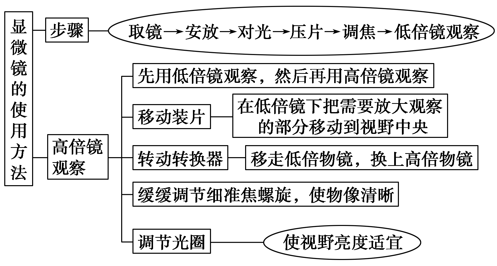

# 高中生物

# 走进细胞

## 生命系统结构层次

细胞：最基本的生命系统，是生物体结构和功能的基本单位

组织：形态相似，功能相同的细胞联合在一起构成的细胞群

器官：不同的组织按照一定次序结合在一起构成的，能行使一定功能的结构单位

系统：能够共同完成一种或几种生理功能的多个器官按照一定次序组合在一起形成的整体

个体：由各器官或系统协调配合共同完成复杂生命活动的生物体。单细胞生物由一个细胞构成

种群：在一定自然区域内，同种生物所有个体，是生物繁殖/进化的基本单位

群落：同一时间内聚集在同一区域中各种生物的集合

生态系统：生物群落与它的无机环境相互作用而形成的统一整体

生物圈：地球上全部生物及其无机环境共同组成，是最大的生态系统

特例：

* 植物没有系统这一层次
* 单细胞生物既可以看做个体/细胞层次，没有组织、器官、系统这三层次
* 病毒没有细胞结构，不能独立生存，不属于生命系统，但其生命活动依赖生命系统且属于生物
* 细胞是最小的结构层次

生物分类：

* 单细胞生物：变形虫

* 多细胞生物

* 非细胞生物：病毒

> 血液：结缔组织
>
> 皮肤：最大器官
>
> 胃粘膜：组织
>
> 神经元：细胞

> 一个池塘所有鱼类：不是同种生物个体总和，也不是所有生物集合。除非是一个池塘所有鲤鱼：种群

> 开花植物六大器官：根茎叶花果实种子

## 细胞

### 原核细胞和真核细胞

原核细胞：细胞壁、细胞膜、拟核、核糖体

真核细胞：细胞质、线粒体、内质网、高尔基体、核糖体、溶酶体、细胞膜、细胞核

* 植物细胞：细胞壁、液泡、叶绿体（中心体：某些低等植物有，高等植物没有）

* 动物细胞：中心体

亚显微结构：通过电子显微镜才能看到

光学显微镜能看见的：细胞壁、液泡，叶绿体，线粒体（健那绿染色），细胞核（甲基绿染色）

#### 原核细胞和真核细胞的对比

|                                  | 原核细胞                                                   | 真核细胞                                   |
| -------------------------------- | ---------------------------------------------------------- | ------------------------------------------ |
| 本质区别：有以核膜为界的细胞核？ | ×，无核膜和核仁，DNA不与蛋白质结合，遗传物质分布区域为拟核 | √，有核膜和核仁，DNA与蛋白质结合成染色体   |
| 细胞壁                           | 多数有，主要成分是糖类和蛋白质（肽聚糖）                   | 植物细胞和真菌有；动物细胞无               |
| 细胞器                           | 只有核糖体                                                 | 有核糖体等多种细胞器                       |
| 可遗传变异类型                   | 基因突变                                                   | 基因突变、基因重组、染色体变异             |
| 生殖方式                         | 分裂生殖                                                   | 无性生殖、有性生殖                         |
| 转录与翻译                       | 同一时间、地点进行                                         | 先细胞核内转录，然后细胞质（核糖体）内翻译 |

相同：

* 化学组成相似

* 结构上都有细胞核，细胞质，核糖体
* 都以DNA为遗传物质，遗传密码通用
* 都以ATP作为直接能源物质

> 原核生物的遗传不符合孟德尔遗传规律；真核生物在有性生殖过程中，核基因的遗传符合孟德尔遗传规律。
>
> 原核细胞如细菌主要以二分裂的方式进行分裂；真核细胞的分裂方式有有丝分裂、无丝分裂、减数分裂。

### 细胞的多样性和统一性

统一性

* 基本结构：真、原核细胞都有细胞膜和细胞质，都含有与遗传有关的DNA分子
* 化学组成：不同细胞具有基本相同的元素组成和化合物种类
* 细胞来源：同一个生物个体的不同细胞一般都最终来自同一个细胞（如受精卵）的分裂

#### 以细胞多样性和统一性为基础的生物分类系统

非细胞结构生物
* 类病毒：仅由RNA分子组成

* 朊病毒：由蛋白质组成，如疯牛病病原体

* 由蛋白质和核酸（DNA或RNA）组成的病毒

  * DNA病毒：噬菌体，天花病毒，花椰菜花叶病毒
  
  * RNA病毒：HIV, SARS, 烟草花叶病毒，狂犬病病毒

细胞结构生物

* 原核生物（记忆：放一支细篮子）
  * 放线菌、衣原体、支原体、立克次氏体
  * 细菌：球菌、杆菌、螺旋菌等。
  * 乳酸菌，固氮菌
  * 蓝藻/蓝细菌：色球藻，念珠藻、颤藻、发菜等
* 真核生物
  * 真菌：酵母菌、青霉菌、蘑菇等
  * 植物
  * 动物

常见原核生物和真核生物的判断：

* 菌类的判断：菌字前面有“杆”、“球”、“螺旋”、“弧”的都是细菌，为原核生物；酵母菌、霉菌、食用菌是真核生物

* 藻类的判断：蓝藻是原核生物，其他都是真核生物（绿藻，红藻，褐藻，衣藻，小球藻都是低等植物，不是蓝藻）

> **病毒无生物膜系统，不能独立生活，病毒不能直接用培养基培养，代谢和繁殖过程只能在宿主的活细胞中进行**
>
> 病毒侵染宿主细胞时，一般是将核酸注入宿主细胞，蛋白质留在细胞外（新冠病毒不是，蛋白质也进入）

> 遗传物质：只有RNA病毒为RNA，其他生物都是DNA
>
> 原生生物：单细胞真核生物。衣藻、酵母菌、草履虫、变形虫，疟原虫

# 组成细胞的分子

## 细胞中的元素和化合物

### 细胞中元素的种类与含量

组成细胞的化学元素有20多种，按含量可分为大量元素和微量元素：

* 大量元素：C H O N P S K Ca Mg（记法：她请杨丹留人盖美家）
* 微量元素：Fe Mn B Zn Cu Mo（记法：铁猛碰新木桶/特臂童木最猛）

微量元素含量虽少，但是作用不可替代。

组成细胞元素的作用：

* 组成化合物
* 影响生命活动

> B 促进花粉萌发和花粉管伸长。缺乏：只开花不结果
>
>  Ca：哺乳动物缺乏会抽搐

按作用大小：

* 最基本元素（**碳链是有机物的基本骨架**）：C
* 基本元素：C H O N 
* 主要元素：C H O N P(细胞膜磷脂) S(蛋白质特征元素)

细胞的组成元素中：

* 原子个数最多的元素是H；
* 细胞鲜重中含量最多的元素是O，其次是C,H,N；
* 细胞干重中含量最多的元素是C，其次是O,N,H

生物界与非生物界的：

* 统一性：组成细胞的化学元素在无机自然界都能找到

* 差异性：组成生物体的化学元素在生物体内和自然界中的相对含量相差很大

糖类/脂肪/固醇：C H O（几丁质含CHON）

氨基酸：C H O N S

脂质/核酸：C H O (N P)（磷脂含CHONP）

### 组成细胞的化合物

* 无机物
  * 水 85%~90%
  * 无机盐
* 有机物
  * 糖类 
  * 核酸
  * 蛋白质 7%~10%
  * 脂质

## 生命活动的主要承担者——蛋白质

蛋白质分为：

* 胞内蛋白
* 胞外蛋白/分泌蛋白：抗体，激素，大部分分泌到细胞外的酶

| 蛋白质的功能 | 功能                                                         | 举例                                       |
| ------------ | ------------------------------------------------------------ | ------------------------------------------ |
| 结构蛋白     | 构成细胞核生物体结构的重要物质，比如细胞膜上的固着蛋白，组成核糖体、中心体、染色体的蛋白质。 | 肌肉，毛发，羽毛，蛛丝等                   |
| 功能蛋白     | 调节：调节细胞代谢和生物体的生命活动。                       | 胰岛素、生长激素等                         |
|              | 催化：催化细胞中各种化学反应的顺利进行                       | 绝大多数的酶                               |
|              | 运输                                                         | 细胞膜上的蛋白质载体、红细胞中的血红蛋白等 |
|              | 免疫：能清除侵入体内的抗原物质                               | 抗体                                       |
|              | 识别                                                         | 糖蛋白                                     |

功能和场所：

* 合成蛋白质：核糖体
* 加工蛋白质：内质网，高尔基体
* 参与蛋白质合成：核糖体，内质网，高尔基体，线粒体

蛋白质变性实质：破坏了空间结构

蛋白质变性因素：过酸，过碱，重金属盐，温度过高，紫外线等

* 高温煮鸡蛋：蛋清凝固
* 重金属中毒：喝鸡蛋清
* 酸碱使牛奶沉淀

## 氨基酸

### 结构通式

R基：决定氨基酸种类和性质

**判断构成蛋白质的氨基酸分子**：至少1个氨基，1个羧基，1个H连在同一个碳上

### 氨基酸的种类

组成蛋白质的氨基酸约有21种，包括必须氨基酸和非必须氨基酸。

* 必须氨基酸，8种：人体不能合成，必须从外界/食物直接获取。包括赖氨酸、色氨酸、苯丙氨酸、亮氨酸、异亮氨酸、苏氨酸、甲硫氨酸和缬（xié）氨酸。婴儿比成人多一种组氨酸。

* 非必须氨基酸：人体内能合成，**可以通过其他化合物转化而来**

必须氨基酸中：色氨酸分子量最大；甘氨酸最小

氨基酸是蛋白质单体；对应61种密码子

### 氨基酸脱水缩合形成肽链

新版教材：C-N之间连线叫肽键

脱水缩合：一个氨基酸的羧基（suō）（-COOH）和另一个氨基酸的氨基（-$NH_2$）相连接，同时脱去一分子水，脱下的水中，O来自-COOH,H来自-COOH和-$NH_2$,形成的化学键叫做肽键。肽键可以表示为-CO-NH-或-NH-CO-。

两个氨基酸分子脱水缩合形成的化合物叫二肽，多个氨基酸分子脱水缩合形成的含有多个肽键的化合物叫多肽，多肽一般呈链状结构，叫肽链。

> 多肽命名：根据氨基酸数，而不是肽键数

蛋白质形成：一条或多条肽链经盘曲、折叠形成具有一定空间结构，行使一定功能的蛋白质

蛋白质的结构层次：

* C、H、O、N等元素组成氨基酸
* 脱水缩合成肽链
* 盘曲折叠成蛋白质

蛋白质结构多样性的原因：

* 氨基酸种类、数目、排列顺序、盘曲折叠方式及形成的空间结构不同
* 肽链的盘区折叠方式及其空间结构千差万别

A,B个体差异：

* 直接原因：蛋白质不同（蛋白质是生命结构的体现者）
* 根本原因：DNA不同

### 氨基酸形成多肽中的相关计算（直链肽）

#### 多肽种类的计算——排列组合法

假若有A、B、C三种氨基酸：

* 在每种氨基酸数目无限的情况下，可形成肽类化合物的种类：

  三肽：$3^3=27$种

  二肽：$3^2=9$种

* 在每种氨基酸只有一个的情况下，可形成肽类化合物的种类：

  三肽：$3×2×1=6$种

  二肽：$3×2=6$种

#### 关系式

肽键数=脱去水分子数=氨基酸数-肽链数

> 环肽链：肽键数=脱去水分子数=氨基酸数

氨基数目=肽链数+R基上的氨基数

羧基数目=肽链数+R基上的羧基数

>  1条肽链至少一个氨基一个羧基

| 肽链数目 | 氨基酸数 | 氨基酸平均分子质量 | 肽链数目 | 多肽链分子量 | 氨基数目 | 羧基数目 |
| -------- | -------- | ------------------ | -------- | ------------ | -------- | -------- |
| 1条      | m        | a                  | m-1      | am-18(m-1)   | 至少1个  | 至少1个  |
| n条      | m        | a                  | m-n      | am-18(m-n)   | 至少n个  | 至少n个  |

#### 蛋白质中游离氨基或羧基数的计算

* 至少含有的游离氨基或羧基数=肽链数
* 游离氨基或羧基数=肽链数+R基中的氨基或羧基数

#### 蛋白质中含有N、O原子数的计算

N原子数=肽键数+肽链数+R基上的N原子数=各氨基酸中N原子总数

O原子数=肽键数+2×肽链数+R基上的O原子数=各氨基酸中O原子总数-脱去水分子数

蛋白质（多肽）相对分子质量=氨基酸平均相对分子质量×氨基酸个数-水的相对分子质量18×脱水数-二硫键个数×2

生成该蛋白质时相对分子质量减少了=水的相对分子质量18×脱水数+二硫键个数×2

> 至少几个氨基酸残基含硫：看二硫键连接点个数

## 遗传信息的携带者——核酸

### 基本组成单位——核苷酸

核酸种类：脱氧核苷酸，核糖核苷酸

结构：

* 磷酸
* 含氮碱基
* 五碳糖：脱氧核糖，核糖

> 题中不确定是脱氧核糖：填五碳糖

**核酸的功能**：

1. 细胞内携带遗传信息的物质
2. 在生物体的遗传、变异和蛋白质的生物合成物中具有极其重要的作用。

DNA分子中一条链上的磷酸和核糖通过磷酸二酯键连接

### DNA和RNA的比较

|          | DNA（脱氧核糖核酸）                                  | RNA（核糖核酸）                                              |
| -------- | ---------------------------------------------------- | ------------------------------------------------------------ |
| 五碳糖   | 脱氧核糖                                             | 核糖                                                         |
| 碱基     | A（腺嘌呤）、G（鸟嘌呤）、C（胞嘧啶）、T（胸腺嘧啶） | A（腺嘌呤）、G（鸟嘌呤）、C（胞嘧啶）、U（尿嘧啶）           |
| 基本单位 | 脱氧核苷酸（4种）                                    | 核糖核苷酸（4种）                                            |
| 结构     | 规则的双螺旋结构                                     | 常呈单链结构                                                 |
| 分布     | 主要在细胞核                                         | 主要在细胞质                                                 |
| 染色     | 甲基绿→绿色                                          | 吡罗红→红色                                                  |
| 功能     | 携带遗传信息，控制性状                               | 作为有些病毒的遗传物质；作为酶具有催化功能；合成蛋白质：mRNA传递遗传信息，tRNA运输氨基酸，rRNA组成核糖体 |

> 除RNA病毒外，DNA RNA都有时，DNA为遗传物质
>
> 解旋酶：作用氢键；DNA聚合酶，连接酶都是作用磷酸二酯键

> 碱基：5种
>
> 核苷酸：4+4=8种
>
> DNA初步水解：4种脱氧核糖核苷酸；彻底水解：脱氧核糖，4种含氮碱基，磷酸
>
> RNA初步水解：4种核糖核苷酸；彻底水解：核糖，4种含氮碱基，磷酸
>
> DNA+RNA初步水解：8种；彻底：8种

连接磷酸基团和五碳糖的化学键**不是氢键**

| 生物类别    | 核酸     | 遗传物质 | 核苷酸种类 | 碱基种类 |
| ----------- | -------- | -------- | ---------- | -------- |
| 真核和原核  | DNA和RNA | DNA      | 8          | 5        |
| 非细胞-病毒 | 只有DNA  | DNA      | 4          | 4        |
|             | 只有RNA  | RNA      | 4          | 4        |

| 基本单位 | 生物大分子 |
| -------- | ---------- |
| 葡萄糖   | 多糖       |
| 氨基酸   | 蛋白质     |
| 核苷酸   | 核酸       |

**脂肪不是生物大分子，是脂肪酸+甘油集合而成**

> 储存遗传信息的大分子不一定是DNA，RNA也有可能

### 核酸分子的多样性和特异性

多样性：构成DNA分子的脱氧核苷酸虽然只有4种，成千上万个排列顺序极其多样

特异性：每个DNA分子的4种脱氧核苷酸的比例和排列顺序是特定的。特定的排列顺序代表了特定的遗传信息。

### 核酸与蛋白质的比较

|              | 核酸                     | 蛋白质               |
| ------------ | ------------------------ | -------------------- |
| 元素组成     | C H O N P                | C H O N              |
| 基本单位     | 核苷酸                   | 氨基酸               |
| 连接方式     | 磷酸二酯键               | 肽键                 |
| 形成场所     | 细胞核、线粒体、叶绿体等 | 核糖体               |
| 初步水解产物 | 核苷酸                   | 多肽                 |
| 彻底水解产物 | 磷酸、五碳糖、碱基       | 氨基酸               |
| 代谢产物     | $CO_2$ ,$H_2O$, 含氮废物 | $CO_2$ ,$H_2O$, 尿素 |

联系：核酸通过转录和翻译控制蛋白质的合成

## 糖类

### 糖类

糖类的功能：

* 生物体维持生命活动的主要能量来源
* 细胞结构的组成成分
* 参与生命多种活动

#### 按水解后产生单糖的多少分类

单糖：不能水解的糖，动植物细胞中都有

二糖：两分子脱水缩合形成。水解后产生两分子单糖的糖

多糖：水解后生成多个单糖的糖

|      | 子分类 | 三级分类               | 分布                                                         | 功能                       |
| ---- | ------ | ---------------------- | ------------------------------------------------------------ | -------------------------- |
| 单糖 | 五碳糖 | 核糖$C_5H_{10}O_5$     | 各种细胞中                                                   | RNA的组成成分              |
|      |        | 脱氧核糖$C_5H_{10}O_4$ | 各种细胞中                                                   | DNA的组成成分              |
|      | 六碳糖 | 葡萄糖                 | 动植物细胞中都有分布                                         | 细胞生命活动的主要能源物质 |
|      |        | 果糖                   | 一般在水果中                                                 | 植物细胞中特有的单糖       |
|      |        | 半乳糖                 | 动物乳汁，芹菜中也有                                         |                            |
| 二糖 |        | 乳糖（半乳糖和葡萄糖） | 动物的乳汁中                                                 | 供能                       |
|      |        | 麦芽糖（葡萄糖*2）     | 植物细胞中，发芽的谷粒中含量较多                             | 供能                       |
|      |        | 蔗糖（果糖和葡萄糖）   | 植物细胞中，在甜菜、甘蔗等植物中含量较多                     | 供能                       |
| 多糖 |        | 淀粉                   | 植物的贮藏器官中                                             | 植物细胞中的储能物质       |
|      |        | 纤维素                 | 植物细胞壁中                                                 | 植物细胞壁的主要组成成分   |
|      |        | 糖原                   | 肝糖原：**在动物肝脏中，储能，调节血糖平衡** 肌糖原：动物肌肉组织中，**储存和提供能量** |                            |

葡萄糖：主要能源物质

纤维素也叫第七营养素，虽然不能提供能量，但是能促进肠道蠕动，吸附排除有害物质。食草动物可依赖消化道中的共生微生物分解纤维素，从而得以吸收利用	

动物细胞特有糖类：糖原、乳糖

植物细胞特有糖类：蔗糖、淀粉、麦芽糖、纤维素

> 淀粉：不易溶于水
>
> 纤维素：不溶于水，不储能

动植物细胞都有糖类：核糖、脱氧核糖、葡萄糖

构成淀粉，糖原，纤维素的单糖都是葡萄糖

#### 按还原性有无分类

还原糖：+斐林试剂**水浴加热**生成砖红色沉淀。有葡萄糖、果糖、半乳糖、乳糖、麦芽糖等。

非还原糖：不能与斐林试剂反应。有蔗糖、淀粉、纤维素等。

### 细胞中的脂质

|      | 作用                                                         | 分布                             |
| ---- | ------------------------------------------------------------ | -------------------------------- |
| 脂肪 | 主要的储能物质；皮下脂肪层起到保温作用；内脏器官周围的脂肪具有缓冲和减压作用，保护内脏器官 | 植物种子、果实、动物的脂肪组织中 |
| 磷脂 | 构成细胞膜及多种细胞器膜的重要成分                           | 动物脑、卵细胞、肝脏及大豆种子中 |
| 固醇 | 胆固醇：构成动物细胞膜的重要成分，在人体内参与血液中的脂质运输 |                                  |
|      | 性激素：促进人和动物生殖器官的发育及生殖细胞的形成           |                                  |
|      | 维生素D：促进人和动物肠道对钙和磷的吸收（缺乏：佝偻病，小儿抽搐） |                                  |

脂肪与糖类相比，脂肪分子中C H原子多，O原子少，等量的两种物质氧化分解时，脂肪消耗氧气更多，释放能量更多

> 所有细胞中都有脂质

> 抗体不属于脂质，是蛋白质

### 糖类和脂质的比较

|          | 糖类                                             | 脂质             |
| -------- | ------------------------------------------------ | ---------------- |
| 元素     | C H O                                            | C H O (N P)      |
| 种类     | 单糖、二糖、多糖                                 | 脂肪、磷脂、固醇 |
| 合成部位 | 淀粉——叶绿体；纤维素——高尔基体；糖原——肝脏、肌肉 | 内质网           |

### 细胞中的能源物质

能源物质：糖类、脂肪、蛋白质都是有机化合物。当其被氧化分解时，贮存的化学能就释放出来，供生命活动利用。

主要能源物质：糖类，分解供能约占总能量70%以上。

储能物质：多糖/脂肪/糖原

直接能源物质：ATP。生命活动所需能量由ATP水解提供，贮能物质所含能量只有转移到ATP中才能用于各项生命活动。

三大能源物质的功能顺序：先是糖类氧化供能，当糖类供能不足时，依次由脂肪、蛋白质供能；蛋白质除了在正常代谢中提供部分能量外，一般不提供。当需要由蛋白质大量供能时，说明生物体已病重或生命接近终结。

根本能源：太阳能

### 生物大分子以肽链为骨架

生物大分子是多聚体，由单体（基本单位）脱水缩聚而成

| 单体（基本单位） | 多聚体（生物大分子） |
| ---------------- | -------------------- |
| 葡萄糖           | 多糖                 |
| 氨基酸           | 蛋白质               |
| 核苷酸           | 核酸                 |

每一个单体都以若干个相连的碳原子构成的碳链为基本骨架，由许多单体连成多聚体。

## 鉴定

|      | 还原糖                                            | 蛋白质                                                       | 脂肪                                                         |
| ---- | ------------------------------------------------- | ------------------------------------------------------------ | ------------------------------------------------------------ |
| 试剂 | 斐林试剂                                          | 双缩脲                                                       | 苏丹III，苏丹IV                                              |
| 选材 | 白色/接近白色的植物组织                           | 鸡蛋清稀释液、黄豆酱滤液、牛奶\鲜肝研磨液富含蛋白质          | 浅色/接近白色的植物种子，如花生种子                          |
| 溶液 | 直接用0.1g/mL氢氧化钠和0.05g/mL硫酸铜混合混合溶液 | 0.1g/mL NaOH溶液，0.01g/mL硫酸铜溶液                         |                                                              |
| 过程 | 先混合，氢氧化钠提供碱性环境，呈蓝色，后水浴加热  | 过程：先加NaOH 1mL，摇匀，再加硫酸铜4滴，摇匀                | 取材：花生种子去种皮，将紫叶削成最薄薄片； 制片：薄片染色，50%酒精去浮色，制成装片； 观察 |
| 原理 | 呈砖红色沉淀                                      | 蛋白质+双缩脲试剂→紫色（碱性环境铜离子与蛋白质肽键形成紫色络合物） | 苏丹III：橘黄色；苏丹IV：红色                                |

**双缩脲试剂不能鉴别氨基酸**

**双缩脲试剂+二肽不能产生紫色**：二肽只有1个肽键，双缩脲2个，不反应

**碘液检测淀粉：紫色**

斐林试剂：需现配现用（班氏/本尼迪试剂不需要）

$NaOH+CuSO_4→Cu(OH)_2↓+还原糖\xrightarrow{沸水浴}Cu_2O$

没双缩脲试剂可以斐林试剂+水稀释

## 细胞中的无机物

### 细胞中的水

构成细胞的化合物中水的含量最多，一般生物体含水量60%-95%

| 存在形式 | 自由水                                                       | 结合水                             |
| -------- | ------------------------------------------------------------ | ---------------------------------- |
| 定义     | 游离态形式存在，可以自由流动                                 | 与细胞中其他物质结合，不能自由流动 |
| 含量     | 细胞全部水分的95.5%                                          | 细胞全部水分的4.5%                 |
| 作用     | 细胞中良好的溶剂；为细胞提供液体环境；参与细胞内多种生化反应；运输营养物质和废物 | 细胞构成成分                       |

自由水和结合水的关系：

* 随新陈代谢相互转化；结合水温度升高→自由水；自由水温度降低→结合水
* 自由水/结合水：比值越大，代谢越强，生长越快，但抗逆性弱；反之，代谢较慢，生长较慢，但抗逆性强

> 细胞鲜重中含量最多的化合物是水，细胞干重中含量最多的化合物是蛋白质
>

>
> ①种子成熟过程中结合水/自由水的比值变大，萌发过程中结合水/自由水的比值变小。
>
> ②心脏、血液与肌肉细胞呈现不同状态主要是因为结合水含量不同，例如心脏呈固态而血液呈液态，原因是心脏中的中结合水较多。

> 晒种子：损失自由水
>
> 烘干种子：损失自由水和结合水，种子无法再种

### 细胞中的无机盐

含量：细胞鲜重的1%-1.5%

存在形式：多数以离子形式，少数与化合物结合

生理功能：

* 复杂化合物的重要组成部分。如$Mg^{2+}$是叶绿素的重要组成成分；$Fe^{2+}$是血红蛋白的重要组成成分
* 维持生命活动
* 维持细胞的渗透压
* 维持细胞酸碱平衡。如血浆中$NaHCO_3$含量减少会造成酸中毒，$H_2CO_3$含量减少会造成碱中毒

### 常见元素功能及缺乏症

| 元素 | 功能                                             | 缺乏症                                                       |
| ---- | ------------------------------------------------ | ------------------------------------------------------------ |
| I    | 甲状腺激素的组成成分                             | 甲状腺肿或呆小症                                             |
| Fe   | 血红蛋白组成成分                                 | 缺铁性贫血                                                   |
| Ca   | 降低神经系统的兴奋性                             | 血钙过低时，会出现抽搐现象；太高：肌无力                     |
| K    | 维持细胞内液渗透压的稳定 影响神经系统兴奋性 | $K^+$含量异常，导致心律失常                                  |
| Na   | 维持细胞外液渗透压的稳定 影响神经系统兴奋性 | 含量低，导致渗透压下降，血压下降，心率加快和四肢发冷，肌肉酸痛、无力等 |
| Mg   | 组成叶绿素元素之一                               | 无法进行光合作用                                             |

> 牙齿主要成分不是碳酸钙，是羟基磷酸钙

# 细胞的基本结构

细胞是生物体结构和功能的基本单位。

病毒：是寄生生物，没有细胞结构，但是仍然以细胞作为自身结构和功能的基本单位。

细胞质是活细胞新陈代谢的场所

细胞骨架：蛋白质纤维组成的网架结构。与细胞运动，分裂分化，物质运输，能量转化，信息传递等生命活动相关

## 细胞膜——系统的边界

### 细胞膜的成分和结构

> 为什么分离哺乳动物红细胞：成熟红细胞没细胞核，细胞器

|        | 细胞膜总量的比例：% | 组成或功能                                                   |
| ------ | ------------------- | ------------------------------------------------------------ |
| 脂质   | 50                  | 磷脂和胆固醇，磷脂含量最丰富，大多为卵磷脂和脑磷脂           |
| 蛋白质 | 40                  | 细胞膜的功能主要由蛋白质承担。功能越复杂的细胞膜，蛋白质种类和数量越多 |
| 糖类   | 2-10                | **细胞膜外表面**的一些糖类与蛋白质结合形成糖蛋白，具有保护、润滑和识别的作用；还有糖类与脂质结合成的糖脂 |

> 流动镶嵌模型：桑格和尼克森提出
>
> 蛋白质-脂质-蛋白质3层假说：罗伯特森

结构：流动镶嵌模型

* 磷脂双分子层：构成膜的基本骨架
* 蛋白质：镶嵌在磷脂双分子层，与膜功能相关。蛋白质越多，功能越多
* 糖蛋白：与细胞识别有关

**不对称性：外层有糖蛋白，内层没有**

**磷脂和大部分蛋白质都可以流动**

### 细胞膜的功能

* 将细胞核外接环境分隔，保证细胞内部环境相对稳定

* （主要由蛋白质）控制物质进出细胞

* （由细胞膜上的糖蛋白进行）细胞间的信息交流。也能交换物质

| 细胞间信息交流方式                                           |                                  |
| ------------------------------------------------------------ | -------------------------------- |
| 1.内分泌细胞产生激素通过血液运输到靶细胞 2.精卵细胞：发出信号的细胞与膜结合的信号分子与靶细胞交流 | 受体与信号分子结合，从而接受信息 |
| 3.高等植物细胞胞间连丝                                       |                                  |

细胞膜的结构特点是流动性，功能特性是选择透过性。

> **只有活细胞有选择透过性**：染色法，能被红墨水染色的细胞是死的

细胞膜流动性的实例：

* 白细胞吞噬病菌
* 变形虫的变形运动
* 细胞融合

### 细胞壁

主要成分：

* 植物：纤维素和果胶，可用纤维素酶和果胶酶去壁

* 真菌：主要是几丁质，可用几丁质酶去壁
* 细菌：主要是肽聚糖。抗生素：阻止肽聚糖合成。对植物没有作用

> 噬菌体外壳的合成场所：细菌的核糖体（噬菌体寄生大肠杆菌）

主要功能：细胞壁具有较坚韧的支撑性，对细胞起支架作用，维持细胞正常形态，保护内部结构

特性：细胞膜具有选择透过性；细胞壁具有全透性

#### 质壁分离

渗透系统：水的自由扩散

* 半透膜
* 浓度差

质壁分离：原生质层和细胞壁分离。中间充满了**外界溶液**。

从质壁分离复原：30%蔗糖，需要加水复原；**硝酸钾，氯化钠自动复原**

条件：植物，有中央大液泡，活细胞

应用：

1. 判断细胞死活
2. 估计细胞液浓度

实验：

* 选用有大液泡且液泡最好带有颜色

* 0.3g/mL的蔗糖溶液（盐酸，酒精，醋酸等溶液会杀死细胞）

> 8%的食盐溶液，5%的硝酸钾溶液，甘油，尿素，乙二醇也可以，但是质壁分离后会自动复原（细胞会吸收）

处于质壁分离状态时，细胞可能正在失水，正在吸水或最大失水状态

## 细胞器——系统内的分工合作

### 细胞器之间的分工

#### 线粒体

分布：多数真核生物的活细胞中

形态：多种多样，棒状，球状，线形，哑铃形等

结构：外膜和内膜构成的双层膜结构，内膜内折形成嵴，增大了酶的附着面积，基质中含有多种呼吸酶

功能：有氧呼吸的主要场所。细胞生命活动所需能量的95%的来自线粒体，是细胞的动力车间

> ①线粒体内的DNA不与蛋白质结合形成染色体。
>
> ②进行有氧呼吸的细胞不一定要有线粒体，例如进行有氧呼吸的细菌：硝化细菌、大肠杆菌

#### 叶绿体

分布：进行光合作用的细胞中

形态：一般为扁平的椭球形或球形

结构：双层膜结构，含有基粒和基质，基质中也含有与光合作用有关的酶

功能：光合作用的场所

> ①叶绿体内的 DNA 不与蛋白质结合形成染色体。
>
> ②进行光合作用的细胞不一定有叶绿体，例如蓝藻属于原核生物，能进行光合作用，但没有叶绿体。

#### 高尔基体

分布：动植物细胞中

结构：一些扁平膜囊堆叠而成的单层膜结构

功能：

* 对来自内质网的蛋白质进行加工、分类与包装
* 与动物细胞中分泌物的形成有关
* 与植物细胞分裂时细胞壁的形成有关

#### 内质网

分布：绝大多数动植物细胞中，外连细胞膜，内接核膜

形态：单层膜构成的囊状、泡状或管状

分类：

* 有核糖体附着：粗面内质网
* 无核糖体附着：光面内质网

功能：

* 单层膜结构不断折叠：增大细胞内的膜面积，膜上附着多种酶，为细胞内各种化学反应的正常进行提供了有利条件
* 粗面内质网：蛋白质的合成和运输
* 光面内质网：脂质的合成

#### 溶酶体

结构：单层膜结构，膜内含有多种水解酶

分布：动植物细胞中

功能：分解衰老、损伤的细胞器，吞噬杀死入侵的病毒或病菌

#### 液泡

分布：主要存在植物细胞中

结构：单层膜结构，膜内充满细胞液

功能：储存营养物质，维持渗透压；使植物细胞保持坚挺

>
> ①液泡内的色素有花青素，细胞液呈酸性则偏红；碱性则偏蓝，从而影响植物的花色。
>
> ②液泡内的色素与叶绿体色素成分和功能均不相同。

#### 核糖体

分布：原核细胞和真核细胞中

结构：无膜细胞器，主要成分是蛋白质和rDNA

功能：合成蛋白质的场所（附着在内质网或核外膜的核糖体，与分泌蛋白的合成有关；游离在细胞质基质中的核糖体，与胞内蛋白的合成有关）

#### 中心体

分布：动物细胞和某些低等植物细胞中

结构：无膜细胞器，由两个相互垂直的中心粒及周围物质组成

功能：在细胞有丝分裂时纺锤体的形成有关

### 细胞器的归类分析

**细胞核不是细胞器**

#### 分布

植物细胞特有：叶绿体，液泡

动物细胞和低等植物细胞特有：中心体

原核细胞与真核细胞共有：核糖体

有细胞壁：植物，细菌，大部分真菌

只有成熟植物细胞有液泡。

叶绿体只存在于植物的绿色部分。

线粒体：提供能量

#### 结构

不具膜（不含磷脂等于没有膜结构）：核糖体，中心体

具单层膜：内质网，液泡，高尔基体，溶酶体

具双层膜：线粒体，叶绿体（核膜不是细胞器，是有双层细胞结构）

> 细胞膜是磷脂双分子层的单层膜结构

#### 成分

（细胞核也含DNA，RNA，但不算细胞器）

含DNA：线粒体，叶绿体

含RNA：线粒体，叶绿体，核糖体

含色素：叶绿体，液泡

#### 功能

发生碱基互补配对：
* 线粒体、叶绿体（自身DNA复制、转录、翻译）
* 核糖体（翻译）

与细胞分裂有关：
* 核糖体（蛋白质合成）
* 中心体（形成纺锤体）
* 线粒体（提供能量）
* 高尔基体（和植物细胞壁形成有关）

代谢过程中产生水：
* 线粒体（有氧呼吸第三阶段）
* 叶绿体（光合作用暗反应阶段）
* 核糖体（氨基酸脱水缩合）
* 高尔基体（植物细胞内合成多种多糖）

半自主细胞器：线粒体，叶绿体（内有核糖体，能合成蛋白质）

| 细胞或其他\细胞结构 | 叶绿体 | 液泡 | 线粒体 | 内质网 | 高尔基体 | 核糖体 | 中心体    | 溶酶体 | 细胞核 |
| ------------------- | ------ | ---- | ------ | ------ | -------- | ------ | --------- | ------ | ------ |
| 原核细胞            |        |      |        |        |          | √      |           |        | ×      |
| 植物细胞            | √      | √    | √      | √      | √        | √      | 低等植物√ | √      | √      |
| 动物细胞            |        |      | √      | √      | √        | √      | √         | √      | √      |
| 光学显微镜可见      | √      | √    | √      |        |          |        |           |        | √      |

### 细胞器之间协调配合

研究过程：放射性同位素标记法

#### 分泌蛋白的形成与分泌过程

多肽在核糖体上合成，空间结构在内质网上形成，成熟蛋白质在高尔基中形成

运输方向：核糖体→内质网→高尔基体→细胞膜

方向：

1. 核糖体中：氨基酸脱水缩合形成肽链
2. 内质网：加工肽链，以囊泡形式将蛋白质运送到高尔基体
3. 高尔基体：囊泡与高尔基体膜融合。高尔基体加工修饰蛋白质，用囊泡运走蛋白质
4. 囊泡与细胞膜融合，将蛋白质分泌到细胞外

线粒体功能：分泌蛋白经过细胞膜的运输方式为胞吐，需要消耗能量

分泌过程中，内质网以囊泡形式将蛋白质运送到高尔基体，囊泡与高尔基体融合导致高尔基体膜面积增加，高尔基体以囊泡形式将蛋白质送到细胞膜，膜面积减小。分泌前后，**膜面积**减小的是内质网，基本不变的是高尔基体，增大的是细胞器。

#### 胞内蛋白合成路径

线粒体，叶绿体，细胞核需要的蛋白质是胞内蛋白合成路径

直接在细胞质基质中盘曲折叠，通过游离核糖体运输

### 细胞的生物膜系统

概念：细胞中，各种细胞器膜和细胞膜、核膜等结构共同构成生物膜系统

高尔基体膜与内质网膜之间、高尔基体膜与细胞膜之间通过囊泡相互转化；

内质网膜与外层核膜、细胞膜之间可间接连接

功能：

* 边界：细胞膜使细胞具有相对稳定的内部环境；细胞与外部环境进行物质运输、能量转化和信息传递
* 提供了多种酶的附着位点：许多重要化学反应都在生物膜上进行，化学反应需要酶的参与，广阔的膜面积为多种酶提供了大量的附着位点
* 细胞内的生物膜把各种细胞器分隔开，使得细胞内能够同时进行多种化学反应，不会相互干扰，保证了细胞生命活动高效有序进行

生物膜结构特性：流动性

生物膜功能特性：选择透过性

生物膜系统：真核生物才有

## 细胞核——系统控制中心

### 细胞核的功能

功能：

* 细胞核是遗传信息库。DNA储存和复制的主要场所。DNA携带遗传信息，通过复制由亲代传给子代，保证了遗传的连续性
* 细胞核是细胞代谢和遗传的控制中心。控制物质合成、能量转化和信息交流，使生物体能进行正常的细胞代谢。DNA通过控制蛋白质的合成，进而控制生物的性状

结构：

1. 核膜：双层膜，把核内物质和细胞质分开，外膜上附着有许多核糖体，常与内质网相连。核膜是选择透过性膜，能够控制一些小分子和离子进出细胞核

2. 核孔：具有选择性，是大分子物质进出细胞核的通道，实现核质之间的物质交换和信息交流。核孔数量和细胞代谢有关，代谢旺盛、蛋白质合成量大的细胞中，核孔数量较多

3. 核仁：细胞周期中呈周期性变化，与某种RNA合成以及核糖体的形成有关。核仁大小和细胞代谢有关，细胞旺盛、蛋白质合成量大的细胞中，核仁较大

4. 染色质：DNA和蛋白质组成。染色质和染色体是不同时期的同种物质（易被碱性燃料染成深色）

   

### 细胞是一个统一的整体

1. 结构上：细胞核与细胞质通过核孔相通；核膜、内质网膜、细胞膜相互连接成完整的生物膜系统
2. 功能上：细胞各部分互相联系，分工合作，协调一致地完成各项生命活动
3. 调控上：细胞核是遗传特性和代谢活动的控制中心，但细胞核所需营养物质及能量来自细胞质，细胞正常的生长发育要依靠细胞核和细胞质的相互作用
4. 与外界联系：细胞不断地与外界进行物质交换和能量交换，与外界环境形成统一的整体

# 细胞的物质输入和输出

## 物质跨膜运输的实例

### 渗透作用

概念：水分子或其他溶剂分子通过半透膜从低浓度向高浓度溶液的扩散被称为渗透作用。完整的渗透系统由两个溶液体系以及两者中间的半透膜组成

发生渗透作用的条件：

* 具有半透膜（生物膜或物理性的过滤膜）
  * 动物细胞：细胞膜
  * 植物细胞：原生质层

* 半透膜两侧的溶液具有浓度差

注意事项：

* 渗透平衡：来往半透膜的水量/分压相同。两侧水分子继续移动，**两侧溶液浓度不一定相等**
* 溶液浓度指物质的量浓度而非质量浓度。如10%的葡萄糖溶液和10%的蔗糖溶液质量浓度相同，但是10%的蔗糖溶液的物质的量浓度小，所以被半透膜隔开时，水分子由蔗糖溶液一侧向葡萄糖溶液一侧移动。
* 溶液浓度高，单位体积溶液中的溶质微粒多，水分子浓度低；溶液浓度低，单位体积溶液中溶质微粒少，水分子浓度高，故**渗透作用中，水由低浓度流向高浓度溶液**，与自由扩散中，水从高浓度一侧运输到低浓度一侧并不矛盾

### 细胞的吸水与失水

细胞液/质浓度和外界溶液浓度关系：

* ＜：细胞失水，质壁分离。细胞皱缩
* ＞：细胞吸水膨胀  
* ＝：细胞失水吸水平衡

细胞吸水和失水原理的应用：

* 对农作物的合理灌溉
* 盐碱地中植物不易存活或一次性施肥过多造成烧苗现象
* 糖渍或盐渍食品不易变质。它们都是浓度很高的溶液，微生物不能在其中生存和繁殖

## 生物膜的流动镶嵌模型

1. 生物膜主要有脂质和蛋白质组成
2. 脂质双分子层构成生物膜的基本支架，具有流动性
3. 蛋白质分子以覆盖、镶嵌、贯穿三种方式和磷脂双分子联系，大多数可以运动

## 物质跨膜运输的两种方式

### 被动运输和主动运输

| 物质出入细胞的方式 | 自由扩散（被动运输）                                         | 协助扩散（被动运输）                                         | 主动运输                                                     |
| ------------------ | ------------------------------------------------------------ | ------------------------------------------------------------ | ------------------------------------------------------------ |
| 运输方向           | 高浓度→低浓度                                                | 高浓度→低浓度                                                | 一般为低浓度→高浓度                                          |
| 需要载体           | ×                                                            | √。通道蛋白：形成贯穿膜的亲水性**通道**。对转运离子有高度选择性 | √。载体蛋白：特异性（一种载体蛋白只能运输一种物质），有饱和值。消耗能量 |
| 消耗能量           | ×                                                            | ×                                                            | √                                                            |
| 特异性             | 无                                                           | 有                                                           | 有                                                           |
| 影响因素           | 细胞膜内外物质的浓度差                                       | 细胞膜内外物质的浓度差；细胞膜上载体转运蛋白的种类和数量     | 细胞膜上载体的种类和数量；能量（温度，氧浓度）               |
| 举例               | $O_2、CO_2、H_2O、N_2$ ，甘油、乙醇、苯、尿素等出入细胞；固醇类激素 | 葡萄糖进入红细胞；大部分水通过水通道蛋白                     | 小肠吸收葡萄糖、氨基酸，钠钾钙离子等                         |

离子运输方式：

* 高到低浓度：协助扩散
* 低浓度高浓度：主动运输

主动运输意义：保证活细胞能主动选择吸收所需的营养物质，排出代谢废物和对细胞有害的物质

**协助扩散、主动运输因为需要转运蛋白，运输速度有上限**

葡萄糖分子进入所有真核细胞方式**可能不同**

### 影响物质跨膜运输的因素

#### 载体数量、物质浓度对物质跨膜运输的影响

自由扩散的速率与细胞内外物质浓度差成正比

协助扩散需要载体协助，但不消耗能量，动力来自细胞内外浓度差。浓度差↑，运输速率v↑，上限：载体饱和时

主动运输需要载体和消耗能量。限制主动运输的因素主要有两方面：内因是载体的数量，外因是氧气含量，温度，pH等影响呼吸作用强度的因素

#### 氧气浓度和呼吸作用对物质跨膜运输的影响

自由扩散和协助扩散不需要消耗能量，因此运输速率与氧气浓度和呼吸作用强度无关

有氧呼吸和无氧呼吸都可以为主动运输提供能量。因此，氧气浓度为0时，可以由无氧呼吸提供能量。

## 胞吞和胞吐

运输：大分子；颗粒性物质（如神经递质）

> 胞吞胞吐穿过0层膜，体现了细胞膜的流动性

大分子物质与膜上蛋白质结合 ，细胞膜

* 胞吞：内陷、分离成囊泡→大分子物质进入细胞内
* 胞吐：外凸、分离成囊泡→大分子物质排除体外

特点：不需要载体，需要消耗能量

实例：吞噬细胞吞噬抗原，分泌蛋白的释放

### 判断物质进出细胞方式

离子/小分子：（跨膜运输）

* 需要能量：主动运输
* 不需要：被动运输
  * 不需要载体：自由扩散
  * 需要载体：协助扩散

颗粒/大分子：胞吞/胞吐（囊泡运输）

# 细胞的能量供应和利用

## 酶

作用：（生物）催化作用

作用机理：降低化学反应活化能

来源：活细胞

作用场所：细胞内外或生物体外均可

| 酶的化学本质      | 绝大多数是蛋白质 | 少数是RNA          |
| ----------------- | ---------------- | ------------------ |
| 合成原料/基本单位 | 氨基酸           | 核糖核苷酸         |
| 合成场所          | 核糖体           | 细胞核（真核生物） |

酶的特性：

1. 高效性
2. 专一性：一种酶只能催化一种或一类化学反应
3. 作用条件温和：绝大多数酶是蛋白质，过酸、过碱和高温都能使蛋白质分子间结构破坏，从而引起蛋白质分子变性失活。低温只是使酶活性下降，适宜温度下酶活性可以恢复

影响酶促反应的因素：

* 温度：有最适温度
* pH值
* 其他条件适宜、酶量一定：速率和底物浓度正比，有最高限制
* 其他条件适宜、底物充足：速率和酶浓度成正比

酶的最适温度：

* 动物体内：35-40℃
* 植物体内：40-50℃

酶制剂适合低温0-4℃保存

### 酶的专一性实验

2个试管分别为可溶性淀粉溶液，蔗糖溶液，都加入淀粉酶溶液：

* 分别水浴加热5min：让淀粉水解生成葡萄糖
* 加斐林试剂，水浴加热，显色
* 淀粉溶液砖红色：有葡萄糖

斐林试剂不能换成碘液：淀粉是否水解碘液可以检测，蔗糖是否水解都不会跟碘液反应

### 温度对酶活性的影响

淀粉与相应温度淀粉酶混合，在各自温度保持一段时间，滴加碘液观察颜色变化

不能用斐林试剂检测：斐林试剂要水浴加热，影响温度

不能用过氧化氢分解实验：过氧化氢加热分解就会加快

### pH对酶活性的影响

不能用淀粉水解实验探究：淀粉在酸性环境更易水解

胃蛋白酶最适pH：1.5

胰蛋白酶最适pH：8-9

## 细胞的能量通货——ATP

ATP中文名：腺苷三磷酸

### ATP分子的结构和功能

元素组成：C H O N P

结构简式：A-P~P~P。A代表腺苷，T代表3，P代表磷酸基团，-代表普通磷酸键，~代表高能磷酸键

化学组成：1分子腺苷（核糖+腺嘌呤）和3分子磷酸基团

功能：ATP是细胞代所需能量的直接来源

#### ATP看图题

A-五边形：腺苷

A-五边形-P：腺嘌呤（RNA的基本单位）

A-五边形-P~P：ADP

DNA双链TGCA中的A：腺嘌呤脱氧核糖核苷酸

RNA单链中的A/A-P~P~P中的A-P：腺嘌呤核糖核苷酸

#### ATP特点

* 高能量。最末尾的高能磷酸键可释放30.54kJ/mol能量
* 化学性质不稳定。酶的催化使ATP分子中远离A的高能磷酸键很容易水解
* 为生命活动直接提供能量

#### 能源物质类型

最终能源：太阳能

主要能源物质：糖类

直接能源物质：ATP

储能物质：

* 植物：脂肪、淀粉
* 动物：脂肪、糖原

### ATP与ADP的相互转化

|          | ATP合成                                                | ATP水解                           |
| -------- | ------------------------------------------------------ | --------------------------------- |
| 反应式   | $ADP+Pi+能量 \xrightarrow{酶}ATP$                      | $ATP \xrightarrow{酶}ADP+Pi+能量$ |
| 所需酶   | ATP合成酶                                              | ATP水解酶                         |
| 能量来源 | 光能，化学能（光合作用光反应阶段光反应阶段，呼吸作用） | （远离腺苷的）高能磷酸键中的能量  |
| 能量去路 | 形成高能磷酸键                                         | 用于各项生命活动                  |
| 反应场所 | 细胞质基质，线粒体，叶绿体                             | 生物体的所需能量部位              |

> ADP和ATP相互反应中：物质是可逆的，能量是不可逆的

ATP合成能量来源：

* 人、动物、真菌、多数细菌：呼吸作用时有机物分解释放的能量
* 绿色植物：呼吸作用；叶绿体内光合作用利用光能实现ADP向ATP的转化

转化特点：ATP在细胞中含量很少，ATP和ADP相互转化极其迅速。成年人一天转化40kg ATP。激烈运动时1分钟 0.5kg ATP转化成ADP

### ATP的产生和利用

#### 吸能反应与放能反应

吸能反应：ATP水解提供能量

放能反应：ATP合成储存能量

#### ATP利用/可转化成

机械能：肌肉收缩、染色体运动

电能：生物体内传到神经冲动、生物电

光能：生物发光

热能：维持细胞或恒温动物的体温

化学能：细胞中各种需能反应

渗透能：主动运输

#### ATP产生和消耗的场所及生理过程

| 场所       | 生理过程                                              |
| ---------- | ----------------------------------------------------- |
| 细胞膜     | 消耗ATP：主动运输、胞吞、胞吐                         |
| 细胞质基质 | 产生ATP：细胞呼吸第一阶段                             |
| 叶绿体     | 产生ATP：光反应； 消耗ATP：暗反应和DNA复制       |
| 线粒体     | 产生ATP：有氧呼吸第二、三阶段； 消耗ATP：DNA复制 |
| 核糖体     | 消耗ATP：蛋白质合成等                                 |
| 细胞核     | 消耗ATP：DNA复制、转录等                              |

#### ATP产生与氧气供应的关系

无氧条件下，细胞可通过无氧呼吸，产生少量ATP。

一定限度内，氧气增多，有氧呼吸加强，ATP产生量随之增加。氧气增加到一定程度，ATP产生量不再增加，此时限制因素可能是酶、ADP、磷酸等

## ATP的主要来源——细胞呼吸

### 有氧呼吸

**大部分生物有氧呼吸是细胞呼吸的主要方式**，真核原核细胞都可能有氧和无氧呼吸

呼吸作用的意义：

* 为生命活动提供能量
* 维持体温
* 为其他物质的合成提供原料

细胞呼吸产生的ATP可以用于：主动运输，合成有机物等生命活动

概念：细胞在氧的参与下，通过多种酶的催化作用，把葡萄糖等有机物彻底氧化分解，产生二氧化碳和水，释放能量，生成大量ATP的过程

特点：温和的条件下，能量逐步释放，没有剧烈的发光发热现象

| 呼吸作用阶段 | 场所       | 功能       | 过程                                                    | 反应                                               |
| ------------ | ---------- | ---------- | ------------------------------------------------------- | -------------------------------------------------- |
| 1            | 细胞质基质 | 葡萄糖降解 | 1分子葡萄糖分解成2分子丙酮酸，产生少量[H]，释放少量能量 | $C_6H_{12}O_6\xrightarrow{酶}4[H]+2C_3H_4O_3+能量$ |
| 2            | 线粒体基质 | 丙酮酸分解 | 丙酮酸和水彻底分解，生成二氧化碳和[H]，释放少量能量     | $2C_3H_4O_3+6H_2O\xrightarrow{酶}6CO_2+20[H]+能量$ |
| 3            | 线粒体内膜 | 水的生成   | 前两阶段产生的[H]和$O_2$结合生成水，并释放大量的能量    | $24[H]+6O_2→12H_2O+能量$                           |

[H]：还原氢

呼吸作用1，2阶段能量去路：

* 大部分：热能形式释放
* 少部分：ATP合成

呼吸作用别名：

* 1阶段：糖酵解阶段

* 2阶段：柠檬酸/三羧酸循环

* 3阶段：电子传递链

#### 总反应式及各元素来源与去路

总反应式：$C_6H_{12}O_6+6H_2O+6O_2 \xrightarrow{酶}12H_2O+6CO_2+能量$（最多38个ATP，一般是29-30个ATP）

各反应物参与的阶段：葡萄糖在第一阶段参与，$H_2O$第二阶段参与，$O_2$第三阶段参与

各反应物生成的阶段：[H]在第一、二阶段都产生，$CO_2$第二阶段产生，$H_2O$第三阶段产生

### 无氧呼吸

概念：细胞在无氧条件下，通过多种酶的催化作用，把葡萄糖等有机物不彻底地氧化分解

场所：细胞质基质

| 第几阶段    | 过程                                                    |                                                        |                                                              |
| ----------- | ------------------------------------------------------- | ------------------------------------------------------ | ------------------------------------------------------------ |
| 1=有氧1     | 1分子葡萄糖分解成2分子丙酮酸，产生少量[H]，释放少量能量 |                                                        |                                                              |
| 2：两种路径 | 丙酮酸在不同酶的作用下，分别生成**酒精+二氧化碳**，或   | $C_6H_{12}O_6\xrightarrow{酶}2C_2H_5OH+2CO_2$+少量能量 | 酵母菌，高等植物在水淹时无氧呼吸产生酒精                     |
|             | **乳酸**                                                | $C_6H_{12}O_6\xrightarrow{酶}2C_3H_6O_3$+少量能量      | 马铃薯块茎、甜菜块根，玉米胚，人/高等动物剧烈活动缺氧时，乳酸菌 |

### 影响细胞呼吸的因素及其应用

内部遗传因素：决定酶的种类和数量

* 不同植物呼吸速率不同
* 同一植物不同生长发育时期细胞呼吸速率不同：幼苗、开花期速率高，成熟期速率低
* 同一植物不同器官细胞呼吸速率不同：生殖器官大于营养器官

| 外部因素     | 影响                 | 详情                                                         | 生产应用                                                     |
| ------------ | -------------------- | ------------------------------------------------------------ | ------------------------------------------------------------ |
| 温度         | 主要影响呼吸酶的活性 | 一定范围内，呼吸作用强度随温度升高增强，超过最适宜温度后，呼吸酶活性下降，呼吸作用受到抑制 | 低温储存蔬菜水果 大棚蔬菜夜间适当降温，抑制呼吸作用，减少有机物消耗，提高产量 |
| 氧气浓度     | 呼吸作用             | 氧气浓度低时，无氧呼吸占优势。随着浓度增大，无氧呼吸被抑制，有氧呼吸加强。氧气浓度达到一定程度后，有氧呼吸不再加强 | 用透气的纱布包扎伤口；中耕松土，防止土壤板结；水稻田需要定期排水，否则水稻幼根变黑、腐烂 |
| 二氧化碳浓度 | 呼吸作用             | 增加二氧化碳浓度抑制细胞呼吸                                 | 封闭的地窖中储存蔬菜                                         |
| 含水量       | 呼吸作用             | 一定范围内，呼吸作用强度随含水量增加而增加，减少而减少       | 种子晒干贮藏/干燥条件，减少有机物消耗；合理灌溉              |

读图问题：二氧化碳释放最低点最适合储存蔬果

### 细胞呼吸类型的判断

#### 以葡萄糖为呼吸反应物的情况下，二氧化碳释放量和氧气消耗量判断呼吸类型

* 无二氧化碳释放：只进行产生乳酸的无氧呼吸
* 只产生二氧化碳；只进行产生酒精的无氧呼吸
* 二氧化碳释放量=氧气消耗量：只进行有氧呼吸
* 二氧化碳释放量>氧气消耗量：同时进行产生酒精的无氧呼吸和有氧呼吸

#### 依据酒精与二氧化碳生成量判断

* 酒精量=二氧化碳量，只进行产生酒精的无氧呼吸

* 酒精量<二氧化碳量，两种呼吸方式同时进行，多余的二氧化碳来自有氧呼吸

* 有水生成一定是有氧呼吸，有二氧化碳生成不一定是乳酸发酵

#### 依据曲线图判断

* 氧气浓度为0时，只进行无氧呼吸
* 氧气消耗曲线与二氧化碳生成曲线
  * 重合以后，只进行有氧呼吸
  * 重合之前，既进行有氧呼吸，又进行产生酒精的无氧呼吸

### 有氧呼吸和无氧呼吸的比较

|          | 有氧呼吸                                        | 无氧呼吸                                                     |
| -------- | ----------------------------------------------- | ------------------------------------------------------------ |
| 反应条件 | **需要氧气**，酶和适宜的温度                    | 不需要氧气，需要酶适宜的温度                                 |
| 进行场所 | 第一阶段在细胞质基质中，第二三阶段在线粒体中    | 细胞质基质中                                                 |
| 分解产物 | 二氧化碳和水                                    | [二氧化碳+酒精]或乳酸                                        |
| 释放能量 | 1mol葡萄糖释放能量2870kJ，其中1161kJ转移至ATP中 | 1mol葡萄糖释放能量196.65kJ (生成乳酸)或225kJ(生成酒精)，其中均有61.08kJ转移至ATP中 |
| 特点     | 有机物彻底氧化分解，能量完全释放                | 有机物没有彻底氧化分解，能量没有完全释放                     |

实质：分解有机物，释放能量，生成ATP供生命活动利用

意义：为生命活动提供能量，为体内其他化合物的合成提供原料

## 能量之源——光与光合作用

### 色素

分布：叶绿体中，类囊体薄膜上

供能：吸收，传递，转化光能（绝大多数叶绿素a分子和另3种全部分子可吸收传递光能→少数**特殊状态的叶绿素a分子**由光能→电能→化学能）

| 色素种类   | 颜色                                 | 主要吸收光谱（绿光也吸收，但很少） | 分布   |
| ---------- | ------------------------------------ | ---------------------------------- | ------ |
| 叶绿素     | 叶绿素a：蓝绿色 叶绿素b：黄绿色 | 红光和蓝紫光                       | 叶绿体 |
| 类胡萝卜素 | 胡萝卜素：橙黄色 叶黄素：黄色   | 蓝紫光                             | 液泡   |

影响叶绿素合成的因素：

* 光照：主因
* 温度：低温时叶绿素分子易被破坏，叶片发黄
* 矿质元素：镁，氮

### 光合作用的过程

叶绿体通过多层类囊体增大膜面积；增大酶的附着位点；增大反应场所

光合作用主要吸收红，紫光：

* 红：延长光合时间
* 紫：能量高，提高效率

绿光下光合速率最低

|          | 光反应阶段                                                   | 暗反应阶段                                                   |
| -------- | ------------------------------------------------------------ | ------------------------------------------------------------ |
| 场所     | 叶绿体类囊体膜                                               | 叶绿体基质中                                                 |
| 影响因素 | 需要**光**、叶绿素等**色素吸收光能**；温度、水，酶           | 温度、$CO_2$、酶                                             |
| 反应物   | 水，ADP，Pi，$NADP^+$                                        | $CO_2$，ATP，NADPH                                           |
| 产物     | $O_2$，ATP，NADPH                                            | 水，ADP，Pi，$NADP^+$，(CH_2O)                               |
| 物质变化 | 水的光解：$2H_2O \xrightarrow[叶绿体]{光}4[H]+O_2$ $NADP^++H^++2e^-→NADPH$ ATP的形成：$ADP+Pi+能量 \xrightarrow{酶}ATP$ | 二氧化碳固定：$CO_2+C_5 \xrightarrow{酶}2C_3$ $C_3的还原：2C_3 \xrightarrow[ATP→ADP+Pi]{酶、[H]}(CH_2O)+C_5$ |
| 能量变化 | 光能→电能→活跃的化学能，并储存在ATP中                        | ATP中最活跃的化学能转化为($CH_2O$)中稳定的化学能             |

**二氧化碳固定：不消耗能量**

> 红枫叶片红色：不吸收红光

>光合作用产生的葡萄糖和水中的氧元素来自反应物中的CO2。
> 
>从外界吸收来的 CO2 不能直接被[H]还原，CO2 需要先被固定成为 C3，C3直接被[H]还原。
> 
>光合速率的测定：单位时间内氧气的释放量、CO2的吸收量、植物重量（有机物）的变化量。

> 总光合/真光合=净光合+呼吸
>
> 总光合不能测
>
> 积累有机物最多的时候，晚上呼吸=光合点

#### 光、暗反应联系

物质联系：**光反应为暗反应提供ATP，[H]**（暗反应阶段$C_3$的还原）。暗反应为光反应提供ADP, Pi

能量联系：光反应阶段产生的ATP，用于暗反应阶段$C_3$形成的糖类，且ATP中活跃的化学能转变为糖类中稳定的化学能储存起来

光合作用总反应式：$6CO_2+12H_2O \xrightarrow[叶绿体]{光能}C_6H_{12}O_6+6H_2O+6O_2$

光反应ATP**不能**用于根部吸收矿质元素，用于暗反应了

### 影响光合作用的因素及应用

#### 光照强度：光补偿点，光饱和点

一定范围内光合速率随光照强度增加而增加。

限制因素：二氧化碳浓度，酶活性，色素

应用：适当提高光照强度；温室大棚用无色透明玻璃；用有色玻璃降低光合作用

#### 二氧化碳浓度

二氧化碳有最低浓度，保和点

限制因素：光照强度，酶，色素

应用：

* 合理密植，良好通风助于提供二氧化碳
* 温室农作物：施气肥/用二氧化碳发生器

温度：酶有最适温度，光合午休速率下降

应用：适当提高温度

水：

* 缺水直接影响光合作用
* 缺水导致气孔关闭，限制二氧化碳吸收，间接影响光合作用

应用：合理灌溉

矿质元素：浓度增加，光合作用强度因土壤溶液浓度过大而下降

N, Mg, Fe, Mn等是叶绿素合成必需元素

K，P等缺乏影响糖类转化和运输

P参与叶绿体膜构成，也是ATP组成元素

应用：合理施肥

叶面积指数：

* 叶面积增大，总光合增大，干物质积累量不断增加，呼吸量不断增加
* 增大到一定程度后，总光合量不再增加（许多叶片被遮挡），但呼吸量仍不断增加，故干物质积累量逐渐降低

叶龄：

* 幼叶生长，叶面积增大，光合速率增加
* 壮叶：光合速率稳定
* 老叶：叶龄增加，叶绿素被破坏，光合速率下降

**随着光暗交替频率增加，ATP和[H]能够及时利用和再生，从而提高了光合作用中二氧化碳的同化量**

> 增强光合/减弱呼吸，光补偿点左移；反之右移
>
> 环境增强光合，光饱和点右移；反之左移
>
> 阳生植物变阴生，光合速率增强，光补偿点、光饱和点左移

短暂时间外界条件突然改变：

| 条件       | 条件2          | $C_3$ | $C_5$ | [H]和ATP | $CH_2O$合成量 |
| ---------- | -------------- | ----- | ----- | -------- | ------------- |
| $CO_2$不变 | **停止光照**   | ↑     | ↓     | ↓        | ↓             |
|            | 增强光照       | ↓     | ↑     | ↑        | ↑             |
| 光照不变   | **断供**$CO_2$ | ↓     | ↑     | ↑        | ↓             |
|            | 增加$CO_2$     | ↑     | ↓     | ↓        | ↑             |

### 化能合成作用

概念：某些细菌利用体外环境中某些无机物氧化时释放的能量来制造有机物的过程，它们属于自养生物

例子：硝化细菌

与光合作用

* 本质相同，都是将无机物合成有机物

* 利用的能源不同，光合作用利用光能，化能合成作用利用化学能

## 光合与呼吸

水，光反应>氧气，有氧3>水

二氧化碳，暗反应>有机物，有氧1>丙酮酸，有氧2>二氧化碳

叶绿体光合作用二氧化碳来源：细胞呼吸，空气中吸收

光合作用氧气去向：细胞呼吸，释放到空气中

一个植物体不吸收也不释放二氧化碳：整个植物光合=呼吸；叶肉细胞光合>呼吸

### 黑白瓶实验

* 黑瓶：呼吸值/呼吸作用消耗的氧气
* 白瓶：净光合值

> 碳酸氢钠：二氧化碳缓冲液，保证容器中二氧化碳浓度相对稳定

**影响呼吸最主要的环境因素：温度**

光合看图题：

* 如果植物缺镁，光补偿点右移，光饱和点下移

* 如果温度从呼吸最适温度调至光合最适温度，二氧化碳最低点上移，光补偿点左移，光饱和点（右）上移
* 一天积累有机物最多的点：光合结束的点，不是最高点
* 光合始末点：图上不到6点-23点，x轴下方；**没画x轴下方的图不代表光合从最左边一点开始**

二氧化碳浓度看图题（密闭容器一昼夜，时间-二氧化碳浓度图）：

* 一昼夜有有机物积累：**末点比始点二氧化碳浓度低**
* 光合开始：最高点之前 
* 最高点，最低点：光合=呼吸
* 末点：只呼吸

温度-光照二氧化碳吸收/黑暗二氧化碳释放图：

* 2曲线交叉点：净光合=呼吸

## 同化作用

生物体把外界获取的营养物质转变成自身组成成分，并储存能量的过程

自养生物：以光能或氧化无机物释放的化学能为能源，以环境中的二氧化碳为碳源，合成自身组成物质，并储存能量

异养生物：以环境中现成的有机物作为能量核碳的来源，将这些有机物转变成自身组成物质，并储存能量

| 同化作用类型 | 代表生物                                     |
| ------------ | -------------------------------------------- |
| 自养生物     | 光能：绿色植物，蓝藻等 化能：硝化细菌等 |
| 异养生物     | 人和动物，真菌，大多数细菌                   |

## 异化作用

生物体把自身一部分组成物质分解，释放其中的能量，并且把分解的产物排出体外的过程

异化作用类型：

* 需氧型：哺乳动物，多细胞植物，部分细菌和真菌等
* 兼性厌氧型：酵母菌，大肠杆菌
* 厌氧型：乳酸杆菌，破伤风杆菌等

生物的基本代谢类型：自养需氧型，自养厌氧型，异养需氧型，异养厌氧型  

## 题目

氧18标记葡萄糖，短暂时间内（只考虑呼吸），CO2会出现放射性（氧18转移路径：葡萄糖-丙酮酸-CO2）

氧18标记氧气，时间足够长（只考虑呼吸）CO2会出现放射性

无氧呼吸中没有[H]积累，二阶段没有能量产生，在乳酸/酒精中；少部分释放的能量中：少部分合成ATP，其余大部分散失

**人体**内：二氧化碳只是有氧呼吸的产物

有氧呼吸，无氧呼吸供能相等时，无氧呼吸消耗更多葡萄糖

无氧呼吸中，乳酸发酵不产生气体

### 呼吸作用场所

有氧1，无氧：都是细胞质基质

有氧2,3：

* 真核：线粒体
* 原核：细胞膜

若细胞不吸收氧气也不放二氧化碳，细胞不一定死亡，可能乳酸发酵

# 细胞的生命历程

## 细胞的增殖

不能无限长大的原因：

* 细胞表面积与体积的关系限制了细胞的长大
* 细胞核的控制范围限制了细胞的长大

### 细胞通过分裂进行增殖

#### 细胞增殖的意义

单细胞生物体：增殖繁殖

多细胞生物体：从受精卵开始，经过细胞的增殖和分化逐渐发育为成体。同时还要通过增殖产生细胞补充衰老死亡的细胞

细胞增殖是生物体生长，发育，繁殖，遗传的基础

增殖过程：包括**物质准备**和**细胞分裂**整个连续的过程

真核细胞的分裂方式：有丝分裂、无丝分裂和减数分裂

### 细胞周期

概念：连续分裂的细胞，从上一次分裂完成时开始，到下一次分裂完成时为止为一个细胞周期

只有连续分裂的细胞才有细胞周期：如发育中受精卵，根尖分生区细胞，茎的形成层细胞，皮肤生发层细胞，各种干细胞等

高度分化/减数分裂的细胞无细胞周期：如红细胞，神经细胞，精子和卵细胞等

细胞周期：

* 分裂间期（$G_1,S,G_2$）$G_1,G_2$期主要进行RNA和蛋白质的合成，S期主要进行DNA的复制。间期时间特别长，细胞体积变大

* 分裂期（M）

> G0期细胞做出选择：连续分裂；暂停分裂（干细胞）；不再分裂（神经细胞）

## 有丝分裂

### 过程巧记

间期：复制合成非等闲（DNA复制和蛋白质合成；每条染色体包含两条姐妹染色单体，含两个DNA分子，呈染色质状态）

前期：仁膜消失现两体（核膜核仁消失；出现纺锤体，染色体（染色质→染色体），散乱地分布在纺锤体的中央）

中期：形定数晰赤道齐（**染色体形态稳定，数目清晰，便于观察**，染色体的着丝点排列在赤道板上）

后期：姐妹分开奔两极（着丝点分裂，纺锤丝牵引姐妹染色单体分开并移向两级，**染色体数目加倍**）

末期：两消两现重开始（核膜核仁重现；纺锤体，染色质消失（染色体→染色质），一个细胞分裂成为两个子细胞）

| 有丝分裂 | 间期  | 前期 | 中期 | 后期  | 末期  |
| -------- | ----- | ---- | ---- | ----- | ----- |
| 染色体数 | 2N    | 2N   | 2N   | 4N    | 4N-2N |
| 核DNA数  | 2N-4N | 4N   | 4N   | 4N-2N | 2N    |
| 染色单体 | 0-4N  | 4N   | 4N   | 0     | 0     |

#### 动植物有丝分裂过程的区别

‌细胞分裂需要核糖体、高尔基体、中心体、线粒体的参与

细胞壁的形成与高尔基体

| 不同                     | 植物                                   | 动物                                 |
| ------------------------ | -------------------------------------- | ------------------------------------ |
| 间期：中心体复制         | ×                                      | √                                    |
| 前期纺锤体的形成方式     | 两极发出纺锤丝形成                     | 中心体：两组中心粒移向两极发出星射线 |
| 末期形成两个子细胞的方式 | 中部形成的细胞板扩展成新细胞壁分裂细胞 | 动物细胞从中部凹陷缢裂成两个细胞     |

#### 有丝分裂的意义

亲代细胞的染色体经过复制后，平均分配到两个子细胞中去，由于染色体上有遗传物质DNA，从而使亲代和子代细胞中DNA和染色体都保持稳定

> 有丝分裂：保证遗传性状稳定
>
> 无丝分裂：分裂过程中不形成纺锤丝，纺锤体（蛙的红细胞）

## 无丝分裂

过程：细胞核延长→核中央向内凹陷缢裂成2个细胞核→整个细胞向中央凹陷→缢裂成两个子细胞

特点：分裂过程中没有出现纺锤体和染色体的变化，但是**DNA也要复制并平均分配**

> 蛙的红细胞的分裂是无丝分裂；哺乳动物的红细胞无核，不能分裂。

## 细胞的分化

### 细胞分化及其意义

概念：在个体发育中，由一个或一种细胞核增殖产生的后代，在形态、结构和生理功能上发生稳定性差异的过程

特征：持久性，相对稳定性（不可逆性），普遍性，遗传物质不变性

实质：细胞分化是**基因选择性表达**的结果。同一生物体内各种细胞具有完全相同的遗传信息，但不同的细胞中遗传信息的执行情况不同，从而形成了各种各样的细胞

### 细胞的全能性

全能性：已分化的细胞仍然具有发育成完整个体的潜能

细胞全能性大小：细胞分化程度越高，分裂能力越低，全能性越小。高度分化的细胞往往不再发生分裂增殖/一般无分裂能力

> 分化程度：体细胞>干细胞>受精卵
>
> 分裂能力/全能性：受精卵>干细胞>体细胞；植物细胞>动物细胞；增殖细胞>停止增殖细胞

> 马铃薯块茎（块茎：无性生殖器官）的无性繁殖， 没有体现细胞的全能性。

细胞具有全能性的根本原因：动植物体细胞一般是受精卵通过有丝分裂增殖而来，已分化的体细胞都有和受精卵相同的全套遗传信息

植物细胞表现全能性的条件：

* **离体**（必要条件）
* 提供营养物质（水、无机盐、维生素、氨基酸等）
* 激素（细胞分裂素、生长素等）
* 其他适宜条件（温度、pH、光照等）

动物细胞全能性表达：高度分化的动物细胞全能性受到限制，但其细胞核仍然保持全能性

### 干细胞

概念：具有分裂和分化能力的细胞

种类

* 全能干细胞：可分化成各种细胞，构成各种组织和器官，最终发育成完整个体，如胚胎干细胞
* 多能干细胞：可发育成一种器官的多种组织，但不能发育成完整个体，比如造血干细胞
* 专能干细胞：只能分化成某一类型的细胞，如神经干细胞

应用：为器官移植提供思路，为癌症、癫痫、糖尿病等疾病的根治带来希望

## 细胞的衰老和凋亡

### 细胞的衰老

原因：自由基学说和端粒学说

形态结构变化：

* 染色质：加深浓缩，碎裂
* 细胞核：变大，核膜内折
* 细胞器：线粒体数量减少，细胞呼吸速率减慢
* 细胞膜：通透性改变，物质运输功能下降

分子水平变化：

* 蛋白质：合成减弱，稳定性降低
* 水：含量减少，使细胞萎缩，体积变小，细胞新陈代谢速率减慢
* 色素：积累，妨碍细胞内物质交流和传递

个体衰老与细胞衰老的关系

* 单细胞生物：细胞的衰老或死亡=个体的衰老或死亡
* 多细胞生物：个体衰老的过程=**细胞普遍衰老**的过程。多细胞体内的细胞不断更新，既存在新细胞，又存在衰老或死亡的细胞

### 细胞的凋亡

概念：由基因所决定的细胞自动结束生命的过程，也被成为细胞编程性死亡

原因：基因的选择性表达

作用：

* 生物的个体发育中，清除多余的细胞
* 正常代谢中，清除衰老死亡的细胞，维持器官、组织中细胞数目的相对稳定
* 清除病变的细胞，利于机体的自我保护

与细胞坏死的区别：细胞坏死是在种种不利因素的影响下，由于细胞正常代谢活动受损或中断引起的细胞损伤或死亡，不受基因控制

举例：人胚胎发育过程中尾的消失、手指的发育，蝌蚪发育成青蛙过程中尾的消失，女性月经期子宫内膜的脱落，皮肤的更新等

## 细胞的癌变

癌细胞：受到致癌因子的作用，细胞中遗传物质发生变化，变成不受机体控制、连续进行分裂的恶性增殖细胞

癌细胞主要特征：

* 无限增殖；而一般情况下人的正常细胞只能分裂50-60次
* 形态结构发生显著变化。如体外培养的正常成纤维细胞呈扁平梭形，癌变后变成球形
* 癌细胞的表面发生变化。由于细胞膜上的糖蛋白等物质减少，使得癌细胞间的粘着性降低，容易在体内分散和转移

> 正常细胞→癌细胞：自身细胞→抗原

### 致癌因子及癌变机理

致癌因子

* 物理致癌因子：主要指辐射，比如紫外线、X射线等
* 化学致癌因子：无机化合物如石棉、砷化物、铬化物、镉化物等，有机化合物如联苯胺、亚硝胺、黄曲霉素等
* 病毒致癌因子：致癌病毒引起细胞发生癌变，主要是因为它们含有病毒癌基因以及与致癌有关的核酸序列。它们通过感染人的细胞后，将其基因组整合进人的基因组中，从而诱发人的细胞癌变

原癌基因主要负责调节细胞周期，控制细胞生产和分裂的过程

抑癌基因主要阻止细胞不正常的增殖

癌变机理：一系列原癌基因与抑癌基因的突变逐渐积累的结果。

### 癌症的预防与治疗

预防：远离致癌因子，保持良好的心理状态，养成健康的生活方式

诊断：病理切片的显微观察、CT、核磁共振以及癌基因检测等

治疗：手术切除、化疗和放疗等

# 减数分裂

## 减数分裂和受精作用

> 减数分裂：特殊的有丝分裂

**同源染色体：减数分裂过程中联会的2条染色体**

定义：有性生殖的真核生物，在产生成熟生殖细胞时，进行的染色体数目减半的细胞分裂

时期：原始生殖细胞→成熟生殖细胞，即产生配子的过程中

特点：复制一次，分裂两次

结果：新产生的生殖细胞中染色体个数减半，是体细胞中染色体数目的一半

**主要作用：保证有性生殖生物染色体数目的稳定性，增加遗传多样性，为生物变异提供物质基础**

### 减数分裂的过程

减1分同源，减2分姐妹

减二：无同源染色体 

#### 减数第一次分裂：

间期：DNA复制，蛋白质合成(G1,S1,G2)

前期：同源染色体联会（大小形状基本一致，一条来自父方，一条来自母方），形成四分体（4个DNA分子，4个染色单体，2个染色体，2个着丝点）；同源染色体非姐妹染色单体交叉互换

中期：同源染色体分列赤道板两侧

后期：同源染色体分开，非同源染色体自由组合

末期：形成2个子细胞

#### 减数第二次分裂：

前期：仁膜消失现两体

中期：赤道板上排整齐

后期：姐妹分开奔两极

末期：膜仁重现两体失

### 减数分裂与有丝分裂的综合分析

| 项目               | 减数分裂                                               | 有丝分裂                                         |
| ------------------ | ------------------------------------------------------ | ------------------------------------------------ |
| 分裂的细胞         | 原始生殖细胞                                           | 体细胞或原始生殖细胞                             |
| 细胞分裂次数       | 2次                                                    | 1次                                              |
| 同源染色体的行为   | 联会形成四分体，非姐妹染色单体交叉互换；同源染色体分离 | 存在同源染色体，但不联会，不分离，无交叉互换现象 |
| 非同源染色体的行为 | 自由组合                                               | 不出现自由组合                                   |
| 子细胞染色体数目   | 减半                                                   | 不变                                             |
| 子细胞的名称和数目 | 4个精子或1个卵细胞和3个极体                            | 2个体细胞或原始生殖细胞                          |
| 子细胞间的遗传物质 | 不一定相同                                             | 相同（基本上）                                   |

相同点：

* 染色体都只复制一次；
* 分裂过程中都出现纺锤丝，都有核仁、核膜的消失与重现过程；
* 都有着丝点分裂和姐妹染单体分开现象

有丝，减数区别：

1. 看奇偶：

   * 奇数条染色体：没有同源染色体，同源染色体是成对的。减数第二次分裂整个过程没有同源染色体
   * 偶数条染色体：2看

2. 看有无同源（同源染色体：大小形状基本一致，颜色不同)：

   **有同源染色体，没配对：有丝分裂**

   * 没有：减数第二次分裂

   * 有：3看

3. 看同源染色体的行为

   * 联会：减1前期
   * 分列赤道板两侧：减1中期
   * 同源染色体分开：减1后期
   * 细胞质分裂，形成2个次级细胞：减1末期

4. 看细胞形状：葫芦形状，一个大一小：卵细胞某个过程

### 精子与卵细胞的形成

|                  | 精子                              | 卵细胞                                                 |
| ---------------- | --------------------------------- | ------------------------------------------------------ |
| 形成场所         | 精巢形                            | 卵巢                                                   |
| 两次细胞质？分裂 | 均等                              | 不均等（使卵细胞含较多细胞质，为胚胎早期发育提供营养） |
| 需要变形？       | √                                 | ×                                                      |
| 过程             | 精原细胞→初级精母细胞→精细胞→精子 | 卵原细胞→初级卵母细胞→次级卵母细胞→卵细胞+3极体        |
| 一次减数分裂产生 | 4个精子                           | 1个卵细胞和3个极体                                     |

#### 减数分裂形成的配子种类

正常情况下产生的配子种类

* 1个精原细胞→2种（4个子细胞，两两相同）

* 1个卵原细胞→1种（4个子细胞，但只有一个是卵细胞）

* 1个精原细胞→$2^n$种；1个卵原细胞→$2^n$种（n为同源染色体的对数）

异常情况下产生的配子种类

* 减数第一次分裂过程中发生非姐妹染色单体的交叉互换，则一个精原细胞产生4种精子

| 减数分裂中染色体分离异常情况产生配子种类 | 减I中一对同源染色体未分离                                    | 减II中姐妹染色单体未分离                                     |
| ---------------------------------------- | ------------------------------------------------------------ | ------------------------------------------------------------ |
| 雄性生殖细胞                             | 形成的两个次级精母细胞细胞均不正常（与正常分裂比较，一个多了一条染色体，另一个少了一条染色体），最终形成4个异常的精子 | 一个次级精母细胞形成的两个精子中，一个多了一条染色体， 一个少了一条染色体，另一个次级精母细胞形成的两个精子正常 |
| 雌性生殖细胞                             | 形成的次级卵母细胞和第一极体均不正常，经过减数第二次分裂将形成1个异常的卵细胞和3个异常的极体 | 若为次级卵母细胞，则形成的1个卵细胞和1个极体均不正常；若为第一极体，则其分裂形成的两个极体异常 |

减2分裂：次级卵母细胞和极体基因组成相同

### 受精作用

概念：精子和卵细胞相互识别、融合成为受精卵的过程。精卵相互识别的基础是细胞膜上的糖蛋白；精卵融合体现细胞膜的流动性

过程：

* 精子的头部进入卵细胞，尾部留在外面
* 卵细胞的细胞膜发生复杂的生理反应，以阻止其他精子再进入
* 精子的细胞核与卵细胞的细胞核相融合，使彼此的染色体汇合在一起

受精卵中遗传物质的来源：

* **细胞核**内DNA/染色体一半来自父方一半来自母方。**不是受精卵中DNA**
* 细胞质中的遗传物质几乎都来自母方

意义：

* 利于生物在自然选择中进化：减数分裂形成的配子中，染色体组成具有多样性，导致不同配子遗传物质的差异，加上受精过程中精卵结合的随机性，同一双亲的后代呈现多样性，利于生物在自然选择中进化，体现了有性生殖的优越性
* 利于遗传和变异：减数分裂和受精作用对于维持每种生物前后带体细胞中染色体数目的恒定，对于生物的遗传和变异，都是十分重要的

> 精原细胞，卵原细胞：23对染色体
>
> 精子，卵细胞：23条
>
> 受精卵：23对

精子中不含细胞器，细胞质

减数分裂使染色体数目减半，然后受精作用恢复染色体数目。

双胞胎（不是2个精子进入一个卵细胞）：

* 同卵双胞胎（长得完全一样，性别也一样）：一个受精卵通过一次有丝分裂而来
* 异卵双胞胎（不一样）：2个卵细胞都受精了变成2个个体。龙凤胎是异卵双胞胎

> 有丝中期和减1中期，染色体数，核DNA数相同

## 有丝和减数识图题

前期散乱，中期居中，后期分离

有丝：有同源（不成对同源染色体）

减1：成对的（同源染色体）

减2：大小形态都有差异（无同源染色体）

染色体DNA含量减半原因：着丝点断裂；时期：有丝	/减2后期

| 减数分裂 | DNA   | 染色体   | 染色单体 | 同源染色体（对） |
| -------- | ----- | -------- | -------- | ---------------- |
| 间       | 2n→4n | 2n       | 0-4n     | n                |
| 前       | 4n    | 2n       | 4n       | n                |
| 中       | 4n    | 2n       | 4n       | n                |
| 后       | 4n    | 2n       | 4n       | n                |
| 末-前    | 4n→2n | 2n→n     | 4n→2n    | 0                |
| 中       | 2n    | n        | 2n       | 0                |
| 后       | 2n    | **n→2n** | **2n→0** | 0                |
| 末       | n     | n        | 0        | 0                |

### 减数和有丝结合图

增：

* 斜线：DNA复制

* 竖向上：染色体加倍（着丝点断裂）

* 受精作用是例外

减：细胞分裂

### 减数/有丝每条染色体中DNA含量

斜线：DNA复制

减：着丝点断裂

（斜线开始是点A，B-C是中间高的一段）

| 阶段和时期 | A-B  | B-C          | C-D   | D-E   |
| ---------- | ---- | ------------ | ----- | ----- |
| 减数       | 间期 | 减1，减2前中 | 减2后 | 减2末 |
| 有丝       | 间期 | 前，中期     | 后期  | 末期  |

### 柱状图

柱子类型：0-单体=DNA

确定时期：单体入手-观察染/D数量关系

特殊标志：染色体4N-

# 遗传因子的发现

## 孟德尔的豌豆杂交实验

### 遗传学相关概念及符号

#### 基本概念

相对性状：同种生物同一种性状的不同表现类型

显性性状：具有相对性状的两纯种亲本杂交，$F_1$表现出来的那个亲本的性状

隐性性状：具有相对性状的两纯种亲本杂交，$F_1$没有表现出来的那个亲本的性状

性状分离：杂种的后代中，同时出现显性性状和隐性性状的现象

合子：受精卵发育成的个体

纯合子：与相同基因配子结合成合子发育成的个体

杂合子：由不同基因配子结合成合子发育成的个体

基因型：与表现型有关的基因组成

表现型：生物个体所表现出来的性状

显性基因：控制显性性状的基因，用大写英文字母表示

隐性基因：控制隐性性状的基因，用小写英文字母表示

等位基因：位于同一对染色体的同一位置上，控制相对性状的基因

非等位基因：位于非同源染色体上或位于一对同源染色体不同位置上的基因

| 交配方式   | 含义                                                 | 应用                                     |
| ---------- | ---------------------------------------------------- | ---------------------------------------- |
| 杂交       | 基因型不同的生物个体间相交                           | 判断性状显隐性；集中优良性状             |
| 自交       | 基因型相同的生物个体间相交                           | 鉴定植物纯合子与杂合子；提高纯合子的比例 |
| 测交       | 待测个体与隐性纯合子相交                             | 鉴定动物纯合子与杂合子                   |
| 正交与反交 | 相对而言，正交中的父方与母方分别是反交中的母方和父方 | 检验是细胞核遗传还是细胞质遗传           |

### 等位基因

概念：位于同源染色体相同位置上，且控制相同性状的基因

基因分离的实质：等位基因随着染色体的分开而分开

有丝分裂过程中没有基因分离定律。

基因分离定律发生在：减1后期

连锁互换定律：基因位于同一条染色体上，严格连锁在一起，后代只能产生2种配子，表现型比为3:1，基因型为1:2:1。测交之比：1:1

| 常用符号 | P    | $F_1$  | $F_2$  | ×    | （圈和叉） | ♀            | ♂            |
| -------- | ---- | ------ | ------ | ---- | ---------- | ------------ | ------------ |
| 含义     | 亲本 | 子一代 | 子二代 | 杂交 | 自交       | 母本或雌配子 | 父本或雄配子 |

### 一对相对性状的杂交实验

#### 解释

* 生物的性状是由遗传因子决定的。每个遗传因子决定着一种特定的性状
* 体细胞中遗传因子是成对存在的
* 生物体在形成生殖细胞——配子时，成对的遗传因子彼此分离，分别进入不同的配子中。因此配子中的遗传因子**成单**存在
* 受精时，雌雄配子的结合是随机的

### 基因的分离定律及应用

内容：在生物的体细胞中，控制同一对性状的遗传因子成对存在，不相融合；在形成配子时，成对的遗传因子发生分离，分离后的遗传因子分别进入不同的配子中，随配子遗传给后代

适用范围：一对相对性状的遗传；细胞核内染色体上的基因；进行有性生殖的真核生物

**基因分离定律发生在：减1后期，雄性：初级精母细胞**

分离定律的异常情况：

* 不完全显性：$F_1$的性状表现介于显性和隐性的亲本之间的显性表现形式，$F_1$自交后代有3种表现型，性状分离比为1:2:1
* 致死现象：杂合子自交，若后代显性纯合性状致死，则后代性状分离比为2:1，若后代隐性纯合性状致死，则后代性状全为显性

> **常见的不正常比例：**
>
> 
>
> 不完全显性：1:2:1
>
> 共显性（如血液）
>
> 基因型+环境=表现型：比如白菜见光叶子是绿色，不见光是白色
>
> 纯合致死：AA×Aa→1AA:2Aa:1aa
>
> * 显性纯合致死：2Aa:1aa（显性：隐性=2：1）
>* 隐性纯合致死：1AA:2Aa（全显性）

### 性状显隐性的判断方法

* “有中生无为显性”，即双亲都患病而后代出现没有患病时，则患病性状为显性性状
* “无中生有为隐性”，即双亲中都没有患病而后代中出现患病时，则患病性状为隐性性状

### 纯合子和杂合子的判断方法

自交法：主要应用于植物，操作最简单

测交法：主要应用于动物

单倍体育种法：只适用于植物

花粉鉴定法：只适用于植物

### 一对相对性状亲子代基因型与表现型的推断

正推型：（未整理）

逆推型：

* 隐性纯和突破法：若子代出现隐性性状，则基因型一定是aa，其中一个a来自父本，另一个a来自母本

* 后代分离比推断法

  | 后代表现型 | 亲本基因型组合  | 亲本表现型                             |
  | ---------- | --------------- | -------------------------------------- |
  | 全显       | AA×AA(或Aa或aa) | 亲本中一定有一个是显性纯合子           |
  | 全隐       | aa×aa           | 双亲均为隐性纯合子                     |
  | 显：隐=1:1 | Aa×aa           | 亲本一方为显性杂合子，一方为隐性纯合子 |
  | 显：隐=3:1 | Aa×Aa           | 双亲均为显性杂合子                     |

  

## 孟德尔的豌豆杂交实验（二）

### 基因的自由组合定律及应用

内容：控制不同性状的遗传因子的分离和组合是互不干扰的；**在形成配子时/减数分裂过程中，（决定同一性状的） 同对遗传因子彼此分离，（决定不同性状的）不同对遗传因子自由组合**

适用范围：两对或两对以上位于非同源染色体上的非等位基因；细胞核内染色体上的基因；进行有性生殖的真核生物

应用：杂交育种，结合优良性状

### 豌豆杂交实验

纯合黄圆YYRR×纯合绿皱yyrr，F1都是黄圆。F1自交，F2性状自由组合，4种性状数量比为9:3:3:1

9:Y_R_  4种基因型

3:Y_rr   2种基因型

3:yyR_  2种基因型

1:yyrr

原因：两种性状由两种遗传因子控制。F1产生配子时，每对遗传因子彼此分离，不同对的遗传因子自由组合。

**F2共有16种组合，9种基因型，4种表现型**

* 双显性占9/16，单显性各占3/16，双隐性占1/16
* 纯合子占4/16(YYRR,YYrr,yyRR,yyrr各1/16)，杂合子比例占12/16
* 双亲类型占10/16，重组类型占6/16

### 孟德尔遗传实验的科学方法

1. 正确地选择豌豆作为实验材料。优点如下：
   * 豌豆是自花传粉、闭花授粉，自然状态下一般是纯种
   * 豌豆有稳定且易于区分的相对性状，便于实验结果的观察和分析
   * 豌豆花的结构特点，使得人工去雄和异花传粉很方便（花大，易于杂交）
   * 豌豆易栽培，生长周期短，试验周期短，且一次繁殖能产生大量后代，使得实验数据充足，便于分析
2. 利用由单因素到多因素的研究方法，即由一对性状到多对形状的实验得出两大遗传定律
3. 应用统计学方法对实验结果进行统计分析
4. 运用“演绎-推理法”科学地设计了实验程序

### 9:3:3:1的变式及原因分析

> 只要后代加起来是16，亲本一定是双杂的

| $F_1(AaBb)$自交后代比例 | 原因分析                                                     | 测交后性状分离比 |
| ----------------------- | ------------------------------------------------------------ | ---------------- |
| 9:7                     | 当双显性基因同时出现时为一种表现形式，其余的基因型为另一种表现形式 | **1:3**          |
| 9:3:4                   | 当某一对隐性基因成对存在时表现为双显性状，其余正常表现       | 1:1:2            |
| 9:6:1                   | 存在一种显性基因时表现为同一性状，其余正常表现               | 1:2:1            |
| 1:4:6:4:1               | A与B的作用效果相同，但显性基因越多，其效果越强               |                  |
| 15:1                    | 只要具有显性基因其表现型就一致，其余基因型为另一种表现型     | 3:1              |
| 4:2:2:1                 | 显性纯合致死                                                 |                  |

## 自由组合定律

实质：非同源染色体的自由组合

应用：育种

> 符合自由组合定律只有≥2对等位基因，仅有两对基因不够

## 基因分离定律

实质：同源染色体分离

能说明的例子：$F_1$不同类型配子比例1:1

## 题目

### 用分离定律解决自由组合定律的问题

计算原则：独立相乘 

> AaBbCc自交：
>
> 配子：2×2×2=8
>
> 自交时雌雄配子结合方式：8*8=64
>
> 
>
> 基因型：3×3×3
>
> 表现型：2×2×2
>
> AaBbcc概率（每个基因产生概率相乘）：$\frac 1 2×\frac 1 2×\frac 1 4$

> 两亲本杂交：产生AaBb,aaBB,Aabb
>
> 亲本基因型：AaBb×AaBb（如单独看A基因，同时出现了3种，所以亲本是杂合子）

能稳定遗传的个体：纯合子

应用：连续自交获得显性纯合子

1：1：测交，是Yy×yy

3：1：自交，是Yy×Yy

### 杂合子多代自交问题

杂合子Aa自交n代后，杂合子比例：$\frac{1}{2^n}$，纯合子AA,aa比例分别为：$(1-\frac{1}{2^n})/2$

### 自由/随机交配：配子法

根据雌雄亲本产生的雌雄配子的类型，来推断子代的基因型（雌雄配子随机结合）

解法：

1. 根据题给的个体比例，分别计算显隐配子占比
2. 画正方形表格带比例填上显隐配子，横纵表示雌雄，对应相乘，合并同类项，得出比例

自交是纯合个体比例不变，杂合个体自交，合并同类项，得出新的比例

### 重组类型：亲本没有的

### 子代推亲本

|                    | 问所占比例 | 亲本                     |
| ------------------ | ---------- | ------------------------ |
| 9:3:3:1=(3:1)(3:1) | 9/16       | AaBb×AaBb                |
| 3:1:3:1=(3:1)(1:1) | 3/8        | AaBb×Aabb                |
| 1:1:1:1            | 1/4        | AaBb×aabb Aabb×aaBb |

致死

* 纯合
* 配子致死，比如雌配子YR致死

雌雄配子致死：4×4棋盘列基因型观察更直观

### 正反交实验：确定基因位置

如果正交是：红雌白雄交配，反交就是：红雄白雌

| 基因位置 | 正反交结果                                 |
| -------- | ------------------------------------------ |
| 常染色体 | 一致                                       |
| X染色体  | 不一致（比如果蝇正交红色雄性反交红色雌性） |
| 细胞质   | 与母本一致                                 |

# 基因和染色体

## 基因在染色体上

### 萨顿假说

内容：基因是由染色体携带着从亲代传递给下一代的，即基因在染色体上

依据：基因和染色体在行为上存在明显的平行关系

* 基因在杂交过程中保持完整性和独立性。染色体在配子形成和受精过程中，也有相对稳定的形态结构
* 在体细胞中基因成对存在，染色体也是成对的。在配子中只有成对的基因中的一个，同样，也只有成对的染色体中的一条
* 体细胞中成对的基因一个来自父方，一个来自母方。同源染色体也是如此
* 非等位基因在形成配子时自由组合，非同源染色体在减数第一次分裂后期也是自由组合的

### 孟德尔遗传规律的现代解释

分离定律的实质：在杂合子的细胞中，位于一对同源染色体上的等位基因，具有一定的独立性，在减数分裂形成配子的过程中，等位基因会随同源染色体的分开而分离，分别进入两个配子中，独立地随配子遗传给后代

自由组合定律的实质：位于非同源染色体上的非等位基因的分离或组合是互不干扰的，在减数分裂的过程中，同源染色体上的等位基因彼此分离的同时，非同源染色体上的非等位基因自由组合

遗传定律与减数分裂的关系

* 减数第一次分裂后期，同源染色体彼此分离导致等位基因的分离，这是基因分离定律的细胞学基础
* 减数第一次分裂后期，非同源染色体的非等位基因也自由组合，这是基因自由组合定律的细胞学基础

### 摩尔根

发明的测定基因位于染色体上相对位置的方法，并绘相对位置图，说明基因在染色体上线性排列

## 隐雌显雄

亲代是隐雌显雄<=>子代不同性别对应不同表型

正交，子代性状1:1，反交全是一种性状时，这种性状是显性

## 伴性遗传

预防疾病和推测疾病

### 性别决定方式

| 方式 | 特点               | 举例                                             |
| ---- | ------------------ | ------------------------------------------------ |
| XY型 | 雄性：XY；雌性：XX | 哺乳动物，某些两栖类，鱼类和昆虫及雌雄异体的植物 |
| ZW型 | 雄性：ZZ；雌性：ZW | 鸟类，鳞翅目昆虫                                 |

染色体单双倍决定性别：蜂（16条：雄性，32条：雌性）

环境决定性别：龟（温度）

基因决定性别：bbtt是雄，其他是雌

### 伴性遗传

（表：见人类遗传病）

### 单基因遗传病遗传方式的推断及概率计算

> **口诀：**
>
> （双亲都无）无中生有为隐性,隐性遗传找女病,女病父/子正非伴性（为常隐）
>
> （双亲都有）有中生无为显性,显性遗传看男病,男病母/女正非伴性（为常显）

#### 四步法判断遗传病的遗传方式

1. 排除Y连锁遗传：图谱中患者

   * 全为男性，并且患者后代中男性全为患者→伴Y遗传

   * 有男有女→非伴Y遗传

2. 确定是显性遗传还是隐性遗传

   无病的双亲，孩子中有患者（无中生有）→隐性遗传

   有病的双亲，孩子中有正常者（有中生无）→显性遗传

3. 确定致病基因位于常染色体上还是性染色体上

   * 已知显性从男患者入手

     男病，其母其女均病，无一例外→伴X显性遗传

     男病，其母其女有不病者；双亲病有正常子女→常染色体显性遗传

   * 已知隐性从女患者入手

     女病，其父其子均病，无一例外→伴X隐性遗传

     女病，其父其子有不病者；双亲正常有患病子女→常染色体隐性遗传

4. 若系图谱中无上述特征，从可能性大小方面推测

   * 若该病在代与代间连续遗传→显性遗传
     * 患者性别无差别→常染色体上
     * 患者女多于男→X染色体上
   * 若该病在系图谱中隔代遗传→隐性遗传
     * 患者性别无差别→常染色体上
     * 患者男多于女→X染色体上

#  基因的本质

## DNA是主要的遗传物质

遗传物质特点：

* 储存生物所有信息
* 能遗传复制
* 能控制生命活动
* 能产生突变发生演化

### 肺炎双球菌实验

> 无毒R，有毒S

原理：S型肺炎双球菌使小鼠患败血症死亡

肺炎双球菌实验结论：加热杀死的S型细菌的**转化因子**使R型细菌发生了转化，从而使小鼠死亡。

艾弗里证明遗传物质是DNA的结论：使R型细菌转化为S型细菌的转化因子即遗传物质是DNA。

### 肺炎双球菌体外转化实验

现象：只有用DNA酶处理的细胞提取物失去了转化活性

结论：DNA是使R型细菌传送稳定遗传变化的物质

### 噬菌体侵染细菌实验

#### $T_2$噬菌体：病毒

实验设计：放射性同位素标记法（蛋白质特殊元素硫，DNA特殊元素磷），含硫35/磷32的细菌培养基，培养出含硫35/磷32的大肠杆菌，再用噬菌体侵染，分别得到含硫35/磷32的噬菌体

结果：噬菌体侵染细菌时，DNA进入细菌细胞，蛋白质外壳留在外面，所以子代噬菌体的性状是通过亲代DNA遗传的

增殖：$T_2$噬菌体侵染，裂解大肠杆菌，在大肠杆菌体内大量增殖

结论：DNA是真正的遗传物质，但不能证明蛋白质不是遗传物质

### 烟草花叶病毒侵染烟草实验

结论：烟草花叶病毒的RNA控制其性状，RNA是遗传物质

### 不同生物遗传物质的判断

#### DNA是主要的遗传物质

只含RNA的病毒的遗传物质是RNA，如：

* 烟草花叶病毒
* 流感病毒
* 禽流感病毒
* HIV
* 冠状病毒（SARS，MERS， COVID-19）
* 甲肝病毒HAV
* 丙肝病毒HCV

绝大多数生物的遗传物质是DNA，所以DNA是主要的遗传物质

#### 不同生物的遗传物质

| 生物类型       | 病毒     | 原核生物/真核生物 |
| -------------- | -------- | ----------------- |
| 体内核酸种类   | DNA或RNA | DNA和RNA          |
| 体内碱基种类   | 4种      | 5种               |
| 体内核苷酸种类 | 4种      | 8种               |
| 遗传物质       | DNA或RNA | DNA               |

## DNA分子的结构

腺嘌呤(A)、鸟嘌呤(G)、胞嘧啶(C)、胸腺嘧啶(T)和尿嘧啶(U)

化学组成：

* 组成元素： C H O N P
* 组成物质：磷酸、脱氧核糖、含氮碱基（A G C T 4种）

基本单位：4种脱氧核苷酸（腺嘌呤，胸腺嘧啶，鸟嘌呤，胞嘧啶）

DNA分子的空间结构：

* 双螺旋结构（创建者：沃森和克里克）
* DNA分子是由两条链组成的，这两条链按反向平行方式盘旋成双螺旋结构
* DNA分子中的脱氧核糖和磷酸交替链接，排列在外侧，构成基本骨架；碱基排列在内侧
* 两条链上的碱基通过氢键链接成碱基对，A与T配对，G与C配对。碱基之间的这种一一对应关系，叫碱基互补配对原则

结构特性：

* 稳定性：DNA分子中脱氧核糖和磷酸交替连接的方式不变；两条链间碱基互补配对的方式不变；每个特定的DNA分子中，碱基对的数量和排列顺序稳定不变
* 多样性：DNA分子中碱基对排列顺序多种多样，每个碱基对有4种可能性，n个碱基对的排列顺序是$4^n$种
* 特异性：每个DNA有别于其他的DNA的特定的碱基排列顺序

### 碱基互补配对的推论（1个DNA分子中）

1. 腺嘌呤与胸腺嘧啶相等，鸟嘌呤与胞嘧啶相等，即A=T,G=C
2. 嘌呤总数与嘧啶总数相等，即A+G=T+C
3. 不配对的两碱基之和的比值等于1，即(A+G)/(T+C)=(A+C)/(T+G)=1
4. 互补配对碱基之和所占比例“三不变”：在一条链中互补配对碱基之和占该链碱基的比例，等于互补链中这两种碱基数互补链碱基数的比例，也等于整个DNA分子中这两种碱基数量之和占总碱基数的比例。$(A_1+T_1)/(A_1+T_1+C_1+G_1)=(A_2+T_2)/(A_2+T_2+C_2+G_2)=(A+T)/(A+T+C+G)$

## DNA的复制

### DNA分子的复制

场所：主要在细胞核，线粒体、叶绿体和原核生物拟核中

时间：有丝分裂期间和减数第一次分裂前的间期

条件：

* 能量——ATP
* 模板——亲代两条DNA分子单链
* 原料——游离的4种脱氧核苷酸
* 引物：一小段RNA
* 酶：解旋酶、DNA聚合酶等

过程：

* 解旋：利用细胞提供的能量，在解旋酶的作用下，两条螺旋的双链解开
* 合成子链：以DNA分子的两条母链为模板，在DNA聚合酶等酶的作用下，利用细胞中游离的4种脱氧核苷酸为原料，按碱基互补配对的原则合成与母链互补的子链
* 形成子代DNA：每条新链与相应的模板链盘绕成双螺旋结构

原料：脱氧核糖核苷酸，ATP，解旋酶，DNA聚合酶

特点：多起点复制，双向复制，半保留半复制，边解旋边复制

意义：通过复制将亲代的遗传信息传给子代，使亲子代保持连续性

原则/精确复制的保证：碱基互补配对；DNA分子的双螺旋结构为复制提供了精准的模板

### DNA复制过程中的相关计算

#### 亲代DNA分子经n次复制，产生DNA分子数

* 子代DNA分子数：$2^n$
* 含亲代母链的DNA分子数：2
* 不含亲代母链的DNA分子数：$2^n-2$

#### 亲代DNA分子经n次复制，产生脱氧核苷酸链数

* 子代DNA分子中脱氧核苷酸链数：$2^{n+1}$
* 亲代脱氧核苷酸链数：2
* 新合成的脱氧核苷酸链数：$2^{n+1}-2$

#### 消耗的脱氧核苷酸数

若一亲代DNA分子中含有某种脱氧核苷酸m个，则经过n次复制后需要消耗该脱氧核苷酸个数为：$m(2^n-1)$

## 基因

定义：基因是有遗传效应的DNA片段，是遗传物质的结构和功能的基本单位

功能

* 储存遗传信息：基因中脱氧核苷酸的排列顺序代表着遗传信息
* 传递遗传信息：通过复制把遗传信息传递给下一代
* 表达遗传信息：使遗传信息以一定的方式（转录和翻译）反映到蛋白质分子结构上，从而使后代表现出与亲代相似的性状

基因不是都位于染色体：

* 原核生物没染色体，基因在拟核
* 真核：细胞核，线粒体，叶绿体

### 基因与?和生物性状之间的关系

#### 基因与脱氧核苷酸的关系

单个基因的基本组成单位是n个脱氧核苷酸

基因中脱氧核苷酸的排列顺序称为遗传信息

#### 基因与DNA的关系

基因是有遗传效应的DNA片段，每个DNA分子上有很多个基因

#### 基因与染色体关系

基因在染色体上呈线性排列，染色体是基因的主要载体

#### 基因与生物性状的关系

基因不仅可以通过复制把遗传信息传递给下一代，还可以使遗传信息以一定的方式反映到蛋白质的分子结构上来，从而使后代表现出与亲代相似的性状。这叫基因的表述

# 基因的表达

## 基因指导蛋白质的合成

### RNA的组成与分类

组成元素：C H O N P

基本单位：4种核糖核苷酸(尿嘧啶，腺嘌呤，鸟嘌呤，胞嘧啶)

| RNA的种类 | mRNA                          | tRNA                                                       | rRNA                                          |
| --------- | ----------------------------- | ---------------------------------------------------------- | --------------------------------------------- |
| 分布部位  | 常与核糖体结合                | 细胞质中                                                   | 与蛋白质结合形成核糖体                        |
| 特点      | 带有从DNA上转录下来的遗传信息 | 一端能与氨基酸结合，另一端有反密码子与mRNA上遗传密码子配对 | 由核仁组织区的DNA转录而来，是核糖体的组成物质 |
| 功能      | 翻译时作模板                  | 翻译时识别密码子和搬运氨基酸                               | 参与构成合成蛋白质的场所                      |
| 结构      | 单链                          | 单链，常有部分碱基配对形成三叶草型结构                     | 单链                                          |

共同点：都是经转录产生；基本组成单位相同；都与翻译过程有关  

>
> ①真原核表达不同：
>
> * 原核细胞的转录和翻译可同时进行；
> * 真核：先转录后翻译。真核细胞的转录在细胞核中进行，mRNA经加工成熟后通过核孔进入细胞质，在细胞质核糖体进行翻译。
>
> ②病毒基因的表达所需原料来自宿主细胞的游离核糖核苷酸和氨基酸，模板来自病毒基因转录来的mRNA。
>

> 胸腺嘧啶：DNA特有；尿嘧啶：RNA特有。将宿主细胞分别培养在含有放射性标记尿嘧啶/胸腺嘧啶的培养基中， 分别接种新病毒，可确定DNA/RNA病毒

### 转录

概念：在细胞核内，以DNA的一条链为模板合成RNA的过程

转录过程：

* 只以DNA的一条链为模板，且是边解旋边转录
* 遵循碱基互补配对原则，其配对碱基是DNA链上的碱基（A T C G）与4种游离核苷酸中的碱基（U A G C）
* 需要RNA聚合酶催化
* 需要消耗能量（ATP）
* 转录完成后，RNA从DNA上释放，通过核孔进入细胞质指导翻译过程；原DNA恢复双螺旋结构

### 翻译

概念：游离在细胞质中的各种氨基酸，以mRNA为模板合成具有一定氨基酸顺序的蛋白质的过程

场所：主要在细胞质中的核糖体上，线粒体和叶绿体中也发生翻译

过程

* 起始阶段：进入细胞质的mRNA与核糖体结合，携带氨基酸的tRNA上的反密码子与mRNA上的密码子互补配对进入位点1
* 延伸阶段：携带另一种氨基酸的tRNA以同样方式进入位点2，两种氨基酸形成肽链，位点1上的tRNA离开核糖体，位点2的tRNA进入位点1处
* 终止阶段：核糖体移动，读取下一个密码子，新的携带氨基酸的tRNA以同样的方式结合到mRNA上，继续合成肽链。直到遇到终止密码子，肽链合成终止

原则：碱基互补配对

条件：

* 模板mRNA
* 原料：21种游离的氨基酸
* 需要：酶，能量
* 运载工具：tRNA

翻译是一个快速的过程，通常一个mRNA分子上可以相继结合多个核糖体，同时进行多条肽链的合成

### 密码子与反密码子

#### 密码子

概念：mRNA上三个相邻的碱基决定一个氨基酸，每3个这样的碱基是一个密码子

种类：密码子共64种，其中61种密码子负责21种氨基酸的编码，3种终止密码子不编码氨基酸，只是翻译终止的信号

特点：

* 简并性：一种氨基酸可能有几个密码子，这一现象叫做密码子的简并性。由于密码的简并性，某些DNA的碱基变化不会引起相应蛋白质的氨基酸的序列改变，这对维持物种的稳定性有重要意义
* 通用性：地球上几乎所有的生物体都共用一套密码子。密码子的通用性证明生物是由共同的祖先进化来的，生物彼此之间存在或近或远的亲缘关系

#### 反密码子

概念：反密码子是tRNA上与mRNA上对应密码子相配对的三个碱基

种类：61种。反密码子与61种决定氨基酸的密码子对应

特点：反密码子的三个碱基与密码子互补配对，与相应的DNA模板链上的碱基序列相同，只是DNA链上的碱基T在tRNA上为U

#### 遗传信息、密码子和反密码子的关系

* 遗传信息是基因中脱氧核苷酸的排列顺序，进过转录，使遗传信息传递到mRNA的核糖核苷酸的排列顺序上
* mRNA的密码子直接决定蛋白质分子中氨基酸的排列顺序，反密码子起到识别密码子的作用
* DNA中无遗传效应的片段，基因中起调控作用的片段都不转录，mRNA上的终止密码子不决定氨基酸，所以DNA的碱基数：mRNA的碱基数：蛋白质分子中氨基酸数的最大理论值为6:3:1

### DNA的复制、转录与翻译的比较

| 项目 | 场所         | 模板          | 原料          | 条件                   | 产物       | 特点                                          |
| ---- | ------------ | ------------- | ------------- | ---------------------- | ---------- | --------------------------------------------- |
| 复制 | 主要在细胞核 | DNA的两条单链 | 4种脱氧核苷酸 | ATP，解旋酶，DNA聚合酶 | 2个双链DNA | 半保留复制；边解旋边复制                      |
| 转录 | 主要在细胞核 | DNA的一条链   | 4种核糖核苷酸 | RNA聚合酶、ATP         | 1个单链DNA | 边解旋边转录；DNA双链全保留                   |
| 翻译 | 核糖体       | mRNA          | 20种氨基酸    | ATP，tRNA，酶          | 多肽链     | 1条mRNA上相继结合多个核糖体，同时合成多条肽链 |

## 中心法则

提出者：克里克

意义：

* 对遗传信息流动过程的概括
* **对DNA基本功能（传递和表达遗传信息）的概括**
* 对生物遗传物质和性状的关系及遗传途径的概括

| 生物遗传信息的传递： | 过程                                        | 例子                             |
| -------------------- | ------------------------------------------- | -------------------------------- |
| DNA为遗传物质        | DNA自身复制，转录为RNA，翻译为蛋白质        |                                  |
| **RNA为遗传物质**    | RNA自身复制，翻译为蛋白质                   | 烟草花叶病毒，狂犬病毒，流感病毒 |
|                      | RNA逆转录，DNA复制，转录为RNA，翻译为蛋白质 | HIV病毒                          |

**中心法则5个流向都能发生碱基互补配对**

> 治疗艾滋病的药物AZT的作用是：AZT取代胸腺嘧啶脱氧核苷酸，从而抑制艾滋病病毒在人体增殖。据此推测AZT作用是抑制艾滋病病毒的**RNA逆转录**

## 基因、蛋白质与性状的关系

### 基因对性状的控制方式

|          | 概念                                                       | 例子                                                         |
| -------- | ---------------------------------------------------------- | ------------------------------------------------------------ |
| 直接控制 | 基因通过控制蛋白质的结构直接控制性状                       | 镰刀型细胞贫血症就是血红蛋白基因突变导致的血红蛋白结构异常引起的 |
| 间接控制 | 基因通过控制酶或激素的合成来影响代谢过程，进而间接控制性状 | 控制酪氨酸酶的基因异常→酪氨酸酶不能正常合成→酪氨酸不能正常转化为黑色素：导致白化病 |

### 基因和性状的关系

生物体的性状可受：

* 单基因控制
* 多基因控制

**同一生物在不同环境中有不同的表现型**

### 基因和环境共同影响

* 环境直接影响性状（吸烟导致肺部病变）
* 环境改变基因影响性状（吸烟导致抑癌基因突变，抑癌蛋白失效，导致肺癌）
* 环境不改变基因，影响基因表达

### 细胞质基因（母系遗传）

线粒体和叶绿体中的DNA，都能进行半自主自我复制，并通过转录和翻译控制某些蛋白质的合成

# 基因突变及其他变异

变异：

* 可遗传

* 不可遗传：通常由环境改变

|                  | 基因突变                                                     | 基因重组                                                     | 染色体变异                                     | 表观遗传                                                     |
| ---------------- | ------------------------------------------------------------ | ------------------------------------------------------------ | ---------------------------------------------- | ------------------------------------------------------------ |
| 本质             | 基因结构改变：DNA分子中碱基对的增添、缺失和替换              | 有性生殖过程中，(控制不同性状的)基因的重新组合               | 染色体结构或数目变化引起的变异                 | 在不改变DNA序列的情况下，基因表达发生了可遗传的变化，通过细胞分裂过程中基因表达调控实现的，包括**染色质重编程/DNA甲基化/组蛋白修饰** |
| 发生时期         | DNA复制时（有丝分裂期间、减数第一次分裂间期和其他DNA复制时） | 减一次前期：四分体时期（交叉互换） 减一后期非等位基因自由组合 | 细胞分裂期                                     |                                                              |
| 特点             | 普遍性 随机性 低频性 不定向性 多害少利性 | 只产生新的基因型，并未产生新的基因 发生在真核生物、有性生殖的核遗传中 两亲本杂合性越高→遗传物质相差越大→基因重组类型越多→后代变异类型越多 |                                                |                                                              |
| 光学显微镜下观察 | 无法观察                                                     | 无法观察                                                     | **光学显微镜下可观察**                         |                                                              |
| 适用范围         | 任何生物均可发生                                             | **只有有性生殖的真核生物**产生配子时在核遗传中发生           | 真核生物核遗传中发生                           |                                                              |
| 产生结果         | 产生新的基因，发生基因“种类”的改变或“质”的改变               | 只改变基因型，未发生基因的改变，既无质的变化，又无量的变化   | 可引起基因“数量”上的变化，如增添或缺失几个基因 |                                                              |

> 基因重组只能发生在减数分裂过程中
>
> 减数分裂三种变异都可能发生

## 基因突变原因

内因：DNA复制错误、碱基组成改变

外因：

* 物理因素：X射线，紫外线等辐射
* 化学因素：亚硝酸等
* 生物因素：某些病毒

## 基因突变结果

|          | 结果                                     | 意义                                     |
| -------- | ---------------------------------------- | ---------------------------------------- |
| 基因突变 | 产生新基因（等位基因），产生新的相对性状 | 是变异的根本来源，为进化提供最初的原材料 |
| 基因重组 | 产生新基因型，产生新表现型               | 变异的主要来源，为进化提供丰富的原材料   |

>  基因工程，如大肠杆菌中导入外源基因，属于基因重组

## 基因突变的影响

#### 对蛋白质的影响

| 碱基对 | 影响范围 | 对氨基酸序列的影响                           |
| ------ | -------- | -------------------------------------------- |
| 替换   | 小       | 只改变1个氨基酸或不改变                      |
| 增添   | 大       | 不影响插入位置前的序列，影响插入位置后的序列 |
| 缺失   | 大       | 不影响缺失位置前的序列，影响缺失位置后的序列 |

#### 不一定导致生物性状的改变：

* 基因突变可能发生在没有遗传效应的DNA片段
* 基因突变后形成的密码子与原密码子决定的是同一种氨基酸（密码子具有简并性）
* 基因突变若为隐性突变，如AA→Aa，不会导致性状的改变
* 蛋白质中个别氨基酸改变不影响该蛋白质的功能

## 染色体变异

### 染色体数目变异：单倍体、二倍体和多倍体

类型：

* 倍数性改变：染色体数目变化以染色体组为单位增减
* 非倍数性改变
  * 单体：某一对同源染色体少了一条。比如：特纳氏综合征
  * 缺体：某一对同源染色体全部缺失。通常无法存活
  * 三体：某一对同源染色体多了一条。比如：唐氏综合征

| 项目           | 二倍体                                             | 多倍体                                                       | 单倍体                                                     |
| -------------- | -------------------------------------------------- | ------------------------------------------------------------ | ---------------------------------------------------------- |
| 概念           | 由受精卵发育而成的，体细胞中含有两个染色体组的个体 | 由受精卵发育而成，体细胞中含有三个或三个以上染色体组的个体   | 由配子发育而来，体细胞中含有本物种**配子**染色体数目的个体 |
| 发育起点       | 受精卵                                             | 受精卵                                                       | 未受精的配子                                               |
| 染色体组的数目 | 两个                                               | 三个或三个以上（是几倍体就是含几个染色体组）                 | 不确定（是正常体细胞染色体组数目的一半）                   |
| 性状表现       | 正常（作为单倍体、多倍体的参照物）                 | 茎秆粗壮，叶片、果实、种子较大，营养丰富，但发育迟缓，结实率低 | 植株矮小，且高度不育（雄峰除外）                           |
| 举例           | 几乎全部动物和过半高等植物                         | 马铃薯4X=48，小麦6X=42，小黑麦8X=56                          | 雄峰1X=16 普通小麦单倍体3X=21                         |

体细胞染色体变异不能遗传给后代；生殖细胞可以

体细胞中有2个染色体组**不一定**是二倍体生物。配子直接发育而来的，属于单倍体

#### 人工诱导多倍体：秋水仙素/低温诱导处理萌发的种子或幼苗

原理：秋水仙素抑制纺锤体的形成，从而引起细胞内染色体数目加倍

#### 染色体组

**每套非同源染色体为一个染色体组**。比如人：23对染色体，2套染色体组（大多数生物染色体都是成对的）

题目：问几个染色体组

* 看图：几个同源染色体就是几组
* 直接给基因，看相同字母有几个。比如AAaa：4个染色体组；AAbbDD：2个染色体组

### 染色体结构变异

| 类型                                                         | 影响                                                         |
| ------------------------------------------------------------ | ------------------------------------------------------------ |
| 缺失：一条正常染色体断裂后丢失某一片段引起的变异             | 缺失片段越大，对个体影响越大，轻则影响个体生活力，重则引起死亡 |
| 重复：一条染色体的某一片段连接到同源的另一条染色体上，结果后者重复一段片段 | 重复引起的效应比缺失小，重复太大会影响个体生活力             |
| 倒位：染色体中某一片段位置颠倒180°后重新结合到原部位引起的变异 | 基因不丢失，一般生活正常                                     |
| 易位：染色体的某一片段移接到另一条非同源染色体上引起的变异   | 产生部分异常配子，使配子的育性降低或产生有遗传病的后代（例：人慢性粒细胞白血病） |

实质：DNA分子断裂引起染色体断裂，断裂处连接错误导致染色体结构不正常

## 题目

某个体有染色体变异，自交后，性状分离比**可能不是3：1**，配子存活率可能变低

高等植物染色体组：**很多植物**每个染色体组有常染色体，**没有性染色体**

21-三体综合征：患者染色体数目为47条

XYY综合征：患者男性，父方减数分裂产生精子异常

XXY综合征：**最可能**在母方减2性染色体不分离导致

### 异源多倍体

增加的染色体组来自不同物种，一般是不同种属间杂交种染色体加倍形成

异源多倍体（6倍体小麦为例）

* 有几个染色体组：比如写了6n=42，应该就是6个染色体组。
* 单倍体含有21条染色体，直接42/2=21

6倍体小麦和二倍体黑麦杂交的杂种一代为ABDR，虽然是四倍体，但是**高度不育**，原因：联会紊乱，不能通过减数分裂产生可育配子（需秋水仙素处理，使染色体数目加倍）

## 人类遗传病

人类常见遗传病的类型：

* 单基因遗传病：受一对等位基因控制的遗传变
* 多基因遗传病
* 染色体异常遗传病

#### 单基因遗传病

|                   | 遗传特点               | 患者                                                   | 正常                       | 例子                                 |
| ----------------- | ---------------------- | ------------------------------------------------------ | -------------------------- | ------------------------------------ |
| 伴X染色体隐性遗传 | 交叉隔代遗传           | 男多女少 女病父子病（患病女的父亲及儿子一定患病） | 正常男的母亲及女儿一定正常 | 血友病、红绿色盲，进行型肌营养不良   |
| 伴X染色体显性遗传 | 代代遗传               | 女多男少 男病母女病（患病男的母亲及女儿一定患病） | 正常女的父亲及儿子一定正常 | 抗维生素D佝偻病                      |
| 伴Y染色体遗传     | 没显隐性之分。世代遗传 | 全为男性                                               | -                          | 外耳道多毛症                         |
| 常隐              |                        |                                                        |                            | 白化病、先天性聋哑、苯丙酮尿症       |
| 常显              |                        |                                                        |                            | 多指、并指、软骨发育不良，地中海贫血 |

记忆：**常显多并软，常隐白聋苯**

#### 多基因遗传病

受两对以上等位基因控制，不遵循孟德尔遗传定律

特点：家族聚集，易受环境影响，群体中发病率高

举例：唇裂、无脑儿、原发性高血压、冠心病，青少年糖尿病等

> 多基因遗传病不一定都遵循自由组合定律

记忆：唇脑高压尿

#### 染色体异常遗传病

染色体变异引起的遗传病。

特点：不遵循孟德尔遗传定律，往往造成严重后果，甚至在胚胎时期就引起自然流产

举例：猫叫综合征、性腺发育不良、21三体综合症

### 人类遗传病的调查

基本只使用单基因遗传病

| 内容\项目      | 调查对象及范围   | 注意事项                         | 结果计算及分析                         |
| -------------- | ---------------- | -------------------------------- | -------------------------------------- |
| 遗传病发病率   | 广大人群随机抽样 | 考虑年龄、性别等因素，群体足够大 | 患病人数占所调查的总人数的百分比       |
| 遗传病遗传方式 | **患者家属**     | 正常情况与患病情况               | 分析致病基因的显隐性及所在的染色体类型 |

### 遗传病的监测和预防

1. 遗传咨询

2. 产前诊断：常用方法有羊水检查、B超、孕妇血细胞检查、绒毛细胞检查、基因诊断

3. 禁止近亲结婚：直系亲属三代以内旁系血亲禁止结婚，降低子女隐性遗传病的患病几率

4. 提倡适龄生育：最佳生育年龄：女24-29岁，男25-35岁

### 人类基因组计划与人体健康

测定染色体数：22条常染色体+X+Y

意义：

* 对各遗传病的诊断、治疗具有划时代意义
* 进一步了解基因表达的调控机制、细胞生长和分化、个体发育的机制以及生物的进化、生命的起源等有重要的意义
* 推动高新技术的发展

# 杂交育种到基因工程

### 几种育种方式的比较

| 育种方法  | 杂交育种                                                     | 单倍体育种                                     | 多倍体育种                            | 诱变育种                                             | 基因工程育种                                   |
| --------- | ------------------------------------------------------------ | ---------------------------------------------- | ------------------------------------- | ---------------------------------------------------- | ---------------------------------------------- |
| 基本原理  | 基因重组                                                     | 染色体变异                                     | 染色体变异                            | 基因突变                                             | 基因重组                                       |
| 方法      | 杂交→自交→选优                                               | 花药离体培养、秋水仙素诱导加倍                 | 秋水仙素/低温诱导处理萌发的种子、幼苗 | 物理或化学方法处理动植物、微生物，使生物发生基因突变 | 将一种生物特定基因转移到另一种生物内           |
| 应用/例子 | 小麦、水稻大量推广的高产、矮秆品种 家禽、家畜育种       | 单倍体小麦种子的培育                           | 无籽西瓜的培育                        | 农作物育种、微生物育种                               |                                                |
| 优点      | 不同个体的优良性状可集中到同一个个体上。操作简单，目的性强   | 明显缩短育种年限，后代一般都为纯种             | 植物茎秆粗壮，果实、种子大，营养高    | 提高变异频率、大幅度改变某些性状，加速育种过程       | 定向地改变生物的遗传性状，获得人类所需基因产物 |
| 缺点      | 育种时间长，需及时发现优良性状。只能利用已有基因按需选择，不能创造新基因，不能产生新的性状；育种进程缓慢，用时较长；局限于同一物种或亲缘关系较近的物种 | 技术复杂，成本高，常与杂交育种结合，多限于植物 | 发育延迟，结实率低                    | 多害少利，需要处理大量实验材料，具有不确定性         | 可能引起生态危机，技术难度大                   |

花药离体培养获得单倍体利用了植物组织培养技术，原理：细胞的全能性

杂交育种：隐性纯种：只需出现该性状，不需连续自交、选择、纯合化获得纯合子

秋水仙素和低温：作用于有丝分裂前期，抑制纺锤体形成

单倍体植株弱小，高度不育，无法作为新品种

不是所有无籽果实都和无籽西瓜染色体变异原理相同，无子番茄：使不能受精。

西瓜三倍体植株减分过程中同源染色体联会紊乱，无法留种，需年年育种，可利用植物组织进行无性繁殖避免

> 精卵结合不是基因重组

### 育种方式的选择

集中多个亲本优良性状：杂交育种

加速育种：单倍体育种

大幅度改良某一品种，使之出现前所未有的性状：诱变育种和杂交育种相结合

提高品种产量，提高营养物质含量：运用多倍体育种

细菌的育种多采用诱变育种

## 基因工程及应用

### 基因工程

概念：又叫基因拼接技术或DNA重组技术，就是把一种生物的某种基因提取出来，加以修饰改造，然后放到另一种生物的细胞里，定向地改造生物的遗传性状

原理：不同生物间的基因重组

特点：目的性强，育种周期短，克服远缘杂交不亲和的障碍

### 基因工程的操作工具

| 工具                                                         | 作用/条件                                                    |
| ------------------------------------------------------------ | ------------------------------------------------------------ |
| 基因的“剪刀”——限制性核酸内切酶（限制酶）（主要来源：原核生物） | 一种限制酶只能识别一种特定的核苷酸序列，在特定部位切开两个核苷酸之间的磷酸二酯键，形成DNA末端 |
| 基因的“针线”——DNA连接酶                                      | 将双链DNA片段“缝合”起来，恢复被限制酶切开的两个核苷酸之间的磷酸二酯键，不需要模板 |
| 基因的运载体（质粒、噬菌体、动植物病毒）                     | 具备条件：能够在宿主细胞中复制并稳定地保存；具多个限制酶切点，以便与外源基因连接；具有某些标记基因，便于进行筛选 |

### 基因工程的操作步骤

提取目的基因→目的基因与运载体结合→将目的基因导入受体细胞→目的基因的表达和检测

### 应用

作物育种：获得高产、稳定和具有优良品质的农作物，培养出具有各种抗逆性的新品种，如抗虫棉等

药物研制：利用转基因生物生产高质量、低成本药品，如胰岛素、干扰素、乙肝疫苗等

环境保护：利用转基因细菌降解有毒有害的化合物，吸收环境中的重金属，分解泄漏的石油，处理工业废水等

### 转基因生物和转基因食品的安全性

优点：解决粮食短缺问题；减少农药使用；降低生产成本；增加食物营养，提高附加价值；增加食物种类，提升食物品质；提高生产效率，带动相关产业的发展

缺点：可能产生新毒素和新过敏源；可能产生抗除草剂的杂草；可能使疾病的散播跨越物种障碍；可能会损害生物多样性；可能干扰生态系统的稳定性

# 现代生物进化理论

## 现代生物进化理论的由来

物种不变理论：各种生物自古以来就是如此

### 拉马克的进化学说：历史上第一个提出比较完整的进化学说

内容：

1. 否定物种不变理论，提出生物由更古老生物进化来的
2. 生物各种适应性特征实在进化过程中逐渐形成；用进废退，获得性遗传

不足：

* 用进废退和获得性遗传的观点缺少科学证据的支持，大多来自主观臆测
* 过于强调环境的变化直接导致物种的改变，具有局限性

### 达尔文的自然选择学说

1. 过度繁殖：为自然选择提供原材料
2. 生存斗争：是自然选择过程，是生物进化的动力
3. 遗传变异：内因
4. 适者生存：适应是自然选择的结果。变异不定向，环境定向选择决定进化方向

意义：

* 对生物进化原因提出合理解释，使是生物学摆脱神学束缚，走上了科学的轨道
* 解释生命现象的统一性：所有生物有共同的祖先；生物多样性是进化的结果

局限性：

* 对于遗传和变异的本质不能做出科学的解释
* 对生物进化的解释局限于个体水平：个体是进化的基本单位（实际是群体）
* 强调物种形成都是渐变的结果，不能很好地解释物种大爆发等现象

达尔文的共同由来学说：地球上所有生物都是原始的共同祖先进化而来

### 支持生物进化论的证据

* 化石证据：研究生物进化最简单最直接的证据
* 解剖学
* 胚胎学
* 细胞核分子水平的证据

## 现代生物进化理论的主要内容

1. 种群是进化的基本单位
2. 突变与基因重组为进化提供原材料
3. 自然选择决定进化的方向
4. 隔离导致物种形成
   * 地理隔离

   * 生殖隔离

### 种群基因频率的改变与生物进化

种群是生物进化的基本单位：种群中的个体彼此可以交配繁殖将基因传给后代

种群：生活在一定区域的同种生物全部个体的集合

基因库：一个种群中全部个体所含有的全部基因

基因频率：一个种群基因库中，某个基因占全部等位基因数的比率。

基因型频率：某基因型个体数占该等位基因的基因型比率

**生物进化的实质：种群基因频率的改变**

> 基因突变和染色体变异统称为突变

突变和基因重组是进化的原材料：突变和重组都是随机的，不定向的，因此它们只是提供了生物进化的原材料，不能决定生物进化的方向

### 自然选择决定生物进化的方向

在自然选择的作用下，具有有利变异的个体有更多机会产生后代，种群中相应基因的频率会不断提高；相反，具有不利变异留下的后代少，种群中相应基因的频率会下降→**种群的基因频率会发生定向改变，导致生物朝着一定的方向不断进化**

### 隔离与物种的形成

#### 物种

物种：能够在自然状态下相互交配并产生可育后代的一群生物

物种与种群的区别：同一物种可以分布在不同区域，而种群是同一区域内的同一物种的全部个体；种群是物种繁殖和进化的基本单位

隔离：不同种群间的个体，在自然条件下基因不能自由交流

| 隔离     |                                                              | 作用                                                         |
| -------- | ------------------------------------------------------------ | ------------------------------------------------------------ |
| 地理隔离 | 同一生物由于地理上的障碍而分成不同的种群，使得种群间不能发生基因交流的现象 | 地理隔离是物种形成的量变阶段，生殖隔离是物种形成的质变时期，只有地理隔离而不形成生殖隔离，能产生亚种，但绝不能产生新物种 |
| 生殖隔离 | 不同物种间一般不能相互交配，即使交配成功也不能产生可育后代的现象 | 生殖隔离是物种形成的关键，是物种形成的最后阶段，是物种间的真正界限 |

> 区分不同物种的主要依据依据：有无生殖隔离，能否产生可育后代

#### 物种形成的方式

* 渐变式：经过漫长的岁月和许多世代的逐渐演变形成新物种

  种群之间$\xrightarrow{地理隔离}$小种群$\xrightarrow{自然选择}$基因频率发生改变$\xrightarrow{生殖隔离}$新物种（长期地理隔离达到生殖隔离）

* 爆发式：短时间内即可完成，如自然界中多倍体的形成

  物种A+物种B$\xrightarrow{杂交}$杂种植物$\xrightarrow{染色体加倍}$异源多倍体

#### 比较生物进化与物种形成

生殖隔离出现：变化后生物和原生物**是**不同物种

基因频率改变：变化后生物和原生物**可能是**不同物种

二者联系：只有不同种群的基因库产生了明显的差异，出现生殖隔离才形成新物种；进化不一定产生新物种，但新物种产生过程一定存在进化  

### 共同进化与生物多样性的形成

#### 共同进化

概念：不同物种之间、生物与无机环境之间在相互影响中不断进化和发展

实例：

* 种间互助
* 种间斗争
* 生物与无机环境间：地球形成时原始大气中没有氧气，但是随着光和细菌的出现，使得大气中有了氧气，进而出现好氧生物

共同进化导致生物多样性：基因多样性、物种多样性、生态系统多样性

生物的不断进化导致了生物多样性的形成，生物多样性的形式又大大推动了生物的进化

### 现代生物进化理论总结

1. 种群是生物进化的基本单位，生物进化的实质在于种群基因频率的改变
2. 突变和基因重组、自然选择及隔离是物种形成过程的三个基本环节
3. 突变和基因重组提供了生物进化的原材料
4. 自然选择使种群基因频率定向改变并决定生物进化的方向
5. 隔离是新物种形成的必要条件

## 题型

### 基因频率

基因频率=该基因数目/该基因等位基因的总数

基因频率=该基因纯合子的基因型频率+1/2杂合子的基因型频率

### X染色体基因频率

注意：分母=男性数量+女性数量×2（不算男性Y染色体）

男性群体发病率（X显隐病都适用）=基因频率

### 亲子代之间基因频率计算

假设：种群非常大；所有雌雄个体都能自由交配；没有迁入迁出；没有自然选择；不产生突变

结论：交配一代后达到平衡；基因频率，基因型频率保持不变

公式：$(p+q)^2=p^2+2pq+q^2=1$ （p：显性基因频率；q：隐性基因频率；$p^2$：显性纯合子的频率；$q^2$：隐性纯合子的频率；2qp：杂合子的频率）

# 人体的内环境与稳态

## 细胞生活的环境

### 内环境

体液：人体内含有大量以水为基础的液体，组成：细胞外液，细胞内液

概念：由**细胞外液**构成的液体环境，包括血浆、组织液和淋巴等。内环境是体内细胞生活的直接环境

> 内环境成分判断原则：
>
> * 细胞外
> * 体内（有开口和外界相同的都不属于体内，如消化道，呼吸道等）
>
> 不属于内环境：
>
> * 细胞内液
> * 体外环境：胃液，唾液，泪液，尿液

内环境各部分之间的联系：血浆中的物质除大分子蛋白质外，都可以透过毛细血管壁（单层细胞）进入组织细胞间隙形成组织液。绝大部分的组织液还可以通过毛细血管壁重新渗透回血浆中，少部分（约10%）则进入毛细淋巴血管形成淋巴，淋巴经过淋巴循环又进入血管成为血浆

成分：水，蛋白质，无机盐，营养代谢废物

各部分化学组成：血浆、组织液和淋巴的主要成分都是水、无机盐和蛋白质等，但血浆中蛋白质含量较高，组织液和淋巴中蛋白质含量较少。

**外液主要区别，蛋白质含量**：血浆多，淋巴/组织液少

**细胞外液关系**：血浆↔组织液→淋巴→血浆

内外液关系：组织液↔细胞内液

> 肌肉注射→组织液→（淋巴）血浆→静脉
>
> 静脉点滴→静脉→心脏→动脉→组织液→组织细胞

#### 属于内环境的

* 营养物质：氧气、水、无机盐、氨基酸、维生素、甘油、葡萄糖、脂肪酸等
* 产物：激素、抗体、组织胺、神经递质、淋巴因子、血浆蛋白等
* 代谢废物：二氧化碳、尿素等

#### 不属于内环境的

* 结构蛋白，如血红蛋白、载体蛋白等
* 各种胞内酶（DNA/RNA聚合酶，呼吸酶，mRNA等）和消化酶
* 外界环境的液体成分：尿液、泪液、汗液等

### 细胞外液的理化性质

渗透压：溶液中溶质微粒对水的吸引力。单位体积溶液中溶质微粒数目越多，渗透压越高；越少，渗透压越低

| 理化性质                         | 数值（人体内）              | 维持稳定因素                                                 | 备注                                                         |
| -------------------------------- | --------------------------- | ------------------------------------------------------------ | ------------------------------------------------------------ |
| 渗透压                           | 37℃时，血浆渗透压约为770kPa | 血浆渗透压大小主要与无机盐（尤其是$Na^+,Cl^-$）和蛋白质的含量有关 |                                                              |
| 酸碱度                           | 血浆内pH为7.35-7.45         | 主要是$H_2CO_3/NaHCO_3$ $NaH_2PO_4/Na_2HPO_4$ 等缓冲物质 | 缓冲物质能抵制内部或外来酸、碱对机体pH的影响，使pH保持稳定。酸碱度的变化超过一定范围会引起机体酸中毒或碱中毒 |
| 温度(体内温度。量体温是体表温度) | 37℃左右                     | 产热和散热                                                   | 人体内酶的最适温度也是37℃左右，过高或过低都影响酶的活性；体温：幼年>成年>老年；女性>男性 |

酸碱度调节原理：

* 乳酸进入血液后与血液中的**碳酸氢钠**发生作用，生成乳酸钠和碳酸
* 碳酸钠进入血液后，与血液中的碳酸发生作用，生成碳酸氢盐，过多的碳酸氢盐由**肾脏**排出

### 内环境是细胞与外界环境进行物质交换的媒介

体内细胞直接与内环境进行物质交换，组织细胞通过内环境实现与外界环境的物质交换。而内环境与外界的物质交换需要各个器官、系统的参与。细胞和内环境互相影响、互相作用。组织细胞既依赖于内环境，又参与内环境的形成和维持

## 正确区分发生在内环境的生理过程

能发生在内环境中的生理过程：

* 血浆pH的调节（乳酸和碳酸氢钠作用）
* 免疫过程中抗体与抗原的识别与结合
* 兴奋传到过程中神经递质与受体结合；激素与靶细胞结合等
* 组织胺使毛细血管扩张

不发生在内环境中的生理过程：

* 细胞呼吸各阶段发生的生理过程
* 细胞内蛋白质、神经递质、激素等物质的合成过程
* 消化道等外部环境所发生的的淀粉、脂质、蛋白质的消化水解过程

## 内环境稳态的重要性

### 内环境稳态

稳态：正常机体通过调节作用，使各个器官、系统协调活动，共同维持内环境的相对稳定/动态平衡状态叫稳态。细胞不断地进行代谢活动以及外界环境的变化都会影响内环境的稳态

内容：

* **成分**相对稳定，如氧气、葡萄糖的含量
* **理化性质**的相对平衡，如体温、pH、渗透压等

### 内环境稳态的调节机制

维持内环境稳态的基础：人体各器官、系统协调一致地正常运行

内环境稳态的调节：是反馈调节

主要调节机制：**神经—体液—免疫调节**

人体维持稳态的调节能力有一定限度，超过限度稳态失调。

内环境是机体进行正常活动的必要条件，细胞生存的直接环境。稳态失调会导致机体细胞代谢紊乱，引起机体功能异常。比如当外界环境的变化过于剧烈或人体自身的调节功能出现障碍时，内环境的稳态就会遭到破坏

意义：机体进行正常生命活动的基础

* 渗透压是维持细胞组织结构与功能的重要因素
* 适宜的体温和pH是酶正常发挥催化作用的基本条件
* 正常的血糖水平和血含氧量是供给机体所需能量的重要保障

高等动物细胞只有通过**内环境**才能与外界进行物质能量交换

各种细胞的内环境/直接生活环境：

* 血细胞：血浆
* 淋巴细胞、吞噬细胞、毛细淋巴管壁：淋巴和血浆
* 毛细血管壁：血浆和组织液
* 体内大多数细胞：组织液
* 体内细胞：细胞外液

### 人体血浆pH稳态

原因：血浆中存在缓冲物质，主要为$H_2CO_3/NaHCO_3、NaH_2PO_4/Na_2HPO_4$等

维持机制：

* 剧烈运动$\xrightarrow{产生}乳酸\xrightarrow{进入血浆}乳酸+NaHCO_3→乳酸钠+H_2CO_3\xrightarrow{分解}H_2O+CO_2$，由肺排出，缓解pH过低，维持pH平衡
* $碱性物质Na_2CO_3 \xrightarrow{进入血浆}Na_2CO_3+H_2CO_3→2NaHCO_3$，由肾脏排出

## 组织水肿

人体组织水肿的本质：组织间隙中积累的组织液过多，从而引起全身或身体的一部分出现肿胀的症状。又称浮肿

原因：能使组织液渗透压升高/血浆渗透压降低的因素均可引起组织液过多导致的组织水肿

* 导致血浆渗透压降低：
  * 营养不良，蛋白质射入不足
  * 过敏、肾小球肾炎
* 导致组织液渗透压升高：
  * 淋巴循环受阻
  * 组织细胞代谢旺盛，代谢产物增多

## 物质穿膜层数

氧气从肺泡进入组织细胞：9层膜（肺泡壁2层，毛细血管壁2层，红细胞2层，毛细血管壁2层，组织细胞膜1层）。再进入线粒体：+2层

葡萄糖从小肠上皮细胞进入细胞，需要跨过7层膜/7层磷脂双分子层/14层磷脂分子层

## 内环境稳态与各系统联系

外界环境<=>循环系统<=>组织细胞

直接参与物质交换的系统：

* 消化系统：食物→消化系统→养料→循环系统
* 呼吸系统<=>循环系统
* 循环系统：废物→
  * 泌尿系统<=>尿素水，无机盐排出/水的重吸收
  * 皮肤→水，尿素，无机盐

起调节作用的系统：神经，内分泌，免疫系统

维持内环境稳态的也有泌尿，循环系统

人的体液中浓度较低的是细胞内液：细胞外液到细胞内液自由扩散

人剧烈运动时，骨骼肌细胞无氧呼吸产生大量乳酸进入血液后，**不会**使血液pH降低，原因是：血浆中有缓冲物质可以中和乳酸维持pH

## 题型

### 物质含量增减

一般都是营养物质↓，代谢废物↑，但是小肠消化吸收要单独看

血浆营养物质：葡萄糖，氨基酸，核苷酸，维生素等

| I端→II端                         | 增加                                 | 减少                             |
| -------------------------------- | ------------------------------------ | -------------------------------- |
| 血液流经小肠（消化吸收）         | 血浆营养物质，二氧化碳，血浆代谢废物 | 氧气                             |
| 血液流经肾脏（过滤排除废物）     | 二氧化碳                             | 血浆营养物质、氧气、血浆代谢废物 |
| 血液流经肺部（气体交换）         | 氧气，血浆代谢废物                   | 血浆营养物质，二氧化碳           |
| 血液流经肝脏（肌糖原合成和分解） | 氧气，血浆代谢废物                   | 血浆营养物质，二氧化碳           |

血液流经肝脏单独调节葡萄糖：

* 饥饿：葡萄糖含量↑
* 饱腹：葡萄糖含量↓

如果是胰岛组织，饱食后II端比I端：胰岛素含量高（降血糖），葡萄糖含量低

# 动物和人体生命活动的调节

## 通过神经系统的调节

> 基本单位：神经元
>
> 基本方式：反射
>
> 结构基础：反射弧

### 神经系统的分级调节

神经系统包括：中枢、外周神经系统

中枢神经系统：脑和脊髓

外周神经系统

* 按来源：
  * 脑神经
  * 脊神经

* 按功能
  * 传入神经
  * 传出神经
    * 躯体运动神经
    * 内脏运动神经→自主神经系统
      * 交感神经
      * 副交感神经

脑神经和脊神经都可支配内脏器官的神经。

脑神经：12对，负责头部面部感觉和运动

脊神经：31对，负责躯体，四肢的感觉和运动

自主神经系统：支配内脏，血管和腺体的传出神经，它们活动不受意识支配。交感和副交感神经作用相反

中枢神经系统的组成（5个神经中枢/**脑+脊髓**也可以）：

* 大脑皮层：条件反射，高等运动，语言，感觉
* 脑干：呼吸，心跳
* 小脑：维持身体平衡
* 下丘脑：体温调节、水平衡调节，控制生物节律等
* 脊髓：运动，排尿

高级神经中枢与低级神经中枢的关系：

* 大脑皮层是调节机体活动的**最高级中枢**
* 脊髓：**低级中枢**，受大脑中相应的高级中枢调控
* 神经中枢之间相互联系，相互调控

躯体运动分级调节2条线：大脑皮层→

* 脊髓→运动

* 小脑和脑干→脊髓→运动

人脑的高级功能

* 语言：人脑特有
* 运动：中央前回
* 学习和记忆
* 情绪
* 感知外部世界 
* 控制机体的反射活动
* 思维

> 上肢感觉和运动功能正常，视觉，听觉正常，但下肢的感觉和运动功能丧失，最可能受损的部位是：脊髓胸段
>
> 高位截瘫：不能感觉到尿意，不能控制排尿

> 婴儿排尿是非条件反射

> 起跑反应快慢取决于大脑皮层运动中枢的兴奋程度
>
> 听到发令枪声后迅速起跑，有多个神经元先后兴奋

> 饮酒过多导致大小便失禁：大脑皮层受影响，不是脊髓。能排说明脊髓没问题

> 交感神经活动增加**不直接涉及**记忆功能改善

### 反射

组成神经系统的细胞有：神经元和神经胶质细胞2类

#### 神经元

结构

* 细胞体：主要集中在脑和脊髓的灰质中，构成神经中枢，内含细胞核
* 突起
  * 树突：短而多，将兴奋传向细胞体
  * 轴突：长而少，将兴奋由细胞体传向外围

功能：接受刺激，产生兴奋，传导兴奋

兴奋：动物/人体内某些组织活细胞接受外界刺激后，由相对静止变为显著活跃状态的过程

轴突+髓鞘：神经纤维

神经胶质细胞：分布于神经元之间，有辅助作用：支持，保护，营养和修复神经元。也参与构成髓鞘

#### 反射

概念：指在中枢神经系统的参与下，动物/人体对内外环境变化/刺激的规律性应答。反射是神经调节的基本方式

> 反射属于应激性，应激性不一定是反射，比如草履虫被盐刺激

| 反射类型   | 概念                                 | 形成                     | 反射中枢             | 特点                   | 意义                         | 举例                                          |
| ---------- | ------------------------------------ | ------------------------ | -------------------- | ---------------------- | ---------------------------- | --------------------------------------------- |
| 非条件反射 | 生来就有的，通过遗传获得的先天性反射 | 通过遗传获得             | 大脑皮层下的神经中枢 | 先天性，终生性         | 完成机体基本的生命活动       | 啼哭、吃东西分泌唾液，眨眼/膝跳/缩手/吸吮反射 |
| 条件反射   | 在生活中通过训练逐渐形成的后天性反射 | 在生活中通过训练逐渐形成 | 大脑皮层             | 后天性，可建立、可消退 | 使机体适应复杂多变的生存环境 | 学习，望梅止渴，谈虎色变，鹦鹉学舌            |

### 反射弧

反射弧：完成反射的结构基础

结构：感受器，传入神经，神经节，神经中枢，传出神经，效应器

一个反射弧至少2个神经元构成（2-3个）

#### 反射弧组成和各部分的功能

兴奋传导过程：感受器→传入神经→神经中枢→传出神经→效应器

感受器/神经末梢：将内外界刺激的信息转变为神经的兴奋

传入神经：将兴奋由感受器传入神经中枢

神经中枢：对传入的兴奋进行分析与综合

传出神经：对传入的神经中枢传至效应器

效应器：对内外界刺激作出相应的反应

> 感受器：只包含感觉神经末梢，不包含那段皮肤
>
> 没有经过中枢神经不叫反射

相互联系：反射弧中任何一个环节被破坏，反射均不能发生。反射的发生必须保证反射弧结构的完整性

结构被破坏对反射功能的影响：

* 既无感觉也无效应：感受器，传入神经，神经中枢
* 只有感觉无效应：传出神经，效应器

反射弧结构判断依据

1. 是否具有神经节，有神经节的是传入神经
2. 脊髓灰灰内突触结构，与"—<"相连的是传入神经，与“●—”相连的是传出神经
3. 脊髓灰质结构。与后角（狭窄部分）相连的为传入神经，与前角（膨大部分）相连的为传出神经

### 兴奋在神经纤维的传导

#### 传导过程

神经系统中，兴奋以电信号沿神经纤维传导，电信号也叫神经冲动

静息电位 受刺激→动作电位→兴奋的传导

静息电位：

* 形成原因：神经细胞内$K^+$浓度高于膜外，而$Na^+$浓度比膜外低，由于膜主要对$K^+$有通透性，造成$K^+$外流，使膜外阳离子浓度高于膜内
* 电位表现：**内负外正**

动作电位：

* 形成原因：受刺激后，细胞膜对$Na^+$通透性增加，$Na^+$内流，使兴奋部位膜内侧阳离子浓度高于膜外侧
* 电位表现：未兴奋部位：内负外正；兴奋部位：**内正外负**。两者电位差，产生局部电流
* 兴奋到未兴奋区：**双向传导**。
* 细胞内：局部电流方向与兴奋传导方向一致

传导特点：

* 生理完整性：神经传导要求神经纤维在结构和生理功能上都是完整的
* 绝缘性：一条神经包含着许多神经纤维，各条神经纤维上传导的兴奋基本互不干扰
* 双向传导：刺激神经纤维上的任何一点，所产生的冲动可沿着神经纤维向两侧同时传导

> 神经纤维膜内局部电流的流动方向与兴奋传导方向一致

### 兴奋在神经元之间的传递——突触传递

#### 传递过程：

轴突→突触小泡→突触前膜（释放神经递质）→突触间隙→突触后膜→下一个神经元产生兴奋或抑制

突触包括：前膜，间隙，后膜

信号转换：电信号→化学信号→电信号

* 突触前膜：电→化学
* 突触后膜：化学→电

传递特点：

* 单向传递：神经递质只能由突触前膜释放，然后作用于突触后膜上。因此，神经元之间兴奋的传递是单方向的（轴突→树突，胞体，肌肉。原因：突触后膜没有小泡，突触前膜没有受体）
* 突触延搁：由于神经递质的释放、扩散与受体结合过程需要时间较长，所以突触传导速度慢得多
* 神经元之间传递特点：可兴奋，可抑制

神经递质种类：

* 兴奋类：乙酰胆碱，谷氨酸
* 抑制类：甘氨酸，氨基丁酸

神经递质被突触后膜上的受体识别后，去向：

* 被回收进突触前膜的突触小体
* 被水解酶水解，防止持续兴奋或抑制后膜

神经递质释放方式为胞吐，体现了生物膜的结构特点——流动性

递质被突触后膜上的受体识别，作用效果有两种：促进或抑制

> 后膜**不一定**是下一个神经元的细胞体膜，可能是树突膜、肌肉/腺体细胞膜

应用：

* 阻断神经递质的合成或释放，从而阻断兴奋传递
* 分解神经递质的相应酶变性失活，则突触后膜会持续兴奋或抑制
* 神经递质类似物占据突触后膜受体，引发持续兴奋或阻碍兴奋

## 通过激素的调节

激素调节属于体液调节

激素：体内的内分泌器官/细胞，分泌化学物质，进入体液，进行的生命活动调节

外分泌腺：腺体内有导管，分泌物（汗液，皮脂，消化液等）通过导管排出体外，如胃腺，唾液腺，胰腺，皮脂腺，汗腺，泪腺等

内分泌腺：腺体内没导管，分泌物（激素）直接进入腺体内的毛细血管，随血液循环运输到全身。如：下丘脑，垂体，甲状腺，胰岛，肾上腺

> 植物没有内分泌腺

### 人体内的主要激素及其作用

| 部位         | 分泌                 | 作用                                                         |
| ------------ | -------------------- | ------------------------------------------------------------ |
| 下丘脑       | 抗利尿激素           | 促进肾小管、集合管对水分的重吸收，减少尿排出                 |
|              | 促甲状腺激素释放激素 | 促进垂体分泌促甲状腺激素                                     |
|              | 促性腺激素释放激素   | 促进垂体分泌促性腺激素                                       |
|              | 促肾上腺激素释放激素 | 促进垂体分泌促肾上腺激素                                     |
| 垂体         | 生长激素             | 促进生长，主要是促进蛋白质的合成和骨的生长                   |
|              | 促甲状腺激素         | 促进甲状腺的生长发育，调节甲状腺激素的合成和分泌             |
|              | 促性腺激素           | 促进性腺的生长发育，调节性激素的合成和分泌                   |
|              | 促肾上腺皮质激素     | 促进肾上腺皮质的组织增生，调节皮质激素的生成和分泌           |
| 甲状腺       | 甲状腺激素           | 促进新陈代谢/有机物代谢，促进生长发育，提高神经系统的兴奋性  |
| 肾上腺       | 髓质：肾上腺素       | 增强心脏活动，使动脉收缩，血压升高；促进细胞代谢；促进肝糖原分解，使血糖升高 |
|              | 盐皮质               | 调节水盐代谢（保钠排钾）                                     |
|              | 糖皮质               | 调节有机物代谢                                               |
| 胸腺         | 胸腺激素             | 调节T细胞的发育、分化和成熟                                  |
| 胰腺（胰岛） | B细胞：胰岛素        | （促进细胞摄取，利用和储藏葡萄糖，抑制肝糖原分解和非糖物质转化为葡萄糖，从而）降低血糖浓度 |
|              | A细胞：胰高血糖素    | （促进肝糖原分解和非糖类物质转化为葡萄糖，从而）升高血糖浓度 |
| 卵巢         | 雌性激素             | 促进雌性生殖器官发育和卵细胞形成，维持第二性征和正常性周期   |
|              | 孕激素               | 促进子宫内膜和乳腺的生长发育，为受精卵着床和泌乳做准备       |
| 睾丸         | 雄性激素             | 促进雄性生殖器官的发育和精子的生成，激发并维持雄性的第二性征 |

> 胰腺是内/外分泌腺
>
> 胰岛素：唯一降血糖
>
> 性腺：卵巢，睾丸

### 激素的化学本质和试验方法

氨基酸类衍生物：甲状腺激素，肾上腺素

类固醇：**性激素**，盐/糖皮质激素

蛋白质/多肽：其他激素

试验方法：

* 注射法
* 饲喂法（**蛋白质会水解**，只有固醇类，氨基酸衍生物适用，其他必须注射法）
* 切除法
* 移植法

### 激素分泌异常引起的疾病

| 激素       | 失调症                                                       |
| ---------- | ------------------------------------------------------------ |
| 甲状腺激素 | 偏高：食量大增，渐渐消受；喜怒失常，烦躁不安（如甲亢） 偏低：臃肿；精神萎靡，呆笨，迟缓，人患呆小症 |
| 胰岛素     | 偏高：血糖降低；严重者患低血糖 偏低：出现糖尿，严重者患糖尿病 |
| 生长激素   | 幼年过多：巨人症 成年过多：肢端肥大症 幼年过少：侏儒症 |
| 性激素     | 分泌不足时，第二性征不明显或消退，性周期不正常               |

### 血糖平衡的调节

来源：

* 食物中的糖类：消化吸收
* 肝糖原：分解
* 脂肪的非糖物质：转化

去路：

* 氧化分解（最重要）：$H_2O+CO_2$+能量
* 合成：肝糖原、肌糖原
* 转化：脂肪、某些氨基酸等

#### 参与血糖平衡调节的激素

胰岛素降低血糖：

* 促进组织细胞加速摄取、利用和储存葡萄糖；
* 抑制肝糖原分解和非糖物质转化为葡萄糖（促进3大去路，抑制2大来源）

升高血糖的激素：

* 主要是：**胰高血糖素**，即促进肝糖原分解，并促进非糖类物质转化为葡萄糖。
* 肾上腺素，甲状腺激素，糖皮质激素

> 胰岛素增加抑制胰高血糖素分泌，胰高血糖素增加促进胰岛素分泌
>

> 血糖调节过程：
>
> 下丘脑←血糖升高（进食）←——————
>
> ​    ↓           ↓													|
>
> 胰岛B细胞                  			胰岛A细胞；肾上腺：肾上腺素
>
> ​    ↓																↑									
>
> 分泌胰岛素→血糖降低———↗————下丘脑

血糖调节的方式：神经-体液调节

激素相互关系：

* 协同：
  * 胰高血糖素+肾上腺素：升高血糖
  * 甲状腺激素+生长激素：正常生长发育
  * 甲状腺激素+肾上腺素：促进新陈代谢
* 拮抗：胰岛素降低血糖；胰高血糖素，肾上腺素升高血糖

#### 糖尿病

糖尿病三多一少：多食多饮多尿，体重减少

多尿原因：排出糖的同时带走更多的水

糖尿病：

* I型：胰岛素分泌不足
* II型：胰岛素受体异常。体内胰岛素含量高

> 不是所有尿糖都是糖尿病

### 甲状腺激素分泌的分级调节

分级调节：大脑皮层影响下，下脑丘控制垂体，垂体控制相应腺体

反馈调节：系统中，系统本身工作的效果，反过来又作为信息调节该系统工作的调节方式

* 正反馈：反应产物促进反应的进行
* 负反馈：反应的产物抑制反应的进行。比如甲状腺激素分泌增多抑制反应

下丘脑$\xrightarrow[分泌促激素释放激素]{枢纽}$垂体$\xrightarrow[分泌促激素]{调控}$相应内分泌腺轴（甲状腺，性腺，肾上腺皮质）

> 正反馈调节：排尿

> 阻断下丘脑和垂体联系后，受影响最小的生理过程是肾上腺素的分泌

#### 甲状腺激素分泌的分级调节

TRH：促甲状腺激素释放激素

TSH：促甲状腺激素

下脑丘+TRH→垂体+TSH→甲状腺+甲状腺激素→细胞代谢，反馈调节下丘脑/垂体

甲状腺激素反馈调节：垂体，下丘脑

合成和分泌甲状腺激素的器官是甲状腺，但甲状腺的活动要受垂体和下丘脑的调节和管理

### 激素调节的特点

1. 微量和高效：微量激素能显著加强细胞内的生化反应

2. 通过体液运输到全身：内分泌腺产生的激素扩散到血液中流遍全身，因此临床上通过抽取血样来检测内分泌系统的疾病

3. 作用于靶器官、靶细胞，具有特异性：

   靶器官、靶细胞：特定激素作用的器官，细胞就是该激素的靶器官，靶细胞

   作用机理：靶器官、靶细胞上含有能和相应激素特异性结合的受体，当激素与受体结合后，引起细胞代谢速率的改变，从而起到调节作用。激素产生后随血液运往全身，但之作用于靶器官和靶细胞

   不同的激素都有自己特定的靶器官、靶细胞，但范围有大有小：

   * **甲状腺激素几乎对所有的细胞都起作用**
   * **促甲状腺激素只作用于甲状腺**

4. 传递信息

5. 代谢失活

## 神经调节与体液调节的关系

|              | 神经调节                     | 体液调节                                           |
| ------------ | ---------------------------- | -------------------------------------------------- |
| 传递方式     | 神经冲动（生物电）和神经递质 | 激素等化学物质（还有$CO_2$等调节因子）             |
| 调节方式     | 反射                         | 激素一般进入血液，通过血液循环作用于特定的组织器官 |
| 作用对象     | 效应器                       | 特定细胞（靶细胞）的受体——糖蛋白                   |
| **结构基础** | 反射弧                       | 主要是内分泌腺                                     |
| 反应速度     | 迅速                         | 较缓慢                                             |
| 作用范围     | 准确、比较局限               | 较广泛                                             |
| 作用时间     | 短暂                         | 比较长                                             |

联系：

1. 不少内分泌腺直接或间接地受到中枢神经系统的调节
2. 内分泌腺分泌的激素也影响到神经系统的发育和功能
3. 动物的生命活动是在神经调节和体液调节的共同作用下完成的，但以神经调节为主。两种方式相互协调，维持了内环境稳态，细胞新陈代谢正常进行，保证了机体生命活动正常进行，适应了环境的不断变化

神经调节：刺激引起反射活动，通过反射弧完成

* 兴奋时：交感神经作用加强（过度紧张时，血管收缩，手足发量）
* 安静时：副交感神经作用加强，交感神经作用减弱

体液调节：体液中的激素等化学物质直接调节生命活动

神经-体液调节：神经活动影响体内激素分泌，激素通过体液运输影响生命活动

> 细胞外液渗透压升高→抗利尿激素增多：神经调节

### 人体的体温调节

寒冷→冷觉感受器→下丘脑体温中枢→减少散热：皮肤血管收缩，减少汗液分泌，立毛肌收缩，骨骼肌颤栗；增加产热：肾上腺素、甲状腺素分泌增加→体温升高

炎热→热觉感受器→下丘脑体温中枢→增加散热：皮肤血管扩张，增加汗液分泌；减少产热：肾上腺素、甲状腺素分泌减少→体温降低

人体正常**产热=散热**。疾病或特殊生理期有变化。发烧体温上升时产热>散热；降温时产热<散热

方式：神经-体液调节

产热激素：甲状腺激素和肾上腺素

产生途径：细胞中有机物的氧化放能，其中骨骼肌和肝脏产热最多

产热途径：

* 代谢产热是主要来源
* 静息：肝，脑等器官的活动提供热量
* 运动：骨骼肌为主要的产热器官

散热途径：汗液的蒸发为主。皮肤内毛细血管的散热，呼气、排尿和排便等

### 水盐平衡调节

渗透压是神经-体液共同调节，主要由肾脏完成

水和无机盐平衡：下丘脑调节。激素：抗利尿激素，醛固酮

渴觉中枢：大脑皮层

醛固酮：肾上腺皮质分泌，促进肾小管和集合管对钠离子重吸收，维持血钠含量平衡

水的来源：饮水和食物，物质代谢产生的水是相对稳定的

水的去路：肾脏排水是唯一可调节的排出途径；皮肤/肺/大肠排出。由大肠排出的水是未进入机体组织的水

无机盐来源：食盐，小肠吸收

无机盐去路：经肾随尿排出，排出量≈摄入量

饮水少，食物咸，水分散失多→细胞外液渗透压变大→下丘脑渗透压感受器→抗利尿激素→肾小管，集合管→尿量减少

饮水多，盐缺失→细胞外液渗透压变小→下丘脑渗透压感受器→抑制抗利尿激素→抑制，肾小管，集合管吸收尿量→尿量增加

下丘脑→大脑皮层：渴/排尿

### 下丘脑在生命活动调节中的作用

内分泌调节中枢：下丘脑通过分泌多种雌激素释放激素作用于垂体，通过控制垂体的功能来控制其他内分泌的活动

神经中枢：

* 下丘脑内有血糖调节中枢，该中枢通过神经直接作用于胰岛细胞，调节胰岛素和胰高血糖素的分泌
* 下丘脑的体温调节中枢调节体温的恒定
* 下丘脑还有水盐平衡的调节中枢

下丘脑中有渗透压感受器，可以感受内环境中渗透压的改变，从而调节水盐平衡

下丘脑可以分泌抗利尿素，调节水盐平衡

## 免疫调节

### 免疫系统的组成

免疫器官：免疫细胞生成，成熟，分布的场所

免疫细胞：执行免疫功能的细胞，来自骨髓造血干细胞

免疫活性物质：免疫细胞或其他细胞产生的发挥免疫作用的物质

免疫系统三个层次：

* 免疫器官：扁桃体、淋巴结、胸腺、脾（最大的免疫器官）、骨髓
* 免疫细胞：
  * 巨噬细胞，树突状细胞等
  * 淋巴细胞
    * T细胞：迁移到胸腺中成熟
    * B细胞：在骨髓中成熟
* 免疫活性物质：抗体、淋巴因子、溶菌酶等

淋巴因子就是细胞因子，包括：白细胞介素，干扰素，肿瘤坏死因子等

T细胞分为：

* 辅助性T细胞
* 细胞毒性T细胞

### 相关细胞来源

骨髓：造血干细胞

* 淋巴类（B，T随血液到淋巴结，脾和其他淋巴组织）
  * B细胞
  * T细胞
* 非淋巴类
  * 非免疫类：红细胞，血小板
  * 免疫类：巨噬细胞，树突状细胞

除红细胞，血小板外，其他的都是白细胞，是免疫类细胞

> 无胸腺：体液免疫能力下降，细胞免疫能力丧失
>
> 无骨髓：体液/细胞免疫都丧失

### 免疫系统的功能

| 人体免疫系统的三道防线 | 组成                                           | 功能                       |
| ---------------------- | ---------------------------------------------- | -------------------------- |
| 第一道：体表屏障       | 皮肤，粘膜                                     | 抵御或杀死病原体，消除异物 |
| 第二道：体液屏障       | 体液中的杀菌物质和吞噬细胞                     | 溶解、吞噬和消灭细菌       |
| 第三道：特异性免疫     | 由免疫器官和免疫细胞借助血液循环和淋巴循环组成 | 产生抗体，消除病原体       |

| 免疫 | 非特异性免疫                   | 特异性免疫                                               |
| ---- | ------------------------------ | -------------------------------------------------------- |
| 来源 | 遗传而来，人人都有的先天性免疫 | 出生后在与病原体斗争过程中形成的后天性免疫，并非人人都有 |
| 对象 | 对所有病原体起作用             | 对某一特定的病原体起作用                                 |
| 特点 | 无特异性，作用弱，时间短       | 有特异性，作用强，时间长                                 |
| 基础 | 第一道防线和第二道防线         | 第三道防线                                               |

联系：起主导作用的特异性免疫是在非特异性免疫的基础上形成的，特异性免疫的形成会促进非特异性免疫的功能，是统一的整体

免疫系统的功能

* （基本）免疫防御：针对外来病原体，机体排出外来抗原性异物

* 免疫自稳：机体清除衰老或损伤的细胞，维持内环境稳态
* 免疫监视：机体识别和清除突变的细胞，防止肿瘤发生

### 体液免疫和细胞免疫

抗原呈递细胞（APC）有：B细胞，树突状细胞，巨噬细胞。因为都能摄取和加工处理抗原，并且将抗原信息暴露在细胞表面，呈递给其他免疫细胞

抗原是能够引起机体产生特异性免疫反应的物质。如：细菌、细菌外毒素、病毒、花粉、癌细胞

抗体：机体浆细胞产生的专门应对相应抗原的蛋白质，能与相应抗原发生特异性结合的免疫球蛋白

分布：主要在血清中。组织液和外分泌液也有分布

作用：

* 凝集素：与病菌结合，可使病菌凝集成团，抑制病菌繁殖或对宿主细胞的粘附，凝集团最后被吞噬细胞吞噬清除
* 抗毒素：与外毒素结合起到中和毒素的作用，使外毒素失去毒性

体液免疫：抗原进入机体后，被体液中的相应抗体消灭，这种以B细胞产生的抗体为主的免疫反应称为体液免疫

一次免疫过程：病原体→（抗原呈递细胞APC→辅助性T细胞Th[+细胞因子]→）B细胞→

* 记忆B
* 浆细胞→抗体

二次免疫过程：病原体→记忆B→浆细胞→抗体

> 有识别作用的细胞：APC,Th，B细胞，记忆B
>
> APC→Th→B过程都需要糖被的参与
>
> 机体再次受到相同抗原刺激时：主要靠记忆B增值分化

细胞免疫：当抗原侵入机体细胞后，体液中的抗体不能与之结合而将其消除，此时需要依靠T细胞来消灭和消除这些抗原，这种以T细胞为主的免疫反应称为细胞免疫

过程：

* 病原体→APC→Th→细胞毒性T细胞
* 病原体→宿主细胞→靶细胞→细胞毒性T细胞→记忆T+毒性T分化→裂解靶细胞暴露病原体→抗体

二次过程：病原体→记忆T...

> 体液免疫和细胞免疫同时进行，体液免疫先起作用

病原体侵入人体后，未入侵宿主细胞时，只能诱发体液免疫。入侵宿主细胞，才能引发细胞免疫，使靶细胞裂解，暴露病原体，再通过体液免疫清除

| 免疫类型 | 体液免疫                 | 细胞免疫                                               |
| -------- | ------------------------ | ------------------------------------------------------ |
| 作用对象 | 体液中的抗原             | 被抗原入侵的宿主细胞，自身癌细胞，异体移植器官中的细胞 |
| 免疫细胞 | B细胞                    | T细胞                                                  |
| 作用方式 | 抗体与相应抗原特异性结合 | 细胞毒性T细胞与靶细胞密切接触                          |

### 艾滋病与免疫系统

艾滋病全名：获得性免疫缺陷综合症

病毒：获得性免疫缺陷病毒（HIV）

作用机理：HIV能够攻击人体的免疫系统，特别是能够侵入T细胞，使其大量死亡，导致患者丧失一切免疫功能，各种传染病则乘虚而入。

传播途径：血液，体液，母婴

### 各种免疫细胞的来源和功能

| 名称      | 来源                     | 功能                                              |
| --------- | ------------------------ | ------------------------------------------------- |
| 吞噬细胞  | 造血干细胞               | 吞噬、处理和传递抗原；吞噬抗原——抗体复合物        |
| T细胞     | 造血干细胞（胸腺中发育） | 识别抗原、分泌淋巴因子；分化为效应T细胞、记忆细胞 |
| B细胞     | 造血干细胞（骨髓中发育） | 识别抗原；分化为浆细胞、记忆细胞                  |
| 浆细胞    | B细胞或记忆细胞          | 分泌抗体                                          |
| 效应T细胞 | T细胞或记忆细胞          | 与靶细胞结合发挥免疫效应                          |
| 记忆细胞  | B细胞、T细胞、记忆细胞   | 识别抗原；分化成相应的效应细胞                    |

### 记忆细胞与二次免疫反应

记忆细胞的特点：寿命长，对抗原十分敏感，能“记住”入侵的抗原。某些抗原诱发产生的记忆细胞可对该抗原记忆终生，从而使动物或人体对该抗原具有终生免疫能力。

二次免疫反应：相同抗原再次入侵时，记忆细胞很快做出反应，即很快分裂分化产生新的浆细胞和记忆细胞，浆细胞产生抗体消灭抗原

二次免疫：比初次反应快、强烈，能在抗原侵入但患病之前将它们消灭（更快更强）

**一种病毒含有一种核酸**

> 处理传递抗原、没特异性识别作用的是：吞噬细胞
>
> 能识别抗原：吞噬细胞，T细胞，B细胞，记忆B，效应T
>
> 不能识别抗原：效应B
>
> 效应T细胞作用：释放淋巴因子，加强各种细胞作用发挥免疫效应；与靶细胞密切接触，最终导致靶细胞裂解凋亡
>
> 靶细胞：成为其他细胞、抗体、病毒、药物或其他生理物质等攻击目标的细胞
>
> 效应B产生的免疫物质主要存在于血清中，作用是与抗原结合，形成沉淀或细胞集团，进而被吞噬细胞吞噬消化
>
> 浆细胞：分泌抗体，但不攻击靶细胞

### 免疫异常：过敏反应、自身免疫病与免疫缺陷病

|          | 过敏反应                                                     | 自身免疫病                                                   | 免疫缺陷病                                                   |
| -------- | ------------------------------------------------------------ | ------------------------------------------------------------ | ------------------------------------------------------------ |
| 概念     | 已产生免疫的机体，在再次接受相同抗原时发生的组织损伤或功能紊乱 | 免疫系统异常敏感，反应过度，敌我不分地将自身物质当做外来异物进行攻击而引起的疾病 | 机体免疫功能不足或缺乏引起的疾病，分为：先天性免疫缺陷病，获得性免疫缺陷病 |
| 发病机理 | 相同过敏源再次进入机体时，与吸附在细胞表面的相应抗体结合使细胞释放组织胺引起 | 抗原结构与正常细胞物质表面结构相似，抗体消灭抗原时，也消灭正常细胞 | 人体免疫系统功能先天不足（遗传缺陷）或遭病毒等攻击被破坏     |
| 举例     | 消化道，呼吸道，皮肤过敏反应，哮喘等                         | 类风湿性关节炎，风湿性心脏病，系统性红斑狼疮，重症肌无力     | 先天性胸腺发育不良，重症联合免疫缺陷病，艾滋病               |

过敏特点：

* 发作迅速，反应强烈，消退较快
* 一般不会破坏组织细胞，也不会引起组织严重损伤
* 有明显的遗传倾向和个体差异

过敏反应是异常的体液免疫。过敏源刺激下，抗体分布在皮肤、呼吸道或消化道粘膜以及血液中某些细胞的表面，使细胞释放组织胺，引发过敏

### 免疫学的应用

免疫预防：未患病时将疫苗接种到人体内，使人体产生相应的抗体和记忆细胞，从而增强免疫力

免疫治疗

抗原检测

器官移植

免疫接种（二次免疫原理）：

1. 主动免疫：
   * 免疫预防
   * 疫苗
2. 被动免疫：
   * 免疫治疗：患病时注入抗体
   * 抗血清：将处于高度免疫状态的动物采血后分离到的含抗体较高的血清。注射血清（抗体），比如蛇毒。有效时间短，再次中毒还需要注射

疫苗：保留病原体的抗原特性又不会引起人体患病

* 灭活疫苗：完全失去侵染能力，仅保留外壳
* 减毒活疫苗：能侵染细胞，但不致病

器官移植

* 免疫排斥主要是细胞免疫
* 成败取决于供者和受者的HLA（人类组织相容性抗原）是否一致或接近。同卵双胞胎HLA完全一致。两者主要HLA有一半以上相同，才可进行移植
* 免疫抑制药物可大大提高成功率

## 题型

### 反射弧结构破坏

反射弧中传入/出神经判断：

* 有神经节（肿大块）：传入神经
* 脊髓灰质结构：小角进，大角出
* 突触结构判断：形如—< ●—，左侧连接传入神经，右侧传出神经

反射弧结构破坏对反射活动的影响：

* 感受器/传入神经/神经中枢：无感觉，无反应
* 传出神经/效应器：只有感觉，无反应

### 静息电位和动作电位产生机理

静息：外正内负，钾离子外流

动作：外负内正，钠离子内流

钾钠流动都是协助扩散

钠钾泵是维持离子浓度的，是主动运输

### 膜电位变化曲线分析

去极化：钠离子内流

复极化：钾离子外流

胞外钠离子浓度降低：**曲线峰值降低**

有刺激，**并且到阈值**，才能产生动作电位

动作电位是钠离子内流形成的，所以跟钠离子浓度相关，而**不是和刺激强度有关**

### 指针偏转问题

**神经纤维上：哪有兴奋，往哪偏**

刺激电流表左边的一点/l两点之间靠左一侧：电流表发生2次方向相反的偏转

刺激电流表之间的中点：不偏转

跨突触：只能是轴突到树突/下一个神经元胞体

——a——b—轴突，突触间隙—c——d——>

ad接电流表，刺激：

* a点之前/b点：a，d先后兴奋，电流表2次相反方向偏转
* c点/d之后：只有d兴奋，1次偏转

兴奋从细胞体到突触前膜，会引起钠离子内流

### 提问调节温度题型

**只要没有感冒发烧，人体就是37℃，产热=散热**

升到40℃过程：产热>散热

降到37℃过程：散热>产热

所处环境温度下降，耗氧量↑，尿量↑，抗利尿激素↓

# 植物的激素调节

## 植物生长素的发现

> 化学物质，水都
>
> * 能通过：琼脂片
> * 不能通过：云母片

生长素合成不需要光：色氨酸转变而来，本质是吲哚乙酸等。

* 合成部位：芽，幼（嫩的）叶，发育中的种子
* 分布部位：各器官都有，相对集中在生长旺盛的部位，胚芽鞘、芽和根的顶端分生组织、发育的果实和种子等处

运输：

* 极性运输：生长素只能从**形态学上端运输到形态学下端**。消耗ATP，是需要载体蛋白的主动运输

* 非极性运输：成熟组织中可通过韧皮部进行非极性运输

* 横向运输：尖端。尖端感受单侧光的刺激，生长素从向光侧向背光侧。从而促进背光侧生长较快，向光侧生长慢

形态学上端：植物芽尖和根尖

形态学下端：靠近地面的部分

光对生长素分布的影响：光能使生长素向背光侧移动，从而促进背光侧生长较快，向光侧生长慢

> 缺硼：花而不实

### 生长素的生理作用

#### 生长素的作用特点——两重性

* 生长素作用表现出两重性：
  * 促进生长发芽，防止落花落果
  * 抑制生长发芽，疏花疏果
* 不同植物和不同器官对生长素的敏感性不同，低浓度促进生长，高浓度抑制生长。敏感性越强，其正常生长要求的生长素浓度越低。敏感性大小依次为：根>芽>茎；双子叶植物>单子叶植物

> 根向地性体现了生长素有两重性，茎背地性没有，都是促进
>
> 茎向光性，根背光性
>

生长素作用两重性的实例

* 顶端优势：顶芽产生的生长素大量运输到侧芽部位，导致顶芽部位生长素浓度低，有利于生长，越靠近顶芽的侧芽生长素浓度越高，抑制生长

* 根向重力性

顶端优势解除：

* 摘除顶芽

### 生长素类似物在农业生产中的作用

1. 促进扦插枝条生根（带芽比带叶更容易成活）
2. 促进果实发育，培育无子果实。在未授粉的雌蕊的柱头上涂抹一定浓度的生长素能刺激子房发育成果实，由于没有授粉，故果实中无种子。如番茄，葡萄
3. 防止落花落果
4. 田间除草

两重性：

1. 果树修剪，减枝芽，留花芽，去除顶端优势
2. 棉花摘心
3. 保花保蕾，疏花疏果

> 生长素曲线图：0上边促进，0下边抑制

植物生长调节剂：用生长素类似物：2,4-d；α-萘乙酸(NAA)

> 无子番茄：不可遗传变异
>
> 无籽西瓜：可遗传变异

## 其他植物激素

| 种类       | 主要产生部位                             | 分布（作用部位）     | 运输方向               | 促进作用                                                     | 抑制作用                         |
| ---------- | ---------------------------------------- | -------------------- | ---------------------- | ------------------------------------------------------------ | -------------------------------- |
| 赤霉素     | 未成熟的种子，幼根，幼芽                 | 生长旺盛的部位       | 可上下运输             | 茎叶生长 种子萌发；细胞分裂，开花和果实发育             | 成熟，侧芽休眠，衰老，块茎形成   |
| 细胞分裂素 | 根尖                                     | 细胞分裂部位         | 根部经木质部到地上部分 | 细胞分裂 种子发芽，侧枝发育，叶绿素合成                 | 不定根的形成，侧根形成，叶片衰老 |
| 乙烯（利） | 分生组织、种子萌发，花刚凋谢和果实成熟时 | （同左）             | 被动扩散               | 果实成熟，促进开花，叶/花/果实脱落                           | 生长素的转运，茎和根的生长       |
| 脱落酸     | 根冠、萎蔫的叶片                         | 将要脱落的器官和组织 | 上下运输               | 抑制细胞分裂，促进气孔关闭，促进叶和果实衰老和脱落，维持种子休眠 | 种子发芽，生长素运输，植物生长   |

协同：

* 促进生长：生长素，赤霉素，细胞分裂素
* 延缓叶片衰老：细胞分裂素，生长素
* 抑制生长：脱落酸和乙烯

拮抗：

* 器官脱落→脱落酸：促进；生长素+细胞分裂素：抑制
* 种子萌发→赤霉素+细胞分裂素：促进；脱落酸：抑制

| 生长素 | 细胞分裂素 | 不同比例效果不同 |
| ------ | ---------- | ---------------- |
| 高     | 低         | 只长根,不长茎叶  |
| 低     | 高         | 只长茎叶,不长根  |
| 适中   | 适中       | 根茎叶都长       |
| 低     | 中等       | 只分裂不分化     |

> 细胞分裂素也能解除顶端优势
>
> 
>
> 生长素：主要促进根分化
>
> 细胞分裂素：主要促进茎分化
>
> 
>
> 果实：
> 
> * 促进发育：生长素，赤霉素
> * 促进成熟：乙烯
>* 促进脱落：脱落酸

## 植物生长调节剂

人工合成的，对植物生长，发育起调节作用的化学物质

优点：原料广泛，容易合成，效果稳定

乙烯利：水溶液释放乙烯气体，催熟水果

赤霉素：使芦苇纤维长度增加；大麦无须发芽产生α-淀粉酶酿酒

青鲜素：抑制发芽，延长土豆，大蒜等贮藏期，但残留可能致癌

膨大剂：使水果成熟更快

## 环境因素

植物生长发育的整体调控：由基因表达调控，激素调节，环境因素共同完成

|      | 例子                                       | 机制                                         |
| ---- | ------------------------------------------ | -------------------------------------------- |
| 光   | 莴笋光照才能萌发，菊花感受日照缩短才能开花 | 光→光敏色素→信号转导→基因选择性表达→相应效应 |
| 温度 | 低温诱导后冬小麦萌发                       | 低温刺激→信号传导→基因表达→赤霉素等增加→萌发 |
| 重力 | 芽向上生长，根向地生长                     |                                              |

# 种群和群落

种群：一定空间内同种生物的所有个体，**生物进化的基本单位**

> 一个池塘所有的鱼是一个种群：×，鱼有很多种
>
> 范围：种>种群

物种和种群关系：

* 种群是物种的具体形式
* 同一物种在不同区域可以有多个种群，但一个种群内的个体一定是同一物种

## 种群的特征

### 种群的数量特征 

| 项目           | 定义                                                         | 特点或意义                       |
| -------------- | ------------------------------------------------------------ | -------------------------------- |
| 种群密度       | 单位面积/体积内某种群的个体数量                              | 反映了种群在一定时期的数量       |
| 出生率、死亡率 | 单位时间内出生或死亡的个体数目占该种群个体总数的比率         | 决定种群大小和种群密度           |
| 迁入率、迁出率 | 单位时间内迁入或迁出个体数占该种群个体总数的比率             | 影响种群大小和种群密度           |
| 年龄组成/结构  | 一个种群中各年龄期的个体数目的比例（根据老年，中年，幼年的比例，有增长型，稳定型，衰退型） | **预测种群数量变化趋势**         |
| 性别比例       | 种群中雌雄个体数目的比例                                     | **可影响出生率进而影响种群密度** |

**种群密度是种群最基本的数量特征**

种群密度变化：

* 决定因素：出生率和死亡率
* 影响因素：迁入率和迁出率，性别比例

直接影响：出生率，死亡率，迁入率，迁出率

间接影响：性别比例，年龄组成

> 年龄组成影响出生率，死亡率
>
> 性别比例影响出生率

### 种群的空间特征

概念：组成种群的个体，在其生活空间中的位置状态或布局

| 类型     | 特点                                   | 原因                                                         | 实例                                       |
| -------- | -------------------------------------- | ------------------------------------------------------------ | ------------------------------------------ |
| 均匀分布 | 种群内的每个个体的分布是等距离的       | 种群个体间的激烈竞争                                         | 浮游植物、森林乔木                         |
| 随机分布 | 种群内每个个体在任一空间的分布概率相等 | 环境资源分布均匀一致，种群个体间互不作用                     | 森林中的无脊椎动物、面粉中的黄粉虫等       |
| 集群分布 | 种群的个体集中在特定的几个点上         | 环境资源分布不均匀；植物传播种子以母株为扩散中心；动物的社会行为使其集结成群 | 自然界中的生物多为集群分布，如放牧中的羊群 |

### 种群的存活曲线

定义：存活曲线是指以存货数量的对数值为纵坐标，以年龄为横坐标作图，从而把每一个种群的死亡——存活情况绘制成一条曲线，这条曲线即为存活曲线

存活曲线的三种类型

* I型（凹型）：生命早期有极高的死亡率，但是一旦存活到某一年龄，死亡率就变得很低而且稳定，如鱼类，很多无脊椎动物等
* II型（对角线型）：种群各年龄的死亡率基本相同，如水螅、小型哺乳动物、一些鸟类等
* III型（凸型）：绝大多数个体都能活到生理年龄，早期死亡率极低，但一旦达到一定生理年龄，短期内几乎全部死亡，如人类和其他一些哺乳动物等

## 种群数量的变化

J型增长：增长率是**定值**λ-1；增长速率是J形，从0开始

S型增长：增长率是多到少到0；增长速率是0到最高到0

增长率：单位时间内新增个体数占原有个体总数的比率

增长速率：单位时间内增加的个体数

λ-t图：

* λ>1段：J型
* λ=1段：0增长
* λ从大于1后，到1时：数量最多

### J型增长

t年后种群数量$N_t=N_0λ^t$

特点：

* 理想条件
* 物种刚迁入新的适宜环境中最初的一段时间内增长速率：一直增大

增长率：λ-1

### S型增长

条件：资源和空间、天敌、气候等自然条件的制约

增长速率：先增大后减小，K/2最大，K时为0

增长率：一直减小，种群数量到K，减小为0

> J和S之间区域：环境阻力，也是自然选择学说的生存斗争中被淘汰的个体

## 种群数量变化原因

非生物因素：阳光温度，水等

生物因素：

* 内部：种间竞争
* 外部：种间竞争，捕食，寄生

研究种群数量变化规律的意义：

* 野生生物资源的合理利用和保护
* 有害生物的防治：K/2前效果最好
* 知道人工养殖及种植业中合理控制种群数量，适时捕捞，采伐等
* 科学控制人口增长

## 种群密度调查方法

* 逐个计数法：使用数量少的大型生物，比如大象

* 样方法

* 标记重捕法

### 样方法

适用范围：双子叶植物或活动能力弱、活动范围小的动物或昆虫卵，如蚯蚓、跳蝻等（单子叶植物是丛生/蔓生，难分辨是一株/多株）

原则：随机性，重复性，平均值

随机取样：五点取样法，等距取样法（矩形边界上只算相同位置2个边的样本）

平均值：所有区域的样本取平均值

### 标记重捕法

在被调查种群的活动范围内，捕获一部分个体，做上标记后再放回原来的环境，经过一段时间后进行重捕，根据重捕到的动物中标记个体数占总个体数的比例，估算该种群密度。

适用范围：活动能力较强、活动范围较大的动物种群，如老鼠等

M/N=m/n（N：计算的理论数量，M：第一次标记总数，n：第二次标记总数，m：第二次捕捉带标记个数）

> 估算种群数量：标志个体数*重补个体数/重补的带标记个体数

计算出的N理论比实际偏大：样本可能会更容易躲过重捕，m↓，N↑

标记脱落，计算的N理论比实际偏大：m↓，N↑

放回后标记动物不能融入种群，计算出的N比实际偏大

#### 调查方法总结

数量不多：直接计数

数量多：估算法

* 微生物：抽样检测法
* 不是微生物
  * 运动快的：标记重捕法
  * 运动慢的：样方法 

## 群落的结构

### 群落的物种组成

群落：一定区域内所有生物

> 个体→种群→群落

丰富度：群落中物种数目的多少

> 一般越靠近热带地区，单位面积内物种越多

优势种：对种群结构和形成有明显控制作用的植物。通常是个体数量多，投影盖度大，生物量高，体积较大，生活能力较强

### 群落

| 群落                                                     | 特征                                           | 生物特性                                                     |
| -------------------------------------------------------- | ---------------------------------------------- | ------------------------------------------------------------ |
| 荒漠生物群落：沙砾裸露，植被极度稀疏                     | 极度干旱区，降水稀少，物种少，群落结构非常简单 | 耐干旱（仙人掌，爬行类等）                                   |
| 草原生物群落：耐寒的旱生多年生草本植物占优势，有少量灌木 | 半干旱区，降水不均匀，物种少，群落结构相对简单 | 植物往往叶片狭窄，表面有茸毛或蜡质层，抵抗干旱 动物大都可挖洞或快速奔跑 |
| 森林生物群落：树木繁茂，树冠遮天蔽日                     | 湿润或较湿润地区，群落结构非常复杂且相对稳定   |                                                              |

还有海洋，湿地，湖泊，农田，城市等群落

### 种间关系

* 捕食：食肉，食草
* 竞争：多种生物共同利用同样地有限资源和空间产生的相互排斥现象（符合竞争排除：生态链基本相同，资源不够用时，优势种排除劣势种。同物种内的斗争：种内斗争）
* 寄生：寄生者从宿主的血液，组织或已消化的物质种获取营养，通常对宿主产生危害
* 互利共生：两种生物共同生活在一起，同生共死（地衣：光合藻类和真菌的共生体；豆科植物与根瘤菌）
* 原始合作：两种生物生活在一起时，双方受益；分开后也能独立生活（海葵和寄居蟹）

一般被捕食者能量/数量高得多

生态位：一个物种在群落的地位或作用，包括所处的空间位置，占用资源的情况，以及与其他物种的关系等

生态位重叠越大，竞争越大，一般竞争结果是通过自然选择生态位错位，实现共存

### 群落的空间结构

#### 群落的垂直结构

定义：群落在垂直方向上的分层现象，如森林中的地上部分由上而下一般为**乔木层、灌木层和草本层**

影响森林群落垂直分层的因素：

* 陆生群落：光照，温度等
* 水生群落：光照，温度，氧气等
* 动物：栖息空间和食物条件

竹林高低错落，海拔不同/水里到陆地物种不同都不是垂直结构

#### 群落的水平结构

种群在水平状态下的格局和片状分布

影响因素：地形的变化、土壤湿度和盐碱度的差异、光照强度的不同、生物自身生长特点的不同，以及人与动物的影响等因素

表现：不同地段生物种群不同，同一地段密度有差别

主要特征：**具有镶嵌性**

群落中的各种群占据不同空间的意义：

* 生物的垂直结构与水平结构：都与环境中的生态因素有关，具体表现都是在长期自然选择的基础上形成的对环境的适应
* 生物在垂直方向及水平方向上的位置配置关系有利于提高生物群落整体利用自然资源的能力

群落的类型：森林，草原，沙漠，苔原

## 群落的演替

### 群落的演替

概念：随着时间的推移，一个群落被另一个群落代替的过程

一般趋势：物种多样性增加，结构复杂程度增加，自我调节能力增强，稳定性增强，环境资源利用率高

群落演替的特征：

* 演替是群落组成向着一定方向、规律、随时间变化的有序、连续变化的过程，**是能预见的或可测的**
* 生物和环境反复相互作用，时间和空间不可逆
* 总生产量增加，群落有机物总量增加
* 营养结构更加复杂，生物多样性增加，抵抗力稳定性增强
* 顶级群落是演替最终状态，相对稳定，不断变化

群落演替的原因：

* 环境不断变化，为群落中某些物种提供有利的繁殖条件，而对另一些物种生存产生不利影响
* 生物本身不断繁衍、迁徙
* 群落内部由于生命活动造成内部环境改变
* 种内和种间关系不断发生变化
* 人类影响群落演替的速度，方向：人类活动通常是有意识、有目的地进行，因此人类对群落演替的影响远远超过其他因素

群落演替的过程：

* 侵入定居阶段：一些物种侵入裸地定居成功并改良了环境，为以后侵入的同种或异种物种创造有利条件

* 竞争平衡阶段：通过竞争，优势物种定居并繁衍后代，劣势物种被排斥，相互竞争过程中共存下来的物种在资源利用上达到相对平衡

* 相对稳定阶段：资源利用更为充分有效，群落结构更加完善，有比较固定的物种组成和数量比例，群落结构复杂，层次多

  

**群落演替的结果**：群落演替到最后，形成稳定的、成熟的群落，也叫顶级群落（群落演替到与当地气候和土壤条件平衡，演替不再进行）

地球上现存群落大多是顶级状态

顶级群落主要有当地的平均气温和年降雨量决定。高温高湿，顶级群落是热带雨林；极端缺水，顶级群落是沙漠

### 群落演替的类型

| 演替     | 初生演替                                                     | 次生演替                                                     |
| -------- | ------------------------------------------------------------ | ------------------------------------------------------------ |
| 起点     | 在一个从来没有被植被覆盖的地面/被彻底消灭了植被的地方发生的演替。 | 在原有植被虽已不存在，但原有土壤条件基本保留，甚至还保留了植物的种子或其他繁殖体（如能发芽的地下茎）的地方发生的演替 |
| 实例     | 沙丘、火山岩、冰川泥，原始湖底上进行的演替                   | 大灾过后的草原、过量砍伐的森林、弃耕的农田上进行的演替       |
| 过程     | 裸岩到森林：原生裸地→地衣→苔藓→草本→灌木→森林                | 弃耕农田→一年生杂草→多年生杂草→灌木→乔木                     |
| 经历时间 | 长                                                           | 短                                                           |
| 速度     | 慢                                                           | 快                                                           |
| 影响因素 | 自然因素                                                     | 人类活动很关键                                               |

调查土壤动物物种丰富度**不可用样方法**

丰富度统计方法：记名计算法和目测估计法

# 生态系统及其稳定性

**生态系统通过：能量流动，物质循环，信息传递联系**

## 生物多样性保护

多样性分类：

* 物种多样性
* 遗传多样性
* 生态系统多样性

价值：

* 直接：食物，药材，艺术
* 间接：生态价值
* 潜在

保护：

* 就地保护
* 易地保护
* 基因保护（遗传保护）

## 生态系统的结构

### 生态系统的范围

生态系统：由生物群落与它的非生物环境相互作用而形成的统一整体

范围：有大有小。地球上的全部生物及其无机物的组合，构成地球上最大的生态系统——生物圈

### 生态系统的必备成分

| 成分               | 组成                                               | 在生态系统中的作用                                     | 同化作用类型 | 地位                   |
| ------------------ | -------------------------------------------------- | ------------------------------------------------------ | ------------ | ---------------------- |
| 非生物的物质和能量 | 阳光、热能、水、空气、无机盐等                     | 为生态系统内的生物提供物质和能量                       | ——           | 必备成分               |
| 生产者             | 主要是绿色植物。自养微生物：蓝细菌，硝化细菌       | 合成有机物，储存能量 为消费者提供给实物和栖息场所 | 自养型       | 主要成分               |
| 消费者             | 大多数动物；寄生生物                               | 加快生态系统的物质循环 帮助植物传粉和种子传播     | 异养型       | 最活跃成分             |
| 分解者             | 营腐生生活的微生物，主要是细菌和真菌，也有腐食动物 | 将动植物遗体和动物排遗物分解成无机物，供生产者重新利用 | 异养型       | 完成物质循环的关键成分 |

生态系统的成分特例：

* 细菌不都是分解者：
  * 硝化细菌为自养型生物，属于生产者
  * 寄生细菌属于特殊消费者
* 分解者不都是细菌和真菌：秃鹫、蚯蚓、原生动物等以动植物残体为食的腐食动物属于分解者
* 生产者**主要是**绿色植物：蓝藻、硝化细菌等自养原核生物也是生产者
* 植物不都是生产者：菟丝子营寄生生活，属于消费者

### 食物链和食物网

食物链形成：生态系统中，各种生物因食物关系而形成的联系

食物链的起止点：每条食物链的起点总是生产者，终点是不被其他动物捕食的动物，即最高营养级，中间为多种动物，有任何间断都不算完整的食物链

环节：一般不超过5个环节

营养级：指生态系统中每条食物链同一环节上所有生物的总和。生产者一定是第一营养级，所以，消费者级别和营养级级别相差一

生物数量变化的规律：

* 食物链中，当某种生物大量增加时，一般会导致作为其食物的上一营养级生物数量减少，作为其天敌的下一营养级生物数量增多
* 食物链中各营养级生物之间是相互制约的，使它们的数量始终处于一种动态变化中。这种制约可能来自种间，也可能来自种内

食物链的不可逆性：食物链中的不是关系是经长期自然选择形成的，不会逆转。因此箭头一定是上一营养级指向下一营养级

交错原因：

* 一种绿色植物可以被多种植食性动物捕食
* 一种植食性动物，可吃多种植物，也可能称为多种肉食性动物的捕食对象

营养地位：同一种消费者在不同的食物链中，可能占有不同的营养级，如猫头鹰在食物网中分别占有第三、四、五三个不同的营养级

种间关系：在关系网中，两种生物之间的种间关系有可能出现不同概念上的重合，如蛇与猫头鹰，两者之间既有捕食关系，又有竞争关系

复杂程度：食物网的复杂程度主要取决于有食物联系的生物种类，而非生物数量

生物富集：DDT等农药或重金属在食物链中存在“生物富集作用”，即营养级越高，该物质浓度越高

**食物链：生产者开始，消费者结束**

> 食物网特点
>
> * 生物营养级都是可见的
>* 生物关系不单一
> * 食物网越复杂，稳定性越高

### 对食物网中各营养级生物数量的变动分析

第一营养级生物（生产者）减少时，则会连锁型地引发其后的各个营养级生物减少。因为生产者是其他各种生物赖以生存的直接或间接的食物来源。

“天敌”减少，造成被捕食者数量先增加后减少，最后趋于稳定。

能量递减效应：优先考虑营养级整体变化，整体上升，数量减少

营养替补效应：某种生物消亡带来的营养损失，可以被更多种替补生物替补时，对该生物影响越小。而替补生物数量将下降

判断某种生物数量变化，没有直线联系，就用就近原则

## 生态系统的能量流动

能量流动：能量输入、传递，转化和散失的过程

### 过程

起点：生产者固定太阳能

数量：流经生态系统的总能量，是生产者所固定的太阳能总量

能量传递途径：沿食物链和食物网逐级流动

形式：有机物中的化学能

生产者固定的能量去路：

* 呼吸
* 分解者
* 流向下一个营养级
* 未利用/散失

特点：

* 逐级递减（能传递10%-20%）
* 单向不循环

能量流动

* 输入：源头太阳能，光合作用吸收1%
* 传递：
  * 途径：食物链和食物网
  * 形式：有机物中的化学能
* 转化：太阳能→有机物中的化学能→热能
* 散失：
  * 形式：热能
  * 过程：呼吸作用

能量来源分析：

* 生产者能量来自太阳能，生态系统最终来自太阳能
* 各级消费者的能量一般来自上一个营养级（同化量=摄入量-粪便中所含能量）

> 能量流动最值：最少用20%，最多用10%算

### 生态金字塔：正金字塔形，从上到下从少到多，从下到上：营养级由低到高

能量金字塔：不会倒置

生物量（干重）金字塔：特例：一树多虫多鸟

生物数量金字塔：特例：浮游动物比浮游植物多

## 物质循环

物质循环：生态系统中，组成生物体的C,H,O,N,P等化学元素，从非生物环境$\rightleftharpoons$生物群落的循环过程

特点：

* 全球性：生物地球化学循环
* 循环性：反复利用，循环流动。物质可被生物群落反复利用

### 碳循环

非生物环境<=>生产者→消费者→分解者→大气

> 生产者和非生物环境是双向流动的
>
> 非生物环境箭头被指最多，分解者其次

大气中$CO_2$来源：生产者，消费者的呼吸作用，分解者的分解作用，化学燃料的燃烧

碳的存在形式：在生物群落与无机环境间是$CO_2$，生物群落内部传递是含碳有机物

碳平衡的破坏——温室效应，原因：化石燃料燃烧，使大气中$CO_2$迅速增加，打破了生物圈中碳的平衡

实现碳中和：

* 减少二氧化碳排放：减少化石燃料燃烧，开发新能源
* 固定二氧化碳：植树造林

### 氮循环

大气中的$N_2$→

* 生物固氮（固氮菌） →$NH_3$→
  * 铵根
  * 硝化细菌$NO_3^-$
* 高能（打雷闪电）$NO_3^-$
* 工业固氮：氨气→硝酸根/铵根

铵根，硝酸根→生产者→消费者→分解者：$NH_3$→

* $NO_3^-$：重吸收
* 无氧环境反硝化细菌→$N_2$

| 能量流动和物质循环的关系 | 能量流动           | 物质循环           |
| ------------------------ | ------------------ | ------------------ |
| 形式                     | 以有机物为载体     | 主要是无机物的形式 |
| 特点                     | 单向流动，逐级递减 | 往复循环，全球性   |
| 范围                     | 生态系统各营养级   | 生物圈             |

联系：

1. 两者同时进行，相互依存，不可分割
2. **物质是能量的载体**，使能量沿着食物链流动；**能量是物质循环的动力**，使物质能够不断地在生态系统中往复循环

## 信息传递

| 信息种类 | 实例                                     | 传递形式                                         |
| -------- | ---------------------------------------- | ------------------------------------------------ |
| 物理     | 光，声，温度，磁力等                     | 通过物理过程传递                                 |
| 化学     | 植物的生物碱、有机酸等，动物的性外激素等 | 生物在生命活动过程中产生的可以传递信息的化学物质 |
| 行为     | 蜜蜂跳舞，孔雀开屏等动作                 | 动物的特殊行为                                   |

生态系统的信息的作用：

1. 利于生命活动的正常进行
2. 利于生物种群的繁衍
3. 调节生物的种间关系，以维持生态系统的稳定

信息传递具有双向性

**无机环境可发出物理信息，化学信息**

> 几个不同的生态系统受到同程度外来干扰后，抵抗力稳定性最高的是：种群数变化最小的

## 稳定性

生态平衡：

* 结构平衡：生态系统各个组分稳定
* 功能平衡：物质循环，能量流动正常进行
* 收支平衡：生产者固定于所有生物消耗相对稳定

定义：生态系统具有的保持或恢复自身结构和功能相对稳定的能力

类型：

* 抵抗力稳定性（保持原状）
* 恢复力稳定性（恢复原状）

影响因素：营养结构越复杂抵抗力越强，恢复力越弱

| 稳定性       | 概念                                                     | 影响因素                                           |
| ------------ | -------------------------------------------------------- | -------------------------------------------------- |
| 抵抗力稳定性 | 生态系统抵抗外界干扰并使自身结构和功能**保持原状的能力** | 生态系统物种丰富，营养结构越复杂，自我调节能力越强 |
| 恢复力稳定性 | 生态系统在遭到外界干扰因素**破坏后恢复原状的能力**       | 物种丰富度越小，营养结构越简单，越容易恢复         |

两种稳定性都低的生态系统：荒漠，苔原

生态系统功能-t图（x：恢复力稳定性；y：抵抗力稳定性），同等干扰强度处理：x/y越大，恢复力/抵抗力都越差

生态系统有反馈调节能力

* 负反馈：生态系统稳定性的原因（例子：狼-兔-草；森林火灾）
* 正反馈：超过调节能力，导致严重破坏（例子：严重砍伐，极度放牧，废水大量排放）

提高生态系统稳定性：

* 控制对生态系统的干扰，不超过生态系统的自我调节能力，合理利用
* 给与相应物质能量投入，保证生态系统结构和功能

生态问题：

* 温室效应
* 酸雨
* 臭氧层破坏
* 生物富集：生物体从周围环境吸收积蓄某种元素或难以降解的化合物，使其在机体内浓度超过环境浓度
* 水体富营养化
* 生物多样性锐减

## 人类活动对生态环境的影响

生态足迹/占用：现有技术条件下，维持某一人口单位生存所需的生产资源和吸纳废物的土地及水域面积

生态承载总量>生态足迹总量：生态盈余；小于：赤字

人口增长对生态环境的影响：

* 植被破坏
* 环境污染加剧
* 人均耕地减少
* 燃料需求增加
* 水，土地等自然资源短缺

| 类型           | 形成原因                                                     | 危害                                                         | 防治                                         |
| -------------- | ------------------------------------------------------------ | ------------------------------------------------------------ | -------------------------------------------- |
| 温室效应       | 化石燃料大量燃烧及水泥的生成，导致大气中二氧化碳含量增多     | 全球变暖，冰川融化，海平面上升，极端天气增多                 | 减少化石燃料的燃烧；开发新能源；大量植树造林 |
| 酸雨           | 化石燃料大量燃烧，导致大气中二氧化硫和氮氧化物的含量增多     | 水体酸化；影响动植物生长发育；伤害植物根和芽；腐蚀建筑       | （同上）；使用脱硫煤                         |
| 臭氧层破坏     | 氟氯烃，哈龙等化合物的使用，大气中抽样含量持续下降           | 皮肤癌和白内障患病率上升；植物光合作用受抑制，农作物减产；出现臭氧层空洞 | 减少氟氯烃的排放                             |
| 海洋污染       | 垃圾污水废水排海，石油泄漏                                   | 水土富营养化，赤潮，水华                                     | 净化污水，减少污染物排放，污染治理           |
| 土地荒漠化     | 植被破坏                                                     | 沙尘暴                                                       | 植树造林，保护草地草原，因地制宜退耕还林还草 |
| 生物多样性锐减 | 野蛮式开发和利用；外来物种入侵；生态环境被破坏；人为大量捕杀 | 物种灭绝；资源减少；环境恶劣                                 | 就地保护和易地保护                           |

水体富营养化：水体中氮磷等矿质元素含量过多，导致藻类大量繁殖，引起水质恶化和鱼群死亡

## 生物多样性

生物圈内所有植物，动物和微生物的全部基因和各种各样的生态系统，共同构成了生物多样性

基因多样性是基础；物种/生态系统多样性影响基因多样性

生物多样性的价值：

* 直接价值
  * 食用
  * 药用
  * 工业原料
  * 科研：培育生物新品种；仿生学研究
  * 美学：陶冶情操，美化生活。如：旅游，动物杂技表演
* 间接价值：对生态系统起重要调节功能，也叫生态功能。如：森林和草地 的水土保持，湿地蓄洪防旱、调节气候
* 潜在价值：目前人类尚不清楚的价值

生物多样性丧失原因：对野生物种生存环境的破坏和掠夺式利用

保护生物多样性的措施

| 类型         | 含义                                                         | 意义                                               |
| ------------ | ------------------------------------------------------------ | -------------------------------------------------- |
| 就地         | 建立自然保护区，风景名胜区等，原地保护生态系统/物种          | 对生物多样性做有效的保护                           |
| 易地保护     | 将保护对象从原地迁出，异地进行专门保护，比如建立植物园，动物园，濒危动植物繁育中心 | 为将灭绝的物种提供最后的生存机会。是就地保护的补充 |
| 生物技术保护 | 建立精子库，种子库等                                         | 保护濒危物种的基因                                 |
|              | 人工授精，组织培养，胚胎移植等                               | 保护珍稀，濒危物种                                 |
| 法治保护     | 加强立法，执法和宣传教育                                     | 形成符合生态文明的行为和习惯                       |

## 生态工程：少消耗，多效益，可持续的工程体系

自生：在生态系统中由生物组分而产生的自组织、自我优化、自我调节、自我更新和维持

基础：需在生态工程中有效选择生物组分并合理布设

循环：在生态工程中促进系统的物质迁移和转化，保证各个环节物质迁移顺畅，也保证主要物质或元素转化率较高

理论基础：生态系统的物质循环

协调：生物与生物，生物与环境的协调与适应。要考虑环境容纳量

整体：遵从自然生态系统的规律，各组分之间要有适当的比例，不同组分之间应构成有序的结构。改变和优化结构，达到改善系统功能的目的

理论基础：社会-经济-自然复合系统

注意：进行生态工程建设时，要考虑自然生态系统的规律，经济和社会等系统的影响力

生态工程特点：

* 注重对生态环境的保护
* 注重与经济，社会效益结合

# 基因工程

又叫：基因拼接技术/DNA重组技术

实质：整段DNA再细胞内，甚至在不同物种之间进行交换，并能在新的位置上复制转录，翻译，是生物界的普遍现象

理论基础：

* DNA是遗传物质
* DNA的基本组成单位是都是4中脱氧核苷酸
* 双链DNA分子的空间结构都是规则的双螺旋结构

外源基因在受体内表达的理论基础：

* 基因是控制生物性状的独立遗传单位

* 遗传信息的传递都遵循中心法则阐述的信息流动方向：DNA（可自我复制）→RNA→蛋白质
* 生物界共用一套遗传密码

基因结构：有遗传效果的基因片段

## 工具

手术刀——限制酶
* 来源：原核生物
* 作用：识别双链DNA分子的特定核苷酸序列，并使每一条链中特定部位的两个核苷酸之间的磷酸二酯键断开
* 结果：形成黏性末端/平末端

> 黏性末端：断的地方不齐，两边A和T想连在一起，有黏性

> 不同酶可以切出相同的黏性末端

缝合针——DNA连接酶

* 作用：连接双链DNA片段，恢复被限制酶切开的两个核苷酸之间的磷酸二酯键
* 分类：
  * Ecoli连接酶：只连黏性末端
  * $T_4$DNA连接酶：两种末端都能连

分子运输车——载体

* 作用：
  * 将外源基因转移到受体细胞中
  * 利用载体在受体细胞内对外源基因进行大量复制
* 条件：
  * 能在受体细胞中稳定保存并复制
  * 有限制酶切点（一至多个），供外源DNA片段（基因）插入
  * 有标记基因（如抗性基因），重组DNA
* 分类：
  * 质粒——环状DNA分子（原核真核中都有，本身就可以复制转录翻译。但**需要改造**才能作为载体，需要含抗药性/荧光蛋白基因）
  * 噬菌体
  * 病毒

分子的筛选：

* 大小合适，便于操作
* 对受体细胞无伤害

## PCR

PCR/基因的体外扩增法：在体外快速扩增特定基因或DNA序列的方法

原理：DNA的半保留复制

### 条件

模板：DNA母链

原料：4种脱氧核苷酸

引物：使DNA聚合酶能够从引物的**3‘**端开始连接脱氧核苷酸

* 长度通常为20-30个脱氧核苷酸
* 引物自身不应存在互补序列引起自身折叠，引物之间不应存在互补序列
* PCR反应中有两种引物
* 耐高温的聚合酶（Tap DNA聚合酶）：催化合成DNA子链
* 缓冲液，镁离子：提供PCR反应合适的酸碱度与某些离子；镁离子激活Taq酶的活性

### 过程：变性，复性，延伸

变性：90℃以上（高温变性解旋）

复性：50℃左右（低温复性，使引物和母链结合）

延伸：72℃左右（中温延伸）

> 不需要知道基因的全部序列，知道两端即可设计引物

> 想获取目的基因至少需要3个循环

### 结果

使目的基因短时间成百万倍扩增

理论上1个DNA分子扩增n个循环，DNA数是$2^n$

只含引物1和只含引物2的DNA分子一共占比：$2/2^n$

### PCR扩增产物的电泳检测

方法：琼脂糖凝胶电泳

原理：

* DNA分子在酸碱缓冲液中带负电荷，在外加电场作用下会向正极泳动。DNA分子质量越小，迁移速率越快
* 凝胶中的DNA分子可通过核算染料染色被检测出来，如核酸染料溴化乙锭

 

## 操作过程

**以蛋白S为例：**

1. 获取蛋白S的基因
2. 构建基因表达载体
3. 导入受体细胞
4. 检测与鉴定蛋白S

### 目的基因筛选与获取

**目的基因**筛选与获取

* 细胞中分离：
  * 直接从供体生物细胞中分离
  * 基因文库中分离

* 人工合成
  * 化学合成法（需要长度较短，目的基因序列完全已知。如合成PCR的引物、基因探针，人工接头）
  * PCR
  * 反转录法：常用RT（反转录法）-PCR法

直接从供体生物细胞中分离：鸟枪法（散弹射击法）

适用：从简单的基因组中分离目的基因，如原核基因，质粒或病毒

基因文库：

* 基因组文库：有启动子，内含子。有某种生物全部基因。部分基因可以物种间的基因交流
* 部分基因文库，如cDNA文库：没有启动子，内含子，只有某种生物部分基因。可以物种间的基因交流

> 真核生物基因一般从cDNA文库获取。cDNA文库构建需要逆转录酶
>
> 不能从胰岛A细胞cDNA文库中获取胰岛素基因（有，但没表达）

> PCR获取和扩增，需要模板DNA，dNTP，引物，Taq聚合酶，缓冲液，镁离子

### 构建表达载体/构建重组DNA

目的：使基因稳定存在，复制，表达

过程：

* 同种限制酶切：载体、含目的基因的DNA分子，使之成为含两个末端的载体DNA，目的基因
* DNA连接酶连接，成为重组DNA/重组质粒/基因表达载体

**要有：目的基因，启动子，终止子，标记基因**（非必须：复制原点）

启动子：RNA聚合酶识别和结合的部位，驱动基因转录

终止子：RNA聚合酶脱离部位，终止转录

标记基因：鉴别受体细胞中是否含有目的基因

单酶切弊端：目的基因和质粒正向/反向连接，目的基因或质粒自连。需要筛选。**正向连接是所需的重组DNA**

双酶切优势：能保证目的基因与运载体定向链接，防止任意连接或自连。缺点：难度大

### 导入受体细胞（转化）

微生物：钙离子转化法，感受态细胞转化法

动物：显微注射法，病毒侵染法

植物：

* 花粉管通道法
* 基因枪法
* 农杆菌转化法：Ti质粒。T-DNA：最终能整合到染色体上的DNA

|          | 植物细胞                                                     | 动物细胞（最简单）                                           | 微生物细胞                                                   |
| -------- | ------------------------------------------------------------ | ------------------------------------------------------------ | ------------------------------------------------------------ |
| 常用方法 | 农杆菌转化法，基因枪法，花粉管通道法                         | 显微注射法                                                   | $Ca^{2+}$处理法                                              |
| 受体细胞 | 体细胞（有全能型）                                           | 受精卵（全能性高）                                           | 大肠杆菌等（繁殖快，多为单细胞，遗传物质较少）               |
| 过程     | 农杆菌转化法： 1. 将目的基因插入Ti质粒的T-DNA上 2. 将重组Ti质粒转入农杆菌 3. 将农杆菌导入植物受体细胞 4. T-DNA转移至受体细胞并将目的基因整合到受体细胞的染色体DNA上，维持稳定和表达 | 1. 将含有目的基因的表达载体提纯 2.取受体细胞，用显微注射仪进行显微注射 | 1. 钙离子处理细胞，使之成为感受态细胞 2. 将基因表达载体溶于缓冲液中与感受态细胞混合 3. 一定温度下促进感受态细胞吸收DNA分子，完成转化 |

感受态细胞：能够从周围吸取DNA分子

### 检测鉴定目的基因

检测目的基因是否导入：DNA分子杂交技术

检测目的基因是否表达：

* 转录：核酸分子杂交技术

* 翻译：抗原-抗体杂交（蛋白质是抗原）

性状是否表达：接种实验，证明实验获得成功（个体生物学水平）

探针：在含目的基因的DNA片段上用放射性同位素（或荧光分子）标记

DNA分子杂交技术：将转基因生物的基因组提取出来，在含目的基因的DNA片段上用放射性同位素（或荧光分子）标记，以此作为探针，使探针与基因组DNA杂交，若显示出杂交带，就表明目的基因已导入受体细胞

核酸分子杂交技术：从转基因生物中提取出RNA，用标记的目的基因作探针与mRNA杂交，若显示出杂交带，表面目的基因转录出了mRNA

抗原-抗体杂交技术：从转基因生物中提取出蛋白质，用相应的抗体进行抗原-抗体杂交，若有杂交带出现，表面目的基因已表达合成出蛋白质

调控转录：启动子，终止子

调控翻译：起始，终止密码子

## 基因工程应用

植物：

* 抗虫
* 抗病
* 改良品质
* 抗逆

动物：

* 生长速度
* 改良品质
* 器官移植

微生物：

* 工程菌

基因工程安全性：食品，生物，环境安全

## 基因工程原理及实现的理论基础

原理：基因重组

优点：定向改变生物体性状，克服远缘杂交不亲和

理论基础：

1. 以DNA为遗传物质
2. 遵循中心法则
3. 共用一套密码子

## 蛋白质工程

定义：通过基因修饰，合成自然界中不存在的新的蛋白质或对蛋白质进行改造

过程：

* 预期功能
* 设计氨基酸序列
* 推测mRNA序列
* 推测DNA序列
* 人工合成DNA分子

## 题型

目的基因从DNA切下来需要2刀

切开质粒需要2刀

线性DNA被同种酶切割成5个片段，需要4个酶切位点

不同酶切断的化学键都相同，是磷酸二酯键

选限制酶：

* 能把目的基因切下来，但不能切断目的基因
* 与运载体有相同的黏性/平末端
* 不能让目的基因和质粒自连
* 插在启动子和终止子之间，且正向连接

### 启动子

人的基因导入大肠杆菌，需要大肠杆菌的启动子

让目的基因只在特定组织表达：用组织特异性启动子，不是强启动子

### DNA粗提取

粗提取原理：

* DNA不溶于酒精，但某些蛋白质溶于酒精，初步分离DNA与蛋白质
* DNA在不同浓度的NaCl溶液中溶解度不同，它能溶于2mol/L的NaCl溶液

鉴定原理：**沸水浴，DNA遇二苯胺试剂会变蓝**

选择富含DNA的材料：如新鲜洋葱，香蕉，菠菜，菜花，猪肝等

提取DNA：不能用猪血红细胞，能用鸡血红细胞。哺乳动物的成熟红细胞没有细胞器，细胞核

#### 实验

1. 洋葱切碎研磨，研磨液过滤，离心，取上清液
2. 等体积，体积分数95%的冷酒精，静置，玻璃棒缓慢卷起丝状物（粗提取的DNA）
3. 离心弃掉上清液，将沉淀物晾干

研磨液添加

* 洗涤剂：瓦解细胞膜和核膜
* NaCl：溶解DNA

析出DNA用冷酒精的优点：

* 抑制核酸水解酶的活性，防止DNA降解
* 降低分子运动，利于形成沉淀析出
* 低温有利于增加DNA分子柔韧性，减少断裂

### 目的基因检测

胰岛素基因制成DNA探针，与**胰岛A细胞中的mRNA不能**形成杂交细胞，与胰岛A中的DNA，胰岛B中的mRNA能

### PCR

#### 目的基因检测

预变性过程：DNA**先解旋再复制**

延伸需要引物

转基因品种要检测，稳定表达，有生物活性才能上市

PCR扩增：循环n次需要消耗引物$2^{n+1}-2$个

# 植物细胞工程

## 植物组织培养

植物组织培养：将离体的植物器官，组织或细胞等，培养在人工配置的培养基上，给予适宜的培养条件，诱导其形成完整植株的技术

> 动物必须受精卵才能发育成个体。植物任意细胞都能发育成个体

原理：细胞的全能性。比如胡萝卜经组织培养产生完整植株过程

细胞的全能性：细胞经过分裂和分化后，仍然具有产生完整生物体或分化成其他各种细胞的潜能

具有全能性的原因：细胞含有该生物全部遗传信息

全能性表现条件：

* 具有完整的细胞结构
* 离体状态
* 提供一定的营养，激素和其他适宜的外界条件

条件：离体，无菌，营养，光照，温度，pH，植物激素

过程：

1. 外植体（离体的细胞，组织或器官。全能性高）
2. 脱分化→愈伤组织（完全未分化。特点：高度液泡化；细胞壁薄；无定形；排列疏松）
3. 再分化→根，芽或胚状体
4. 分化成个体

叶片培养生长过程：

* 叶片接种到培养基上
* 愈伤组织产生，增殖，分化，出芽→试管苗

外植体：离体的植物器官/组织/细胞。一般取植物幼嫩部位，如茎尖或花药。

脱分化或去分化：已分化的细胞经过诱导后失去其特有的结构和功能，转变为未分化细胞的过程

再分化：愈伤组织继续培养，重新分化成根或芽等器官的过程

> **化药**组培，得到的植株是**单倍体**

胚状体：离体培养条件下，没有经过受精过程，但是经过了胚胎发育过程所形成的胚状类似物，一般专指非合子胚

多倍体不育和可育差异原因：减数分裂过程中染色体联会是否异常

### 愈伤组织

愈伤组织：一定激素和营养条件的诱导下，已经分化的细胞可以经过脱分化，失去其特有的结构和功能，转变为未分化的细胞，形成愈伤组织

愈伤组织细胞特点：排列疏松，无规则、高度液泡化、呈无定型状态的薄壁细胞。具有分裂和未分化特性

根尖分生区的细胞特点是排列紧密呈正方形 。

> 愈伤组织不需要光照。诱导再分化需要光照

### 愈伤组织诱导条件和结果

使用顺序：

* 先用生长素，后用细胞分裂素：利用细胞分裂，但细胞不分化

* 先用细胞分裂素，后用生长素：细胞既分裂又分化

* 同时使用：分化频率提高

生长素：细胞分裂素用量：

* 比值高：利于根分化，抑制芽的形成
* 比值低：利于芽分化，抑制根的形成
* 比值适中：促进愈伤组织的生长

## 操作

MS固体培养基：水，无机盐，有机物（琼脂，蔗糖）

> 蔗糖：给外植体提供营养物质，调节渗透压。不用葡萄糖：容易滋生微生物。

MS固体培养基→培养基灭菌（高压蒸汽灭菌法）→外植体消毒（化学药品：酒精→氯化锰泡）→接种→培养→转接→移栽

外植体消毒：

* 酒精擦拭双手和超净工作台台面
* 将流水充分冲洗后的外植体（幼嫩的茎段）用酒精消毒30s，然后立即用无菌水冲洗2-3次
* 再用次氯酸钠处理30min后，立即用无菌水冲洗2-3次

接种：

1. 将消过毒的外植体置于无菌培养皿中，用无菌滤纸吸去表面的水分。用解剖刀将外植体切成0.5-1cm长的小段
2. 在酒精灯火焰旁，将外植体的1/3-1/2插入诱导愈伤组织的培养基中，用封口膜或瓶盖封盖瓶口，并在培养瓶上做好标记

培养：讲接种了外植体的锥形瓶或植物组织培养瓶置于18-22℃的培养箱中培养，并定期观察和记录愈伤组织的生长情况

转接：

* 培养15-20d后，将生长良好的愈伤组织转接到**诱导生芽**的培养基上
* 长出芽后，再将其转接到**诱导生根**的培养基上，进一步诱导形成试管苗

移栽：

* 移栽前先打开封口膜或瓶盖，先让试管苗在培养箱内生长几日
* 用流水清洗掉根部的培养基后，将幼苗抑制到消过毒的蛭石/珍珠岩等环境中，待其长壮后再移栽入土
* 每天观察并记录幼苗的生长情况，适时浇水，施肥，直至开花

影响因素：

* 外植体选择

* 营养，环境

* 植物激素：分裂素，生长素同时使用/BA NA

  > 应先长芽后长根：防止换培养基破坏根
  
* 温度，pH，光照（组培后期需要光照，不然是白化苗）

同化：

* 自养型：能利用无机碳元
* 异养型：能利用有机碳元。蔗糖是有机碳元，外植体是异养型

> **卵细胞与受精卵一样，细胞未分化，全能性很高**：卵细胞是高度分化的细胞

> 以花粉作为外植体可得到单倍体植株
>
> 不同阶段的培养基中细胞分裂素和生长素的比例不同
>
> **外植体可以来自于植物的任何细胞**：导管筛管不行，没细胞核

> 下列关于植物组织培养，叙述错误的是(    )
> A．培养基中添加蔗糖的目的是提供营养和调节渗透压
> B．培养基中的生长素和细胞分裂素影响愈伤组织的生长和分化
> C．愈伤组织形成的初期不需要充足的光照
> **D．同一株绿色开花植物不同部位的细胞经培养获得的愈伤组织基因型相同**

## 植物组培应用

1. 微型繁殖：时间短，速度开
2. 作物脱毒：选芽尖/茎尖（没有病毒）
3. 人工种子：结构：人工种皮，人工胚乳，胚状体
4. 细胞产物的工厂化生产：培育到愈伤组织即可，不需要培育成个体
5. 突变体利用
6. 单倍体育种
7. 生产药物

## 植物体细胞杂交

概念：将不同种的动植物体细胞，在一定条件下融合成杂种细胞并把杂种细胞培育成新的植物体的技术

番茄和土豆，培育番茄马铃薯过程：

1. 去壁（纤维素酶，果胶酶）：原生质体
2. 诱导融合（振动，离心，电刺激；化学：PEG（聚乙二醇））：原生质体AA，AB，BB
3. 筛选：原生质体AB
4. 再生壁：细胞AB
5. 脱分化：愈伤组织
6. 再分化：个体

原理：细胞膜流动性，植物细胞全能性

意义：打破生殖隔离，实现远缘杂交育种

注意问题：

1. 染色体组，基因：叠加
2. 异源多倍体

植物细胞去壁方法：酶解法。需要温和条件下（较高渗透压，防止吸水涨破，失水皱缩一些更好去壁）用纤维素酶和果胶酶去壁

植物体细胞原生质体融合方法：必须人工诱导

* 物理法：电融合法，离心法
* 化学法：聚乙二酶，高钙离子-高pH融合法

植物体细胞融合完成的标志：再生出新的细胞壁

细胞融合的实质：细胞核的融合

植物体细胞杂交的终点：培育成杂种植株

> 某兴趣小组拟用组织培养繁殖一种名贵花卉，其操作为“取材→消毒→愈伤组织培养→出芽→生根→移栽”。下列有关叙述，错误的是(      )
> A．消毒的原则是既杀死材料表面的微生物，又减少消毒剂对细胞的伤害
> **B．在愈伤组织培养过程中加入细胞融合的诱导剂，可获得染色体加倍的细胞**：有细胞壁不能融合
> C．出芽是细胞再分化的结果，受基因选择性表达的调控
> D．生根时，培养基通常应含α—萘乙酸等生长素类调节剂

## 植物细胞工程的应用

繁殖新途径：

* 快速繁殖
* 作物脱毒
* 人工种子

### 快速繁殖

方法：利用植物组织培养技术快速繁殖植物优良品种

优点：

* 无性繁殖，可以保持优良品种的遗传特性
* 使用材料少，培养周期短，繁殖率高，便于自动化管理

### 作物脱毒

选取植物病毒极少甚至无病毒的组织，如茎尖进行组织培养，再生的植株就有可能不带病毒，从而获得脱毒植物

### 人工种子

将植物组织培养的胚状体，不定芽，顶芽和叶芽作为材料，经过人工薄膜包装得到

结构：

* 人工种皮
* 胚状体
* 人工胚乳：除含胚状体所需的营养物质外，还可以添加附加成分，如固氮细菌，防病虫农药，植物激素，除草剂等

优点：

* 保持了优良品种的特性
* 生产上不受季节，气候和地域限制
* 方便储存和运输
* 解决了某些作物品种繁殖能力差，结子困难或发芽率低等问题

### 作物新品种的培育

**单倍体育种**

方法：花药离体培养

优点：缩短了育种年限；后代稳定遗传，都是纯合体

**突变体利用**

在植物组织培养过程中，由于培养细胞一直处于不断分裂状态，因此容易受到培养条件和诱变因素（如射线，化学物质等）的影响而产生突变，从产生突变的个体中可以筛选出对人们有用的突变体，进而培育出新品种

对于偶然出现的优良变异可通过植物组织培养使其稳定遗传

**转基因植物的培育**

**植物体细胞的杂交**

### 细胞产物的工厂化生产

次生代谢产物是一类小分子有机化合物，在植物抗虫抗病等方面发挥重要作用，也是很多药物，香料和色素等重要来源

通过植物细胞培养（离体条件下对单个植物细胞或者细胞团进行培养使其增殖的奇数）来获得目标产。获得的细胞产物包括：蛋白质，脂肪，糖类，药物，香料，生物碱等

# 动物细胞培养

定义：动物体中取出相关组织，分散成单个细胞，然后在适宜的培养条件下让这些细胞生长和增殖的技术

原理：细胞增殖

## 培养过程

过程：

* 取幼嫩胚胎或器官
* 剪碎+蛋白酶（胰蛋白酶，胶原蛋白酶）：分散成单个细胞
* 制成细胞悬液（现象：贴壁生长，接触抑制分裂）细胞转入培养液进行原代培养（放入二氧化碳培养箱中）
* 培养到接触抑制→蛋白酶处理分散成单个细胞，制成细胞悬液
* 分装继续培养：传代培养，获得细胞群

取材：胚胎或出生不久的幼龄动物的器官或组织，因为这样的组织细胞增值能力强

分散成单个细胞（胰蛋白酶，胶原蛋白酶等）：

* 更容易培养，营养更容易供应，代谢产物容易排出
* 利于细胞水平操作技术

体外培养的动物细胞分2类：

* 悬浮在营养液中生长增殖
* **大部分细胞**需要贴附于某些基质表面才能生长增殖。往往贴附在培养瓶瓶壁（细胞贴壁），要求培养瓶/皿内表面光滑无毒，易于贴附

接触抑制：贴壁细胞分裂生长到相互接触（1层）时，会停止分裂（癌细胞不会接触抑制，可长多层）

**细胞移植（比如伤口）要用10代内的**。

> 10代以后，核型可能就改变了。
>
> 传10带左右细胞开始衰老，突破10代的是细胞株，最多40-50代左右，这时细胞核型可能发生变化。继续传代培养时，少部分细胞会客服细胞寿命的自然极限，突变朝着等同于癌细胞的方向发展

条件：

* 无菌无毒
  * 培养液和培养用具无菌处理
  * 培养液：抗生素，及时更换
  * 定期更换培养液
  * 无菌环境操作

* 全面的营养物质：水，无机盐，糖，氨基酸，促生长因子，微量元素等；合成培养基通常需加入**血清（促进分裂）**，血浆等天然成分
* 适宜的温度和pH：哺乳动物36.5±0.5℃，多数细胞：7.2-7.4
  * 气体环境：$CO_2$培养箱，95%空气，5% $CO_2$。氧气：细胞代谢必须的。二氧化碳：维持培养液pH 

抗生素：抗细菌；干扰素：抗病毒

## 干细胞培养

干细胞（ES细胞）：早起胚胎，骨髓和脐带血等组织和器官中

类型：

* 胚胎干细胞：早期胚胎中，有分化为成年动物体内任何类型细胞，并进一步形成机体所有组织和器官甚至个体的潜能
* 成体干细胞：称体组织或器官内的干细胞，包括骨髓中的造血干细胞（多能），神经干细胞，睾丸中的精原干细胞等。一般认为成体干细胞有组织特异性，只能分化成特定的细胞和组织，没有发育成完成个体的潜能

应用：

* 造血干细胞：移植到病人体内，恢复病人造血和免疫功能，治疗白血病及一些恶性肿瘤放疗/化疗后引起的早学习通，免疫系统功能障碍等疾病
* 神经干细胞：治疗神经组织损伤和神经系统退行性疾病（帕金森病，阿尔兹海默症等）
* 诱导多能干细胞（iPS细胞）：体外诱导小鼠成纤维细胞，类似胚胎干细胞（阿尔兹海默症，心血管疾病等有进展）

 

## 应用

* 移植
* 细胞产物
* 基因工程受体细胞
* 检测有毒物质
* 病理，药理研究

保存：低温，液氮

> 下列有关动物细胞培养的表述，错误的是()
> A．培养液中通常含有葡萄糖、无机盐、氨基酸、维生素和动物血清
> **B．原代培养的细胞一般传至10代左右就不易传下去了**：传代培养到10代就不易传下去了
> C．动物细胞培养传到40-50代时，其遗传物质可能发生改变
> D．动物细胞培养可用于检测有毒物质和获得大量自身健康细胞

> 下列关于动物细胞培养的叙述，正确的是(      )
> A．培养保留有的细胞在培养瓶壁上可形成多层细胞：只能单层
> B．克隆培养法培养过程中多数细胞的基因型会发生改变：看阶段的
> C．二倍体细胞的传代培养次数通常是无限的：10代左右大多数衰老死亡，50代左右大多数衰老死亡
> **D．恶性细胞系的细胞可进行传代培养**

> 回答下列有关动物细胞培养的问题：
> ⑴在动物细胞培养过程中，当贴壁细胞分裂生长到细胞表面**接触**时，细胞会停止分裂增殖，胞层数是**1层**。要使贴壁的细胞从瓶壁上分离下来，需要用酶处理，可用的酶是**胰蛋白酶**。
> ⑵随着传代次数增多，绝大多数细胞停止分裂，进而出现**衰老凋亡**现象；但极少数细胞可以连续增殖，其中有些会因遗传物质改变而变成**不死细胞**细胞，该种细胞的粘着性**下降**,细胞膜表面糖蛋白的量**减少**。
> ⑶现用某种大分子染料，对细胞进行染色时，观察到死细胞被染色而活细胞不染色 ， 原因是**活细胞细胞膜有选择透过性**。
> ⑷检测某种有毒物质是否能够改变细胞染色体数目，最好选用分裂到**中**期的细胞进行观察。
> ⑸在细胞培养过程中，通常在**低温**条件下保存细胞，因为这种条件下，细胞中的**酶**活性降低，细胞**代谢**的速率降低。
> ⑹给患者移植经细胞培养形成的皮肤后，发生了排斥现象，这是因为机体把移植的皮肤组织当做**抗原**进行攻击。

## 动物细胞融合

动物细胞融合：多个动物细胞结合成一个细胞的过程。也叫细胞杂交

原理：细胞膜的流动性

诱导方法：

* 化学：PEG融合法（聚乙二醇）
* 物理：电融合法
* 生物：灭火病毒诱导法

意义：突破了有性杂交方法的局限，使远缘杂交成为可能

应用：单克隆抗体

### 单克隆抗体

抗体由B淋巴细胞转化而来的浆细胞分泌的，每各B淋巴细胞株只能产生一种专有的，针对一种特异性抗原决定簇的抗体。这从从一株单一细胞产生的抗体叫做单克隆抗体（单抗）

原理：一种B淋巴细胞在抗原的刺激下，只能产生一种针对这种抗原的特异性抗体。骨髓瘤细胞能够无限增殖，B淋巴细胞与其融合后形成的杂交瘤细胞既能大量增殖，又能产生单一抗体

单克隆抗体的优点：特异性强，灵敏度高，可大量制备

应用：

* 诊断试剂
* 治疗疾病和运载药物：单克隆抗体运载抗癌药物，制成生物导弹靶向治疗肿瘤

过程

* B淋巴+骨髓瘤细胞融合，筛选出杂交瘤细胞
* 用96孔板培养和筛选，将细胞培养液通过稀释，尽量一个孔只接种一个杂交瘤细胞，克隆培养后，提取上清液，加入特定抗原，观察抗原抗体特异性反应，若为阳性，则为需要的杂交瘤细胞
* 筛选出需要的细胞群，继续培养
* （体外培养：培养液中提取，体内培养：从腹水中提取）单克隆抗体

第一次筛选：选择培养基筛选杂交瘤细胞

第二次筛选：通过克隆化培养和抗体检测，筛选出产生特定抗体的杂交瘤细胞

技术手段：动物细胞培养，动物细胞融合

## 细胞体细胞核移植技术（克隆）

将动物的一个细胞的细胞核，移入一个已经去掉细胞核的卵母细胞中，使其重组并发育成一个新的胚胎，最终发育为动物个体（克隆动物）

原理：动物细胞核的全能性

分类：

* 胚胎细胞核移植：容易成功
* 体细胞核移植

小克隆牛像提供细胞核的牛。但是细胞质遗传物质来自卵母细胞，并非供体细胞。性状表达还受环境影响

核移植技术与试管婴儿不一样：核移植：无性繁殖；试管婴儿：有性

技术手段：动物细胞培养，核移植，早期胚胎培养和胚胎移植

条件

* 有包含物种完整基因组的细胞核的活细胞（如乳腺上皮细胞）
* 能有效调控细胞核发育的细胞质物质（如取核卵的细胞质）
* 完成胚胎发育的必要环境条件（如诱导核-质重组细胞生长，分化的实验条件和怀胎母体的子宫环境）

选卵细胞作为受体细胞的原因：

* 体积大，易于操作
* 卵黄多，营养丰富，可为发育提供充足营养
* 减二中期的卵母细胞中含有促进细胞核全能性表达的物质

应用

1. 加速家畜遗传改良，促进优良品种繁育
2. 保护濒危动物
3. 医药：医用蛋白，治疗疾病，器官移植

问题

1. 成功率低，活克隆动物占移植的克隆胚胎总数不到10%
2. 健康问题：绝大多数克隆动物有遗传和生理缺陷，体型过大，异常肥胖，发育困难，免疫失调等
3. 伦理问题
4. 克隆动物食品安全性问题

> 隆技术除个体水平的克隆外，还有分子、细胞、器官等水平的克隆，下列不属于克隆技术的是()
> A．从出生不久的小鼠心脏取下细胞在体外离体培养成细胞系
> **B．使某些特定的外源基因在哺乳动物体内表达**
> C．农业生产上用马铃薯的芽繁殖马铃薯
> D．将单个B淋巴细胞进行无性繁殖

> 一只羊的卵细胞核被另一只羊的体细胞核置换后，这个卵细胞经过多次分裂，再植入第三只羊的子宫内发育，结果产下一直羊羔。这种克隆技术具有多种用途，但是不能(      )
> A．有选择地繁殖某一性别的家畜
> B．繁殖家畜中的优秀个体
> C．用于保存物种
> **D．改变动物的基因型**

> 生物技术发展很快，已灭绝生物的“复生”将不再是神话。如果世界上最后一只野驴刚死亡，以下较易成功“复生”野驴的方法是(    )
> A．将野驴的体细胞取出，利用组织培养技术，经脱分化、再分化，培育出新个体
> B．野驴的体细胞两两融合，再经组织培养培育成新个体
> **C．取出野驴的体细胞核移植到母家驴的去核卵细胞中，经孕育培养成新个体**
> D．将野驴的基因导入家驴的受精卵中，培育成新个体

> 现有A和B两个肉牛品种，A品种的细胞组成可表示为A细胞核、A细胞质；B品种则为B细胞核、B细胞质。
> ⑴如果要获得一头克隆牛，使其由A细胞核和B细胞质组成，基本步骤是，从A品种牛体内取出体细胞，
> 进 行 体 外 培 养 。 然 后 再 从 培 养 细 胞 中 取 出**细胞核**注入B品种牛的**去核**卵母细胞，经过某种刺激和培养后，可形成胚胎，该胚胎被称为**重组胚胎**，将该胚胎移入代孕母牛的**子宫**中，通过培育可达到目的。
>
> ⑵克隆牛的产生说明**动物细胞核**具有全能性。克隆牛的性状主要表现****品种牛的特征。由A、B两品种牛杂交得到的牛与克隆牛相比，杂交牛细胞核的遗 传 物 质 来 自**2** 个 亲 本 ， 细 胞 质 来 自**雌**性亲本，克隆牛和杂交牛的遗传物质组成**不同**。

# 动物细胞融合

过程：A,B→PEG，振离电，灭活仙台病毒：诱导融合→AB，AA，BB→筛选出AB→培养：细胞系

应用

* 染色体定位
* 细胞产物
* 单克隆抗体

## 单克隆抗体

A：抗原→注射：小鼠体内→效应B

B：骨髓瘤细胞→大量培养

效应B+骨髓瘤细胞→诱导融合，筛选：杂交瘤细胞AB→筛选：能产生特定抗体的杂交瘤细胞

* →注射入小鼠的腹腔
* →细胞培养

两步（三步）筛选：

* （效应B）
* 杂交瘤细胞
* 能产生特定抗体的杂交瘤细胞

单克隆抗体优点：

* 灵敏度高
* 特异性强
* 大量获取

应用：

* 治疗
* 诊断
* 生物导弹

# 胚胎工程

对生殖细胞，受精卵或早起胚胎细胞进行多种显微操作和处理，然后将获得的胚胎移植到雌性动物体内产生后代，以满足人类需求

胚胎工程技术有：体外受精，胚胎移植，胚胎分割

## 体内受精及胚胎发育

### 受精作用

镜子卵子结合成受精卵的过程

场所：输卵管

完成标志：卵细胞外有两个极体

过程：

1. 准备阶段

   1. 精子获能：在雌性动物生殖道中的生理变化
   2. 卵子成熟：减2中

2. 受精阶段
   1. 精子穿越放射冠和透明带。顶体反应使顶体内的酶释放出来并溶解放射冠内的卵丘细胞之间的物质。发生透明带反应

   2. 精子进入卵细胞膜。发生卵细胞膜反应

   3. 雌雄原核形成

   4. 原核融合成受精卵

3. 胚胎发育
   1. 卵裂期：有丝分裂，细胞数量增加，但胚胎总体积不增加
   2. 桑椹胚：致密的细胞团，细胞未分化，为全能细胞，可进行胚胎分割，约32个细胞
   3. 囊胚：细胞逐渐分化形成内细胞团和滋养层细胞，出现囊胚腔。其中内细胞团将来发育成胎儿的各种组织，滋养层细胞将来发育成胎膜和胎盘
   4. 原肠胚（没有全能性）：进一步分化，形成内中外3个胚层，具有原肠腔

> 桑椹胚，囊胚内细胞团有全能性

> 透明带反应（精子和卵细胞膜接触时），卵细胞膜反应（精子入卵）：防止多精入卵的2道屏障
>
> 卵子受精的标志：卵黄膜和透明带间隙观察到2个极体
>
> 受精完成的标志：雌雄原核融合

## 体外受精及胚胎培养（试管婴儿）

原理：人工模拟体内环境，使初级卵母细胞成熟，精子获能，完成受精和胚胎保存

精子获能：精子放入人工配置的获能液中使其获能。常见的获能也有效成分有肝素，钙离子载体等

体外受精步骤：采集卵母细胞，获取精子，受精

### 胚胎培养

培养液：水，无机盐，激素，维生素，氨基酸，核苷酸，血清

> 加血清细胞才分裂

胚胎移植：

* 牛，羊：桑椹胚，囊胚阶段
* 人：8-16细胞

## 胚胎移植

将雌性动物的早期胚胎，通过体外受精及其他方式得到的胚胎，移植到同种的，生理状态相同的其他雌性动物体内，使之继续发育成新个体。这是胚胎工程的最后一步

生理学基础：

* 生理环境：同种动物，供体受体生殖器官生理变化相同（供体受体进行了同期发情处理）
* 胚胎收集：早期胚胎形成后属于游离状态，为胚胎收集提供可能
* 胚胎存活：受体移入子宫的外来胚胎基本不发生免疫排斥反应
* 遗传特性：移入受体的供体胚胎遗传特性在孕育过程中不受影响

意义：发挥了雌性优良个体的繁殖能力，缩短了供体本身的繁殖周期

### 过程

1. 供体，受体选择，促性腺激素进行同期发情处理
2. 促性腺激素对供体母牛做超数排卵处理
3. 超数排卵的母牛与优秀公牛进行配种或人工受精
4. 胚胎收集（冲卵）
5. 胚胎检查：这时胚胎是桑椹胚/囊胚阶段，并培养或保存
6. 胚胎移植（或保存，低温，-196℃）
7. 对受体母牛进行妊娠检查
8. 受体母牛产下胚胎移植小牛

### 胚胎分割

机械方法将早期胚胎分割成2、4、8等份等，经移植获得同卵双胞胎或多胎的技术

选材：发育良好，形态正常的桑椹胚或囊胚

囊胚期分割要求：内细胞团均等分割，以免影响分割后胚胎的恢复和发育

操作：用分割针或分割刀将胚胎切开，吸出半个胚胎，注入预先准备好的透明带中，或直接将裸半胚移植给受体

工具：实体显微镜，显微操作仪（分割针）

原则：等分

性别控制：

* x，y重量差别
* x酸，y碱

意义：

* 促进优良动物品种繁殖，产生的遗传性状相同的后代是进行遗传学研究的宝贵材料
* 胚胎移植前，可性别鉴定，遗传病筛查，对于人工控制动物性别，动物繁育健康后代有重要意义

# 发酵工程

发酵：将原料通过微生物代谢转化为人类所需的产物的过程

## 果酒

原理：酵母菌呼吸作用

使用：葡萄皮上的野生酵母菌

流程：

1. 挑新鲜无霉斑的葡萄，冲洗后再去枝梗，以降低杂菌污染几率。不要反复多次冲洗
2. 榨汁
3. 装瓶，果汁量不超过发酵总体积的2/3：
   * 让酵母菌先有氧呼吸快速繁殖，耗尽氧气后再进行酒精发酵
   * 防止发酵过程中产生二氧化碳早成发酵液逸出
4. 酒精发酵：关闭充气孔；及时排气。如果用塑料瓶，每天需拧松瓶盖2-4次排气
5. 10-20天，出料口取样检验发酵情况：酒味，酒精含量，酵母菌镜检等

出料口：取样

排气孔：排二氧化碳。弯曲：防止外界细菌进入

检验：酒精+酸性重铬酸钾，出现灰绿色，有酒精生成。颜色越深，酒精含量越高

### 酵母菌

酵母菌：异养兼性厌氧菌，单细胞真核生物，多以出芽方式无性生殖

原理：呼吸作用

* 有氧条件：有氧呼吸，大量繁殖
* 无氧条件：酒精发酵

发酵温度：18-30℃，酿酒酵母最适生长温度是28℃

pH：酸性（5.0-6.0

最适：20°

情况：

* 酸性缺氧：杀死其他微生物

繁殖方式：

* 生芽生殖：主要
* 分裂生殖
* 孢子生殖

## 果醋

使用醋酸菌：好氧细菌，原核生物，异养需氧型

发酵条件：

* 最适生长温度：30-35°
* 氧气充足

原理：醋酸菌有氧呼吸

* 氧气糖原都充足时，醋酸菌将葡萄汁中的糖分解成醋酸
* 有氧气，缺少糖原时，醋酸菌将乙醇→乙醛→醋酸

流程：

1. 加入醋酸菌或醋曲。也可自然接种，但效果不是很好
2. 进行发酵，充气口连接气泵适时充气。弱用塑料瓶，可将瓶盖打开，瓶口盖纱布
3. 发酵时间7-8天，出料口检验发酵情况，品尝，pH试纸检测，化学定性鉴定

情况：

* 深层发酵，短时缺氧，醋酸菌死亡

* 变酸的酒表面有菌膜：醋酸菌在液面大量繁殖

果酒果醋装置：

* 瓶子预留1/3空间：
  * 酵母菌大量繁殖形成种群优势
  * 避免发酵产生二氧化碳使发酵液逸出
  * 提供氧气
* 排气口长且弯曲：防止空气中微生物污染
* 充气口：
  * 果酒发酵时关闭
  * 制果醋时打开：输入无菌空气

## 腐乳

主要是毛霉（产生白色菌丝）以及青霉，酵母，曲霉

毛霉：真菌，异养需氧型，孢子繁殖。生长迅速，有发达的白色菌丝。分布广泛：土壤，水果，蔬菜，谷物上

原理：

* 蛋白酶：蛋白质→肽+氨基酸（鲜味）

* 脂肪：脂肪酶→甘油+脂肪酸（香味）

步骤：

1. 让豆腐长出毛霉：15-18°，70%含水量豆腐（水分过多腐乳不易成形）保持一定湿度

2. 加盐腌制8天：豆腐分层整齐摆放在瓶中，逐层加盐，随着层数加高加盐更多，接近瓶口盐要铺厚一些防止杂菌污染

   加盐：

   * 析出水分，利于豆腐成形，后期制作不会过早酥烂
   * 抑制微生物生长（防止毛霉继续生长和杂菌污染）防止豆腐腐烂变质
   * 调味
   * 浸提毛霉菌上的蛋白酶

3. 加卤汤装瓶，卤汤：

   * 12%酒精：抑制微生物生长；使腐乳有独特香味。

   * 香辛料：调制风味，防腐杀菌

   12%酒精：过高抑制蛋白酶，腐乳成熟时间延长；过低无法抑制微生物生长，导致腐乳腐败

   盐：过低无法抑制微生物生长

4. 密封腌制：6个月成熟

防止杂菌污染

* 加盐腌制和卤汤中加酒
* 玻璃瓶洗干净后，废水消毒
* 加入卤汤后，要密封瓶口。密封时最好将瓶口通过酒精灯火焰处理，防止瓶口被杂菌污染

## 泡菜

原理：乳酸菌发酵，无氧情况将葡萄糖分解为乳酸

乳酸菌：无氧呼吸，异养厌氧型，原核，二分裂。分布：空气，土壤，植物体表，动物肠道。

pH：5

盐水煮沸：消毒杀菌

过程产生亚硝酸盐，特定条件变成亚硝胺，致癌

> 高浓度乳酸抑制乳酸菌生长

流程：

1. 选择需要的菜，修整，洗涤，晾晒，切分
2. 配置盐水，质量分数5-20%，煮沸冷却
3. 装坛：装至一半放香辛料，装至八成满注入盐水，没过全部菜料，盖好坛盖
4. 发酵20℃ 15天：坛盖边缘水槽中注满水，经常补充水，密封保证无氧环境

盐水煮沸：

* 消毒
* 排除水中多余氧气

加少量陈泡菜液：提供乳酸菌

亚硝酸盐：先增加（杂菌污染）后减少（乳酸菌变为优势种）

亚硝酸盐检测：标准比色法/盐酸萘乙二胺法→玫瑰红/紫红色产物（与已知浓度标准比色液比色看含量）

## 培养注意点

乳酸杆菌：需要培养基中添加维生素

霉菌：pH酸性

细菌：pH中性或微碱性

厌氧微生物：无氧条件

## 培养基类型

为微生物的生长繁殖提供营养的基质叫做培养基。

| 物理上分为 | 用途                                | 特点                               |
| ---------- | ----------------------------------- | ---------------------------------- |
| 液体培养基 | 工业生产与扩大培养                  | 传质快、营养补充快、代谢产物扩散快 |
| 半固体     | 观察微生物运动，菌种鉴定等          |                                    |
| 固体       | 菌株的 分离、鉴定、计数、菌种保存等 |                                    |

天然培养基：工业生产，降低成本

合成培养基：微生物营养需求，代谢，分析鉴定，菌种选育及遗传分析等

扩大培养的目的是增大菌种密度。

要让培养基呈固态/凝固：加琼脂

振荡培养：

* 提高溶解氧浓度
* 使菌体与培养液充分接触，提高营养物质的利用率

| 功能上划分 | 特点                 | 详细                                                         | 举例                                                         |
| ---------- | -------------------- | ------------------------------------------------------------ | ------------------------------------------------------------ |
| 选择培养基 | 只允许特定微生物生长 | 加入某种化学物质,抑制不需要的微生物的生长，促进所需要的微生物的生长 | 不加碳源的培养基：分离自养微生物；以淀粉为唯一碳源的培养基：分离淀粉分解菌；以纤维素为唯一碳源的培养基来筛选纤维素分解菌；以不加氮源的培养基来筛选自身固氮微生物；添加高浓度NaCl筛选金黄色葡萄球菌；加入青霉素等抗生素抑制细菌、放线菌，分离酵母菌和霉菌，抗青霉素菌株；以尿素为唯一氮源的培养基来筛选尿素分解菌 |
| 鉴别培养基 | 鉴别不同的微生物     | 加入某种指示剂或化学药品，与微生物的代谢产物或培养基的成分发生特点反应 | 淀粉培养基：鉴别淀粉分解菌（菌落周围透明圈）；刚果红培养基：鉴别纤维素分解菌（菌落周围透明圈）；酚红培养基：鉴别尿素分解菌（菌落周围红色）；培养基中加入伊红-美蓝 ：鉴别大肠杆菌（使其菌落呈深紫色，带金属光泽） |

## 营养物质

不管哪种培养基，一般都含有**水 、碳源 、氮源 、 无机盐**等营养物质，另外还需要满足微生物生长对pH、特殊营养物质(即细菌生长必需，而自身不能合成的化合物)以及氧气、二氧化碳、渗透压等的要求。如：

| 培养物质   | 要求           |
| ---------- | -------------- |
| 乳酸杆菌   | 维生素         |
| 霉菌       | pH酸性         |
| 细菌       | PH中性或微碱性 |
| 厌氧微生物 | 无氧           |

牛肉膏蛋白胨培养基中的**牛肉膏**能够为微生物提供*碳源、氮源、磷酸盐、维生素*，主要提供*碳源*

蛋白胨能够为微生物提供*碳源、氮源、维生素*，主要提供*氮源* 。

碳源：

* 无机：二氧化碳，碳酸盐等
* 有机：糖，蛋白质，脂肪，牛肉膏等

氮源：

* 无机：氮气，$NH_4^+, NO_3^-$，亚硝酸盐等
* 有机：蛋白质及其各类降解产物，嘌呤，嘧啶等

> 生长因子：微量小分子有机物
>
> 无机物：水和无机盐

> 自养型生物，硝化细菌：可以把无机物转为有机物
>
> 固氮微生物：可吸收氮气

## 无菌技术

获得纯净培养物的**关键是防止外来杂菌入侵**，主要包括消毒与灭菌。主要的原理都是在理化因素的作用下使微生物，蛋白质变性或者核酸破坏损伤，以杀灭微生物。

|                             | 结果                                       | 常用方法                                      | 应用范围                                                     |
| --------------------------- | ------------------------------------------ | --------------------------------------------- | ------------------------------------------------------------ |
| 消毒：较温和的物理/化学方法 | 进杀死物体表面或内部的部分对人体有害微生物 | 煮沸消毒法                                    | 耐高温液体或物品                                             |
|                             |                                            | 巴氏消毒法（65℃30min或80-90℃ 30s-1min）       | 牛奶等不耐高温的液体                                         |
|                             |                                            | 紫外线消毒（紫外线照射30min，使带蛋白质变性） | 接种室，超净工作台                                           |
|                             |                                            | 化学药物消毒                                  | 用酒精擦拭双手，乙基动植物组织表面消毒，手术器械或玻璃器皿等 |
| 灭菌：强烈的梨花因素        | 杀死物体内外所有物质包括芽孢和孢子         | 灼烧灭菌                                      | 接种工具或其他金属工具，试管口或瓶口等                       |
|                             |                                            | 干热灭菌（160-170℃ 2-3h）                     | 耐高温的，需要保持干燥的玻璃器皿，金属用具等，比如培养皿、滴管 |
|                             |                                            | 高压蒸汽灭菌（100kPa，121℃，15-30min）        | 培养基，无菌室，玻璃器皿                                     |

芽孢：细菌休眠体

孢子：真菌繁殖体

对象：

* 清洁和消毒：操作的空间，操作者的衣着和手
* 灭菌：器皿，接种工具和培养基

注意：

* 避免已经灭菌的材料用具和周围物品接触
* 避免周围环境中微生物的污染，应在超净工作台并在酒精灯火焰附近进行

## 微生物的纯培养

纯培养物：由单一个体繁殖所获得的微生物群体

纯培养：获得纯培养物的过程

过程：配置培养基→灭菌→接种→分离→培养

配置培养基：计算，称量，溶化，调pH，定容，灭菌，倒平板

倒平板步骤：

1. 拔出锥形瓶瓶塞
2. 将瓶口迅速通过火焰
3. 用拇指和食指将培养皿打开一条稍大于瓶口的缝隙，将培养基（10-20mL）导入培养皿，立即盖上皿盖
4. 等待培养基冷却凝固后，将培养皿倒过来放置

（固体培养基可培养出）单菌落（一个祖先细胞连续分裂形成的肉眼可见的细胞群）：是进行微生物分离、鉴定和计数的基础

鉴定微生物种类的重要依据：菌落的大小、形状、边缘、表面光泽等特征

获取单菌落/微生物的接种最常用的方法：

* 稀释涂布平板法
* 平板划线法 

|                | 优点                                   | 缺点                                       |
| -------------- | -------------------------------------- | ------------------------------------------ |
| 平板划线法     | 能观察菌落特征；对混合菌分离；操作简单 | 单菌落不易分离；不能计数                   |
| 稀释涂布平板法 | 可以计数；单菌落易分离，可观察菌落特征 | 操作相对复杂；平板不干燥效果不好，容易蔓延 |

在接种后，应该将一个**未接种的培养基**与接种的培养基都放入30-37℃（酵母菌28℃）恒温箱进行倒置培养，12h，24h观察并记录结果，其目的是判断培养基灭菌是否彻底或是否被污染。

在微生物培养时，有时候需要进行振荡培养，其主要目的是 *①增大培养液中的溶解氧②使营养物质被充分利用* 。接种后的培养基在12h与24h时，菌落的颜色、位置、形状*基本不变* ，大小有明显差异。

倒置培养：

* 防止水滴掉落冲散菌落
* 防止污染培养基

溶化：搅拌防止糊底导致烧杯破裂

| 菌种保存       | 方法                                                         | 缺点                                 |
| -------------- | ------------------------------------------------------------ | ------------------------------------ |
| 频繁使用的菌种 | 临时保藏的方法，首先将菌种接种在试管的固体斜面培养基上，在合适的温度下培养 ，待菌落长成后，将试管放入4℃ 的冰箱中保藏。以后每3-6个月，都要重新将新菌种从旧的培养基转移到新鲜的培养基 | 保存时间不长，且容易产生变异或被污染 |
| 长期保存的菌种 | 甘油管藏的方法，3mL的甘油管中装1mL甘油后灭菌，将1mL菌液转移到甘油瓶中，与甘油充分混合后，在 *-20℃* 的冷冻箱中保存 |                                      |

> 透明圈大：敏感
>
> 透明圈小且透明圈中间出现了菌落，排除杂菌污染的情况：很可能是耐药菌

### 平板划线法

通过*接种环*在琼脂固体培养基表面连续的划线操作，将*聚集*的菌种逐步**稀释分散**到培养基表面，在数次划线后培养，可以分离得到由一个细胞繁殖而来的肉眼可见的**菌落**

平板划线问题：

* 接种后培养基上的某条线上的菌落分布呈沟槽状，其原因是*划线时用力过大，划破培养基*
* 若第二划线区域的第一条线上没有菌落长出，其原因可能是*未从上次划线末端开始、接种环未冷却*
* 若用稀释涂布平板法接种后的培养基的右下方没有菌落长出，而其他地方有较多的菌落长出，其原因最可能是*涂布不均* 
* **不是**每次划线的菌种都来源于上次划线的末端
* 如果在平板上有**5**个划线区域，则接种环应该被灼烧**6**次。

步骤：

1. 将接种环放在火焰上灼烧，直到接种环烧红
2. 在火焰旁冷却接种环，并打开棉塞
3. 将试管口通过火焰
4. 将冷却的接种环伸入菌液中，沾取一环菌液
5. 将试管口通过火焰，并塞上棉塞
6. 左手将培养皿打开一条缝隙，右手将沾有菌种的接种环迅速伸入平板内，划三至五条平行线，盖上皿盖。注意不要滑坡培养基
7. 灼烧接种环，待其冷却后，从第一区域划线的末端开始往第二区域内划线，重复以上操作，在第三四五区域内划线，注意不要讲最后一区的划线与第一区相连
8. 将平板倒置，放入培养箱中培养

### 稀释涂布平板法

梯度稀释，然后分别涂布到琼脂培养基表面

可进行微生物的分离、纯化，菌落的计数

步骤：

1. 稀释：菌液取1mL，放入9mL稀释液，重复多次（=每次稀释10倍）
2. 将涂布器浸在盛有酒精的烧杯中
3. 取少量菌液（不超过0.1mL），滴加到培养基表面
4. 将沾有少量酒精的涂布器在火焰上引燃，待酒精燃尽后，冷却8-10s
5. 用涂布器将菌液均匀涂布在培养基表面。涂布时可转动培养皿，使涂布均匀

## 测定微生物数量的常用方法

### 稀释涂布平板法（活菌间接计数法）

稀释：

* 细菌：$10^4-10^6$
* 放线菌：$10^3-10^5$
* 真菌：$10^2-10^4$

步骤：

1. 设置重复组，同一稀释度重复对照平板不能少于3个，增加实验说服力及准确性
2. 选择菌落数30-300之间适于计数的平板
3. 该实验每克样品中的菌株数=(C/V)×M（C：平均菌落数；V：涂布平板时所有的稀释液的体积；M：稀释倍数）
4. 设置对照试验，提高实验结果可信度
5. 统计的菌落数往往比活菌的实际数目低：当两个或多个细胞连在一起时，平板上观察到的只是一个菌落

选择菌落数30-300的原因：

* 稀释度过低，容易计数不准确，造成实验误差
* 稀释度过低，可能导致两个或者两个以上的菌体连在一起形成一个菌落，造成实验误差
* 稀释度过低，会造成培养基中的微生物的种内斗争、种间竞争激烈，使得一些个体无法形成菌落，而造成实验误差
* 稀释度过高，形成的菌落数过少，不具有代表性

显微镜直接计数的计算公式可描述为：1ml原液中的菌体数=每中格平均菌落数×25（或16）×*稀释倍数* × *10000* =每小格平均菌体数×400× *稀释倍数* × *10000*。该方法得到的数据比实际的活菌数目*多* 。

> 随机取若干灭菌后的空白平板先培养一段时间：检测培养基是否合格 

优点：能进行活细胞计数

缺点：过程复杂统计数目往往比实际数目低

### 显微镜直接计数法

利用特定细菌计数板/血球计数板，在显微镜下计算一定溶剂的样品中微生物的数量

优点：检测迅速

缺点：

* 不能区分死/活菌（除了用美蓝染色可以）
* 误差较大，不是和细菌计数
* 无法知道种类，无法鉴别

## 尿素

尿素是一种农业氮肥，*不能*被农作物直接吸收，必须被土壤中的细菌分解成*NH3*后，才能被植物吸收

以尿素为唯一氮源的培养基具有选择作用的原因是原则上只允许能够利用尿素的微生物在其上生长。若要判断该培养基是否起到选择作用，可以用接种了的牛肉膏蛋白胨培养基做对照进行同步培养，如果，对照培养基上长出的菌落数明显多于该选择培养基，则说明该培养基起到选择作用。在选择培养基上生长的菌，不一定就是我们的目的菌株。

在以尿素为唯一氮源的选择培养基中加入酚红指示剂，培养某种细菌后，如果PH升高，指示剂变红，这样便可初步鉴定该中细菌能够分解尿素。在鉴定尿素分解菌时，一个以尿素为唯一氮源的酚红鉴定培养基平板只能鉴定此前在选择培养基上生长的一种菌落。

## 植物和土壤

土壤取样时， 不能直接选择表层土，用于取样的小铁铲和盛土样的信封在使用前必须*灭菌*，称取和稀释土样都应该在*酒精灯火焰旁*完成。

测定土壤中细菌数量时，用稀释涂布平板法

若要初步判断培养基上的两个细菌是否为同种，可以根据 *菌落*的特征，这些特征主要包括其*形状* 、 *大小* 、 *颜色* 、 *隆起程度* 。

## 实验和物质

### 盐酸

| 质量分数% | 作用                                                  |
| --------- | ----------------------------------------------------- |
| 8         | 水解细胞，改变细胞膜通透性，使染色质中蛋白质与DNA分离 |

### 酒精

| 体积分数% | 左右                                     |
| --------- | ---------------------------------------- |
| 无水乙醇  | 提取叶绿体色素                           |
| 50        | 脂肪鉴定洗去浮色                         |
| 75        | 消毒                                     |
| 95        | 洗去根尖卡诺氏液；配置解离液，使细胞分离 |

质量分数15%盐酸+体积分数95%酒精1:1混合：分离组织中的细胞

### NaCl

| 质量分数% | 左右                       |
| --------- | -------------------------- |
| 0.9       | 生理盐水，维持细胞正常形态 |

## 检验

|                 | 使用                         | 作用                                                    | 注意                                       |
| --------------- | ---------------------------- | ------------------------------------------------------- | ------------------------------------------ |
| 双缩脲          | 先A后B                       | 蛋白质：紫色                                            | 只能检测蛋白质和多肽，不能检测二肽和氨基酸 |
| 斐林试剂        | 甲乙混匀，现配现用；水浴加热 | 检测还原糖：水浴加热，砖红色沉淀多少/颜色判断还原糖多少 |                                            |
| 甲基绿+吡罗红   | 混合使用                     |                                                         |                                            |
| 龙胆紫/醋酸洋红 |                              | 染色体/染色质：染成深色                                 |                                            |

观察叶绿体不需染色

# 实验

### 体验制备细胞膜的方法

动物细胞没有细胞壁。易吸水涨破

人和其他哺乳动物成熟的红细胞没有细胞核和各种具有膜结构的细胞器。**细胞放到清水，吸水涨破**，易得到不掺杂细胞内膜系统的纯净的细胞膜

### 光学显微镜的使用

一般使用程序：取镜→安放→对光→安放玻片标本→低倍镜观察→高倍镜观察

步骤：

1. 找：低倍镜下找物体
2. 移：将物像移动至视野中央
3. 转：转动转换器，换上高倍镜
4. 调：调视野亮度，调细准焦螺旋使物像清晰

#### 注意事项

* 必须先用低倍镜观察到清晰物像，将要放大的物像移动到视野中央后再换用高倍镜观察；换用高倍镜后，不能转动粗准焦螺旋，只能调节细准焦螺旋；若视野太暗，可用遮光器上的大光圈或反光镜的凹面调节
* 显微镜下所成的像是倒立的虚像，左右相反，上下颠倒。装片移动：同向原则，物像往哪里偏，装片就往哪里移动，可以将物体移到视野中央
* 显微镜放大倍数=目镜放大倍数×物镜放大倍数。放大倍数的物体**宽度或高度**，不是面积

> 面积范围内多少要另算。比如原图64个细胞，放大4倍，是长宽都放大了，放大后图里只有4个细胞

> 显微镜视野中看到的细胞，**不改变**细胞液顺逆时针方向

### 观察DNA、RNA在细胞中的分布
1、原理、步骤、结论

步骤：

1. 取上皮细胞制片
2. 水解：质量分数8%的盐酸，30℃保温5分钟
3. 冲洗涂片：蒸馏水冲洗10s
4. 染色：甲基绿吡罗红染色剂染色5分钟
5. 现象：绿色主要集中在细胞中央，红色散布在绿色周围，分布较广，不集中。

实验原理：

* 甲基绿+DNA→呈现绿色

* 吡罗红+RNA→呈现红色

结论：

* DNA主要分布在细胞核中，叶绿体、线粒体中也含有少量DNA和RNA

* RNA主要分布在细胞质中

  

2、实验注意事项

(1)选材：口腔上皮细胞、无色的洋葱表皮细胞，不能用紫色洋葱表皮细胞或叶肉细胞，防止颜色的干扰。

(2)缓水流冲洗目的：防止玻片上的细胞被冲走。

(3)几种试剂在实验中的作用

①0.9%NaCl溶液(生理盐水)：保持口腔上皮细胞正常形态。

②8%盐酸：a.改变细胞膜等的通透性；b.使染色体中DNA与蛋白质分开。

③蒸馏水：a.配制染色剂；b.冲洗载玻片。

④甲基绿吡罗红染液：混合使用且现配现用。

(4)DNA和RNA在细胞核和细胞质中都有分布，只是量的多少不同。故结论中强调“主要”而不能说“只”存在于细胞核或细胞质中。

### 检测生物组织中还原糖、脂肪和蛋白质

1、实验原理及步骤

还原糖+斐林试剂$\xrightarrow[水浴加热]{50-65°C}$砖红色沉淀（无色→浅蓝色→棕色→砖红色）

淀粉+碘→蓝色

> 脂肪镜检（显微镜检查）：唯一一个需要镜检的鉴定试验

脂肪+苏丹III染液$\xrightarrow{镜检}$橘黄色

脂肪+苏丹IV染液$\xrightarrow{镜检}$红色

蛋白质+双缩脲试剂→紫色反应

还原糖反应中，需水浴加热，不能用酒精灯直接加热。脂肪检测中，需用50%的酒精洗去浮色，再借助显微镜观察。

2、实验注意事项

(1)还原糖鉴定实验材料要求

①浅色：不能用绿色叶片、西瓜、血液等材料，防止颜色的干扰。

②还原糖含量高：不能用马铃薯(含淀粉)、甘蔗、甜菜(含蔗糖)。

(2)还原糖鉴定，必需水浴加热，不能用酒精灯直接加热。若不加热则无砖红色沉淀出现。

(3)非还原糖(如蔗糖)＋斐林试剂（水浴加热），现象不是无色而是浅蓝色[Cu(OH)2的颜色]。

(4)唯一需要显微镜——脂肪鉴定，实验用50%酒精的作用——洗掉浮色。

(5)混合后加入斐林试剂，且现配现用；分别加入——双缩脲试剂(先加A液，后加B液，且B液不能过量)。两者成分相同，但CuSO4的浓度不同，所以不能混用。

(6)若用大豆做材料，必须提前浸泡；若用蛋清作材料，必须稀释，防止其粘在试管壁上不易涮洗；且该实验应预留部分组织样液做对比。

(7)易写错别字提示：“斐林试剂”中的“斐”不可错写成“非”；双缩脲试剂中“脲”不可错写成“尿”。

### 用显微镜观察多种多样的细胞

1、显微镜的使用

2、显微镜使用的一般程序：

①、取镜和安放：右手握住镜臂，左手托住镜座；轻拿轻放，并略偏左；装好目镜和物镜。

②、对光：扭动转换器，使镜头（低倍镜）、镜筒和通光孔成一直线；根据光线强弱，调节反光镜和遮光器（光圈）

③、放置标本：玻片标本放置要正对通光孔的中央，用压片夹固定

④、调焦观察：转动粗准焦螺旋，使镜筒缓缓下降，直到物镜接近玻片标本为止（此时眼睛应当看到物镜镜头与标本之间，以免物镜与标本相撞）；左眼看目镜内，同时反向缓缓转动粗准焦螺旋，使镜筒上升，直到看到物象为止，在稍稍转动细准焦螺旋，使看到的物象更清晰；移动装片，在低倍镜下使需要放大观察的部分移动到视野中央；转动转换器，换成高倍物镜；缓缓调节细准焦螺旋，使物象清晰；调节光圈，使视野亮度适宜。

⑤、善后整理：将显微镜外表擦拭干净；转动转换器，把两物镜偏到旁边，下调镜筒至最低，送回镜箱。

3、显微镜使用的注意事项：

先低倍镜后高倍镜；先放低镜筒，再向上调节（换高倍镜后只能用细准焦螺旋！）  
成像规律：上下、左右颠倒（如何移动玻片）变化规律：图像变大、数量减少、视野变暗  
放大倍数：物x目 指的是长度上的放大倍数

高放大倍数的表现：目镜越短，物镜越长，物镜距离玻片越近（目短物长距离近）

污点位置判断：分别转动镜头、移动装片,看污点是否随之而动

4、高倍镜与低倍镜的比较

|        | 物像大小 | 看到细胞数目 | 视野亮度 | 物镜与玻片的距离 | 视野范围 |
| ------ | -------- | ------------ | -------- | ---------------- | -------- |
| 高倍镜 | 大       | 少           | 暗       | 近               | 小       |
| 低倍镜 | 小       | 多           | 亮       | 远               | 大       |

### 观察线粒体和叶绿体

1、实验原理

①叶绿体呈绿色的椭球形或球形，不需染色，制片后直接观察。

②线粒体呈无色棒状、圆球状等，用健那绿染成蓝绿色后制片观察。

2、实验步骤

①观察叶绿体：制作藓类叶片的临时装片→先低倍镜后高倍镜观察叶绿体

②观察线粒体：制作人的口腔上皮细胞临时装片（健那绿染液染色）→先低倍镜后高倍镜观察观察线粒体

3、注意问题

①实验过程中的临时装片要始终保持有水状态。

②要漱净口腔，防止杂质对观察物像的干扰。

③用菠菜叶带叶肉的下表皮的原因：靠近下表皮的叶为海绵组织，叶绿体大而排列疏松，便于观察；带叶肉是因为表皮细胞不含叶绿体。

④叶绿体在弱光下以椭球形的正面朝向光源，便于接受较多的光照；在强光下则以侧面朝向光源以避免被灼伤。

### 通过模拟实验探究膜的透性
1．渗透系统的组成(如图)及条件

(1)半透膜可以是生物性的选择透过性膜，如细胞膜，也可以是物理性的过滤膜，如玻璃纸。

(2)半透膜两侧的溶液具有浓度差。浓度差的实质是单位体积溶液中溶质分子数的差，即物质的量浓度之差，而不是质量浓度。

2、注意事项

①若溶质分子能通过半透膜，则先是浓度高的一侧液面升高，随后另一侧液面上升，最后达到渗透平衡。

②上图中，在达到渗透平衡后，只要存在液面差*Δh*，则S1溶液的浓度仍大于S2溶液的浓度。

③若S1为10%蔗糖溶液，S2为10%葡萄糖溶液(葡萄糖不能透过半透膜)，则水分子由漏斗进烧杯使漏斗液面下降。

④水分子的移动方向：双向移动，但最终结果是低浓度流向高浓度溶液。

### 观察植物细胞的质壁分离和复原

1、原理：成熟的植物细胞构成渗透系统，可发生渗透作用。

2、流程

3、质壁分离的原因分析

外因：外界溶液浓度＞细胞液浓度

内因：原生质层相当于一层半透膜 细胞壁的伸缩性小于原生质层

表现：液泡由大变小，细胞液颜色由浅,原生质层与细胞壁分离。

4、特别提醒

（1）实验成功的关键是实验材料的选择，必须选择有大液泡并有颜色的植物细胞，便于在显微镜下观察。

（2）质壁分离和质壁分离复原中水分子移动是双向的，结果是双向水分子运动的差别所导致的现象。

（3）质壁分离后在细胞壁和细胞膜之间充满的是浓度降低的外界溶液，因细胞壁是全透性且有水分子通过原生质层渗出来。

（4）若用50%蔗糖溶液做实验，能发生质壁分离但不能复原，因为细胞过度失水而死亡。

（5）若用尿素、乙二醇、KNO3、NaCl做实验会出现自动复原现象，因外界物质会转移到细胞内而引起细胞液浓度升高。

### 探究影响酶活性的因素

1、酶的高效性——比较过氧化氢在不同条件下的分解

（1）实验过程分析

（2）实验注意事项

实验时必须用新鲜的、刚从活的动物体中取出的肝脏作实验材料。肝脏如果不新鲜，肝细胞内的过氧化氢酶等有机物就会在腐生细菌的作用下分解，使组织中酶分子的数量减少且活性降低。

2、酶的专一性

3、探究温度对酶活性的影响

（1）实验过程分析

（2）实验注意事项

①因为过氧化氢酶的反应底物过氧化氢受热会分解，所以用其做温度探究的实验，会对实验结果带来干扰。

②因为斐林试剂在使用时需要加热，这对温度探究带来干扰，而使用碘液无需加热，对实验无干扰。

4、探究pH对酶活性的影响

  思考：为什么不能用淀粉酶做探究pH的实验？

答：因为淀粉在酸性条件下会分解，这对于判断淀粉酶能否使得淀粉水解出现干扰。故不能使用。

### 叶绿体色素的提取和分离

1、提取色素原理：色素能溶解在酒精或丙酮等有机溶剂中，所以可用无水酒精等提取色素。

2、分离色素原理：各色素随层析液在滤纸上扩散速度不同，从而分离色素。溶解度大，扩散速度快；溶解度小，扩散速度慢。

3、各物质作用：

无水乙醇或丙酮：提取色素；

层析液：分离色素；

二氧化硅：使研磨得充分；

碳酸钙：防止研磨中色素被破坏。

4、结果：滤纸条从上到下依次是：**胡萝卜素(最窄)、叶黄素、叶绿素a(最宽)、叶绿素b(第2宽)**，色素带的宽窄与色素含量相关。

5、注意事项：  

（1）画滤液细线：均匀，直，细，重复若干次  

（2）分离色素：不能让滤液细线触及层析液

叶绿体各色素溶解度：胡萝卜素>叶黄素>叶绿素a>叶绿素b

**含量第二多的色素在层析液中溶解度最小**

滤液颜色过浅可能原因：

* 未加二氧化硅，研磨不充分，色素未充分提取出来
* 未加碳酸钙：色素分子被破坏
* 叶片不新鲜，不是浓绿色
* 加入无水乙醇过多，提取液浓度太低

### 探究酵母菌的呼吸方式
1、原理: 酵母菌在有氧条件下进行有氧呼吸,产生二氧化碳和水：  

C6H12O6 ＋ 6O2 ＋ 6H2O6 →CO2 ＋ 12H2O ＋ 能量  

在无氧条件下进行无氧呼吸,产生酒精和少量二氧化碳：  

C6H12O6 → 2C2H5OH ＋ 2CO2 ＋ 少量能量  

2、检测：

（1）检测CO2的产生：使澄清石灰水变浑浊，或使溴麝香草酚蓝水溶液由蓝变绿再变黄。  
（2）检测酒精的产生：橙色的重铬酸钾溶液，在酸性条件下与酒精发生反应，变成灰绿色。

### 观察细胞的有丝分裂

1、材料：洋葱根尖（葱，蒜）  
2、步骤：

（1）洋葱根尖的培养  
（2）装片的制作流程：解离→漂洗→染色→制片  
3、观察  
（1）先在低倍镜下找到根尖分生区细胞：细胞呈正方形，排列紧密,有的细胞正在分裂。  
（2）换高倍镜下观察：处于分裂间期的细胞数目最多。  
考点提示：  
（1)培养根尖时，为何要经常换水？
答：增加水中的氧气，防止根进行无氧呼吸造成根的腐烂。  
（2）培养根尖时，应选用老洋葱还是新洋葱？为什么？
答：应选用老洋葱，因为新洋葱尚在休眠，不易生根。  
（3）为何每条根只能用根尖？取根尖的最佳时间是何时？为何？  
答：因为根尖**分生区的细胞能进行有丝分裂**；上午10时到下午2时；因为此时细胞分裂活跃。  
（4）解离和压片的目的分别是什么？压片时为何要再加一块载玻片？

答：解离是为了使细胞相互分离开来，压片是为了使细胞相互分散开来；再加一块载玻片是为了受力均匀，防止盖玻片被压破。  
（5）若所观察的组织细胞大多是破碎而不完整的，其原因是什么？ 答：压片时用力过大。  
（6)解离过程中盐酸的作用是什么？丙酮可代替吗？
答：分解和溶解细胞间质；不能，而硝酸可代替。  
（7)为何要漂洗？ 

答：洗去盐酸便于染色。  
（8)细胞中染色最深的结构是什么？ 

答：染色最深的结构是染色质或染色体。  
（9）若所观察的细胞各部分全是紫色，其原因是什么？

答：染液浓度过大或染色时间过长。

（10）为何要找分生区？分生区的特点是什么？能用高倍物镜找分生区吗？为什么？  
答：因为在根尖只有分生区的细胞能够进行细胞分裂；分生区的特点是：细胞呈正方形，排列紧密，有的细胞处于分裂状态；不能用高倍镜找分生区，因为高倍镜所观察的实际范围很小，难以发现分生区。  
（11）分生区细胞中，什么时期的细胞最多？为什么？
答：间期；因为在细胞周期中，间期时间最长。  
（12）所观察的细胞能从中期变化到后期吗？为什么？
答：不能，因为所观察的细胞都是停留在某一时期的死细胞。  
（13）观察洋葱表皮细胞能否看到染色体？为什么？
答：不能，因为洋葱表皮细胞一般不分裂。  
（14）若观察时不能看到染色体，其原因是什么？

答：没有找到分生区细胞；没有找到处于分裂期的细胞；染液过稀；染色时间过短。

### 观察细胞的减数分裂

1、实验原理：

蝗虫的精母细胞进行减数分裂形成精细胞，再形成精子。此过程要经过两次连续的细胞分裂：减一减二。在此过程中，细胞中的染色体形态、位置和数目都在不断地发生变化，因而可据此识别减数分裂的各个时期。

2、方法步骤：低倍镜观察→高倍镜观察→绘图

3、讨论：

（1）如何判断视野中的一个细胞是处于减数第一次分裂还是减数第二次分裂？

答：减数第一次分裂会出现同源染色体联会、四分体形成、同源染色体在赤道板位置成对排列、同源染色体分离、移向细胞两极的染色体分别由两条染色单体组成等现象；减数第二次分裂的中期，非同源染色体成单排列在细胞赤道板位置，移向细胞两极的染色体不含染色单体。

（2）减数第一次分裂与减数第二次分裂相比，中期细胞中的染色体的不同点是什么？末期呢？

答：减数第一次分裂的中期，两条同源染色体分别排列在细胞赤道板的两侧，末期在细胞两极的染色体由该细胞一整套非同源染色体组成，其数目是体细胞染色体数的一半，每条染色体均由两条染色单体构成；减数第二次分裂的中期，所有染色体的着丝点排列在细胞的赤道板的位置。末期细胞两极的染色体不含染色单体。

### 低温诱导染色体加倍
1、原理：用低温处理植物分生组织细胞，能够抑制纺锤体的形成，以致影响染色体被拉向两极，细胞也不能分裂成两个子细胞，于是，植物细胞染色体数目发生变化。  
2、方法步骤：  
（1）洋葱长出约1cm左右的不定根时，放入冰箱的低温室内（4℃），诱导培养36h。  
（2）剪取诱导处理的根尖约0.5\~1cm，放入卡诺氏液中浸泡0.5\~1h，以固定细胞的形态，然后用体积分数为95%的酒精冲洗2次。  
（3）制作装片：解离→漂洗→染色→制片  
（4）观察比较：视野中既有正常的二倍体细胞,也有染色体数目发生改变的细胞.  
3、讨论：秋水仙素与低温都能诱导染色体数目加倍，这两种方法在原理上有什么相似之处？

答：秋水仙素与低温都能诱导染色体数目加倍，这两种方法在原理上是一样的：都是抑制纺锤体的形成，使染色体不能移向细胞两极，而引起细胞内染色体数目加倍。区别：秋水仙素诱导加倍的成功率高于低温处理；低温处理比秋水仙素要安全，方法更简便。

### 调查常见的人类遗传病
1、要求：调查的群体应足够大；选取群体中发病率较高的单基因遗传病。如红绿色盲、白化病、高度近视(600度以上)等.  
2、方法: 分组调查,汇总数据,统一计算.  
3、计算公式：某种遗传病的发病率=×100%

### 探究植物生长调节剂对扦插枝条生根的作用
1、常用的生长素类似物：α-萘乙酸，2,4-D,，苯乙酸，吲哚丁酸  
2、方法： 浸泡法：这种处理方法要求溶液的浓度较低。  
沾蘸法：把插条的基部在浓度较高的药液中蘸一下（约5s），深约1.5cm即可。  
3、预实验：先设计一组浓度梯度较大的实验进行探索,在此基础上设计细致的实验.  
4、实验设计的几项原则:
①单一变量原则(只有溶液的浓度不同)；

②等量原则(控制无关变量,即除溶液的浓度不同外,其他条件都相同)；

③重复原则(每一浓度处理3\~5段枝条)；

④对照原则（相互对照、空白对照）；

⑤科学性原则

### 模拟尿糖的检测

1、取样：正常人的尿液和糖尿病患者的尿液  
2、检测方法：斐林试剂（水浴加热）或班氏试剂或尿糖试纸  
3、结果：（用斐林试剂检测）试管内发生出现砖红色沉淀的是糖尿病患者的尿液，未出现砖红色沉淀的是正常人的尿液。  
4、分析：因为糖尿病患者的尿液中含有还原糖，与斐林试剂发生反应产生砖红色沉淀，而正常人尿液中无还原糖，所以没有发生反应。

### 探究培养液中酵母菌数量的动态变化
1、实验原理  
（1）酵母菌可以用液体培养基来培养，培养液中的酵母菌种群的增长情况与培养液中的成分、空间、pH、温度等因素有关，我们可以根据培养液中的酵母菌数量和时间为坐标轴做曲线，从而掌握酵母菌种群数量的变化情况。  
（2）利用血球计数板在显微镜下直接计数是一种常用的细胞计数法，这种方法可以直接测定样品中全部的细胞数目，所以一般用于单细胞微生物数量的测定，由于血球计数板上的计数室盖上盖玻片后的容积是一定的，所以可根据在显微镜下观察到的细胞数目来计算单位体积的细胞的总数目。

2、注意事项

①用显微镜计数时，对于压在小方格界线上的酵母菌，应至计数相邻两边及其顶角的；

②吸取培养液计数前要将试管轻轻振荡几次，目的是使培养液中的酵母菌均匀分布，减少误差；

### 土壤中动物类群丰富度的研究
1、土壤动物有较强的活动能力且身体微小，不适于用样方法或标志重捕法进行调查。

2、丰富度的统计方法有两种：一是计名计算法（指在一定面积的样地中，直接数出各种群的个体数目，一般用于个体较大，种群数量有限的群落）；二是目测估计法（按预先确定的多度等级来估计单位面积上个体数量的多少。等级划分表示方法有：非常多、多、较多、较少、少、很少）

### 探究水族箱（或鱼缸）中群落的演替
1、实验目的：探究生物群落的演替过程。

2、实验原理：在有限的空间内，依据生态系统原理，将生态系统具有的基本成分进行组织，构建一个人工微生态系统是可能的。但同时，这个人工生态系统的稳定性是有条件的，也可能是短暂的，它会发生群落的演替。

3、实验方法：在水族箱或鱼缸中加入适量的池塘水，形成一个小型环境→将上述装置放在室内通风、光线良好的地方(但要避免阳光直接照射)→每天用吸管吸取少许水族箱内的水，制成临时装片，用显微镜观察→统计池塘水中生物种类和每个物种个体数量（连续观察7天，并做好记录）→进行实验分析并得出结论。

# 学说和理论

### 细胞学说

施旺&施莱登提出

魏尔肖：细胞通过分裂产生新细胞

#### 内容

* 细胞是一个有机体，一切动植物都由细胞发育而来，并由细胞和细胞产物所构成
* 细胞是一个相对独立的单位，既有它自己的生命，又对与其他细胞共同组成整体的生命起作用
* 新细胞可以从老细胞中产生

## 细胞的基本结构

胡克：首先发现细胞，命名细胞