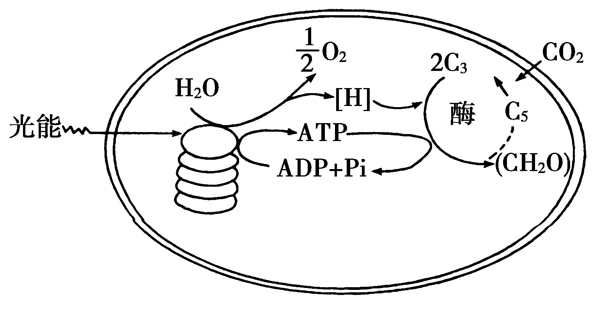
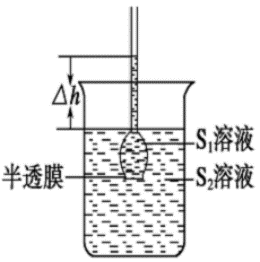
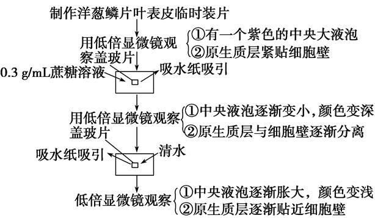
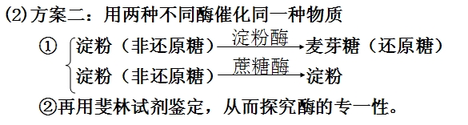
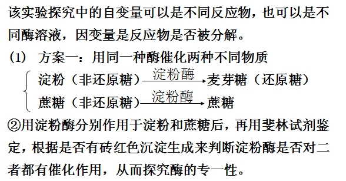
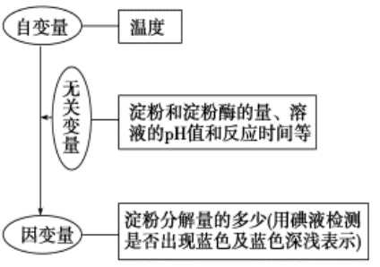

**高中生物基础知识考前最后梳理**

**第一单元 细胞的分子组成与结构**

1.蛋白质、核酸的结构和功能

（1）蛋白质主要由 C、H、O、N 4 种元素组成，很多蛋白质还含有 P、S
元素，有的也含有微

量的 Fe、Cu、Mn、I、Zn 等元素。

（2）氨基酸结构通式的表示方法（右图）：

结构特点是:每种氨基酸分子至少都含有一个氨基和一个羧基，并且都有一个氨基和一个

羧基连接再同一个碳原子上，这个碳原子还连接一个氢原子和一个侧链基团。

（3）连接两个氨基酸分子的化学键叫做肽键。化学式表示为—NH—CO—

拓展：

①失去水分子数＝肽键数＝氨基酸数—肽链数（对于环肽来说，肽键数＝氨基酸数）

②蛋白质相对分子质量＝氨基酸平均相对分子质量×氨基酸数量－失去水分子数×水的相对分子质量

③一个肽链中至少有一个游离的氨基和一个游离的羧基，在肽链内部的 R
基中可能也有氨基和羧基。

（4）蛋白质结构多样性的原因是：组成不同蛋白质的氨基酸数量不同，氨基酸形成肽链时，不同种类氨基酸的排列顺序千变万化，肽链的盘曲、折叠方式及其形成的空间结构千差万别。蛋白质多样性的根本原因是基因中碱基排列顺序的多样性。

（5）有些蛋白质是构成细胞和生物体的结构成分，如结构蛋白；有些蛋白质具有催化作用，如胃蛋白酶；有些蛋白质具有运输载体的功能，如血红蛋白；有些蛋白质起信息传递作用，能够调节机体的生命活动，如胰岛素；有些蛋白质具有免疫功能，如抗体。

（6）核酸的元素组成有 C、H、O、N
和P。核酸是细胞内携带遗传信息的物质，在生物体的遗传、变异和蛋白质的生物合成中具有重要作用。

（7）核酸的基本单位是核苷酸，一个核苷酸是由一分子含氮的碱基、一分子五碳糖和一分子磷酸组成的。

（8）DNA 中的五碳糖是脱氧核糖，RNA 中的五碳糖是核糖；DNA
中含有的碱基是腺嘌呤、鸟嘌呤、胞嘧啶和胸腺嘧啶，而 RNA
中含有的碱基是腺嘌呤、鸟嘌呤、胞嘧啶和尿嘧啶；DNA 中含有两条脱氧核苷酸链，而 RNA
中只含有一条核糖核苷酸链。

（9）生物的遗传物质是核酸。

拓展：

①因为绝大多数生物均以DNA作为遗传物质，只有 RNA 病毒以 RNA
作为遗传物质，所以说DNA 是主要的遗传物质？

②真核生物、原核生物的遗传物质都是DNA。

③DNA 病毒的遗传物质是 DNA，RNA 病毒的遗传物质是 RNA。

④真核生物细胞中含有的 RNA 不是遗传物质，DNA 是遗传物质。

⑤细胞质内的遗传物质是 DNA。

2.糖类、脂质的种类和作用

（10）组成糖类的化学元素有C、H、O。

（11）葡萄糖是细胞生命活动所需要的主要能源物质；核糖是核糖核苷酸的组成成分；脱氧核糖是脱氧核苷酸的组成成分。

（12）糖类的主要作用是主要的能源物质。

（13）植物细胞特有的单糖是果糖，特有的二糖是麦芽糖、蔗糖，特有的多糖是淀粉和纤维；动物细胞所特有的二糖是乳糖，特有的多糖是糖元。

（14）组成脂质的元素主要是C、H、O，有些脂质还含有 P 和 N。

（15）脂肪是细胞内良好的储能物质，此外还是一种很好的绝热体，分布在内脏器官周围的脂肪还具有缓冲和减压的作用，可以保护内脏器官。磷脂作用是构成细胞膜和多种细胞器膜的重要成分。

（16）固醇类包括胆固醇、性激素和维生素D。

（17）组成细胞膜的脂质有磷脂和胆固醇。

（18）因为等量的脂肪氧化分解比糖类释放的能量多，所以说脂肪是动物细胞中良好的储能物

3.水和无机盐的作用

（19）细胞鲜重中含量最多的化合物是水，细胞干重中含量最多的化合物是蛋白质。

（20）结合水是细胞结构的重要组成成分。自由水是细胞内的良好溶剂；细胞内的许多生物化学反应需要水参与；多细胞生物体内的绝大多数细胞，必须浸润在以水为基础的液体环境中；水在生物体内的流动，可以运送营养物质和代谢废物。

（21）结合水/自由水的比值变小有利于适应代谢活动的增强。

拓展：

①种子成熟过程中结合水/自由水的比值变大，萌发过程中结合水/自由水的比值变小。

②自由水和结合水的比值大小决定了细胞或生物体的代谢强度，比值越大代谢越强，反之代谢越弱，一般二者比值越大，抗性越差，比值越小，抗性越强。

③心脏、血液与肌肉细胞呈现不同状态主要是因为结合水含量不同，例如心脏呈固态而血液呈液态，原因是心脏中的中结合水较多。

（22）许多种无机盐对于维持细胞和生物体的生命活动有重要作用；无机盐离子必须保持一定的量，对维持细胞的酸碱平衡非常重要。拓展：ATP、核苷酸等物质的合成需要磷酸。

（23）组成细胞最基本元素是C，基本元素是 C、H、O、N，主要元素是
C、H、O、N、P、S，大量元素有 C、H、O、N、P、S、K、Ca、Mg，微量元素有
Fe、Mn、Zn、Cu、B、Mo。

（24）活细胞中的这些化合物，含量和比例处于不断变化之中，但又保持相对稳定，以保证细胞生

命活动的正常进行。

**第二单元 细胞的结构和功能**

1.细胞学说的建立过程

（1）细胞学说的创始人是施莱登和施旺。

（2）细胞学说的要点是：细胞是一个有机体，一切动植物都由细胞发育而来，并由细胞和细胞产物所构成；细胞是一个相对独立的单位，既有它自己的生命，又对与其他细胞共同组成的整体的生命起作用；新细胞可从老细胞中产生。

（3）细胞学说的创立对生物的进化的重要意义是：它揭示了任何动植物均是由细胞构成的，从而说明动植物之间具有一定的亲缘关系，生物之间的亲缘关系对揭示生物进化具有重要价值。

2.多种多样的细胞

（4）自然界的生命系统包括的层次有：细胞、组织、器官、系统、个体、种群、群落、生态系统、生物圈。

（5）植物的生命系统层次中没有“系统”这个层次。

（6）原核细胞与真核细胞的本质区别是有无以核膜为界限的细胞核。

拓展：

①原核细胞除核糖体外，无其他细胞器。原核生物如细菌的细胞壁主要成分是由糖类与蛋白质结合而成的化合物。

②原核生物的遗传不符合孟德尔遗传规律；真核生物在有性生殖过程中，核基因的遗传符合孟德尔遗传规律。

③自然条件下，原核生物的可遗传变异的类型只有基因突变；真核生物的可遗传变异的类型有基因突变、基因重组、染色体变异。

④原核细胞如细菌主要以二分裂的方式进行分裂；真核细胞的分裂方式有有丝分裂、无丝分裂、减数分裂。

（7）病毒不能独立生活，病毒的代谢和繁殖过程只能在宿主的活细胞中进行。

拓展：

①病毒在生物分类上是既不属于原核生物，也不属于真核生物。

②组成每种病毒核酸的基本单位是四种脱氧核苷酸，或是四种核糖核苷酸。

③病毒的培养不能直接用培养基培养，因为病毒的繁殖必须在宿主的活细胞中进行。

3.细胞膜系统的结构和功能

（8）用哺乳动物成熟的红细胞做实验材料能分离得到纯净的细胞膜。把细胞放在清水里，水会进入细胞，把细胞涨破，细胞内的物质流出来，这样就可以得到纯净的细胞膜。

（9）细胞膜的主要由脂质和蛋白质组成，还有少量的糖类。

拓展：

①行使细胞膜控制物质进出功能的物质是载体。

②细胞膜与其他生物膜的化学组成大致相同，但是在不同的生物膜中，化学物质的含量有差别，例如，细胞膜上糖类的含量相对与细胞器膜要多。

（10）细胞膜的结构特点是流动性，功能特性是选择透过性。

（11）在细胞膜的外表，有一层由细胞膜上的蛋白质与糖类结合而成的糖蛋白，叫做糖被。糖被与细胞表面的识别有密切关系。消化道和呼吸道上皮细胞表面的糖蛋白有保护和润滑作用。

（12）植物细胞壁的化学成分主要是纤维素和果胶。

拓展：

①细菌细胞壁的成分是糖类与蛋白质结合而成的化合物。

②常用纤维素酶和果胶酶除去植物细胞壁。

4.主要细胞器的结构和功能

（13）比较叶绿体、线粒体在成分、结构、功能、遗传物质等方面的区别。

（14）线粒体内与有氧呼吸有关的酶分布在线粒体的内膜和基质中。

拓展：①线粒体内的 DNA 不与蛋白质结合形成染色体。

②线粒体是细胞内进行有氧呼吸的主要场所，有氧呼吸的第一阶段在细胞质基质中进行。

③进行有氧呼吸的细胞不一定要有线粒体，例如进行有氧呼吸的细菌。硝化细菌、大肠杆菌

（15）与光合作用有关的酶分布在叶绿体内的类囊体的薄膜上和叶绿体基质中。与光合作用有关的色素分布在叶绿体内的类囊体的薄膜上。

拓展：①叶绿体内的 DNA 不与蛋白质结合形成染色体。

②叶绿体是真核细胞内进行光合作用的唯一场所。

③进行光合作用的细胞不一定有叶绿体，例如蓝藻属于原核生物，能进行光合作用，但没有叶绿体。

（16）内质网是细胞内蛋白质合成和加工，以及脂质合成的“车间”。

（17）核糖体有的附着在内质网上，有的游离分布在细胞质中，是“生产蛋白质的机器”。

拓展：

①核糖体的功能受到生长激素的调节。

②游离核糖体合成的蛋白质主要是胞内蛋白，附着在内质网上的核糖体合成的主要是胞外蛋白（分泌蛋白）。

（18）高尔基体主要是对来自内质网的蛋白质进行加工、分类和包装的“车间”和“发送站”。动物细胞的高尔基体主要与分泌蛋白的加工、转运有关，植物细胞的高尔基体与细胞壁的合成有关。

（19）中心体存在于动物和某些低等植物的细胞中，与细胞的有丝分裂有关。

（20）液泡由液泡膜和膜内的细胞液构成，细胞液中含有糖类、无机盐、色素和蛋白质等物质。

拓展：

①液泡内的色素有花青素，细胞液呈酸性则偏红，细胞液呈碱性则偏蓝，从而影响植物的花色。

②液泡内的色素与叶绿体色素成分和功能均不相同。

（21）注意从以下几个方面对细胞器进行正确分类

①具有双层膜结构的细胞器有：叶绿体、线粒体。具有双层膜结构的细胞结构有叶绿体、线粒体和核膜。②具有单层膜结构的细胞器有内质网、高尔基体、溶酶体、液泡。

具有单层膜结构的细胞结构有内质网、高尔基体、溶酶体、液泡和细胞膜。

③不具备膜结构的细胞器有核糖体和中心体。

④能产生水的细胞器有线粒体、核糖体。（此外还有叶绿体和高尔基体，可不作要求）

⑤与碱基互补配对有关的细胞器有核糖体、叶绿体、线粒体。⑥含有 DNA
的细胞器有叶绿体和线粒体。

⑦含有 RNA 的细胞结构有叶绿体、线粒体和核糖体。

⑧与细胞的能量转换有关的细胞器有线粒体、叶绿体。

（22）分泌蛋白最初是在内质网上的核糖体中由氨基酸形成肽链，肽链进入内质网进行初步的加工后，进入
高尔基体经过进一步的加工形成分泌小泡与细胞膜融合，分泌到细胞外。

拓展：

【内质网以囊泡的形式将蛋白质运送到高尔基体，囊泡与高尔基体膜融合导致高尔基体膜面积增加；被进一步修饰加工的蛋白质，再以囊泡的形式从高尔基体运送到细胞膜，又导致高尔基体膜面积减少因此内质网的面积逐步减少，细胞膜的面积逐渐增加，高尔基体的面积不变】

（23）构成细胞内生物膜系统的膜结构有内质网、高尔基体、线粒体、叶绿体、溶酶体等细胞器膜和细胞膜、核膜。

5.细胞核的结构和功能

（24）细胞核包括核膜、染色质、核仁、核孔。

（25）核膜上的核孔的功能是实现核质之间频繁的物质交换和信息交流。细胞核内的核仁与某种
RNA（rRNA）的合成以及核糖体的形成有关。

（26）细胞核是遗传信息库，是细胞代谢和遗传的控制中心。

（27）染色质、染色体的化学组成是 DNA
和蛋白质。染色质和染色体是同一物质在细胞不同时期的两种存在状态。

第三单元 细胞代谢

一、物质进出细胞的方式

（1）一个典型的渗透装置必须具备的条件是具有一层半透膜。

（2）植物细胞内原生质层可以看作是半透膜，动物细胞的细胞膜可以看作是半透膜，所以都可以发生渗透吸水。

（3）细胞膜和液泡膜以及两层膜之间的细胞质称为原生质层。原生质体是指植物细胞除去细胞壁以后的结构。

（4）物质跨膜运输的方式有自由扩散，例如氧和二氧化碳进出细胞膜；协助扩散，例如葡萄糖穿过红细胞的细胞膜；主动运输，例如
Na ＋ 、K ＋ 穿过细胞膜。

（5）自由扩散、协助扩散和主动运输的区别如下：

|          | 自由扩散                              | 协助扩散                 | 主动运输                                      |
|----------|---------------------------------------|--------------------------|-----------------------------------------------|
| 运输方向 | 顺浓度梯度 高浓度→低浓度              | 顺浓度梯度 高浓度→低浓度 | 逆浓度梯度 低浓度→高浓度                      |
| 载体     | 不需要                                | 需要                     | 需要                                          |
| 能量     | 不消耗                                | 不消耗                   | 消耗                                          |
| 举例     | O2、CO2、H2O、N2 甘油、乙醇、苯、尿素 | 葡萄糖进入红细胞         | Na+ 、K+、Ca2+等离子； 小肠吸收葡萄糖、氨基酸 |

拓展：

①溶液中的溶质或气体可发生自由扩散，溶液中的溶剂发生渗透作用；渗透作用必须具备两个条件：一是具有半透膜，二是半透膜两侧的溶液具有浓度差。

（6）细胞通过胞吞摄取大分子，通过胞吐排出大分子。

四、酶与 ATP

1.酶在代谢中的作用

（1）酶是活细胞产生的具有催化功能的有机物，其中绝大多数酶是蛋白质，少数酶是
RNA。

（2）酶的生理作用是催化。酶具有高效性、专一性，酶的作用条件较温和。

拓展：

①同无机催化剂相比，酶降低活化能的作用更显著，因而催化效率更高。

②过酸、过碱或温度过高，会使酶的空间结构遭到破坏，使酶永久失活。在低温，如
0℃左右时，酶的活性很低，但酶的空间结构稳定，在适宜的温度下酶的活性可以升高。

2.ATP 在能量代谢中的作用

（3）ATP 的结构简式是 A—P～P～P，其中 A 代表腺苷，T 是三的意思，P 代表磷酸基团。

（4）ATP和ADP的转化

**ATP ADP +Pi+能量**（ATP在细胞内含量少、生成速度快、生成总量多。）

注意：①酶不同：酶1是水解酶，酶2是合成酶；

>   ②能量来源不同：ATP水解释放的能量，来自高能磷酸键的化学能，并用于生命活动；合成ATP的能量来自呼吸作用或光合作用。

③场所不同：ATP水解在细胞的各处。ATP合成在线粒体，叶绿体，细胞质基质。

拓展：①动物体内合成 ATP 的途径是呼吸作用，植物物体内合成 ATP
的途径是呼吸作用和光合作用。

②ATP 在细胞内的含量不多。③ATP 与 ADP
相互转化不是可逆反应，因为反应的场所、酶不同。

五、细胞呼吸

（1）有氧呼吸是指细胞在氧的参与下，通过多种酶的催化作用，把葡萄糖等有机物彻底氧化分解，产生二氧化碳和水，释放能量，生成许多ATP
的过程。

拓展：

①细胞进行有氧呼吸时最常直接利用的物质是葡萄糖。

②有氧呼吸第一阶段的场所是细胞质基质，反应物是葡萄糖，产物是丙酮酸和[H]。

③有氧呼吸第二阶段的场所是线粒体，反应物是丙酮酸和水，产物是 CO2 和[H]。

④有氧呼吸第三阶段的场所是线粒体，反应物是O2 和[H]，产物是H2O。

⑤有氧呼吸的总反应式是：：

C6H12O6+6H2O+6O2 6CO2+12H2O+能量

有氧呼吸的三个阶段比较：

| 有氧呼吸过程 | 第一阶段      | 第二阶段   | 第三阶段   |
|--------------|---------------|------------|------------|
| 场所         | 细胞质基质    | 线粒体基质 | 线粒体内膜 |
| 反应物       | 主要是C6H12O6 | 丙酮酸+H2O | [H]+ O2    |
| 产物         | 丙酮酸+[H]    | CO2+[H]    | H2O        |
| 释放能量     | 少量          | 少量       | 大量       |

（2）无氧呼吸是指细胞在无氧条件下，通过酶的催化作用，把葡萄糖等有机物质分解成为不彻底的氧化产物，同时释放出少量能量的过程。

拓展：

①高等植物在水淹时，无氧呼吸的产物是酒精和CO2。

②马铃薯、玉米胚进行无氧呼吸的产物是乳酸。

③高等动物和人剧烈运动时，骨骼肌进行无氧呼吸的产物是乳酸。

④无氧呼吸生成酒精的反应式： 无氧呼吸生成乳酸的反应式：

C6H12O6 2 C3H6O3（乳酸）+少量能量； C6H12O6 2 C2H5OH（酒精）+2CO2+少量能量

⑤无氧呼吸的部位是细胞质基质

（3）有氧呼吸和无氧呼吸第一个阶段完全相同，有氧呼吸二、三阶段和无氧呼吸的第二阶段的物质变化和场所不同。

利用光合作用原理在农业上的应用有：在冬季通过温室、大棚为农作物提供合适的温度；种植阴生植物要遮荫；通过合理密植、套种等措施提高作物产量。

利用呼吸作用原理在农业生产中的应用有：对稻田举行定期排水，防止水稻幼根因缺氧而腐烂；农作物、果树管理后期适当摘除老叶、残叶。

拓展：

① 热点：测定光合速率必须在光下进行，测定呼吸速率必须在暗中进行。

② 新疆哈密瓜较甜的原因是日照充足、光照强、昼夜温差大。

③ 降低大棚内的温度，减少呼吸消耗

（4）细胞呼吸能为生物体的生命活动提供能量，能为体内其他化合物的合成提供原料。

六、光合作用

1.光合作用的基本过程

（1）光合作用的反应式可表示为：

6CO2+12H2O *光能、叶绿体* C6H12O6 +6O2+6H2O

或CO2 + H2O *光能、叶绿体* (CH2O) + O2

光合作用过程图

（2）概述光合作用的过程（光反应和暗反应）

| 比较项目 | 光反应                                                                | 暗反应                                                                  |
|----------|-----------------------------------------------------------------------|-------------------------------------------------------------------------|
| 需要条件 | 光、色素、酶                                                          | 多种酶                                                                  |
| 时间     | 短促                                                                  | 较缓慢                                                                  |
| 反应场所 | 叶绿体基粒（类囊体的薄膜上）                                          | 叶绿体基质                                                              |
| 物质变化 | 水的光解：2H2O *光* 4[ H ]+O2 ATP的合成：ADP+Pi+能量*酶*ATP           | CO2的固定：CO2 +C5 *酶* 2C3 C3的还原：2C3 *[ H ]，ATP,多种酶* (CH2O)+C5 |
| 能量变化 | 光能→活跃的化学能（储存在ATP中）                                      | 活跃的化学能→稳定的化学能(储存在有机物中)                               |
| 完成标志 | O2的释放，ATP和[ H ]的生成                                            | 葡萄糖等有机物的生成                                                    |
| 两者关系 | 光反应为暗反应提供能量(ATP)和还原剂([ H ])；暗反应为光反应提供ADP和Pi |                                                                         |

拓展：

①光反应需要酶。

②光合作用产生的葡萄糖和水中的氧元素来自反应物中的 CO2。

③暗反应能在光下进行。

④与光反应进行有关的非生物因素：光、温度、水。

⑤与暗反应进行有关的非生物因素：温度、CO2。

⑥从外界吸收来的 CO2 不能直接被[H]还原，CO2 需要先被固定成为 C3，C3
直接被[H]还原。

⑦光反应中，光能转变为活跃的化学能。

⑧暗反应阶段的能量变化是活跃的化学能转变为稳定的化学能。

⑨当CO2不足时，植物体内 C3、ATP、C5、[ H
]的含量变化分别是下降、上升、上升、上升。当光照不足时，植物体内 C3、ATP、C5、[ H
] 的含量变化分别是上升、下降、下降、下降。

⑩光合速率的测定：一般采用的指标如单位时间内氧气的释放量、单位时间内 CO2
的吸收量、单位时间内植物重量（有机物）的变化量。

2.影响光合作用速率的环境因素

（3）提高农作物对光能的利用率的措施有延长光合作用时间、增加光合作用面积、提高光合作用效率。

（4）光合作用效率是植物光合作用中，产生有机物中所含能量与光合作用中吸收的光能的比值。提高农作物的光合作用效率有：给植物提高适宜的光照强度、温度，给植物提供充足的
CO2、

H2O 和矿质元素（无机盐）。

3、化能合成作用：除了绿色植物，自然界中少数种类的细菌，虽然细胞内没有叶绿素，不能进行光合作用，但是能够利用体外环境中的某些无机物氧化时所释放的能量来制造有机物，这种合成作用叫做化能合成作用，这些细菌也属于自养生物。例如生活在土壤中的硝化细菌。

**第四单元 细胞的生命历程**

一、细胞的增殖

1.细胞的生长和增殖的周期性

（1）连续分裂的细胞，从一次分裂完成时开始，到下一次分裂完成时为止，是一个细胞周期。具有连续分裂能力的细胞具有细胞周期，如植物根尖分生区细胞、受精卵细胞等。

2.细胞的有丝分裂

（2）一个细胞周期从一次分裂完成时开始。

（3）分裂间期细胞内发生的主要变化是完成DNA分子的复制和有关蛋白质的合成。

拓展：用3H 标记胸腺嘧啶，可以研究间期DNA分子的复制。

（4）细胞分裂期各阶段的变化特点是:

前期：“二现、二失”，核仁解体、核膜消失，出现纺锤丝形成纺锤体，染色质螺旋化成为染色体，散乱地分布在纺锤体的中央。

中期：“点在板”，所有染色体的着丝点排列在赤道板上。

后期：“着丝点分裂”，姐妹染色单体分开，纺锤丝牵引子染色体向细胞两极移动。

末期：“二现、二失”，染色体变成染色质，纺锤丝消失，出现新的核膜和核仁，一个细胞分裂成为两个子细胞。

（5）记住细胞有丝分裂DNA、染色体的变化曲线图

（6）在细胞分裂的中期，染色体的形态比较固定、数目比较清晰。

（7）动物细胞与植物细胞有丝分裂过程基本相同，不同的特点是：动物细胞在间期中心体倍增，在前期两组中心粒分别移向细胞两极，在中心粒的周围，发出星射线构成纺锤体；而植物细胞在前期从细胞两极发出纺锤丝。动物细胞分裂的末期细胞膜从细胞的中部向内凹陷，最后把细胞缢裂成两部分；植物细胞末期在赤道板的位置出现细胞板，细胞板由细胞的中央向四周扩展，逐渐形成新的细胞壁。

拓展：

①动物细胞有丝分裂前期纺锤体的形成主要与中心体有关。

②植物细胞分裂末期新的细胞壁的形成与高尔基体有关。

③细胞分裂的过程中还需要核糖体、线粒体的参与。

（8）细胞有丝分裂的重要特征是出现纺锤丝和染色体，有丝分裂后两个子细胞中的核中遗传物质和染色体的数量与有丝分裂前亲代细胞相同。

3.细胞的无丝分裂

(9)蛙的红细胞的分裂过程中，细胞核先延长，核的中部向内凹进，缢裂成为两个细胞核；接着整个细胞从中部缢裂成两部分，形成两个子细胞。

拓展：

①蛙的红细胞的分裂是无丝分裂，哺乳动物的红细胞无核，也不能进行分裂。

②在无丝分裂过程中有 DNA 的复制。

二、细胞的分化、癌变、衰老和凋亡

1.细胞的分化

(1)在个体发育中，由一个或一种细胞增殖产生的后代，在形态、结构和生理功能上发生稳定性差异的过程，叫做细胞分化。细胞分化使细胞趋于专门化，提高了生命活动的效率。细胞分化的本质是：基因的选择性表达。多细胞个体内的每个体细胞都含有该物种全套的基因。有些基因是每个活细胞都必须表达的，如：ATP合成酶基因、呼吸酶基因；有些基因则是不同的细胞选择性表达的，如胰岛素基因只到胰岛B细胞表达，而血红蛋白基因只在红细胞表达。

(2)细胞分化发生在生物体的整个生命进程中，在胚胎时期达到最大程度。

(3)细胞分化是一种持久性变化，分化导致的稳定性差异一般是不可逆转的。

2.细胞的全能性

(4)细胞的全能性是指已经分化的细胞，仍然具有发育成完整个体的潜能。细胞具有全能性的原因是细胞包含有该物种所特有的全套遗传物质，都有发育成为完整个体所必需的全部基因。

(5)植物细胞全能性表达需要的条件是植物细胞脱离了原来所在植物体的器官或组织而处于离体状态时，在一定的营养物质、激素和其它外界条件的作用下，就可能表现出全能性。

拓展：

①细胞分化的过程中遗传物质没有发生改变。

②同一个体不同细胞中DNA相同，RNA、蛋白质不完全相同，因为细胞分化过程中发生了基因的选择性表达。

3.细胞的衰老和凋亡以及与人体健康的关系

(6)生命体的衰老和死亡与细胞的衰老和死亡不是同步进行的，例如幼年个体体内有些细胞在衰老和死亡，老年个体体内也有新产生的细胞。

(7)衰老细胞主要具有以下特征：

细胞内的水分减少，结果使细胞萎缩，体积变小，细胞新陈代谢的速率减慢；细胞内多种酶的活性降低；细胞内的色素随细胞衰老而逐渐积累，妨碍细胞内物质的交流和传递，影响细胞正常的生理功能；细胞内呼吸速率减慢，细胞核的体积增大，核膜内折，染色质收缩、染色加深；细胞膜通透性改变，使物质运输功能降低。

拓展：老年人的皱纹、白发及色斑如何解释？

皱纹产生的准确机理比较复杂，皱纹的产生与代谢减慢、皮肤衰老等有关。

由于头发基部的黑色素细胞衰老，细胞中的酪氨酸酶活性降低，黑色素合成减少，所以老年人头发变白。老年斑是由于细胞内的色素随着细胞衰老而逐渐积累造成的。衰老细胞中出现色素聚集，主要是脂褐素的堆积。脂褐素是不饱和脂肪酸的氧化产物，是一种不溶性颗粒物。不同的细胞在衰老过程中脂褐素颗粒的大小也有一定的差异。皮肤细胞的脂褐素颗粒大，就出现了老年斑。

4.癌细胞的主要特征及防治

(8)癌细胞主要有以下特征：

在适宜条件下，癌细胞能够无限增殖；癌细胞的形态结构发生显著变化；癌细胞的表面发生了变化，由于细胞膜上的糖蛋白等物质减少，使得癌细胞彼此之间的黏着性显著降低，容易在体内分散和转移。

(9)人和动物体的染色体上存在原癌基因和抑癌基因。原癌基因主要负责调节细胞周期，控制细胞生长和分裂的进程；抑癌基因主要是阻止细胞不正常的增殖。环境中的致癌因子会损伤细胞中的DNA分子，使得原癌基因和抑癌基因发生突变，导致正常细胞的生长和分裂失控而变成癌细胞。

**第五单元 生物的遗传**

一、遗传的细胞基础——减数分裂和受精作用

1.细胞的减数分裂

（1）减数分裂是指有性生殖的生物产生有性生殖细胞的过程，细胞连续分裂2次，而染色体只复制1次，结果子细胞中的染色体数量减半的细胞分裂过程。减数分裂与有丝分裂过程的区别是减数分裂产生的子细胞是有性生殖细胞，而有丝分裂产生体细胞；减数分裂细胞连续分裂2次，而染色体复制1次，有联会、四分体和同源染色体的分离现象；有丝分裂染色体复制和细胞分裂均为1次，无联会和同源染色体分离等现象。

拓展：

①由于减数分裂过程存在联会、同源染色体分离，所以导致分裂后子细胞染色体数量减半，所以减数分裂后，染色体数目比原来减少了一半。

②同源染色体一般能够在减数分裂中发生联会（即配对）现象，形状大小一般相同。

③四分体是指联会后的一对同源染色体共有四条染色单体，成为一个四分体。四分体、同源染色体、染色单体、核
DNA之间的数量关系是1个四分体含有1对同源染色体，共含有4条染色单体，4条DNA。

④在有丝分裂过程中不能形成四分体，因为不发生同源染色体的联会现象。

⑤遗传规律的发生是在细胞减数分裂减I
后期，即同源染色体分离和非同源染色体自由组合的时期。

2.配子的形成过程

（2）卵细胞与精子形成过程的主要区别：卵细胞形成过程中细胞质不均等分配、减数分裂后不经过细胞变形过程，而
精子的形成细胞质均等分配、减数分裂后形成精子时有细胞变形过程。

3.受精过程

（3）受精作用是指精子和卵细胞融合形成受精卵的过程，受精作用的实质是精核与卵细胞核的融合。

（4）受精卵中的核遗传物质一半来自方，一半来自母方，但是如果不强调是核中的遗传物质，就不能说各占一半，因为细胞质遗传物质几乎全部来自卵细胞。

（5）减数分裂和受精作用的重要意义是保证了有性生殖过程中染色体一半来自父方，一半来自母方，并且保证了亲子代染色体数目的恒定。

二、遗传的分子基础

1.人类对遗传物质的探索过程

（1）格里菲思的肺炎双球菌实验过程：该实验共分四组，分别由R型、S型、加热杀死的S型细菌感染小鼠，最后由加热杀死的S型细菌和R型细菌混合感染小鼠，观察小鼠的死活，并试图从死亡的小鼠体内提取S型细菌。

实验结果：将R型、加热杀死的S型细菌感染小鼠，小鼠均不死亡；S型、加热杀死的S型细菌和R型细菌混合感染小鼠，小鼠死亡，并且从死亡小鼠体内提取出S型细菌。

（2）格里菲思的肺炎双球菌实验结论：加热杀死的S型细菌的转化因子使R型细菌发生了转化，从而使小鼠死亡。

（3）艾弗里证明遗传物质是DNA的实验过程：让R型细菌分别与S型细菌的DNA、蛋白质、多糖等物质分别混合，并分别在固体培养基上培养，观察哪组能产生S型细菌表面光滑的菌落特征。实验结果：只有与S型细菌的DNA混合的R型细菌接种后能产生S型细菌的菌落特征。

（4）艾弗里和他的同事通过上述实验得出的结论：使R型细菌转化为S型细菌的转化因子即遗传物质是DNA。

（5）赫尔希和蔡斯（T2噬菌体侵染细菌）的实验操作步骤：首先让T2
噬菌体分别标记32P、35S，然后分别与大肠杆菌混合培养，一段时间后振荡、离心，之后观察放射性在试管的上清液还是沉淀中。

实验结果：标记32P的组放射性主要在沉淀中，而标记5S的组放射性集中在上清液中。

拓展：

①T2 噬菌体侵染细菌后，合成自身组分所需的物质和原料均从细菌中来。

②获得含5S 和32P标记的 T2
噬菌体的方法是首先在含有放射性物质的培养基中培养大肠杆菌，之后再接种T2噬菌体，连续多代培养从而获得含有放射性的噬菌体。

③在噬菌体侵染细菌的实验中，证明DNA是遗传物质的最关键的实验设计思路是将噬菌体的DNA
和蛋白质分离，分别考察对子代噬菌体的影响作用。

④这个实验过程不能证明 DNA
是主要的遗传物质，由于其他生物有的遗传物质是RNA，而此实验不能进一步证明。

⑤这个实验不能证明蛋白质是遗传物质，因为蛋白质在形成子代噬菌体的过程中不能发挥遗传物质的作用。

2.DNA分子结构的主要特点

（6）DNA分子的基本单位是脱氧核苷酸；RNA分子的基本单位是核糖核苷酸。

（7）DNA 分子的空间结构特点是：首先，DNA
由两条脱氧核苷酸链反向平行构成；其次，DNA分子的外侧由磷酸和脱氧核糖交替连接构成基本骨架，碱基在内侧；碱基之间通过氢键以碱基互补配对方式连接。

拓展：

①判断核酸的种类有三种方法，具有符合双螺旋结构的是DNA，否则可能是RNA；组成如果含有核糖为RNA,如果含有脱氧核糖，则是DNA；组成该分子的碱基中，含有胸腺嘧啶的是DNA，含有尿嘧啶而不含胸腺嘧啶的是RNA。②根据结构功能的统一性原理，地处炎热地区的生物，其DNA分子的结构应更需要维持稳定性，防止热变性，所以具有
G、C 碱基含量高、氢键多，

3.DNA 分子的复制

（8）简述DNA分子复制的过程：DNA分子在解旋酶作用下解旋，之后以细胞核中游离的脱氧核苷酸为原料、以碱基互补配对为原则、合成子代DNA，之后重新螺旋化。

拓展：

①DNA的复制主要在在细胞分裂的间期进行。

②DNA复制是以亲代 DNA 分子的两条脱氧核苷酸链分别作为模板。

③DNA复制的原料是细胞核里游离的脱氧核苷酸。

④DNA复制的方式是半保留复制和边解旋边复制。

⑤DNA复制的场所主要是细胞核，线粒体和叶绿体中也有。

⑥DNA复制需要的基本条件是模板、原料、能量、酶。

4.基因的概念与表达

（9）基因是有遗传效应的 DNA 片段，是 DNA
分子中决定生物性状的结构和功能单位。基因与脱氧核苷酸、遗传信息、DNA、染色体、蛋白质、生物性状之间的关系是：基因是DNA
分子中决定生物性状的基本单位，染色体由 DNA
和蛋白质组成，遗传信息是由基因中特定的脱氧核苷酸的排列顺序决定的。

（10）遗传信息的转录和翻译

①基因控制蛋白质的合成包括两个阶段是转录和翻译。

②转录是在细胞核中以 DNA 为模板，按碱基互补配对方式合成 RNA 的过程。

拓展：

①转录发生的时间是细胞分裂间期。

②转录的模板是 “DNA 分子的一条脱氧核苷酸链”

③转录的原料是细胞核里游离的核糖核苷酸。

④转录的产物是 RNA 分子。

⑤转录需要的基本条件是模板、原料、能量、酶等。

（11）翻译是在核糖体中以 mRNA 为模板，按照碱基互补配对原则，以 tRNA
为转运工具、以细胞质里游离的氨基酸为原料合成蛋白质的过程。

①翻译发生的场所是核糖体。

②准确地说，翻译的产物是多肽链。

③翻译需要的原料是细胞质里游离的氨基酸。

拓展：

①原核生物与真核生物的基因表达不同：原核细胞的转录和翻译可同时进行；真核细胞的转录在细胞核中进行，mRNA经加工成熟后通过核孔进入细胞质，在细胞质核糖体进行翻译。

②病毒基因的表达所需原料来自宿主细胞的游离核糖核苷酸和氨基酸，模板来自病毒基因转录来的
mRNA。

③遗传信息是指 DNA 分子上基因的碱基排列顺序；密码子指 mRNA
中决定一个氨基酸的三个连续碱基；反密码子是指 tRNA 分子中与 mRNA
分子密码子配对的三个连续碱基，反密码子与密码子互补。起始密码子、终止密码子均存在于
mRNA 分子上。

（12）一种tRNA只能运转一种特定的氨基酸。一种氨基酸可由多种tRNA 转运。

（13）在基因表达过程中 DNA 分子中碱基数、mRNA 分子中碱基数、氨基酸数的数量关系是
6：3：1。

五、遗传的分离定律

1.孟德尔遗传实验的科学方法

（1）遗传学实验的科学杂交实验包括：人工去雄、套袋、授粉、套袋。

（2）孟德尔获得成功的原因：首先选择了相对性状明显和严格自花传粉的植物进行杂交，其次运用了科学的统计学分析方法和以严谨的科学态度进行研究。

2.基因分离定律和自由组合定律

（3）分离定律的内容是在杂合体进行自交形成配子时，等位基因随着一对同源染色体的分离而彼此分开，分别进入不同的配子中。

（4）分离定律的实质是等位基因彼此分离。

（5）分离定律在杂交育种方面的应用是：选育出显性性状的个体后需要进行不断的自交，以获得纯合子；选育隐性性状的个体时无需连续自交即可获得所需的纯合子。

拓展：

①判断性状的显隐性关系：两表现不同的亲本杂交子代表现的性状为显性性状；或亲本杂交出现
3：1 时，比例高者为显性性状。

②一个生物是纯合子还是杂合子？可以从亲本自交是否出现性状分离来判断，出现分离则为杂合子。

六、遗传的自由组合定律

1.基因的自由组合定律内容

（1）基因自由组合定律的实质是等位基因彼此分离的同时非同源染色体上的非等位基因自由组合；发生的时间为减数分裂形成配子时。

拓展：验证基因的分离定律和自由组合定律是通过测交实验，若测交实验出现
1：1，则证明符合分离定律；如出现 1：1：1：1
则符合基因的自由组合定律。（验证决定两对相对性状的基因是否位于一对同源染色体上可通过杂合子自交，如符合
9：3：3：1 及其变式比，则两对基因位于两对同源染色体上，如不符合
9：3：3：1，则两对基因位于一对同源染色体上。）

（2）熟练记住杂交组合后代的基因型、表现型的种类和比例，并能熟练应用。

2.基因与性状的关系

（3）基因控制生物性状的两种方式：一是通过控制酶的合成来控制代谢过程，进而控制生物体的性状；而是通过控制蛋白质的结构直接控制生物体的性状。

七、伴性遗传

1.伴性遗传是指性染色体上的基因遗传方式与性别相联系称为伴性遗传。

2.伴 X
染色体显、隐性遗传病的特点是所生后代男女发病率不同，前者女性发病率高于男性，后者男性发病率高于女性。常染色体上的显、隐性遗传的特点是后代男女发病率相同，前者常常代代有患者，后者往往出现隔代遗传。

3.判断控制生物性状的基因：在常染色体还是在X
染色体上主要是看子代男女发病率是否相同，前者所生子代男女发病率相同，后者不同。

八、人类遗传病

1.人类遗传病的类型主要有：单基因遗传病、多基因遗传病、染色体病等。

2.人类遗传病的监测和预防：略。

3.人类基因组计划测定的是24条染色体上的基因，即22条常染色体和X、Y两条性染色体，因为X、Y染色体具有不相同的基因和碱基顺序。

**第六单元 生物变异与进化**

一、基因重组与基因突变

1.基因重组及其意义

（1）可遗传的变异有三种来源：基因突变、染色体变异和基因重组。

（2）基因重组的方式有同源染色体上非姐妹单体之间的交叉互换和非同源染色体上非等位基因之间的自由组合，另外，外源基因的导入也会引起基因重组；在农业生产中最经常的应用是非同源染色体上非等位基因之间的自由组合。

拓展：

①杂交育种的方法通常是选出具有不同优良性状的个体杂交，从子代杂合体中逐代自交选出能稳定遗传的符合生产要求的个体。步骤：杂交、纯化。

②杂交育种的优点是简便易行；缺点是育种周期较长。

2.基因突变的特征和原因

（3）基因突变是基因结构的改变，包括碱基对的增添、缺失或替换。基因突变发生的时间主要是细胞分裂的间期。

（4）基因突变的特点是低频性、普遍性、少利多害性、随机性、不定向性。

（5）基因突变在进化中的意义：它是生物变异的根本来源，为生物进化提供了最初的原始材料,能使生物的性状出现差别，以适应不同的外界环境，是生物进化的重要因素之一。

（6）基因突变不一定能引起性状改变，如发生的是隐性突变（A→a），
就不会引起性状的改变。

（7）诱变育种一般采用的方法有物理和化学两类：如射线照射、亚硝酸等。

拓展：

①航天育种是诱变育种，利用失重、宇宙射线等手段诱发生物基因突变。

②诱变育种具有的优点是可以提高突变率，缩短育种周期，以及能大幅度改良某些性状。缺点是成功率低,有利变异的个体往往不多；此外需要大量处理诱变材料才能获得所需性状。

二、染色体变异与育种

1.染色体结构变异和数目变异

（1）染色体变异是指染色体结构和数目的改变。染色体结构的变异主要有缺失、重复、倒位、易位四种类型。

（2）区分基因突变、基因重组和染色体结构变异的方法是染色体结构变异可从显微镜下观察到，另外二者不能从镜下观察到。基因突变是基因中分子结构的改变，而基因重组是在有性生殖细胞的形成过程中发生的基因重新组合过程。

（3）染色体组是指有性生殖细胞中的一组非同源染色体，其形状大小一般不相同。

（4）二倍体是指体细胞中有两个染色体组的个体。多倍体是指体细胞中含有三个或三个以上染色体组的个体

（5）多倍体产生的自然原因是由于温度等环境因素骤变，使生物体细胞的染色体虽然已经复制，但是不能完成细胞分裂过程，从而使细胞的染色体加倍。多倍体产生的人为因素是用秋水仙素处理植物的幼苗或发育的种子，从而抑制细胞中纺锤体的形成，从而使细胞中的染色体加倍。与正常个体相比，多倍体具有的特点是植株个体巨大、合成的代谢产物增多，但是发育迟缓。

（6）人工诱导多倍体最常用最有效的方法是秋水仙素，可抑制植物幼苗细胞中纺锤体的形成。

拓展：

①人工诱导多倍体常选用的化学试剂是秋水仙素。

②人工诱导多倍体时，用秋水仙素处理植物的时期是幼苗或萌发的种子。

③秋水仙素作用的时期是细胞分裂的前期，此时正在形成纺锤体结构。

④秋水仙素的作用机理是抑制细胞中纺锤体的形成，从而抑制细胞分裂过程。

（7）单倍体是指体细胞中含有本物种配子中染色体组的个体。单倍体的特点一般是植株矮小瘦弱，一般高度不育。

（8）单倍体育种的过程一般是首先花药离体培养，从而获得单倍体植株，然后进行秋水仙素加倍，从而获得所需性状的纯合个体。
单倍体育种的优点是能迅速获得纯合体，加快育种进程。依据的原理是染色体变异。

2.生物变异在育种上的应用

（9）除了上述的杂交育种、诱变育种、单倍体育种和多倍体育种外，还有基因工程育种。

三、生物进化

1.现代生物进化理论的主要内容

（1）自然选择学说的主要内容是：过度繁殖、生存斗争、遗传变异、适者生存。

（2）生物进化的单位是种群。种群是生活在同一地点的同种生物所组成的群体。基因库是指种群中全部个体的全部基因。

（3）基因不会因个体的死亡而消失，其原因是种群中的基因库能继续保持和发展下去。

（4）基因频率是指种群中全部个体中该基因出现的几率。

拓展：

（5）生物进化的实质是种群基因频率的改变。

（6）现代进化理论的基本内容是：①进化是以种群为基本单位，进化的实质是种群的基因频率的改变。②突变和基因重组产生进化的原材料。③自然选择决定生物进化的方向。④隔离导致物种形成。

（7）生物进化的原材料是通过基因突变和染色体变异产生新的基因和基因组成，经基因重组在种群中保留和发展。

（8）突变和基因重组不能决定生物进化的方向，因为突变具有不定向性。

（9）生物进化的方向是由自然选择决定。

（10）自然选择决定生物变异是否有利，从而通过生存斗争使适者生存，从而决定进化的方向。

（11）物种是指分布在一定的自然区域，具有一定的形态结构和生理功能，而且在自然状态下能互相交配，并产生出可育后代的一群生物个体。

（12）判断某些生物是否是同一物种的依据是：是否存在生殖隔离，能否产生可育后代。

（13）常见的隔离类型有地理隔离和生殖隔离。

（14）物种形成最常见的方式是通过突变和重组产生可遗传变异，经过漫长年代的地理隔离积累产生生殖隔离，从而形成新物种。

2.共同进化与生物多样性的形成

（14）共同进化是不同物种之间，生物与无机环境之间，在相互影响中不断进化和发展，这就是共同进化。

（15）生物多样性的内容包括：基因的多样性、物种的多样性和生态系统的多样性

**第七单元 生命活动的调节**

一、植物激素调节

1.植物生长素的发现和作用

（1）生长素的发现

拓展:

①胚芽鞘中的生长素是由胚芽鞘尖端合成的。

②生长素的合成不需要光

③胚芽鞘的尖端部位感受单侧光的刺激

④在植物体内，合成生长素最活跃的部位是幼嫩的芽、叶和发育的种子

⑤生长素大部分集中分布在生长旺盛的部位，如：胚芽鞘、芽和根的顶端分生组织、发育的果实和种子等处。

⑥胚芽鞘向光弯曲和生长的部位是胚芽鞘尖端下部的伸长区

⑦生长素的化学本质是吲哚乙酸

（2）取两段生长状况相同的等长的玉米胚芽鞘甲、乙，分别切去等长尖端，甲形态学上端在上，乙形态学下端在上，分别放置含有生长素的琼脂块在上端，不含生长素的琼脂块在下端，一段时间后，测甲乙两胚芽鞘的下端的琼脂中有无生长素。可以证明生长素只能由形态学上端向形态学下端运输。

（3）生长素的横向运输

拓展：

①横向运输发生在尖端

②引起横向运输的原因是单侧光或地心引力

（4）生长素生理作用：促进生长、促进扦插的枝条生根、促进果实的发育；特点：具有双重性。

拓展：

①单侧光照射使胚芽鞘尖端产生某种刺激，生长素向背光侧移动，运输到下部的伸长区，造成背光面比向光面生长快，因此出现向光弯曲，显示出向光性

②生长素对植物生长的双重作用体现在根的向地性、顶端优势

③生长素的双重作用与浓度和器官有关。如根比芽敏感，芽比茎敏感。低浓度促进生长，高浓度抑制生长。

④顶端优势现象是顶芽优先生长，侧芽由于顶芽运输来的生长素积累，浓度过高，导致侧芽生长受抑制的现象。

⑤根、芽、茎三种器官对生长素敏感性，根比芽敏感，芽比茎敏感。

（5）生长素在农业生产上的应用：促进扦插的枝条生根，促进果实发育，获得无子果实，防止果实、叶片脱落。

拓展：

①在农作物的栽培过程中，整枝、摘心所依据的原理是顶端优势。

②雌蕊受粉后，促进果实发育的生长素由发育着的种子合成的。

③番茄在花蕾期去雄，雌蕊涂抹适宜浓度的生长素获得无子番茄。

④双子叶植物对生长素的敏感度高于单子叶植物，因此农业生产上可以用2、4—D
作为双子叶植物除草剂。

2.其他植物激素

（6）植物体内的激素有生长素、细胞分裂素、赤霉素、脱落酸、乙烯等五类。

①细胞分裂素的主要生理作用：促进细胞分裂和组织分化

②乙烯的主要生理作用：促进果实成熟，乙烯存在于植物体的各个部位

③脱落酸的作用：抑制细胞分裂，促进叶和果实的衰老和脱落

④植物的生长和发育的各个阶段，由多种激素相互协调、共同调节的。

拓展：

①因为天然的生长素在植物体内有一个代谢过程，合成与分解保持着一种动态平衡。当用天然的生长素处理植物时，体内生长素的量超过正常水平，过多的生长素会被其体内的酶分解掉而不易长时间发挥作用，但植物体内没有分解生长素类似物（即人工合成的生长素）的酶，用生长素类似物处理后，能够长时间地发挥作用。

②新采摘的香蕉只有七成熟便于运输，而我们吃的香蕉通过释放乙烯促进果实成熟

③秋水仙素不是植物激素，秋水仙素的作用机制是抑制纺锤体的形成

④植物激素处理后，植物体内的遗传物质没有改变。

3.植物激素的应用

（7）植物生长调节剂是人工合成的，对植物的生长发育有着调节作用的化学物质。相比，植物激素植物生长调节剂具有容易合成、原料广泛、效果稳定等优点。

二、人和高等动物的神经调节

1.神经调节结构基础和调节过程

（1）神经调节的基本方式是反射
（2）反射弧由感受器、传入神经、神经中枢、传出神经、效应器五部分构成

2.神经冲动的产生和传导

（3）神经纤维未受到刺激时，细胞膜内外的电荷分布情况是外正内负

（4）当某一部位受刺激时，其膜电位变为外负内正

拓展：①兴奋的传导方向和膜内侧的电流传导方向一致
②兴奋在神经纤维上的传导形式是电信号，特点是速度快

（5）兴奋在神经元之间的传递是通过突触进行的

拓展：

①神经元的末梢经过多次分支，最后每个分支末端膨大，呈杯状或球状叫做突触小体；突触前膜是神经元的轴突末梢，突触后膜是神经元胞体或树突。

②递质与突触后膜上的受体结合，受体的化学本质是糖蛋白。

③神经递质存在于突触前膜的突触小泡中，只能由突触前膜释放，然后作用于突触后膜，因此兴奋只能从一个神经元的轴突传递给另一个神经元的细胞体或树突。

④兴奋在神经纤维上的传导速度与在神经元之间的传导速度不一样，神经纤维上快。

⑤兴奋在神经元之间的传递有单向的特点

3.人脑的高级功能

（6）人的大脑皮层除了对外部世界的感知以及控制机体的反射活动外，还具有语言、学习、记忆和思维等方面的高级功能。

（7）人类特有的神经中枢：言语区

三、人和高等动物的体液调节

1.动物激素的调节

拓展：

①人体内调节内分泌腺活动的枢钮是下丘脑
②生长激素有促进生长，主要是促进蛋白质的合成和骨的生长的作用

③甲状腺激素有促进新陈代谢和生长发育，尤其是对神经系统的发育和功能具有重要影响，提高神经系统的兴奋性。

④胰岛素的生理作用是降低血糖浓度

⑤雌、雄激素分别促进雌雄生殖器官的发育和生殖细胞的形成，激发并维持第二性征，雌激素能激发和维持正常的性周期。

（3）人体内激素的分泌通过反馈调节的方式调节。

（4）不同激素对同一生理效应都发挥作用，从而达到增强效果叫激素之间的协同作用，例如生长激素和甲状腺激素。

（5）不同激素对同一生理效应都发挥作用，作用相反叫激素间的拮抗作用，例如胰岛素和胰高血糖。

（6）激素分泌的分级调节受大脑皮层，下丘脑，垂体调节控制。甲状腺激素的分泌存在分级调节和负反馈调节。

2.动物激素在生产中的应用

（8）阉割催肥的原理是割除牲畜的生殖腺，使其不具有性行为和生殖能力，而且驯良，节约能量，利于育肥。

（9）评价：对牲畜注射生长激素催肥是滥用生长激素，其后果对儿童来说是灾难的。它不止影响儿童的身高体重，还影响神经系统、免疫系统、生殖系统。长期食用此类动物食品，其中的残留激素可能使男性“雌性化”。

四、人体内环境的稳态与调节

1.稳态的生理意义

（1）人体内环境指人体内细胞生活的液体环境

拓展：

①内环境=细胞外液=血浆+组织液+淋巴

②下列物质属于内环境成分的是：血糖、抗体、激素

（2）血浆和组织液之间双向渗透，组织液也可渗透进入淋巴，淋巴回流到血浆。

2.神经、体液调节在稳态中的作用

动物体内各项生命活动常常同时受神经和体液的调节，这两种调节协调作用，各器官、系统的活动才能协调一致，内环境的稳态才能得以维持，细胞的各项生命活动才能正常进行，机体才能适应环境的不断变化。

（3）神经调节与体液调节区别：

| 比较项目 | 神经调节                                                                                                                                                                   | 体液调节 |
|----------|----------------------------------------------------------------------------------------------------------------------------------------------------------------------------|----------|
| 反应速度 | 迅速                                                                                                                                                                       | 较缓慢   |
| 作用范围 | 准确、比较局限                                                                                                                                                             | 较广泛   |
| 作用时间 | 短暂                                                                                                                                                                       | 比较长   |
| 联系     | 体内大多数内分泌腺直接或间接受中枢神经系统的控制，如性激素的分泌受中枢神联系经系统的调节；内分泌腺所分泌的激素也可以影响神经系统的功能，如甲状腺激素影响着大脑的生长发育。 |          |

3.体温调节、水盐调节和血糖调节

（4）人体所需水的主要来源是饮水和食物，人体水分排出的最主要途径是肾脏。

（5）抗利尿激素的作用是促进肾小管和集合管对水分重吸收。是由下丘脑神经细胞分泌，垂体后叶释放的

（6）胰岛素通过促进葡萄糖进入肝脏、肌肉、脂肪等组织细胞，并且在这些细胞中合成糖元、氧化分解或者转化成脂肪；另一方面又能够抑制肝糖元的分解和非糖类物质转化为葡萄糖从而降低血糖浓度。

（7）血糖调节的方式是神经-体液调节

（8）血糖含量升高时，胰岛素分泌增多，促进葡萄糖进入肝脏、肌肉、脂肪等组织细胞，并且在这些细胞中合成糖元、氧化分解或者转化成脂肪；另一方面又能够抑制肝糖元的分解和非糖类物质转化为葡萄糖。从而降低血糖。血糖含量降低时，胰高血糖素含量升高，促进肝糖元分解，促进非糖类物质转化为葡萄糖

五、免疫调节

1.免疫系统在维持稳态中的作用

（1）免疫是机体的一种特殊的保护性生理功能。

（2）非特异性免疫是人类生来就有的，不针对某一特定的病原体，而是对大多数病原体起到防御作用。

人体抵御病原体的三道防线分别是第一道防线：皮肤和粘膜；第二道防线：杀菌物质、吞噬细胞；第三道防线：特异性免疫。

（3）特异性免疫是人类后天形成的，免疫器官、免疫细胞借助血液循环和淋巴循环，进行的免疫，针对某一特定的病原体起到防御作用。非特性免疫中依靠杀菌物质和吞噬细胞消灭病原体。

（4）淋巴细胞的分化过程：造血干细胞在骨髓中分化为 B
细胞，在抗原刺激下分化为效应B细胞。造血干细胞在胸腺中分化为 T
细胞，在抗原刺激下分化为效应 T 细胞。

（5）能够引起机体产生特异性免疫的物质叫做抗原。抗原具有大分子、一般异物性和特异性的性质。抗原不一定是异物。

（6）抗体是抗原刺激下产生，能够与相应抗原特异性结合的免疫球蛋白。

拓展：

①抗体是浆细胞（效应B细胞）合成的，其化学本质是球蛋白，分布在血清、组织液和外分泌物

②抗原：细菌、细菌外毒素、病毒、花粉、癌细胞

（7）体液免疫的三个阶段：感应阶段、反应阶段、效应阶段

拓展：

①参与体液免疫感应阶段的细胞有有吞噬细胞、T 细胞、B 细胞

②在体液免疫中，吞噬细胞在感应阶段发挥作用

③当同一种抗原再次进入机体时，体液免疫的反应阶段是记忆细胞迅速增殖分化，形成大量的浆细胞和少量的记忆细胞。

④二次免疫反应产生抗体与初次相比，产生的速度快、数量多。

（8）细胞免疫的三个阶段：感应阶段、反应阶段、效应阶段

拓展：

①干扰素、白细胞介素属于淋巴因子，化学本质是蛋白质。

②上述物质由 T 细胞合成；在接受抗原刺激后合成；能够促进 B
细胞的增殖和分化，加强各种有关细胞的作用来发挥免疫效应。

（9）当细菌毒素进入人体后，会发生体液免疫。

(10)当结核杆菌、麻风杆菌进入人体后，会发生细胞免疫。

(11)当病毒进入机体后，人体会发生体液免疫和细胞免疫。

(12)过敏原第一次进入人体后，人体内产生抗体吸附在皮肤、呼吸道或消化道黏膜以及血液中某些细胞的表面。当相同过敏原再次进入机体时，就会与吸附在细胞表面的相应抗体结合，使上述细胞释放组织胺等物质，引起毛细血管扩张，血管壁通透性增强，平滑肌收缩，腺体分泌增多等，引发各种过敏反应。

(13)过敏反应产生的抗体吸附在皮肤、呼吸道或消化道黏膜以及血液中某些细胞的表面，体液免疫中产生的抗体主要分布在血清中。

（14）过敏反应属于免疫过强，风湿性心脏病属于自身免疫病，艾滋病属于免疫缺陷病。

2.艾滋病的流行和预防

（15）艾滋病是由人类免疫缺陷病毒（HIV）引起，该病毒主要侵染人体T 细胞。

（16）艾滋病主要通过性接触、血液和母婴三种途径传播。

**第八单元 生物与环境**

一、种群和群落

1.种群的特征

（1）种群具有种群密度、出生率和死亡率、迁出率和迁入率、年龄组成和性别比例四个基本特征。

拓展：

①种群在单位面积或单位体积中的个体数就是种群密度。

②决定种群大小和种群密度的重要因素是出生率和死亡率。

③预测种群数量的变化趋势具有重要意义的种群特征是年龄组成

④种群的性别比例能够影响种群密度。

2.种群的数量变化

（2）从组成种群的个体角度看，种群数量变化的内在原因是种群内部个体之间的斗争，每一个体均需占有一定的生存资源，包括对实物、空间和配偶的争夺，使得在个体数量达到一定值斗争加剧，引起种群数量的变化趋势发生改变。

（3）种群数量呈“J”型增长的条件是食物和空间无限、气候适宜、没有敌害等条件。J
型增长的关系式：Nt=N0λt
；（4）自然界的资源和空间总是有限的，因此种群数量呈“S”型增长。

拓展：

①自然界的资源和空间总是有限的，当种群密度增大时，种内竞争就会加剧，以该种群为食的动物的数量也会增加，这就使种群的出生率降低，死亡率增高，有时会稳定在一定的水平，形成“S”型增长曲线。

②在环境条件不受破坏的情况下，一定空间中所能维持的种群最大数量称为环境容纳量，又称为
K 值。

③渔业捕捞需要考虑该种群的增长率问题，原则上说是要在种群数量超过K/2
时进行捕捞，而且严格限制捕捞量，有利于有效地保护渔业资源。防治害虫需要考虑改善环境，以降低
K 值，才能使防治效果最好。

（5）影响种群数量变化的因素有气候、食物、天敌、传染等。

3.群落的结构特征

（6）同一时间内聚集在一定区域中各种生物种群的集合叫做群落。

（7）生物群落的结构包括垂直结构和水平结构。

①在垂直方向上，大多数群落都具有明显的分层现象，例如森林中自下而上分别有草本植物、灌木和乔木，形成群落的垂直结构。

②某草地在水平方向上由于地形的变化、土壤湿度和盐碱度的差异等因素，不同的地段往往分布着不同的种群，这就形成了群落的水平结构。

拓展：

①森林生物群落的垂直结构与光照强度密切相关。

②森林生物群落的水平结构与阳光、水、等生态因素密切相关。

4.群落的演替

（8）随时间的推移，一个群落被另一个群落代替的过程，叫做演替。演替的种类有初生演替和次生演替两种。

二、生态系统的结构和功能

1.生态系统的结构

（1）有生物群落和它的无机环境相互作用而形成的统一整体叫做生态系统。生态系统的基本类型有海洋生态系统、湿地生态系统、森林生态系统、草原生态系统、农田生态系统、城市生态系统等。

（2）生态系统的结构包括组成成分和营养结构（食物链和食物网）两方面。

（3）生态系统的组成成分有非生物的物质和能量、生产者、消费者、分解者四部分。

（4）生物通过食物关系建立起来的联系叫做食物链。捕食链不包括分解者。

2.物质循环和能量流动的规律及应用

（6）生态系统得物质循环和能量流动的渠道是食物链和食物网。

（7）生态系统中的能量流动从生产者固定太阳能开始。

（8）能量流动特点为单向，逐级递减。生态系统中，能量流动只能从第一营养级流向第二营养级，再依次流向后面的各个营养级，因此是单向不可逆转的。

拓展：

①能量金字塔呈正金字塔型，数量金字塔一般为正金字塔型，有时也会出现倒金字塔型。

②在一个生态系统中，营养级与能量流动中消耗能量的关系是营养级越低，消耗量越大。

（9）研究能量流动可以帮助人们科学规划、设计人工生态系统，使能量得到最有效的利用。

（10）组成生物体的C、H、O、N、P、S
等元素，都不断进行着从无机环境到生物群落，有从生物群落到无机环境的循环过程，这就是生态系统中的物质循环。

（11）结合“碳循环”图解，简述碳循环的过程。

拓展：

①碳在无机环境中是以二氧化碳和碳酸盐形式存在的。

②碳在无机环境和生物群落之间是以二氧化碳形式进行循环的。

③碳在生物群落中，以含碳有机物形式存在。

④大气中的碳主要通过植物光合作用进入生物群落。

⑤生物群落中的碳通过动植物的呼吸作用、微生物的分解作用、化石燃料的燃烧等方式可以回到大气中。

（12）物质循环和能量流动是生态系统的主要功能，二者是同时进行，彼此相互依存，不可分割的。能量的固定、储存、转移和释放都离不开物质的的合成和分解的等过程。物质作为能量的载体，是能量沿食物链（网）流动；能量作为动力，使物质能够不断地在生物群落和无机环境之间循环往返。

3.生态系统中的信息传递

（13）生态系统的信息种类有物理信息、化学信息、行为信息三类。

（14）生态系统的信息的作用：1、生命活动的正常进行，离不开信息的作用，生物种群的繁衍，也离不开信息的传递。2、信息还能调节生物的种间关系，以维持生态系统的稳定。

三、生态系统的稳定性和生态环境的保护

1.生态系统的稳定性

（1）生态系统所具有的保持或恢复自身结构和功能相对稳定的能力，叫做生态系统的稳定性。

（2）生态系统的稳定性包括抵抗力稳定性和恢复力稳定性两个方面。

（3）生态系统的抵抗力稳定性是指生态系统抵抗外界干扰并使自身的结构和功能保持原状的能力。

（4）生态系统具有一定的自我调节能力，因此具有抵抗力稳定性。

（5）生态系统抵抗力稳定性与生态系统组成成分多少和营养结构的复杂程度有关。

（6）生态系统的恢复力稳定性指生态系统受到外界干扰因素的破坏后恢复到原状的能力。

（7）对于一个生态系统来说，抵抗力稳定性与恢复力稳定性的强弱是一般呈相反的关系。

（8）提高生态系统的稳定性，一方面要控制对生态系统干扰的程度，对生态系统的利用应该适度，不应超过生态系统的自我调节能力；另一方面，对人类利用强度较大的生态系统，应实施相应的物质、能量投入，保证生态系统内部结构与功能的协调。

2.人口增长对环境的影响

（9）我国人口剧增的原因是因为我国人口基数大。我国的控制人口过快增长的基本国策是计划生育。

3.全球性的环境问题

（10）全球性生态环境问题主要包括全球气候变化、水资源短缺、臭氧层破坏、酸雨、土地荒漠化、海洋污染和生物多样性锐减等

4.生物多样性保护的意义和措施

（11）生物圈内所有的植物、动物和微生物，它们所拥有的全部的基因以及各种各样的生态系统，共同构成了生物多样性。生物多样性的价值有潜在价值、间接价值（生态功能）和直接价值。

（12）生物多样性破坏的原因有人类对资源的过度开发、破坏，对环境的污染，破坏食物链等。保护生物多样性可以概括为就地保护和易地保护，协调人与生态环境的关系。

**选修一7个实验的知识清单**

（编辑：吴代平 2015.5.7）

>   第一关：基础知识——填一填

1、参与果酒（如葡萄酒）制作的微生物是*酵母菌*，属于*真核*生物，其代谢类型是*异养兼性厌氧*，酒精发酵的原理（反应式）是*略*。酵母菌中*有*（有/没有）线粒体，*不能*（能/不能）在线粒体中将葡萄糖彻底氧化分解。酒精发酵一般将温度控制在*18-25℃*，而在*20℃左右*时，是酵母菌的最适繁殖温度。在果酒制作初期，向发酵装置通气的目的是*使酵母菌在有氧条件下大量繁殖，增大菌种密度*。在葡萄酒的自然发酵过程中，起主要作用的是*附着在葡萄皮上*的野生型酵母菌。葡萄酒呈红色的原因是*随着酒精度数的提高，红葡萄皮中的色素进入发酵液*。在*缺氧、呈酸性*的发酵液中，酵母菌可以生长繁殖，而绝大多数其他微生物都因为无法适应这一环境而*受到抑制*，他们与酵母菌之间的种间关系是*竞争*
。酵母菌的繁殖方式主要包括条件适宜时的*出芽*生殖，与条件恶劣的*孢子*生殖。

2、参与果醋（如葡萄醋）制作的微生物是*醋酸菌*，属于*原核*生物，其代谢类型是*异养需氧型*，当氧气、*糖源*充足时，该菌能够将葡萄汁中的糖分解成*醋酸*，当氧气*充足*，糖源*不足*时，该菌能将*乙醇*变为*乙醛*，再将其变为醋酸，此时的醋酸制作原理（反应式）是*略*。其典型的细胞增殖方式是*二分裂*，酵母菌与醋酸菌最主要的区别是*有无核膜包被所形成的细胞核*。

3、教材中P4果酒果醋发酵装置图1—4b中的充气口作用是*在醋酸发酵时充入氧气*；排气口的作用是*排除发酵时产生的CO2，以及残余气体*；出料口的作用是*取发酵液进行检测，并放出发酵液*；其中的排气口通过一个长而细的胶管连接瓶身的目的是*防空气中的微生物的污染*。在果酒制作时，应该适时排气，原因是*防止发酵中因气压过高而炸瓶*，若用装置1—4a进行果酒果醋制作，在排气时*不能*（能/不能）完全打开瓶盖，而是*拧松*瓶盖即可。对葡萄的处理应该先*冲洗*
（去枝梗/冲洗）再 *去枝梗*（去枝梗/冲洗），且*不能*
（能/不能）反复冲洗，以防止降低了*酵母菌*的数量。在果醋制作时，要适时通气的原因是
*醋酸菌是好氧菌，且果酒变为果醋过程中需要氧气的参与*。 发酵装置*需要*
（需要/不需要）进行消毒处理，我们在果酒制作时，*不需要*（需要/不需要）对葡萄汁进行煮沸处理。在果酒发酵到第*10-12*
天之后，便可以对果酒进行检测，可在*酸性*条件下，用*重铬酸钾*与发酵液反应，如果发酵液呈*灰绿*色，且颜色较深，则说明酒精度数较高。若需进一步对发酵液中的酵母菌数量进行检测可以用*稀释涂布平板法*
、
*显微镜直接计数法*方法。到了果酒制作的后期会发现，酵母菌的数量会呈现下降趋势，其原因主要有*①营养物质消耗殆尽②酒精度数的提高对细胞的毒害作用③PH的降低*。在果酒制作完成后可以转为果醋制作，但是应该改变的实验条件是*适当升温并通氧*。

4、为微生物的生长繁殖提供营养的基质叫做*培养基*。从物理性质上划分，主要可分为
*固体培养基* 与
*液体培养基*，其中的*液体*培养基主要用于工业生产与扩大培养，而扩大培养的目的是*增大菌种密度*，要让培养基呈固态，一般需向其中加入
*琼脂*这一凝固剂。*固体*培养基可以用于菌株的 *分离*
、鉴定、计数、菌种保存等。从功能上划分，可分为*选择* 培养基与
*鉴别*培养基，其中的*选择* 培养基，是在培养基中加入某种化学物质,*抑制*
不需要的微生物的生长，*促进*所需要的微生物的生长，如*以纤维素为唯一碳源*的培养基来筛选纤维素分解菌；以*不加氮源*的培养基来筛选自身固氮微生物；在培养基中加入
*高浓度NaCl*筛选金黄色葡萄球菌；培养基中加入青霉素等抗生素抑制*细菌、放线菌*，从而筛选*酵母菌、霉菌*；以*尿素为唯一氮源*的培养基来筛选尿素分解菌。而鉴别培养基是根据微生物的代谢特点，在培养基中加入某种*指示剂*
，来鉴别相应微生物，如在培养基中加入*伊红-美蓝* ，可鉴别大肠杆菌，使其菌落呈*黑*
色。选择培养基 *不是* （是/不是）都是固体培养基。

5、不管哪种培养基，一般都含有*水* 、*碳源* 、*氮源* 、 *无机盐*
等营养物质，另外还需要满足微生物生长对pH、特殊营养物质,如:生长因子(即细菌生长必需，而自身不能合成的化合物,如维生素、某些氨基酸、嘌呤、嘧啶)以及氧气、二氧化碳、渗透压等的要求。如在培养乳酸杆菌时需在培养基中添加*维生素*；培养霉菌时需将PH调节至*酸性*
；培养细菌时需将PH调节至*中性或微碱性* ；培养厌氧微生物时则需提供
*无氧*条件。牛肉膏蛋白胨培养基中的牛肉膏能够为微生物提供*碳源、氮源、磷酸盐、维生素*，主要提供*碳源*
；蛋白胨能够为微生物提供*碳源、氮源、维生素*，主要提供*氮源* 。

6、获得纯净培养物的关键是 *防止外来杂菌入侵* ，主要包括消毒与 *灭菌*
。对实验操作空间、操作者的衣服、双手应该进行清洁与 *消毒*
；培养皿、培养基、接种用具应该 *灭菌* ；实验操作应该在 *酒精灯火焰旁*
进行。操作者的双手一般用 *体积分数70%的酒精*
进行消毒；接种环、涂布器应该用*火焰灼烧*灭菌；培养基一般用
*高压蒸汽灭菌法*进行灭菌；培养皿、滴管等玻璃器材一般用*干热灭菌*进行灭菌。接种室、超净工作台、接种箱在使用前可以用
*紫外线*照射30min，进行消毒处理。不论是消毒还是灭菌，其主要的原理都是在理化因素的作用下使微生物
*蛋白质* 变性或者 *核酸*破坏损伤，以杀灭微生物。

7、固体培养基的制备一般包括计算、称量、*溶化* 、 *调PH* 、 *灭菌* 、 *倒平板*
。在灭菌后，待培养基冷却到*50℃*左右时，便可以进行倒平板操作。在倒平板过程中，拔出棉塞后需使锥形瓶瓶口通过火焰的原因是*防止瓶口微生物污染培养基*，平板冷凝后，需倒置的原因是
*防止皿盖上的水珠滴落到培养基，又可避免培养基中水分过快挥发*。

8、微生物的接种最常用的方法是*稀释涂布平板法* 、 *平板划线法* ，其中
*稀释涂布平板法*
除了可以用于微生物的分离、纯化外，还可以用于菌落的计数。平板划线法是通过
*接种环*在琼脂固体培养基表面连续的划线操作，将*聚集*的菌种逐步*稀释分散*到培养基表面，在数次划线后培养，可以分离得到由一个细胞繁殖而来的肉眼可见的*菌落*
。在划线操作中，第一次划线前要灼烧接种环的目的是
*防止接种环上可能存在的微生物污染培养物*
；在第二次、三次…划线前灼烧接种环的目的是*杀死接种环上的残留菌种，使下一次划线的菌种来源于上次划线的末端，以便获得单个菌落*

划线结束后还需灼烧接种环的原因是
*杀死接种环上的残留菌种，避免污染环境或感染操作者。*灼烧接种环后必须待其*冷却*
，才能进行划线操作，原因是 *以免接种环温度过高，杀死菌种*
；在做第二次以及以后的划线操作时，必须从 *上一次划线末端*
开始，原因是*末端菌体数目少，以便获得单个菌落*
。在打开试管棉塞后以及塞上棉塞前都必须使试管口 *通过火焰灼烧*
，稀释涂布平板法则是将菌液进行一系列的
*梯度稀释*，然后将不同稀释度的菌液分别涂布到琼脂固体培养基表面，在
*稀释度足够高* 的菌液里，聚集在一起的微生物将被分散成 *单个细胞*
，从而在培养基表面形成单个*菌落*。该方法主要包括两个步骤，即*系列稀释*操作与
*涂布平板* 操作。在稀释时，应该将分别盛有9ml水的各支试管进行 *灭菌*
，并编号。在将菌液用
*移液管*加入相应稀释倍数的试管时，应该用手指轻压移液管上的橡皮头，吹吸3次，使充分混匀。移液管事先应该
*灭菌*处理。涂布平板操作，用到的涂布工具是 *涂布器*
，应该事先将其放入盛有*酒精*的烧杯中，然后在涂布前将其取出在火焰上引燃，并*冷却*
，方可进行涂布。 *不是*
（是/不是）用涂布器从试管中取菌液，而是用*胶头滴管*，取的菌液一般不超过*0.1*
ml。整个接种操作应该在*酒精灯火焰旁*完成。

9、若用平板划线法接种后培养基上的某条线上的菌落分布呈沟槽状，其原因是*划线时用力过大，划破培养基*；若第二划线区域的第一条线上没有菌落长出，其原因可能是
*未从上次划线末端开始、接种环未冷却*
。若用稀释涂布平板法接种后的培养基的右下方没有菌落长出，而其他地方有较多的菌落长出，其原因最可能是
*涂布不均* 。
*不是*（是/不是）每次划线的菌种都来源于上次划线的末端；如果在平板上有5个划线区域，则接种环应该被灼烧
*6* 次。

10、在接种后，应该将一个 *未接种的培养基* 与接种的培养基都放入 *37℃恒温箱*
进行同步培养，其目的是 *判断培养基灭菌是否彻底或是否被污染*
。在微生物培养时，有时候需要进行振荡培养，其主要目的是 *①增大培养液中的溶解氧
②使营养物质被充分利用* 。接种后的培养基在12h与24h时，菌落的颜色、位置、形状
*基本不变* ，大小 *有*

>   （有/没有）明显差异。

11、对于频繁使用的菌种，可以采用 *临时保藏* 的方法，首先将菌种接种在
*试管的固体斜面* 培养基上，在合适的温度下 *培养* ，待 *菌落长成* 后，将试管放入
*4℃* 的冰箱中保藏。但该方法的缺点是 *保存时间不长，且容易产生变异或被污染*
。对于需要长期保存的菌种，可采用 *甘油管藏* 的方法，在 *-20℃* 的冷冻箱中保存。

12、尿素是一种农业氮肥， *不能*
（能/不能）被农作物直接吸收，必须被土壤中的细菌分解成
*NH3*后，才能被植物吸收，尿素被细菌分解的反应式是 *略*
。在寻找目的菌株时的思路是 *根据它对生存环境的要求到相应环境中去寻找*
。以尿素为唯一氮源的培养基具有选择作用的原因是
*原则上只允许能够利用尿素的微生物在其上生长*
。若要判断该培养基是否起到选择作用，可以用 *接种了的牛肉膏蛋白胨*
培养基做对照进行同步培养，如果，对照培养基上长出的菌落数明显 *多于*
（多于/少于）该选择培养基，则说明该培养基起到选择作用。在选择培养基上生长的菌，
*不一定* （一定/不一定）就是我们的目的菌株。在以尿素为唯一氮源的选择培养基中加入
*酚红* 指示剂，培养某种细菌后，如果PH *升高* ，指示剂变 *红*
，这样便可初步鉴定该中细菌能够分解尿素。在鉴定尿素分解菌时，一个以尿素为唯一氮源的酚红鉴定培养基平板只能鉴定此前在选择培养基上生长的一种菌落。

13、测定微生物数量的常用方法有 *稀释涂布平板法* （或称 *活菌计数法* ）与
*显微镜直接计数法* 。其中的稀释涂布平板法能够统计是 *菌落*
的数目，因此统计结果一般不用活菌数。在统计时一般选择菌落数在 *30—300*
的平板进行计数，其目的是 *保证结果准确*
。选择30---300的原因主要包括以下几点：①稀释度过低，容易计数不准确，造成实验误差②稀释度过低，可能导致两个或者两个以上的菌体连在一起形成一个菌落，造成实验误差③稀释度过低，会造成培养基中的微生物的种内斗争、种间竞争激烈，使得一些个体无法形成菌落，而造成实验误差④稀释度过高，形成的菌落数过少，不具有代表性。该方法统计的菌落数往往比活菌的实际数目
*低* ，原因是 *当两个或多个细胞连在一起时，平板上观察到的只是一个菌落*
。在用该方法进行菌落计数时，每个稀释度下至少涂布 *3*
个平板，当几个平板上的菌落数都在30---300时，且数据相差不是很大的情况下，应该用几个数据的
*平均值* 作为该稀释度下的菌落值做计算。计算公式为：每克土壤（ml）样品菌株数=
*(C/V)M*
（其中，C代表某一稀释度下的平均菌落数，V代表涂布时用的稀释液体积，M代表稀释倍数）。显微镜直接计数的计算公式可描述为：1ml原液中的菌体数=每中格平均菌落数×25（或16）×
*稀释倍数* × *10000* =每小格平均菌体数×400× *稀释倍数* × *10000*
。该方法得到的数据比实际的活菌数目 *多* 。

14、土壤取样时， *不能*
（能/不能）直接选择表层土，用于取样的小铁铲和盛土样的信封在使用前必须 *灭菌*
，称取和稀释土样都应该在 *酒精灯火焰旁* 完成。测定土壤中细菌数量时，一般选用
*104、105、106* 倍的稀释液进行涂布平板并培养，温度一般控制在 *30-37℃*
，培养时间一般 *1-2* 天；测定土壤中放线菌数量时，一般选用 *103、104、105*
倍的稀释液进行涂布平板并培养，温度一般控制在 *25-28℃* ，培养时间一般 *5-7*
天；测定土壤中真菌数量时，一般选用 *102、103、104*
倍的稀释液进行涂布平板并培养，温度一般控制在 *25-28℃* ，培养时间一般 *3-4*
天。若要初步判断培养基上的两个细菌是否为同种，可以根据 *菌落*
的特征，这些特征主要包括其 *形状* 、 *大小* 、 *颜色* 、 *隆起程度* 。

15、在植物（或动物等）的个体发育过程中，细胞在 *形态* 、 *结构* 、 *生理功能*
上都会出现 *稳定性差异* ，形成这种差异的过程叫做细胞分化。细胞分化的根本原因是
*遗传信息在不同细胞中的执行情况不同* 。一般而言，分裂能力强的细胞，分化程度较
*低* （高/低），反之亦然；高度分化的细胞一般 *无*
（有/无）分裂能力。已经分化的细胞，任然具有发育成 *完整个体*
的潜能，称为细胞的全能性。全能性是否体现，根本上讲，是要看是否由 *细胞* 发育成
*完整个体* ，如马铃薯块茎的无性繁殖， *没有*
（有/没有）体现细胞的全能性。细胞具有全能性的原因是
*细胞中含有本物种的全套遗传信息* ，而植物细胞要表现出全能性的一个必要条件是
*离体* 。全能性的体现有难易程度之差异，如植物细胞比动物细胞更 *容易*
（难/容易）；体细胞比生殖细胞，生殖细胞比受精卵都更 *难*
（难/容易）；幼嫩细胞比衰老细胞 *容易*
（难/容易）；分化程度低的细胞比分化程度高的细胞更 *容易*
（难/容易）；分裂能力强的细胞比分裂能力弱的细胞 *容易* （难/容易）。

16、植物组织培养技术的理论基础是（或者说体现了） *植物细胞的全能性*
；离体的植物组织、细胞被称为 *外植体* ，由它到愈伤组织的过程称为 *脱分化* 或
*去分化* ；由愈伤组织继续培养，又可重新分化成根或芽的过程称为 *再分化*
。愈伤组织细胞特点是 *排列疏松无规则、高度液泡化、呈无定型状态的薄壁细胞*
，而根尖分生区的细胞特点是 *排列紧密呈正方形*
。组织培养技术的应用包括①能够实现一些植物的 *快速繁殖*
，并培育无病毒植物②可以通过组织培养来生产药物③用于诱导 *胚状体*
的形成，进而形成人工种子④用于基因工程中转基因植物的获得。

17、影响植物组织培养的因素较多，主要包括以下几个方面：①组织培养的材料，不同的植物组织，培养的难易程度差别很大；同种植物材料的
*年龄* 、 *保存时间的长短* 也会影响组织培养结果。一般而言，容易进行 *无性繁殖*
的植物，也就容易进行组织培养；菊花组织培养一般选择未开化植株的茎上部
*新萌生的侧枝* ，其原因是这里的细胞 *分化程度低、分裂能力强*
。②组织培养有特殊的营养需求，植物组织培养常用的培养基是 *MS培养基*
，该培养基主要成分包括： *大量元素* 、 *微量元素* 、 *有机物*
。其中有机物里的甘氨酸、烟酸、肌醇、维生素的作用是
*满足离体的植物细胞在正常代谢受到影响时所产生的特殊营养需求*
；蔗糖的作用包括提供 *碳源* ，以及 *维持细胞渗透压* 。③植物激素，包括
*细胞分裂素、生长素* ， *不是* （是/不是）植物细胞的营养物质，他们是启动
*细胞分裂* 、 *脱分化* 、 *再分化*
的关键性激素。在植物组织培养过程中，往往使用植物激素，来人为控制细胞的 *脱分化*
与 *再分化* 。激素的使用顺序与 *用量的比例* 都会影响组织培养的结果，如先用
*生长素* ，再用 *细胞分裂素*
，有利于细胞的分裂，但细胞不分化；若先使用细胞分裂素，后使用生长素，细胞
*既分裂又分化* ；若二者同时使用，可以 *提高分化频率*
，故在植物组织培养时一般都是 *同时使用*
，以提高分化的可能性。在二者同时使用的前提下，二者的使用比例，也会影响组织培养结果，如生长素/细胞分裂素的比值
*高* 时，有利于根的分化，而抑制芽的形成；比值 *低*
时，有利于芽的分化，抑制根的形成；比值适中时，促进 *愈伤组织*
的形成。MS培养基与微生物培养基的主要差异是MS培养基中需
*提供大量无机盐和添加植物激素*
。④光照、PH、温度也将影响组织培养，菊花组织培养时，PH一般控制在 *5.8左右*
，温度控制在 *18-22℃* ，并且每日光照 *12*
h。⑤微生物的感染也是影响组织培养的另一重要因素，因为组织培养的外植体一般体积
*较小* ，抗性 *较差* ，所以组织培养对无菌的要求 *高* （高/低）。

18、由于MS培养基的成分较多，而用量一般较小，所有需要配制 *母液*
，无机盐中的大量元素浓缩 *10* 倍，微量元素浓缩 *100* 倍，激素、维生素一般可按照
*1mg/ml* 的质量浓度单独配制母液。菊花组织培养 *不必*
（必需/不必）添加植物激素。MS培养基配制过程中，在各种成分熔化定容后，需 *调节PH*
，再进行分装灭菌，且为了减少污染，应该先 *分装*
（分装/灭菌），MS培养基的灭菌用到的方法是 *高压蒸汽灭菌*
。在外植体的消毒时，既要考虑 *消毒效果* （常用 *污染率* 反映），又要考虑植物的
*耐受能力* （常用 *存活率、死亡率* 反映），外植体消毒一般要用
*体积分数70%的酒精* 、 *质量分数0.1%的氯化汞* 两种药剂。接种操作都必须在
*酒精灯火焰旁* 进行，且每次使用器械后，都需要 *火焰灼烧*
灭菌，在再次接种前必须待其 *冷却*
。接种的菊花等茎段插入培养基时，应该注意插入的方向，不能 *倒插*
。如果接种后的外植体，在培养过程中死亡，其原因可能是： *①培养基灭菌不合格
②外植体消毒不合格 ③外植体消毒时被杀死 ④接种时培养基被污染 ⑤倒插
⑥接种时镊子未冷却* 等。

19、接种后的锥形瓶应该放到 *无菌箱*
中培养，期间定期消毒。培养其实是一个比较漫长的过程，首先应该是 *愈伤组织*
的培养阶段，当其长到一定大小时，才能够进行 *生芽* 培养，进而进行 *生根*
培养。这三个重要阶段的培养基组成上 *不相同*
（相同/不相同），即在生芽后欲生根，必须 *转瓶* ，且培养基应该提高 *生长素*
（生长素/细胞分裂素）的含量。在移栽试管苗之前，应该先打开培养瓶的 *封口膜*
，让试管苗在 *培养间* 生长几日。然后才将幼苗移植到消过毒的 *蛭石* 或 *珍珠岩*
等环境下生活一段时间，等幼苗长壮后再移栽到土壤。

20、果汁制作要解决两个主要问题：一是果肉的 *出汁率低、耗时长* ；二是榨取的果汁
*浑浊、黏度高、易沉淀* 。果胶是植物细胞壁以及 *胞间层*
的主要组成成分之一，它是由 *半乳糖醛酸*
聚合而成的大分子化合物，不溶于水。果胶可被 *果胶酶* 催化分解成 *可溶*
（可溶/不可溶）的半乳糖醛酸，从而使果汁出汁率提高，变得澄清。果胶酶不特指一种酶，主要包括
*多聚半乳糖醛酸酶* 、 *果胶分解酶* 、 *果胶酯酶* ，可来源于植物、 *霉菌* 、
*酵母菌* 和 *细菌* 。

21、酶的活性是指 *催化一定化学反应的能力*
，可以用一定条件下，酶所催化的某一化学反应的 *反应速度* 来表示，而酶反应速度用
*单位时间* 内， *单位体积* 中反应物的 *减少量* 或产物的 *增加量* 。

22、蛋白质的提取和分离一般分为四步： *样品处理* 、 *粗分离* 、 *纯化* 和
*纯度鉴定* 。血红蛋白提取第一步“样品处理”主要包括 *红细胞* 的洗涤、血红蛋白的
*释放* 、分离血红蛋白溶液。其中洗涤红细胞的目的是 *去除杂蛋白*
，采集的血样分离红细胞应该采用 *地低速短时* 离心，然后去除上层透明的 *黄色血浆*
，然后用五倍体积的 *生理盐水* 洗涤下层的红细胞至少 *3*次，直到 *上清不再呈黄色*
，表明红细胞已洗涤干净。若洗涤次数过少，无法 *除去血浆蛋白*
；离心速度过高和时间过长会使 *白细胞等一同沉淀*
，达不到分离的效果。血红蛋白的释放是在 *蒸馏水* 、 *甲苯*
的作用下，使红细胞破裂，血红蛋白释放。血红蛋白释放后形成的混合液，经过
*2000r/min* 的速度离心 *10* min后将在离心管中分 *4* 层。至上而下，第1层为
*无色透明甲苯层* ，第2层为 *白色薄层固体* ，第3层为 *红色透明液体*
，第4层是其他杂质的 *暗红色沉淀层* 。然后将上面3层经过 *过滤*
，去除脂溶性沉淀层，于 *分液漏斗*
中静置片刻，便可得到血红蛋白水溶液。血红蛋白提取第二步“粗分离”指的是 *透析*
，即将分液后得到血红蛋白水溶液装入 *透析袋* 中，用PH为 *7.0* 的
*20mmol/L的磷酸缓冲液* 进行透析 *12* h。透析的目的是

>   *去除样品中分子量较小的杂质以及用于更换样品的缓冲液* ，其原理是
>   *透析袋能使小分子自由进出，而大分子则保留在袋内*
>   。血红蛋白提取第三步“纯化”指的是 *凝胶色谱* 操作。凝胶色谱法又叫
>   *分配色谱法* ，是根据*蛋白质相对分子量大小* 分离蛋白质。相对分子质量 *小*
>   的蛋白质容易进入凝胶内部的通道，路程 *较长* ，移动速度 *较慢* ；相对分子质量
>   *大* 的蛋白质无法进入凝胶内部通道，路程 *较短* ，移动速度 *较慢*
>   。在凝胶色谱柱的制作时，用尼龙网和100目的尼龙纱模拟色谱柱的 *多孔板*
>   ；凝胶色谱柱的装填时，应该将凝胶用 *蒸馏水 /洗脱液*充分溶胀后， *一次性缓慢*
>   倒入色谱柱内，整个装填过程必须避免 *气泡* 的形成。因为它将搅乱
>   *洗脱液中蛋白质的洗脱次序* ，降低蛋白质分离效果。装填完后，需用
>   *20mmol/L的磷酸缓冲液*（PH为 *7.0* ）充分 *洗涤平衡凝胶*
>   12h，使装填紧密。当凝胶色谱柱洗涤平衡后，便可以进行 *加样* 与 *洗脱*
>   。加样前，应该打开色谱柱下端的流出口，使凝胶面上的缓冲液下降到
>   *与凝胶面平齐* ，关闭出口；加样时，应该用吸管管头沿管壁 *环绕移动*
>   ，贴着管壁加样，注意不要破坏凝胶面，加样后，应该使样品 *渗入*
>   凝胶床内，而后补充一定体积的缓冲液于凝胶面上方。然后便可进行用
>   *20mmol/L的磷酸缓冲液* 进行洗脱。待 *红色蛋白质接近色谱柱底端*
>   时，便可收集流出液，每 *5*
>   ml收集一管。在洗涤平衡凝胶、加样与洗脱过程中，不能发生 *洗脱液* 流干，露出
>   *凝胶颗粒* 的现象。在色谱操作过程中如果 *红色区带均匀一致的移动*
>   ，说明色谱柱的制作成功。血红蛋白提取第四步“纯度鉴定”指
>   *SDS-聚丙烯酰胺凝胶电泳* 操作。电泳是指带电粒子在电场的作用下发生 *迁移*
>   的过程，在电场作用下，带电粒子会向着与其所带电荷 *相反*
>   的电极移动，电泳过程中带电粒子在电场中的 *迁移速度*
>   取决于待分离的各分子带电性质的差异、 *分子本身大小* 、 *形状*
>   的不同。电泳包括 *琼脂糖凝胶电泳* 与 *聚丙烯酰胺凝胶电泳*
>   两种，SDS—聚丙烯酰胺凝胶电泳是利用SDS所带的 *负电荷*
>   的量大大超过蛋白质分子原有的电荷量，从而掩盖不同蛋白质的电荷差别，使电泳
>   *迁移率* 完全取决于 *分子大小*
>   。SDS—聚丙烯酰胺凝胶电泳测定的蛋白质分子量时，测定的结果只是 *单条肽链*
>   的分子量。

23、胡萝卜素是 *橘黄色* 结晶，化学性质比较稳定，不溶于 *水* ，微溶于*乙醇*
，易溶于 *石油醚* 等有机溶剂。胡萝卜素根据 *双键* 的数目将其划分为 *α、β、γ*
三类，其中最主要的是*β—胡萝卜素* ，—胡萝卜素可以用来治疗缺乏 *维生素A*
而引起的各种疾病，如夜盲症等。—胡萝卜素主要有三个来源，一是 *从植物中提取*
，二是从大面积养殖的 *岩藻* 中获得，三是利用 *微生物发酵* 生产。

24、胡萝卜素的提取步骤包括粉碎、 *干燥* 、 *萃取* 、 *过滤* 、 *浓缩*
从而获得胡萝卜素。萃取胡萝卜素的有机溶剂应该具有 *较高的沸点* 、
*充分溶解胡萝卜素* 、 *不与水混溶*
。此外，还应该考虑萃取效率、对人的毒害、是否易燃等问题。萃取的效率主要取决于
*萃取剂的性质与使用量*，同时还受到原料颗粒的 *大小* 、 *紧密程度* 、 *含水量* 、
*萃取温度* 和 *时间* 等条件的影响。萃取过程中应该避免明火加热，采用 *水浴加热*
，因为 *有机溶剂易燃易爆* ；萃取装置安装回流冷凝装置，是为了防止
*有机溶剂的挥发* ；在浓缩前，需对萃取液 *过滤* ，以除去萃取液中的 *不溶物*
。干燥与萃取时，温度不能过高，时间不能太长，否则会导致 *胡萝卜素分解*
。提取的胡萝卜素粗品可通过 *纸层析法*
法进行鉴定，以判断是否存在所需的胡萝卜素。在鉴定时，应该在滤纸下端做一条 *基线*
，在其上取A、B、C、D四点，其中A、D点加 *标准样品* ，B、C点加 *萃取样品*
。该实验的层析液是 *石油醚* ，层析时的层析液液面高度应该 *低于*
（高于/低于）样品点的基线，以防止样品原点中的色素 *溶解于烧杯中的层析液里* 。

实验一 观察DNA、RNA在细胞中的分布  
1、原理、步骤、结论

2、实验注意事项

(1)选材：口腔上皮细胞、无色的洋葱表皮细胞，不能用紫色洋葱表皮细胞或叶肉细胞，防止颜色的干扰。

(2)缓水流冲洗目的：防止玻片上的细胞被冲走。

(3)几种试剂在实验中的作用

①0.9%NaCl溶液(生理盐水)：保持口腔上皮细胞正常形态。

②8%盐酸：a.改变细胞膜等的通透性；b.使染色体中DNA与蛋白质分开。

③蒸馏水：a.配制染色剂；b.冲洗载玻片。

④甲基绿吡罗红染液：混合使用且现配现用。

(4)DNA和RNA在细胞核和细胞质中都有分布，只是量的多少不同。故结论中强调“主要”而不能说“只”存在于细胞核或细胞质中。

**实验二 检测生物组织中还原糖、脂肪和蛋白质**

1、实验原理及步骤

2、实验注意事项

(1)还原糖鉴定实验材料要求

①浅色：不能用绿色叶片、西瓜、血液等材料，防止颜色的干扰。

②还原糖含量高：不能用马铃薯(含淀粉)、甘蔗、甜菜(含蔗糖)。

(2)唯一需要加热—
还原糖鉴定，且必需水浴加热，不能用酒精灯直接加热。若不加热则无砖红色沉淀出现。

(3)非还原糖(如蔗糖)＋斐林试剂（水浴加热），现象不是无色而是浅蓝色[Cu(OH)2的颜色]。

(4)唯一需要显微镜—— 脂肪鉴定，实验用50%酒精的作用——洗掉浮色。

(5)记准混合后加入——
斐林试剂，且现配现用；分别加入——双缩脲试剂(先加A液，后加B液，且B液不能过量)。两者成分相同，但CuSO4的浓度不同，所以不能混用。

(6)若用大豆做材料，必须提前浸泡；若用蛋清作材料，必须稀释，防止其粘在试管壁上不易涮洗；且该实验应预留部分组织样液做对比。

(7)易写错别字提示：“斐林试剂”中的“斐”不可错写成“非”；双缩脲试剂中“脲”不可错写成“尿”。

**实验三 用显微镜观察多种多样的细胞**

1、显微镜的使用

2、显微镜使用的一般程序：

①、取镜和安放：右手握住镜臂，左手托住镜座；轻拿轻放，并略偏左；装好目镜和物镜。

②、对光：扭动转换器，使镜头（低倍镜）、镜筒和通光孔成一直线；根据光线强弱，调节反光镜和遮光器（光圈）

③、放置标本：玻片标本放置要正对通光孔的中央，用压片夹固定

④、调焦观察：转动粗准焦螺旋，使镜筒缓缓下降，直到物镜接近玻片标本为止（此时眼睛应当看到物镜镜头与标本之间，以免物镜与标本相撞）；左眼看目镜内，同时反向缓缓转动粗准焦螺旋，使镜筒上升，直到看到物象为止，在稍稍转动细准焦螺旋，使看到的物象更清晰；移动装片，在低倍镜下使需要放大观察的部分移动到视野中央；转动转换器，换成高倍物镜；缓缓调节细准焦螺旋，使物象清晰；调节光圈，使视野亮度适宜。

⑤、善后整理：将显微镜外表擦拭干净；转动转换器，把两物镜偏到旁边，下调镜筒至最低，送回镜箱。

3、显微镜使用的注意事项：

先低后：先低倍镜后高倍镜；先放低镜筒，再向上调节（换高倍镜后只能用细准焦螺旋！）  
成像规律：上下、左右颠倒（如何移动玻片）变化规律：图像变大、数量减少、视野变暗  
放大倍数：物x目 指的是长度上的放大倍数

高放大倍数的表现：目镜越短，物镜越长，物镜距离玻片越近（目短物长距离近）

污点位置判断：分别转动镜头、移动装片,看污点是否随之而动

4、高倍镜与低倍镜的比较

|        | 物像大小 | 看到细胞数目 | 视野亮度 | 物镜与玻片的距离 | 视野范围 |
|--------|----------|--------------|----------|------------------|----------|
| 高倍镜 | 大       | 少           | 暗       | 近               | 小       |
| 低倍镜 | 小       | 多           | 亮       | 远               | 大       |

**实验四 观察线粒体和叶绿体**  
1、实验原理

①叶绿体呈绿色的椭球形或球形，不需染色，制片后直接观察。

②线粒体呈无色棒状、圆球状等，用健那绿染成蓝绿色后制片观察。

2、实验步骤

①观察叶绿体：制作藓类叶片的临时装片→先低倍镜后高倍镜观察叶绿体

②观察线粒体：制作人的口腔上皮细胞临时装片（健那绿染液染色）→先低倍镜后高倍镜观察观察线粒体

3、注意问题

①实验过程中的临时装片要始终保持有水状态。

②要漱净口腔，防止杂质对观察物像的干扰。

③用菠菜叶带叶肉的下表皮的原因：靠近下表皮的叶为海绵组织，叶绿体大而排列疏松，便于观察；带叶肉是因为表皮细胞不含叶绿体。

④叶绿体在弱光下以椭球形的正面朝向光源，便于接受较多的光照；在强光下则以侧面朝向光源以避免被灼伤。

**实验五 通过模拟实验探究膜的透性**  
1．渗透系统的组成(如图)及条件

(1)半透膜可以是生物性的选择透过性膜，如细胞膜，也可以是物理性的过滤

膜，如玻璃纸。

(2)半透膜两侧的溶液具有浓度差。浓度差的实质是单位体积溶液中溶质分子

数的差，即物质的量浓度之差，即摩尔浓度而不是质量浓度。

2、注意事项

①若溶质分子能通过半透膜，则先是浓度高的一侧液面升高，随后另一侧液面上升，最后达到渗透平衡。

②上图中，在达到渗透平衡后，只要存在液面差*Δh*，则S1溶液的浓度仍大于S2溶液的浓度。

③若S1为10%蔗糖溶液，S2为10%葡萄糖溶液(葡萄糖不能透过半透膜)，则水分子由漏斗进烧杯使漏斗液面下降。

④水分子的移动方向：双向移动，但最终结果是单位体积内水分子数多(低浓度)溶液流向单位体积内水分子数少(高浓度)溶液。

  
**实验六 观察植物细胞的质壁分离和复原**

1、原理：成熟的植物细胞构成渗透系统，可发生渗透作用。

2、流程

3、质壁分离的原因分析

外因：外界溶液浓度＞细胞液浓度

内因：原生质层相当于一层半透膜 细胞壁的伸缩性小于原生质层

表现：液泡由大变小，细胞液颜色由浅,原生质层与细胞壁分离。

4、特别提醒

（1）实验成功的关键是实验材料的选择，必须选择有大液泡并有颜色的植物细胞，便于在显微镜下观察。

（2）质壁分离和质壁分离复原中水分子移动是双向的，结果是双向水分子运动的差别所导致的现象。

（3）质壁分离后在细胞壁和细胞膜之间充满的是浓度降低的外界溶液，因细胞壁是全透性且有水分子通过原生质层渗出来。

（4）若用50%蔗糖溶液做实验，能发生质壁分离但不能复原，因为细胞过度失水而死亡。

（5）若用尿素、乙二醇、KNO3、NaCl做实验会出现自动复原现象，因外界物质会转移到细胞内而引起细胞液浓度升高。

**实验七 探究影响酶活性的因素**

1、酶的高效性——比较过氧化氢在不同条件下的分解

（1）实验过程分析

（2）实验注意事项

实验时必须用新鲜的、刚从活的动物体中取出的肝脏作实验材料。肝脏如果不新鲜，肝细胞内的过氧化氢酶等有机物就会在腐生细菌的作用下分解，使组织中酶分子的数量减少且活性降低。

2、酶的专一性

3、探究温度对酶活性的影响

（1）实验过程分析

（2）实验注意事项

①因为过氧化氢酶的反应底物过氧化氢受热会分解，所以用其做温度探究的实验，会对实验结果带来干扰。

②因为斐林试剂在使用时需要加热，这对温度探究带来干扰，而使用碘液无需加热，对实验无干扰。

4、探究pH对酶活性的影响

  思考：为什么不能用淀粉酶做探究pH的实验？

答：因为淀粉在酸性条件下会分解，这对于判断淀粉酶能否使得淀粉水解出现干扰。故不能使用。

**实验八 叶绿体色素的提取和分离**  
1、提取色素原理：色素能溶解在酒精或丙酮等有机溶剂中，所以可用无水酒精等提取色素。

2、分离色素原理：各色素随层析液在滤纸上扩散速度不同，从而分离色素。溶解度大，扩散速度快；溶解度小，扩散速度慢。

3、各物质作用：

无水乙醇或丙酮：提取色素；层析液：分离色素；二氧化硅：使研磨得充分；碳酸钙：防止研磨中色素被破坏。

4、结果：滤纸条从上到下依次是：胡萝卜素(最窄)、叶黄素、叶绿素a(最宽)、叶绿素b(第2宽)，色素带的宽窄与色素含量相关。

5、注意事项：  
（1）画滤液细线：均匀，直，细，重复若干次  
（2）分离色素：不能让滤液细线触及层析液

**实验九 探究酵母菌的呼吸方式**  
1、原理: 酵母菌在有氧条件下进行有氧呼吸,产生二氧化碳和水：  
C6H12O6 ＋ 6O2 ＋ 6H2O6 →CO2 ＋ 12H2O ＋ 能量  
在无氧条件下进行无氧呼吸,产生酒精和少量二氧化碳：  
C6H12O6 → 2C2H5OH ＋ 2CO2 ＋ 少量能量  
2、检测：（1）检测CO2的产生：使澄清石灰水变浑浊，或使溴麝香草酚蓝水溶液由蓝变绿再变黄。  
（2）检测酒精的产生：橙色的重铬酸钾溶液，在酸性条件下与酒精发生反应，变成灰绿色。

**实验十 观察细胞的有丝分裂**  
1、材料：洋葱根尖（葱，蒜）  
2、步骤：（1）洋葱根尖的培养  
（2）装片的制作流程：解离→漂洗→染色→制片  
3、观察  
（1）先在低倍镜下找到根尖分生区细胞：细胞呈正方形，排列紧密,有的细胞正在分裂。  
（2）换高倍镜下观察：处于分裂间期的细胞数目最多。  
考点提示：  
（1)培养根尖时，为何要经常换水？
答：增加水中的氧气，防止根进行无氧呼吸造成根的腐烂。  
（2）培养根尖时，应选用老洋葱还是新洋葱？为什么？
答：应选用旧洋葱，因为新洋葱尚在休眠，不易生根。  
（3）为何每条根只能用根尖？取根尖的最佳时间是何时？为何？  
答：因为根尖分生区的细胞能进行有丝分裂；上午10时到下午2时；因为此时细胞分裂活跃。  
（4）解离和压片的目的分别是什么？压片时为何要再加一块载玻片？

答：解离是为了使细胞相互分离开来，压片是为了使细胞相互分散开来；再加一块载玻片是为了受力均匀，防止盖玻片被压破。  
（5）若所观察的组织细胞大多是破碎而不完整的，其原因是什么？ 答：压片时用力过大。  
（6)解离过程中盐酸的作用是什么？丙酮可代替吗？
答：分解和溶解细胞间质；不能，而硝酸可代替。  
（7)为何要漂洗？ 答：洗去盐酸便于染色。  
（8)细胞中染色最深的结构是什么？ 染答：色最深的结构是染色质或染色体。  
（9）若所观察的细胞各部分全是紫色，其原因是什么？答：染液浓度过大或染色时间过长。

（10）为何要找分生区？分生区的特点是什么？能用高倍物镜找分生区吗？为什么？  
答：因为在根尖只有分生区的细胞能够进行细胞分裂；分生区的特点是：细胞呈正方形，排列紧密，有的细胞处于分裂状态；不能用高倍镜找分生区，因为高倍镜所观察的实际范围很小，难以发现分生区。  
（11）分生区细胞中，什么时期的细胞最多？为什么？
答：间期；因为在细胞周期中，间期时间最长。  
（12）所观察的细胞能从中期变化到后期吗？为什么？
答：不能，因为所观察的细胞都是停留在某一时期的死细胞。  
（13）观察洋葱表皮细胞能否看到染色体？为什么？
答：不能，因为洋葱表皮细胞一般不分裂。  
（14）若观察时不能看到染色体，其原因是什么？

答：没有找到分生区细胞；没有找到处于分裂期的细胞；染液过稀；染色时间过短。

**实验十一 观察细胞的减数分裂**  
1、实验原理：

蝗虫的精母细胞进行减数分裂形成精细胞，再形成精子。此过程要经过两次连续的细胞分裂：减数第一次分裂和减数第二次分裂。在此过程中，细胞中的染色体形态、位置和数目都在不断地发生变化，因而可据此识别减数分裂的各个时期。

2、方法步骤：低倍镜观察→高倍镜观察→绘图

3、讨论：

（1）如何判断视野中的一个细胞是处于减数第一次分裂还是减数第二次分裂？

答：减数第一次分裂会出现同源染色体联会、四分体形成、同源染色体在赤道板位置成对排列、同源染色体分离、移向细胞两极的染色体分别由两条染色单体组成等现象；减数第二次分裂的中期，非同源染色体成单排列在细胞赤道板位置，移向细胞两极的染色体不含染色单体。

（2）减数第一次分裂与减数第二次分裂相比，中期细胞中的染色体的不同点是什么？末期呢？

答：减数第一次分裂的中期，两条同源染色体分别排列在细胞赤道板的两侧，末期在细胞两极的染色体由该细胞一整套非同源染色体组成，其数目是体细胞染色体数的一半，每条染色体均由两条染色单体构成；减数第二次分裂的中期，所有染色体的着丝点排列在细胞的赤道板的位置。末期细胞两极的染色体不含染色单体。

**实验十二 低温诱导染色体加倍**  
1、原理：用低温处理植物分生组织细胞，能够抑制纺锤体的形成，以致影响染色体被拉向两极，细胞也不能分裂成两个子细胞，于是，植物细胞染色体数目发生变化。  
2、方法步骤：  
（1）洋葱长出约1cm左右的不定根时，放入冰箱的低温室内（4℃），诱导培养36h。  
（2）剪取诱导处理的根尖约0.5\~1cm，放入卡诺氏液中浸泡0.5\~1
h，以固定细胞的形态，然后用体积分数为95%的酒精冲洗2次。  
（3）制作装片：解离→漂洗→染色→制片  
（4）观察比较：视野中既有正常的二倍体细胞,也有染色体数目发生改变的细胞.  
3、讨论：秋水仙素与低温都能诱导染色体数目加倍，这两种方法在原理上有什么相似之处？

答：秋水仙素与低温都能诱导染色体数目加倍，这两种方法在原理上是一样的：都是抑制纺锤体的形成，使染色体不能移向细胞两极，而引起细胞内染色体数目加倍。区别：秋水仙素诱导加倍的成功率高于低温处理；低温处理比秋水仙素要安全，方法更简便。

**实验十三 调查常见的人类遗传病**  
1、
要求：调查的群体应足够大；选取群体中发病率较高的单基因遗传病。如红绿色盲、白化病、高度近视(600度以上)等.  
2、 方法: 分组调查,汇总数据,统一计算.  
3、计算公式：某种遗传病的发病率=×100%

**实验十四 探究植物生长调节剂对扦插枝条生根的作用**  
1、常用的生长素类似物：α-萘乙酸，2,4-D,，苯乙酸，吲哚丁酸  
2、方法： 浸泡法：这种处理方法要求溶液的浓度较低。  
沾蘸法：把插条的基部在浓度较高的药液中蘸一下（约5s），深约1.5cm即可。  
3、预实验：先设计一组浓度梯度较大的实验进行探索,在此基础上设计细致的实验.  
4、实验设计的几项原则:
①单一变量原则(只有溶液的浓度不同)；②等量原则(控制无关变量,即除溶液的浓度不同外,其他条件都相同)；③重复原则(每一浓度处理3\~5段枝条)
；④对照原则（相互对照、空白对照）；⑤科学性原则

**实验十五 模拟尿糖的检测**

1、取样：正常人的尿液和糖尿病患者的尿液  
2、检测方法：斐林试剂（水浴加热）或班氏试剂或尿糖试纸  
3、结果：（用斐林试剂检测）试管内发生出现砖红色沉淀的是糖尿病患者的尿液，未出现砖红色沉淀的是正常人的尿液。  
4、分析：因为糖尿病患者的尿液中含有还原糖，与斐林试剂发生反应产生砖红色沉淀，而正常人尿液中无还原糖，所以没有发生反应。

**实验十六 探究培养液中酵母菌数量的动态变化**  
1、实验原理  
（1）酵母菌可以用液体培养基来培养，培养液中的酵母菌种群的增长情况与培养液中的成分、空间、pH、温度等因素有关，我们可以根据培养液中的酵母菌数量和时间为坐标轴做曲线，从而掌握酵母菌种群数量的变化情况。  
（2）利用血球计数板在显微镜下直接计数是一种常用的细胞计数法，这种方法可以直接测定样品中全部的细胞数目，所以一般用于单细胞微生物数量的测定，由于血球计数板上的计数室盖上盖玻片后的容积是一定的，所以可根据在显微镜下观察到的细胞数目来计算单位体积的细胞的总数目。

2、注意事项

①用显微镜计数时，对于压在小方格界线上的酵母菌，应至计数相邻两边及其顶角的；

②吸取培养液计数前要将试管轻轻振荡几次，目的是使培养液中的酵母菌均匀分布，减少误差；

**实验十七 土壤中动物类群丰富度的研究**  
1、土壤动物有较强的活动能力且身体微小，不适于用样方法或标志重捕法进行调查。

2、丰富度的统计方法有两种：一是计名计算法（指在一定面积的样地中，直接数出各种群的个体数目，一般用于个体较大，种群数量有限的群落）；二是目测估计法（按预先确定的多度等级来估计单位面积上个体数量的多少。等级划分表示方法有：非常多、多、较多、较少、少、很少）

**实验十八 探究水族箱（或鱼缸）中群落的演替**  
1、实验目的：探究生物群落的演替过程。

2、实验原理：在有限的空间内，依据生态系统原理，将生态系统具有的基本成分进行组织，构建一个人工微生态系统是可能的。但同时，这个人工生态系统的稳定性是有条件的，也可能是短暂的，它会发生群落的演替。

3、实验方法：在水族箱或鱼缸中加入适量的池塘水，形成一个小型环境→将上述装置放在室内通风、光线良好的地方(但要避免阳光直接照射)→每天用吸管吸取少许水族箱内的水，制成临时装片，用显微镜观察→统计池塘水中生物种类和每个物种个体数量（连续观察7天，并做好记录）→进行实验分析并得出结论。

课本黑体字知识点(必背)

必修1

1、科学家根据细胞内有无以核膜为界限的细胞核，把细胞分为真核细胞和原核细胞两大类。

2、氨基酸是组成蛋白质的基本单位。

3、一切生命活动都离不开蛋白质，蛋白质是生命活动的主要承担者。

4、核酸是细胞内携带遗传信息的物质，在生物体的遗传、变异和蛋白质的生物合成中具有极其重要的作用。

5、糖类是主要的能源物质。

6、脂肪是细胞内良好的储能物质。

7、每一个单体都以若干个相连的碳原子构成的碳链为基本骨架，由许多单体连接成多聚体。

8、水在细胞中以两种形式存在。一部分与细胞内的其他物质相结合，叫做结合水。

细胞中绝大部分的水以游离的形式存在，可以自由流动，叫做自由水。

9、细胞中大多数无机盐以离子的形式存在。

10、细胞膜主要由脂质和蛋白质组成。

11、细胞膜的功能：将细胞与外界环境分隔开；控制物质进出细胞；进行细胞间的信息交流。

12、细胞器膜和细胞膜、核膜等结构，共同构成细胞的生物膜系统。

13、细胞核控制着细胞的代谢和遗传。

14、细胞核是遗传信息库，是细胞代谢和遗传的控制中心。

15、细胞膜和其他生物膜都是选择透过性膜。

16、物质通过简单的扩散作用进出细胞，叫做自由扩散。

进出细胞的物质借助载体蛋白的扩散，叫做协助扩散。

物质从低浓度一侧运输到高浓度一侧，需要载体蛋白的协助，同时还需要消耗细胞内化学反应所释放的能量，这种方式叫做主动运输。

17、细胞中每时每刻都进行着许多化学反应，统称为细胞代谢。

18、分子从常态转变为容易发生化学反应的活跃状态所需要的能量称为活化能。

19、同无机催化剂相比，酶降低活化能的作用更显著，因而催化效率更高。

20、酶是活细胞产生的具有催化作用的有机物，其中绝大多数酶是蛋白质。

21、酶所催化的化学反应一般是在比较温和的条件下进行的。

22、ATP是细胞内的一种高能磷酸化合物。

23、细胞呼吸是指有机物在细胞内经过一系列的氧化分解，生成二氧化碳或其他产物，释放出能量并生成ATP的过程。

24、有氧呼吸是指细胞在氧的参与下，通过多种酶的催化作用，把葡萄糖等有机物彻底氧化分解，产生二氧化碳和水，释放能量，生成许多ATP的过程。

25、叶绿素a和叶绿素b主要吸收蓝紫光和红光，胡萝卜素和叶黄素主要吸收蓝紫光。

26、吸收光能的四种色素就分布在类囊体的薄膜上。

27、叶绿体是进行光合作用的场所。它内部的巨大膜表面上，不仅分布着许多吸收光能的色素分子，还有许多进行光合作用所必需的酶。

28、光合作用是指绿色植物通过叶绿体，利用光能，把二氧化碳和水转化成储存着能量的有机物，并且释放出氧气的过程。

29、光反应阶段：光合作用第一个阶段中的化学反应，必须有光才能进行。这个阶段叫做光反应阶段。

30、暗反应阶段：光合作用第二个阶段中的化学反应，有没有光都可以进行，这个阶段叫做暗反应阶段。

31、细胞表面积与体积的关系限制了细胞的长大。

32、细胞在分裂之前，必须进行一定的物质准备。细胞增殖包括物质准备和细胞分裂整个连续的过程。

33、连续分裂的细胞，从一次分裂完成时开始，到下一个分裂完成时为止，为一个细胞周期。

34、在个体发育中，由一个或一种细胞增殖产生的后代，在形态、结构和生理功能上发生稳定性差异的过程，叫做细胞分化。

35、细胞的全能性是指已经分化的细胞，仍然具有发育成完整个体的潜能。

36、由基因所决定的细胞自动结束生命的过程，就叫细胞凋亡。

37、有的细胞受到致癌因子的作用，细胞中遗传物质发生变化，就变成不受机体控制的、连续进行分裂的恶性增殖细胞，这种细胞就是癌细胞。

必修2

1、分离定律：在生物的体细胞中，控制同一性状的遗传因子成对存在，不相融合；在形成配子时，成对的遗传因子发生分离，分离后的遗传因子分别进入不同的配子中，随配子遗传给后代。

2、自由组合定律：控制不同性状的遗传因子的分离和组合是互不干扰的；在形成配子时，决定同一性状的成对的遗传因子彼此分离，决定不同性状的遗传因子自由组合。

3、减数分裂是进行有性生殖的生物，在产生成熟生殖细胞时进行的染色体数目减半的细胞分裂。在减数分裂过程中，染色体只复制一次，而细胞分裂两次。减数分裂的结果是，成熟生殖细胞中的染色体数目比原始生殖细胞的减少一半。

4、减数分裂过程中配对的两条染色体，形状和大小一般相同，一条来自父方，一条来自母方，叫同源染色体。

同源染色体两两配对的现象叫做联会。联会后的每对同源染色体含有四条染色单体，叫一个四分体。

5、减数分裂过程中染色体数目的减半发生在减数第一次分裂。

6、受精卵中的染色体数目恢复到体细胞中的数目，其中有一半的染色体来自精子，另一半来自卵细胞。

7、基因和染色体行为存在着明显的平行关系。

8、基因的分离定律的实质是：在杂合体的细胞中，位于一对同源染色体上的等位基因，具有一定的独立性；在减数分裂形成配子的过程中，等位基因会随同源染色体的分开而分离，分别进入两个配子中，独立地随配子遗传给后代。

9、基因的自由组合定律的实质是：位于非同源染色体上的非等位基因的分离或组合是互不干扰的；在减数分裂过程中，同源染色体上的等位基因彼此分离的同时，非同源染色体上的非等位基因自由组合。

10、有的基因位于性染色体上，所以遗传上总是和性别相关联，这种现象叫做伴性遗传。

11、因为绝大多数生物的遗传物质是DNA，所以说DNA是主要的遗传物质。

12、DNA分子是以4种脱氧核苷酸为单位连接而成的长链，这4种脱氧核苷酸分别含有A、T、C、G四种碱基。

磷酸—脱氧核糖骨架安排在螺旋外部，碱基安排在螺旋内部的双链螺旋。

腺嘌呤（A）的量总是等于胸腺嘧啶（T）的量；鸟嘌呤（G）的量总是等于胞嘧啶（C）的量。

DNA中，A一定与T配对，G一定与C配对。这叫做碱基互补配对原则。

13、DNA分子的复制是一个边解旋边复制的过程，复制需要模板、原料、能量和酶等基本条件。DNA分子独特的双螺旋结构，为复制提供了精确的模板，通过碱基互补配对，保证了复制能够准确地进行。

14、遗传信息蕴藏在4种碱基的排列顺序之中；碱基排列顺序的千变万化，构成了DNA分子的多样性，而碱基的特定的排列顺序，又构成了每一个DNA分子的特异性；DNA分子的多样性和特异性是生物体多样性和特异性的物质基础。DNA分子上分布着多个基因。

15、基因是有遗传效应的DNA片段。

16、RNA是在细胞核中，以DNA的一条链为模板合成的，这一过程称为转录。

17、游离在细胞质中的各种氨基酸，就以mRNA为模板合成具有一定氨基酸顺序的蛋白质，这一过程叫做翻译。

18、基因通过控制酶的合成来控制代谢过程，进而控制生物体的性状。

19、基因还能通过控制蛋白质的结构直接控制生物体的性状。

20、DNA分子中发生碱基对的替换、增添和缺失，而引起的基因结构的改变，叫做基因突变。

21、由于自然界诱发基因突变的因素很多，基因突变还可以自发产生，因此，基因突变在生物界中是普遍存在的。

22、基因突变是随机发生的、不定向的。

23、在自然状态下，基因突变的频率是很低的。

24、基因重组是指在生物体进行有性生殖的过程中，控制不同性状的基因的重新组合。

25、染色体结构的改变，都会使排列在染色体上的基因的数目或排列顺序发生改变，可能导致性状的变异。

26、染色体数目的变异可以分为两类：一类是细胞内个别染色体的增加或减少，另一类是细胞内染色体数目以染色体组的形式成倍地增加或减少。

27、人类遗传病通常是指由于遗传物质改变而引起的人类疾病，主要可以分为单基因遗传病、多基因遗传病和染色体异常遗传病三大类。

28、杂交育种是将两个或多个品种的优良性状通过交配集中在一起，再经过选择和培育，获得新品种的方法。

29、诱变育种是利用物理因素（如X射线、γ射线、紫外线、激光等）或化学因素（如亚硝酸、硫酸二乙酯等）来处理生物，使生物发生基因突变。

30、基因工程，又叫做基因拼接技术或DNA重组技术。通俗地说，就是按照人们的意愿，把一种生物的某种基因提取出来，加以修饰改造，然后放到另一种生物的细胞里，定向地改造生物的遗传性状。

31、生活在一定区域的同种生物的全部个体叫做种群。

32、一个种群中全部个体所含有的全部基因，叫做这个种群的基因库。

33、在一个种群基因库中，某个基因占全部等位基因数的比率，叫做基因频率。

34、基因突变产生新的等位基因，这就可能使种群的基因频率发生变化。

35、在自然选择的作用下，种群的基因频率会发生定向改变，导致生物朝着一定的方向不断进化。

36、能够在自然状态下相互交配并且产生可育后代的一群生物称为一个物种。

37、不同物种之间、生物与无机环境之间在相互影响中不断进化和发展，这就是共同进化。

必修3

1、不论男性还是女性，体内都含有大量以水为基础的液体，这些液体统称为体液。

2、由细胞外液构成的液体环境叫做内环境。

3、正常机体通过调节作用，使各个器官、系统协调活动，共同维持内环境的相对稳定状态叫做稳态。

4、内环境稳态是机体进行正常生命活动的必要条件。

5、兴奋是指动物体或人体内的某些组织（如神经组织）或细胞感受外界刺激后，由相对静止状态变为显著活跃状态的过程。

6、人的大脑皮层除了对外部世界的感知以及控制机体的反射活动外，还具有语言、学习、记忆和思维等方面的高级功能。

7、由内分泌器官（或细胞）分泌的化学物质进行调节，这就是激素调节。

8、在一个系统中，系统本身工作的效果，反过来又作为信息调节该系统的工作，这种调节方式叫做反馈调节。反馈调节是生命系统中非常普遍的调节机制，它对于机体维持稳态具有重要意义。

9、激素调节的特点：微量和高效、通过体液运输、作用于靶器官或靶细胞。

10、由植物体内产生，能从产生部位运送到作用部位，对植物的生长发育有显著影响的微量有机物，称作植物激素。

11、生长工素的作用表现出两重性：既能促进生物，也能抑制生物；既能促进发芽，也能抑制发芽；既能防止落花落果，也能疏花疏果。

12、人工合成的对植物的生长发育有调节作用的化学物质称为植物生长调节剂。

13、种群在单位面积或单位体积中的个体数就是种群密度。种群密度是种群最基本的数量特征。

14、自然界确有类似细菌在理想条件下种群数量增长的形式，如果以时间为横坐标，种群数量为纵坐标画出曲线来表示，曲线则大致呈“J”型。

15、种群经过一定时间的增长后，数量趋于稳定的增长曲线，称为“S”型曲线。

16、在环境条件不受破坏的情况下，一定空间中所能维持的种群最大数量称为环境容纳量，又称K值。

17、同一时间内聚集在一定区域中各种生物种群的集合，叫做群落。

18、群落中物种数目的多少称为丰富度。

19、随着时间的推移，一个群落被另一个群落代替的过程，就叫做演替。

20、由生物群落与它的无机环境相互作用而形成的统一整体，叫做生态系统。

21、许多食物链彼此相互交错连接成的复杂营养结构，就是食物网。

22、组成生物体的C、H、O、N、P、S等元素，都不断进行着从无机环境到生物群落，又从生物群落到无机环境的循环过程，这就是生态系统的物质循环。

23、生命活动的正常进行，离不开信息的作用；生物种群的繁衍，也离不开信息的传递。

24、信息还能够调节生物的种间关系，以维持生态系统的稳定。

25、生态系统所具有的保持或恢复自身结构和功能相对稳定的能力，叫做生态系统的稳定性。

26、负反馈调节在生态系统中普遍存在，它是生态系统自我调节能力的基础。

27、全球性生态环境问题主要包括全球气候变化、水资源短缺、臭氧层破坏、酸雨、土地荒漠化、海洋污染和生物多样性锐减等。

28、生物圈内所有的植物、动物和微生物，它们所拥有的全部基因以及各种各样的生态系统，共同构成了生物多样性。

29、生物多样性的价值有潜在价值、间接价值、直接价值。

30、可持续发展的含义是在不牺牲未来几代人需要的情况下，满足我们这代人的需要，它追求的是自然、经济、社会的持久而协调的发展。
