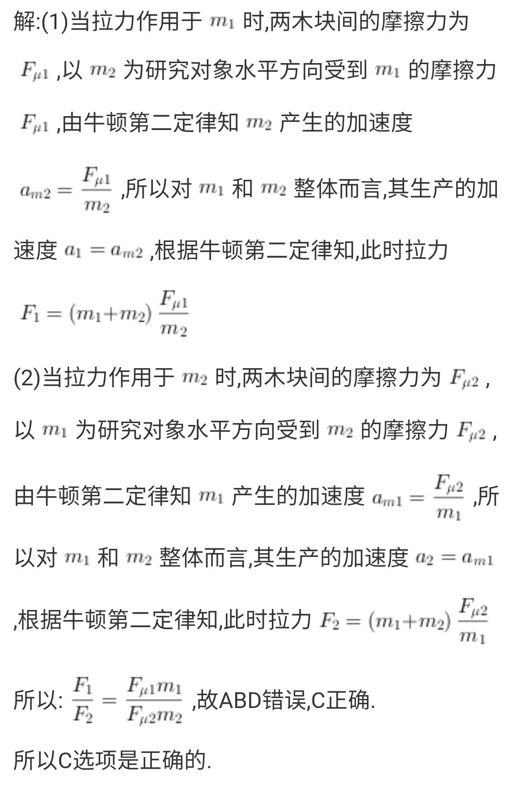
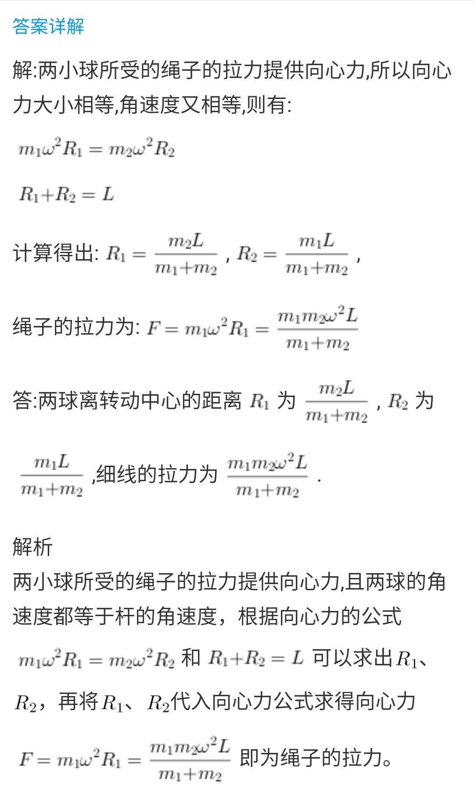

# 高中物理题

# 运动

> 
>
> > AD
> >
> > x=vt
> >
> > a=v/t
> >
> > 同向：x=7,a=6
> >
> > 反向：x=-3,a=-14

> 
>
> > B
> >
> > A：加速度是速度变化量和时间共同决定
> >
> > B：加速度：速度变化快慢
> >
> > C：不同向，方向改变
> >
> > D：同向，质点速度一定增大

> 
>
> BC
>
> A：形状大小不能忽略
>
> D：转动
>
> C：环绕地球，可以看作质点

> 
>
> > AD
> >
> > D：加速度减小时，速度增大，但比较慢

> 
>
> > B
> >
> > 设路程为3s
> >
> > t=2s/V+s/v2
> >
> > $\overline v=3s/t=28km/h$
> >
> > 联立，V=35

> 
>
> > D
> >
> > A：位移方向和运动方向不一定相同
> >
> > C：单向直线才相等

> 
>
> > **D**
> >
> > B：a表示速度的变化率
> >
> > D：加速度不变，速度变化，变化率相同，是匀变速

> 
>
> > D
>
> > ABC：根据x-a公式，位移大小至少由初速度，末速度，加速度三个物理量中的2个确定

> 
>
> > D

> 
>
> > C

> 
>
> > A

> 
>
> > BC
> >
> > D：概念不同

> 
>
> > C
>
> > AB：地球自西向东旋转，所以看到太阳东升西落。如果清晨，飞机向东飞行，飞机相对太阳向东，乘客看到仍从东升起；向西看不到，错误
> >
> > CD：看到西边升起，必须傍晚，且相对地球向西，飞机自东向西飞行速度大于地球自转速度，C正确

> 
>
> > C
>
> > AB：水平速度相同，飞机上看，物体自由落体，AB错误
> >
> > CD：有水平速度，所以是平抛，C正确

> 
>
> > 先算到刹车的时间t，再比较是否大于4s，再用
> >
> > $v^2-v_0^2=2ax$ 求出x

> 
>
> > 求a：
> >
> > $x_2-x_1=at^2$
> >
> > 第二种方法：中间时刻的瞬时速度=平均速度，算出2段平均速度，中间时间10s，x为总位移的一般，然后计算
> >
> > 求$v_0$：代公式

> 
>
> > ABC
> >
> > C：第2次到第三次闪光的位移：根据连续相等时间的位移之比：1:3:5，位移差相等，所以8-x=x-2，x=5
> >
> > D：不知道初速度是不是0开始

> 
>
> > ABC
> >
> > 
> >
> > 作差：$v_1^2-v_2^2=\frac{(v_0-v^t)^2}4>0$
> >
> > $v_1>v_2$

> 
>
> C

> 
>
> > B
> >
> > 设位移x，通过前一半位移所用时间为$t_1$，通过后一半位移所用时间为$t_2$
> >
> > $\frac x 2=\frac 1 2at_1^2$
> >
> > $x=\frac 1 2a(t_1+t_2)^2$
> >
> > 联立，$t_2=(\sqrt 2 -1)t_1$

> 
>
> $\frac{v_2-v_1}T$

> 
>
> > AB
>
> D：题目条件无法判断

> 
>
> > C

> 
>
> $\sqrt n-\sqrt{n-1}$

> 
>
> > 最后一辆刚准备出发，**第一辆最先出发，最远，第二辆第二远**
> >
> > 7:16=x:320
> >
> > x=140

> 
>
> > a=2.25
> >
> > v0=1.5

> 
>
> $\frac{2x(t_1-t_2)}{t_1t_2(t_1+t_2)}$

> 
>
> ④：2个

> 
>
> C：速度改变量：△v=at=gt=10×5=50
>
> > AB

> 

> 
>
> > AC

> 
>
> > D

## 运动学图像

> 
>
> > (1)
> >
> > A：0-2s：匀速直线，v=3m/s；2-6s：静止；6-8s：与正方向相反的匀速直线运动,v=-6m/s
> >
> > B：0-2s：匀加速直线，a=3m/s^2：2-6s：匀速直线；6-7s：匀减速，7-8s：与正方向相反的匀加速，a=(-6-6)/2=6m/s^2
> >
> > (2)
> >
> > A：
> >
> > x=-6-0=-6m
> >
> > s=6+|-6-6|=18m
> >
> > B：
> >
> > 7s时，速度为0，为正向最大位移处
> >
> > x=30
> >
> > s=36

> 
>
> 火箭上升是向上推力减向下的重力，55s后关闭发动机，意味着55s后只受重力作用，所以55-80s处为g
>
> 55-80s，a<0，但是v>0，方向向上，所以80s处为最大高度
>
> > (1) g=-240/(80-55)=-9/6
> >
> > (2) 8750
> >
> > (3)上升时间$t_1=80s$，下降时间$t_2=\sqrt{\frac{2h}{g}}=42.7s$
> >
> > $t=t_1+t_2=122.7s$

> 
>
> A：斜率k不为0，速度肯定不为0
>
> C：t1是，相交，说明到了同一位置相遇，但是t=0时位置不同，所以t1时位移不同
>
> > AB

> 
>
> D：斜率k是速度，所以Q速度一直大于P
>
> > AC

> 
>
> > BC

> 
>
> AB：都从0时刻为起点出发，所以A正确
>
> > ACD

> 
>
> C：0-4s面积为0，位移为0，所以物体一直在出发点负方向上
>
> > BD

> 
>
> 
>
> > BD

> 
>
> B：说法换成加速度先向上后向下正确
>
> > C

> 
>
> **3s末，t直接代3，而不是4**
>
> > C

> 
>
> > BCD

> 
>
> D：**v-t图，位移是面积**
>
> > C

> 
>
> D：**在物理中,加速度的正负号只是代表方向,而不是大小**
>
> > A

> 
>
> 平均速率=路程/时间
>
> D：动能增大了，合外力做正功
>
> > BC

## 自由落体

> 
>
> 不能用$△h=gt^2$，不是位移差，是一段位移
>
> > 相等时间位移比△h=1:3:5:7
> >
> > △h=5/16H
> >
> > H=3.2m
> >
> > 距离地面高度：$h_2=7/16H=1.4m$
> >
> > (2)
> >
> > $h=\frac 1 2 gt^2$
> >
> > $t=\sqrt{\frac{2h}g}=0.8s$
> >
> > 总时间0.8s，间隔4段，所以△t=0.8/4=0.2s

> 
>
> > 总时间t，1滴水下落时间：$△t=\frac {t}{n-1}$
> >
> > $h=\frac 1 2g△t^2$
> >
> > $=\frac 1 2g\frac {t^2}{(n-1)^2}$ ①
> >
> > 第一滴落下，第三滴开始下落，间隔两段，△h=1:3:5
> >
> > $h'=\frac 3 4h$
> >
> > $=\frac{3gt^2}{8(n-1)^2}$
> >
> > ①→$g=\frac{2h(n-1)}{t^2}$

> 
>
> > 方法1：
> >
> > 设总高度：h，总时间：$t_0$
> >
> > 列方程组：
> >
> > $h=\frac 1 2 gt^2$
> >
> > $h-196=\frac 1 2g(t_0-4)^2$
> >
> > 方法2：平均速度法
> >
> > 4s内中间速度=平均速度：$\overline{v_0}=196/4=49m/s$
> >
> > 4s中间时刻$t_1$, $0-t_1$的平均速度为49m/s
> >
> > 根据$v=gt$
> >
> > $t_1=\frac{v_t}g=\frac{49}{9.8}=5s$
> >
> > $t_0=5s+4/2=7s$
> >
> > $h=\frac 1 2t^2=\frac 1 2 ×9.8×7^2$

> 
>
> > 方法1：
> >
> > 算出上升时间，下降时间，加起来
> >
> > 方法2：
> >
> > 算出上升速度，列方程
> >
> > $v_0=\sqrt{2gh}=3m/s$
> >
> > a=-g
> >
> > x=-10m
> >
> > $x=v_0t-\frac 1 2gt^2$
> >
> > 求解，舍小于0的解

> 
>
> > D

> 
>
> 速率没有方向，只有大小
>
> > D 

> 
>
> **g始终向下**
>
> > BD

> 
>
> > 身体重心上升了身高的一半，0.9m
> >
> > B

> 
>
> 向上为正方向，抛出点上方，h取正；下方，h取负
>
> 下方：解方程舍去t<0的根
>
> > v=40
> >
> > x=60
> >
> > g=-10
> >
> > x=$v_0t-\frac 1 2gt^2$
> >
> > $60=40t-5t^2$
> >
> > t=2或t=6
> >
> > 如果在抛出点下方，x=-60，舍去t<0的根

> 
>
> > 方法1：
> >
> > $h=\frac 1 2gt^2$
> >
> > $h=H-△h=\frac 1 2g(T-△t)^2$
> >
> > 解方程组
> >
> > 方法2：平均速度法
> >
> > 最后4s平均速度=4s中间时刻$t_1$瞬时速度：$\overline v=196/4=49m/s$
> >
> > $t_1=\frac v g=\frac{49}{9.8}=5s$
> >
> > $t=5+4/2=7s$
> >
> > $h=\frac 1 2gt^2=240.1m$

> 

> 
>
> > 设杆下端初始位置到窗口上沿距离为h，
> >
> > $h=\frac 1 2gt^2$
> >
> > $h+2+1.45=\frac 1 2g(T+0.3)^2$
> >
> > h=5m

> 
>
> > 126.25m

> 
>
> > **B**
> >
> > ma=mg-f
> >
> > $a=\frac 1 3g$
> >
> > $f=\frac 2 3mg$

> 
>
> C：速度改变量：|-20-30|=50m/s
>
> D：5m/s
>
> > AB

## 追及和相遇

> 
>
> 速度相等，相距最远；位移相等，追上

> 
>
> △S>S：相撞
>
> △S<S：不相撞
>
> △S=S：临界
>
> ∴△S≤S：不相撞
>
> > 方法1：图像
> >
> > $△S=\frac{(v_1-v_2)t}{2}≤S$
> >
> > 临界即$v_a=v_b$时
> >
> > $v_1-at=v_2$
> >
> > $t=\frac{v_1-v_2}{a}$
> >
> > ∴ $\frac{(v_1-v_2)^2}{2a}≤S$
> >
> > ∴ $a≥\frac{(v_1-v_2)^2}{2S}$
> >
> > 方法2：
> >
> > v_a=v_b时，
> >
> > 若△≤S，则不相撞
> >
> > 即$△S=x_a-x_b$
> >
> > $=(v_1t-\frac 1 2at^2)-v_2t$
> >
> > $=(v_1-v_2)t-\frac 1 2at^2$
> >
> > ∴ $a≥\frac{(v_1-v_2)^2}{2S}$

> 
>
> > 108km/h=30m/s
> >
> > 反应时间位移：$x_1=vt=30×0.5=15$
> >
> > 刹车过程位移：$x_2=\frac{v_2}{2a}=\frac{30^2}{2×4}=112.5m$
> >
> > $x=x_1+x_2=15+112.5=127.5m$

> 
>
> > 速度相等经历时间：
> >
> > $t=\frac{v_2-v_1}{a}=\frac{6-20}{-0.8}=17.5s$
> >
> > 客车位移：$x_1=\frac{v_2^2-v_1^2}{2a}=227.5m$
> >
> > 货车位移：$x_2=v_2t=6×17.5=105m$
> >
> > $x_1>x_2+120$，会相撞

> 
>
> > 乙平均速度：$\overline v=\frac{v_2}{2}=5m/s$，A速度<B的平均速度，所以B静止时A仍未追上B
> >
> > $v_2^2=2ax_B$
> >
> > $x_B=25m$
> >
> > $x_B+S=v_1t$
> >
> > t=8s
> >
> > 经过8s追上

> 
>
> > D

> 
>
> > CD

> 
>
> > 两车v_0，a相同，所以刹车时间、位移相同，设刹车时间为t，刹车位移$s=v_0t-\frac 1 2t^2$
> >
> > 后车运动时间为2t，位移$s'=v_0t+s=v_0t+v_0't-\frac 1 2t^2$
> >
> > 所以刹车前两车相距至少为$△s=s'-s=v_0t$,
> >
> > 又因为$0=v_0-at$，所以$v_0=at$，代入$s=v_0t-\frac 1 2t^2$，
> >
> > 得$s=at^2-\frac 1 2at^2=\frac 1 2at^2$，
> >
> > 再将$v_0=at$代入$△s=v_0t$，$△s=at^2$，所以△s=2s

> 
>
> > BCD

> 
>
> 根据v-t图，乙追上甲时，x相等，图像上围成的面积相等，则$v_乙=2v_0$，但是不知道追上乙车所用时间，所以不能求出乙车走的路程
>
> > A

> 
>
> **相遇时不相撞，直接按照相遇处理**
>
> a=0.5m/s

> 
>
> D：b位移一直大于a位移
>
> > AC

> 
>
> AB：0-10s，乙速度一直大于甲，10-20s，甲速度一直大于乙，所以0-10s远离，10-20s靠近
>
> > C

> 
>
> $t_1$处刚好相遇
>
> $\frac 1 2t_1$时，根据图像，甲比乙多走$\frac 3 4S$，当初始距离$d=\frac 3 4S$时，恰巧相遇
>
> > D

> 
>
> **仔细读题：相向**
>
> > C

> 
>
> > C

> 
>
> 和$s_2$没有关系
>
> $s_1<s_0$不相遇
>
> $s_1=s_0$相遇1次
>
> $s_1>s_0$相遇2次
>
> > ABC

# 相互作用

## 重力

> 
>
> 质量不均匀的3个球，重心在球心位置分别如图，球受到Q给的弹力都指向重心

> 
>
> > C

> 
>
> > AC

> 
>
> > C

> 
>
> > ACD

> 
>
> B：磁铁不用接触
>
> D：惯性
>
> > A

> 
>
> 力是物体间的相互作用，方式可能是接触、吸引、挤压等
>
> > C

> 
>
> > C

>
>
>> AD

> 
>
> B：重力，支持力，吸引力三力平衡
>
> C：牛三：铁块对磁板压力大小=磁板对铁块支持力大小，磁板对铁块支持力大小=铁块重力与吸引力的矢量和
>
> D：是作用力和反作用力
>
> > AC

> 
>
> > C

> 

## 弹力

> 
>
> > D

> 
>
> > B

> 
>
> > B

> 
>
> B：垂直
>
> > CD

> 
>
> A：压力大小=重力
>
> 压力和支持力是相互作用力,因为它们是作用于不同物体的两个力;重力和支持力是平衡力,因为它们作用于同一物体
>
> > C

> 
>
> > C

> 
>
> > B

> 
>
> > ACD	

> 
>
> A受到向下的重力，向上的拉力，B对A向下引力和B对A向上的支持力，4力平衡，因为拉力和重力大小相等，所以B对A向下引力和B对A向上支持力相等，所以F1>0，但不一定等于mg
>
> AB当成整体， 重力2mg，向上拉力mg，还有向上支持力mg
>
> > D

> 
>
> C：对N，N弹簧不受力，所以绳子也不受力，对a，保持平衡需要M弹簧提供支持力，即M处于压缩状态，这种情况M不可能处于拉伸状态
>
> > AD

> 
>
> $F_1=k（l_0-l_1),F_2=k(l_2-l_0)$ 联立
>
> > C

## 摩擦力

> 
>
> AB：与相对运动
>
> > CD

> 
>
> (2)行李匀加速运动的时间
>
> (3)如果提高传送带的运行速率，行李能较快到B处，求行李从A传送到B的最短时间和传送带对应的最小运行速率
>
> (1)a=F/m直接计算 
>
> f=4N a=1m/s^2
>
> (2)
>
> 设行李匀加速时间为t，末速度1m/s
>
> v=at带入，t=1s
>
> (3)行李从A一直匀加速到B时，传送时间最短，则
>
> $L=\frac 1 2at_{min}^2$
>
> t=2s
>
> v=at=2m/s

> 
>
> > C

> 
>
> B：没相对运动趋势，摩擦力为0
>
> C：不知道是否光滑
>
> > AD

> 
>
> D：相对
>
> > C

> 
>
> **静止**
>
> > D

> 
>
> 如果2个摩擦力都不为0也可选
>
> > B

> 
>
> 上爬：重力和向上的静摩擦力平衡
>
> 下滑：重力和向上的滑动摩擦力平衡
>
> > C

> 
>
> 主动轮：提供动力，轮子相对地面向后走，静摩擦力，方向向前
>
> 从动轮：地面给的摩擦力向前，滑动摩擦力，向后
>
> > D

> 
>
> > ACD

> 
>
> $m_1:N_1=m_1gcosa,f_1=m_1gsina$
>
> $m_2:N_2=m_2gcosb,f_2=m_2gsinb$
>
> $m_1>m_2, cosa>cosb, sina<sinb$
>
> $N_1>N_2,f_1,f_2$无法比较
>
> 整体分析，只受重力和支持力，水平方向无运动趋势，f=0
>
> **静止**
>
> > ACD

> 
>
> A：受力平衡
>
> B：B向左匀直，$F=f_B+f$，则$f=F-f_B=F-T$，根据牛三，地面受到摩擦力≥F-T
>
> C：滑动摩擦与相对速度无关
>
> D：2F拉木板B，B开始加速，但是AB之间压力，μ不变，所以摩擦力大小不变，A受到摩擦力大小仍为T
>
> > AD

> 
>
> 3, 5

> 
>
> (2)墙壁受到压力为__
>
> > (1)匀速下滑，物体受到重力，压力，墙壁支持力和滑动摩擦力，由平衡条件得：f=mg
> >
> > (2)
> >
> > 根据滑动摩擦力公式：f=μN
> >
> > 得出$N=\frac{mg}{μ}$

> 
>
> > 支持力和摩擦力，10N，14.6N

> 
>
> > 100N

> 
>
> > B

> 
>
> > D

> 
>
> > A

> 
>
> > A

# 受力分析

## 受力分析

## 力的合成

> 
>
> > B

> 
>
> > C

> 
>
> > A

> 
>
> > A

> 
>
> > C

> 
>
> > B

> 
>
> > D

> 

> 
>
> > ABD

> 

## 力的分解

> 
>
> > A

> 
>
> > A

> 
>
> 正交分解：F1，F2夹角只能为直角
>
> > A

> 
>
> > BC

> 
>
> 定滑轮不改变力的大小
>
> > AB

> 
>
> > D

> 
>
> > $F_Acos60°=F_B$
> >
> > $F_Bsin60°=G$
> >
> > $F_A=\frac{2\sqrt3}{3}G=，F_B=\frac{\sqrt 3}{3}G$
> >
> > 带入G=100

> 
>
> 别忘记Fn
>
> > B

> 
>
> 分解mg为左下的F2，向右的F1即可
>
> > D

> 
>
> Fn反向延长，和mg，F放在一个矩形最直观
>
> F=mg/tanθ
>
> Fn=mg/sinθ
>
> > A

> 
>
> μ不能用，因为没有滑动
>
> > A

> 
>
> $F_合=mg=10N$
>
> 根据合力公式，得最大夹角120°，细绳和竖直夹角为60°，
>
> 1/2sin60°即可
>
> > A

> 
>
> > B

> 
>
> 作受力分析图，绳和竖直方向角度为θ
>
> mg=2Fcosθ
>
> A：θ>60°，$F_A>G$
>
> C：不在同一直线无法平衡，不是一对平衡力，加上重力才能保持平衡
>
> D：力的合成为矢量合成，不能加减大小
>
> > B

# 牛顿运动定律

## 牛一

> 乘坐热气球飘在空中，由于地球自转，一昼夜就能周游世界：不可行

> 
>
> > C

> 
>
> (1)
>
> 静止或匀直
>
> (2)
>
> 向左匀减速或向右匀加速
>
> (3)
>
> 向左匀加速或向右匀减速

> 
>
> > BD

> 
>
> > CD

> 
>
> > BCD

> 
>
> 
>
> > C

> 
>
> 惯性减小，运动状态易改变

> 
>
> B：上抛最高点受力不平衡
>
> > AC

> 
>
> > A

> 
>
> > A

> 
>
> > D

> 
>
> > CD

> 
>
> > C

> 
>
> AB：称质量
>
> C：弹簧秤称重力
>
> 两极重力比赤道重力大
>
> > AC

> 
>
> $t=\sqrt{\frac{2g}{h}}$
>
> $v^2=2gh, v=\sqrt{2gh}$
>
> > C

> 
>
> 没摩擦力，斜面体abc下滑时，小球只受重力和支持力，合力竖直向下，所以碰到斜面之前竖直下落
>
> > C

> 
>
> > D

> 
>
> A：合外力越大，a越大，但速度不一定越大，静止到受力可能a很大，v很小
>
> > D

> 
>
> 速度与倾角有关
>
> > B

> 
>
> 开始受3个力平衡，则有f=F1-F2=10-2=8N
>
> 物体处于静止状态，说明最大静摩擦力大于等于8N，
>
> 撤去F1，外力为2N，小于8N，所以物体仍处于平衡，合力为0
>
> > D

> 
>
> **不正确的**
>
> > A

> 
>
> > BC

> 
>
> > C

> 
>
> 不受外力，物体保持静止或匀直
>
> > C

> 
>
> > A

> 
>
> A 不符合牛一
>
> > C

> 
>
> > AD

> 
>
> > A

> 
>
> > B

> 
>
> > C

> 
>
> 物体大小，形状相对研究的问题可以忽略不计，物体可以看作质点，是理想化模型
>
> 绝对光滑水平面不存在，也是理想化模型
>
> > AB

> 
>
> > B

> 
>
> > B

> 
>
> > D

> 
>
> > bcad
> >
> > B

## 牛二

> 
>
> CD应是加速度，不是速度
>
> > C

> 
>
> 

> 
>
> > 受力分析：刚接触弹簧为A点，压缩到最大为B点，接触弹簧到压缩最大，中间有个O点是平衡状态，合力为0
> >
> > A到O：a↓，加速直线，$mg>F_N,F_合=mg-kx$
> >
> > O：合力为0，a=0，v到最大值
> >
> > O到B：a↑，减速直线，$mg<F_N,F_合=kx-mg$，是最低点，v=0

> 
>
> > B

> 
>
> 地面有摩擦力，没说忽略摩擦力
>
> > $F_1=μm_1g+m_1a$
> >
> > $F_2=μm_2g+m_2a$
> >
> > 分别提$m_1,m_2$，两式相除，化简，得
> >
> > $F_1:F_2=m_1:m_2$
> >
> > 然后计算$F_2$

> 
>
> C：片面，力和加速度应该同时
>
> > A

> 
>
> > CD

> 
>
> > C

> 
>
> A：合力与a，m无关
>
> B：物体质量与受力无关
>
> > CD

> 
>
> > D

> 
>
> > C

> 
>
> > A

> 
>
> > A

> 
>
> > C

> 
>
> 开始时，匀直，F=f，F减小，F<f，合力方向与运动方向相反，牵引力减小，合力增大，a增大
>
> > D

> 
>
> > BCD

> 
>
> > BD

> 
>
> > C

> 
>
> C

>
>
>> BCD

> 
>
> > 0.5N
> >
> > 3.5m/s^2

> 
>
> > (1)
> >
> > 水平：f=Fcosθ
> >
> > 竖直：N=Fsinθ+mg
> >
> > 根据f=μN
> >
> > 得$μ=\frac{Fcosθ}{Fsinθ+mg}=0.5$
> >
> > (2)
> >
> > F-μmg=ma
> >
> > a=5m/s^2s

> 
>
> > A

> 
>
> > AD

> 
>
> > B

> 
>
> > D

> 
>
> > $Fcos60°=μ(mg-Fsin60°)$
> >
> > $Fcos30°=μ(mg-Fsin30°)$
> >
> > 联立
> >
> > B

> 
>
> 木块和斜面体有相对滑动，但无相对加速度，可以当做两物体间相对静止，摩擦力达到最大静摩擦力
>
> > A

> 
>
> b受重力，支持力，弹簧拉力和绳的拉力，剪断绳的瞬间，绳的拉力消失，但弹簧拉力瞬间不变，b受摩擦力方向向右
>
> > AD

> 
>
> D：方向可能改变
>
> > AC

> 
>
> > CD

> 
>
> A：a方向
>
> B：可能为0，比如火箭发射瞬间
>
> D：合外力方向和v方向相同时加速
>
> > C

> 
>
> > A

> 
>
> 摩擦力产生加速度
>
> > C

> 
>
> 设物体A质量为m，根据牛二，
>
> F1=ma1=5m,F2=ma2=m
>
> F1，F2合力范围：4m≤F≤6m
>
> 然后求a
>
> > C

> 
>
> > D

> 
>
> > 0.8kg

## 牛三

> 
>
> 被拉动是因为F>f
>
> > C

> 
>
> C：下落的物体受重力，不接触
>
> > D

> 
>
> 小磅秤：$F_N=mg+T_1$
>
> 大磅秤：$F_N=Mg+mg+T_1-T_1$ 对大木箱而言，重力不是mg，要减去人向上的作用力
>
> > D

> 
>
> > A：受到弹力，摩擦力，重力：3对作用力与反作用力
> >
> > B：重力，B给A的弹力，给A的摩擦力，斜面给B的摩擦力，外力，支持力：6对

> 
>
> 哪个弹簧形变量最大？
>
> > 一样大。都是F，不管左边是是什么，x=F/k。1 2情况相同，3 4相比3的a比4大

> 
>
> 压力和支持力是相互作用力,因为它们是作用于不同物体的两个力;重力和支持力是平衡力,因为它们作用于同一物体
>
> > A

> 
>
> > D
>
> > B

> 
>
> > D

> 
>
> 平衡力：同一物体
>
> D：分解的力是作用效果，不是实际存在的
>
> > B

> 
>
> > A

> 
>
> 牛三：两车之间拉力大小相等，有拉力后两车同时受力同时运动。
>
> 拉力相等，根据牛二，m大的a小，v=at可得，v大的m小，有人的车厢质量大，运动慢
>
> > C

> 
>
> AB：竖直方向受重力和墙对木块的静摩擦力，是一对平衡力
>
> C：水平方向受外力F和墙对木块的支持力，是一对平衡力
>
> > AD

> 
>
> **物体与皮带间的，有支持力和静摩擦力**
>
> > B

> 
>
> a减小为0，但是v没有
>
> > B

> 
>
> > BC

> 
>
> 匀速时：f=F1=6N
>
> > 2m/s 
> >
> > 0.3

> 
>
> > 受到阻力后a=F/m=8/3
> >
> > 设原来速度为v，对速度减半过程，由$v^2-v_0^2=2ax$，
> >
> > 得$(\frac v 2)^2-v^2=2(-a)x$,
> >
> > $v=\sqrt{\frac{8ax}3}=8m/s$
> >
> > 所以减速运动时间：t=v/a=8/(8/3)=3s

> 
>
> > 重力，弹力，支持力，摩擦力
> >
> > 物体对地球的吸引力 地球
> >
> > 弹力 物体
> >
> > 桌面 水平向右
> >
> > 物体受到的弹力

> 
>
> > C

> 
>
> A：作用力和反作用力
>
> B：桌面对A的摩擦力水平向左
>
> C：作用力和反作用力，但不平衡
>
> D：平衡力
>
> > B

> 
>
> 由于质量不可忽略，当加速启动时，钢绳有合外力，牛二得，摩托车拉钢绳的力大于货物拉钢绳的力
>
> 摩托车匀速行驶时，钢绳处于平衡状态，摩托车接钢绳的力=货物拉钢绳的力，而货物拉钢绳的力与钢绳拉货物的力是一对作用力和反作用力，大小相等
>
> > AB

> 
>
> > 不对，是飞机向后喷出的气体，飞机给气体向后的力，气体给飞机向前的力
> >
> > 小鸟飞行时，翅膀对空气产生作用力，而空气对翅膀产生反作用力，所以小鸟就可以飞行了。

> 
>
> > BD

> 
>
> k的大小由F/ma的单位规定决定
>
> > ABD

> 
>
> AD

> 
>
> > D

> 
>
> B：要防止的，不是利用
>
> > B

> 
>
> > D

> 
>
> > C

> 
>
> C：物体受重力，支持力，摩擦力作用，支持力和静摩擦力施力物体是斜面，故斜面对物体的力是这两个力的合力，与重力二力平衡
>
> > B

> 
>
> > C

> 
>
> > D

> 
>
> > D

> 
>
> > C

> 
>
> 摩擦力小于拉力

## 应用——共点力平衡问题

> 
>
> > 整体：
> >
> > $F-μm_1g-μm_2g=0$
> >
> > 对2：
> >
> > $F-F'1-μm_2g=0,F'=kx$
> >
> > 可得：
> >
> > $kx=μm_1g$
> >
> > 解得：
> >
> > $x=\frac{μm_1g}{k}$
> >
> > 所以距离为$L+x=L+\frac μ k m_1g$
>
> > A

> 
>
> 
>
> > $2Fcos30°=m_1g$
> >
> > $2m_2g\frac{\sqrt 3}2=m_1g$
> >
> > $m_1:m_2=\sqrt 3$
>
> > A

> 
>
> AB：是可能，就正确
>
> A：当静摩擦力沿斜面向上时，有T+f=mgsinθ，加上水平恒力相当于增加绳子的拉力T，静摩擦力f会减小
>
> B：当静摩擦力沿着斜面向下时，有T=f+mgsinθ，加上水平衡力相当于增加绳子的拉力T，静摩擦力f会增加
>
> CD：由于物体静止不动，所以轻绳向上拉力始终=P物体的重力
>
> > D

> 
>
> 未加F时，木块A在水平地面受弹簧弹力F，和静摩擦力$F_A$作用，且$F_2=F_B=kx=F_A=F_A=kx=8N$，
>
> 木块B在水平地面上受弹簧弹力$F_2$和静摩擦力$F_B$作用，且$F_2=F_B=kx=8N$，在木块B上施加F后，由于$F_2+F<μG_B$，故木块B仍静止，所受摩擦力仍未静摩擦力，大小$F_B=F_2+F=9N$，木块A受力情况不变
>
> > C

> 
>
> C：不受外力保持静止或匀直，受到外力，运动状态改变，正确
>
> > A

> 
>
> Q向右的摩擦力，P受到Q向左的摩擦力，P受到桌面的2μmg
>
> > A

> 
>
> 
>
> > D

> 
>
> 受力分析：
>
> 因为物体匀速运动，水平竖直均受力平衡：
>
> $Fcosθ=μ(mg-Fsinθ)$
>
> 得$F=\frac{μmg}{cosθ+μsinθ}=\frac{μmg}{\sqrt{1+μ^2}sin(α+θ)}$，可知F有最小值，先减小后增大。
>
> F功率：
>
> $P=Fvcosθ=\frac{μmgcosθ}{cosθ+μsinθ}=\frac{μmgv}{1+μtanθ}$，θ增大，tanθ增大，所以功率一直减小
>
> > AC

> 
>
> 整体分析，有竖直方向：
>
> $Fsinθ+N=(m_1+m_2)g$，则
>
> $N=m_1g+m_2g-Fsinθ$
>
> 水平方向：f=Fcosθ，所以AC正确
>
> > AC

> 
>
> 还有弹簧对P的弹力
>
> > C

> 
>
> 恰好静止：说明斜面对物块的摩擦力=最大静摩擦力，
>
> 受力分析：
>
> f=mgsinθ
>
> N=mgcosθ
>
> f=μN
>
> mgsinθ=μmgcosθ
>
> 施加F时：
>
> 斜面垂直方向：$N=(mg+F)cosθ$
>
> 因而最大静摩擦力为：$f=μN=μ(mg+F)cosθ=(mg+F)sinθ$，
>
> 故合力仍为0，物块静止，
>
> 摩擦力由mgsinθ增大到(F+mg)sinθ

## 应用——动力学两类问题

> 
>
> > 受力分析：
> >
> > $F_合=F-mgsinθ-f$
> >
> > $f=μmgcosθ$
> >
> > 由牛二：
> >
> > $a=\frac{F_合}m=2.4m/s^2$
> >
> > v=at=12m/s
> >
> > $x=\frac 1 2at^2=30m$

> 
>
> > 受力分析：
> >
> > $F_N=mg-Fsinθ$
> >
> > $f=μF_N$
> >
> > $F_合=Fcosθ-f$
> >
> > $F_合=ma=Fcosθ-μ(mg-Fsinθ)$
> >
> > 可知为匀变速
> >
> > $a=\frac{v^2-v_0^2}{2x}=0.2m/s^2$
> >
> > 可知为匀减速
> >
> > 
> >
> > $F=\frac{m(a+μg)}{(cosθ+μsinθ)}≈0.44N$

> 
>
> (1)μ？
>
> > 撤去F前，匀速：
> >
> > F=μmg
> >
> > μ=0.2
> >
> > 撤去F后：
> >
> > $a=\frac f m=2m/s^2$
> >
> > $x=\frac{v^2}{2a}=4m$

> 
>
> > 50N

> 
>
> **斜面上的物体，沿斜面的合力减去摩擦力，还有物体mg沿斜面的分力**
>
> > $F_合=F-μmgcosθ-mgsinθ=0.4$
> >
> > $v=at=2$
> >
> > $x_1=\frac 1 2at^2=5$
> >
> > 撤去F后：
> >
> > $a=\frac{μmgcosθ+mgsinθ}m=g(sinθ+μcosθ)=7.6$
> >
> > 上滑距离：$x_2=\frac{v^2-v_0^2}{2a}≈0.26m$
> >
> > 最远距离：$x=x_1+x_2=5.26m$

> 
>
> > 设撤去F前位移$x_1$，受到：
> >
> > $f=μmg, a_减=μg=2m/s^2$
> >
> > $x-x_1=\frac 1 2at^2=4m$
> >
> > 所以$x_1=1m$
> >
> > 物块全程用动能定理：
> >
> > $Fx_1-fx=0$
> >
> > F=15N

> 
>
> 上抛到最高点，合力不为0，速度为0
>
> 合外力方向是a方向，和v方向没直接关系
>
> > CD

> 
>
> 牛二：F-mg=ma，因为a>g，所以F>2mg，手突然停止向上运动时，弹力开始见效，当弹簧弹力=重力时，a=0，物体因为惯性继续上升，此时弹力<重力，a反向增大
>
> > C

> 
>
> 
>
> > C

> 
>
> 设牵引力为F，洒水车质量m，阻力为kmg，根据牛二：
>
> F-kmg=ma
>
> $a=\frac F m-kg$
>
> 开始时F=kmg，a=0, 随着m↓，a↑，所以a逐渐增大
>
> > D

> 
>
> 三力平衡，$F_2⊥F_3$，合力大小与$F_1$大小相同方向相反。由牛二，F=ma，物体质量不变，a方向与受力方向一致。所以三个力单独产生的加速度也遵循适量三角形法则，则去掉$F_3$，a=2
>
> > B

> 
>
> > BD

> 
>
> > $\frac{F_3}m$
> >
> > 方向与$F_3$相反

> 
>
> > $ma_1=F-μmg$
> >
> > $ma_2=\frac F 2-μmg$
> >
> > F=6
> >
> > μ=0.2

> 
>
> (2)A到B时间最短，a为多少？
>
> > (1)t=6s
> >
> > 

## 应用——超重和失重

> 
>
> > 地面：
> >
> > $F=m_1g=800N$
> >
> > 升降机：举起120kg，可得物体失重，升降机有向下的a，对重物：
> >
> > $m_2g=F=m_2a$
> >
> > $a=\frac{m_2g-F}{m_2}=3.33m/s^2$
> >
> > 以3.33m/s^2的加速度加速下降/减速上升

> 
>
> > 起重机最大拉力：$F_拉=1.4·10^4·10=1.4·10^5N$
> >
> > 加速上升，物体超重：
> >
> > F=mg+ma
> >
> > F=1100N
> >
> > $F<F_拉$
> >
> > 所以不会断裂

> 
>
> > 物体没有滑动，最大静摩擦力=滑动摩擦力，
> >
> > 减小物体对地面的压力，物体开始滑动
> >
> > $f=μN$
> >
> > $F_拉=k△x<f$
> >
> > 超重：$F_n>mg→F_拉<μN$，不能拉动
> >
> > 失重：$F_n<mg→F_拉≥μN$，可以拉动
> >
> > $mg-N=ma$
> >
> > $F_拉≥μN$
> >
> > $a≥\frac{mg-\frac{k△x}{μ}}{m}=\frac{g-k△x}{μm}$

> 
>
> 

> 
>
> > (1)作v-t图求面积
> >
> > (2)求出三段位移相加
> >
> > 0-2加速上升
> >
> > $F_1-mg-ma_1$
> >
> > $h_1=\frac 1 2a_1t_1^2$
> >
> > $v_1=a_1t_1$
> >
> > $v_1=10m/s, h_1=10m$
> >
> > 2-5s匀速上升
> >
> > $h_2=v_1t_2=30m$
> >
> > 5-7s减速上升
> >
> > $mg-F_3=ma_3$
> >
> > $a_3=5m/s^2$
> >
> > $t_3=\frac{v_1}{t_3}=2s$
> >
> > $t_1=t_3$，所以7s末电梯速度恰好为0
> >
> > $h_3=\frac 1 2v_1t_3=10m$
> >
> > 总位移：$h=h_1+h_2+h_3=50m$

> 
>
> > BD

> 
>
> 抛出时，阻力和重力同方向，速度最大，阻力f=kv最大，所以合力最大，a最大
>
> 子弹最高点时只受重力作用，阻力为0，a=g，落地时速度到达下降阶段最大，向上阻力最大，和重力合力最小，a最小
>
> > AC

> 
>
> > BD

> 
>
> > B

> 
>
> > (1)
> >
> > mg-F=ma
> >
> > $m=\frac{F}{g-a}=\frac{600}{10-5}=120kg$
> >
> > (2)
> >
> > F-mg=ma
> >
> > $a=\frac{F-mg}{m}=5m/s^2$
> >
> > 向上匀加速/向下匀减速

> 
>
> 0-2：$a_1=2,F_支-mg=ma_1$
>
> 5-8：$a_2=0，F_支=mg$
>
> 10-12：$a_3=-1，,mg-F_支=ma_1$
>
> 600
>
> 500
>
> 450

> 
>
> 绳子断裂后，拉力消失，箱子只受重力作用，和物体做自由落体运动，a=g，完全失重，箱子和物体之间没有力的作用
>
> > B

> 
>
> > F

> 
>
> > B

> 
>
> 失重，不受力
>
> > D

> 
>
> > BC

> 
>
> 物体：
>
> mg-T=ma
>
> 得，绳子拉力T=m(g-a)
>
> 人：
>
> N=mg-T=Mg-m(g-a)=(M-m)g+ma
>
> 根据牛三，人对地面压力N'=N
>
> > C

> 
>
> > 2.5 48
> >
> > $m_1g-F=m_1a_1$
> >
> > $a_1=g-\frac{F}{m_1}=10-600/80=2.5$
> >
> > 电梯匀加速上升：
> >
> > $F=m_2g=m_2a_2$
> >
> > $m_2=\frac{F}{g+a_2}=48$

> 
>
> > 10kg
> >
> > 8m 8m/s
> >
> > 260N

## 连接体问题

> 
>
> > 整体法：$a=\frac{F}{m_A+m_B}$
> >
> > 左：隔离B：
> >
> > $N_1=m_Ba$
> >
> > $N_1=\frac{m_B}{m_A+m_B}·F$
> >
> > 右：隔离A：
> >
> > $N_2=m_Aa$
> >
> > $N_2=\frac{m_A}{m_A+m_B}·F$
>
> > ACD

> 
>
> > 整体法：
> >
> > $F-f_D=(m_A+m_B)a$
> >
> > $f_D=μ(m_A+m_B)g$
> >
> > $a=\frac{F-μ(m_A+m_B)g}{m_A+m_B}$
> >
> > 隔离A：A受mg，支持力，向右的f
> >
> > $f_A=m_Aa$
> >
> > $f_A=\frac{m_A}{m_A+m_B}[F-μ(m_A+m_B)g]$
> >
> > $=\frac{m_AF}{m_A+m_B}-μm_Ag$

> 
>
> > 先隔离$m_1,a_1=\frac{F}{m_1}=3m/s^2$
> >
> > 隔离$m_2，a_2=\frac {F}{m_2}=2m/s^2$
> >
> > 整体法：$a=\frac{F}{m_1+m_2}$
> >
> > 代入$a_1,a_2$
> >
> > $F_1=15N,F_2=10N$
>
> > AD

> 
>
> 静止：
>
> 
>
> (2)α不变，a≠0，$T_b=0$时
>
> 
>
> 

> 
>
> B：不知道具体数值无法判断
>
> D：仅根据作用力大小无法判断
>
> AC：扫题
>
> > AC

> 
>
> > BC
>
> > 整体：
> >
> > $(M+m)a=(M+m)gsinθ-μ_1(M+m)gcosθ$
> >
> > a=g(sinθ-μ_1cosθ)
> >
> > 设A对B摩擦力方向沿斜面向下，大小为f，则
> >
> > mgsinθ+f=ma，则
> >
> > $f-ma-mgsinθ=-μ_1mgcosθ$，负号表示摩擦力沿斜面向上

> 
>
> > 匀速：都受力平衡，
> >
> > A必然没有水平方向的摩擦力，$f_A=0$
> >
> > B受到向右的拉力，又受力平衡，必然C给B的摩擦力向左，因此BC间的摩擦力$f_B=F$
> >
> > C除了受到B给向右的摩擦力，还受到桌面向左的摩擦力，又受力平衡，因此C和桌面的摩擦力$f_C=F$
> >
> > 
> >
> > 匀加速：
> >
> > A必然受到B给的向右的摩擦力，大小是ma，即AB间的摩擦力$f_A=ma$
> >
> > 设桌面与C的摩擦力为$f_C$，整体而言：
> >
> > $F-f_C=3ma$
> >
> > 所以C与桌面摩擦力大小为$f_C=F-3ma$
> >
> > 对C而言，还收到B给的向右的摩擦力$f_B$，对C：
> >
> > $f_B-f_C=ma$
> >
> > 则BC间的摩擦力$f_B=f_C+ma=F-2ma$

> 
>
> > BD

> 
>
> > 解析：先整体求a，然后隔离求AB间的作用力
> >
> > 整体：
> >
> > $F_1-F_2-μm_Ag-μm_Bg=(m_A+m_B)a$
> >
> > $a=\frac{F_1-F_2}{m_A+m_B}-μg$
> >
> > A：A水平方向受推力$F_1$，B对A的作用力N，地面摩擦力
> >
> > $F_1-μm_Ag-N=m_Aa$
> >
> > 
> >
> > $N=F_1-μm_Ag-m_Aa$
> >
> > $=F_1-\frac{m_A(F_1-F_2)}{m_A+m_B}$

> 
>
> $N_1=50N$
>
> $N_2=20N$
>
> (3) 2

> 
>
> > B

> 
>
> > 对m：要产生滑动摩擦，$a=F_N/m=6/2=3m/s^2$
> >
> > 整体：$F-μ(m+M)=(m+M)a$
> >
> > F=16.5N

> 
>
> 一车西瓜的a都是相互的，m的加速度也是a，m产生的加速度是合外力的结果，所以是ma
>
> > B

> 
>
> > 整体：$a=\frac{F}{m_A+m_B}$
> >
> > $a=4m/s^2$
> >
> > 对B：
> >
> > $N=m_Ba=12N$

> 
>
> > A

> 
>
> > AC

> 
>
> > (2)
> >
> > $k=\frac F x=\frac{mg}{l}=gk_斜=0.250N/m$

> 
>
> D：当O位置确定，弹簧测力计A示数也确定，由于重物重力确定，两力大小与方向均一定因此弹簧测力计B的大小与方向也一定，不需要改变拉力多次试验
>
> > 3.60N
> >
> > D
> >
> > (3)
> >
> > ① 改变弹簧测力计B拉力的大小
> >
> > ② 减小重物M的质量（或换更大量程的弹簧测力计）

## 瞬时性问题

> 
>
> 
>
> > 平衡时：
> >
> > $F_N=mg=kx$
> >
> > 下拉后：
> >
> > $F_N'=k(x+△x)$
> >
> > $a=\frac{F_N'-mg}{m}$
> >
> > $=\frac{k(x+△x-mg)}{m}$ 第一步mg=kx，约掉
> >
> > $=\frac{k△x}{m}$
> >
> > （$F_合=k△x$）
> >
> > 得a=2.5
>
> > A

> 
>
> > C

> 
>
> > 烧断前：
> >
> > 乙：mg=T
> >
> > 甲：向上：2mg，向下：mg+T=2mg
> >
> > 后：
> >
> > 乙：只有mg，a=g，↓
> >
> > 甲：向上2mg，向下的mg，合力mg，a=g，↑
>
> > B

> 
>
> > 
> >
> > 
> >
> > 弹簧问题：
> >
> > μ=0时，形变→恢复，加速度减小的加速直线运动，恢复原长速度最大
> >
> > μ≠0时，加速度减小的加速直线运动，a=0时v有最大值，得kx=μmg时速度最大，得，恢复原长之前的O’点速度已经最大，是平衡位置，过了O’，弹力<f，题中，加速度向左，越来越大
>
> > D

> 
>
> > B 

> 
>
> > 0
> >
> > F/m
> >
> > a减小的加速直线运动

> 

> 
>
> 轻杆连接AB，突然抽走C，A B的加速度是多少？
>
> > 抽走后，物体自由落体，$F_N$和N消失
>
> 换成弹簧：
>
> 
>
> > A：a=0
> >
> > B：N消失，a=2g，↓

## 临界问题

> 
>
> > $F>g(μ_1+μ_2)(m+M)$

> 
>
> 
>
> 整体：$a=\frac{F_合}{m+M}$
>
> 隔离m：$a=\frac{F_合}{m}=\frac{mgtanα}{m}=gtanα$
>
> 所以  $F_0=(m+M)gtanα$
>
> $F>F_0$：a大，物体沿斜面上飞
>
> $F<F_0$：a小，物体沿斜面下滑

> 
>
> > 
>
> > →a
> >
> > 
> >
> > ma=Tcosα-Nsinα ①
> >
> > mg=Tsinα+Ncosα ②
> >
> > α不变时，当a变大：
> >
> > * N不变，T增大：①可行，②：左边不符合mg不变
> > * T不变，N减小：①可行，②同上
> > * T增大，N减小：可行
> >
> > T增大，N减小→临界现象：N=0
> >
> > $ma_0=Tcosα$ 
> >
> > mg=Tsinα 
> >
> > $a_0=\frac{mgtanθ}{m}=g$
> >
> > 
> >
> > 结论：
> >
> > a<g：N≠0，小球未离开斜面
> >
> > a=g：N=0，小球未离开斜面
> >
> > a>g：小球飞起离开斜面，其中α减小，满足：ma=Tcosα mg=Tsinα
> >
> > 

> 
>
> > 光滑时：
> >
> > T=ma
> >
> > $a=\frac T m$
> >
> > $F_1=2ma=\frac{2mT}m=2T$
> >
> > 粗糙时：
> >
> > $T=ma+f$
> >
> > $a=\frac{T-f}{m}$
> >
> > $F_2=2ma+2f=\frac{2m(T-f)}m+2f=2(T-f)+2f=2T$
> >
> > 所以$F_1=F_2$
>
> > B

> 
>
> > 不滑落，在车上达到速度一样，就是相对静止，
> >
> > μmg=ma
> >
> > a=μg
> >
> > 由$v^2-v_0^2=2ax$，初速度为0
> >
> > $a=\frac{v^2}{2x}$
> >
> > 由μmg=ma，μg=a，带入a
> >
> > $x=\frac{v^2}{2μg}$

> 
>
> > 设斜面与水平方向夹角为α（取锐角），受力分析，当球对水平扯面的压力为0时为临界条件，此时小球的加速度最大。
> >
> > 设斜面对小球支持力为F，受力分析：
> >
> > Fsinα=ma
> >
> > a=gtanα（问题：扫题联立没有数据）
> >
> > a不得超过gtanα

> 
>
> 对照相机受力分析，受重力，3个支架的支持力，3个支架平衡力的合力应=重力，即3Fcosθ=mg
>
> $F=\frac{2\sqrt 3}{9}$
>
> > C

> 
>
> > BD

> 
>
> 斜面匀加速→平面匀减速
>
> v-t图：2段倾斜直线
>
> a-t图：2段水平线
>
> f-t图：2段水平线，水平面摩擦力大
>
> s-t图：物体匀加速阶段，$x=\frac 1 2 at^2$，应是抛物线，不是直线
>
> > C

> 
>
> > AD

## 其他

> 质量m的物体，受水平力F的作用，在粗糙的水平面运动，正确的是**ACD**
>
> A. 如果物体做加速直线运动，F一定做正功
>
> B. 如果物体做减速直线运动，F一定做负功：可能同向或者反向
>
> C. 如果物体做减速直线运动，F可能做正功
>
> D. 如果物体做匀速直线运动，F一定做正功

> 用力将重物竖直提起，先从静止开始匀加速上升，然后匀速上升。如果前后两过程的运动时间相同，不计空气阻力，则
>
> A. 加速过程中拉力做的功>匀速过程中拉力做的功
>
> A. 加速过程中拉力做的功<匀速过程中拉力做的功
>
> A. 加速过程中拉力做的功=匀速过程中拉力做的功
>
> **D. 上述三种情况都有可能**

> 质量0.5kg的物体从高处自由下落，下落前2s内重力队物体做功是多少？这2s内重力对物体做功的平均功率是多少？2s末，重力对物体做功的即时功率是多少？
>
> > $h=\frac 1 2 gt^2=20m$
> >
> > W=mgh=5*20=100J
> >
> > 平均功率：$P=\frac W t=100/2=50W$
> >
> > 
> >
> > 2s末速度：v=gt=10*2=20m/s
> >
> > 重力做功的瞬时功率：$P=mgv=0.5*10*20=100w$

> 质量2000kg，额定功率80kW的汽车，在平直公路行驶的最大速度为20m/s，若汽车从静止开始做匀加速直线运动，$a=2m/s^2$,运动中的阻力不变。求：
>
> ① 汽车所受阻力的大小
>
> ② 汽车做匀加速运动的时间
>
> ③ 3s末汽车的瞬时功率
>
> ④ 汽车在匀加速运动中牵引力所做的功
>
> > ① 
> >
> > P=fv 
> >
> > $f=\frac P v=80000/20=4000N$
> >
> > ②
> >
> > F-f=ma
> >
> > $F=f+ma=4000+2×10^3×2=8000N$
> >
> > ∴ 匀加速运动的最大速度：$v=\frac P F=10m/s$
> >
> > 匀加速运动的时间：t=v/a=10/2=5s
> >
> > ③
> >
> > 3s末速度：v=at=2*3=6m/s
> >
> > 瞬时功率：P=Fv=8000×6=48000w=48kW
> >
> > ④
> >
> > ∵ 匀加速时间为5s，
> >
> > ∴ 匀加速位移：$x=\frac 1 2at^2=25m$
> >
> > 牵引力做功：W=Fs=80000*25=200000J

> 铁路提速。列车阻力与速度平方成正比，即$F_f=kv^2$
>
> ① 计算列车分别以120km/h, 40km/h的速度行驶时，机车功率大小的比值
>
> ② 举例其他需要解决的技术问题，例如，为了减少列车在高速行驶中的振动，需要把原先的有缝轨道改为无缝轨道。举例说明
>
> >①
> >
> >∵ $F_f=kv^2$， 
> >
> >∴ $P=Fv=kv^3$
> >
> >∴ $p_1=27p_2$
> >
> >② 向心力$F=m\frac{v^2}r$，可知，m，v一定时，半径越大，向心力越小。火车速度越大，需向心力越大，通过增大弯道半径，减小向心力

> 机车从静止开始沿平直轨道做匀加速运动，所受阻力不变。在此过程中，正确的是**AD**
>
> A. 机车输出功率逐渐增大
>
> B. 机车输出功率不变
>
> C. 任意两相等时间内，机车动能变化相等
>
> D. 在任意两相等的时间内，机车动量变化大小相等

> 一个25kg的小孩从高度3m的话题顶端静止开始滑下，滑到底端速度为2m/s，关于力对小孩做的功，下列正确的是_
>
> **A. 合外力做功50J**
>
> B. 阻力做功500J：-700J
>
> C. 重力做功500J：750J
>
> D. 支持力做功50J：与位移垂直，不做功

> v-t图，速度增大，合外力做正功，速度减小，合外力做负功

> 宋晓磊：4页6题

> 质量1kg的质点静止于光滑水平面上，t=0开始，第1s内收到2N的水平外力，第2s收到同方向的1N的外力作用，正确的是**AD**
>
> A. 0-2s内外力的平均功率是9/4w
>
> B. 第2s内外力做功5/4J
>
> C. 第2s末外力的瞬时功率最大
>
> D. 第1s内与第2s内质点动能增加量的比值是4/5

> 车总质量920kg，16s内从静止加速到100km/h(27.8m/s)，收到恒定阻力1500N，假设它做匀速直线运动，动力系统提供的牵引力为**3100**N，最高时速120km/h(33.3m/s)做匀速直线运动时，动力系统输出功率为**50**kw.

> 塔式起重机，在起重机将质量m=5×10^3kg的重物竖直吊起的过程中，重物由静止开始向上匀加速直线运动，加速度a=0.2m/s^2，当起重机输出功率达到允许的最大值时，保持该功率知道重物做$v_m=1.02m/s$的匀速运动，取g=10，不计额外功，求：
>
> （1）起重机允许输出的最大功率
>
> （2）重物做匀加速运动所经历的时间和起重机在第2s末的输出功率
>
> > 5.1×10^4W
> >
> > 5s 2.04×10^4W

> 完全弹性碰撞/能量动量双守恒碰撞/没有能量损失的碰撞
>
> $\frac 1 2 m_1v_{10}^2+\frac 1 2m_2v_{20}^2=\frac 1 2m_1v_1^2+\frac 1 2m_2v_2^2$
>
> > =>$v_{10}-v_{20}=v_2-v_1$
>
> $m_1v_{10}+m_2v_20=m_1v_1+m_2v_2$
>
> $v_{10}+v_1=v_{20}+v_2(v_{10}>v_1)$
>
> > $e=\frac{v_2-v_1}{v_{10}-v_{20}}$
> >
> > e=1：完全弹性碰撞（相互靠近速度=相互远离速度）
> >
> > 0<e<1：完全非弹性碰撞（碰到后黏在一起）
>
> > 完全弹性碰撞：
> >
> > m1=m2：质量相等，交换速度
> >
> > $v_{20}=0$：

> 用手将5kg的铅球水平抛出，落到3.6m远的地上，铅球在空中运动0.6s，正确的是**ABD**
>
> A. 手对铅球做功90J
>
> B. 铅球落地时动能180J
>
> C. 铅球落地时动能90J
>
> D. 重力做功90J

> 两个质量相同的物体A，B，在同一高度，A物体自由落下，B物体沿光滑斜面下滑，则它们到达底面时（空气阻力不计）**AC**
>
> A. 速率相同，动能相同
>
> B. B物体速率大，动能也大
>
> C. A,B两物体在运动过程中机械能都守恒
>
> D. B物体重力做功比A物体重力做功多
>
> > 斜面光滑，B运动过程中只有重力做功，所以AB机械能都守恒。初速度为0，高度相同，所以到达底面动能相同

> 在下列几种现象中，所选系统动量守恒的有（　　） 
>
> **A．原来静止在光滑水平面上的车，从水平方向跳上一个人，人车为一系统**
>
> B．运动员将铅球从肩窝开始加速推出，以运动员和铅球为一系统：初动量为0，末动量不为0
>
> C．从高空自由落下的重物落在静止于地面上的车厢中，以重物和车厢为一系统：初动量不为0，末动量为0
>
> D．光滑水平面上放一斜面，斜面也光滑，一个物体沿斜面滑下，以重物和斜面为一系统：物体沿斜面下滑时，向下的动量增大
>
> > A：水平方向受合外力为0，所以水平方向动量守恒
> >
> > 判断动量是否守恒：
> >
> > 1. 动量守恒条件：系统受到的合外力为0
> > 2. 动量定义

# 曲线运动

> 
>
> 合力方向与初速度方向不一致：不可能是直线运动
>
> 曲线运动合力方向指向轨道弯曲的内侧：B正确
>
> > B

> 
>
> > （作图）
> >
> > 静止开始：没有初速度和方向，所以开始两个力沿着合理方向做直线运动
> >
> > F1突然增大：合力方向与v方向不同，改变了运动方向，大小不变，所以是匀加速曲线运动

> 
>
> v和合力方向是锐角，加速运动
>
> > 速度增大

> 
>
> > CD

> 
>
> 平抛：重力是恒力
>
> 压缩弹簧：非匀变速直线运动
>
> > CD

> 
>
> > AC

> 
>
> 合外力不变：匀变速曲线
>
> > A

> 
>
> A：速率不变，方向可能变化，有a
>
> 曲线运动一定有加速度
>
> > B

> 
>
> 运动方向就是速度方向
>
> > ABD

> 
>
> B：单向直线：S=x，除此之外路程>位移
>
> > ACD

> 

> 
>
> > BC

> 
>
> > B

> 
>
> > C

> 
>
> > B

> 
>
> A点方向与x轴平行：不可能沿+x方向。恒力方向应在弧内
>
> > ABC

> 

> 
>
> > 合成v，火车速度和雨滴速度为直角边，合力为斜边，得雨滴速度：v=20m/s
> >
> > 方向：合速度与竖直夹角为θ，$tanθ=\frac{v_火}{v_雨}$

> 
>
> x方向：匀直，合力为0
>
> y方向：匀加速，a=0.5，合力F=ma
>
> > (1) $v_0=v_x=3m/s$
> >
> > (2) x方向合力为0，物体合力=y方向合力，$F_合=F_y=ma_y$,
> >
> > $F_合=1N$
> >
> > (3) $v_x=3, v_y=4, 合成力：v=5m/s$
> >
> > (4) 
> >
> > $x_x=v_xt=12m$
> >
> > $x_y=\frac 1 2at^2=4m$
> >
> > $x=\sqrt{x_x^2+x_y^2}=40m$

> 
>
> 图上60°为准
>
> 圆柱体运动：实际运动，斜边运动
>
> >C

> 
>
> > B

> 
>
> t=d/船速
>
> > C

> 
>
> > C

> 
>
> > B

> 
>
> > $x=v_t$
> >
> > $t=d/v_2$
> >
> > $x=\frac{v_1}{v_2}d$
>
> > C

> 
>
> 角速度是ω，v=ωr
>
> >A

> 
>
> > C

> 
>
> > BC

> 
>
> y轴匀速，x轴匀加速，
>
> 设为轨迹任一点速度方向与水平方向的夹角，
>
> $tanθ=\frac{v_y}{v_x}=\frac{v_y}{at}$，随着时间增大α减小，即切线方向与水平夹角减小曲线逐渐平缓
>
> > B

> 
>
> > (1) 正对岸，80s
> >
> > (2) 400m

> 
>
> > C

> 
>
> > C

> 
>
> 轨迹一定是曲线
>
> > C

> 
>
> 水平加速度=0，合加速度=竖直方向加速度，所以加速度方向大小允不变
>
> > BC

## 平抛

> 
>
> 转化为平抛射程问题
>
> > $t=\sqrt{\frac{2h}{g}}$
> >
> > $x=vt$

> 
>
> 
>
> > $v_t=\frac{v_0}{sinθ}$
> >
> > $v_y=\frac{v_0}{tanθ}$
> >
> > 又因为$v_y=gt$
> >
> > 所以$t=\frac{v_y}{g}=\frac{v_0}{gtanθ}$

> 
>
> > $v=\sqrt{v_x^2+v_y^2}=\sqrt{v_0^2+(gt)^2}$
> >
> > t=4s
> >
> > $h=\frac 1 2gt^2=80m$

> 
>
> 速度看图求解
>
> B点垂直方向速度：中间时刻速度=(初速度+末速度)/2=平均速度$=\frac{H}{2△t}$
>
> > $v_0=5×2/0.1=100cm/s=1m/s$
> >
> > $v_{By}=\frac{5×8}{0.1×2}=200cm/s=2m/s$

> 
>
> AB水平方向速度均相同，都在飞机正下方
>
> 竖直方向B先A后，距离越来越大
>
> > D

> 
>
> > C

> 
>
> 
>
> > 方法一：
> >
> > $\frac{h}{\frac S 2}=tan60°$
> >
> > $h=4\sqrt 3m$
> >
> > 方法二：
> >
> > 位移与水平方向夹角为γ，
> >
> > **α，γ角度值不是2:1，正切值是2:1**
> >
> > $tanα=\frac{h}{\frac S 2}$
> >
> > $tanγ=\frac h S$
> >
> > $tanα:tanγ=2:1$

> 
>
> > 令竖直位移为h，水平位移x，
> >
> > $x=v_0t=Lcosθ$
> >
> > $h=\frac 1 2gt^2=Lsinθ$
> >
> > 竖直方向得到$t=\sqrt{2Lsinθ}g$
> >
> > 联立，
> >
> > $v_0=Lcosθ\sqrt{\frac{g}{2Lsinθ}}$

> 
>
> > A

> 
>
> $tanα=\frac{gt}{v_0}$，正比例
>
> > B

> 
>
> A：下标2是0的话正确
>
> > BC

> 
>
> 设初速度为$v_0$，则从抛出点运动到A的时间$t_1=\frac{x_1}{v_0}$
>
> 从抛出点到B的时间$t_1=\frac{x_2}{v_0}$,
>
> 竖直方向有$\frac 1 2gt_2^2-\frac 1 2gt_1^2=h$
>
> 带入$t_1，t_2$，$v_0=\sqrt{\frac{(x_2^2-x_1^2)g}{2h}}$
>
> > A

> 
>
> 
>
> 几何关系的理解应用
>
> 得出t的表达式，尽量用已知的物理量描述
>
> > $\frac h x=\frac{gt}{2v_0}$
> >
> > (1) $t_1:t_2=\frac{tanα}{tanβ}$
> >
> > (2)水平位移比：$x_1:x_2=\frac{v_0t_1}{v_0t_2}=\frac{tanα}{tanβ}$
> >
> > (3)高度之比：
> >
> > 因为$h=\frac 1 2gt^2$
> >
> > $h_1:h_2=t_1^2:t_2^2=\frac{tan^2α}{tan^2β}$

> 
>
> >由几何关系，物体落在斜面上时与水平方向夹角为β-α，
> >
> >有平行四边形定则知，竖直分速度
> >
> >$v_g=v_0tan(β-α)$
> >
> >到达斜面的速度$v=\frac{v_0}{cos(β-α)}$
> >
> >根据$v_y=gt$得，飞行时间$t=\frac{v_y}{g}=v_0tan(β-α){g}$

> 
>
> 
>
> > $v_y=gt=10m/s$
> >
> > $v_0=\frac{v_y}{tan45°}=10m/s$
> >
> > $v_A=10\sqrt 2m/s$
> >
> > $h_1=\frac 1 2gt^2=5m$
> >
> > $s_1=v_0t=10m$
> >
> > 落地：已知$v_0=10$
> >
> > $v_y'=v_0tan60°=10\sqrt 3m/s$
> >
> > $v_B=\sqrt{v_0}{cos60°}=2v_0=20m/s$
> >
> > ∵ $v_g'=gt'$
> >
> > ∴ $t'=\frac{v_y'}{g}=\sqrt 3s$
> >
> > $H=\frac 1 2gt^2=15m$
> >
> > $S=v_0t=10\sqrt 3m$

> 
>
> A：$v=L\sqrt{\frac{g}{2H}}$
>
> > B

> 
>
> > B

> 
>
> > D

> 

> 
>
> > t=1s
> >
> > $s=10\sqrt{2}$

## 匀速圆周

> 

> 
>
> > (1) 相距最近，两质点正好转动角度相差2π时，相距最近题意得再次相距最近用时为t，则
> >
> > $ω_At-ω_Bt=2π$
> >
> > 因为$ω_A=\frac{2π}{T_1},ω_B=\frac{2π}{T_2}$,
> >
> > 所以$t=\frac{T_1T_2}{T_2-T_1}$（同×n）
> >
> > (2) 两质点相距最远用时：
> >
> > 转动角度相差(2n-1)π时，相距最远，第一次相距最远时：
> >
> > $ω_At-ω_Bt=π$
> >
> > 得出$t=\frac{T_1T_2}{2(T_2-T_1)}$

> 
>
> > 设OA=2r，OB=3r，角速度ω，质量m
> >
> > B球：$T_{AB}=F_向=3mv^2r$
> >
> > A球：$F_向'=T_{OA}-T_{AB}=2mv^2r$
> >
> > 联立：$T_{OA}=5mv^2r$
> >
> > 所以：5:3

> 
>
> > A

> 
>
> B：a方向变化，不是匀变速
>
> > C

> 
>
> 向心力是效果力，不是性质力，不能参与计算
>
> > B

> 
>
> 匀速：T-mg
>
> 突然制动：F_向=T-mg
>
> > B

> 
>
> > A

> 
>
> > 

> 
>
> > 

> 

> 

> 

> 

> 

> 

> 

> 

> 

> 

> 

> 

> 

> 

> 

> 

> 

> 
>
> 不打滑：线速度v相同
>
> $a=\frac{v^2}{r}$
>
> > 1:1
> >
> > 2:1
> >
> > 2:1

> 
>
> 相同时间圈数：频率
>
> $f_甲=\frac{60}{t}$
>
> $f_乙=\frac{45}{t}$
>
> $f_甲：f_乙=60:45=4:3$
>
> 带入$a=4π^2f^2r$
>
> > B

> 
>
> > A

> 
>
> B：方向时刻改变
>
> > D

> 
>
> > B

> 
>
> 前后速度是不变的
>
> > 2:3

> 
>
> 先求线速度，然后求向心加速度
>
> ω=θ/t
>
> $a=ω^2r$

> 
>
> 认为最大静摩擦力就是μmg，
>
> 临界条件和向心力大小比较，判断物体是否需要外力，比如绳子弥补向心力
>
> > $m\omega ^2_mr=μmg$
> >
> > $ω_m=\sqrt{\frac{μg}{r}}$
> >
> > 当 $ω_1<ω_m$，即$F_向<f_μ$
> >
> > 当 $ω_2>ω_m$，即$F_向>f_μ$
> >
> > (1) <，$T_1=0$
> >
> > (2) >，
> >
> > $F_向=mω_2^2r=\frac{3μmg}{2}=T_2+μmg$
> >
> > $T_2=\frac 1 2μmg$

> 

> 
>
> > D

> 
>
> > A

> 
>
> > 转弯时，静摩擦力提供向心力，不侧滑：
> >
> > f≤μmg
> >
> > 又因圆周运动有：$f=m\frac{v^2}R$
> >
> > 得$v≤\sqrt{μgR}$

> 
>
> > C

> 
>
> > CD

> 
>
> > C

> 
>
> > D

> 
>
> > D

> 
>
> > C

> 
>
> > D

> 
>
> > D

> 
>
> > 温度刻度一端

> 
>
> > 内侧
> >
> > 重力 弹力 摩擦力
> >
> > 向心力

> 
>
> > $F_向=F_合=mgtanθ$
> >
> > $mgtanθ=\frac{4mπ^2r}{T^2}$
> >
> > 又因为r=Lsinθ，带入，
> >
> > $T=\sqrt{\frac{4π^2Lsinθ}{gtanθ}}$

> 
>
> 
>
> $F_向=mgtanθ=m\frac{v^2}{r}=mω^2r$
>
> $a_向=gtanθ$
>
> > A

> 
>
> > $F_向=F_f=m\frac{v^2}{r}$
> >
> > $\frac{F_{f甲}}{F_{f乙}}=\frac{R_乙}{R_甲}$
> >
> > 因为$r_乙<r_甲$
> >
> > 所以$F_{f甲}<F_{f乙}$
>
> > A

> 
>
> 合力提供向心力，作图
>
> $mgtanθ=\frac{mv^2}{r}$
>
> tanθ=h/d
>
> 所以$v=\sqrt{\frac{gRh}{d}}$
>
> > B

> 
>
> > C

> 

> 
>
> 严谨点：$v=\sqrt{grtanθ}$
>
> > A

> 
>
> > B

## 竖直面内圆周运动和模型

> **典型的处理成圆周运动的模型：**
>
> 
>
> > B点：圆周运动最低点，
> >
> > $F_支-mg=F_向$
> >
> > 所以$F_支=mg+m\frac{v_B^2}{R}$
> >
> > =mg+2mg
> >
> > =3mg
> >
> > 由牛三得：$F_B=F_支=3mg$
> >
> >  
> >
> > C点：匀速直线运动，$F_合=0$
> >
> > $F_N=mg$

> 

> 
>
> > (1)没有支撑物：绳模型
> >
> > 临界条件：$v=\sqrt{gr}$
> >
> > 过最高点：$v≥\sqrt{gr}$ =没有挤压，>向下挤压
> >
> > 不能过最高点：<
> >
> > (2)①有支撑物：杆模型
> >
> > 能过最高点：v≥0
> >
> > 杆对球的作用力：$mg=F_N$
> >
> > ②
> >
> > <：作用力向上，$mg-m\frac{v^2}{r}$
> >
> > =：无作用力
> >
> > \>：向下，$mg+m\frac{v^2}{r}$
> >
> > 讨论：杆能被压缩，弹力可以向上、向下
> >
> > 绳子：只能向下，不能向上

> 
>
> 刚好过最高点
>
> B：$F_向=T-mg$
>
> $T=mg+m\frac{v^2}{r}$，
>
> 比向心力大
>
> C：重力=向心力，拉力=0
>
> > D

> 
>
> > AB

> 
>
> > BC

> 
>
> > D

> 
>
> 不滑下：$f=μF_N=mg$
>
> 转动：$F_N=mω^2r$
>
> > D

> 
>
> > A

> 
>
> > B

> 
>
> A：最小值0
>
> B：v增大，$F_向=m\frac{v^2}{r}$，增加
>
> > BCD

> 
>
> > (1)最高点：$T_1+mg=m\frac{v_1^2}{r}$
> >
> > $T_1=1N$
> >
> > (2) $T_2+mg=m\frac{v_2^2}{r}$

> 
>
> > (1)$F_1+mg=mω^2r$
> >
> > $F_1=0.88N$，方向竖直向下
> >
> > (2)对杆中心小球分析，设下端杆对球的作用力为$F_2$，牛二：
> >
> > $F_2+mg-F_1=m\frac L 2ω^2$
> >
> > $F_2=0.32N$，方向竖直向下，所以杆对O的作用力是0.32N，方向竖直向下

> 
>
> > 4720N

> 
>
> > T-mg=ma
> >
> > C

> 
>
> > D

> 

> 
>
> 分为竖直面内圆周运动和
>
> > 思路：
> >
> > ① 竖直面内圆周运动，$v_m=\sqrt{gR}$
> >
> > ② 平抛运动
> >
> > $t=\sqrt{\frac{4R}{g}}$
> >
> > $x=v_0t=\sqrt{gR}·\sqrt{4R}{g}=2R$

# 万有引力与天体运动

## 万有引力

> 
>
> > $\frac{r^3}{T^2}=k$ 同一中心天体，k是常数
> >
> > 用比例式求解
> >
> > 30倍

> 
>
> > 设地球半径为r，则小行星半径为2.77r
> >
> > $\frac{r_小^3}{T_小^2}=\frac{r^3}{T_地^2}$
> >
> > $T_小=\sqrt{\frac{r_小^3}{r^3}}T_地$
> >
> > ≈4.6年

> 
>
> C：宇宙是转动的
>
> > ABC

> 
>
> > 突然消失：切线方向匀速直线
> >
> > 增加：向心
> >
> > 减少：离心

> 
>
> > B

> 
>
> > C

> 
>
> > $k=\frac{r^3}{T^2}$
> >
> > 
> >
> > $T=\frac{2π}{ω},v=ωr→T=\frac{2πr}{v}$
> >
> > 然后联立求解
> >
> > $\sqrt{\frac{1}{2.6}}$

> 
>
> > B

> 
>
> $\frac{GMm}{r^2}=m\frac{4π^2}{T^2}r$
>
> > A

> 
>
> $\frac{GMm}{r^2}=m\frac{4π^2}{T^2}r$
>
> $r=\sqrt[3]{\frac{GMT^2}{4π^2}}$
>
> 
>
> r:R=1:9
>
> > C

> 
>
> > D

> 
>
> C：$v=\frac{2π}{T}R$得，速度之比为$\sqrt[3]{3}:1$
>
> D：质量不知道
>
> > B

> 
>
> > ABD

> 
>
> > D

> 
>
> > ACD

> 
>
> $k=\frac{r^3}{T^2}$
>
> $\frac{T_1}{T_2}=\sqrt{\frac{r_1^3}{r_2^3}}=8:1$
>
> > 8:1

> 

> 
>
> > 开普勒第三定律，化简比例式：
> >
> > $T=16\sqrt{2}T_地≈22.6年$

> 

> 
>
> 卡文迪许测出G大小
>
> > AB

> 

> 

> 
>
> > BCD

> 
>
> > 
> >
> > > A

> 
>
> > CD

> 
>
> > BD

> 
>
> > B
> >
> > A

## 天体运动

> 
>
> > $G\frac{Mm}{r^2}=m\frac{4π^2}{T^2}r$
> >
> > T=1年=?s
> >
> > r=500s×3×10^8m/s
> >
> > $M_太=\frac{4π^2r^3}{GT^2}$

> 
>
> > B

> 
>
> > 物体质量$m=\frac{G}{g}=160/10=16kg$
> >
> > $a=5m/s^2$
> >
> > 设火箭离地面高度h，火箭上物体受到支持力为N，物体受到重力为mg'，
> >
> > 牛二：N-mg'=ma
> >
> > $g'=\frac{N-ma}{m}=\frac{90-16×5}{16}=\frac 5 8m/s^2$
> >
> > h高处：$g'=\frac{GM}{(R+h)^2}$
> >
> > 地球表面：$g=\frac{GM}{R^2}$
> >
> > 联立以上各式，$h=3R=1.92×10^4km$

> 
>
> > $\frac{GMm}{r^2}=m\frac{4π^2}{T^2}r$
> >
> > $M=\frac{4π^2r^3}{GT^2}$
> >
> > 又$M=ρV=ρ\frac 4 3πr^3$
> >
> > 所以行星密度$ρ=\frac M V=\frac{3π}{GT^2}$
> >
> > 测飞船绕行星运动的时间就可测密度

> 
>
> > 设两星球质量为$m_1,m_2$，做圆周运动的半径为$r_1,r_2$，
> >
> > 万有引力提供向心力得：
> >
> > $G\frac{m_1m_2}{R^2}=m_1\frac{4π^2}{T^2}r_1$
> >
> > $G\frac{m_1m_2}{R^2}=m_2\frac{4π^2}{T^2}r_2$
> >
> > 且$r_1+r_2=R$
> >
> > 联立，$m_1+m_2=\frac{4π^2R^3}{GT^2}$

> 
>
> > $mg=G\frac{Mm}{R^2}$
> >
> > $g=\frac{GM}{R^2}$
> >
> > $v_0→h=\frac{v_0^2}{2g}=\frac{v_0^2R^2}{2GM}$
> >
> > 所以 $\frac{H_地}{H_x}=k=\frac{R_地^2M_x}{R_x^2M_地}$
> >
> > $M_地:M_x=k$
>
> > B

> 
>
> > D

> 
>
> > C

> 
>
> C改成离地面高度2R处为1/9mg
>
> $mg=G\frac{Mm}{R^2}$
>
> $g=\frac{GM}{R^2}$，R越大，g越小
>
> > C

> 
>
> $\frac{g_月}{g_地}=\frac 1 6=\frac{M_月R_地^2}{M_地R_月^2}$
>
> > D

> 
>
> > D

> 
>
> > $g=\frac{GM}{R^2}=\frac{GρV}{r^2}=\frac{Gρ\frac 4 3πR^3}{R^2}=\frac{4GρRπ}{3}$
> >
> > $\frac{g_太}{g_地}=\frac{ρ_太}{R_太}{ρ_地R_地}$
> >
> > $g_太=g_0\frac{ρ'R'}{ρR}$
>
> > C

> 
>
> $mg=G\frac{Mm}{R^2}$
>
> $g=\frac{GM}{R^2}$
>
> $\frac{g_火}{g_地}=\frac{M_火R_地^2}{M_地R_火^2}=p/q^2$
>
> > A

> 
>
> > 地球表面：$\frac{GMm}{R^2}=mg$
> >
> > $M=\frac{gR^2}{G}$
> >
> > 

> 
>
> > $G\frac{Mm}{r^2}=m\frac{4π^2}{T^2}r$
> >
> > $r=\sqrt[3]{\frac{GMT^2}{4π^2}}$
> >
> > 又$GM=gR^2$
> >
> > $r=\sqrt[3]{\frac{gR^2T^2}{4π^2}}$
> >
> > 带入值，$≈4×10^8m$

> 
>
> > 比较g即可
> >
> > $\frac{GMm}{R^2}=mg$
> >
> > $g=\frac{GM}{R^2}$
> >
> > 9:4

> 
>
> > $G\frac{Mm}{r^2}=m\frac{4π^2}{T^2}r$
> >
> > $\frac{GMm}{R^2}=mg$
> >
> > 联立，$T=2π\sqrt{\frac R g}$
> >
> > 带入数据，T=1.4h

> 
>
> > $G\frac{m_1m_2}{L^2}=m_1\frac{4π^2}{T^2}r_1$  ①
> >
> > $G\frac{m_1m_2}{L^2}=m_2\frac{4π^2}{T^2}r_2$
> >
> > 则$m_1r_1=m_2r_2$
> >
> > 又$r_1+r_2=L$
> >
> > 得$r_1=\frac{m_2}{m_1+m_2}L$
> >
> > 带入①得$T=2π\sqrt{\frac{L}{G(m_1+m_2)}}$

> 
>
> A：$T=\sqrt{\frac{4π^2r^3}{GM}}$，G减小T变大
>
> B：$G\frac{Mm}{r^2}=mω^2r，ω=\sqrt{\frac{GM}{r^3}}$，G减小ω减小
>
> C：大爆炸认为星球以不同速度向外运动，则距离逐渐增加，公转半径逐渐增大
>
> D：$G\frac{Mm}{r^2}=m\frac{v^2}r，v=\sqrt{\frac{GM}r}$，G减小v减小
>
> > A

> 
>
> $\frac{GMm}{r^2}=\frac{4π^2r}{T^2}$
>
> $T=\frac{2πr}v$
>
> > ACD

> 
>
> N年后相遇，即N年后地球比行星多转一圈，则周期比为$\frac{N}{N-1}$，
>
> 带入开3
>
> > B

## 人造卫星

> 
>
> > $v_地=7.9km/s$
> >
> > $M_月:M_地=1/81$
> >
> > $R_月：R_地=1/4$
> >
> > $v=\sqrt{\frac{GM}{R}}=\sqrt{gR}$
> >
> > $\frac{v_月}{v_地}=\sqrt{\frac{M_月}{M_地}·\frac{R_地}{R_月}}=\sqrt{\frac{1}{81}·4}=\frac 2 9$
> >
> > $v_月=v_地·\frac 2 g=1.8km/s$

> 
>
> > 由万有引力提供向心力，且有ω，选择
> >
> > $\frac{GMm}{r^2}=mω^2r$
> >
> > 由题意得：
> >
> > r=2.5R
> >
> > $gR^2=GM$
> >
> > 所以
> >
> > $ω=\sqrt{\frac{GM}{r^2}}$
> >
> > $=\sqrt{\frac{gR^2}{(\frac 5 2 R)^3}}$
> >
> > $=\frac 2 5\sqrt{\frac{2g}{5R}}$
>
> > A

> 
>
> > C

> 
>
> 

> 

> 
>
> > r=R+h
> >
> > $v=\sqrt{\frac{GM}{r}}=\sqrt{\frac{gR^2}{R+h}}$
> >
> > $T=\sqrt{\frac{4π^2r^3}{GM}}=\sqrt{\frac{4π^2(R+h)^3}{gR^2}}$

> 

> 
>
> 
>
> > $r=\sqrt{\frac{GMT^2}{4π^2}}$
> >
> > $=\sqrt{\frac{gR^2T^2}{4π^2}}$
> >
> > 代入数值，$=4.2×10^7m$
> >
> > $h=r-R=4.2×10^7-6.4×10^6>735km$

> 
>
> > 

> 
>
> > $g_天=\frac F m$
> >
> > $G\frac{mM}{R_天^2}=m\frac{4π^2}{T^2}R_天$
> >
> > $M=\frac{4π^2R_天^3}{GT^2}$
> >
> > R未知，黄金代换：$g_天R_天^2=GM$
> >
> > $M=\frac{F_3T_4}{16π^4Gm^3}$

> 
>
> > (1) 物体不是卫星，不能以同步卫星公式计算
> >
> > 同步：$ma_1=mω^2r=mω^26R$
> >
> > 物体：$m'a_2=m'ωR$
> >
> > $a_1:a_2=6:1$
> >
> > (2) 
> >
> > 同步：$F_万=F_向→G\frac{mM}{(6R)^2}=m_1a_1$
> >
> > 近地：$F_万'=F_向'→G\frac{mM}{R^2}=ma_2$
> >
> > $a_1:a_2=1:36$

> 
>
> $T_1=24h>T_2=\frac{36}{24}h$
>
> 所以
>
> $r_1>r_2$
>
> $v_1<v_2$
>
> $ω_1<ω_2$
>
> $a_1<a_2$
>
> > AD

> 

> 

> 

> 

> 
>
> > $G\frac{Mm}{r^2}=m\frac{v^2}{r}=m\omega ^2r=m(\frac{2\pi}{T})^2=ma_n$
> >
> > $r=\sqrt[3]{\frac{GMT^2}{4π^2}}$
> >
> > $\frac{r_1}{r_2}=\sqrt[3]{\frac{T_1^2}{T_2^2}}$
> >
> > $\frac{GMm}{r^2}=mg$
> >
> > $g=\frac{GM}{r^2}$
> >
> > $\frac{g_1}{g_2}=\sqrt[3]{(\frac{T_2}{T_1})^4}$
>
> > B

> 
>
> > AC

> 
>
> > A

> 
>
> > ACD

# 曲线运动综合

> 
>
> F1和合力同直线，撤掉时，合力为F1，做匀加速
>
> 不同直线：撤掉时，做匀变速曲线
>
> > AC

> 
>
> > C

> 
>
> 
>
> > $\frac{24}{7}d$

> 

## 斜面问题：思路：平面几何关系

> 
>
> 

> 
>
> 
>
> > (1)
> >
> > $\frac h x=tanθ$ ①
> >
> > 
> >
> > $h=\frac 1 2gt^2$
> >
> > $x=v_0t$
> >
> > 带入①
> >
> > $tanθ=\frac{gt}{2v_0}$
> >
> > $t=\frac{2v_0tanθ}{g}$
> >
> > 根据t求位移
> >
> > $s=\frac{h}{sinθ}=\frac{\frac 1 2gt^2}{sinθ}=\frac{2v_0^2tan^2θ}{gsinθ}$
> >
> > 
> >
> > (2)
> >
> > $v_t$与斜面平行时，与斜面距离最大
> >
> > $v_y=v_0tanθ$
> >
> > $v_y=gt$
> >
> > $t=\frac{v_0tanθ}g$

> 
>
> 
>
> > 找到向心力来源是关键
> >
> > $F_合=F_向=mgtanθ=m\frac{v^2}r$
> >
> > $v=\sqrt{grtanθ}$
> >
> > $tanθ=\frac{v^2}{gr}$
> >
> > B

> 
>
> > AB

> 
>
> > B点：$mg=F_向=m\frac{v^2}{r}$
> >
> > 所以$v_B=\sqrt{gr}，t=\sqrt{\frac{2·2R}{g}}$
> >
> > $x_{AC}=v_Bt$

> 
>
> 

> 
>
> > AD

> 
>
> > B

> 
>
> > C

> 
>
> 曲线运动：a和v不共线
>
> 两个互成角度且不为0的匀变速曲线运动的合运动，a和v有可能共线也有可能不共线，所以可能是直线/曲线运动。由于加速度不为0，且为定值，一定做匀变速运动
>
> > C

> 
>
> > B

> 
>
> > B

> 
>
> > A

> 
>
> ** **
>
> > BD

> 
>
> 曲线运动的加速度方向不一定变化，比如平抛
>
> > AC

> 
>
> D：错误，是2倍关系
>
> > C

# 静电场

> 下列离子由静止经电压为U的电场后，哪种粒子v最大？
>
> **A**. 质子
>
> B. 氘核
>
> C. α粒子
>
> D. 钠离子
>
> > 根据动能定理，$v=\sqrt{\frac{2qU}m}$，q/m是核质比，核质比大的v最大

> 极板长l，板间距d，两极板间电势差为U，有质量为m，电量为q的正电荷和平行于板面以$v_0$的速度射入电场，一段时间后该点和恰好从极板边缘射出电场，求：
>
> （1）正电荷射出电场时，沿电场方向偏移的距离
>
> （2）正电荷射出电场时，偏转角度的正切值

> 一个质子 P 和一个α粒子，从同一位置垂直电场方向以相同的动量射入匀强电场，它们在电场中的运动轨迹是如图中的（**C**）
>
> 
>
> > P=mv
> >
> > $y=\frac{qUl^2}{2mv^2_0d}$ 分子分母同×m→ $y=\frac{mqUl^2}{2P^2d}$
> >
> > P相等，比较mq的乘积即可，α粒子是2，质子是1
> >
> > ∴ y方向α距离远

> 
>
> > $y=\frac 1 2at^2=\frac 1 2 \frac{qE}m·t^2$
> >
> > $l=v_0t→t=\frac {l}{v_0}$ 
> >
> > 联立：$y=\frac{qEl^2}{2mv_0^2}$

> 
>
> > $qU_1=\frac 1 2mv^2$ → $mv^2=2qU_1$ （出B板的末速度=入平行板的初速度）
> >
> > 
> >
> > $y=\frac 1 2at^2=\frac{qU_2}{2md}·t^2$
> >
> > $l=vt →t=\frac l u$
> >
> > 联立：
> >
> > $y=\frac{qU_2l_2}{2mv^2d}$
> >
> > $tanθ=\frac{qU_2l}{mv^2d}$
> >
> > 带入 $mv^2=2qU_1$ →
> >
> > $y=\frac{U_2l^2}{4U_1d}$
> >
> > $tanθ=\frac{U_2l}{2U_1d}$
> >
> > →
> >
> > 与q/m（荷质比）无关

## 电动势

> 
>
> 

## 全电路欧姆定律

> 
>
> 电压表示数两次分别为1.4V, 0.1A；1V，0.5A，求电源电动势E和内阻r
>
> > AB两点测的是外电路电势差
> >
> > 全电路欧姆定律：$E=U_外+Ir$
> >
> > E=1.4+0.1r
> >
> > E=1+0.5r
> >
> > E=1.5V, r=1Ω

> 
>
> > 外电阻：250Ω
> >
> > R=ρl/S，同一导线，ρ和S相同，电阻和长度成正比
> >
> > ∴ R_外(250Ω):800=x:40km
> >
> > x=12.5km(<40km)
> >
> > 所以短路处距离A有12.5km

> 
>
> 
>
> 

> 动态电路题型：串反并同（滑动变阻器电阻减小，并联的电压/电流表都减小，串联的增大）
>
> 部分R→整体I=$E/R_总$→部分I
>
> 
>
> 
>
> 【物理29-2】

>  
>
> M：电动机，电阻20Ω，电源电压12V（忽略电阻）时，电动机正常工作，
>
> （1）求电压表示数
>
> （2）求电动机输入，输出，热功率
>
> > （1）**电动机不能使用欧姆定律**：9.5错
> >
> > 串联电路电压之比=电阻之比，但不能用欧姆定律，8错
> >
> > U=IR=0.25×20=5V
> >
> > （2）电动机电压=12-5=7V
> >
> > $P_入=UI=7×0.25=1.75W$
> >
> > $P_热=I^2r=0.25^2×10=0.625W$
> >
> > $P_出=1.75-0.625=1.125W$

> 四个电源，电动势为8V，r分别为1,2,3,4Ω，分别队R=2Ω的电阻供电，哪个输出功率最大？
>
> > **内阻不是定值，不满足R=r，输出功率最大**
> >
> > r=1Ω，电流最大，输出功率最大

# 磁场

> 有一根导线，长0.2m，通过电流3A，受磁场力$F=6×10^{-2}N$，磁感应强度是多少？
>
> 如果该导线长度和电流都减小一半，磁感应强度是原来的？
>
> > $B=\frac F{IL}$
> >
> > 磁感应强度由场决定，场是场源电流产生的，电流是试探电荷产生的：场强不变，磁场力F变化（磁场强度不会因导线改变而改变）

> 
>
> > 根据左手定则，安培力向上，
> >
> > F=BIL
> >
> > BIL+T(张力)=mg
> >
> > 要使张力为0，F要增大。
> >
> > 电流或者磁场方向都不改变或者都改变可以。如果只改变1个，安培力向下，张力不能为0

> 
>
> 质量m的导体MN静止于宽度为l的水平轨道上，通过MN的电流强度为I，匀强磁场的磁感应强度为B，其方向与水平面成θ角，求MN所受的支持力和摩擦力
>
> 
>
> > 做题步骤：三维视图转化为二维视图，平面图画受力分析，然后解题
> >
> > $F_安=BIL$
> >
> > $BILcosθ+N=mg$
> >
> > $BILsinθ=f$

> 
>
> 
>
> 动量定理与电路结合在一起

## 在有界磁场中运动

> 
>
> 如图，一束电子（电量为e）以速度v垂直射入，磁感应强度为B，宽度为d的匀强磁场中，穿过磁场时，速度方向与电子原来入射方向的夹角为30°，则
>
> ①电子的质量
>
> ②穿过磁场的时间
>
> > 分析：
> >
> > ①速度偏角=圆心角
> >
> > ②θ=ωt，对应圆心角是30°，则T是完整周期的1/12，
> >
> > ​	$\frac{θ}{2π}=\frac t T$
> >
> > ​	$t=\frac{θT}{2π}$
>
> > ①
> >
> > 
> >
> > ②
> >
> > 
> >
> > $T=\frac{2πr}{v}$
> >
> > 解得 $T=\frac{2πm}{qB}$
> >
> > $t=\frac{πm}{6eB}$ 带入①问m
> >
> > $t=\frac{πd}{3v}$

> 

> 
>
> 圆形有界磁场，圆心O，磁感应强度为B，半径r，方向垂直曲面向里，质量m，带电量为q的正电荷从a沿ao射入磁场，离开磁场时，速度θ偏转了60°
>
> (1)粒子做匀速圆周运动轨道半径
>
> > 
>
> (2)粒子入射速度
>
> > 根据$R=\frac{mv}{qB}$
> >
> > $v=\frac{\sqrt{3}qBr}{m}$
>
> (3)粒子在磁场中运动的时间
>
> > $t=\frac {θT}{2π}$
> >
> > $T=\frac{2πm}{qB}$
> >
> > 联立：t=T/6
> >
> > $t=\frac{πm}{3qB}$

> 

> 
>
> 一电荷量+q，质量m的小球从倾角为θ的固定静止光滑绝缘斜面上由静止开始下滑，斜面处于磁感应强度B的匀强磁场中，磁场方向垂直纸面向外，求小球在斜面上滑行的时间
>
> > 正交
> >
> > 
>
> > 动量定理
> >
> > 

> 
>
> 
>
> 光滑墙壁（竖着的）顶端，将质量m，  带电量+q的滑块自由释放，已知电场强度为E，磁感应强度为B，某时刻滑块v与a都水平，此时滑块距墙面的水平距离为x，求滑块此时距离墙的位置下落的高度
>
> > 根据图，电场力向左， 还受重力，支持力（支持力向右）  
> >
> > 状态1：qE=N
> >
> > 过程1：qE=N+qvB（一段时间内，一加速，产生向右的洛伦兹力）
> >
> > 状态2：恰好脱离墙面时
> >
> > ​	N=0
> >
> > ​	$qE=qv_1B$
> >
> > ​	$v_1=E/B$
> >
> > 过程2：脱离墙面
> >
> > 状态3：脱离墙面后，因g↑，受洛伦兹力↑，洛伦兹力方向逐渐向上偏转，直至向上垂直，这时滑块a与v都水平
> >
> > ​	$qv_2B=mg$
> >
> > ​	$v_2=\frac{mg}{qB}$
> >
> > 过程2用动能定理：
> >
> > $mgh-qEx=\frac 1 2mv_2^2-\frac 1 2 mv_1^2$ 其他分量已知，求h
> >
> > 带入$v_1，v_2$
> >
> > $h=\frac{m^2g-gE^2}{2q^2B^2}+\frac{gEx}{mg}$

> 
>
> > 匀速直线：$F_合=0$ ，受三个力合力为0，则任意两个力与第三个力等大反向。应是重力与电场力合成，与洛伦兹力反向。
> >
> > 作图，mg，$F_电$合成（右下），与洛伦兹力f等大反向；
> >
> > 已知洛伦兹力反向，磁场方向，v向右上
> >
> > 

# 电磁感应

> 计算通过立方体的磁通量不是看方向，而是看穿入面还是穿出面
>
> 如果是穿过圆柱体，曲面进入曲面出，磁通量为0

